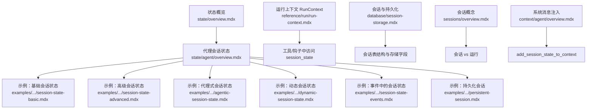
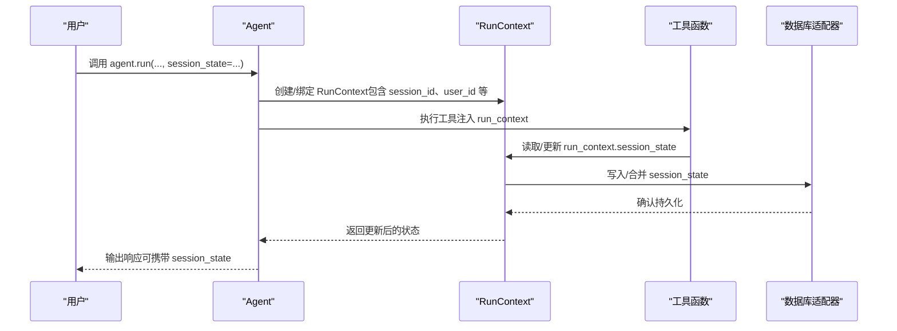
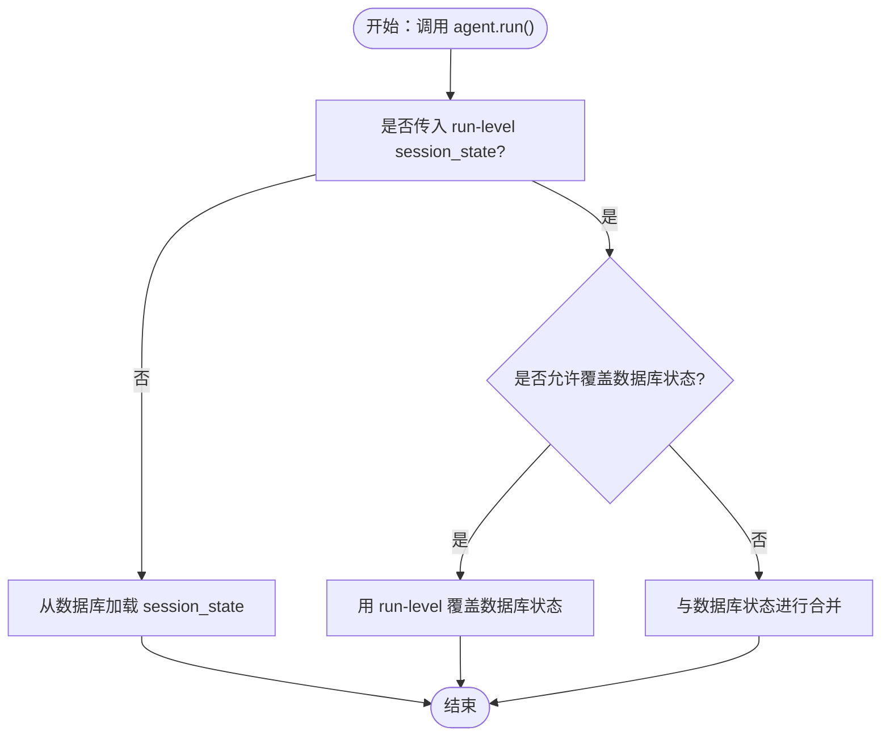
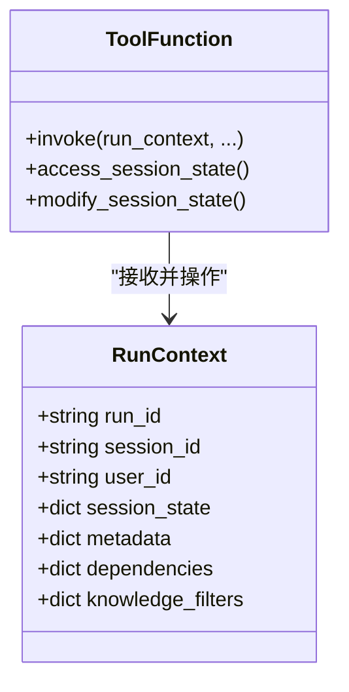
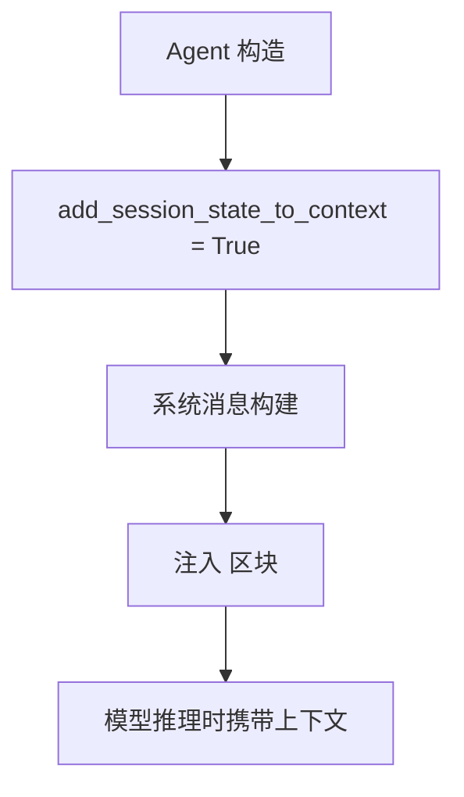
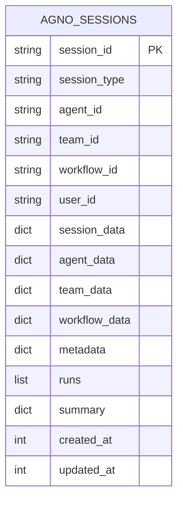
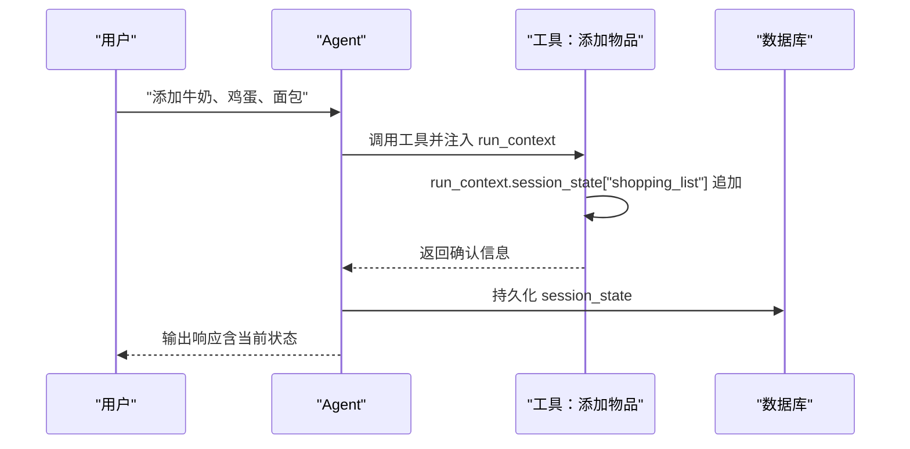
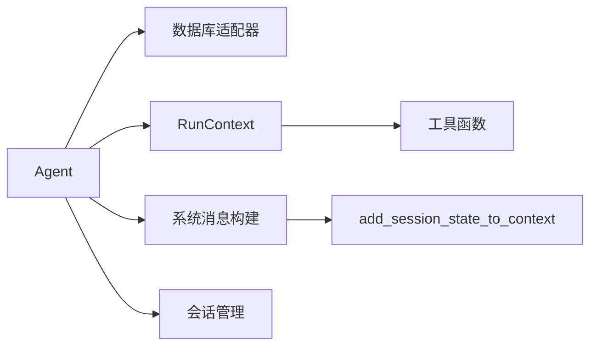

# 基础会话状态

<cite>
**本文引用的文件**
- [state/overview.mdx](file://state/overview.mdx)
- [state/agent/overview.mdx](file://state/agent/overview.mdx)
- [examples/agents/state-and-session/session-state-basic.mdx](file://examples/agents/state-and-session/session-state-basic.mdx)
- [examples/agents/state-and-session/session-state-advanced.mdx](file://examples/agents/state-and-session/session-state-advanced.mdx)
- [examples/agents/state-and-session/agentic-session-state.mdx](file://examples/agents/state-and-session/agentic-session-state.mdx)
- [examples/agents/state-and-session/persistent-session.mdx](file://examples/agents/state-and-session/persistent-session.mdx)
- [examples/agents/state-and-session/dynamic-session-state.mdx](file://examples/agents/state-and-session/dynamic-session-state.mdx)
- [examples/agents/state-and-session/session-state-events.mdx](file://examples/agents/state-and-session/session-state-events.mdx)
- [reference/run/run-context.mdx](file://reference/run/run-context.mdx)
- [database/session-storage.mdx](file://database/session-storage.mdx)
- [context/agent/overview.mdx](file://context/agent/overview.mdx)
- [sessions/overview.mdx](file://sessions/overview.mdx)
</cite>

## 目录
1. [简介](#简介)
2. [项目结构](#项目结构)
3. [核心组件](#核心组件)
4. [架构总览](#架构总览)
5. [详细组件分析](#详细组件分析)
6. [依赖关系分析](#依赖关系分析)
7. [性能考量](#性能考量)
8. [故障排查指南](#故障排查指南)
9. [结论](#结论)
10. [附录](#附录)

## 简介
本篇文档围绕“基础会话状态”展开，系统讲解如何在代理（Agent）中设置与使用会话状态（session_state），覆盖以下主题：
- 如何在 Agent 初始化时设置默认会话状态
- 在 agent.run() 中如何传递 session_state 及其优先级
- 在工具函数中通过 run_context.session_state 访问与修改状态
- 在系统消息中使用会话状态（变量替换语法与上下文注入）
- 状态持久化与数据库存储机制
- 实战示例：购物清单管理等场景

## 项目结构
与会话状态相关的内容主要分布在如下位置：
- 概览与概念：state/overview.mdx、state/agent/overview.mdx
- 示例：examples/agents/state-and-session/* 多个示例文档
- 运行时上下文：reference/run/run-context.mdx
- 会话与持久化：database/session-storage.mdx、sessions/overview.mdx
- 系统消息注入：context/agent/overview.mdx

**图表来源**
- [state/overview.mdx:1-80](file://state/overview.mdx#L1-L80)
- [state/agent/overview.mdx:1-306](file://state/agent/overview.mdx#L1-L306)
- [examples/agents/state-and-session/session-state-basic.mdx:1-70](file://examples/agents/state-and-session/session-state-basic.mdx#L1-L70)
- [examples/agents/state-and-session/session-state-advanced.mdx:1-124](file://examples/agents/state-and-session/session-state-advanced.mdx#L1-L124)
- [examples/agents/state-and-session/agentic-session-state.mdx:1-54](file://examples/agents/state-and-session/agentic-session-state.mdx#L1-L54)
- [examples/agents/state-and-session/dynamic-session-state.mdx:1-51](file://examples/agents/state-and-session/dynamic-session-state.mdx#L1-L51)
- [examples/agents/state-and-session/session-state-events.mdx:1-72](file://examples/agents/state-and-session/session-state-events.mdx#L1-L72)
- [examples/agents/state-and-session/persistent-session.mdx:1-50](file://examples/agents/state-and-session/persistent-session.mdx#L1-L50)
- [reference/run/run-context.mdx:1-22](file://reference/run/run-context.mdx#L1-L22)
- [database/session-storage.mdx:1-119](file://database/session-storage.mdx#L1-L119)
- [context/agent/overview.mdx:90-174](file://context/agent/overview.mdx#L90-L174)
- [sessions/overview.mdx:1-24](file://sessions/overview.mdx#L1-L24)

**章节来源**
- [state/overview.mdx:1-80](file://state/overview.mdx#L1-L80)
- [state/agent/overview.mdx:1-306](file://state/agent/overview.mdx#L1-L306)
- [reference/run/run-context.mdx:1-22](file://reference/run/run-context.mdx#L1-L22)
- [database/session-storage.mdx:1-119](file://database/session-storage.mdx#L1-L119)
- [context/agent/overview.mdx:90-174](file://context/agent/overview.mdx#L90-L174)
- [sessions/overview.mdx:1-24](file://sessions/overview.mdx#L1-L24)

## 核心组件
- 会话状态（session_state）：字典型数据，贯穿一次或多轮会话，跨 run 持久化
- RunContext：在工具、钩子等运行期可访问的上下文对象，包含 session_state
- 数据库适配器：用于会话与状态的持久化存储（如 SQLite、PostgreSQL、JSON 文件等）
- 系统消息注入：通过 add_session_state_to_context 将 session_state 注入到系统提示词中

要点：
- 默认状态：在 Agent 构造时通过 session_state 参数传入
- 运行期覆盖：在 agent.run() 中传入 session_state 会覆盖默认状态（默认合并策略；可通过参数控制覆盖行为）
- 工具访问：工具函数通过 run_context.session_state 读写状态
- 系统消息：在 instructions/description 中使用 {key} 语法引用 session_state 字段
- 持久化：启用数据库后，状态自动保存与加载

**章节来源**
- [state/overview.mdx:8-44](file://state/overview.mdx#L8-L44)
- [state/agent/overview.mdx:25-34](file://state/agent/overview.mdx#L25-L34)
- [reference/run/run-context.mdx:10-22](file://reference/run/run-context.mdx#L10-L22)
- [context/agent/overview.mdx:117-166](file://context/agent/overview.mdx#L117-L166)

## 架构总览
下图展示了从调用 agent.run() 到工具执行再到状态持久化的整体流程。

**图表来源**
- [state/agent/overview.mdx:29-34](file://state/agent/overview.mdx#L29-L34)
- [reference/run/run-context.mdx:13-22](file://reference/run/run-context.mdx#L13-L22)
- [database/session-storage.mdx:30-51](file://database/session-storage.mdx#L30-L51)

## 详细组件分析

### 组件一：默认状态与初始化
- 默认状态：在 Agent 构造时通过 session_state 设置初始值，作为新会话的起点
- 适用场景：为所有会话提供一致的初始状态（如空购物清单、用户档案等）

实践要点：
- 使用字典类型定义默认字段
- 在系统消息中直接引用 {key}，无需 f-string

**章节来源**
- [state/overview.mdx:21-44](file://state/overview.mdx#L21-L44)
- [state/agent/overview.mdx:29-34](file://state/agent/overview.mdx#L29-L34)

### 组件二：在 agent.run() 中传递 session_state 的优先级
- 优先级顺序（默认合并策略）：
  1) 数据库中已存在的 session_state
  2) 传入 agent.run() 的 session_state（默认与已有状态合并）
- 可选覆盖行为：通过参数允许以运行时传入的状态完全覆盖数据库中的状态

**图表来源**
- [state/agent/overview.mdx:260-299](file://state/agent/overview.mdx#L260-L299)

**章节来源**
- [state/agent/overview.mdx:260-299](file://state/agent/overview.mdx#L260-L299)

### 组件三：在工具函数中通过 run_context.session_state 访问与修改
- 工具签名：run_context 作为第一个参数自动注入
- 安全访问：若 run_context.session_state 为空，可在工具内初始化为空字典
- 修改即持久化：对 run_context.session_state 的任何修改都会在本次会话中持久化

**图表来源**
- [reference/run/run-context.mdx:13-22](file://reference/run/run-context.mdx#L13-L22)
- [examples/agents/state-and-session/session-state-basic.mdx:21-28](file://examples/agents/state-and-session/session-state-basic.mdx#L21-L28)

**章节来源**
- [reference/run/run-context.mdx:10-22](file://reference/run/run-context.mdx#L10-L22)
- [examples/agents/state-and-session/session-state-basic.mdx:21-28](file://examples/agents/state-and-session/session-state-basic.mdx#L21-L28)
- [examples/agents/state-and-session/session-state-advanced.mdx:24-64](file://examples/agents/state-and-session/session-state-advanced.mdx#L24-L64)

### 组件四：在系统消息中使用会话状态（变量替换与上下文注入）
- 变量替换语法：在 instructions/description 中使用 {key} 引用 session_state 字段
- 上下文注入：开启 add_session_state_to_context 后，会话状态会被注入到系统消息中
- 注意：不要使用 f-string，框架负责替换

**图表来源**
- [context/agent/overview.mdx:117-166](file://context/agent/overview.mdx#L117-L166)
- [state/agent/overview.mdx:200-228](file://state/agent/overview.mdx#L200-L228)

**章节来源**
- [context/agent/overview.mdx:117-166](file://context/agent/overview.mdx#L117-L166)
- [state/agent/overview.mdx:200-228](file://state/agent/overview.mdx#L200-L228)

### 组件五：状态持久化与数据库存储机制
- 存储位置：每个会话对应一条记录，包含 session_id、session_type、user_id、session_data、runs 等字段
- 表结构：默认表名为 agno_sessions，可通过参数自定义
- 适用范围：Agent/Team/Workflow 均支持会话存储
- 存取方式：通过 get_session() 获取会话；状态随 run 自动持久化

**图表来源**
- [database/session-storage.mdx:30-51](file://database/session-storage.mdx#L30-L51)

**章节来源**
- [database/session-storage.mdx:7-119](file://database/session-storage.mdx#L7-L119)
- [sessions/overview.mdx:8-24](file://sessions/overview.mdx#L8-L24)

### 组件六：实战示例（购物清单管理）
- 基础示例：在工具中追加/移除/列出物品，并在系统消息中展示当前清单
- 高级示例：在工具中显式检查并初始化 run_context.session_state
- 代理式会话状态：启用 enable_agentic_state，让代理自动维护状态
- 动态会话状态：在钩子中根据参数动态更新状态
- 事件流：通过流式事件获取最终 session_state

**图表来源**
- [examples/agents/state-and-session/session-state-basic.mdx:21-56](file://examples/agents/state-and-session/session-state-basic.mdx#L21-L56)
- [examples/agents/state-and-session/session-state-advanced.mdx:24-110](file://examples/agents/state-and-session/session-state-advanced.mdx#L24-L110)
- [examples/agents/state-and-session/agentic-session-state.mdx:23-40](file://examples/agents/state-and-session/agentic-session-state.mdx#L23-L40)
- [examples/agents/state-and-session/dynamic-session-state.mdx:42-51](file://examples/agents/state-and-session/dynamic-session-state.mdx#L42-L51)
- [examples/agents/state-and-session/session-state-events.mdx:50-58](file://examples/agents/state-and-session/session-state-events.mdx#L50-L58)

**章节来源**
- [examples/agents/state-and-session/session-state-basic.mdx:1-70](file://examples/agents/state-and-session/session-state-basic.mdx#L1-L70)
- [examples/agents/state-and-session/session-state-advanced.mdx:1-124](file://examples/agents/state-and-session/session-state-advanced.mdx#L1-L124)
- [examples/agents/state-and-session/agentic-session-state.mdx:1-54](file://examples/agents/state-and-session/agentic-session-state.mdx#L1-L54)
- [examples/agents/state-and-session/dynamic-session-state.mdx:1-51](file://examples/agents/state-and-session/dynamic-session-state.mdx#L1-L51)
- [examples/agents/state-and-session/session-state-events.mdx:1-72](file://examples/agents/state-and-session/session-state-events.mdx#L1-L72)

## 依赖关系分析
- Agent 依赖数据库适配器以实现会话与状态持久化
- 工具函数依赖 RunContext 提供的 session_state
- 系统消息构建依赖 add_session_state_to_context 开关
- 会话生命周期由 sessions/overview.mdx 描述

**图表来源**
- [state/agent/overview.mdx:29-34](file://state/agent/overview.mdx#L29-L34)
- [reference/run/run-context.mdx:13-22](file://reference/run/run-context.mdx#L13-L22)
- [context/agent/overview.mdx:117-166](file://context/agent/overview.mdx#L117-L166)
- [sessions/overview.mdx:8-24](file://sessions/overview.mdx#L8-L24)

**章节来源**
- [state/agent/overview.mdx:29-34](file://state/agent/overview.mdx#L29-L34)
- [reference/run/run-context.mdx:13-22](file://reference/run/run-context.mdx#L13-L22)
- [context/agent/overview.mdx:117-166](file://context/agent/overview.mdx#L117-L166)
- [sessions/overview.mdx:8-24](file://sessions/overview.mdx#L8-L24)

## 性能考量
- 并发写入：在并行步骤中更新共享状态需注意并发冲突与协调
- 序列化开销：状态越大，序列化/反序列化与数据库往返越昂贵
- 查询与索引：合理设计 session_id、user_id 等字段的索引可提升检索效率
- 历史与状态分离：仅持久化必要消息，避免无谓膨胀

[本节为通用建议，不直接分析具体文件]

## 故障排查指南
- 症状：工具中访问 session_state 报错或为空
  - 排查：在工具内显式初始化 run_context.session_state = {}，确保键存在
  - 参考：基础与高级示例中对 None 的处理
- 症状：系统消息未显示最新状态
  - 排查：确认已开启 add_session_state_to_context；检查 {key} 语法是否正确
- 症状：状态未持久化或被覆盖
  - 排查：检查是否传入了 run-level session_state；如需覆盖，确认相关参数已启用
- 症状：并发步骤导致竞态
  - 排查：在并行步骤中更新状态时增加锁或串行化策略

**章节来源**
- [examples/agents/state-and-session/session-state-basic.mdx:21-28](file://examples/agents/state-and-session/session-state-basic.mdx#L21-L28)
- [examples/agents/state-and-session/session-state-advanced.mdx:24-64](file://examples/agents/state-and-session/session-state-advanced.mdx#L24-L64)
- [state/agent/overview.mdx:260-299](file://state/agent/overview.mdx#L260-L299)
- [workflows/workflow-patterns/parallel-workflow.mdx:44-46](file://workflows/workflow-patterns/parallel-workflow.mdx#L44-L46)

## 结论
- 会话状态是跨 run 的持久化上下文，适合管理用户偏好、任务进度、购物清单等
- 默认状态在 Agent 初始化时设定，运行时可通过 agent.run() 覆盖或合并
- 工具通过 run_context.session_state 访问与修改状态，修改即时生效并持久化
- 系统消息可通过 add_session_state_to_context 注入 session_state，实现“上下文感知”的智能回复
- 数据库存储提供可靠的会话与状态持久化能力，支持多类数据库适配器

[本节为总结性内容，不直接分析具体文件]

## 附录
- 相关参考路径
  - [RunContext 属性说明:13-22](file://reference/run/run-context.mdx#L13-L22)
  - [会话与持久化存储:7-119](file://database/session-storage.mdx#L7-L119)
  - [会话概念与生命周期:8-24](file://sessions/overview.mdx#L8-L24)
  - [系统消息构建与注入:117-166](file://context/agent/overview.mdx#L117-L166)

[本节为补充信息，不直接分析具体文件]