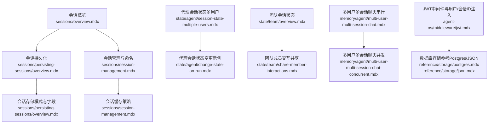
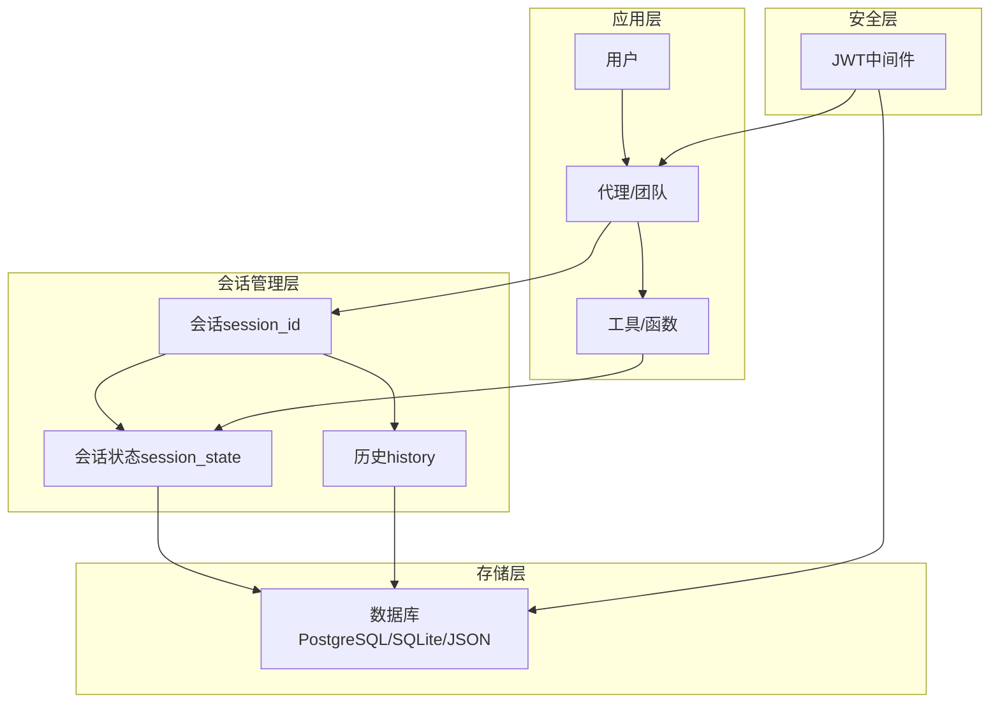
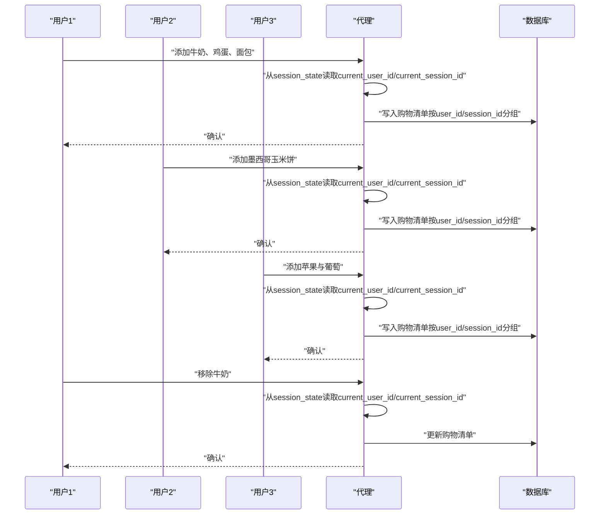
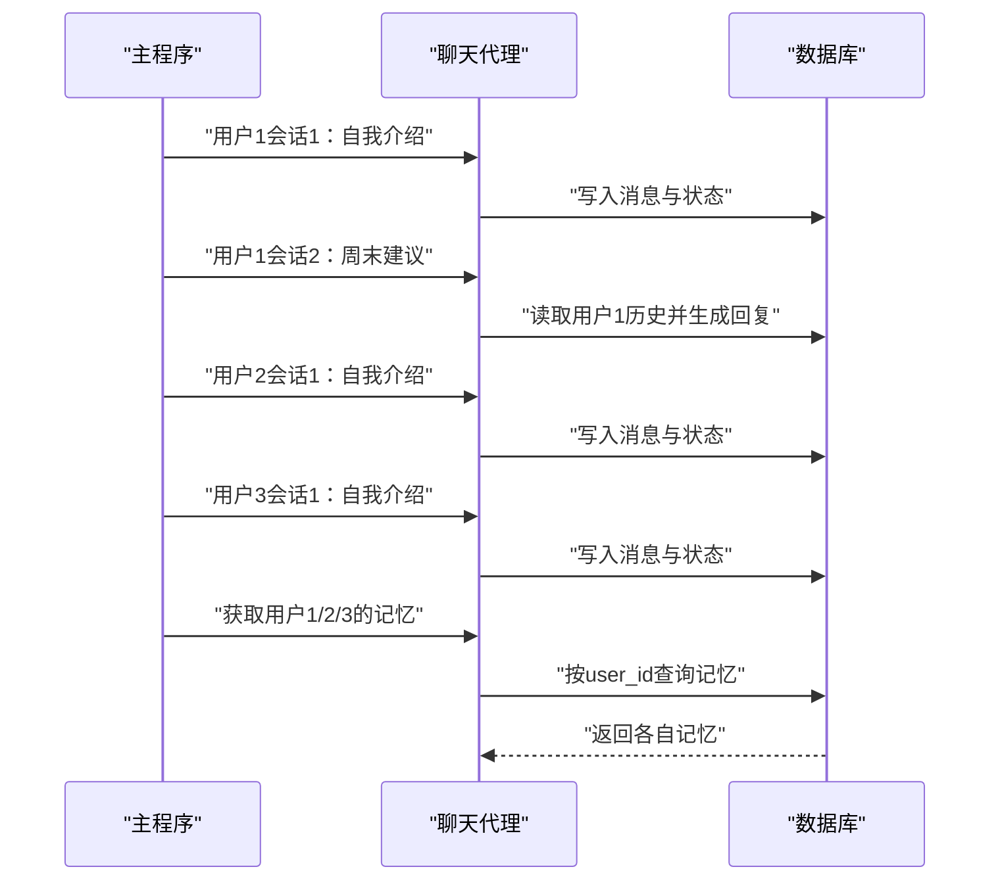
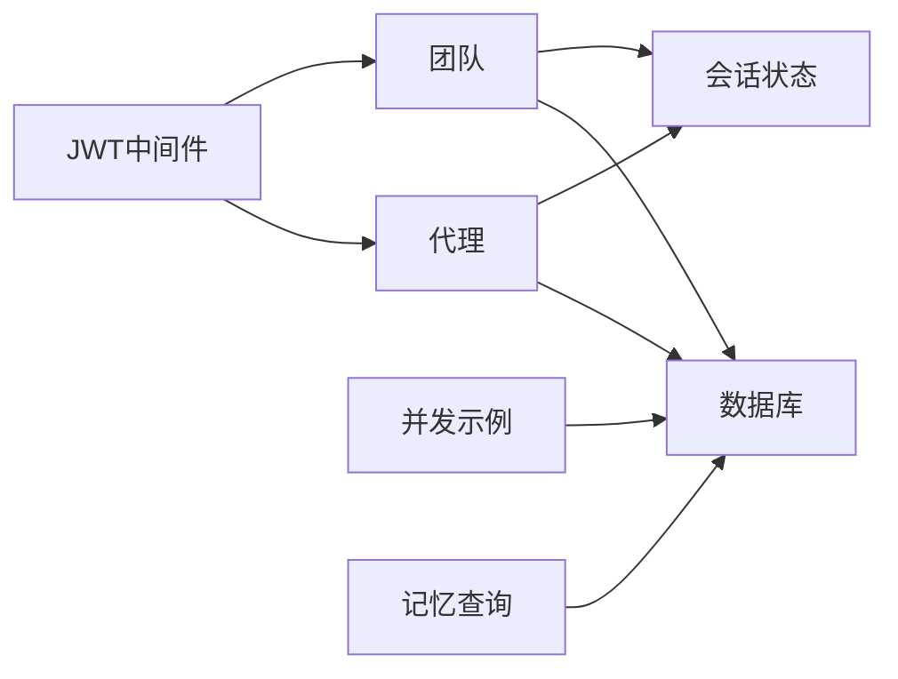

# 多用户会话状态

<cite>
**本文引用的文件**
- [sessions/overview.mdx](file://sessions/overview.mdx)
- [sessions/persisting-sessions/overview.mdx](file://sessions/persisting-sessions/overview.mdx)
- [sessions/session-management.mdx](file://sessions/session-management.mdx)
- [state/agent/session-state-multiple-users.mdx](file://state/agent/session-state-multiple-users.mdx)
- [state/agent/change-state-on-run.mdx](file://state/agent/change-state-on-run.mdx)
- [state/team/overview.mdx](file://state/team/overview.mdx)
- [memory/agent/multi-user-multi-session-chat.mdx](file://memory/agent/multi-user-multi-session-chat.mdx)
- [memory/agent/multi-user-multi-session-chat-concurrent.mdx](file://memory/agent/multi-user-multi-session-chat-concurrent.mdx)
- [examples/agents/state-and-session/last-n-session-messages.mdx](file://examples/agents/state-and-session/last-n-session-messages.mdx)
- [agent-os/middleware/jwt.mdx](file://agent-os/middleware/jwt.mdx)
- [reference/storage/postgres.mdx](file://reference/storage/postgres.mdx)
- [reference/storage/json.mdx](file://reference/storage/json.mdx)
</cite>

## 目录
1. [简介](#简介)
2. [项目结构](#项目结构)
3. [核心组件](#核心组件)
4. [架构总览](#架构总览)
5. [详细组件分析](#详细组件分析)
6. [依赖关系分析](#依赖关系分析)
7. [性能考量](#性能考量)
8. [故障排查指南](#故障排查指南)
9. [结论](#结论)
10. [附录](#附录)

## 简介
本技术文档围绕代理多用户会话状态管理展开，系统阐述在多用户环境中如何通过用户ID与会话ID实现独立且隔离的会话状态管理；详解session_id参数在用户状态隔离中的作用、配置方法与最佳实践；覆盖状态继承与重置策略；解释用户状态之间的隔离机制与安全考虑；并提供完整示例路径，展示如何为不同用户维护独立的状态数据；同时包含性能优化与数据库查询策略建议，以及团队协作场景下多用户状态的共享与同步机制。

## 项目结构
本仓库提供了丰富的会话与状态管理示例与参考文档，涉及：
- 会话概述与多用户会话概念
- 会话持久化与存储方案
- 会话命名、缓存与性能优化
- 代理与团队的会话状态管理
- 多用户并发会话与记忆（memory）示例
- 安全中间件（JWT）对用户ID与会话ID的自动注入与过滤能力
- 数据库存储（PostgreSQL、JSON等）的参数与使用

图表来源
- [sessions/overview.mdx:1-87](file://sessions/overview.mdx#L1-L87)
- [sessions/persisting-sessions/overview.mdx:1-124](file://sessions/persisting-sessions/overview.mdx#L1-L124)
- [sessions/session-management.mdx:1-189](file://sessions/session-management.mdx#L1-L189)
- [state/agent/session-state-multiple-users.mdx:1-172](file://state/agent/session-state-multiple-users.mdx#L1-L172)
- [state/agent/change-state-on-run.mdx:1-41](file://state/agent/change-state-on-run.mdx#L1-L41)
- [state/team/overview.mdx:1-357](file://state/team/overview.mdx#L1-L357)
- [memory/agent/multi-user-multi-session-chat.mdx:1-139](file://memory/agent/multi-user-multi-session-chat.mdx#L1-L139)
- [memory/agent/multi-user-multi-session-chat-concurrent.mdx:1-152](file://memory/agent/multi-user-multi-session-chat-concurrent.mdx#L1-L152)
- [agent-os/middleware/jwt.mdx:145-176](file://agent-os/middleware/jwt.mdx#L145-L176)
- [reference/storage/postgres.mdx:1-9](file://reference/storage/postgres.mdx#L1-L9)
- [reference/storage/json.mdx:1-8](file://reference/storage/json.mdx#L1-L8)

章节来源
- [sessions/overview.mdx:1-87](file://sessions/overview.mdx#L1-L87)
- [sessions/persisting-sessions/overview.mdx:1-124](file://sessions/persisting-sessions/overview.mdx#L1-L124)
- [sessions/session-management.mdx:1-189](file://sessions/session-management.mdx#L1-L189)
- [state/agent/session-state-multiple-users.mdx:1-172](file://state/agent/session-state-multiple-users.mdx#L1-L172)
- [state/agent/change-state-on-run.mdx:1-41](file://state/agent/change-state-on-run.mdx#L1-L41)
- [state/team/overview.mdx:1-357](file://state/team/overview.mdx#L1-L357)
- [memory/agent/multi-user-multi-session-chat.mdx:1-139](file://memory/agent/multi-user-multi-session-chat.mdx#L1-L139)
- [memory/agent/multi-user-multi-session-chat-concurrent.mdx:1-152](file://memory/agent/multi-user-multi-session-chat-concurrent.mdx#L1-L152)
- [agent-os/middleware/jwt.mdx:145-176](file://agent-os/middleware/jwt.mdx#L145-L176)
- [reference/storage/postgres.mdx:1-9](file://reference/storage/postgres.mdx#L1-L9)
- [reference/storage/json.mdx:1-8](file://reference/storage/json.mdx#L1-L8)

## 核心组件
- 会话（Session）：由唯一session_id标识的多轮对话线程，包含运行记录、历史、状态与指标。
- 用户（User）：由user_id区分不同使用者。
- 会话状态（Session State）：可持久化的键值数据，贯穿同一会话的多次运行。
- 团队共享状态（Team Shared State）：跨团队成员共享与同步的状态。
- 存储后端（Database）：用于持久化消息、运行元数据、会话状态等，支持PostgreSQL、SQLite、InMemoryDb、JSON等。

章节来源
- [sessions/overview.mdx:12-28](file://sessions/overview.mdx#L12-L28)
- [sessions/persisting-sessions/overview.mdx:63-73](file://sessions/persisting-sessions/overview.mdx#L63-L73)
- [state/team/overview.mdx:14-28](file://state/team/overview.mdx#L14-L28)

## 架构总览
下图展示了多用户会话状态管理的整体架构：用户通过user_id与session_id参与会话；会话状态与历史由数据库持久化；团队可共享状态；JWT中间件可自动注入user_id与session_id并进行安全校验。

图表来源
- [sessions/overview.mdx:12-28](file://sessions/overview.mdx#L12-L28)
- [sessions/persisting-sessions/overview.mdx:63-110](file://sessions/persisting-sessions/overview.mdx#L63-L110)
- [state/team/overview.mdx:14-57](file://state/team/overview.mdx#L14-L57)
- [agent-os/middleware/jwt.mdx:145-176](file://agent-os/middleware/jwt.mdx#L145-L176)
- [reference/storage/postgres.mdx:1-9](file://reference/storage/postgres.mdx#L1-L9)
- [reference/storage/json.mdx:1-8](file://reference/storage/json.mdx#L1-L8)

## 详细组件分析

### 会话与会话ID的作用与配置
- 会话ID（session_id）是会话的唯一标识，用于将一次或多次运行串联为一个连续的对话线程。
- 在多用户场景中，结合user_id可区分不同用户的会话线程；每个用户可拥有多个会话（session_id）。
- 配置方式：
  - 不指定时，框架自动生成session_id与run_id；
  - 指定session_id可复用同一会话；
  - 使用user_id区分用户；
  - 可通过会话管理接口设置名称、自动命名与缓存。

章节来源
- [sessions/overview.mdx:12-28](file://sessions/overview.mdx#L12-L28)
- [sessions/persisting-sessions/overview.mdx:38-61](file://sessions/persisting-sessions/overview.mdx#L38-L61)
- [sessions/session-management.mdx:10-47](file://sessions/session-management.mdx#L10-L47)

### 多用户会话状态隔离与继承
- 隔离机制：
  - user_id区分用户；
  - session_id区分同一用户的不同会话；
  - 同一session_id内的状态在运行间继承；
  - 不同session_id或不同user_id之间状态隔离。
- 继承与重置：
  - 在同一会话内，session_state会在运行间自动加载与保存；
  - 切换到新的session_id即开始新会话，状态重置；
  - 可通过传入新的session_state进行覆盖或合并（取决于overwrite_db_session_state配置）。

章节来源
- [sessions/overview.mdx:49-57](file://sessions/overview.mdx#L49-L57)
- [state/agent/change-state-on-run.mdx:1-41](file://state/agent/change-state-on-run.mdx#L1-L41)
- [state/team/overview.mdx:237-307](file://state/team/overview.mdx#L237-L307)

### 代理多用户会话状态示例
该示例演示了如何为不同用户维护独立的购物清单（按user_id与session_id组织），并在工具函数中通过run_context.session_state访问当前用户与会话ID，实现状态隔离与继承。

图表来源
- [state/agent/session-state-multiple-users.mdx:35-81](file://state/agent/session-state-multiple-users.mdx#L35-L81)

章节来源
- [state/agent/session-state-multiple-users.mdx:1-172](file://state/agent/session-state-multiple-users.mdx#L1-L172)

### 团队会话状态与成员交互共享
- 团队共享状态：通过Team构造函数的session_state初始化共享数据，成员可在工具中读写run_context.session_state；
- 成员交互共享：开启share_member_interactions后，团队成员在同一次运行中可看到彼此的输出，避免重复工作；
- 状态继承与重置：与代理类似，同一session_id内状态继承，切换session_id即重置。

章节来源
- [state/team/overview.mdx:14-57](file://state/team/overview.mdx#L14-L57)
- [state/team/overview.mdx:309-351](file://state/team/overview.mdx#L309-L351)

### 多用户多会话聊天（串行与并发）
- 串行示例：在同一进程中依次与三个用户进行不同会话，验证每个用户的历史与记忆相互隔离；
- 并发示例：使用异步并发与get_user_memories验证多用户记忆的隔离性。

图表来源
- [memory/agent/multi-user-multi-session-chat.mdx:44-91](file://memory/agent/multi-user-multi-session-chat.mdx#L44-L91)
- [memory/agent/multi-user-multi-session-chat-concurrent.mdx:87-102](file://memory/agent/multi-user-multi-session-chat-concurrent.mdx#L87-L102)

章节来源
- [memory/agent/multi-user-multi-session-chat.mdx:1-139](file://memory/agent/multi-user-multi-session-chat.mdx#L1-L139)
- [memory/agent/multi-user-multi-session-chat-concurrent.mdx:1-152](file://memory/agent/multi-user-multi-session-chat-concurrent.mdx#L1-L152)

### 会话历史检索与用户范围限制
- 示例展示了不同用户在不同会话中提问，系统仅返回该用户自身的会话历史，体现用户范围的隔离与检索控制。

章节来源
- [examples/agents/state-and-session/last-n-session-messages.mdx:38-73](file://examples/agents/state-and-session/last-n-session-messages.mdx#L38-L73)

### 安全与隔离：JWT中间件
- 自动注入user_id与session_id：当启用JWT中间件时，可从令牌中提取这些标识符并自动注入到运行上下文；
- 过滤与授权：可基于user_id过滤会话列表，配合RBAC进行授权；
- 安全建议：签名验证、受众校验、Cookie安全属性（HttpOnly、Secure、SameSite）。

章节来源
- [agent-os/middleware/jwt.mdx:145-176](file://agent-os/middleware/jwt.mdx#L145-L176)

### 存储与会话持久化
- 支持多种数据库后端：PostgreSQL（推荐）、SQLite、InMemoryDb、JSON；
- 会话存储字段：session_id、session_type、agent_id/team_id/workflow_id、user_id、session_data、agent_data、team_data、workflow_data、metadata、runs、summary、created_at、updated_at；
- 存储内容：消息、运行元数据、会话状态、工具调用、媒体等（可配置）。

章节来源
- [sessions/persisting-sessions/overview.mdx:28-73](file://sessions/persisting-sessions/overview.mdx#L28-L73)
- [sessions/persisting-sessions/overview.mdx:89-110](file://sessions/persisting-sessions/overview.mdx#L89-L110)
- [reference/storage/postgres.mdx:1-9](file://reference/storage/postgres.mdx#L1-L9)
- [reference/storage/json.mdx:1-8](file://reference/storage/json.mdx#L1-L8)

## 依赖关系分析
- 会话与状态管理依赖数据库后端以实现持久化；
- 代理与团队均支持session_state参数与运行时状态读写；
- JWT中间件为会话注入user_id与session_id，增强安全与隔离；
- 多用户并发示例依赖异步运行与数据库查询。

图表来源
- [state/team/overview.mdx:14-57](file://state/team/overview.mdx#L14-L57)
- [memory/agent/multi-user-multi-session-chat-concurrent.mdx:87-102](file://memory/agent/multi-user-multi-session-chat-concurrent.mdx#L87-L102)
- [agent-os/middleware/jwt.mdx:145-176](file://agent-os/middleware/jwt.mdx#L145-L176)

章节来源
- [state/team/overview.mdx:14-57](file://state/team/overview.mdx#L14-L57)
- [memory/agent/multi-user-multi-session-chat-concurrent.mdx:87-102](file://memory/agent/multi-user-multi-session-chat-concurrent.mdx#L87-L102)
- [agent-os/middleware/jwt.mdx:145-176](file://agent-os/middleware/jwt.mdx#L145-L176)

## 性能考量
- 会话缓存：cache_session=True可将会话对象缓存在内存中，减少数据库往返，适用于长对话与高延迟数据库场景；
- 延迟生成会话名称：在对话有一定上下文后再自动生成名称，避免过早模型调用；
- 批量处理：对大量会话批量生成名称时需考虑模型调用成本与延迟；
- 数据库选择：生产环境推荐PostgreSQL，具备JSONB、索引与连接池优化能力。

章节来源
- [sessions/session-management.mdx:140-189](file://sessions/session-management.mdx#L140-L189)
- [sessions/session-management.mdx:106-138](file://sessions/session-management.mdx#L106-L138)
- [reference/storage/postgres.mdx:1-9](file://reference/storage/postgres.mdx#L1-L9)

## 故障排查指南
- 无持久化：未配置数据库时，session_id仅存在于单次运行，无法继续对话；请配置数据库（如InMemoryDb用于测试）。
- 状态未继承：确保使用相同的session_id；若切换到新的session_id，状态将重置。
- 覆盖策略：默认合并session_state，如需完全覆盖，请启用overwrite_db_session_state。
- 并发冲突：并发运行时注意数据库连接与事务隔离；必要时增加连接池与索引。
- 安全问题：启用JWT验证与受众校验，使用安全Cookie属性，防止XSS与CSRF。

章节来源
- [sessions/overview.mdx:22-28](file://sessions/overview.mdx#L22-L28)
- [sessions/persisting-sessions/overview.mdx:14-26](file://sessions/persisting-sessions/overview.mdx#L14-L26)
- [state/agent/change-state-on-run.mdx:268-307](file://state/agent/change-state-on-run.mdx#L268-L307)
- [agent-os/middleware/jwt.mdx:158-174](file://agent-os/middleware/jwt.mdx#L158-L174)

## 结论
通过明确区分user_id与session_id，结合数据库持久化与会话状态管理，Agno实现了可靠的多用户会话状态隔离与继承。团队共享状态与成员交互共享进一步增强了协作效率。JWT中间件为会话注入与安全控制提供了便利。在生产环境中，建议采用PostgreSQL作为存储后端，并结合会话缓存与命名策略提升性能与可用性。

## 附录
- 示例路径（不直接展示代码内容）：
  - [代理多用户会话状态示例:1-172](file://state/agent/session-state-multiple-users.mdx#L1-L172)
  - [代理会话状态变更示例:1-41](file://state/agent/change-state-on-run.mdx#L1-L41)
  - [团队会话状态与共享示例:64-160](file://state/team/overview.mdx#L64-L160)
  - [多用户多会话聊天（串行）:1-139](file://memory/agent/multi-user-multi-session-chat.mdx#L1-L139)
  - [多用户多会话聊天（并发）:1-152](file://memory/agent/multi-user-multi-session-chat-concurrent.mdx#L1-L152)
  - [JWT中间件与会话注入:145-176](file://agent-os/middleware/jwt.mdx#L145-L176)
  - [PostgreSQL存储参考:1-9](file://reference/storage/postgres.mdx#L1-L9)
  - [JSON存储参考:1-8](file://reference/storage/json.mdx#L1-L8)