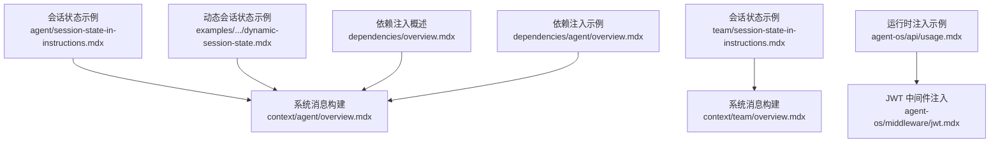
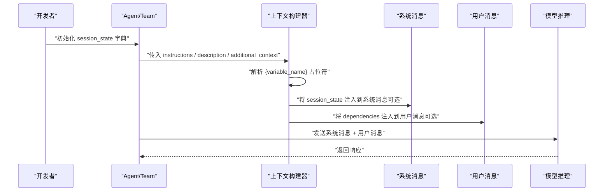
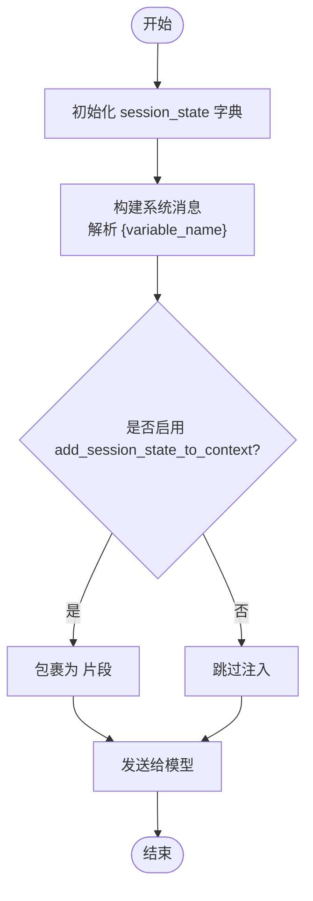
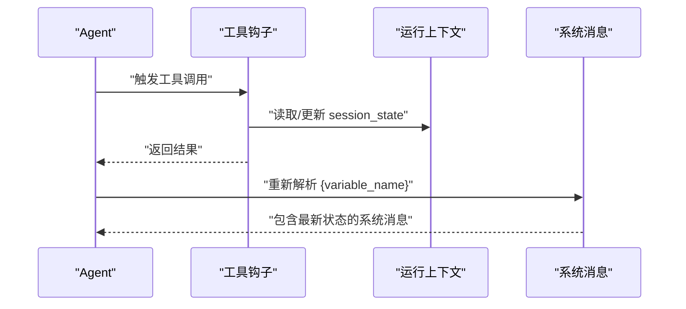
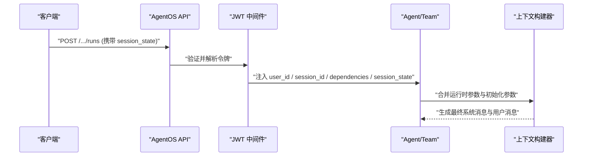
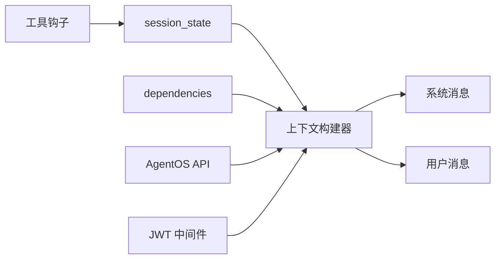

# 指令中的会话状态

<cite>
**本文档引用的文件**
- [state/agent/session-state-in-instructions.mdx](file://state/agent/session-state-in-instructions.mdx)
- [state/team/session-state-in-instructions.mdx](file://state/team/session-state-in-instructions.mdx)
- [examples/agents/state-and-session/session-state-basic.mdx](file://examples/agents/state-and-session/session-state-basic.mdx)
- [examples/agents/state-and-session/session-state-advanced.mdx](file://examples/agents/state-and-session/session-state-advanced.mdx)
- [examples/agents/state-and-session/dynamic-session-state.mdx](file://examples/agents/state-and-session/dynamic-session-state.mdx)
- [examples/agents/context-management/instructions-with-state.mdx](file://examples/agents/context-management/instructions-with-state.mdx)
- [context/agent/overview.mdx](file://context/agent/overview.mdx)
- [context/team/overview.mdx](file://context/team/overview.mdx)
- [agent-os/middleware/jwt.mdx](file://agent-os/middleware/jwt.mdx)
- [agent-os/api/usage.mdx](file://agent-os/api/usage.mdx)
- [dependencies/overview.mdx](file://dependencies/overview.mdx)
- [dependencies/agent/overview.mdx](file://dependencies/agent/overview.mdx)
</cite>

## 目录
1. [简介](#简介)
2. [项目结构](#项目结构)
3. [核心组件](#核心组件)
4. [架构总览](#架构总览)
5. [详细组件分析](#详细组件分析)
6. [依赖关系分析](#依赖关系分析)
7. [性能考虑](#性能考虑)
8. [故障排查指南](#故障排查指南)
9. [结论](#结论)
10. [附录](#附录)

## 简介
本文件聚焦于“代理指令中的会话状态”使用，系统性阐述如何在代理与团队的系统指令（System Message）与用户消息（User Message）中引用会话状态变量，规范状态变量替换语法（如 {variable_name}），说明其在指令描述与指令文本中的不同应用场景，以及在模型推理前的变量注入时机与执行顺序。同时提供多类示例路径，覆盖静态初始化、动态更新、工具钩子、运行时注入等场景，并讨论不同模型提供商之间的兼容性与限制。

## 项目结构
围绕“会话状态在指令中”的主题，相关文档分布在以下区域：
- 会话状态在指令中的基础用法：agent 与 team 的示例
- 动态会话状态：通过工具钩子或运行上下文在推理前更新
- 指令构建与上下文工程：系统消息与用户消息如何整合会话状态
- 运行时参数注入：通过 API 或中间件将 session_state 注入到请求上下文中
- 依赖注入对比：与 dependencies 的模板替换机制进行对照

**图表来源**
- [state/agent/session-state-in-instructions.mdx:1-47](file://state/agent/session-state-in-instructions.mdx#L1-L47)
- [state/team/session-state-in-instructions.mdx:1-47](file://state/team/session-state-in-instructions.mdx#L1-L47)
- [context/agent/overview.mdx:1-523](file://context/agent/overview.mdx#L1-L523)
- [context/team/overview.mdx:1-700](file://context/team/overview.mdx#L1-L700)
- [examples/agents/state-and-session/dynamic-session-state.mdx:1-116](file://examples/agents/state-and-session/dynamic-session-state.mdx#L1-L116)
- [agent-os/api/usage.mdx:20-60](file://agent-os/api/usage.mdx#L20-L60)
- [agent-os/middleware/jwt.mdx:140-146](file://agent-os/middleware/jwt.mdx#L140-L146)
- [dependencies/overview.mdx:35-67](file://dependencies/overview.mdx#L35-L67)
- [dependencies/agent/overview.mdx:1-82](file://dependencies/agent/overview.mdx#L1-L82)

**章节来源**
- [state/agent/session-state-in-instructions.mdx:1-47](file://state/agent/session-state-in-instructions.mdx#L1-L47)
- [state/team/session-state-in-instructions.mdx:1-47](file://state/team/session-state-in-instructions.mdx#L1-L47)
- [context/agent/overview.mdx:1-523](file://context/agent/overview.mdx#L1-L523)
- [context/team/overview.mdx:1-700](file://context/team/overview.mdx#L1-L700)
- [agent-os/api/usage.mdx:20-60](file://agent-os/api/usage.mdx#L20-L60)
- [agent-os/middleware/jwt.mdx:140-146](file://agent-os/middleware/jwt.mdx#L140-L146)
- [dependencies/overview.mdx:35-67](file://dependencies/overview.mdx#L35-L67)
- [dependencies/agent/overview.mdx:1-82](file://dependencies/agent/overview.mdx#L1-L82)

## 核心组件
- 会话状态（session_state）
  - 在 agent/team 初始化时以字典形式传入，键名即为模板变量名
  - 支持在 instructions、description、additional_context 等系统消息片段中使用 {key} 语法
  - 可通过工具钩子或运行上下文在推理前动态更新
- 指令构建（System Message）
  - 系统消息由 description、instructions、additional_information、expected_output 等拼装
  - 当开启 add_session_state_to_context 时，会话状态将以 <session_state> 包裹的形式注入到系统消息末尾
- 用户消息（User Message）
  - 默认直接使用输入文本；可通过 add_dependencies_to_context 将 dependencies 注入到用户消息的附加上下文中
- 运行时注入
  - 通过 AgentOS API 或 JWT 中间件，将 session_state、dependencies、metadata 等作为运行参数注入到请求上下文

**章节来源**
- [context/agent/overview.mdx:70-90](file://context/agent/overview.mdx#L70-L90)
- [context/team/overview.mdx:134-164](file://context/team/overview.mdx#L134-L164)
- [agent-os/api/usage.mdx:20-60](file://agent-os/api/usage.mdx#L20-L60)
- [agent-os/middleware/jwt.mdx:140-146](file://agent-os/middleware/jwt.mdx#L140-L146)

## 架构总览
下图展示了“会话状态在指令中的生命周期”，从初始化到模型推理前的注入与替换：

**图表来源**
- [context/agent/overview.mdx:165-166](file://context/agent/overview.mdx#L165-L166)
- [context/team/overview.mdx:282-283](file://context/team/overview.mdx#L282-L283)
- [dependencies/overview.mdx:35-67](file://dependencies/overview.mdx#L35-L67)

## 详细组件分析

### 组件A：会话状态在指令中的语法与应用
- 语法规范
  - 使用花括号包裹的键名作为占位符，如 {user_name}、{shopping_list}
  - 在 agent.instructions、team.instructions、description、additional_context 等字符串中生效
- 应用场景
  - 静态注入：初始化时一次性注入，适合固定上下文（如用户名、角色）
  - 动态注入：在工具钩子或运行上下文中更新后，重新模板替换
- 示例路径
  - agent 指令中引用会话状态：[state/agent/session-state-in-instructions.mdx:11-25](file://state/agent/session-state-in-instructions.mdx#L11-L25)
  - team 指令中引用会话状态：[state/team/session-state-in-instructions.mdx:11-25](file://state/team/session-state-instructions.mdx#L11-L25)
  - 在系统消息中显式注入：<session_state> 片段：[context/agent/overview.mdx:165-166](file://context/agent/overview.mdx#L165-L166)、[context/team/overview.mdx:282-283](file://context/team/overview.mdx#L282-L283)

**图表来源**
- [context/agent/overview.mdx:165-166](file://context/agent/overview.mdx#L165-L166)
- [context/team/overview.mdx:282-283](file://context/team/overview.mdx#L282-L283)

**章节来源**
- [state/agent/session-state-in-instructions.mdx:11-25](file://state/agent/session-state-in-instructions.mdx#L11-L25)
- [state/team/session-state-in-instructions.mdx:11-25](file://state/team/session-state-in-instructions.mdx#L11-L25)
- [context/agent/overview.mdx:165-166](file://context/agent/overview.mdx#L165-L166)
- [context/team/overview.mdx:282-283](file://context/team/overview.mdx#L282-L283)

### 组件B：动态会话状态与工具钩子
- 更新时机
  - 在工具调用前后，通过工具钩子或运行上下文对 session_state 进行读写
  - 下一次推理前，系统会重新解析模板并注入最新值
- 示例路径
  - 动态更新会话状态并在指令中引用：[examples/agents/state-and-session/dynamic-session-state.mdx:42-94](file://examples/agents/state-and-session/dynamic-session-state.mdx#L42-L94)
  - 基础购物清单示例（静态注入）：[examples/agents/state-and-session/session-state-basic.mdx:34-43](file://examples/agents/state-and-session/session-state-basic.mdx#L34-L43)
  - 高级购物清单示例（多工具管理）：[examples/agents/state-and-session/session-state-advanced.mdx:71-86](file://examples/agents/state-and-session/session-state-advanced.mdx#L71-L86)

**图表来源**
- [examples/agents/state-and-session/dynamic-session-state.mdx:42-94](file://examples/agents/state-and-session/dynamic-session-state.mdx#L42-L94)

**章节来源**
- [examples/agents/state-and-session/dynamic-session-state.mdx:42-94](file://examples/agents/state-and-session/dynamic-session-state.mdx#L42-L94)
- [examples/agents/state-and-session/session-state-basic.mdx:34-43](file://examples/agents/state-and-session/session-state-basic.mdx#L34-L43)
- [examples/agents/state-and-session/session-state-advanced.mdx:71-86](file://examples/agents/state-and-session/session-state-advanced.mdx#L71-L86)

### 组件C：运行时注入与 API/中间件集成
- AgentOS API
  - 可通过表单字段传递 session_state、dependencies、metadata 等运行参数
- JWT 中间件
  - 自动从令牌中提取 user_id、session_id、dependencies、session_state 等声明并注入到请求上下文中
- 示例路径
  - API 使用说明（含 session_state）：[agent-os/api/usage.mdx:20-60](file://agent-os/api/usage.mdx#L20-L60)
  - JWT 中间件配置与注入：[agent-os/middleware/jwt.mdx:140-146](file://agent-os/middleware/jwt.mdx#L140-L146)

**图表来源**
- [agent-os/api/usage.mdx:20-60](file://agent-os/api/usage.mdx#L20-L60)
- [agent-os/middleware/jwt.mdx:140-146](file://agent-os/middleware/jwt.mdx#L140-L146)

**章节来源**
- [agent-os/api/usage.mdx:20-60](file://agent-os/api/usage.mdx#L20-L60)
- [agent-os/middleware/jwt.mdx:140-146](file://agent-os/middleware/jwt.mdx#L140-L146)

### 组件D：与依赖注入（dependencies）的对比
- 相同点
  - 均支持在指令与用户消息中使用 {name} 语法进行模板替换
- 不同点
  - 会话状态：面向“对话上下文”（如用户偏好、历史行为），通常在系统消息末尾以 <session_state> 形式显式注入
  - 依赖项：面向“一次性运行参数”（如用户档案、检索结果），默认不自动注入到系统消息，可通过 add_dependencies_to_context 合并到用户消息附加上下文中
- 示例路径
  - 依赖注入概述与模板替换：[dependencies/overview.mdx:35-67](file://dependencies/overview.mdx#L35-L67)
  - agent 依赖注入示例：[dependencies/agent/overview.mdx:18-37](file://dependencies/agent/overview.mdx#L18-L37)

**章节来源**
- [dependencies/overview.mdx:35-67](file://dependencies/overview.mdx#L35-L67)
- [dependencies/agent/overview.mdx:18-37](file://dependencies/agent/overview.mdx#L18-L37)

## 依赖关系分析
- 组件耦合
  - 上下文构建器依赖于初始化参数（session_state、instructions 等）与运行时注入（API/JWT）
  - 工具钩子与运行上下文对 session_state 的修改会影响后续系统消息的模板解析
- 外部依赖
  - 模型提供商对系统消息的缓存策略可能影响模板替换的开销与一致性
- 兼容性与限制
  - 某些模型/提供商对系统消息有特殊要求（如禁止系统消息、需要特定格式），需结合 context 构建策略调整
  - 对于需要严格结构化的模型，建议使用 add_instruction_tags/use_instruction_tags 控制指令标签包裹

**图表来源**
- [context/agent/overview.mdx:70-90](file://context/agent/overview.mdx#L70-L90)
- [context/team/overview.mdx:134-164](file://context/team/overview.mdx#L134-L164)
- [agent-os/api/usage.mdx:20-60](file://agent-os/api/usage.mdx#L20-L60)
- [agent-os/middleware/jwt.mdx:140-146](file://agent-os/middleware/jwt.mdx#L140-L146)
- [examples/agents/state-and-session/dynamic-session-state.mdx:42-94](file://examples/agents/state-and-session/dynamic-session-state.mdx#L42-L94)

**章节来源**
- [context/agent/overview.mdx:70-90](file://context/agent/overview.mdx#L70-L90)
- [context/team/overview.mdx:134-164](file://context/team/overview.mdx#L134-L164)
- [agent-os/api/usage.mdx:20-60](file://agent-os/api/usage.mdx#L20-L60)
- [agent-os/middleware/jwt.mdx:140-146](file://agent-os/middleware/jwt.mdx#L140-L146)
- [examples/agents/state-and-session/dynamic-session-state.mdx:42-94](file://examples/agents/state-and-session/dynamic-session-state.mdx#L42-L94)

## 性能考虑
- 模板解析成本
  - 在每次推理前解析 {variable_name} 并替换，复杂嵌套结构会增加计算开销
- 上下文长度控制
  - 会话状态过大可能显著增加系统消息长度，建议仅保留必要字段
- 提示缓存
  - 利用模型提供商的提示缓存能力，将静态内容置于缓存前缀，减少重复 token 消耗
- 动态更新频率
  - 频繁在工具钩子中更新 session_state 会增加解析与序列化成本，建议批量更新或按需更新

## 故障排查指南
- 症状：指令中 {variable_name} 未被替换
  - 排查要点
    - 确认初始化时已传入对应键名
    - 确认未开启 add_session_state_to_context 但又期望在系统消息中看到 <session_state> 片段
    - 确认运行时注入（API/JWT）未覆盖或清空 session_state
- 症状：动态更新后指令未反映最新值
  - 排查要点
    - 确认工具钩子在推理前正确更新了 run_context.session_state
    - 确认下一次推理前系统已完成模板解析
- 症状：模型报错或输出异常
  - 排查要点
    - 检查系统消息是否包含不允许的结构或格式
    - 调整 add_instruction_tags/use_instruction_tags 以适配目标模型
    - 检查依赖项与会话状态是否冲突（如键名重复）

**章节来源**
- [context/agent/overview.mdx:265-283](file://context/agent/overview.mdx#L265-L283)
- [context/team/overview.mdx:419-429](file://context/team/overview.mdx#L419-L429)
- [agent-os/middleware/jwt.mdx:140-146](file://agent-os/middleware/jwt.mdx#L140-L146)

## 结论
- 会话状态在指令中的使用遵循“初始化注入 + 模板替换 + 运行时注入”的统一流程
- 通过工具钩子与运行上下文实现动态更新，确保系统消息始终反映最新会话状态
- 与依赖注入相比，会话状态更偏向“对话上下文”，应谨慎控制大小与结构
- 在不同模型提供商之间，需结合其系统消息与缓存策略进行适配

## 附录
- 快速参考
  - 语法：{key}
  - 初始化位置：agent/team 的 session_state 参数
  - 显式注入系统消息：add_session_state_to_context
  - 注入用户消息：add_dependencies_to_context
  - 运行时注入：AgentOS API、JWT 中间件
- 示例索引
  - agent 指令中引用会话状态：[state/agent/session-state-in-instructions.mdx:11-25](file://state/agent/session-state-in-instructions.mdx#L11-L25)
  - team 指令中引用会话状态：[state/team/session-state-in-instructions.mdx:11-25](file://state/team/session-state-in-instructions.mdx#L11-L25)
  - 动态会话状态示例：[examples/agents/state-and-session/dynamic-session-state.mdx:42-94](file://examples/agents/state-and-session/dynamic-session-state.mdx#L42-L94)
  - 基础/高级会话状态示例：[examples/agents/state-and-session/session-state-basic.mdx:34-43](file://examples/agents/state-and-session/session-state-basic.mdx#L34-L43)、[examples/agents/state-and-session/session-state-advanced.mdx:71-86](file://examples/agents/state-and-session/session-state-advanced.mdx#L71-L86)
  - 运行时注入（API/中间件）：[agent-os/api/usage.mdx:20-60](file://agent-os/api/usage.mdx#L20-L60)、[agent-os/middleware/jwt.mdx:140-146](file://agent-os/middleware/jwt.mdx#L140-L146)
  - 依赖注入对比：[dependencies/overview.mdx:35-67](file://dependencies/overview.mdx#L35-L67)、[dependencies/agent/overview.mdx:18-37](file://dependencies/agent/overview.mdx#L18-L37)