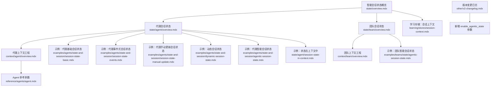
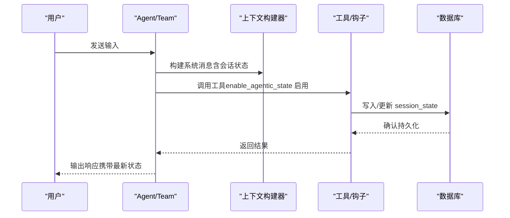
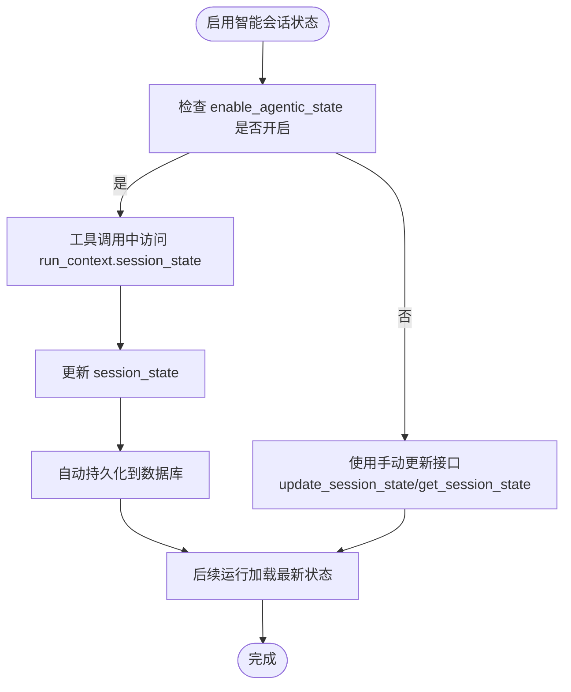
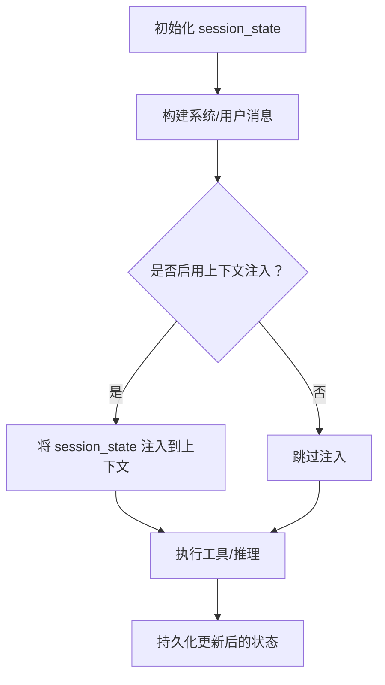
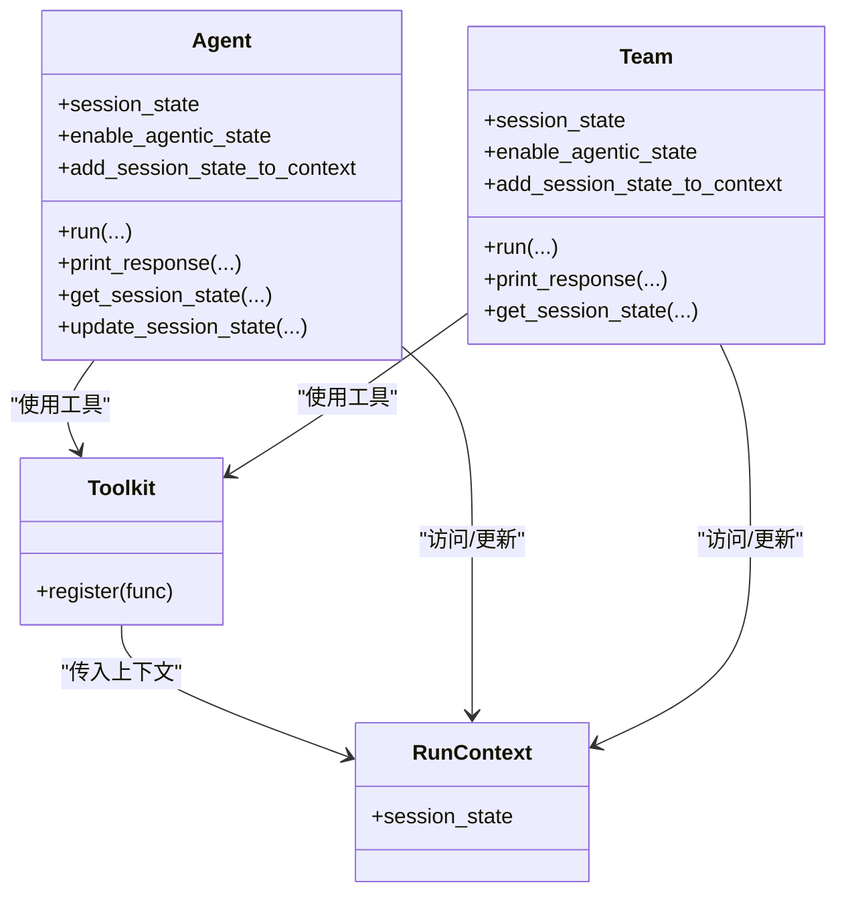
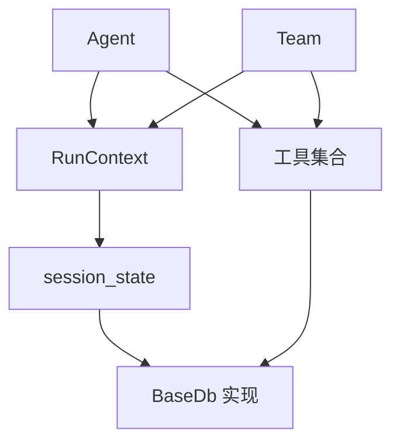

# 智能会话状态

<cite>
**本文档引用的文件**
- [agentic-session-state.mdx](file://examples/agents/state-and-session/agentic-session-state.mdx)
- [agentic-session-state.mdx](file://examples/teams/state/agentic-session-state.mdx)
- [overview.mdx](file://state/overview.mdx)
- [overview.mdx](file://state/agent/overview.mdx)
- [overview.mdx](file://state/team/overview.mdx)
- [overview.mdx](file://context/agent/overview.mdx)
- [overview.mdx](file://context/team/overview.mdx)
- [agent.mdx](file://reference/agents/agent.mdx)
- [v2-changelog.mdx](file://other/v2-changelog.mdx)
- [session-state-basic.mdx](file://examples/agents/state-and-session/session-state-basic.mdx)
- [session-state-events.mdx](file://examples/agents/state-and-session/session-state-events.mdx)
- [session-state-manual-update.mdx](file://examples/agents/state-and-session/session-state-manual-update.mdx)
- [dynamic-session-state.mdx](file://examples/agents/state-and-session/dynamic-session-state.mdx)
- [session-state-in-context.mdx](file://state/agent/session-state-in-context.mdx)
- [session-context.mdx](file://learning/stores/session-context.mdx)
</cite>

## 目录
1. [简介](#简介)
2. [项目结构](#项目结构)
3. [核心组件](#核心组件)
4. [架构总览](#架构总览)
5. [详细组件分析](#详细组件分析)
6. [依赖关系分析](#依赖关系分析)
7. [性能考量](#性能考量)
8. [故障排查指南](#故障排查指南)
9. [结论](#结论)
10. [附录](#附录)

## 简介
本技术文档围绕代理智能会话状态（Agentic Session State）展开，系统阐述以下主题：
- enable_agentic_state 参数的作用机制与配置方法
- 智能会话状态如何自动管理代理的状态更新，包括内置工具的工作原理
- add_session_state_to_context 参数的重要性和使用场景
- 智能会话状态与手动状态管理的区别与优势
- 完整的配置示例，展示如何启用和使用智能会话状态功能
- 在复杂应用场景中的使用模式，包括多轮对话状态管理和上下文维护

## 项目结构
本仓库提供了丰富的示例与参考文档，覆盖代理、团队与工作流层面的会话状态管理。下图展示了与“智能会话状态”直接相关的文档与示例组织方式。

**图表来源**
- [overview.mdx:1-33](file://state/overview.mdx#L1-L33)
- [overview.mdx:1-25](file://state/agent/overview.mdx#L1-L25)
- [overview.mdx:1-357](file://state/team/overview.mdx#L1-L357)
- [overview.mdx:1-523](file://context/agent/overview.mdx#L1-L523)
- [overview.mdx:1-700](file://context/team/overview.mdx#L1-L700)
- [agent.mdx:1-523](file://reference/agents/agent.mdx#L1-L523)
- [agentic-session-state.mdx:1-54](file://examples/agents/state-and-session/agentic-session-state.mdx#L1-L54)
- [agentic-session-state.mdx:1-69](file://examples/teams/state/agentic-session-state.mdx#L1-L69)
- [session-state-basic.mdx:45-69](file://examples/agents/state-and-session/session-state-basic.mdx#L45-L69)
- [session-state-events.mdx:45-71](file://examples/agents/state-and-session/session-state-events.mdx#L45-L71)
- [session-state-manual-update.mdx:45-72](file://examples/agents/state-and-session/session-state-manual-update.mdx#L45-L72)
- [dynamic-session-state.mdx:1-115](file://examples/agents/state-and-session/dynamic-session-state.mdx#L1-L115)
- [session-state-in-context.mdx:1-44](file://state/agent/session-state-in-context.mdx#L1-L44)
- [session-context.mdx:134-164](file://learning/stores/session-context.mdx#L134-L164)
- [v2-changelog.mdx:250-374](file://other/v2-changelog.mdx#L250-L374)

**章节来源**
- [overview.mdx:1-33](file://state/overview.mdx#L1-L33)
- [overview.mdx:1-25](file://state/agent/overview.mdx#L1-L25)
- [overview.mdx:1-357](file://state/team/overview.mdx#L1-L357)

## 核心组件
- 会话状态（Session State）
  - 定义：在一次会话内跨多次运行持久化的数据，用于保持上下文与记忆。
  - 生命周期：初始化 → 访问 → 更新 → 加载。
  - 存储：默认通过数据库持久化，支持 SQLite、内存数据库等。
- 智能会话状态（Agentic Session State）
  - 通过 enable_agentic_state 启用后，允许代理或团队成员在工具调用中直接更新会话状态，并自动持久化。
- 上下文注入（add_session_state_to_context）
  - 将当前会话状态注入到系统消息或用户消息上下文中，使模型可感知状态变化。

**章节来源**
- [overview.mdx:8-20](file://state/overview.mdx#L8-L20)
- [overview.mdx:16-23](file://state/agent/overview.mdx#L16-L23)
- [overview.mdx:84-85](file://context/agent/overview.mdx#L84-L85)
- [overview.mdx:154-155](file://context/team/overview.mdx#L154-L155)

## 架构总览
下图展示了智能会话状态在代理与团队中的整体工作流程：从创建阶段启用参数，到运行时通过工具更新状态，再到上下文注入与持久化。

**图表来源**
- [overview.mdx:12-20](file://state/overview.mdx#L12-L20)
- [overview.mdx:165-166](file://context/agent/overview.mdx#L165-L166)
- [overview.mdx:282-283](file://context/team/overview.mdx#L282-L283)

## 详细组件分析

### enable_agentic_state 参数详解
- 作用机制
  - 启用后，代理或团队成员具备在工具调用中直接修改 session_state 的能力。
  - 工具内部通过 run_context.session_state 访问与更新状态，随后自动持久化到数据库。
- 配置位置
  - 代理：Agent(session_state=..., add_session_state_to_context=True, enable_agentic_state=True)
  - 团队：Team(session_state=..., add_session_state_to_context=True, enable_agentic_state=True)，成员同样可更新共享状态。
- 版本演进
  - v2 引入 enable_agentic_state，统一了 Agent、Team 的状态更新能力；移除了 team_session_state/workflow_session_state，仅保留 session_state。

**图表来源**
- [v2-changelog.mdx:256-258](file://other/v2-changelog.mdx#L256-L258)
- [v2-changelog.mdx:338-340](file://other/v2-changelog.mdx#L338-L340)
- [overview.mdx:16-20](file://state/overview.mdx#L16-L20)

**章节来源**
- [v2-changelog.mdx:256-258](file://other/v2-changelog.mdx#L256-L258)
- [v2-changelog.mdx:338-340](file://other/v2-changelog.mdx#L338-L340)
- [overview.mdx:16-20](file://state/overview.mdx#L16-L20)

### add_session_state_to_context 参数详解
- 重要性
  - 将 session_state 注入到系统消息或用户消息上下文中，使模型能够感知当前状态，从而在推理中利用历史信息。
- 使用场景
  - 多轮对话：模型根据购物清单、任务进度等上下文生成连贯回复。
  - 指令模板：在 instructions 中直接使用 {key} 占位符引用 session_state。
- 配置位置
  - 代理：add_session_state_to_context=True
  - 团队：add_session_state_to_context=True

**图表来源**
- [overview.mdx:84-85](file://context/agent/overview.mdx#L84-L85)
- [overview.mdx:154-155](file://context/team/overview.mdx#L154-L155)
- [overview.mdx:1-44](file://state/agent/session-state-in-context.mdx#L1-L44)

**章节来源**
- [overview.mdx:84-85](file://context/agent/overview.mdx#L84-L85)
- [overview.mdx:154-155](file://context/team/overview.mdx#L154-L155)
- [overview.mdx:1-44](file://state/agent/session-state-in-context.mdx#L1-L44)

### 智能会话状态与手动状态管理对比
- 手动管理
  - 通过 get_session_state 读取，通过 update_session_state 写入，适合明确控制与审计的场景。
- 智能管理（enable_agentic_state）
  - 工具内部直接更新，无需显式持久化调用，适合自动化与低耦合的会话状态维护。
- 适用建议
  - 复杂多轮对话与自动化流程优先考虑智能管理；需要严格审计或外部触发的场景可采用手动管理。

**章节来源**
- [session-state-basic.mdx:45-69](file://examples/agents/state-and-session/session-state-basic.mdx#L45-L69)
- [session-state-manual-update.mdx:45-72](file://examples/agents/state-and-session/session-state-manual-update.mdx#L45-L72)
- [overview.mdx:16-20](file://state/overview.mdx#L16-L20)

### 内置工具与钩子的工作原理
- 工具层
  - 工具函数签名包含 run_context 参数，可通过 run_context.session_state 访问与更新状态。
  - 更新后自动持久化，后续运行可见。
- 钩子层
  - tool_hooks 可在工具调用前后对 session_state 进行动态处理，实现条件更新或清理逻辑。
- 示例要点
  - 动态会话状态示例展示了通过钩子在运行时按参数动态创建/检索客户档案并更新 session_state。

**图表来源**
- [overview.mdx:16-23](file://state/agent/overview.mdx#L16-L23)
- [overview.mdx:30-57](file://state/team/overview.mdx#L30-L57)
- [dynamic-session-state.mdx:42-85](file://examples/agents/state-and-session/dynamic-session-state.mdx#L42-L85)

**章节来源**
- [overview.mdx:16-23](file://state/agent/overview.mdx#L16-L23)
- [overview.mdx:30-57](file://state/team/overview.mdx#L30-L57)
- [dynamic-session-state.mdx:42-85](file://examples/agents/state-and-session/dynamic-session-state.mdx#L42-L85)

### 配置示例与最佳实践
- 代理智能会话状态
  - 关键参数：session_state、add_session_state_to_context=True、enable_agentic_state=True
  - 示例路径：examples/agents/state-and-session/agentic-session-state.mdx
- 团队智能会话状态
  - 成员与团队共享 session_state，均可通过 enable_agentic_state 更新
  - 示例路径：examples/teams/state/agentic-session-state.mdx
- 手动更新与事件式输出
  - 手动更新：examples/agents/state-and-session/session-state-manual-update.mdx
  - 事件式输出：examples/agents/state-and-session/session-state-events.mdx
- 动态会话状态
  - 通过钩子在运行时动态更新：examples/agents/state-and-session/dynamic-session-state.mdx
- 状态在上下文中
  - 在指令中使用占位符引用 session_state：state/agent/session-state-in-context.mdx
- 结合会话上下文存储
  - 与 LearningMachine 的 SessionContextConfig 组合，实现长期用户知识与短期会话状态协同：learning/stores/session-context.mdx

**章节来源**
- [agentic-session-state.mdx:23-29](file://examples/agents/state-and-session/agentic-session-state.mdx#L23-L29)
- [agentic-session-state.mdx:38-46](file://examples/teams/state/agentic-session-state.mdx#L38-L46)
- [session-state-manual-update.mdx:48-56](file://examples/agents/state-and-session/session-state-manual-update.mdx#L48-L56)
- [session-state-events.mdx:48-57](file://examples/agents/state-and-session/session-state-events.mdx#L48-L57)
- [dynamic-session-state.mdx:77-85](file://examples/agents/state-and-session/dynamic-session-state.mdx#L77-L85)
- [session-state-in-context.mdx:19-35](file://state/agent/session-state-in-context.mdx#L19-L35)
- [session-context.mdx:150-162](file://learning/stores/session-context.mdx#L150-L162)

## 依赖关系分析
- 组件耦合
  - Agent/Team 与 RunContext 强耦合：工具通过 RunContext 访问 session_state。
  - 数据库抽象：通过 BaseDb 接口实现不同存储后端（SQLite、内存等）。
- 外部依赖
  - 模型提供商：上下文注入与提示缓存策略因模型而异。
  - 工具生态：第三方工具需遵循工具注册与参数约定。

**图表来源**
- [overview.mdx:16-23](file://state/agent/overview.mdx#L16-L23)
- [overview.mdx:30-57](file://state/team/overview.mdx#L30-L57)
- [agent.mdx:1-523](file://reference/agents/agent.mdx#L1-L523)

**章节来源**
- [overview.mdx:16-23](file://state/agent/overview.mdx#L16-L23)
- [overview.mdx:30-57](file://state/team/overview.mdx#L30-L57)
- [agent.mdx:1-523](file://reference/agents/agent.mdx#L1-L523)

## 性能考量
- 上下文大小控制
  - add_session_state_to_context 会将状态注入到系统消息，建议控制状态体量，避免超出模型上下文长度。
- 历史与工具调用裁剪
  - 可结合 max_tool_calls_from_history 等参数限制历史工具调用数量，降低 token 消耗。
- 缓存与提示复用
  - 对静态内容进行提示缓存，减少重复 token 开销。

[本节为通用指导，不直接分析具体文件]

## 故障排查指南
- 症状：工具无法读取/写入 session_state
  - 排查：确认 enable_agentic_state 已启用；工具函数签名包含 run_context；数据库已正确配置。
- 症状：上下文未包含最新状态
  - 排查：确认 add_session_state_to_context=True；检查指令中是否使用 {key} 占位符。
- 症状：状态未持久化或丢失
  - 排查：确认数据库连接正常；检查 run 结束后是否调用持久化；核对 overwrite_db_session_state 行为。
- 症状：多轮对话状态错乱
  - 排查：确保 session_id 一致；检查工具是否正确更新共享状态；必要时使用手动更新接口进行校验。

**章节来源**
- [overview.mdx:16-20](file://state/overview.mdx#L16-L20)
- [overview.mdx:84-85](file://context/agent/overview.mdx#L84-L85)
- [overview.mdx:154-155](file://context/team/overview.mdx#L154-L155)
- [session-state-manual-update.mdx:48-56](file://examples/agents/state-and-session/session-state-manual-update.mdx#L48-L56)

## 结论
智能会话状态通过 enable_agentic_state 与 add_session_state_to_context 参数，实现了代理与团队在多轮对话中的自动化状态管理与上下文感知。相比手动管理，智能模式降低了状态更新的耦合度与出错率，适合复杂与自动化的应用场景。结合合适的数据库与上下文工程策略，可在保证性能的同时提升用户体验与系统稳定性。

[本节为总结性内容，不直接分析具体文件]

## 附录
- 相关参考
  - Agent 参数表：add_session_state_to_context、enable_agentic_state、overwrite_db_session_state 等
  - 团队参数表：add_session_state_to_context、enable_agentic_state 等
  - 版本变更：v2 引入 enable_agentic_state，统一 Agent/Team/Workflow 的状态管理

**章节来源**
- [agent.mdx:16-20](file://reference/agents/agent.mdx#L16-L20)
- [overview.mdx:84-85](file://context/agent/overview.mdx#L84-L85)
- [overview.mdx:154-155](file://context/team/overview.mdx#L154-L155)
- [v2-changelog.mdx:256-258](file://other/v2-changelog.mdx#L256-L258)