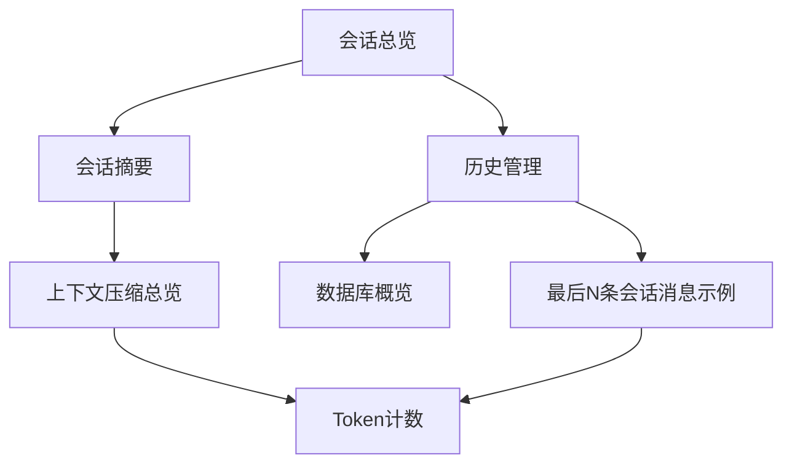
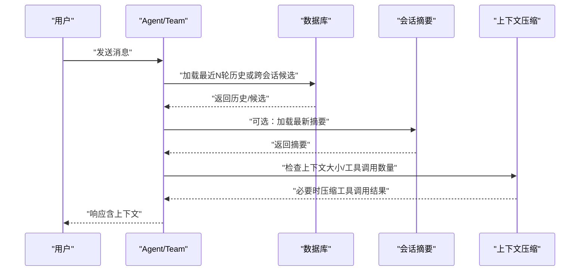
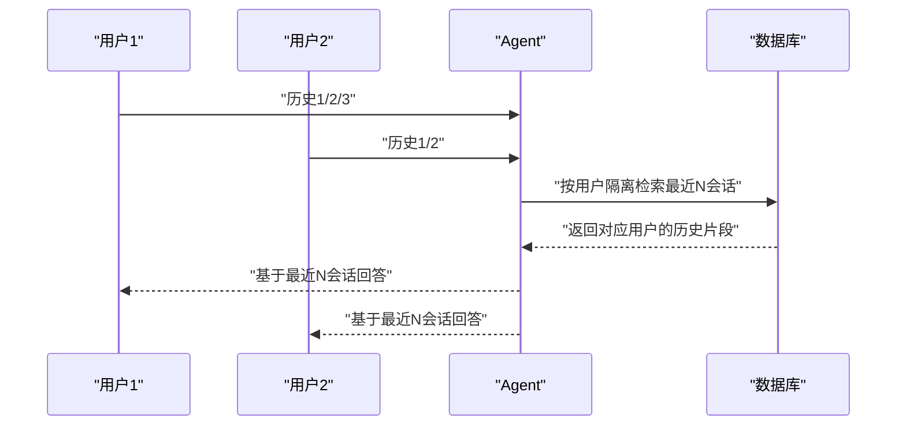
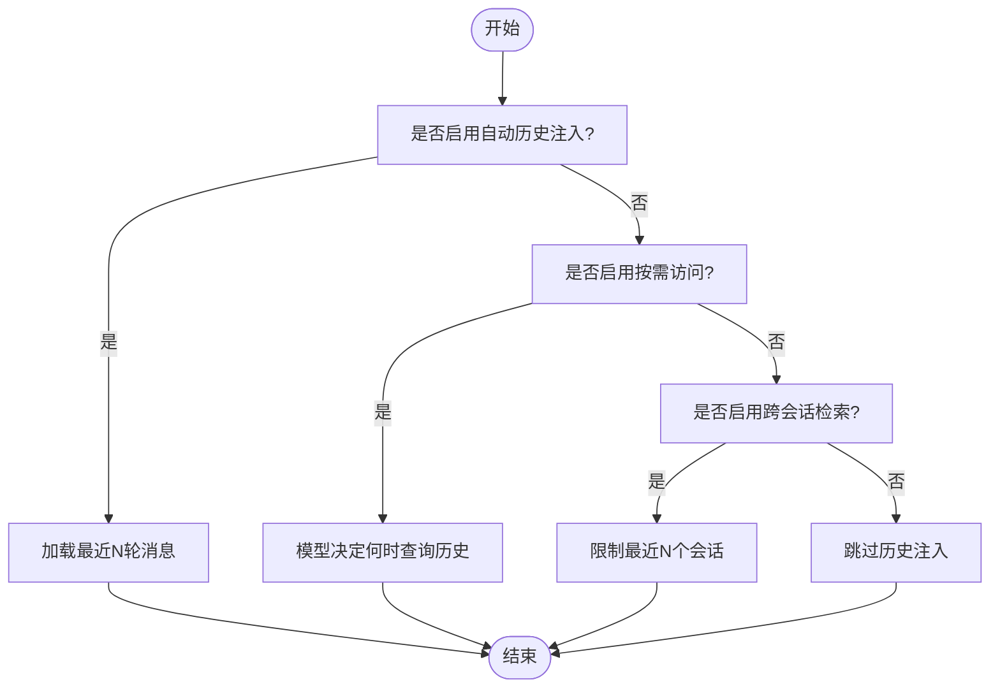
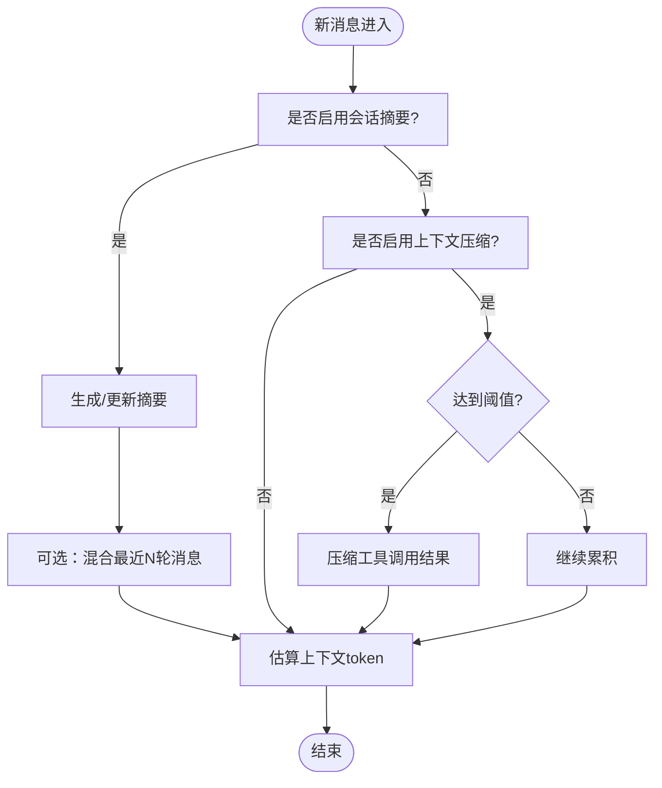
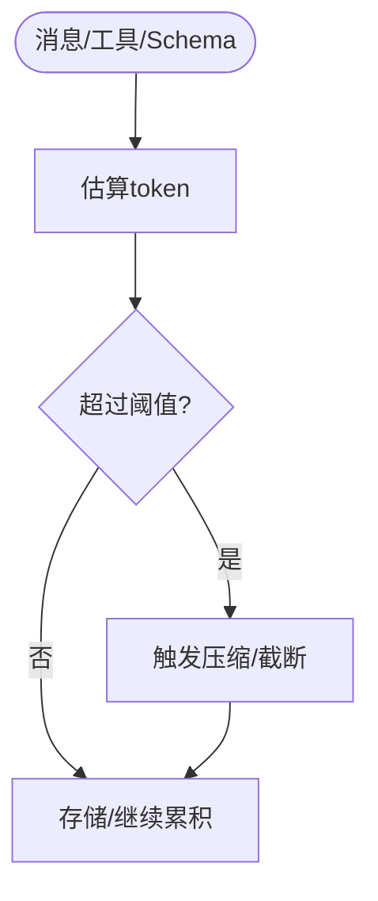
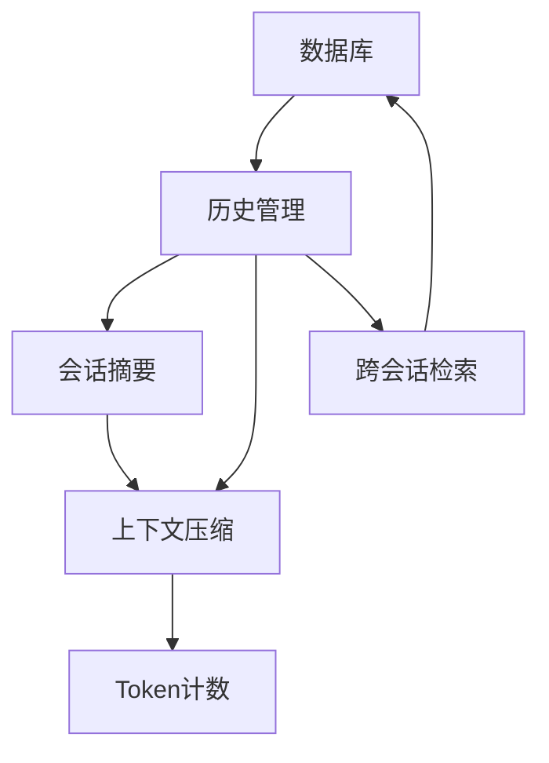

# 最后N条会话消息

<cite>
**本文引用的文件**
- [最后N条会话消息示例](file://examples/agents/state-and-session/last-n-session-messages.mdx)
- [历史管理](file://sessions/history-management.mdx)
- [会话摘要](file://sessions/session-summaries.mdx)
- [数据库概览](file://database/overview.mdx)
- [会话总览](file://sessions/overview.mdx)
- [Token计数](file://compression/token-counting.mdx)
- [上下文压缩总览](file://compression/overview.mdx)
- [工作流中使用历史示例](file://examples/workflows/advanced-concepts/history/history-in-function.mdx)
</cite>

## 目录
1. [简介](#简介)
2. [项目结构](#项目结构)
3. [核心组件](#核心组件)
4. [架构总览](#架构总览)
5. [详细组件分析](#详细组件分析)
6. [依赖关系分析](#依赖关系分析)
7. [性能考量](#性能考量)
8. [故障排查指南](#故障排查指南)
9. [结论](#结论)
10. [附录](#附录)

## 简介
本技术文档围绕“最后N条会话消息管理”展开，系统性阐述如何通过配置与使用相关参数，控制会话上下文规模、实现消息截断与保留策略，并结合消息长度估算与token计数机制，平衡模型性能与准确性。文档同时覆盖跨会话检索、会话摘要、以及在长对话场景下的最佳实践与配置建议。

## 项目结构
与“最后N条会话消息”直接相关的知识与示例分布在以下主题文档中：
- 会话与历史：会话生命周期、历史注入模式、跨会话检索
- 上下文压缩：工具调用结果压缩、token阈值控制
- Token计数：消息、工具定义、输出schema等的token估算
- 示例：最后N条会话消息的演示脚本

**图表来源**
- [会话总览:1-86](file://sessions/overview.mdx#L1-L86)
- [历史管理:1-108](file://sessions/history-management.mdx#L1-L108)
- [会话摘要:1-184](file://sessions/session-summaries.mdx#L1-L184)
- [最后N条会话消息示例:1-104](file://examples/agents/state-and-session/last-n-session-messages.mdx#L1-L104)
- [数据库概览:25-54](file://database/overview.mdx#L25-L54)
- [上下文压缩总览:1-267](file://compression/overview.mdx#L1-L267)
- [Token计数:1-113](file://compression/token-counting.mdx#L1-L113)

**章节来源**
- [会话总览:1-86](file://sessions/overview.mdx#L1-L86)
- [历史管理:1-108](file://sessions/history-management.mdx#L1-L108)
- [会话摘要:1-184](file://sessions/session-summaries.mdx#L1-L184)
- [最后N条会话消息示例:1-104](file://examples/agents/state-and-session/last-n-session-messages.mdx#L1-L104)
- [数据库概览:25-54](file://database/overview.mdx#L25-L54)
- [上下文压缩总览:1-267](file://compression/overview.mdx#L1-L267)
- [Token计数:1-113](file://compression/token-counting.mdx#L1-L113)

## 核心组件
- 会话与历史管理
  - 自动历史注入：通过启用历史注入并设置最近N轮（num_history_runs）控制上下文规模
  - 按需访问：通过read_chat_history让模型在需要时查询历史
  - 程序化访问：通过get_chat_history、get_session_messages等接口按需获取历史
- 跨会话检索
  - 通过search_session_history与num_history_sessions控制跨会话检索范围，避免上下文膨胀
- 会话摘要
  - 自动生成并使用会话摘要，降低长期对话的token占用
- 上下文压缩
  - 基于工具调用结果的自动压缩，支持计数阈值与token阈值两种触发方式
- Token计数
  - 对消息、工具定义、输出schema等进行估算，支撑上下文规划与压缩决策

**章节来源**
- [历史管理:12-76](file://sessions/history-management.mdx#L12-L76)
- [会话摘要:44-169](file://sessions/session-summaries.mdx#L44-L169)
- [上下文压缩总览:52-247](file://compression/overview.mdx#L52-L247)
- [Token计数:23-98](file://compression/token-counting.mdx#L23-L98)

## 架构总览
下图展示了“最后N条会话消息”的关键流程：用户发起请求，系统根据配置决定是否注入历史、是否跨会话检索、是否生成/使用摘要、以及是否触发上下文压缩。

**图表来源**
- [历史管理:12-76](file://sessions/history-management.mdx#L12-L76)
- [会话摘要:44-169](file://sessions/session-summaries.mdx#L44-L169)
- [上下文压缩总览:52-247](file://compression/overview.mdx#L52-L247)

## 详细组件分析

### 组件A：最后N条会话消息（示例）
该示例演示了如何通过search_session_history与num_history_sessions限制跨会话检索范围，确保每个用户的会话仅看到其自身的历史，避免上下文膨胀。

**图表来源**
- [最后N条会话消息示例:30-82](file://examples/agents/state-and-session/last-n-session-messages.mdx#L30-L82)

**章节来源**
- [最后N条会话消息示例:1-104](file://examples/agents/state-and-session/last-n-session-messages.mdx#L1-L104)

### 组件B：历史注入与跨会话检索
- 自动历史注入：通过add_history_to_context与num_history_runs控制最近N轮消息进入上下文
- 按需访问：read_chat_history允许模型在推理过程中主动查询历史
- 跨会话检索：search_session_history与num_history_sessions限定跨会话检索范围，避免上下文超限

**图表来源**
- [历史管理:12-76](file://sessions/history-management.mdx#L12-L76)

**章节来源**
- [历史管理:12-76](file://sessions/history-management.mdx#L12-L76)

### 组件C：会话摘要与上下文压缩
- 会话摘要：在长时间对话中自动生成摘要，减少token占用；可在上下文中混合近期消息
- 上下文压缩：当工具调用结果累积到阈值时自动压缩，支持计数阈值与token阈值两种模式

**图表来源**
- [会话摘要:44-169](file://sessions/session-summaries.mdx#L44-L169)
- [上下文压缩总览:52-247](file://compression/overview.mdx#L52-L247)
- [Token计数:23-98](file://compression/token-counting.mdx#L23-L98)

**章节来源**
- [会话摘要:44-169](file://sessions/session-summaries.mdx#L44-L169)
- [上下文压缩总览:52-247](file://compression/overview.mdx#L52-L247)
- [Token计数:23-98](file://compression/token-counting.mdx#L23-L98)

### 组件D：消息长度估算与token计数
- 估算范围：消息内容、工具定义、输出schema、多模态附件等
- 估算精度：不同provider/模型可能有差异，建议安装tiktoken与tokenizers以获得更准确估计
- 在压缩中的作用：token计数用于判断是否触发压缩，包含历史、工具定义与输出格式

**图表来源**
- [Token计数:23-98](file://compression/token-counting.mdx#L23-L98)

**章节来源**
- [Token计数:23-98](file://compression/token-counting.mdx#L23-L98)

## 依赖关系分析
- 会话与历史管理依赖数据库存储以持久化消息与运行记录
- 会话摘要与上下文压缩依赖token计数能力进行上下文规划
- 跨会话检索依赖用户隔离与会话ID管理

**图表来源**
- [数据库概览:25-54](file://database/overview.mdx#L25-L54)
- [历史管理:12-76](file://sessions/history-management.mdx#L12-L76)
- [会话摘要:44-169](file://sessions/session-summaries.mdx#L44-L169)
- [上下文压缩总览:52-247](file://compression/overview.mdx#L52-L247)
- [Token计数:23-98](file://compression/token-counting.mdx#L23-L98)

**章节来源**
- [数据库概览:25-54](file://database/overview.mdx#L25-L54)
- [历史管理:12-76](file://sessions/history-management.mdx#L12-L76)
- [会话摘要:44-169](file://sessions/session-summaries.mdx#L44-L169)
- [上下文压缩总览:52-247](file://compression/overview.mdx#L52-L247)
- [Token计数:23-98](file://compression/token-counting.mdx#L23-L98)

## 性能考量
- 控制上下文规模
  - 使用num_history_runs限制最近N轮消息进入上下文
  - 使用num_history_sessions限制跨会话检索范围
- 减少token占用
  - 启用会话摘要并在上下文中混合少量近期消息
  - 启用上下文压缩，基于计数或token阈值触发
- 估算与规划
  - 使用token计数估算上下文大小，避免超出模型上下文窗口
  - 多模态输入采用保守估算，预留缓冲空间

[本节为通用指导，不直接分析具体文件]

## 故障排查指南
- 历史未生效
  - 确认已配置数据库并启用add_history_to_context
  - 检查num_history_runs设置是否合理
- 跨会话检索异常
  - 确认search_session_history与num_history_sessions配置正确
  - 验证用户隔离逻辑（user_id）是否一致
- 上下文超限
  - 启用会话摘要并适当混合近期消息
  - 启用上下文压缩并调整阈值
- token估算偏差
  - 安装tiktoken与tokenizers以提升估算精度
  - 注意不同provider/模型的tokenization差异

**章节来源**
- [历史管理:12-76](file://sessions/history-management.mdx#L12-L76)
- [会话摘要:44-169](file://sessions/session-summaries.mdx#L44-L169)
- [上下文压缩总览:52-247](file://compression/overview.mdx#L52-L247)
- [Token计数:23-98](file://compression/token-counting.mdx#L23-L98)

## 结论
通过last_n_session_messages（以num_history_runs与num_history_sessions为核心）与会话摘要、上下文压缩、token计数的协同，可以在保证模型上下文质量的同时有效控制token消耗与延迟。在长对话场景中，建议采用“摘要+少量近期消息”的组合策略，并根据业务负载动态调整阈值与参数。

[本节为总结性内容，不直接分析具体文件]

## 附录

### 配置示例与最佳实践
- 短对话
  - 关闭历史或启用自动历史注入并设置较小的num_history_runs
- 长对话
  - 启用会话摘要，并在上下文中混合少量近期消息
  - 启用上下文压缩，设置合理的计数或token阈值
- 工具密集型
  - 启用上下文压缩，避免工具调用结果占满上下文
- 跨会话检索
  - 启用search_session_history并设置较小的num_history_sessions，避免上下文膨胀

**章节来源**
- [历史管理:69-76](file://sessions/history-management.mdx#L69-L76)
- [会话摘要:171-182](file://sessions/session-summaries.mdx#L171-L182)
- [上下文压缩总览:253-260](file://compression/overview.mdx#L253-L260)

### 消息去重与相似度过滤思路
- 历史函数示例展示了基于关键词重叠与多样性评分的策略，可用于检测重复与低价值内容，从而辅助决定是否纳入上下文
- 实践建议
  - 在注入历史前进行关键词提取与重叠检测
  - 设置重叠阈值与多样性阈值，过滤高重复或低多样性的历史片段

**章节来源**
- [工作流中使用历史示例:52-101](file://examples/workflows/advanced-concepts/history/history-in-function.mdx#L52-L101)