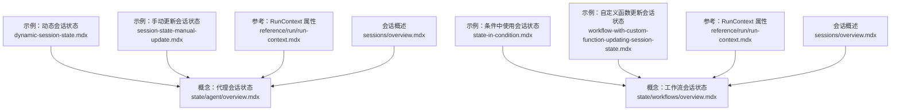
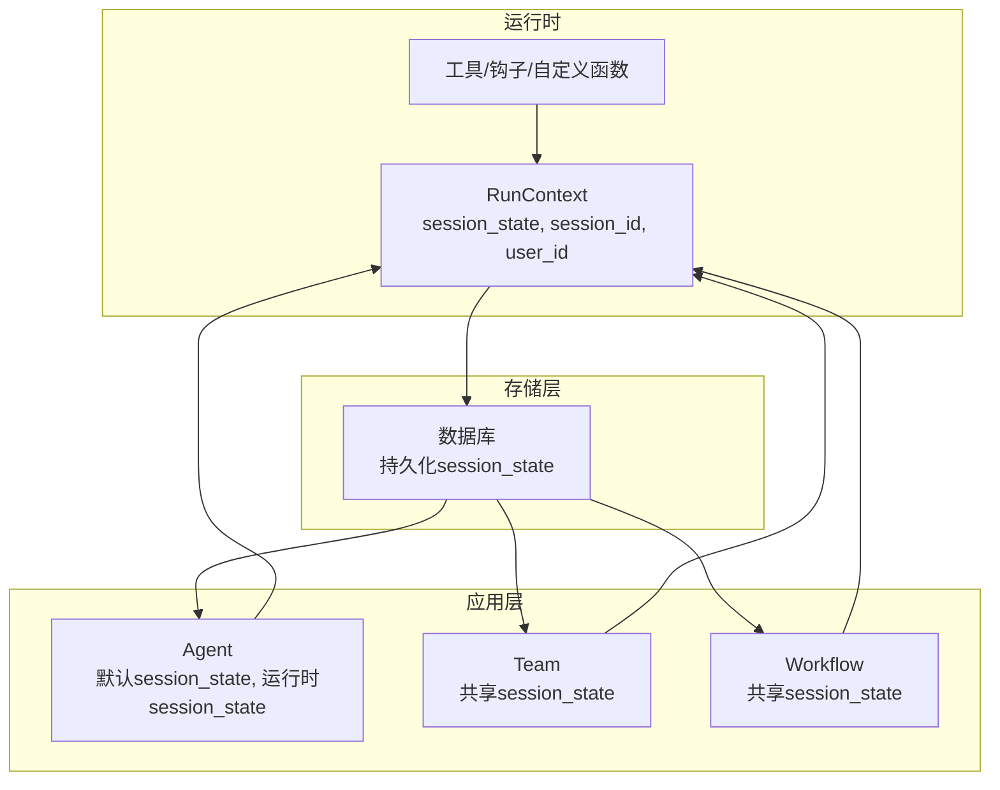
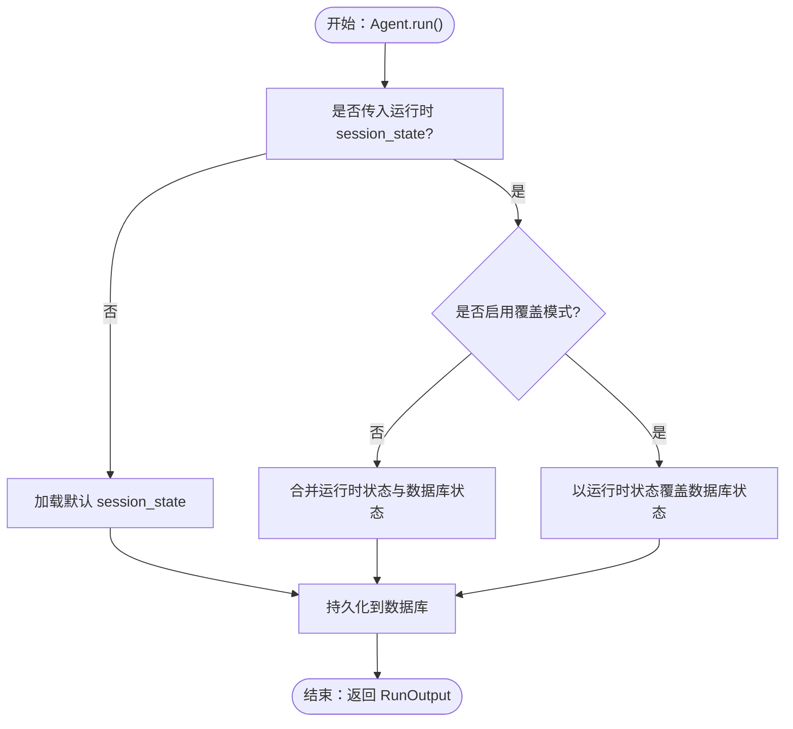
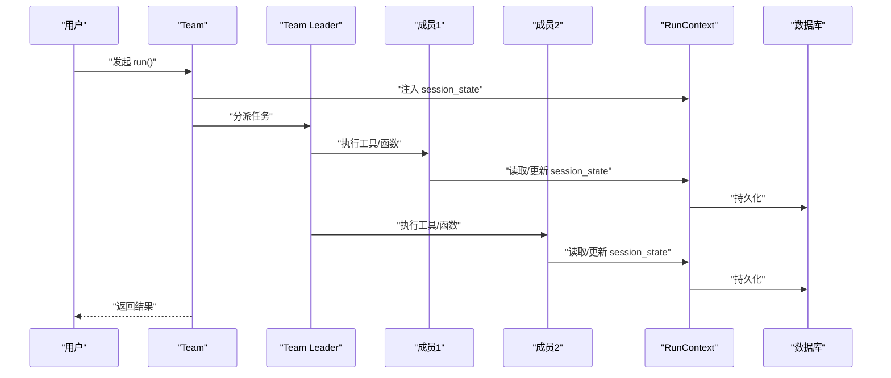
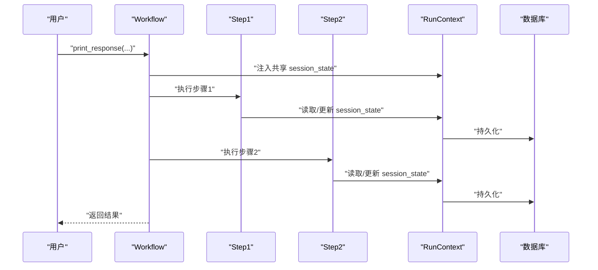
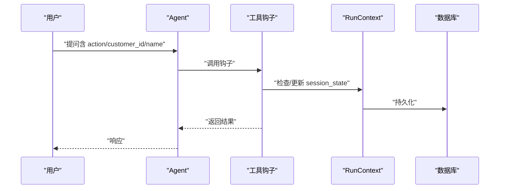
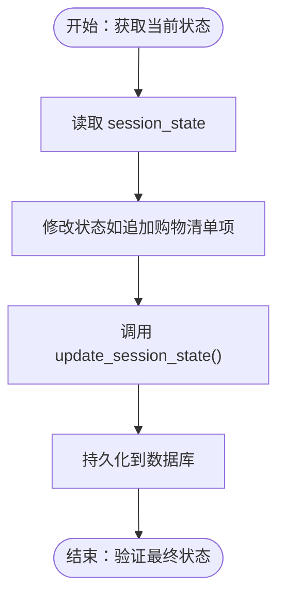
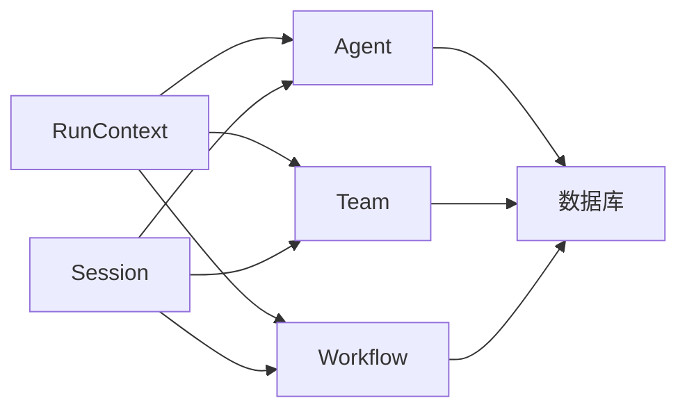

# 运行时状态变更

<cite>
**本文引用的文件**
- [dynamic-session-state.mdx](file://examples/agents/state-and-session/dynamic-session-state.mdx)
- [session-state-manual-update.mdx](file://examples/agents/state-and-session/session-state-manual-update.mdx)
- [state-in-condition.mdx](file://examples/workflows/advanced-concepts/session-state/state-in-condition.mdx)
- [workflow-with-custom-function-updating-session-state.mdx](file://examples/agent-os/workflow/workflow-with-custom-function-updating-session-state.mdx)
- [state/agent/overview.mdx](file://state/agent/overview.mdx)
- [state/workflows/overview.mdx](file://state/workflows/overview.mdx)
- [state/team/overview.mdx](file://state/team/overview.mdx)
- [reference/run/run-context.mdx](file://reference/run/run-context.mdx)
- [sessions/overview.mdx](file://sessions/overview.mdx)
- [state/overview.mdx](file://state/overview.mdx)
- [parallel-workflow.mdx](file://workflows/workflow-patterns/parallel-workflow.mdx)
</cite>

## 目录
1. [引言](#引言)
2. [项目结构](#项目结构)
3. [核心组件](#核心组件)
4. [架构总览](#架构总览)
5. [详细组件分析](#详细组件分析)
6. [依赖关系分析](#依赖关系分析)
7. [性能考量](#性能考量)
8. [故障排查指南](#故障排查指南)
9. [结论](#结论)
10. [附录](#附录)

## 引言
本技术文档聚焦于代理在运行时（agent.run() 调用期间）对会话状态进行动态设置与修改的能力，系统性阐述以下主题：
- 如何在 agent.run() 过程中通过参数传递与上下文更新实现会话状态的动态变更
- session_id 在状态变更中的关键作用与使用方法
- 运行时状态与默认状态的合并与覆盖策略
- 状态变更对后续运行的影响与状态传播机制
- 完整示例路径，展示在不同运行场景中灵活管理状态
- 事务处理与一致性保障机制
- 并发环境下的安全性与同步策略

## 项目结构
围绕“运行时状态变更”的相关知识与示例分布在以下区域：
- 示例：代理与工具钩子在运行时动态更新会话状态
- 示例：工作流在条件评估器与路由选择器中读取会话状态
- 示例：自定义函数步骤在工作流中更新会话状态
- 概念：代理、团队、工作流的会话状态管理与持久化
- 参考：RunContext 的属性与可用字段
- 会话概述：会话与运行的关系、持久化要求

**图表来源**
- [dynamic-session-state.mdx:1-116](file://examples/agents/state-and-session/dynamic-session-state.mdx#L1-L116)
- [session-state-manual-update.mdx:1-73](file://examples/agents/state-and-session/session-state-manual-update.mdx#L1-L73)
- [state-in-condition.mdx:100-142](file://examples/workflows/advanced-concepts/session-state/state-in-condition.mdx#L100-L142)
- [workflow-with-custom-function-updating-session-state.mdx:234-251](file://examples/agent-os/workflow/workflow-with-custom-function-updating-session-state.mdx#L234-L251)
- [state/agent/overview.mdx:1-306](file://state/agent/overview.mdx#L1-L306)
- [state/workflows/overview.mdx:1-295](file://state/workflows/overview.mdx#L1-L295)
- [reference/run/run-context.mdx:1-22](file://reference/run/run-context.mdx#L1-L22)
- [sessions/overview.mdx:1-24](file://sessions/overview.mdx#L1-L24)

**章节来源**
- [state/agent/overview.mdx:1-306](file://state/agent/overview.mdx#L1-L306)
- [state/workflows/overview.mdx:1-295](file://state/workflows/overview.mdx#L1-L295)
- [state/team/overview.mdx:1-357](file://state/team/overview.mdx#L1-L357)
- [reference/run/run-context.mdx:1-22](file://reference/run/run-context.mdx#L1-L22)
- [sessions/overview.mdx:1-24](file://sessions/overview.mdx#L1-L24)

## 核心组件
- RunContext：在工具、钩子、自定义函数等运行期组件中访问与更新 session_state 的统一载体，包含 run_id、session_id、user_id、dependencies、knowledge_filters、metadata、session_state 等字段。
- 代理（Agent）：支持在构造时设置默认 session_state，并在 run() 时接收运行时 session_state 参数；可通过 enable_agentic_state 自动管理状态。
- 团队（Team）：在成员间共享 session_state，支持在工具中通过 run_context.session_state 访问与更新。
- 工作流（Workflow）：在多步骤、多组件间共享 session_state，支持在自定义 Python 函数、条件评估器、路由选择器中读取与更新。

**章节来源**
- [reference/run/run-context.mdx:10-22](file://reference/run/run-context.mdx#L10-L22)
- [state/agent/overview.mdx:29-34](file://state/agent/overview.mdx#L29-L34)
- [state/team/overview.mdx:14-31](file://state/team/overview.mdx#L14-L31)
- [state/workflows/overview.mdx:23-41](file://state/workflows/overview.mdx#L23-L41)

## 架构总览
下图展示了运行时状态变更在代理、团队、工作流中的传播与持久化路径：

**图表来源**
- [reference/run/run-context.mdx:10-22](file://reference/run/run-context.mdx#L10-L22)
- [state/agent/overview.mdx:29-34](file://state/agent/overview.mdx#L29-L34)
- [state/team/overview.mdx:14-31](file://state/team/overview.mdx#L14-L31)
- [state/workflows/overview.mdx:23-41](file://state/workflows/overview.mdx#L23-L41)
- [sessions/overview.mdx:12-24](file://sessions/overview.mdx#L12-L24)

## 详细组件分析

### 代理运行时状态变更
- 默认状态与运行时状态
  - 在 Agent 构造时可设置 session_state 作为默认值；在 run() 时传入的 session_state 将用于本次运行。
  - 若未传入运行时 session_state，则沿用默认状态。
- 状态覆盖与合并
  - 默认行为：运行时提供的 session_state 与数据库中已存在的 session_state 合并。
  - 可通过 overwrite_db_session_state=True 强制以运行时状态覆盖数据库中的状态。
- 使用场景
  - 动态注入用户上下文（如 user_name、age），或临时覆盖默认状态。
- 示例路径
  - [changing_state_on_run.py:236-258](file://state/agent/overview.mdx#L236-L258)
  - [overwriting_session_state_in_db.py:266-299](file://state/agent/overview.mdx#L266-L299)

**图表来源**
- [state/agent/overview.mdx:230-300](file://state/agent/overview.mdx#L230-L300)

**章节来源**
- [state/agent/overview.mdx:29-34](file://state/agent/overview.mdx#L29-L34)
- [state/agent/overview.mdx:230-300](file://state/agent/overview.mdx#L230-L300)

### 团队运行时状态变更
- 共享状态
  - Team 在成员间共享 session_state；成员工具通过 run_context.session_state 访问与更新。
- 使用场景
  - 多智能体协作时共享任务列表、日志等数据。
- 示例路径
  - [team_session_state.py:64-160](file://state/team/overview.mdx#L64-L160)
  - [changing_state_on_run.py:243-266](file://state/team/overview.mdx#L243-L266)
  - [overwriting_session_state_in_db.py:274-307](file://state/team/overview.mdx#L274-L307)

**图表来源**
- [state/team/overview.mdx:14-31](file://state/team/overview.mdx#L14-L31)
- [reference/run/run-context.mdx:10-22](file://reference/run/run-context.mdx#L10-L22)

**章节来源**
- [state/team/overview.mdx:14-31](file://state/team/overview.mdx#L14-L31)
- [state/team/overview.mdx:237-266](file://state/team/overview.mdx#L237-L266)
- [state/team/overview.mdx:268-307](file://state/team/overview.mdx#L268-L307)

### 工作流运行时状态变更
- 共享状态
  - Workflow 在所有步骤、代理、团队与自定义函数之间共享 session_state。
- 条件与路由
  - 在条件评估器与路由选择器中通过 run_context.session_state 判断分支。
- 自定义函数
  - 自定义 Python 函数可声明 run_context 参数以读取/更新 session_state。
- 示例路径
  - [state-in-condition.py:100-142](file://examples/workflows/advanced-concepts/session-state/state-in-condition.mdx#L100-L142)
  - [workflow-with-custom-function-updating-session-state.py:234-251](file://examples/agent-os/workflow/workflow-with-custom-function-updating-session-state.mdx#L234-L251)
  - [shared_session_state_with_agent.py:1-295](file://state/workflows/overview.mdx#L1-L295)

**图表来源**
- [state/workflows/overview.mdx:23-41](file://state/workflows/overview.mdx#L23-L41)
- [state/workflows/overview.mdx:220-246](file://state/workflows/overview.mdx#L220-L246)
- [reference/run/run-context.mdx:10-22](file://reference/run/run-context.mdx#L10-L22)

**章节来源**
- [state/workflows/overview.mdx:23-41](file://state/workflows/overview.mdx#L23-L41)
- [state/workflows/overview.mdx:220-246](file://state/workflows/overview.mdx#L220-L246)
- [state/workflows/overview.mdx:251-275](file://state/workflows/overview.mdx#L251-L275)

### 动态状态变更与工具钩子
- 工具钩子在运行时根据参数动态更新 session_state
- 示例：根据 action=create/retrieve 对客户档案进行增删改查
- 示例路径
  - [dynamic_session_state.py:42-101](file://examples/agents/state-and-session/dynamic-session-state.mdx#L42-L101)

**图表来源**
- [dynamic-session-state.mdx:42-101](file://examples/agents/state-and-session/dynamic-session-state.mdx#L42-L101)
- [reference/run/run-context.mdx:10-22](file://reference/run/run-context.mdx#L10-L22)

**章节来源**
- [dynamic-session-state.mdx:42-101](file://examples/agents/state-and-session/dynamic-session-state.mdx#L42-L101)

### 手动更新与持久化
- 通过 agent.get_session_state() 获取当前状态，修改后调用 agent.update_session_state() 更新
- 示例路径
  - [session_state_manual_update.py:21-58](file://examples/agents/state-and-session/session-state-manual-update.mdx#L21-L58)

**图表来源**
- [session-state-manual-update.mdx:21-58](file://examples/agents/state-and-session/session-state-manual-update.mdx#L21-L58)

**章节来源**
- [session-state-manual-update.mdx:21-58](file://examples/agents/state-and-session/session-state-manual-update.mdx#L21-L58)

## 依赖关系分析
- RunContext 是状态访问与更新的统一入口，贯穿代理、团队、工作流的运行期生命周期。
- 数据库（如 SQLite、PostgreSQL）负责状态的持久化与跨运行加载。
- 会话（Session）通过 session_id 将多次 run 绑定为同一上下文，确保状态连续性。

**图表来源**
- [reference/run/run-context.mdx:10-22](file://reference/run/run-context.mdx#L10-L22)
- [sessions/overview.mdx:12-24](file://sessions/overview.mdx#L12-L24)

**章节来源**
- [reference/run/run-context.mdx:10-22](file://reference/run/run-context.mdx#L10-L22)
- [sessions/overview.mdx:12-24](file://sessions/overview.mdx#L12-L24)

## 性能考量
- 状态读写成本：频繁更新 session_state 会增加数据库写入次数，建议批量更新或在必要时才持久化。
- 合并与覆盖策略：合并策略可能引入额外的数据处理开销；覆盖模式适合一次性重置场景。
- 并发控制：在并行步骤中更新共享状态需避免竞态，建议采用锁或序列化更新策略。

## 故障排查指南
- 症状：运行时 session_state 未生效
  - 排查要点：确认是否传入 session_id 且数据库已配置；检查 overwrite_db_session_state 设置。
  - 参考路径：[state/agent/overview.mdx:230-300](file://state/agent/overview.mdx#L230-L300)
- 症状：状态未跨运行保持
  - 排查要点：确认数据库已正确初始化并持久化；检查 session_id 是否一致。
  - 参考路径：[sessions/overview.mdx:12-24](file://sessions/overview.mdx#L12-L24)
- 症状：并发更新导致竞态
  - 排查要点：在并行步骤中协调状态更新；考虑使用串行化或原子更新。
  - 参考路径：[parallel-workflow.mdx:44-54](file://workflows/workflow-patterns/parallel-workflow.mdx#L44-L54)

**章节来源**
- [state/agent/overview.mdx:230-300](file://state/agent/overview.mdx#L230-L300)
- [sessions/overview.mdx:12-24](file://sessions/overview.mdx#L12-L24)
- [parallel-workflow.mdx:44-54](file://workflows/workflow-patterns/parallel-workflow.mdx#L44-L54)

## 结论
- session_id 是连接多次运行与保持状态连续性的关键纽带。
- 运行时状态与默认状态的合并/覆盖策略提供了灵活的上下文注入能力。
- RunContext 为代理、团队、工作流提供了统一的状态访问与更新接口。
- 在并发场景下，应通过同步与序列化策略确保状态一致性与事务性。

## 附录
- 示例索引
  - 代理动态状态：[dynamic_session_state.py:72-101](file://examples/agents/state-and-session/dynamic-session-state.mdx#L72-L101)
  - 手动更新状态：[session_state_manual_update.py:34-58](file://examples/agents/state-and-session/session-state-manual-update.mdx#L34-L58)
  - 条件中使用状态：[state-in-condition.py:100-142](file://examples/workflows/advanced-concepts/session-state/state-in-condition.mdx#L100-L142)
  - 自定义函数更新状态：[workflow_with_custom_function_updating_session_state.py:234-251](file://examples/agent-os/workflow/workflow-with-custom-function-updating-session-state.mdx#L234-L251)
- 参考索引
  - RunContext 字段：[run-context.mdx:10-22](file://reference/run/run-context.mdx#L10-L22)
  - 会话概述：[sessions/overview.mdx:12-24](file://sessions/overview.mdx#L12-L24)
  - 状态概览：[state/overview.mdx:12-20](file://state/overview.mdx#L12-L20)