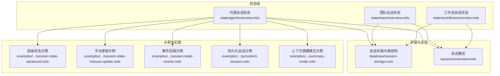
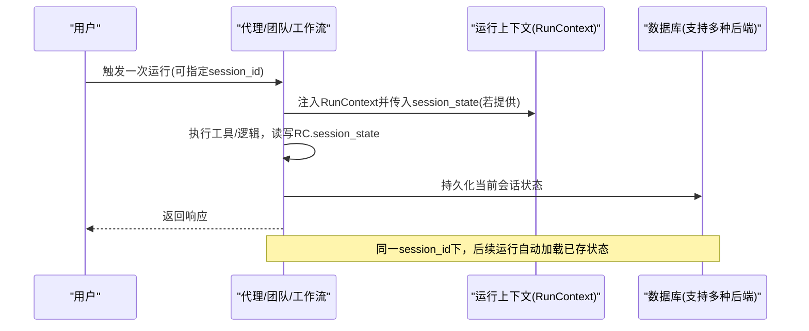
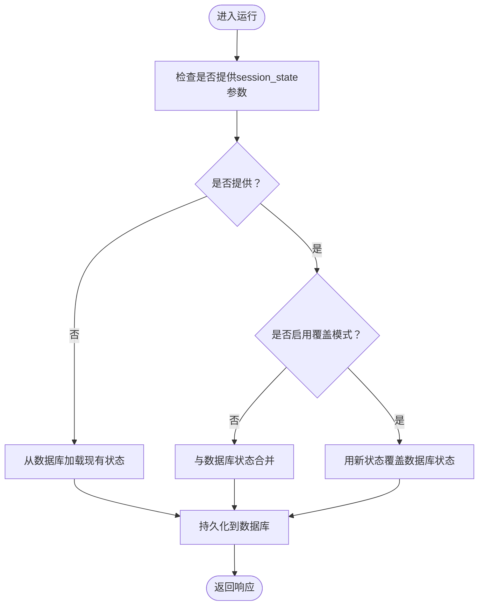
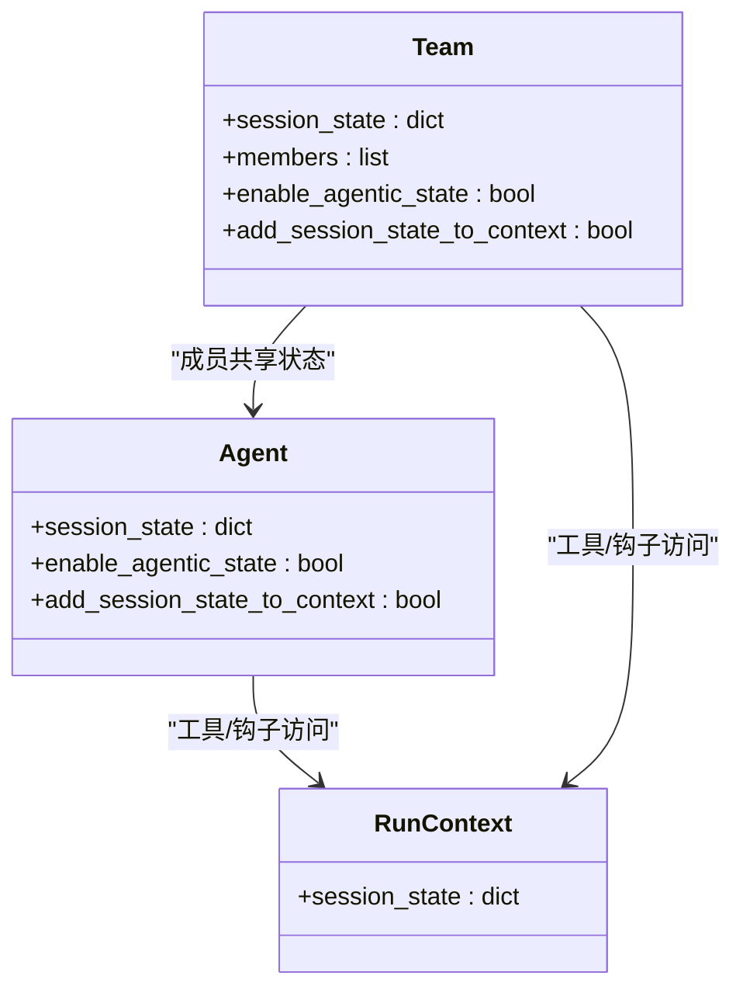
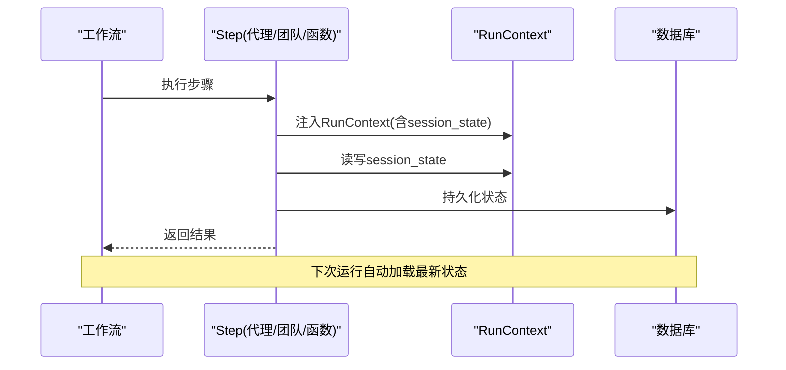
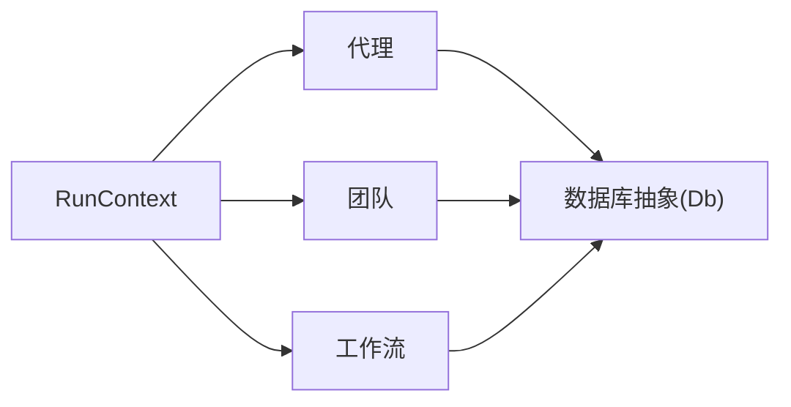

# 高级会话状态

<cite>
**本文引用的文件**
- [state/agent/overview.mdx](file://state/agent/overview.mdx)
- [state/team/overview.mdx](file://state/team/overview.mdx)
- [state/workflows/overview.mdx](file://state/workflows/overview.mdx)
- [database/session-storage.mdx](file://database/session-storage.mdx)
- [sessions/overview.mdx](file://sessions/overview.mdx)
- [examples/agents/state-and-session/session-state-advanced.mdx](file://examples/agents/state-and-session/session-state-advanced.mdx)
- [examples/agents/state-and-session/session-state-manual-update.mdx](file://examples/agents/state-and-session/session-state-manual-update.mdx)
- [examples/agents/state-and-session/session-state-events.mdx](file://examples/agents/state-and-session/session-state-events.mdx)
- [examples/agents/state-and-session/persistent-session.mdx](file://examples/agents/state-and-session/persistent-session.mdx)
- [examples/learning/session-context/summary-mode.mdx](file://examples/learning/session-context/summary-mode.mdx)
</cite>

## 目录
1. 引言
2. 项目结构
3. 核心组件
4. 架构总览
5. 详细组件分析
6. 依赖关系分析
7. 性能考虑
8. 故障排查指南
9. 结论
10. 附录

## 引言
本技术文档聚焦于“高级会话状态”能力，系统阐述在代理（Agent）、团队（Team）与工作流（Workflow）中如何实现跨运行、跨组件的状态持久化与共享，并深入解析以下主题：
- 状态合并、覆盖与冲突解决机制
- overwrite_db_session_state 参数的使用场景与影响
- 状态版本控制与历史记录管理
- 状态备份与恢复、数据迁移与状态同步策略
- 复杂业务场景下的高级配置示例
- 性能优化与内存使用策略
- 状态监控与调试方法（变更跟踪与问题诊断）

## 项目结构
围绕会话状态的关键文档分布在如下模块：
- 代理会话状态：定义状态初始化、工具访问、指令引用、跨运行持久化与自动更新等
- 团队会话状态：在多智能体间共享与同步状态
- 工作流会话状态：在多步骤、多组件间协调状态
- 会话存储与表结构：会话表字段、检索与跨组件一致性
- 示例与用法：高级状态管理、手动更新、事件回调、持久化会话与上下文摘要模式

**图表来源**
- [state/agent/overview.mdx:1-306](file://state/agent/overview.mdx#L1-L306)
- [state/team/overview.mdx:1-357](file://state/team/overview.mdx#L1-L357)
- [state/workflows/overview.mdx:1-295](file://state/workflows/overview.mdx#L1-L295)
- [database/session-storage.mdx:1-119](file://database/session-storage.mdx#L1-L119)
- [sessions/overview.mdx:1-24](file://sessions/overview.mdx#L1-L24)
- [examples/agents/state-and-session/session-state-advanced.mdx:1-124](file://examples/agents/state-and-session/session-state-advanced.mdx#L1-L124)
- [examples/agents/state-and-session/session-state-manual-update.mdx:1-73](file://examples/agents/state-and-session/session-state-manual-update.mdx#L1-L73)
- [examples/agents/state-and-session/session-state-events.mdx:1-72](file://examples/agents/state-and-session/session-state-events.mdx#L1-L72)
- [examples/agents/state-and-session/persistent-session.mdx:1-50](file://examples/agents/state-and-session/persistent-session.mdx#L1-L50)
- [examples/learning/session-context/summary-mode.mdx:45-93](file://examples/learning/session-context/summary-mode.mdx#L45-L93)

**章节来源**
- [state/agent/overview.mdx:1-306](file://state/agent/overview.mdx#L1-L306)
- [state/team/overview.mdx:1-357](file://state/team/overview.mdx#L1-L357)
- [state/workflows/overview.mdx:1-295](file://state/workflows/overview.mdx#L1-L295)
- [database/session-storage.mdx:1-119](file://database/session-storage.mdx#L1-L119)
- [sessions/overview.mdx:1-24](file://sessions/overview.mdx#L1-L24)

## 核心组件
- 会话（Session）
  - 会话是多轮对话线程，包含所有运行（Run）、历史、状态与指标；需要数据库以持久化历史与状态
  - 会话通过唯一标识符（session_id）串联起多次交互
- 会话状态（Session State）
  - 在工具调用、钩子、函数中可访问；可在系统提示中引用变量
  - 默认初始状态由 Agent/Team/Workflow 的 session_state 提供；每次运行可通过参数覆盖
  - 数据库可用时，状态会在同一会话内跨运行持久化并自动加载
- 运行上下文（RunContext）
  - 自动注入到工具与函数中，提供对 session_state 的读写入口
  - 对 session_state 的修改会被自动持久化
- 存储层（Db）
  - 支持多种后端（SQLite、PostgreSQL、JSON 文件、Redis、GCS 等），用于会话与状态持久化
  - 会话表包含会话元数据、运行列表、摘要等字段

**章节来源**
- [sessions/overview.mdx:1-24](file://sessions/overview.mdx#L1-L24)
- [state/agent/overview.mdx:14-35](file://state/agent/overview.mdx#L14-L35)
- [state/team/overview.mdx:14-57](file://state/team/overview.mdx#L14-L57)
- [state/workflows/overview.mdx:8-42](file://state/workflows/overview.mdx#L8-L42)
- [database/session-storage.mdx:30-51](file://database/session-storage.mdx#L30-L51)

## 架构总览
下图展示了从运行到状态持久化的整体流程，以及跨组件（代理、团队、工作流）的状态共享与同步。

**图表来源**
- [state/agent/overview.mdx:25-35](file://state/agent/overview.mdx#L25-L35)
- [state/team/overview.mdx:14-57](file://state/team/overview.mdx#L14-L57)
- [state/workflows/overview.mdx:37-42](file://state/workflows/overview.mdx#L37-L42)
- [database/session-storage.mdx:30-51](file://database/session-storage.mdx#L30-L51)

## 详细组件分析

### 代理会话状态
- 初始化与默认值：通过 Agent 的 session_state 设置默认状态；在系统提示中可直接引用键值
- 跨运行持久化：数据库可用时，状态在同一会话内跨运行自动加载与保存
- 自动更新：开启 enable_agentic_state 后，系统提供工具自动管理会话状态
- 覆盖策略：默认将传入的 session_state 与数据库中的状态进行合并；可通过 overwrite_db_session_state 控制是否覆盖
- 工具与钩子：工具与钩子通过 RunContext.session_state 访问与修改状态，修改会被持久化

**图表来源**
- [state/agent/overview.mdx:260-300](file://state/agent/overview.mdx#L260-L300)

**章节来源**
- [state/agent/overview.mdx:25-306](file://state/agent/overview.mdx#L25-L306)

### 团队会话状态
- 共享状态：Team 的 session_state 在成员之间共享并同步
- 工具访问：团队成员工具通过 RunContext.session_state 访问与更新共享状态
- 自动更新：开启 enable_agentic_state 后，团队与成员均可自动更新共享状态
- 覆盖策略：与代理一致，默认合并，可通过 overwrite_db_session_state 控制覆盖

**图表来源**
- [state/team/overview.mdx:14-57](file://state/team/overview.mdx#L14-L57)
- [state/team/overview.mdx:170-213](file://state/team/overview.mdx#L170-L213)

**章节来源**
- [state/team/overview.mdx:1-357](file://state/team/overview.mdx#L1-L357)

### 工作流会话状态
- 组件共享：工作流内的代理、团队与自定义函数共享同一 session_state
- 运行上下文注入：工具与函数通过 RunContext.session_state 读写状态
- 条件与路由：条件评估器与路由器也可通过 RunContext.session_state 做分支决策
- 持久化：数据库可用时，状态在后续运行中自动加载

**图表来源**
- [state/workflows/overview.mdx:37-42](file://state/workflows/overview.mdx#L37-L42)
- [state/workflows/overview.mdx:200-249](file://state/workflows/overview.mdx#L200-L249)

**章节来源**
- [state/workflows/overview.mdx:1-295](file://state/workflows/overview.mdx#L1-L295)

### 状态合并、覆盖与冲突解决
- 默认行为：传入的 session_state 与数据库中现有状态进行合并
- 覆盖模式：启用 overwrite_db_session_state 后，新状态将完全覆盖数据库中的状态
- 冲突处理建议：
  - 明确区分“默认初始值”与“运行时覆盖值”，避免意外覆盖
  - 对关键状态采用“部分覆盖”策略（仅更新必要字段），减少冲突
  - 使用事件回调或钩子在持久化前做校验与归并

**章节来源**
- [state/agent/overview.mdx:260-300](file://state/agent/overview.mdx#L260-L300)
- [state/team/overview.mdx:268-307](file://state/team/overview.mdx#L268-L307)

### 状态版本控制与历史记录管理
- 会话表结构：包含会话元数据、运行列表、摘要等字段，便于追踪状态变化与回溯
- 历史检索：通过 get_session 获取完整会话，查看 runs 列表与历史消息
- 版本化建议：
  - 在 session_state 中维护版本号或时间戳字段，用于排序与比较
  - 将关键状态变更记录到 runs 或独立审计表中，便于审计与回滚

**章节来源**
- [database/session-storage.mdx:30-51](file://database/session-storage.mdx#L30-L51)
- [database/session-storage.mdx:52-92](file://database/session-storage.mdx#L52-L92)

### 状态备份与恢复、迁移与同步
- 备份与恢复：
  - 通过数据库导出/导入实现状态备份与恢复
  - 对于分布式存储（如 Redis/GCS），可利用其快照/备份能力
- 数据迁移：
  - 在不同后端之间迁移时，遵循会话表字段映射，确保 session_state 字段正确转换
- 同步策略：
  - 对于并发写入，建议在工具层增加幂等性与锁机制
  - 使用事件驱动的方式在状态变更后触发同步任务

**章节来源**
- [database/session-storage.mdx:1-29](file://database/session-storage.mdx#L1-L29)

### 高级配置示例与复杂场景
- 高级状态管理示例：展示在工具中安全地初始化与更新 session_state
- 手动更新示例：通过 get_session_state 与 update_session_state 实现外部修改
- 事件回调示例：监听 RunCompletedEvent 获取最终 session_state
- 持久化会话示例：指定 session_id 与数据库，实现跨进程/重启的连续会话
- 上下文摘要模式示例：在调试与学习场景中，打印与复盘 session 上下文

**章节来源**
- [examples/agents/state-and-session/session-state-advanced.mdx:1-124](file://examples/agents/state-and-session/session-state-advanced.mdx#L1-L124)
- [examples/agents/state-and-session/session-state-manual-update.mdx:1-73](file://examples/agents/state-and-session/session-state-manual-update.mdx#L1-L73)
- [examples/agents/state-and-session/session-state-events.mdx:1-72](file://examples/agents/state-and-session/session-state-events.mdx#L1-L72)
- [examples/agents/state-and-session/persistent-session.mdx:1-50](file://examples/agents/state-and-session/persistent-session.mdx#L1-L50)
- [examples/learning/session-context/summary-mode.mdx:45-93](file://examples/learning/session-context/summary-mode.mdx#L45-L93)

## 依赖关系分析
- 组件耦合
  - RunContext 是状态访问的核心接口，贯穿代理、团队、工作流
  - 数据库抽象（Db）屏蔽具体存储差异，便于切换与扩展
- 外部依赖
  - 存储后端（SQLite、PostgreSQL、Redis、GCS、JSON 文件）的选择影响性能与可靠性
- 可能的循环依赖
  - 工具与钩子不应直接依赖上层组件，应通过 RunContext 解耦

**图表来源**
- [state/agent/overview.mdx:31-35](file://state/agent/overview.mdx#L31-L35)
- [state/team/overview.mdx:53-57](file://state/team/overview.mdx#L53-L57)
- [state/workflows/overview.mdx:41-42](file://state/workflows/overview.mdx#L41-L42)

**章节来源**
- [state/agent/overview.mdx:1-306](file://state/agent/overview.mdx#L1-L306)
- [state/team/overview.mdx:1-357](file://state/team/overview.mdx#L1-L357)
- [state/workflows/overview.mdx:1-295](file://state/workflows/overview.mdx#L1-L295)

## 性能考虑
- 存储选择
  - SQLite：轻量、易部署，适合开发与小规模生产
  - PostgreSQL：强一致、查询能力强，适合高并发与复杂查询
  - Redis：高性能缓存，适合高频读写与实时性要求高的场景
  - GCS/JSON：分布式、易于备份，适合云原生与跨环境迁移
- 状态大小控制
  - 限制 session_state 的体积，避免单条记录过大导致 IO 延迟
  - 对大对象采用引用而非内嵌，或分表存储
- 并发与锁
  - 对热点键加锁或采用乐观并发控制
  - 批量写入与异步持久化降低阻塞
- 缓存与预热
  - 对常用会话状态进行缓存，减少数据库访问
  - 启动时按需预热最近活跃会话

## 故障排查指南
- 状态未持久化
  - 确认已配置数据库且具备写权限
  - 检查 session_id 是否正确传递
- 状态被意外覆盖
  - 关注 overwrite_db_session_state 的设置
  - 在工具中增加校验与日志，防止误覆盖
- 并发冲突
  - 在工具层增加幂等性判断与重试
  - 使用事件回调或钩子记录状态变更轨迹
- 事件与调试
  - 使用 RunCompletedEvent 获取最终状态
  - 在学习与调试场景中，打印 session 上下文以辅助定位问题

**章节来源**
- [examples/agents/state-and-session/session-state-events.mdx:48-58](file://examples/agents/state-and-session/session-state-events.mdx#L48-L58)
- [examples/learning/session-context/summary-mode.mdx:45-93](file://examples/learning/session-context/summary-mode.mdx#L45-L93)

## 结论
高级会话状态通过统一的 RunContext 接口与可插拔的存储后端，在代理、团队与工作流中实现了跨运行、跨组件的状态共享与持久化。通过合理的合并/覆盖策略、版本与历史管理、备份与迁移方案，以及性能优化与调试手段，可以在复杂业务场景中稳定地构建状态驱动的智能体系统。

## 附录
- 相关参考
  - 会话概览与运行模型
  - 会话存储与表结构
  - 示例：高级状态、手动更新、事件回调、持久化会话、上下文摘要模式

**章节来源**
- [sessions/overview.mdx:1-24](file://sessions/overview.mdx#L1-L24)
- [database/session-storage.mdx:1-119](file://database/session-storage.mdx#L1-L119)
- [examples/agents/state-and-session/session-state-advanced.mdx:1-124](file://examples/agents/state-and-session/session-state-advanced.mdx#L1-L124)
- [examples/agents/state-and-session/session-state-manual-update.mdx:1-73](file://examples/agents/state-and-session/session-state-manual-update.mdx#L1-L73)
- [examples/agents/state-and-session/session-state-events.mdx:1-72](file://examples/agents/state-and-session/session-state-events.mdx#L1-L72)
- [examples/agents/state-and-session/persistent-session.mdx:1-50](file://examples/agents/state-and-session/persistent-session.mdx#L1-L50)
- [examples/learning/session-context/summary-mode.mdx:45-93](file://examples/learning/session-context/summary-mode.mdx#L45-L93)