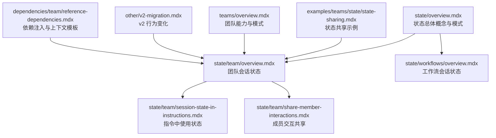
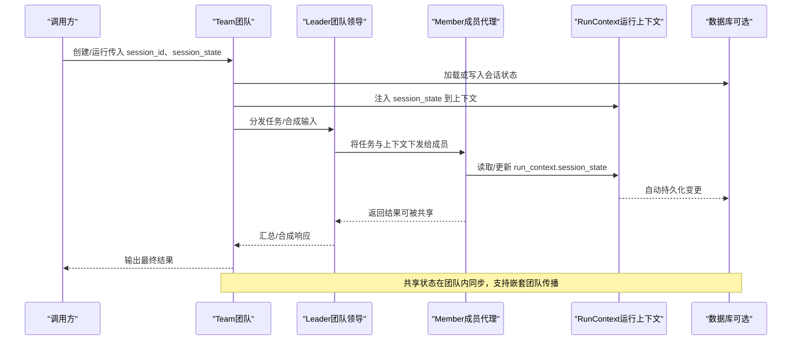
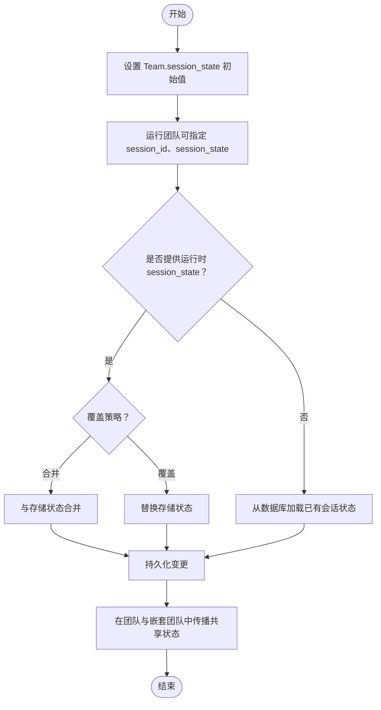
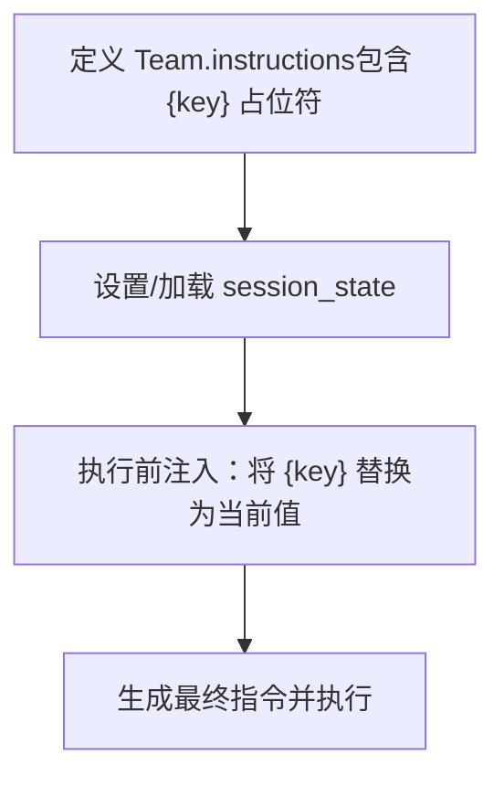
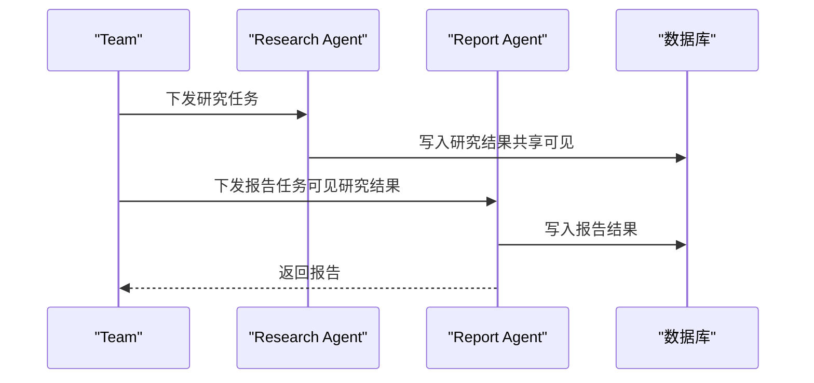
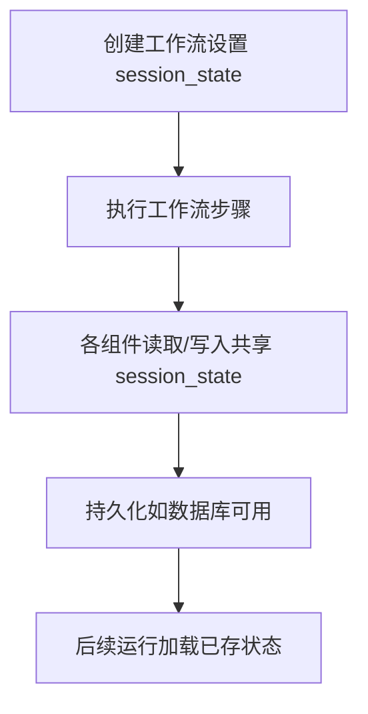
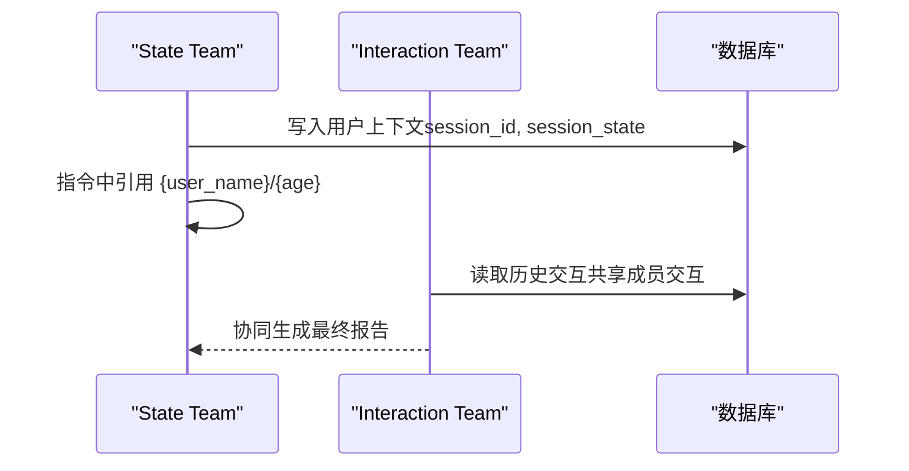
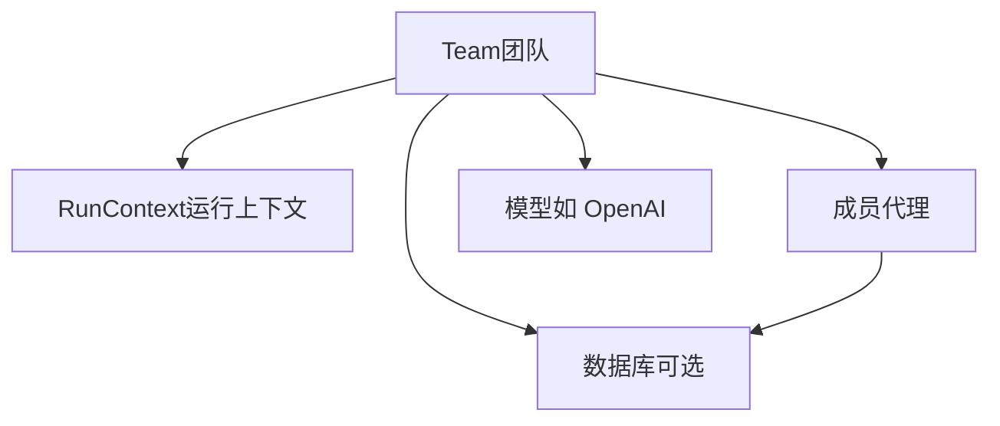

# 团队状态

<cite>
**本文引用的文件**
- [state/team/overview.mdx](file://state/team/overview.mdx)
- [state/team/session-state-in-instructions.mdx](file://state/team/session-state-in-instructions.mdx)
- [state/team/share-member-interactions.mdx](file://state/team/share-member-interactions.mdx)
- [state/workflows/overview.mdx](file://state/workflows/overview.mdx)
- [state/overview.mdx](file://state/overview.mdx)
- [examples/teams/state/state-sharing.mdx](file://examples/teams/state/state-sharing.mdx)
- [examples/teams/state/overview.mdx](file://examples/teams/state/overview.mdx)
- [teams/overview.mdx](file://teams/overview.mdx)
- [other/v2-migration.mdx](file://other/v2-migration.mdx)
- [dependencies/team/reference-dependencies.mdx](file://dependencies/team/reference-dependencies.mdx)
</cite>

## 目录
1. [引言](#引言)
2. [项目结构](#项目结构)
3. [核心组件](#核心组件)
4. [架构总览](#架构总览)
5. [详细组件分析](#详细组件分析)
6. [依赖关系分析](#依赖关系分析)
7. [性能考量](#性能考量)
8. [故障排查指南](#故障排查指南)
9. [结论](#结论)
10. [附录](#附录)

## 引言
本文件系统化阐述“团队状态”的概念、作用与实现方式，重点覆盖以下主题：
- 团队状态在多代理协作中的重要性：统一上下文、跨成员共享、跨嵌套团队传播、持久化与可检索。
- 初始化与配置：团队级默认状态、运行时会话态切换、指令中直接引用状态变量。
- 访问与修改机制：工具函数通过运行上下文访问与更新共享状态，并自动持久化。
- 指令中的使用：在团队指令中以模板语法引用会话状态变量，实现动态上下文注入。
- 成员交互共享：开启成员交互共享后，团队成员可互相学习彼此输出，形成协同工作流。
- 最佳实践：状态设计原则、并发与一致性策略、错误处理与回滚建议。
- 复杂协作场景示例：购物清单、用户画像与上下文个性化、跨团队状态共享与历史检索。

## 项目结构
围绕“团队状态”的知识分布在如下位置：
- 团队状态概览与用法：state/team/overview.mdx
- 在指令中使用状态：state/team/session-state-in-instructions.mdx
- 成员交互共享：state/team/share-member-interactions.mdx
- 工作流会话状态：state/workflows/overview.mdx
- 状态总体概念与模式：state/overview.mdx
- 示例集合（含状态共享、变更、覆盖等）：examples/teams/state/*
- 团队能力与执行模式背景：teams/overview.mdx
- v2 迁移与行为变化：other/v2-migration.mdx
- 依赖注入与上下文模板：dependencies/team/reference-dependencies.mdx

**图示来源**
- [state/overview.mdx:1-80](file://state/overview.mdx#L1-L80)
- [state/team/overview.mdx:1-357](file://state/team/overview.mdx#L1-L357)
- [state/team/session-state-in-instructions.mdx:1-47](file://state/team/session-state-in-instructions.mdx#L1-L47)
- [state/team/share-member-interactions.mdx:1-71](file://state/team/share-member-interactions.mdx#L1-L71)
- [state/workflows/overview.mdx:1-39](file://state/workflows/overview.mdx#L1-L39)
- [examples/teams/state/state-sharing.mdx:1-102](file://examples/teams/state/state-sharing.mdx#L1-L102)
- [teams/overview.mdx:43-74](file://teams/overview.mdx#L43-L74)
- [other/v2-migration.mdx:285-301](file://other/v2-migration.mdx#L285-L301)
- [dependencies/team/reference-dependencies.mdx:35-74](file://dependencies/team/reference-dependencies.mdx#L35-L74)

**章节来源**
- [state/overview.mdx:1-80](file://state/overview.mdx#L1-L80)
- [state/team/overview.mdx:1-357](file://state/team/overview.mdx#L1-L357)
- [state/team/session-state-in-instructions.mdx:1-47](file://state/team/session-state-in-instructions.mdx#L1-L47)
- [state/team/share-member-interactions.mdx:1-71](file://state/team/share-member-interactions.mdx#L1-L71)
- [state/workflows/overview.mdx:1-39](file://state/workflows/overview.mdx#L1-L39)
- [examples/teams/state/state-sharing.mdx:1-102](file://examples/teams/state/state-sharing.mdx#L1-L102)
- [teams/overview.mdx:43-74](file://teams/overview.mdx#L43-L74)
- [other/v2-migration.mdx:285-301](file://other/v2-migration.mdx#L285-L301)
- [dependencies/team/reference-dependencies.mdx:35-74](file://dependencies/team/reference-dependencies.mdx#L35-L74)

## 核心组件
- 团队会话状态（Team Session State）
  - 通过 Team 的 session_state 参数初始化，默认在团队领导者与成员间共享。
  - 成员工具可通过运行上下文访问与更新共享状态，变更自动持久化。
  - 支持在嵌套团队结构中传播共享状态。
- 在指令中使用状态
  - 可在团队指令中以模板语法引用 session_state 中的键，框架自动注入当前值。
- 成员交互共享
  - 开启 share_member_interactions 后，成员可互相看到彼此输出，便于协同与复用。
- 工作流会话状态
  - 跨步骤、跨组件（代理、团队、自定义函数）共享状态；具备持久化能力（数据库可用时）。
- 个人状态与团队状态的关系
  - 个人状态仅限单个代理；团队状态在团队内共享，支持跨成员与嵌套团队传播。
  - 两者均可通过 session_state 统一管理，但作用域不同。

**章节来源**
- [state/team/overview.mdx:14-357](file://state/team/overview.mdx#L14-L357)
- [state/workflows/overview.mdx:1-39](file://state/workflows/overview.mdx#L1-L39)
- [state/overview.mdx:8-20](file://state/overview.mdx#L8-L20)

## 架构总览
下图展示了“团队状态”在多代理协作中的关键交互路径：初始化、访问/修改、持久化、加载与传播。

**图示来源**
- [state/team/overview.mdx:14-357](file://state/team/overview.mdx#L14-L357)
- [state/workflows/overview.mdx:23-39](file://state/workflows/overview.mdx#L23-L39)

## 详细组件分析

### 组件A：团队会话状态初始化与配置
- 初始化方式
  - 在 Team 构造时通过 session_state 设置初始共享状态。
  - 支持在运行时通过 session_id 切换到特定会话，并按需传入 session_state 进行合并或覆盖。
- 配置要点
  - add_session_state_to_context：使上下文可访问 session_state。
  - enable_agentic_state：允许团队与成员自动更新共享状态。
  - overwrite_db_session_state：运行时提供的 session_state 是否覆盖存储值。
- 嵌套团队传播
  - 共享状态会在嵌套团队结构中传播，确保子团队也能访问与更新。

**图示来源**
- [state/team/overview.mdx:237-307](file://state/team/overview.mdx#L237-L307)

**章节来源**
- [state/team/overview.mdx:14-357](file://state/team/overview.mdx#L14-L357)

### 组件B：在指令中使用状态变量
- 模板语法
  - 在团队指令中直接使用 {key} 形式的占位符，框架会在执行前自动注入当前 session_state 对应值。
- 注意事项
  - 不要使用 f-string 语法，应直接使用 {key}，由框架进行替换。

**图示来源**
- [state/team/session-state-in-instructions.mdx:12-24](file://state/team/session-state-in-instructions.mdx#L12-L24)
- [state/team/overview.mdx:215-235](file://state/team/overview.mdx#L215-L235)

**章节来源**
- [state/team/session-state-in-instructions.mdx:1-47](file://state/team/session-state-in-instructions.mdx#L1-L47)
- [state/team/overview.mdx:215-235](file://state/team/overview.mdx#L215-L235)

### 组件C：成员交互共享机制
- 功能说明
  - 开启 share_member_interactions 后，团队成员可以互相看到彼此的输出，从而在后续步骤中基于他人结果继续工作。
- 使用场景
  - 研究-报告链路：先研究再写作，报告成员可基于研究成员的输出继续生成。
- 可视化

**图示来源**
- [state/team/share-member-interactions.mdx:12-48](file://state/team/share-member-interactions.mdx#L12-L48)
- [state/team/overview.mdx:309-351](file://state/team/overview.mdx#L309-L351)

**章节来源**
- [state/team/share-member-interactions.mdx:1-71](file://state/team/share-member-interactions.mdx#L1-L71)
- [state/team/overview.mdx:309-351](file://state/team/overview.mdx#L309-L351)

### 组件D：工作流会话状态
- 能力概述
  - 在整个工作流范围内共享状态，包括代理、团队与自定义函数。
  - 若存在数据库，状态会被持久化并在后续运行中加载。
- 流程示意

**图示来源**
- [state/workflows/overview.mdx:23-39](file://state/workflows/overview.mdx#L23-L39)

**章节来源**
- [state/workflows/overview.mdx:1-39](file://state/workflows/overview.mdx#L1-L39)

### 组件E：示例：跨团队状态共享与成员交互
- 示例要点
  - 通过 session_id 与 session_state 在不同会话中维护用户上下文。
  - 在团队指令中引用用户姓名与年龄，实现个性化回答。
  - 通过共享成员交互，实现研究-报告的协同流程。
- 参考路径
  - [examples/teams/state/state-sharing.mdx:1-102](file://examples/teams/state/state-sharing.mdx#L1-L102)

**图示来源**
- [examples/teams/state/state-sharing.mdx:71-87](file://examples/teams/state/state-sharing.mdx#L71-L87)
- [state/team/overview.mdx:309-351](file://state/team/overview.mdx#L309-L351)

**章节来源**
- [examples/teams/state/state-sharing.mdx:1-102](file://examples/teams/state/state-sharing.mdx#L1-L102)
- [state/team/overview.mdx:309-351](file://state/team/overview.mdx#L309-L351)

### 组件F：个人状态与团队状态的区别与联系
- 区别
  - 个人状态：仅属于单个代理，不跨成员共享。
  - 团队状态：在团队内共享，支持跨成员与嵌套团队传播。
- 联系
  - 二者均通过 session_state 管理，遵循相同的初始化、访问、更新、持久化与加载模式。
  - 可在同一系统中并存：个人状态用于私有记忆，团队状态用于协作上下文。
- 参考路径
  - [state/overview.mdx:8-20](file://state/overview.mdx#L8-L20)
  - [state/team/overview.mdx:14-357](file://state/team/overview.mdx#L14-L357)

**章节来源**
- [state/overview.mdx:8-20](file://state/overview.mdx#L8-L20)
- [state/team/overview.mdx:14-357](file://state/team/overview.mdx#L14-L357)

## 依赖关系分析
- 组件耦合
  - Team 与 RunContext：工具通过 run_context.session_state 访问/更新共享状态。
  - Team 与数据库：当配置了数据库时，状态变更自动持久化；运行时可按会话 ID 加载/覆盖。
  - Team 与成员：共享状态在团队与嵌套团队中传播；开启成员交互共享后，成员输出对其他成员可见。
- 外部依赖
  - 数据库提供者：SQLite、PostgreSQL 等，用于持久化会话状态。
  - 模型提供者：OpenAI 等，用于执行推理与生成。
- 可能的循环依赖
  - 无直接循环依赖；状态管理通过上下文注入与数据库持久化解耦。

**图示来源**
- [state/team/overview.mdx:14-357](file://state/team/overview.mdx#L14-L357)

**章节来源**
- [state/team/overview.mdx:14-357](file://state/team/overview.mdx#L14-L357)

## 性能考量
- 并发与一致性
  - 多成员并发执行时，共享状态的更新需要保证一致性；建议采用原子操作或事务写入。
- 持久化开销
  - 频繁写入数据库可能带来延迟；可结合批量写入与缓存策略降低开销。
- 上下文膨胀
  - session_state 过大可能影响提示长度与成本；建议拆分状态、清理冗余数据。
- 嵌套团队传播
  - 嵌套层级过深可能导致状态传播复杂度上升；建议控制团队层级并明确状态边界。

## 故障排查指南
- 症状：共享状态未生效或未传播
  - 排查点：是否设置了 add_session_state_to_context；是否正确传入 session_id；嵌套团队是否启用状态传播。
- 症状：运行时 session_state 未覆盖存储值
  - 排查点：overwrite_db_session_state 是否开启；运行时传参是否正确。
- 症状：指令中 {key} 未被替换
  - 排查点：是否使用了正确的占位符语法；是否在运行时注入了 session_state。
- 症状：成员交互未共享
  - 排查点：是否开启 share_member_interactions；成员是否可见彼此输出。

**章节来源**
- [state/team/overview.mdx:268-307](file://state/team/overview.mdx#L268-L307)
- [state/team/session-state-in-instructions.mdx:12-24](file://state/team/session-state-in-instructions.mdx#L12-L24)
- [state/team/share-member-interactions.mdx:12-48](file://state/team/share-member-interactions.mdx#L12-L48)

## 结论
团队状态是多代理协作的核心基础设施，它统一了跨成员、跨嵌套团队的上下文，实现了状态的自动注入、更新与持久化。通过合理的初始化策略、指令模板化引用、成员交互共享以及持久化配置，可以在复杂协作场景中实现高一致性与可扩展性。建议在实践中遵循状态设计原则与并发控制策略，结合数据库与缓存优化性能，并通过示例与最佳实践持续迭代。

## 附录
- 实际示例参考
  - 团队状态共享示例：[examples/teams/state/state-sharing.mdx:1-102](file://examples/teams/state/state-sharing.mdx#L1-L102)
  - 指令中使用状态示例：[state/team/session-state-in-instructions.mdx:1-47](file://state/team/session-state-in-instructions.mdx#L1-L47)
  - 成员交互共享示例：[state/team/share-member-interactions.mdx:1-71](file://state/team/share-member-interactions.mdx#L1-L71)
  - 工作流会话状态概览：[state/workflows/overview.mdx:1-39](file://state/workflows/overview.mdx#L1-L39)
- 相关背景
  - 团队能力与模式：[teams/overview.mdx:43-74](file://teams/overview.mdx#L43-L74)
  - v2 行为变化（团队类重构）：[other/v2-migration.mdx:285-301](file://other/v2-migration.mdx#L285-L301)
  - 依赖注入与上下文模板：[dependencies/team/reference-dependencies.mdx:35-74](file://dependencies/team/reference-dependencies.mdx#L35-L74)