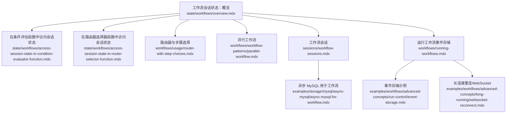
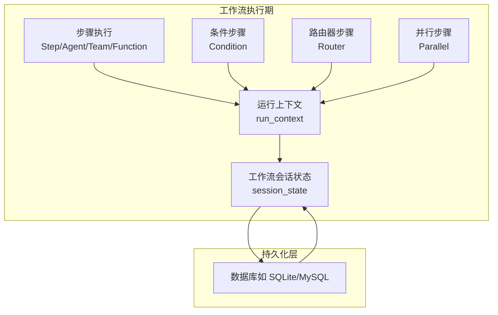
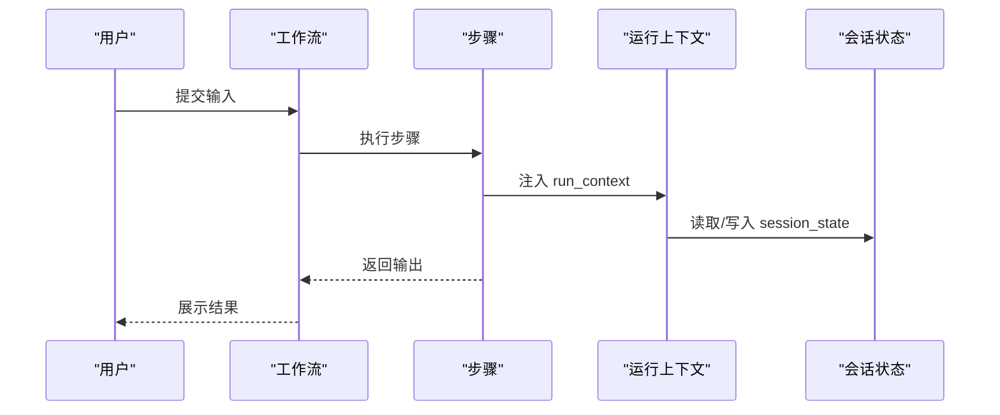
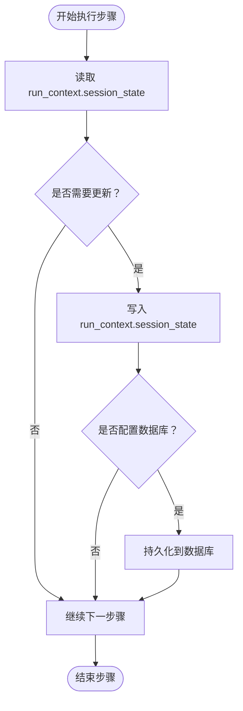
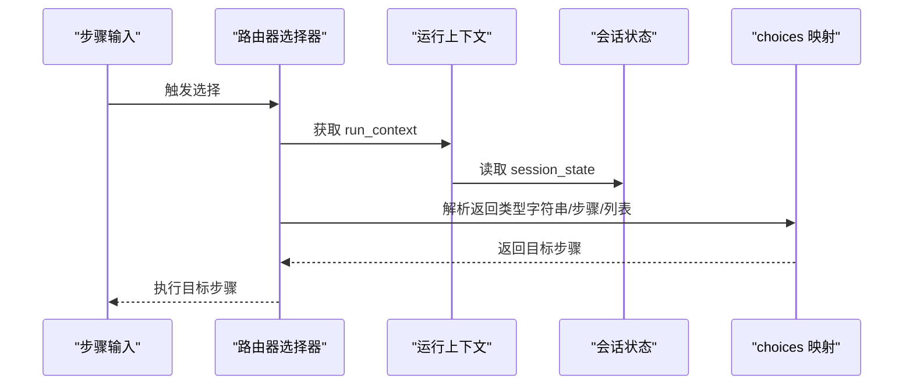
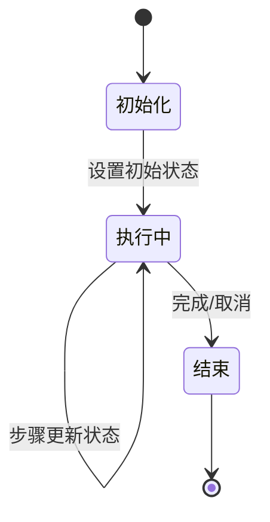
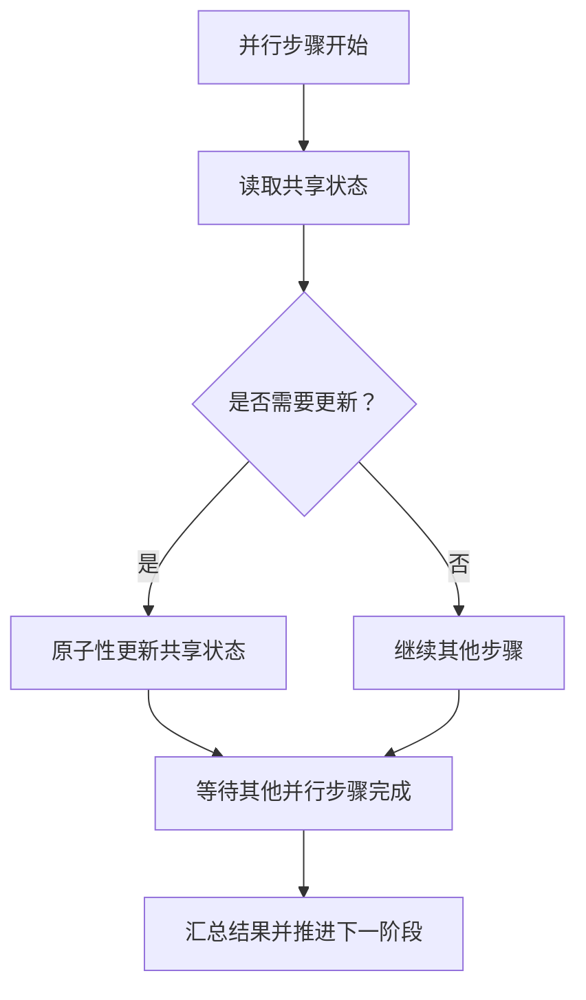
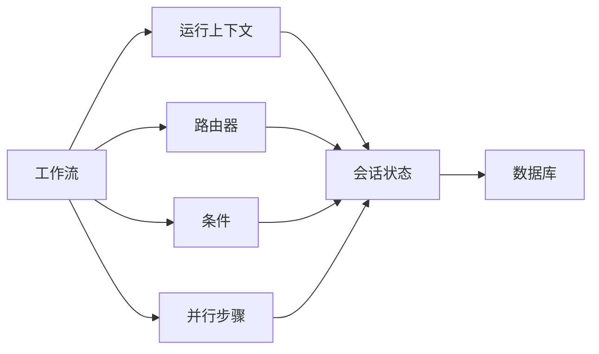

# 工作流状态

<cite>
**本文引用的文件**
- [工作流会话状态：概览](file://state/workflows/overview.mdx)
- [在条件评估函数中访问会话状态](file://state/workflows/access-session-state-in-condition-evaluator-function.mdx)
- [在路由器选择器函数中访问会话状态](file://state/workflows/access-session-state-in-router-selector-function.mdx)
- [路由器与步骤选择](file://workflows/usage/router-with-step-choices.mdx)
- [并行工作流](file://workflows/workflow-patterns/parallel-workflow.mdx)
- [工作流会话](file://sessions/workflow-sessions.mdx)
- [运行工作流](file://workflows/running-workflows.mdx)
- [异步 MySQL 用于工作流](file://examples/storage/mysql/async-mysql/async-mysql-for-workflow.mdx)
- [事件存储示例](file://examples/workflows/advanced-concepts/run-control/event-storage.mdx)
- [长连接重连（WebSocket）](file://examples/workflows/advanced-concepts/long-running/websocket-reconnect.mdx)
- [取消运行示例](file://examples/workflows/advanced-concepts/run-control/cancel-run.mdx)
</cite>

## 目录
1. [简介](#简介)
2. [项目结构](#项目结构)
3. [核心组件](#核心组件)
4. [架构总览](#架构总览)
5. [详细组件分析](#详细组件分析)
6. [依赖关系分析](#依赖关系分析)
7. [性能考量](#性能考量)
8. [故障排查指南](#故障排查指南)
9. [结论](#结论)
10. [附录](#附录)

## 简介
本技术文档围绕“工作流状态”展开，系统阐述其在复杂任务编排中的作用、访问方式、更新机制、持久化策略、路由决策应用、生命周期管理、并行执行处理策略，以及调试与监控方法。工作流状态是贯穿多步骤、多组件（代理、团队、自定义函数、路由器、条件判断等）的共享数据容器，支持跨步骤持久化与一致性保障，使工作流具备“有记忆”的能力，从而实现更灵活、可追踪、可演进的业务流程。

## 项目结构
本仓库中与“工作流状态”直接相关的内容主要分布在以下路径：
- state/workflows：工作流会话状态的概念、初始化、访问与更新示例
- workflows/usage：路由器与步骤选择、条件分支等运行时控制
- workflows/workflow-patterns：并行工作流与并发状态访问注意事项
- sessions：工作流会话与历史记录的组织结构与持久化
- workflows/running-workflows：事件存储与运行期可观测性
- examples/storage/mysql：数据库持久化与会话读取示例
- examples/workflows/advanced-concepts：事件存储、长连接重连、取消运行等高级运行控制示例

**图表来源**
- [工作流会话状态：概览:1-295](file://state/workflows/overview.mdx#L1-L295)
- [在条件评估函数中访问会话状态:1-165](file://state/workflows/access-session-state-in-condition-evaluator-function.mdx#L1-L165)
- [在路由器选择器函数中访问会话状态:1-233](file://state/workflows/access-session-state-in-router-selector-function.mdx#L1-L233)
- [路由器与步骤选择:1-45](file://workflows/usage/router-with-step-choices.mdx#L1-L45)
- [并行工作流:1-54](file://workflows/workflow-patterns/parallel-workflow.mdx#L1-L54)
- [工作流会话:1-243](file://sessions/workflow-sessions.mdx#L1-L243)
- [运行工作流:536-574](file://workflows/running-workflows.mdx#L536-L574)
- [异步 MySQL 用于工作流:89-116](file://examples/storage/mysql/async-mysql/async-mysql-for-workflow.mdx#L89-L116)
- [事件存储示例:150-166](file://examples/workflows/advanced-concepts/run-control/event-storage.mdx#L150-L166)
- [长连接重连（WebSocket）:196-230](file://examples/workflows/advanced-concepts/long-running/websocket-reconnect.mdx#L196-L230)

**章节来源**
- [工作流会话状态：概览:1-295](file://state/workflows/overview.mdx#L1-L295)
- [工作流会话:1-243](file://sessions/workflow-sessions.mdx#L1-L243)

## 核心组件
- 工作流会话状态（Workflow Session State）
  - 定义：在工作流范围内共享的、可持久化的数据对象，供所有步骤与组件读写。
  - 初始化：创建工作流时通过构造参数注入初始状态。
  - 访问：在自定义Python函数、条件评估器、路由器选择器、代理/团队工具中通过运行上下文访问。
  - 更新：在步骤执行过程中修改状态，后续步骤可见。
  - 持久化：当配置数据库时，状态随会话持久化并在后续运行加载。

- 运行上下文（RunContext）
  - run_context.session_state 即为工作流会话状态的入口。
  - 在自定义函数、条件评估器、路由器选择器中作为参数自动注入。

- 路由器（Router）与条件（Condition）
  - 路由器根据会话状态动态选择下一步骤或步骤序列。
  - 条件根据会话状态决定是否执行某一分支。

- 并行步骤（Parallel）
  - 并行执行多个独立步骤；若涉及对共享状态的更新，需注意并发协调以避免竞态。

- 会话与历史（Workflow Session & History）
  - 会话保存完整的运行历史与结果，支持按会话检索与命名。
  - 历史功能可将先前运行结果前置到步骤输入，形成上下文增强。

**章节来源**
- [工作流会话状态：概览:25-275](file://state/workflows/overview.mdx#L25-L275)
- [并行工作流:42-46](file://workflows/workflow-patterns/parallel-workflow.mdx#L42-L46)
- [工作流会话:54-91](file://sessions/workflow-sessions.mdx#L54-L91)

## 架构总览
下图展示了工作流状态在多组件间的流转与持久化关系：

**图表来源**
- [工作流会话状态：概览:8-10](file://state/workflows/overview.mdx#L8-L10)
- [工作流会话:29-53](file://sessions/workflow-sessions.mdx#L29-L53)
- [并行工作流:42-46](file://workflows/workflow-patterns/parallel-workflow.mdx#L42-L46)

## 详细组件分析

### 组件一：工作流会话状态的初始化与访问
- 初始化
  - 在创建工作流时传入初始 session_state，作为整个工作流的共享数据源。
- 访问与修改
  - 自定义Python函数、代理/团队工具、条件评估器、路由器选择器均可通过 run_context.session_state 读写。
- 示例要点
  - 购物清单示例展示了添加、删除、清空与列出条目的工具如何读写共享状态。
  - 条件评估器示例展示了如何基于会话状态判断是否问候用户。
  - 路由器选择器示例展示了如何依据用户偏好动态路由到不同代理。

**图表来源**
- [工作流会话状态：概览:37-218](file://state/workflows/overview.mdx#L37-L218)
- [在条件评估函数中访问会话状态:26-54](file://state/workflows/access-session-state-in-condition-evaluator-function.mdx#L26-L54)
- [在路由器选择器函数中访问会话状态:26-87](file://state/workflows/access-session-state-in-router-selector-function.mdx#L26-L87)

**章节来源**
- [工作流会话状态：概览:25-218](file://state/workflows/overview.mdx#L25-L218)
- [在条件评估函数中访问会话状态:1-165](file://state/workflows/access-session-state-in-condition-evaluator-function.mdx#L1-L165)
- [在路由器选择器函数中访问会话状态:1-233](file://state/workflows/access-session-state-in-router-selector-function.mdx#L1-L233)

### 组件二：工作流状态的更新机制与持久化
- 更新机制
  - 步骤执行期间，任何组件均可修改 run_context.session_state。
  - 修改立即对后续步骤可见。
- 持久化
  - 当工作流配置了数据库，会话状态随会话一起持久化，并在后续运行加载。
  - 可通过数据库接口读取会话数据进行验证。

**图表来源**
- [工作流会话状态：概览:8-10](file://state/workflows/overview.mdx#L8-L10)
- [异步 MySQL 用于工作流:89-99](file://examples/storage/mysql/async-mysql/async-mysql-for-workflow.mdx#L89-L99)

**章节来源**
- [工作流会话状态：概览:8-10](file://state/workflows/overview.mdx#L8-L10)
- [异步 MySQL 用于工作流:89-116](file://examples/storage/mysql/async-mysql/async-mysql-for-workflow.mdx#L89-L116)

### 组件三：工作流状态在路由决策中的应用
- 路由器选择器
  - 可返回字符串（步骤名）、步骤对象或步骤列表，实现灵活的动态路由。
  - 通过 run_context.session_state 决策下一步骤或链式执行。
- 条件评估器
  - 基于会话状态决定是否进入某个分支。
- 步骤选择参数（step_choices）
  - 允许在运行时动态检查可用选项，构建可复用的路由逻辑。

**图表来源**
- [路由器与步骤选择:1-45](file://workflows/usage/router-with-step-choices.mdx#L1-L45)
- [在路由器选择器函数中访问会话状态:26-66](file://state/workflows/access-session-state-in-router-selector-function.mdx#L26-L66)

**章节来源**
- [路由器与步骤选择:1-45](file://workflows/usage/router-with-step-choices.mdx#L1-L45)
- [在路由器选择器函数中访问会话状态:1-233](file://state/workflows/access-session-state-in-router-selector-function.mdx#L1-L233)

### 组件四：工作流状态的生命周期管理
- 初始化
  - 创建工作流时设置初始 session_state。
- 执行期更新
  - 各步骤在执行过程中读写状态，保持一致性。
- 清理
  - 可在特定步骤中清空或重置状态，或通过新的会话 ID 开启全新状态。
- 历史与命名
  - 会话包含历史运行记录，支持命名以便识别与检索。

**图表来源**
- [工作流会话状态：概览:25-35](file://state/workflows/overview.mdx#L25-L35)
- [工作流会话:170-211](file://sessions/workflow-sessions.mdx#L170-L211)

**章节来源**
- [工作流会话状态：概览:25-35](file://state/workflows/overview.mdx#L25-L35)
- [工作流会话:170-211](file://sessions/workflow-sessions.mdx#L170-L211)

### 组件五：工作流状态与步骤状态的关系及并行执行策略
- 步骤状态 vs 工作流状态
  - 步骤状态通常指单个步骤的中间结果与元数据；工作流状态是跨步骤共享的数据容器。
  - 步骤状态可被写入工作流状态，实现跨步骤的记忆与传递。
- 并行执行中的状态处理
  - 并行步骤可能同时访问共享状态，需注意并发安全与竞态问题。
  - 建议在关键更新点加锁或采用无冲突的更新策略（如最终合并）。

**图表来源**
- [并行工作流:42-46](file://workflows/workflow-patterns/parallel-workflow.mdx#L42-L46)

**章节来源**
- [并行工作流:42-46](file://workflows/workflow-patterns/parallel-workflow.mdx#L42-L46)

### 组件六：实际案例与最佳实践
- 购物清单工作流
  - 使用工具函数在 run_context.session_state 中维护购物清单，支持增删查清操作。
- 条件问候工作流
  - 基于会话状态判断是否已问候用户，实现个性化交互。
- 动态路由工作流
  - 根据用户偏好与交互次数动态选择不同代理，实现自适应服务。
- 事件存储与长连接
  - 通过事件存储与 WebSocket 重连机制，实现运行期可观测与恢复。

**章节来源**
- [工作流会话状态：概览:43-195](file://state/workflows/overview.mdx#L43-L195)
- [在条件评估函数中访问会话状态:72-139](file://state/workflows/access-session-state-in-condition-evaluator-function.mdx#L72-L139)
- [在路由器选择器函数中访问会话状态:153-207](file://state/workflows/access-session-state-in-router-selector-function.mdx#L153-L207)
- [事件存储示例:150-166](file://examples/workflows/advanced-concepts/run-control/event-storage.mdx#L150-L166)
- [长连接重连（WebSocket）:196-230](file://examples/workflows/advanced-concepts/long-running/websocket-reconnect.mdx#L196-L230)

## 依赖关系分析
- 组件耦合
  - 步骤与运行上下文强耦合（通过 run_context.session_state 访问状态）。
  - 路由器与条件步骤依赖会话状态进行动态决策。
  - 并行步骤与状态存在潜在竞态，需外部同步策略。
- 外部依赖
  - 数据库：用于会话与状态持久化。
  - 事件系统：用于运行期观测与恢复。

**图表来源**
- [工作流会话状态：概览:220-246](file://state/workflows/overview.mdx#L220-L246)
- [并行工作流:42-46](file://workflows/workflow-patterns/parallel-workflow.mdx#L42-L46)
- [工作流会话:29-53](file://sessions/workflow-sessions.mdx#L29-L53)

**章节来源**
- [工作流会话状态：概览:220-246](file://state/workflows/overview.mdx#L220-L246)
- [并行工作流:42-46](file://workflows/workflow-patterns/parallel-workflow.mdx#L42-L46)
- [工作流会话:29-53](file://sessions/workflow-sessions.mdx#L29-L53)

## 性能考量
- 并发更新
  - 并行步骤更新共享状态时建议采用原子更新或串行化关键路径，降低锁竞争。
- 事件存储
  - 启用事件存储有助于调试与审计，但会产生额外 IO；可根据场景选择性开启或过滤事件。
- 历史加载
  - 历史运行结果会拼接到步骤输入，注意控制历史数量与格式大小，避免输入膨胀影响性能。

[本节为通用指导，不直接分析具体文件]

## 故障排查指南
- 无法读取会话状态
  - 确认 run_context.session_state 是否为空，必要时初始化为空字典后再写入。
- 路由未按预期触发
  - 检查路由器选择器返回值类型与 choices 配置是否一致。
- 并发竞态导致状态异常
  - 对共享状态的关键更新加锁或采用最终一致策略。
- 事件缺失或顺序异常
  - 使用事件存储与 WebSocket 重连机制，结合事件索引定位断点并补收历史。
- 运行取消或中断
  - 使用取消运行示例模式，结合事件状态判断最终结果。

**章节来源**
- [在条件评估函数中访问会话状态:26-54](file://state/workflows/access-session-state-in-condition-evaluator-function.mdx#L26-L54)
- [在路由器选择器函数中访问会话状态:26-66](file://state/workflows/access-session-state-in-router-selector-function.mdx#L26-L66)
- [并行工作流:42-46](file://workflows/workflow-patterns/parallel-workflow.mdx#L42-L46)
- [运行工作流:536-574](file://workflows/running-workflows.mdx#L536-L574)
- [事件存储示例:150-166](file://examples/workflows/advanced-concepts/run-control/event-storage.mdx#L150-L166)
- [长连接重连（WebSocket）:196-230](file://examples/workflows/advanced-concepts/long-running/websocket-reconnect.mdx#L196-L230)
- [取消运行示例:72-108](file://examples/workflows/advanced-concepts/run-control/cancel-run.mdx#L72-L108)

## 结论
工作流状态是实现复杂任务编排“有记忆”的关键：它统一了跨组件的数据视图，支撑条件分支与动态路由，保证执行期一致性，并通过数据库实现持久化与可追溯性。在并行场景中，应特别关注状态更新的并发安全；在运行期，借助事件存储与长连接机制可实现可观测与恢复。结合本文提供的案例与最佳实践，可在真实业务中高效落地状态驱动的复杂工作流。

[本节为总结性内容，不直接分析具体文件]

## 附录
- 相关参考
  - [工作流会话状态：概览:1-295](file://state/workflows/overview.mdx#L1-L295)
  - [工作流会话:1-243](file://sessions/workflow-sessions.mdx#L1-L243)
  - [运行工作流（事件存储）:536-574](file://workflows/running-workflows.mdx#L536-L574)
  - [异步 MySQL 用于工作流:89-116](file://examples/storage/mysql/async-mysql/async-mysql-for-workflow.mdx#L89-L116)

[本节为补充材料，不直接分析具体文件]