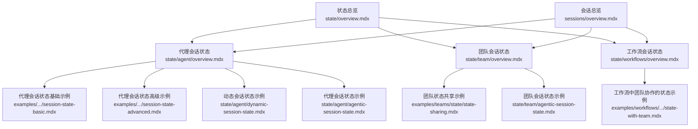
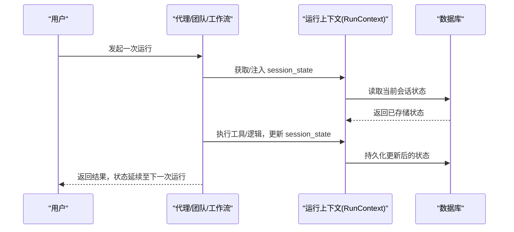
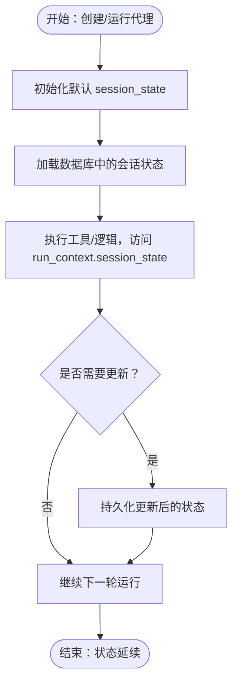
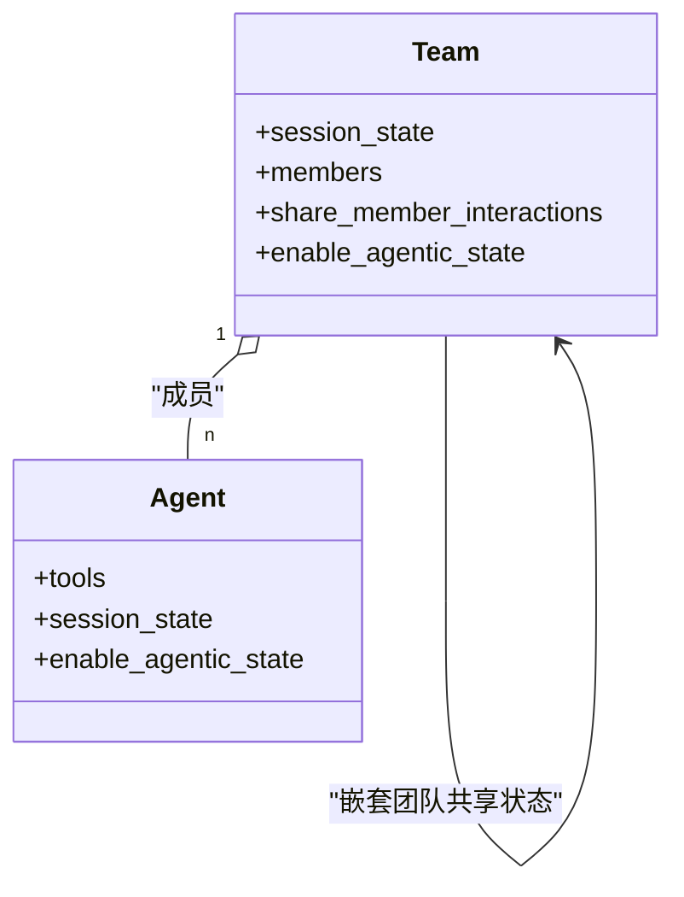
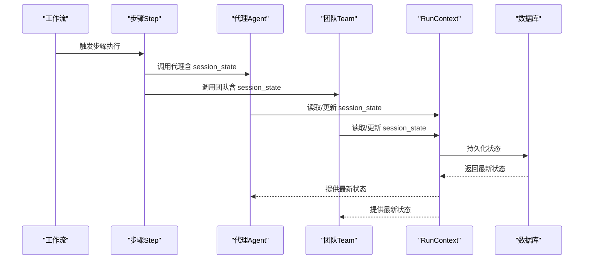
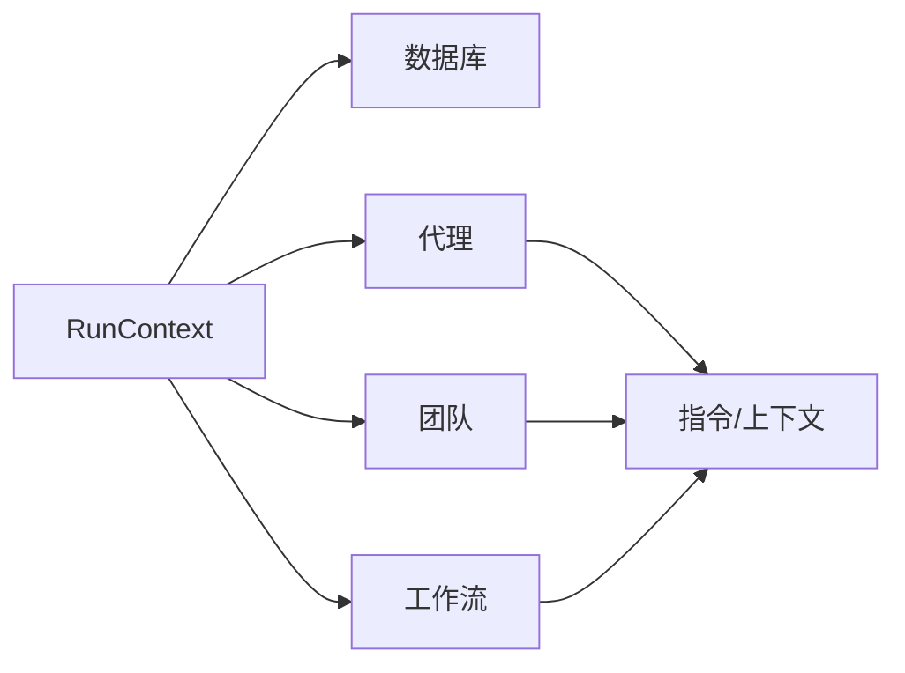

# 状态管理

<cite>
**本文引用的文件**
- [状态总览](file://state/overview.mdx)
- [代理会话状态](file://state/agent/overview.mdx)
- [团队会话状态](file://state/team/overview.mdx)
- [工作流会话状态](file://state/workflows/overview.mdx)
- [会话总览](file://sessions/overview.mdx)
- [动态会话状态（示例）](file://state/agent/dynamic-session-state.mdx)
- [代理会话状态（示例）](file://state/agent/agentic-session-state.mdx)
- [团队会话状态（示例）](file://state/team/agentic-session-state.mdx)
- [代理会话状态基础示例](file://examples/agents/state-and-session/session-state-basic.mdx)
- [代理会话状态高级示例](file://examples/agents/state-and-session/session-state-advanced.mdx)
- [工作流中团队协作的状态示例](file://examples/workflows/advanced-concepts/session-state/state-with-team.mdx)
- [团队状态共享示例](file://examples/teams/state/state-sharing.mdx)
- [会话状态上下文示例](file://state/agent/session-state-in-context.mdx)
</cite>

## 目录
1. [引言](#引言)
2. [项目结构](#项目结构)
3. [核心组件](#核心组件)
4. [架构总览](#架构总览)
5. [详细组件分析](#详细组件分析)
6. [依赖关系分析](#依赖关系分析)
7. [性能考量](#性能考量)
8. [故障排查指南](#故障排查指南)
9. [结论](#结论)
10. [附录](#附录)

## 引言
本技术文档围绕智能代理系统中的“状态管理”主题，系统阐述状态的定义、作用域与在智能代理中的重要性；详解代理状态、团队状态与工作流状态的管理方式；说明跨组件的状态协调、同步与冲突处理；并给出状态使用最佳实践、性能优化与并发控制建议。文档同时覆盖状态持久化、备份恢复与状态迁移策略，并通过仓库中的示例文件路径指引读者定位真实可运行的代码片段。

## 项目结构
状态管理相关内容分布在以下模块：
- 状态总览：概述状态的概念、生命周期与在系统中的位置
- 代理会话状态：面向单个代理的状态管理与持久化
- 团队会话状态：多代理协作下的共享状态与交互传播
- 工作流会话状态：多步骤、多组件间的状态协调与持久化
- 会话总览：会话与运行的基本概念，为状态持久化提供上下文
- 示例：大量可运行示例，覆盖基础、动态、上下文注入、团队协作与工作流场景

图表来源
- [状态总览:1-80](file://state/overview.mdx#L1-L80)
- [代理会话状态:1-306](file://state/agent/overview.mdx#L1-L306)
- [团队会话状态:1-357](file://state/team/overview.mdx#L1-L357)
- [工作流会话状态:1-295](file://state/workflows/overview.mdx#L1-L295)
- [会话总览:1-87](file://sessions/overview.mdx#L1-L87)
- [代理会话状态基础示例:1-70](file://examples/agents/state-and-session/session-state-basic.mdx#L1-L70)
- [代理会话状态高级示例:1-124](file://examples/agents/state-and-session/session-state-advanced.mdx#L1-L124)
- [动态会话状态（示例）:1-118](file://state/agent/dynamic-session-state.mdx#L1-L118)
- [代理会话状态（示例）:1-54](file://state/agent/agentic-session-state.mdx#L1-L54)
- [团队状态共享示例:1-102](file://examples/teams/state/state-sharing.mdx#L1-L102)
- [团队会话状态（示例）:1-67](file://state/team/agentic-session-state.mdx#L1-L67)
- [工作流中团队协作的状态示例:1-300](file://examples/workflows/advanced-concepts/session-state/state-with-team.mdx#L1-L300)

章节来源
- [状态总览:1-80](file://state/overview.mdx#L1-L80)
- [会话总览:1-87](file://sessions/overview.mdx#L1-L87)

## 核心组件
- 状态（State）：在一次会话内跨多次运行持久化的数据，用于维护上下文与记忆
- 会话（Session）：一次由多个“运行”组成的多轮对话线程，拥有唯一的 session_id
- 运行（Run）：会话内的单次交互，每次调用 Agent.run()/Team.run()/Workflow.run() 生成新的 run_id
- 会话状态（Session State）：贯穿会话周期的共享状态对象，可通过工具与 RunContext 访问与更新
- 数据库（DB）：用于持久化会话历史与状态，支持 InMemoryDb、SQLite、PostgreSQL 等
- 上下文注入（Context Injection）：通过 add_session_state_to_context 将 session_state 注入到指令或上下文中

章节来源
- [状态总览:8-20](file://state/overview.mdx#L8-L20)
- [会话总览:12-28](file://sessions/overview.mdx#L12-L28)

## 架构总览
状态管理贯穿代理、团队与工作流三类执行单元，形成统一的“会话状态”抽象。其核心流程如下：
- 初始化：在创建 Agent/Team/Workflow 时设置默认 session_state
- 访问与更新：工具函数通过 RunContext.session_state 读写状态，系统自动持久化
- 加载与延续：后续运行在同一会话中加载已存储状态，保持上下文连续性
- 协同与传播：团队与工作流允许跨成员/步骤共享同一状态对象，实现协作式状态管理

图表来源
- [状态总览:14-20](file://state/overview.mdx#L14-L20)
- [代理会话状态:27-34](file://state/agent/overview.mdx#L27-L34)
- [团队会话状态:14-20](file://state/team/overview.mdx#L14-L20)
- [工作流会话状态:23-42](file://state/workflows/overview.mdx#L23-L42)

## 详细组件分析

### 代理会话状态
- 定义与作用：代理在多轮交互中需要访问某些数据（如购物清单、用户资料），这些数据需在多次运行之间保持
- 生命周期：初始化 → 访问 → 更新 → 加载
- 关键点
  - 默认状态：在 Agent 创建时通过 session_state 参数设置
  - 运行时覆盖：在 run() 调用时可传入 session_id、user_id 与 session_state，实现按用户/会话隔离
  - 自动持久化：对 run_context.session_state 的修改会被自动保存到数据库
  - 上下文注入：通过 add_session_state_to_context 将状态变量注入指令模板
  - 自动状态管理：启用 enable_agentic_state 后，代理可基于对话自动更新状态
- 示例路径
  - 基础示例：[代理会话状态基础示例:1-70](file://examples/agents/state-and-session/session-state-basic.mdx#L1-L70)
  - 高级示例：[代理会话状态高级示例:1-124](file://examples/agents/state-and-session/session-state-advanced.mdx#L1-L124)
  - 动态状态示例：[动态会话状态（示例）:1-118](file://state/agent/dynamic-session-state.mdx#L1-L118)
  - 自动状态示例：[代理会话状态（示例）:1-54](file://state/agent/agentic-session-state.mdx#L1-L54)
  - 上下文注入示例：[会话状态上下文示例:1-71](file://state/agent/session-state-in-context.mdx#L1-L71)

图表来源
- [代理会话状态:27-34](file://state/agent/overview.mdx#L27-L34)
- [代理会话状态基础示例:34-56](file://examples/agents/state-and-session/session-state-basic.mdx#L34-L56)
- [代理会话状态高级示例:67-110](file://examples/agents/state-and-session/session-state-advanced.mdx#L67-L110)

章节来源
- [代理会话状态:1-306](file://state/agent/overview.mdx#L1-L306)
- [代理会话状态基础示例:1-70](file://examples/agents/state-and-session/session-state-basic.mdx#L1-L70)
- [代理会话状态高级示例:1-124](file://examples/agents/state-and-session/session-state-advanced.mdx#L1-L124)
- [动态会话状态（示例）:1-118](file://state/agent/dynamic-session-state.mdx#L1-L118)
- [代理会话状态（示例）:1-54](file://state/agent/agentic-session-state.mdx#L1-L54)
- [会话状态上下文示例:1-71](file://state/agent/session-state-in-context.mdx#L1-L71)

### 团队会话状态
- 定义与作用：团队成员共享同一份 session_state，便于跨代理协作与信息同步
- 关键点
  - 共享状态：Team 创建时设置 session_state，成员工具可直接读写
  - 成员交互传播：开启 share_member_interactions 后，成员输出可在团队内共享，增强协同效果
  - 自动状态管理：启用 enable_agentic_state 后，团队与成员可自主更新状态
- 示例路径
  - 团队状态共享示例：[团队状态共享示例:1-102](file://examples/teams/state/state-sharing.mdx#L1-L102)
  - 团队会话状态（示例）：[团队会话状态（示例）:1-67](file://state/team/agentic-session-state.mdx#L1-L67)

图表来源
- [团队会话状态:14-20](file://state/team/overview.mdx#L14-L20)
- [团队状态共享示例:46-66](file://examples/teams/state/state-sharing.mdx#L46-L66)

章节来源
- [团队会话状态:1-357](file://state/team/overview.mdx#L1-L357)
- [团队状态共享示例:1-102](file://examples/teams/state/state-sharing.mdx#L1-L102)
- [团队会话状态（示例）:1-67](file://state/team/agentic-session-state.mdx#L1-L67)

### 工作流会话状态
- 定义与作用：在多步骤、多组件（代理、团队、自定义函数）中共享与协调 session_state
- 关键点
  - 初始化：Workflow 创建时设置 session_state
  - 组件访问：代理、团队与自定义函数均可通过 run_context.session_state 读写
  - 条件/路由选择器：在 Condition/Router 的评估/选择函数中也可使用 run_context.session_state
  - 持久化：数据库可用时，状态在后续运行中自动加载
- 示例路径
  - 工作流中团队协作的状态示例：[工作流中团队协作的状态示例:1-300](file://examples/workflows/advanced-concepts/session-state/state-with-team.mdx#L1-L300)

图表来源
- [工作流会话状态:23-42](file://state/workflows/overview.mdx#L23-L42)
- [工作流中团队协作的状态示例:187-192](file://examples/workflows/advanced-concepts/session-state/state-with-team.mdx#L187-L192)

章节来源
- [工作流会话状态:1-295](file://state/workflows/overview.mdx#L1-L295)
- [工作流中团队协作的状态示例:1-300](file://examples/workflows/advanced-concepts/session-state/state-with-team.mdx#L1-L300)

### 会话与运行
- 会话（Session）：由唯一 session_id 标识的多轮对话线程，包含所有运行、历史、状态与指标
- 运行（Run）：会话内的单次交互，每次 run() 调用生成新的 run_id
- 多用户隔离：通过 user_id 区分不同用户，通过 session_id 区分同一用户的多条会话
- 会话持久化：需要配置数据库以保存历史与状态；无数据库时仅能进行单次运行
- 工作流会话特殊性：与代理/团队不同，工作流会话关注“管道执行”的运行记录与状态

章节来源
- [会话总览:1-87](file://sessions/overview.mdx#L1-L87)

## 依赖关系分析
- 组件耦合
  - RunContext 是状态访问与持久化的统一入口，贯穿代理、团队与工作流
  - 数据库提供状态与历史的持久化能力，是状态延续的关键依赖
  - 指令模板通过占位符语法引用 session_state，实现上下文注入
- 可能的循环依赖
  - 通过 RunContext 抽象解耦了组件对数据库的直接依赖，避免循环导入
- 外部依赖与集成
  - 支持多种数据库后端（SQLite、PostgreSQL、InMemory 等）
  - 与工具钩子（tool hooks）结合，可实现更灵活的状态更新策略

图表来源
- [状态总览:14-20](file://state/overview.mdx#L14-L20)
- [代理会话状态:27-34](file://state/agent/overview.mdx#L27-L34)
- [团队会话状态:14-20](file://state/team/overview.mdx#L14-L20)
- [工作流会话状态:23-42](file://state/workflows/overview.mdx#L23-L42)

章节来源
- [状态总览:14-20](file://state/overview.mdx#L14-L20)
- [代理会话状态:27-34](file://state/agent/overview.mdx#L27-L34)
- [团队会话状态:14-20](file://state/team/overview.mdx#L14-L20)
- [工作流会话状态:23-42](file://state/workflows/overview.mdx#L23-L42)

## 性能考量
- 状态大小控制
  - 避免在 session_state 中存储过大的结构，优先存储必要字段
  - 对频繁更新的列表/字典，考虑分页或增量更新策略
- 数据库写入频率
  - 合理合并多次小更新，减少数据库写入次数
  - 使用批量写入或事务提交（若框架支持）
- 缓存与索引
  - 在数据库层为 session_id、user_id 建立索引，提升查询效率
- 并发与锁
  - 多线程或多进程场景下，确保对同一 session_state 的更新具备原子性
  - 如遇高并发，建议引入乐观锁或版本号机制
- 上下文注入成本
  - 指令模板中仅引用必要的状态字段，避免大对象序列化带来的开销

## 故障排查指南
- 症状：状态未持久化
  - 排查：是否配置了数据库；是否在 run() 中正确传入 session_id/user_id
  - 参考：[会话总览:22-28](file://sessions/overview.mdx#L22-L28)
- 症状：状态未在后续运行中加载
  - 排查：数据库连接是否正常；session_id 是否一致；是否启用了 add_session_state_to_context
  - 参考：[代理会话状态:27-34](file://state/agent/overview.mdx#L27-L34)
- 症状：团队成员状态不一致
  - 排查：是否正确设置 Team.session_state；是否开启共享成员交互
  - 参考：[团队会话状态:14-20](file://state/team/overview.mdx#L14-L20)
- 症状：工作流步骤间状态不同步
  - 排查：是否在自定义函数中正确使用 run_context.session_state；条件/路由选择器是否读取到最新状态
  - 参考：[工作流会话状态:23-42](file://state/workflows/overview.mdx#L23-L42)
- 症状：并发写入导致状态丢失
  - 排查：是否对同一键进行竞态更新；是否采用原子操作或版本控制
  - 参考：[动态会话状态（示例）:40-70](file://state/agent/dynamic-session-state.mdx#L40-L70)

章节来源
- [会话总览:22-28](file://sessions/overview.mdx#L22-L28)
- [代理会话状态:27-34](file://state/agent/overview.mdx#L27-L34)
- [团队会话状态:14-20](file://state/team/overview.mdx#L14-L20)
- [工作流会话状态:23-42](file://state/workflows/overview.mdx#L23-L42)
- [动态会话状态（示例）:40-70](file://state/agent/dynamic-session-state.mdx#L40-L70)

## 结论
状态管理是智能代理系统实现“上下文连续性”的关键。通过统一的会话状态抽象，代理、团队与工作流可以在多轮交互与多组件协作中保持一致的数据视图。配合数据库持久化、上下文注入与自动状态管理等特性，系统能够支撑从简单购物清单到复杂项目管理等多样化业务场景。遵循本文的最佳实践与排错建议，可有效提升状态管理的可靠性、性能与可维护性。

## 附录
- 实际示例定位
  - 代理会话状态基础示例：[代理会话状态基础示例:1-70](file://examples/agents/state-and-session/session-state-basic.mdx#L1-L70)
  - 代理会话状态高级示例：[代理会话状态高级示例:1-124](file://examples/agents/state-and-session/session-state-advanced.mdx#L1-L124)
  - 动态会话状态（示例）：[动态会话状态（示例）:1-118](file://state/agent/dynamic-session-state.mdx#L1-L118)
  - 代理会话状态（示例）：[代理会话状态（示例）:1-54](file://state/agent/agentic-session-state.mdx#L1-L54)
  - 团队状态共享示例：[团队状态共享示例:1-102](file://examples/teams/state/state-sharing.mdx#L1-L102)
  - 团队会话状态（示例）：[团队会话状态（示例）:1-67](file://state/team/agentic-session-state.mdx#L1-L67)
  - 工作流中团队协作的状态示例：[工作流中团队协作的状态示例:1-300](file://examples/workflows/advanced-concepts/session-state/state-with-team.mdx#L1-L300)
  - 会话状态上下文示例：[会话状态上下文示例:1-71](file://state/agent/session-state-in-context.mdx#L1-L71)