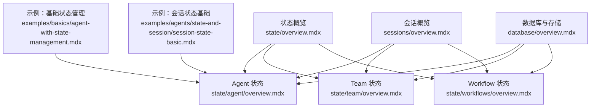
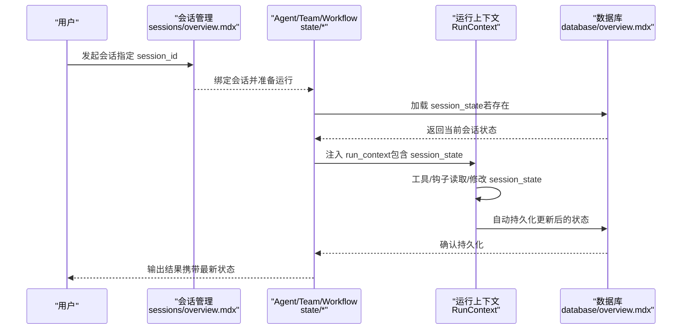
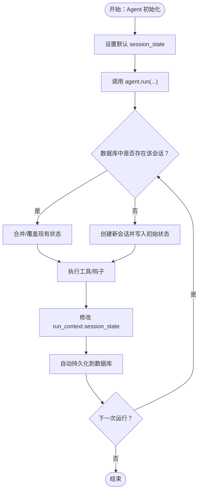
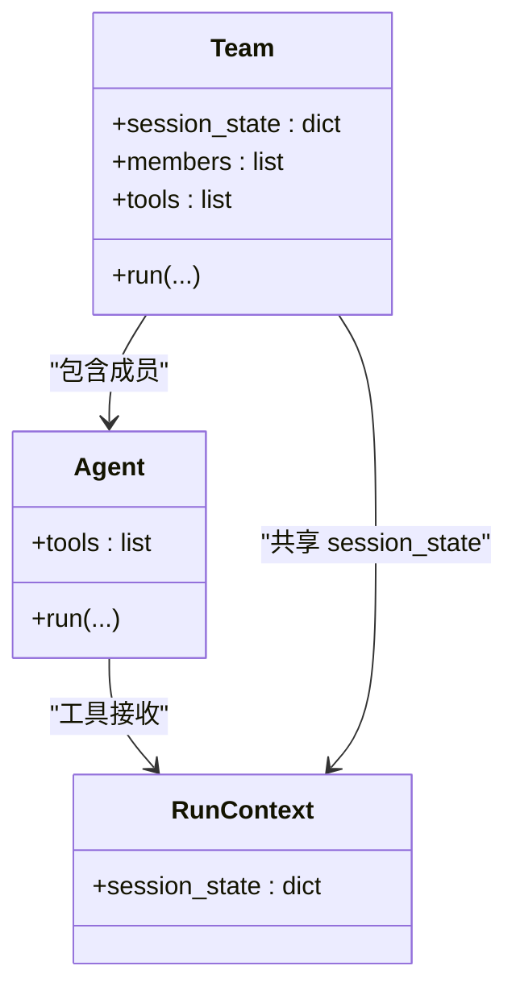
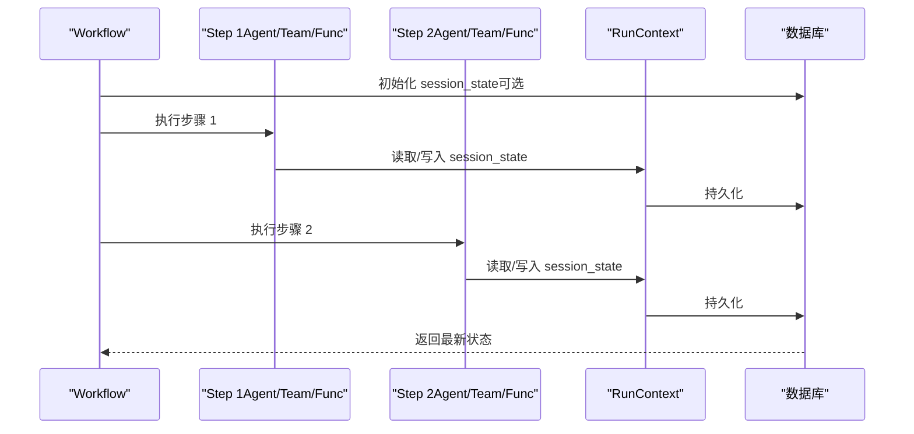
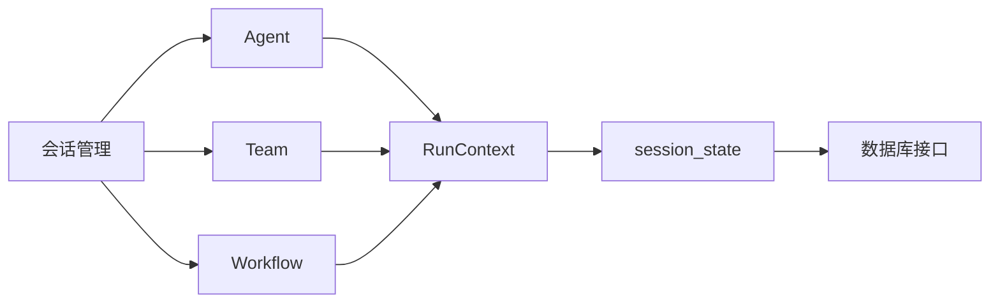

# 状态管理基础

<cite>
**本文引用的文件**
- [state/overview.mdx](file://state/overview.mdx)
- [state/agent/overview.mdx](file://state/agent/overview.mdx)
- [state/team/overview.mdx](file://state/team/overview.mdx)
- [state/workflows/overview.mdx](file://state/workflows/overview.mdx)
- [sessions/overview.mdx](file://sessions/overview.mdx)
- [database/overview.mdx](file://database/overview.mdx)
- [examples/basics/agent-with-state-management.mdx](file://examples/basics/agent-with-state-management.mdx)
- [examples/agents/state-and-session/session-state-basic.mdx](file://examples/agents/state-and-session/session-state-basic.mdx)
</cite>

## 目录
1. [引言](#引言)
2. [项目结构](#项目结构)
3. [核心组件](#核心组件)
4. [架构总览](#架构总览)
5. [详细组件分析](#详细组件分析)
6. [依赖关系分析](#依赖关系分析)
7. [性能考量](#性能考量)
8. [故障排查指南](#故障排查指南)
9. [结论](#结论)
10. [附录](#附录)

## 引言
本篇“状态管理基础”面向初学者与实践者，系统讲解智能代理系统中的状态管理：什么是状态、为什么重要、如何在会话（session）内持久化与共享、以及在多轮对话与复杂工作流中的应用。我们将从概念入手，逐步深入到生命周期（初始化、访问、更新、加载）、session_state 的工作机制、与会话的关系，并给出可直接参考的示例路径与最佳实践。

## 项目结构
围绕状态管理，仓库提供了三类关键文档与示例：
- 概览与跨组件通用机制：state/overview.mdx
- Agent 级状态管理：state/agent/overview.mdx
- Team 级状态管理：state/team/overview.mdx
- Workflow 级状态管理：state/workflows/overview.mdx
- 会话与运行：sessions/overview.mdx
- 数据库与持久化：database/overview.mdx
- 示例：examples 下的“基础示例”与“状态与会话”示例

图表来源
- [state/overview.mdx:1-80](file://state/overview.mdx#L1-L80)
- [state/agent/overview.mdx:1-306](file://state/agent/overview.mdx#L1-L306)
- [state/team/overview.mdx:1-357](file://state/team/overview.mdx#L1-L357)
- [state/workflows/overview.mdx:1-295](file://state/workflows/overview.mdx#L1-L295)
- [sessions/overview.mdx:1-87](file://sessions/overview.mdx#L1-L87)
- [database/overview.mdx:1-130](file://database/overview.mdx#L1-L130)
- [examples/basics/agent-with-state-management.mdx:1-198](file://examples/basics/agent-with-state-management.mdx#L1-L198)
- [examples/agents/state-and-session/session-state-basic.mdx:1-70](file://examples/agents/state-and-session/session-state-basic.mdx#L1-L70)

章节来源
- [state/overview.mdx:1-80](file://state/overview.mdx#L1-L80)
- [sessions/overview.mdx:1-87](file://sessions/overview.mdx#L1-L87)
- [database/overview.mdx:1-130](file://database/overview.mdx#L1-L130)

## 核心组件
- 状态（State）：在一次会话内跨多次运行（run）持续存在的数据，用于维持上下文与记忆。
- session_state：贯穿 Agent/Team/Workflow 的共享状态对象，可通过工具函数读写，并自动持久化。
- 运行上下文（RunContext）：在工具与钩子中注入的对象，提供对 session_state 的访问入口。
- 会话（Session）：由一组连续的运行组成，每个会话拥有唯一的 session_id，支持历史、状态与指标的统一管理。
- 数据库（Db）：提供状态持久化的基础设施，支持 SQLite、PostgreSQL、Redis、GCS 等多种实现。

章节来源
- [state/overview.mdx:8-20](file://state/overview.mdx#L8-L20)
- [state/agent/overview.mdx:16-35](file://state/agent/overview.mdx#L16-L35)
- [sessions/overview.mdx:12-28](file://sessions/overview.mdx#L12-L28)
- [database/overview.mdx:105-130](file://database/overview.mdx#L105-L130)

## 架构总览
下图展示了状态在 Agent/Team/Workflow 中的生命周期与交互关系，以及与会话、数据库的耦合方式。

图表来源
- [sessions/overview.mdx:12-28](file://sessions/overview.mdx#L12-L28)
- [state/agent/overview.mdx:29-35](file://state/agent/overview.mdx#L29-L35)
- [database/overview.mdx:105-130](file://database/overview.mdx#L105-L130)

## 详细组件分析

### Agent 级状态管理
- 初始化：通过 Agent 构造参数设置默认 session_state；也可在单次运行时传入覆盖值。
- 访问与更新：工具函数通过 run_context.session_state 读写状态；变更自动持久化。
- 使用状态于指令：当开启 add_session_state_to_context 后，可在 instructions 中以占位符形式引用状态键。
- 多运行保持：同一 session_id 下，后续运行会加载上次保存的状态，实现跨 run 的连续性。
- 覆盖策略：可通过 overwrite_db_session_state 控制“运行时传入的状态”是否覆盖数据库中已存状态。

图表来源
- [state/agent/overview.mdx:29-35](file://state/agent/overview.mdx#L29-L35)
- [state/agent/overview.mdx:230-258](file://state/agent/overview.mdx#L230-L258)
- [state/agent/overview.mdx:260-299](file://state/agent/overview.mdx#L260-L299)

章节来源
- [state/agent/overview.mdx:25-35](file://state/agent/overview.mdx#L25-L35)
- [state/agent/overview.mdx:82-170](file://state/agent/overview.mdx#L82-L170)
- [state/agent/overview.mdx:200-228](file://state/agent/overview.mdx#L200-L228)
- [state/agent/overview.mdx:230-258](file://state/agent/overview.mdx#L230-L258)
- [state/agent/overview.mdx:260-299](file://state/agent/overview.mdx#L260-L299)

### Team 级状态管理
- 共享状态：Team 的 session_state 在团队成员间共享与同步，便于协作式任务编排。
- 工具访问：团队成员工具通过 run_context.session_state 读写共享状态。
- 协作示例：团队可共同维护购物清单、日程等跨成员的数据一致性。

图表来源
- [state/team/overview.mdx:14-57](file://state/team/overview.mdx#L14-L57)
- [state/team/overview.mdx:61-160](file://state/team/overview.mdx#L61-L160)

章节来源
- [state/team/overview.mdx:14-57](file://state/team/overview.mdx#L14-L57)
- [state/team/overview.mdx:169-213](file://state/team/overview.mdx#L169-L213)
- [state/team/overview.mdx:215-235](file://state/team/overview.mdx#L215-L235)
- [state/team/overview.mdx:237-266](file://state/team/overview.mdx#L237-L266)
- [state/team/overview.mdx:268-307](file://state/team/overview.mdx#L268-L307)

### Workflow 级状态管理
- 跨步骤共享：Workflow 的 session_state 对其内部所有步骤（Agent、Team、自定义函数）可见且可写。
- 运行时注入：在自定义 Python 步骤与条件/路由选择器中，可通过 run_context.session_state 访问与修改状态。
- 持久化与加载：数据库可用时，状态在后续运行中自动加载，确保多步执行的一致性。

图表来源
- [state/workflows/overview.mdx:25-42](file://state/workflows/overview.mdx#L25-L42)
- [state/workflows/overview.mdx:43-195](file://state/workflows/overview.mdx#L43-L195)
- [state/workflows/overview.mdx:199-249](file://state/workflows/overview.mdx#L199-L249)

章节来源
- [state/workflows/overview.mdx:23-42](file://state/workflows/overview.mdx#L23-L42)
- [state/workflows/overview.mdx:199-249](file://state/workflows/overview.mdx#L199-L249)

### 会话与状态的关系
- 会话（Session）是一组连续运行（Run）的集合，每个会话有唯一标识（session_id），贯穿历史、状态与指标。
- 状态（session_state）随会话存在：同一 session_id 下，状态在运行间持久化；不同会话彼此隔离。
- 多用户场景：通过 user_id 区分用户，通过 session_id 区分同一用户的多个会话。

章节来源
- [sessions/overview.mdx:12-28](file://sessions/overview.mdx#L12-L28)

### 数据库与持久化
- 数据库为状态持久化提供基础设施，支持 SQLite、PostgreSQL、Redis、GCS 等。
- 配置后，会话历史、状态与运行元数据可被自动存储与恢复。
- 异步数据库与同步数据库需匹配使用，避免运行时异常。

章节来源
- [database/overview.mdx:105-130](file://database/overview.mdx#L105-L130)

## 依赖关系分析
- 组件耦合
  - Agent/Team/Workflow 依赖 RunContext 提供的 session_state 访问能力。
  - RunContext 与数据库交互，负责状态的读取与写回。
  - 会话管理模块负责 session_id 的生成与绑定，确保状态按会话隔离。
- 外部依赖
  - 数据库驱动与连接配置来自 database/overview.mdx。
  - 不同数据库类型（SQLite、PostgreSQL、Redis、GCS 等）在 reference/storage 下有具体参数说明。

图表来源
- [state/agent/overview.mdx:29-35](file://state/agent/overview.mdx#L29-L35)
- [state/team/overview.mdx:14-57](file://state/team/overview.mdx#L14-L57)
- [state/workflows/overview.mdx:25-42](file://state/workflows/overview.mdx#L25-L42)
- [sessions/overview.mdx:12-28](file://sessions/overview.mdx#L12-L28)
- [database/overview.mdx:105-130](file://database/overview.mdx#L105-L130)

## 性能考量
- 状态大小控制：避免在 session_state 中存放过大的结构，减少序列化/反序列化与数据库 IO 开销。
- 更新频率：批量更新优于频繁细粒度更新，降低数据库写压力。
- 数据库选择：开发阶段可用 SQLite，生产建议 PostgreSQL；高并发场景可考虑 Redis 作为缓存层。
- 异步适配：异步应用使用对应异步数据库类，避免线程/事件循环不匹配导致的异常。

章节来源
- [database/overview.mdx:105-130](file://database/overview.mdx#L105-L130)

## 故障排查指南
- 无持久化：未配置数据库或未启用 add_history_to_context 等功能，会导致状态无法跨运行保留。
- 数据库类型不匹配：同步/异步引擎与数据库类混用会引发异常，需按文档选择正确组合。
- 状态覆盖策略：若运行时传入的 session_state 与数据库已有状态冲突，需明确 overwrite_db_session_state 的行为预期。
- 多用户隔离：确认 session_id 与 user_id 的传递是否正确，避免状态串扰。

章节来源
- [database/overview.mdx:122-130](file://database/overview.mdx#L122-L130)
- [state/agent/overview.mdx:260-299](file://state/agent/overview.mdx#L260-L299)
- [sessions/overview.mdx:49-58](file://sessions/overview.mdx#L49-L58)

## 结论
状态管理是构建可记忆、可协作、可持续的智能代理系统的关键。通过 session_state 与 RunContext 的配合，结合数据库持久化与会话隔离机制，Agent/Team/Workflow 可在多轮对话与复杂工作流中保持一致的上下文与数据。遵循本文的生命周期、最佳实践与故障排查建议，可快速搭建稳定可靠的状态管理方案。

## 附录
- 基础示例
  - Agent 基础状态示例：[examples/agents/state-and-session/session-state-basic.mdx:1-70](file://examples/agents/state-and-session/session-state-basic.mdx#L1-L70)
  - 财经 Agent（Watchlist）示例：[examples/basics/agent-with-state-management.mdx:1-198](file://examples/basics/agent-with-state-management.mdx#L1-L198)
- 进阶阅读
  - Agent 状态概览与高级用法：[state/agent/overview.mdx:1-306](file://state/agent/overview.mdx#L1-L306)
  - Team 状态与协作：[state/team/overview.mdx:1-357](file://state/team/overview.mdx#L1-L357)
  - Workflow 级状态与多步骤协调：[state/workflows/overview.mdx:1-295](file://state/workflows/overview.mdx#L1-L295)
  - 会话与运行机制：[sessions/overview.mdx:1-87](file://sessions/overview.mdx#L1-L87)
  - 数据库与持久化：[database/overview.mdx:1-130](file://database/overview.mdx#L1-L130)