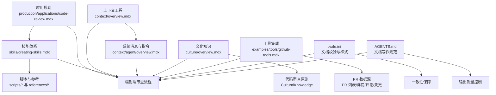
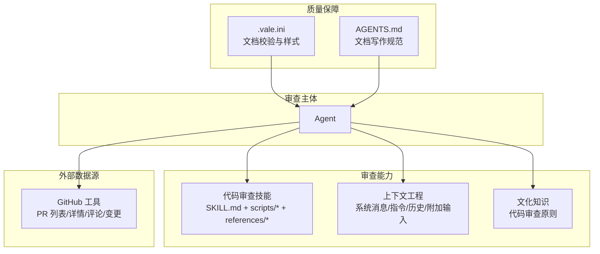
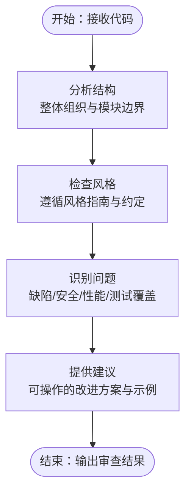
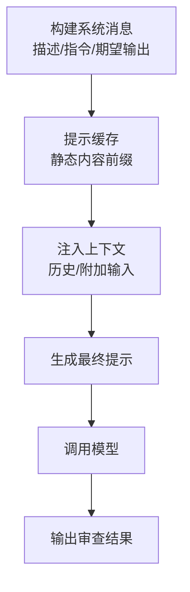
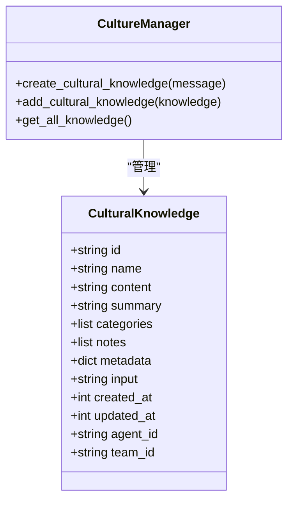
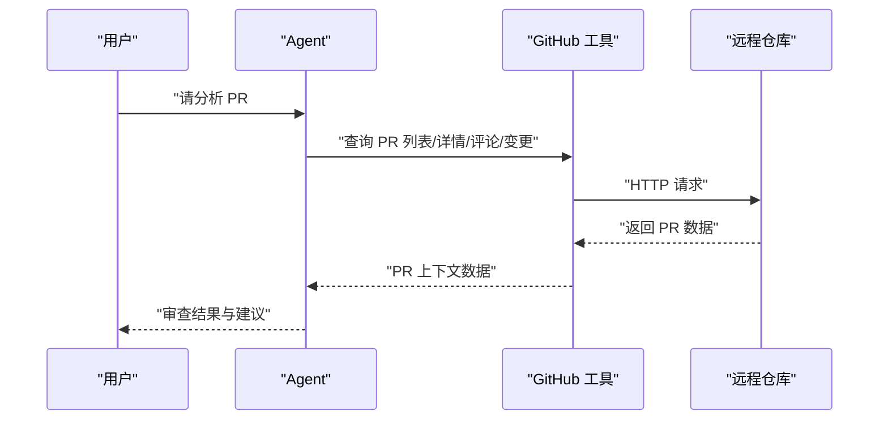
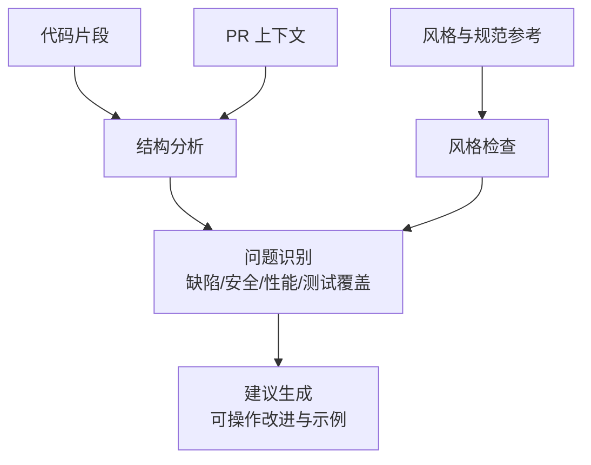
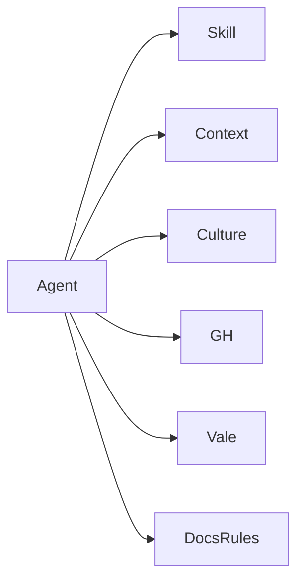

# 代码审查代理

<cite>
**本文引用的文件**
- [production/applications/code-review.mdx](file://production/applications/code-review.mdx)
- [skills/creating-skills.mdx](file://skills/creating-skills.mdx)
- [context/overview.mdx](file://context/overview.mdx)
- [context/agent/overview.mdx](file://context/agent/overview.mdx)
- [culture/overview.mdx](file://culture/overview.mdx)
- [examples/tools/github-tools.mdx](file://examples/tools/github-tools.mdx)
- [.vale.ini](file://.vale.ini)
- [AGENTS.md](file://AGENTS.md)
- [.gitignore](file://.gitignore)
- [examples/workflows/advanced-concepts/early-stopping/early-stop-basic.mdx](file://examples/workflows/advanced-concepts/early-stopping/early-stop-basic.mdx)
</cite>

## 目录
1. [简介](#简介)
2. [项目结构](#项目结构)
3. [核心组件](#核心组件)
4. [架构总览](#架构总览)
5. [组件详解](#组件详解)
6. [依赖关系分析](#依赖关系分析)
7. [性能考量](#性能考量)
8. [故障排查指南](#故障排查指南)
9. [结论](#结论)
10. [附录](#附录)

## 简介
本技术文档面向“代码审查代理”这一基于上下文的代码审查系统，聚焦于 Pull Request（PR）分析与改进建议生成。文档从系统架构、组件关系、数据流与处理逻辑入手，结合上下文工程、文化知识（Culture）、技能（Skill）与工具集成等能力，给出可操作的配置说明、规则定制与质量标准定义，并通过流程图与序列图帮助读者快速理解端到端工作流。

当前仓库中，“代码审查代理”仍处于规划阶段，但相关基础设施（上下文工程、技能体系、文化知识、GitHub 工具集成、文档校验与样式规范等）已具备，能够支撑后续实现高质量的 PR 审查与自动化建议生成。

## 项目结构
围绕“代码审查代理”的关键内容分布在以下区域：
- 应用规划：生产应用页面对“代码审查代理”的功能与使用场景进行概述与规划
- 技能体系：定义“代码审查技能”的目录结构、脚本与参考文档，支持执行式检查与风格建议
- 上下文工程：指导如何设计系统消息、用户消息、历史与附加输入，以提升审查效果
- 文化知识：提供组织级“代码审查原则”等通用标准，作为审查上下文的一部分
- 工具集成：GitHub 工具可读取 PR 详情、评论与变更，为审查提供外部数据源
- 质量与规范：文档校验与样式配置确保审查建议与文档一致性

图表来源
- [production/applications/code-review.mdx:1-35](file://production/applications/code-review.mdx#L1-L35)
- [skills/creating-skills.mdx:1-219](file://skills/creating-skills.mdx#L1-L219)
- [context/overview.mdx:1-69](file://context/overview.mdx#L1-L69)
- [context/agent/overview.mdx:1-25](file://context/agent/overview.mdx#L1-L25)
- [culture/overview.mdx:273-287](file://culture/overview.mdx#L273-L287)
- [examples/tools/github-tools.mdx:1-253](file://examples/tools/github-tools.mdx#L1-L253)
- [.vale.ini:1-25](file://.vale.ini#L1-L25)
- [AGENTS.md:1-25](file://AGENTS.md#L1-L25)

章节来源
- [production/applications/code-review.mdx:1-35](file://production/applications/code-review.mdx#L1-L35)
- [skills/creating-skills.mdx:1-219](file://skills/creating-skills.mdx#L1-L219)
- [context/overview.mdx:1-69](file://context/overview.mdx#L1-L69)
- [context/agent/overview.mdx:1-25](file://context/agent/overview.mdx#L1-L25)
- [culture/overview.mdx:273-287](file://culture/overview.mdx#L273-L287)
- [examples/tools/github-tools.mdx:1-253](file://examples/tools/github-tools.mdx#L1-L253)
- [.vale.ini:1-25](file://.vale.ini#L1-L25)
- [AGENTS.md:1-25](file://AGENTS.md#L1-L25)

## 核心组件
- 代码审查技能（Skill）
  - 通过目录结构与 SKILL.md 描述审查职责、使用时机、流程与最佳实践
  - 支持脚本（scripts/）执行式检查（如风格检查、静态扫描），并可加载参考文档（references/）作为上下文
- 上下文工程（Context Engineering）
  - 设计系统消息（描述、指令、期望输出）与用户消息，结合对话历史与附加输入，形成高质量审查提示
  - 提供上下文缓存策略，减少重复信息传输，降低 token 消耗
- 文化知识（Culture）
  - 组织级“代码审查原则”等通用标准注入到系统消息中，确保审查一致性与可复用性
- 工具集成（GitHub Tools）
  - 读取 PR 列表、详情、评论与变更，作为审查输入的一部分；可选地限制危险操作
- 文档质量与规范
  - 使用 .vale.ini 配置文档校验与样式，保证审查建议与文档风格一致

章节来源
- [skills/creating-skills.mdx:63-120](file://skills/creating-skills.mdx#L63-L120)
- [context/overview.mdx:18-35](file://context/overview.mdx#L18-L35)
- [culture/overview.mdx:273-287](file://culture/overview.mdx#L273-L287)
- [examples/tools/github-tools.mdx:43-96](file://examples/tools/github-tools.mdx#L43-L96)
- [.vale.ini:1-25](file://.vale.ini#L1-L25)

## 架构总览
下图展示了“代码审查代理”的端到端架构：Agent 作为审查主体，借助技能（脚本与参考）、上下文工程、文化知识与工具（GitHub）协同工作，最终生成上下文感知的改进建议。

图表来源
- [skills/creating-skills.mdx:1-219](file://skills/creating-skills.mdx#L1-L219)
- [context/overview.mdx:1-69](file://context/overview.mdx#L1-L69)
- [culture/overview.mdx:273-287](file://culture/overview.mdx#L273-L287)
- [examples/tools/github-tools.mdx:1-253](file://examples/tools/github-tools.mdx#L1-L253)
- [.vale.ini:1-25](file://.vale.ini#L1-L25)
- [AGENTS.md:1-25](file://AGENTS.md#L1-L25)

## 组件详解

### 代码审查技能（Skill）
- 目录结构与元数据
  - 必需文件：SKILL.md（包含 YAML 头部元数据与 Markdown 指令）
  - 可选子目录：scripts/（可执行脚本，如风格检查、静态扫描）、references/（参考文档）
- 使用时机与流程
  - 当用户请求代码审查或反馈时触发
  - 流程：分析结构 → 检查风格 → 识别问题 → 提供建议
- 最佳实践
  - 先聚焦高影响问题
  - 解释建议背后的“为什么”
  - 提供修复示例

图表来源
- [skills/creating-skills.mdx:63-85](file://skills/creating-skills.mdx#L63-L85)

章节来源
- [skills/creating-skills.mdx:1-219](file://skills/creating-skills.mdx#L1-L219)

### 上下文工程（Context Engineering）
- 关键要素
  - 系统消息：由 Agent 描述、指令与其它设置组成
  - 用户消息：用户输入
  - 对话历史：Agent 与用户的交互记录
  - 附加输入：示例、Schema、委托与工具集成等
- 缓存策略
  - 将静态内容置于系统消息前部，利用模型侧提示缓存减少 token 用量
- 迭代优化
  - 通过反复调整系统消息与指令，结合 Schema、委托与工具，逐步提升输出质量

图表来源
- [context/overview.mdx:18-35](file://context/overview.mdx#L18-L35)
- [context/agent/overview.mdx:11-25](file://context/agent/overview.mdx#L11-L25)

章节来源
- [context/overview.mdx:1-69](file://context/overview.mdx#L1-L69)
- [context/agent/overview.mdx:1-25](file://context/agent/overview.mdx#L1-L25)

### 文化知识（Culture）
- 作用
  - 将组织级“代码审查原则”等通用标准注入到系统消息中，确保审查一致性
- 管理方式
  - 自动更新：生产环境推荐
  - 代理驱动：在任务过程中主动管理文化知识
  - 手动管理：通过管理器或直接实例化 CulturalKnowledge 对象进行种子与维护
- 数据模型
  - 字段：名称、内容、摘要、分类、备注、元数据、输入、时间戳、关联实体等

图表来源
- [culture/overview.mdx:211-229](file://culture/overview.mdx#L211-L229)
- [culture/overview.mdx:273-287](file://culture/overview.mdx#L273-L287)

章节来源
- [culture/overview.mdx:1-288](file://culture/overview.mdx#L1-L288)

### 工具集成（GitHub 工具）
- 功能范围
  - 仓库与 PR 查询、列表、详情、评论、变更等读取能力
  - 可按需排除危险操作（删除、创建等）
- 使用方式
  - 在 Agent 中配置工具列表，按需包含/排除函数
  - 通过工具调用获取 PR 的最新状态与上下文，辅助审查

图表来源
- [examples/tools/github-tools.mdx:43-96](file://examples/tools/github-tools.mdx#L43-L96)
- [examples/tools/github-tools.mdx:210-239](file://examples/tools/github-tools.mdx#L210-L239)

章节来源
- [examples/tools/github-tools.mdx:1-253](file://examples/tools/github-tools.mdx#L1-L253)

### 建议生成过程（端到端）
- 输入
  - 代码片段、PR 上下文（来自 GitHub 工具）、风格与规范参考（来自技能与文化知识）、历史与附加输入（来自上下文工程）
- 处理
  - 结构分析、风格检查、问题识别、建议生成
- 输出
  - 审查报告与改进建议，附带示例与解释

图表来源
- [skills/creating-skills.mdx:63-85](file://skills/creating-skills.mdx#L63-L85)
- [examples/tools/github-tools.mdx:1-253](file://examples/tools/github-tools.mdx#L1-L253)
- [culture/overview.mdx:273-287](file://culture/overview.mdx#L273-L287)
- [context/overview.mdx:18-35](file://context/overview.mdx#L18-L35)

## 依赖关系分析
- 组件耦合
  - Agent 依赖技能（脚本与参考）、上下文工程（系统消息与历史）、文化知识（组织标准）、工具（GitHub）与文档质量（Vale/写作规范）
- 外部依赖
  - GitHub API（用于 PR 数据）
  - 模型提供商（提示缓存与推理）
- 规范约束
  - .vale.ini 与 AGENTS.md 确保文档与审查建议的一致性与可读性

图表来源
- [skills/creating-skills.mdx:1-219](file://skills/creating-skills.mdx#L1-L219)
- [context/overview.mdx:1-69](file://context/overview.mdx#L1-L69)
- [culture/overview.mdx:1-288](file://culture/overview.mdx#L1-L288)
- [examples/tools/github-tools.mdx:1-253](file://examples/tools/github-tools.mdx#L1-L253)
- [.vale.ini:1-25](file://.vale.ini#L1-L25)
- [AGENTS.md:1-25](file://AGENTS.md#L1-L25)

章节来源
- [.vale.ini:1-25](file://.vale.ini#L1-L25)
- [AGENTS.md:1-25](file://AGENTS.md#L1-L25)

## 性能考量
- 提示缓存
  - 将静态内容置于系统消息前部，利用模型侧提示缓存减少 token 用量
- 上下文压缩
  - 在长 PR 或复杂变更场景中，优先保留关键差异与上下文，避免冗余信息
- 工具调用优化
  - 合理选择 GitHub 工具函数，避免不必要的读取与写入
- 文档质量前置
  - 通过 .vale.ini 与 AGENTS.md 提前发现风格与格式问题，减少返工

## 故障排查指南
- 审查结果不一致
  - 检查系统消息是否包含明确的指令与期望输出
  - 确认文化知识是否正确注入，且分类与摘要清晰
- PR 数据缺失
  - 核对 GitHub 工具的 include/exclude 列表，确认权限与环境变量
  - 验证 PR ID 与分支信息是否正确
- 文档校验失败
  - 检查 .vale.ini 的忽略规则与样式包配置
  - 确认代码块与标签未被误忽略
- 工作流早停
  - 若审查流程中存在质量门禁（如安全扫描），确保早停逻辑与错误处理符合预期

章节来源
- [examples/workflows/advanced-concepts/early-stopping/early-stop-basic.mdx:40-234](file://examples/workflows/advanced-concepts/early-stopping/early-stop-basic.mdx#L40-L234)
- [.gitignore:1-29](file://.gitignore#L1-L29)

## 结论
“代码审查代理”以技能、上下文工程、文化知识与工具集成为基础，能够实现基于上下文的 PR 分析与改进建议生成。通过合理的配置与规则定制，可在保证审查质量的同时提升开发效率。随着应用落地，建议持续迭代系统消息、文化知识与工具调用策略，结合早停与质量门禁，构建稳健的预合并质量保障体系。

## 附录

### 配置选项与最佳实践
- 代码风格设置
  - 使用技能中的脚本执行风格检查（如行长度、空白字符等）
  - 在 references/ 中维护团队风格指南，作为上下文注入
- 审查规则定制
  - 在 SKILL.md 中定义使用时机、流程与最佳实践
  - 通过文化知识注入组织级审查原则，统一标准
- 质量标准定义
  - 明确缺陷、安全、性能与测试覆盖率的判定阈值
  - 将质量门禁纳入工作流，必要时启用早停逻辑
- 文档一致性
  - 使用 .vale.ini 与 AGENTS.md 确保审查建议与文档风格一致

章节来源
- [skills/creating-skills.mdx:63-168](file://skills/creating-skills.mdx#L63-L168)
- [culture/overview.mdx:273-287](file://culture/overview.mdx#L273-L287)
- [.vale.ini:1-25](file://.vale.ini#L1-L25)
- [AGENTS.md:1-25](file://AGENTS.md#L1-L25)