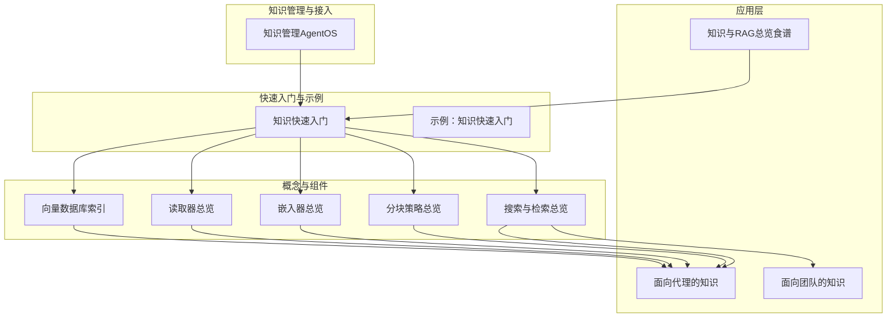
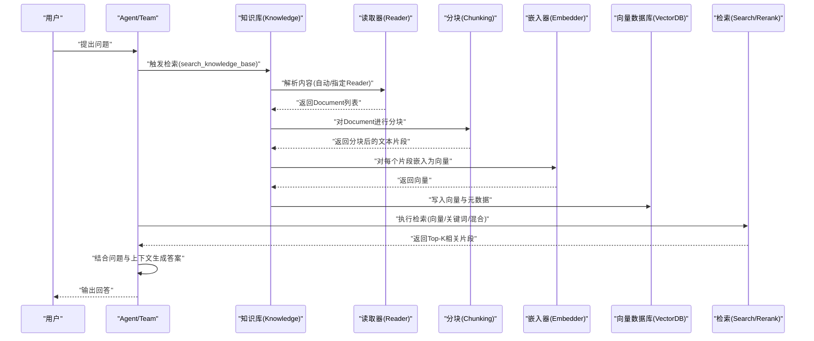
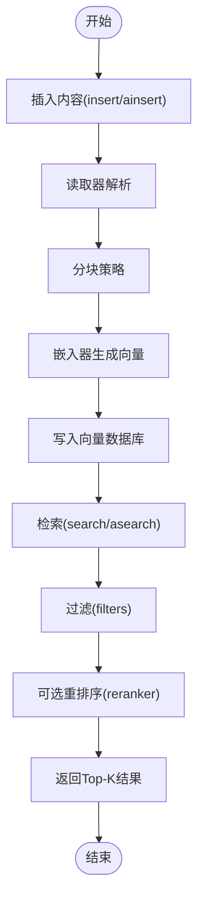
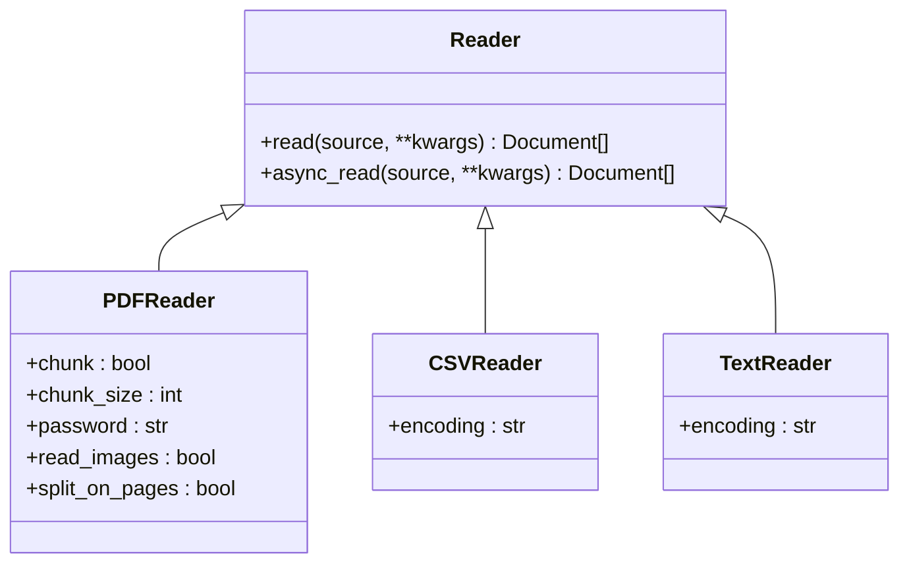
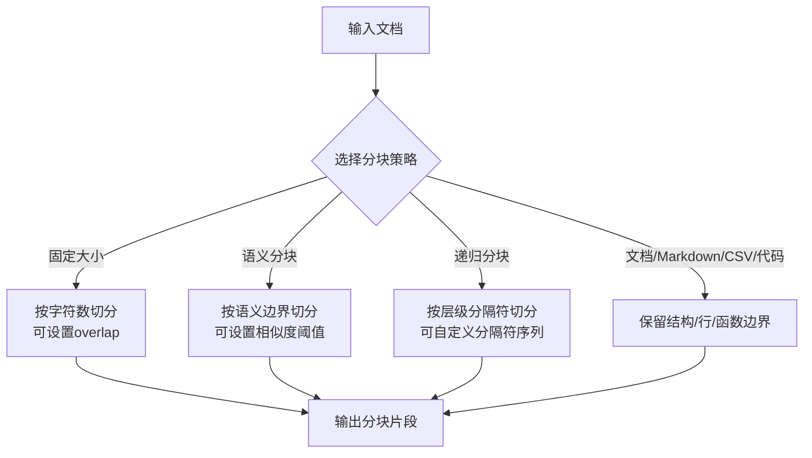
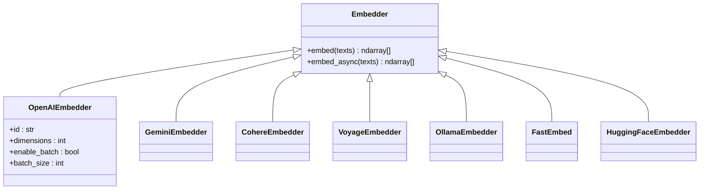
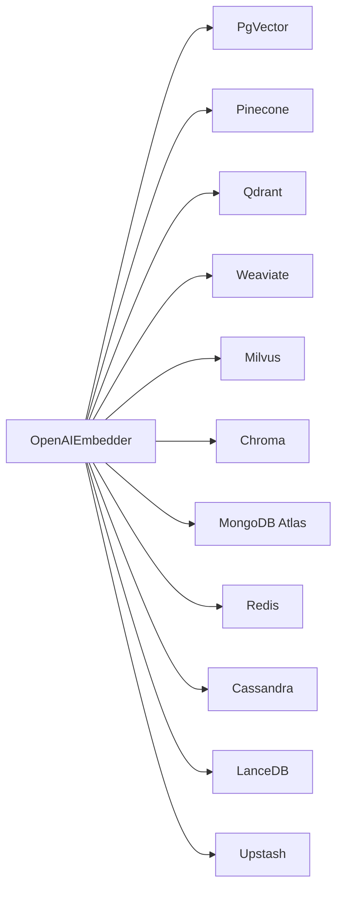
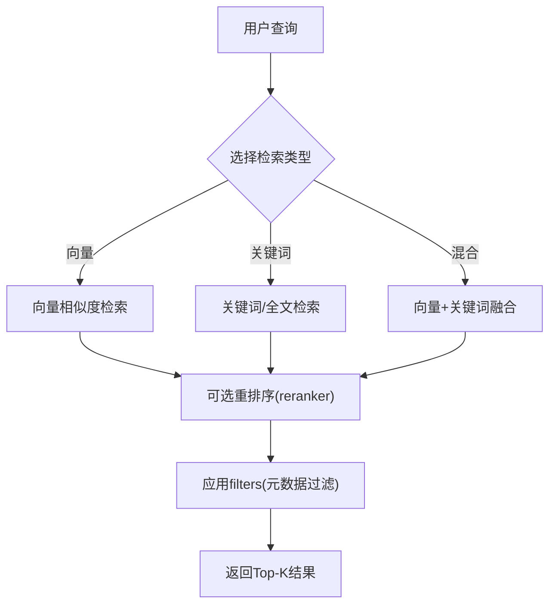
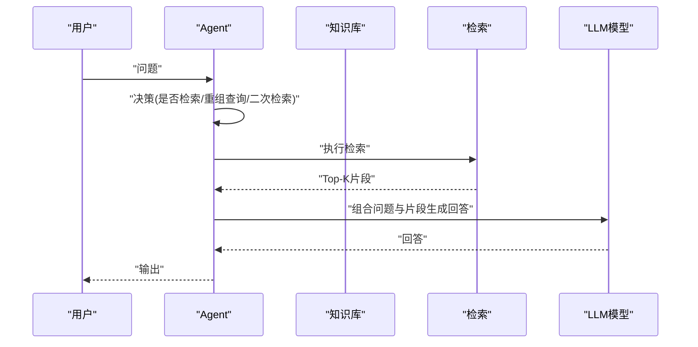
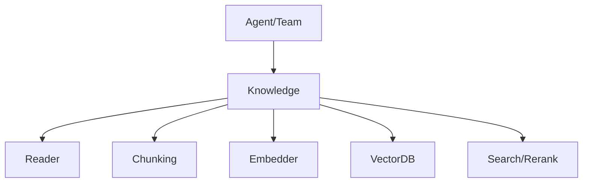

# 内部知识代理

<cite>
**本文引用的文件**
- [知识管理（AgentOS）](file://agent-os/features/knowledge-management.mdx)
- [知识快速入门](file://knowledge/quickstart.mdx)
- [知识与RAG总览（食谱）](file://cookbook/knowledge/overview.mdx)
- [知识概念总览](file://knowledge/concepts/overview.mdx)
- [搜索与检索总览](file://knowledge/concepts/search-and-retrieval/overview.mdx)
- [分块策略总览](file://knowledge/concepts/chunking/overview.mdx)
- [嵌入器总览](file://knowledge/concepts/embedder/overview.mdx)
- [读取器总览](file://knowledge/concepts/readers/overview.mdx)
- [向量数据库索引](file://knowledge/vector-stores/index.mdx)
- [面向代理的知识](file://knowledge/agents/overview.mdx)
- [面向团队的知识](file://knowledge/teams/overview.mdx)
- [示例：知识快速入门](file://examples/knowledge/quickstart.mdx)
</cite>

## 目录
1. [简介](#简介)
2. [项目结构](#项目结构)
3. [核心组件](#核心组件)
4. [架构总览](#架构总览)
5. [详细组件分析](#详细组件分析)
6. [依赖关系分析](#依赖关系分析)
7. [性能考量](#性能考量)
8. [故障排查指南](#故障排查指南)
9. [结论](#结论)
10. [附录](#附录)

## 简介
本技术文档面向“内部知识代理”，系统化阐述基于公司文档与维基的知识问答体系：从知识入库、内容解析与分块、向量化与索引，到检索与重排序、最终的答案生成与输出。文档覆盖检索算法类型（向量、关键词、混合）、检索参数调优、答案质量控制、多源内容接入、以及可扩展的检索器定制能力。同时提供配置指南与实战示例，帮助读者在不同场景下提升检索准确性与回答相关性。

## 项目结构
该仓库以“知识与RAG”为核心主题，围绕以下维度组织内容：
- 知识管理与接入：AgentOS侧的UI与操作流程说明
- 快速入门与示例：最小可用Agent与知识库构建
- 概念详解：搜索与检索、分块策略、嵌入器、读取器、向量数据库
- 面向代理与团队：如何在Agent/Team中启用动态检索与上下文注入
- 向量数据库索引：支持的数据库类型与选型建议

**图示来源**
- [知识管理（AgentOS）:1-78](file://agent-os/features/knowledge-management.mdx#L1-L78)
- [知识快速入门:1-129](file://knowledge/quickstart.mdx#L1-L129)
- [示例：知识快速入门:1-50](file://examples/knowledge/quickstart.mdx#L1-L50)
- [搜索与检索总览:1-255](file://knowledge/concepts/search-and-retrieval/overview.mdx#L1-L255)
- [分块策略总览:1-143](file://knowledge/concepts/chunking/overview.mdx#L1-L143)
- [嵌入器总览:1-140](file://knowledge/concepts/embedder/overview.mdx#L1-L140)
- [读取器总览:1-180](file://knowledge/concepts/readers/overview.mdx#L1-L180)
- [向量数据库索引:1-175](file://knowledge/vector-stores/index.mdx#L1-L175)
- [面向代理的知识:1-305](file://knowledge/agents/overview.mdx#L1-L305)
- [面向团队的知识:1-61](file://knowledge/teams/overview.mdx#L1-L61)
- [知识与RAG总览（食谱）:1-129](file://cookbook/knowledge/overview.mdx#L1-L129)

**章节来源**
- [知识管理（AgentOS）:1-78](file://agent-os/features/knowledge-management.mdx#L1-L78)
- [知识快速入门:1-129](file://knowledge/quickstart.mdx#L1-L129)
- [示例：知识快速入门:1-50](file://examples/knowledge/quickstart.mdx#L1-L50)
- [知识与RAG总览（食谱）:1-129](file://cookbook/knowledge/overview.mdx#L1-L129)

## 核心组件
- 知识库（Knowledge）
  - 职责：统一管理内容的解析、分块、嵌入与存储；提供检索接口与结果过滤
  - 关键点：支持多种读取器、分块策略、嵌入器与向量数据库
- 读取器（Reader）
  - 职责：将原始内容（文件/URL/文本）解析为结构化Document对象
  - 支持格式：PDF、CSV、JSON、Markdown、PPTX、网站抓取、学术资源等
- 分块策略（Chunking）
  - 职责：将长文档按语义或规则切分为适合嵌入与检索的小片段
  - 类型：固定大小、语义分块、递归分块、文档分块、Markdown分块、CSV行分块、代码分块、自定义等
- 嵌入器（Embedder）
  - 职责：将文本转换为向量，支撑语义相似度检索
  - 选项：OpenAI、Gemini、Cohere、Voyage AI、Mistral、Ollama、HuggingFace、本地FastEmbed等
- 向量数据库（VectorDB）
  - 职责：高效存储与检索高维向量，支持向量/关键词/混合检索
  - 类型：PgVector、Pinecone、Qdrant、Weaviate、Milvus、Chroma、MongoDB、Redis、Cassandra、LanceDB、Upstash、SurrealDB、SingleStore、ClickHouse、Couchbase、Azure Cosmos等
- 检索与重排序（Search & Rerank）
  - 职责：根据查询执行向量/关键词/混合检索，并可选地进行重排序优化
  - 参数：max_results、filters、reranker、search_type（向量/关键词/混合）
- 答案生成（Agent/Team）
  - 职责：在检索到的相关片段基础上生成回答，支持传统RAG与Agentic RAG两种模式

**章节来源**
- [知识快速入门:1-129](file://knowledge/quickstart.mdx#L1-L129)
- [搜索与检索总览:1-255](file://knowledge/concepts/search-and-retrieval/overview.mdx#L1-L255)
- [分块策略总览:1-143](file://knowledge/concepts/chunking/overview.mdx#L1-L143)
- [嵌入器总览:1-140](file://knowledge/concepts/embedder/overview.mdx#L1-L140)
- [读取器总览:1-180](file://knowledge/concepts/readers/overview.mdx#L1-L180)
- [向量数据库索引:1-175](file://knowledge/vector-stores/index.mdx#L1-L175)
- [面向代理的知识:1-305](file://knowledge/agents/overview.mdx#L1-L305)
- [面向团队的知识:1-61](file://knowledge/teams/overview.mdx#L1-L61)

## 架构总览
下面以“知识问答流水线”为主线，展示从用户提问到生成答案的关键步骤与组件交互。

**图示来源**
- [知识快速入门:1-129](file://knowledge/quickstart.mdx#L1-L129)
- [面向代理的知识:1-305](file://knowledge/agents/overview.mdx#L1-L305)
- [搜索与检索总览:1-255](file://knowledge/concepts/search-and-retrieval/overview.mdx#L1-L255)
- [读取器总览:1-180](file://knowledge/concepts/readers/overview.mdx#L1-L180)
- [分块策略总览:1-143](file://knowledge/concepts/chunking/overview.mdx#L1-L143)
- [嵌入器总览:1-140](file://knowledge/concepts/embedder/overview.mdx#L1-L140)
- [向量数据库索引:1-175](file://knowledge/vector-stores/index.mdx#L1-L175)

## 详细组件分析

### 组件A：知识库（Knowledge）
- 功能职责
  - 接收多源输入（文件、URL、文本），自动选择读取器并解析
  - 应用分块策略，生成可检索的文本片段
  - 使用嵌入器生成向量，写入向量数据库
  - 提供检索接口，支持filters与max_results等参数
- 关键流程
  - 插入：insert/ainsert → 解析 → 分块 → 嵌入 → 存储
  - 查询：search/asearch → 检索 → 可选重排序 → 返回结果
- 扩展点
  - 自定义读取器、分块策略、嵌入器
  - 自定义检索器函数（knowledge_retriever）

**图示来源**
- [知识快速入门:1-129](file://knowledge/quickstart.mdx#L1-L129)
- [面向代理的知识:1-305](file://knowledge/agents/overview.mdx#L1-L305)
- [搜索与检索总览:1-255](file://knowledge/concepts/search-and-retrieval/overview.mdx#L1-L255)

**章节来源**
- [知识快速入门:1-129](file://knowledge/quickstart.mdx#L1-L129)
- [面向代理的知识:1-305](file://knowledge/agents/overview.mdx#L1-L305)

### 组件B：读取器（Reader）
- 能力概述
  - 将不同格式内容解析为Document对象，支持元数据提取与分块
  - 自动识别扩展名或URL类型，也可手动指定
  - 支持异步批量处理，提升I/O效率
- 典型使用
  - PDFReader、CSVReader、JSONReader、MarkdownReader、WebsiteReader、YouTubeReader、WebSearchReader、FirecrawlReader等
- 配置要点
  - chunk开关与chunk_size
  - 格式特定参数（如PDF密码、OCR、按页拆分；CSV编码；文本编码等）
  - 运行时覆盖（如命名、密码等）

**图示来源**
- [读取器总览:1-180](file://knowledge/concepts/readers/overview.mdx#L1-L180)

**章节来源**
- [读取器总览:1-180](file://knowledge/concepts/readers/overview.mdx#L1-L180)

### 组件C：分块策略（Chunking）
- 目标与影响
  - 影响检索精度与上下文完整性：小块更精准但可能丢失上下文，大块更完整但不够聚焦
  - 不同内容类型推荐不同策略：语义分块适合通用文本，Markdown分块适合结构化文档，代码分块适合源码
- 常见策略
  - 固定大小、语义分块、递归分块、文档分块、Markdown分块、CSV行分块、代码分块、自定义
- 配置建议
  - chunk_size与overlap
  - 语义阈值、分隔符序列等

**图示来源**
- [分块策略总览:1-143](file://knowledge/concepts/chunking/overview.mdx#L1-L143)

**章节来源**
- [分块策略总览:1-143](file://knowledge/concepts/chunking/overview.mdx#L1-L143)

### 组件D：嵌入器（Embedder）
- 能力概述
  - 将文本转为向量，支撑语义检索；默认OpenAIEmbedder，亦支持Gemini、Cohere、Voyage AI、Mistral、Ollama、FastEmbed、HuggingFace、AWS Bedrock、Azure OpenAI、Fireworks、Together、Jina、Nebius等
- 性能与成本
  - 批量嵌入可降低API调用次数与延迟；需匹配向量数据库期望的维度
- 选型建议
  - 通用：OpenAI/Gemini
  - 多语言：Gemini/Jina
  - 隐私/离线：Ollama/FastEmbed
  - 成本敏感：本地模型或低成本托管模型
  - 检索质量优先：Voyage AI/Cohere

**图示来源**
- [嵌入器总览:1-140](file://knowledge/concepts/embedder/overview.mdx#L1-L140)

**章节来源**
- [嵌入器总览:1-140](file://knowledge/concepts/embedder/overview.mdx#L1-L140)

### 组件E：向量数据库（VectorDB）
- 能力概述
  - 存储向量与元数据，支持向量相似度检索、关键词检索与混合检索
  - 支持多种部署形态：SQL（PgVector等）、专用向量库（Pinecone、Qdrant、Weaviate等）、NoSQL（MongoDB、Redis、Cassandra等）、本地（LanceDB）、云原生（Upstash）
- 选型建议
  - 与嵌入器维度匹配；考虑延迟、成本、扩展性与运维复杂度
- 集成方式
  - 在Knowledge中配置vector_db实例，自动完成插入与检索

**图示来源**
- [向量数据库索引:1-175](file://knowledge/vector-stores/index.mdx#L1-L175)
- [嵌入器总览:1-140](file://knowledge/concepts/embedder/overview.mdx#L1-L140)

**章节来源**
- [向量数据库索引:1-175](file://knowledge/vector-stores/index.mdx#L1-L175)

### 组件F：检索与重排序（Search & Rerank）
- 检索类型
  - 向量检索：基于语义相似度
  - 关键词检索：基于精确匹配
  - 混合检索：融合向量与关键词，通常生产首选
- 重排序（Reranker）
  - 可选：如CohereReranker，进一步优化结果顺序
- 参数与过滤
  - max_results、filters（元数据过滤）、search_type（向量/关键词/混合）
- 与Agent集成
  - 传统RAG：始终检索并注入上下文
  - Agentic RAG：由Agent自主决定是否检索、何时检索、是否二次检索与合并

**图示来源**
- [搜索与检索总览:1-255](file://knowledge/concepts/search-and-retrieval/overview.mdx#L1-L255)

**章节来源**
- [搜索与检索总览:1-255](file://knowledge/concepts/search-and-retrieval/overview.mdx#L1-L255)

### 组件G：答案生成（Agent/Team）
- 传统RAG
  - Agent始终检索并将结果注入提示词生成回答
- Agentic RAG
  - Agent自主判断是否需要检索、是否重组查询、是否多次检索并整合
- 上下文注入
  - 可通过add_knowledge_to_context将检索到的参考注入上下文（传统RAG风格）
- 与知识库协作
  - 通过search_knowledge_base工具或自定义knowledge_retriever实现灵活检索

**图示来源**
- [面向代理的知识:1-305](file://knowledge/agents/overview.mdx#L1-L305)
- [搜索与检索总览:1-255](file://knowledge/concepts/search-and-retrieval/overview.mdx#L1-L255)

**章节来源**
- [面向代理的知识:1-305](file://knowledge/agents/overview.mdx#L1-L305)
- [面向团队的知识:1-61](file://knowledge/teams/overview.mdx#L1-L61)

## 依赖关系分析
- 组件耦合
  - Knowledge对Reader/Chunking/Embedder/VectorDB存在直接依赖
  - Agent/Team通过Knowledge检索接口与之交互
- 外部依赖
  - 向量数据库提供商（托管/自管）、嵌入服务提供商（托管/本地）
- 可能的循环依赖
  - 文档未显示循环依赖迹象；各模块职责清晰，通过接口解耦

**图示来源**
- [面向代理的知识:1-305](file://knowledge/agents/overview.mdx#L1-L305)
- [面向团队的知识:1-61](file://knowledge/teams/overview.mdx#L1-L61)
- [知识快速入门:1-129](file://knowledge/quickstart.mdx#L1-L129)

**章节来源**
- [面向代理的知识:1-305](file://knowledge/agents/overview.mdx#L1-L305)
- [面向团队的知识:1-61](file://knowledge/teams/overview.mdx#L1-L61)
- [知识快速入门:1-129](file://knowledge/quickstart.mdx#L1-L129)

## 性能考量
- 检索性能
  - 选择混合检索作为默认策略，必要时启用重排序
  - 控制max_results，避免过多候选导致上下文膨胀
- 向量与嵌入
  - 嵌入器批量处理，减少API往返；确保嵌入维度与向量数据库一致
  - 选择合适嵌入模型：兼顾质量与成本
- 分块与索引
  - 根据内容类型选择分块策略；合理设置chunk_size与overlap
  - 对高频查询建立索引，优化向量/关键词索引
- 并发与异步
  - 使用Reader异步读取与批量嵌入，缩短端到端延迟
- 缓存与预热
  - 对热点查询与常用文档进行缓存与索引预热

[本节为通用指导，无需具体文件引用]

## 故障排查指南
- 读取失败
  - 症状：空结果或日志报错
  - 排查：检查文件权限、加密PDF密码、OCR开关、编码设置；确认URL可达
- 检索无结果或相关性差
  - 排查：调整分块策略与大小、尝试语义分块、增加filters、切换检索类型（向量/关键词/混合）、引入重排序
- 嵌入维度不匹配
  - 排查：确认嵌入器输出维度与向量数据库要求一致；更换模型后需重新嵌入
- Agent未检索或回答不基于知识
  - 排查：确认search_knowledge开启；若采用传统RAG，检查是否正确注入上下文

**章节来源**
- [读取器总览:155-180](file://knowledge/concepts/readers/overview.mdx#L155-L180)
- [搜索与检索总览:175-255](file://knowledge/concepts/search-and-retrieval/overview.mdx#L175-L255)
- [嵌入器总览:76-90](file://knowledge/concepts/embedder/overview.mdx#L76-L90)
- [面向代理的知识:80-112](file://knowledge/agents/overview.mdx#L80-L112)

## 结论
内部知识代理以“知识库为中心”，通过读取器解析、分块策略、嵌入器与向量数据库的协同，实现了高效的语义检索与答案生成。结合混合检索与可选重排序，能够在准确性与效率之间取得平衡。通过灵活的Agent/Team集成与可插拔的检索器扩展，系统能够适配多样化的业务场景，并持续优化检索质量与回答相关性。

[本节为总结，无需具体文件引用]

## 附录

### 配置指南：知识库设置
- 选择向量数据库
  - 示例：PgVector、Chroma、Pinecone、Qdrant、Weaviate、Milvus、MongoDB、Redis、Cassandra、LanceDB、Upstash
- 设置嵌入器
  - 选择托管（OpenAI/Gemini/Cohere/Voyage等）或本地（Ollama/FastEmbed/HuggingFace）嵌入器
  - 配置维度与批量参数
- 定义分块策略
  - 根据内容类型选择策略（语义/固定大小/递归/文档/Markdown/CSV/代码）
  - 调整chunk_size与overlap
- 配置读取器
  - 按需设置格式特定参数（如PDF密码、OCR、按页拆分；CSV编码；文本编码）
- 检索参数
  - max_results：限制返回片段数量
  - filters：按元数据过滤
  - search_type：向量/关键词/混合
  - reranker：可选重排序

**章节来源**
- [向量数据库索引:1-175](file://knowledge/vector-stores/index.mdx#L1-L175)
- [嵌入器总览:1-140](file://knowledge/concepts/embedder/overview.mdx#L1-L140)
- [分块策略总览:1-143](file://knowledge/concepts/chunking/overview.mdx#L1-L143)
- [读取器总览:1-180](file://knowledge/concepts/readers/overview.mdx#L1-L180)
- [搜索与检索总览:1-255](file://knowledge/concepts/search-and-retrieval/overview.mdx#L1-L255)

### 实战示例：不同类型的查询请求
- 示例1：基于网页文档的问答
  - 步骤：创建知识库（Chroma/PgVector + 嵌入器）→ 插入URL → 创建Agent并开启search_knowledge → 发送问题
  - 关注点：混合检索、filters按来源过滤、重排序提升顺序
- 示例2：多源内容（文件夹、URL、文本）
  - 步骤：批量插入路径/URL/文本 → 验证分块与嵌入 → 检索与回答
  - 关注点：自动读取器选择、分块一致性、元数据标注
- 示例3：团队协作中的知识检索
  - 步骤：共享向量数据库 → 隔离检索（isolate_vector_search）→ 团队成员各自检索
  - 关注点：租户隔离、检索范围控制、上下文注入策略

**章节来源**
- [知识快速入门:1-129](file://knowledge/quickstart.mdx#L1-L129)
- [示例：知识快速入门:1-50](file://examples/knowledge/quickstart.mdx#L1-L50)
- [知识与RAG总览（食谱）:1-129](file://cookbook/knowledge/overview.mdx#L1-L129)
- [面向团队的知识:1-61](file://knowledge/teams/overview.mdx#L1-L61)