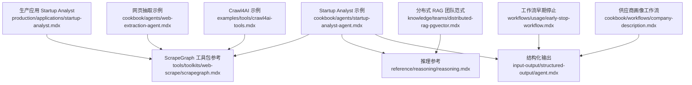
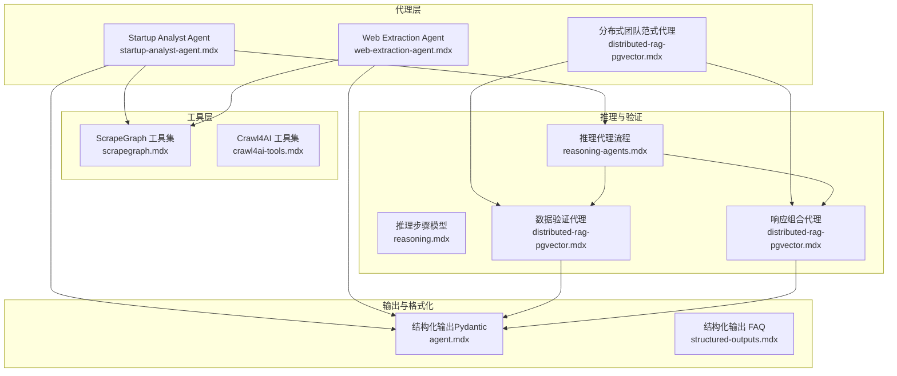
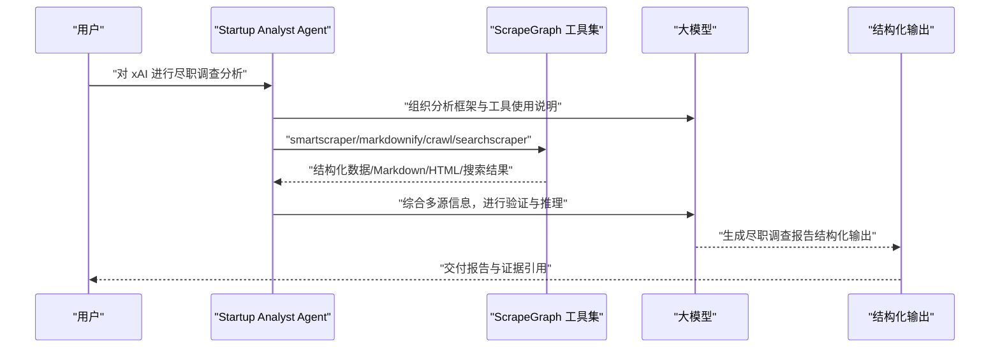
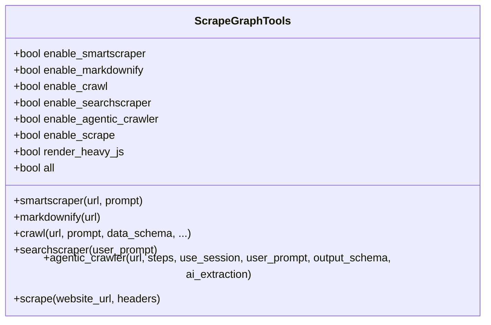
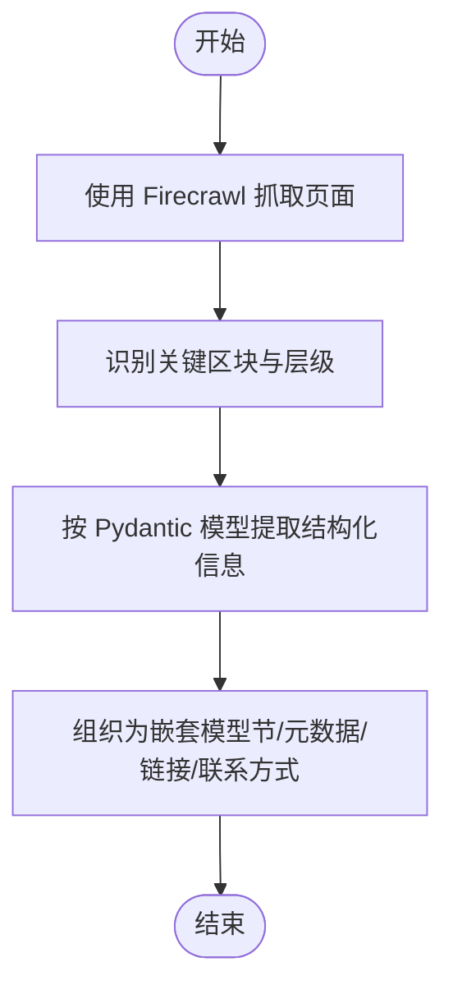
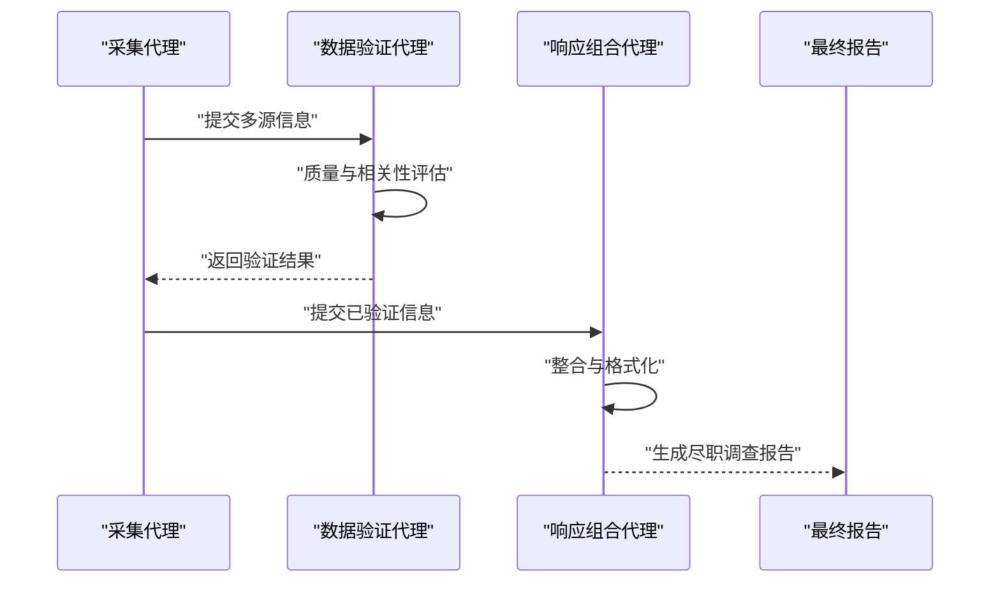
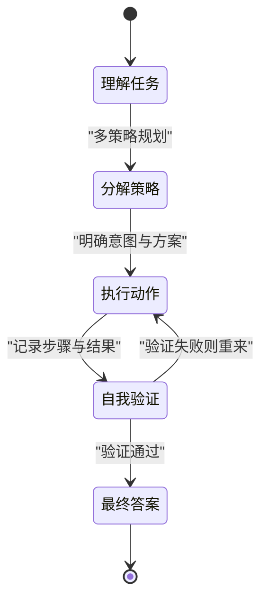
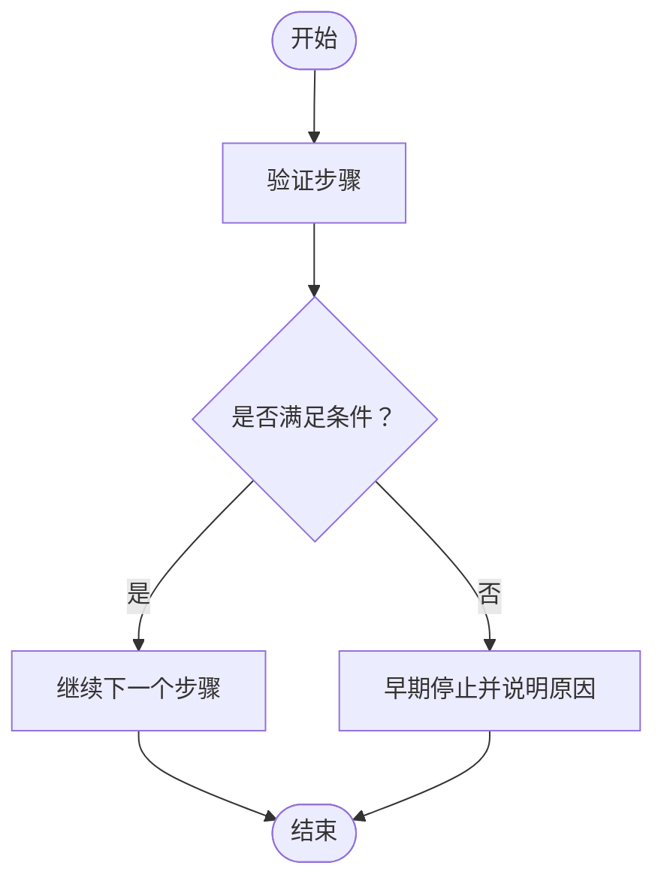
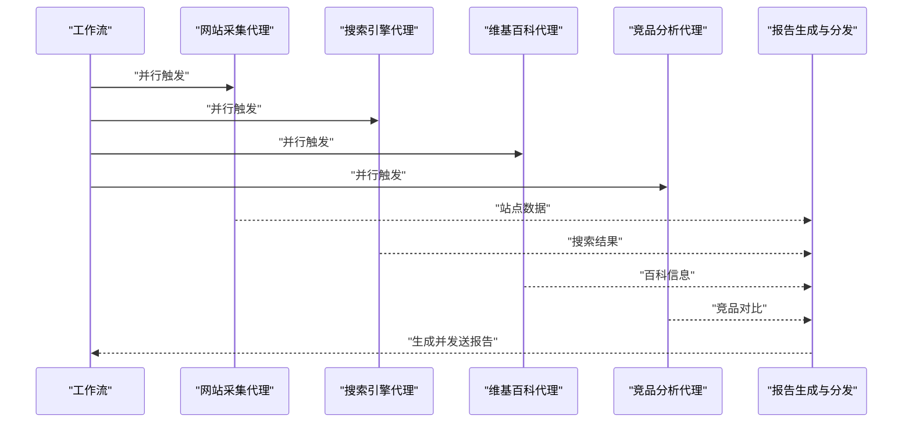
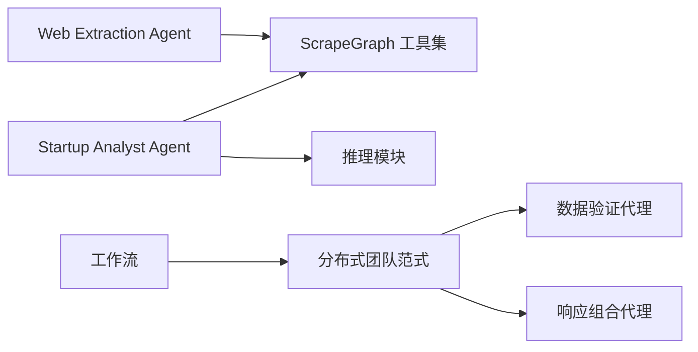

# 初创公司分析师

<cite>
**本文引用的文件**
- [startup-analyst-agent.mdx](file://cookbook/agents/startup-analyst-agent.mdx)
- [scrapegraph.mdx](file://tools/toolkits/web-scrape/scrapegraph.mdx)
- [startup-analyst.mdx](file://production/applications/startup-analyst.mdx)
- [web-extraction-agent.mdx](file://cookbook/agents/web-extraction-agent.mdx)
- [crawl4ai-tools.mdx](file://examples/tools/crawl4ai-tools.mdx)
- [distributed-rag-pgvector.mdx](file://knowledge/teams/distributed-rag-pgvector.mdx)
- [distributed-rag-pgvector.mdx](file://examples/teams/distributed-rag/distributed-rag-pgvector.mdx)
- [reasoning.mdx](file://reference/reasoning/reasoning.mdx)
- [reasoning-agents.mdx](file://reasoning/reasoning-agents.mdx)
- [agent.mdx](file://input-output/structured-output/agent.mdx)
- [structured-outputs.mdx](file://faq/structured-outputs.mdx)
- [early-stop-workflow.mdx](file://workflows/usage/early-stop-workflow.mdx)
- [company-description.mdx](file://cookbook/workflows/company-description.mdx)
</cite>

## 目录
1. [简介](#简介)
2. [项目结构](#项目结构)
3. [核心组件](#核心组件)
4. [架构总览](#架构总览)
5. [详细组件分析](#详细组件分析)
6. [依赖关系分析](#依赖关系分析)
7. [性能考量](#性能考量)
8. [故障排查指南](#故障排查指南)
9. [结论](#结论)
10. [附录](#附录)

## 简介
本技术文档面向初创公司分析师，系统性阐述基于 ScrapeGraph 的尽职调查报告生成系统：从网站爬取与结构化提取，到信息验证与报告生成的完整流程。文档覆盖数据收集算法、信息验证机制、报告生成过程、配置指南（爬取策略、数据源选择、报告格式化），并提供可操作的尽职调查示例，帮助确保数据准确性与报告完整性。

## 项目结构
该仓库提供了多个与“初创公司分析师”直接相关的知识与示例资源：
- 启动分析器示例与用法说明：cookbook/agents/startup-analyst-agent.mdx
- ScrapeGraph 工具包参考与参数说明：tools/toolkits/web-scrape/scrapegraph.mdx
- 生产级应用“Startup Analyst”使用说明：production/applications/startup-analyst.mdx
- 基于结构化输出的网页抽取示例：cookbook/agents/web-extraction-agent.mdx
- 其他网络爬取工具示例（如 Crawl4AI）：examples/tools/crawl4ai-tools.mdx
- 团队式信息验证与响应组合范式：knowledge/teams/distributed-rag-pgvector.mdx 及 examples/teams/distributed-rag/distributed-rag-pgvector.mdx
- 推理框架与步骤模型：reference/reasoning/reasoning.mdx、reasoning/reasoning-agents.mdx
- 结构化输出与类型安全：input-output/structured-output/agent.mdx、faq/structured-outputs.mdx
- 流程工作流中的早期停止与验证：workflows/usage/early-stop-workflow.mdx
- 多源并行采集与邮件发送的供应商画像工作流：cookbook/workflows/company-description.mdx

**图表来源**
- [startup-analyst-agent.mdx:1-116](file://cookbook/agents/startup-analyst-agent.mdx#L1-L116)
- [scrapegraph.mdx:1-137](file://tools/toolkits/web-scrape/scrapegraph.mdx#L1-L137)
- [startup-analyst.mdx:1-194](file://production/applications/startup-analyst.mdx#L1-L194)
- [web-extraction-agent.mdx:1-139](file://cookbook/agents/web-extraction-agent.mdx#L1-L139)
- [crawl4ai-tools.mdx:34-101](file://examples/tools/crawl4ai-tools.mdx#L34-L101)
- [reasoning.mdx:1-26](file://reference/reasoning/reasoning.mdx#L1-L26)
- [distributed-rag-pgvector.mdx:91-119](file://knowledge/teams/distributed-rag-pgvector.mdx#L91-L119)
- [agent.mdx:1-42](file://input-output/structured-output/agent.mdx#L1-L42)
- [early-stop-workflow.mdx:21-56](file://workflows/usage/early-stop-workflow.mdx#L21-L56)
- [company-description.mdx:167-442](file://cookbook/workflows/company-description.mdx#L167-L442)

**章节来源**
- [startup-analyst-agent.mdx:1-116](file://cookbook/agents/startup-analyst-agent.mdx#L1-L116)
- [scrapegraph.mdx:1-137](file://tools/toolkits/web-scrape/scrapegraph.mdx#L1-L137)
- [startup-analyst.mdx:1-194](file://production/applications/startup-analyst.mdx#L1-L194)

## 核心组件
- 启动分析器代理（Startup Analyst Agent）
  - 使用 ScrapeGraph 工具集进行网站结构化提取、Markdown 转换、站点爬取与搜索抓取，结合推理能力完成尽职调查。
  - 关键要点：明确分析框架（基础分析、市场情报、财务评估、风险评估）、工具使用规范、输出标准与专业语言要求。
- ScrapeGraph 工具包
  - 提供 smartscraper、markdownify、crawl、searchscraper、scrape 等能力；支持重 JS 渲染；可按需启用或全量启用。
  - 参数与函数清单详见工具包参考文档。
- 生产应用 Startup Analyst
  - 提供完整的安装、运行与排错指南；强调多公司对比、快速扫描等场景；集成推理工具与历史上下文增强。
- 结构化输出与类型安全
  - 通过 Pydantic 模型约束输出，确保字段一致性与可解析性；与模型的结构化输出能力配合，提升可靠性。
- 分布式团队范式（验证与组合）
  - 数据验证代理负责质量与相关性评估；响应组合代理负责整合与格式化输出，体现“先验证、后组合”的稳健流程。
- 推理框架
  - 明确推理步骤（分解、规划、执行、验证、最终答案），支持置信度评分与自修正，适用于复杂尽调任务。

**章节来源**
- [startup-analyst-agent.mdx:20-85](file://cookbook/agents/startup-analyst-agent.mdx#L20-L85)
- [scrapegraph.mdx:8-22](file://tools/toolkits/web-scrape/scrapegraph.mdx#L8-L22)
- [startup-analyst.mdx:105-126](file://production/applications/startup-analyst.mdx#L105-L126)
- [agent.mdx:7-42](file://input-output/structured-output/agent.mdx#L7-L42)
- [reasoning.mdx:8-26](file://reference/reasoning/reasoning.mdx#L8-L26)
- [distributed-rag-pgvector.mdx:91-119](file://knowledge/teams/distributed-rag-pgvector.mdx#L91-L119)

## 架构总览
下图展示了“初创公司分析师”系统的高层交互：代理驱动工具进行数据采集与转换，推理模块参与验证与规划，结构化输出保障结果一致性，最终生成尽职调查报告。

**图表来源**
- [startup-analyst-agent.mdx:13-85](file://cookbook/agents/startup-analyst-agent.mdx#L13-L85)
- [web-extraction-agent.mdx:33-95](file://cookbook/agents/web-extraction-agent.mdx#L33-L95)
- [scrapegraph.mdx:109-137](file://tools/toolkits/web-scrape/scrapegraph.mdx#L109-L137)
- [crawl4ai-tools.mdx:34-101](file://examples/tools/crawl4ai-tools.mdx#L34-L101)
- [reasoning.mdx:8-26](file://reference/reasoning/reasoning.mdx#L8-L26)
- [reasoning-agents.mdx:35-69](file://reasoning/reasoning-agents.mdx#L35-L69)
- [distributed-rag-pgvector.mdx:91-119](file://knowledge/teams/distributed-rag-pgvector.mdx#L91-L119)
- [agent.mdx:7-42](file://input-output/structured-output/agent.mdx#L7-L42)
- [structured-outputs.mdx:6-37](file://faq/structured-outputs.mdx#L6-L37)

## 详细组件分析

### 组件一：启动分析器代理（Startup Analyst Agent）
- 角色与职责
  - 面向投资决策的尽职调查专家，遵循四阶段分析框架：基础分析、市场情报、财务评估、风险评估。
  - 明确工具使用边界：SmartScraper 用于结构化提取；Markdownify 用于内容质量与信息提炼；Crawl 用于站点全量分析；SearchScraper 用于外部信息检索。
- 输出规范
  - 报告包含执行摘要、公司概况、财务与增长指标、风险评估、战略建议等；强调证据引用、置信度与专业语言。
- 实现要点
  - 通过指令明确任务目标与输出标准；启用 Markdown 输出以提升可读性；结合推理能力进行跨源交叉验证。

**图表来源**
- [startup-analyst-agent.mdx:20-85](file://cookbook/agents/startup-analyst-agent.mdx#L20-L85)
- [scrapegraph.mdx:109-137](file://tools/toolkits/web-scrape/scrapegraph.mdx#L109-L137)
- [agent.mdx:7-42](file://input-output/structured-output/agent.mdx#L7-L42)

**章节来源**
- [startup-analyst-agent.mdx:20-85](file://cookbook/agents/startup-analyst-agent.mdx#L20-L85)

### 组件二：ScrapeGraph 工具包
- 能力矩阵
  - smartscraper：基于自然语言提示的结构化提取
  - markdownify：网页转 Markdown
  - crawl：站点爬取与结构化提取
  - searchscraper：网络搜索并提取信息
  - scrape：获取原始 HTML 内容（用于自定义解析）
- 参数与函数
  - 支持按需启用（enable_*）或全量启用（all=True），并可开启重 JS 渲染（render_heavy_js）以适配 SPA 动态内容。
- 使用建议
  - 对动态站点优先启用重 JS 渲染；对需要完整 HTML 的场景使用 scrape 方法；在多源交叉验证中结合 smartscraper 与 searchscraper。

**图表来源**
- [scrapegraph.mdx:109-137](file://tools/toolkits/web-scrape/scrapegraph.mdx#L109-L137)

**章节来源**
- [scrapegraph.mdx:8-22](file://tools/toolkits/web-scrape/scrapegraph.mdx#L8-L22)
- [scrapegraph.mdx:109-137](file://tools/toolkits/web-scrape/scrapegraph.mdx#L109-L137)

### 组件三：网页抽取与结构化输出（Web Extraction Agent）
- 流程
  - 使用 Firecrawl 获取页面内容 → 识别关键区块与层级 → 按 Pydantic 模型提取结构化信息 → 输出嵌套对象（节、元数据、链接、联系方式等）。
- 优势
  - 结构化输出确保一致性；可选字段优雅处理不同页面布局；便于入库与二次加工。
- 与 ScrapeGraph 的关系
  - 二者均可用于网页内容抽取，但 ScrapeGraph 更强调 LLM 驱动的智能提取与搜索扩展，适合尽职调查的多源融合。

**图表来源**
- [web-extraction-agent.mdx:20-95](file://cookbook/agents/web-extraction-agent.mdx#L20-L95)

**章节来源**
- [web-extraction-agent.mdx:20-95](file://cookbook/agents/web-extraction-agent.mdx#L20-L95)

### 组件四：分布式团队范式（验证与组合）
- 数据验证代理
  - 评估检索信息的质量与相关性；检查不同搜索结果的一致性；识别最可靠与准确的信息；过滤无关或低质量内容；确保数据完整性与相关性。
- 响应组合代理
  - 整合验证后的信息；生成结构化、全面的响应；包含适当的来源归属与数据溯源；确保清晰连贯；优化用户体验。
- 适用场景
  - 尽职调查中对多源信息进行交叉验证与统一输出，降低误判风险。

**图表来源**
- [distributed-rag-pgvector.mdx:91-119](file://knowledge/teams/distributed-rag-pgvector.mdx#L91-L119)
- [distributed-rag-pgvector.mdx:76-102](file://examples/teams/distributed-rag/distributed-rag-pgvector.mdx#L76-L102)

**章节来源**
- [distributed-rag-pgvector.mdx:91-119](file://knowledge/teams/distributed-rag-pgvector.mdx#L91-L119)
- [distributed-rag-pgvector.mdx:76-102](file://examples/teams/distributed-rag/distributed-rag-pgvector.mdx#L76-L102)

### 组件五：推理与验证（Reasoning）
- 推理步骤
  - 任务理解与分解 → 多策略规划 → 明确意图与行动方案 → 执行并记录每步思考、动作、结果与置信度 → 交叉验证与自修正 → 最终答案。
- 置信度与元数据
  - 每步推理包含标题、思考、动作、结果、下一步动作（继续/验证/最终答案/重置）、置信度与附加元数据，便于审计与回溯。
- 应用价值
  - 在尽职调查中，推理能有效避免一次性跳跃式判断，提升结论可信度。

**图表来源**
- [reasoning-agents.mdx:35-69](file://reasoning/reasoning-agents.mdx#L35-L69)
- [reasoning.mdx:8-26](file://reference/reasoning/reasoning.mdx#L8-L26)

**章节来源**
- [reasoning-agents.mdx:35-69](file://reasoning/reasoning-agents.mdx#L35-L69)
- [reasoning.mdx:8-26](file://reference/reasoning/reasoning.mdx#L8-L26)

### 组件六：工作流中的早期停止与验证
- 早期停止逻辑
  - 在工作流中插入验证步骤，若数据不满足预设条件（如数值正向、日期格式合理），则提前终止并给出理由。
- 与结构化输出结合
  - 通过结构化输出确保输入/中间结果符合预期模式，减少下游处理错误。

**图表来源**
- [early-stop-workflow.mdx:51-56](file://workflows/usage/early-stop-workflow.mdx#L51-L56)

**章节来源**
- [early-stop-workflow.mdx:21-56](file://workflows/usage/early-stop-workflow.mdx#L21-L56)

### 组件七：多源并行采集与报告生成（供应商画像工作流）
- 并行采集
  - 四个代理同时从网站爬取、搜索引擎、维基百科、竞品分析等多源获取信息，最大化效率。
- 报告与分发
  - 生成结构化 Markdown 报告并通过邮件发送；具备缓存机制，重复请求可直接返回缓存结果。
- 类比应用
  - 尽职调查可借鉴其并行采集与缓存设计，结合 ScrapeGraph 与搜索工具，形成“站点+外部信息+历史对比”的综合视图。

**图表来源**
- [company-description.mdx:410-442](file://cookbook/workflows/company-description.mdx#L410-L442)

**章节来源**
- [company-description.mdx:167-442](file://cookbook/workflows/company-description.mdx#L167-L442)

## 依赖关系分析
- 组件耦合
  - 启动分析器代理依赖 ScrapeGraph 工具集与推理模块；网页抽取代理同样依赖工具集但侧重结构化输出；分布式团队范式用于验证与组合，提升整体鲁棒性。
- 外部依赖
  - ScrapeGraph API 密钥与 OpenAI API 密钥；部分工具可能需要额外 API 密钥（如 Firecrawl/Crawl4AI）。
- 循环依赖
  - 文档中未见循环导入或调用链；各组件职责清晰，接口边界明确。

**图表来源**
- [startup-analyst-agent.mdx:13-85](file://cookbook/agents/startup-analyst-agent.mdx#L13-L85)
- [scrapegraph.mdx:109-137](file://tools/toolkits/web-scrape/scrapegraph.mdx#L109-L137)
- [web-extraction-agent.mdx:33-95](file://cookbook/agents/web-extraction-agent.mdx#L33-L95)
- [distributed-rag-pgvector.mdx:91-119](file://knowledge/teams/distributed-rag-pgvector.mdx#L91-L119)
- [company-description.mdx:410-442](file://cookbook/workflows/company-description.mdx#L410-L442)

**章节来源**
- [startup-analyst-agent.mdx:13-85](file://cookbook/agents/startup-analyst-agent.mdx#L13-L85)
- [scrapegraph.mdx:109-137](file://tools/toolkits/web-scrape/scrapegraph.mdx#L109-L137)
- [web-extraction-agent.mdx:33-95](file://cookbook/agents/web-extraction-agent.mdx#L33-L95)
- [distributed-rag-pgvector.mdx:91-119](file://knowledge/teams/distributed-rag-pgvector.mdx#L91-L119)
- [company-description.mdx:410-442](file://cookbook/workflows/company-description.mdx#L410-L442)

## 性能考量
- 并行采集
  - 在多源信息获取时采用并行策略，缩短端到端时间；注意控制并发度以避免被目标站点限流。
- 重 JS 渲染成本
  - 启用 render_heavy_js 会增加计算与等待时间；仅在必要时开启，并结合缓存策略。
- 结构化输出与缓存
  - 使用结构化输出减少后处理开销；对重复查询建立缓存，显著降低重复分析成本。
- 工作流早期停止
  - 在数据质量不达标时尽早退出，避免无效计算与资源浪费。

[本节为通用指导，无需特定文件来源]

## 故障排查指南
- ScrapeGraph API 错误
  - 核对环境变量 SGAI_API_KEY 是否正确设置；查看仪表盘用量限制。
- 网站数据不完整
  - 部分网站可能反爬或限制访问；代理会在报告中标注可访问范围与置信度。
- 资金信息缺失
  - 融资数据依赖公开来源；私有公司信息有限；可在“尽职调查关注点”中标注需人工补充的领域。
- 依赖与密钥
  - 确认已安装 scrapegraph-py、openai 等依赖，并正确设置 OPENAI_API_KEY 与 SGAI_API_KEY。

**章节来源**
- [startup-analyst.mdx:172-188](file://production/applications/startup-analyst.mdx#L172-L188)

## 结论
通过 ScrapeGraph 工具集与推理、验证、组合机制的协同，初创公司分析师能够构建一套稳健的尽职调查自动化流水线：从多源数据采集、结构化提取、交叉验证到最终报告生成。结合并行采集、缓存与早期停止策略，系统在保证准确性的同时提升了效率与可维护性。建议在实际部署中根据目标站点特性调整爬取策略与验证阈值，并持续优化输出模式以满足不同投资决策场景。

[本节为总结性内容，无需特定文件来源]

## 附录

### 配置指南：爬取策略、数据源与报告格式化
- 爬取策略
  - 动态内容：启用 render_heavy_js；对 SPA 或重度 JS 站点尤为必要。
  - 站点全量分析：使用 crawl 并设定深度、最大页数、同域限制与批大小。
  - 原始 HTML：使用 scrape 获取完整源码，便于自定义解析。
- 数据源选择
  - 站点内信息：smartscraper + markdownify
  - 外部信息：searchscraper（融资、新闻、高管背景等）
  - 竞品对比：结合 crawl 与 searchscraper
- 报告格式化
  - 使用结构化输出（Pydantic）确保字段一致与可解析；在代理中启用 Markdown 输出以提升可读性。
  - 在分布式团队范式中由响应组合代理统一格式，包含来源归属与置信度说明。

**章节来源**
- [scrapegraph.mdx:109-137](file://tools/toolkits/web-scrape/scrapegraph.mdx#L109-L137)
- [agent.mdx:7-42](file://input-output/structured-output/agent.mdx#L7-L42)
- [startup-analyst-agent.mdx:20-85](file://cookbook/agents/startup-analyst-agent.mdx#L20-L85)

### 实际尽职调查示例：不同类型初创公司的处理思路
- 产品导向型初创
  - 重点：产品页面（smartscraper 提取功能列表、定价、用户案例）、官网营销语（markdownify 质量评估）、行业新闻（searchscraper）。
- 服务/平台型初创
  - 重点：商业模式与收入流（smartscraper）、客户画像与市场定位（searchscraper）、监管与合规（外部搜索）。
- 私有/早期阶段
  - 重点：创始人背景与履历（searchscraper）、行业趋势与竞争格局（外部搜索）、估值与融资轮次（公开披露）。
- 注意事项
  - 对受限站点采用替代数据源；对缺失字段在报告中明确标注“需人工研究”。

[本节为概念性示例，无需特定文件来源]