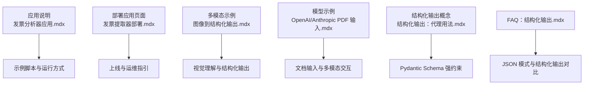
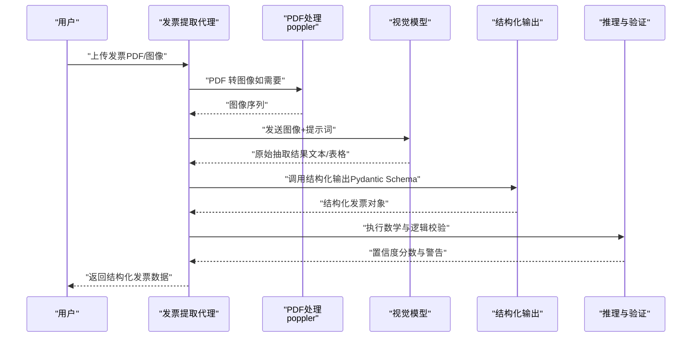
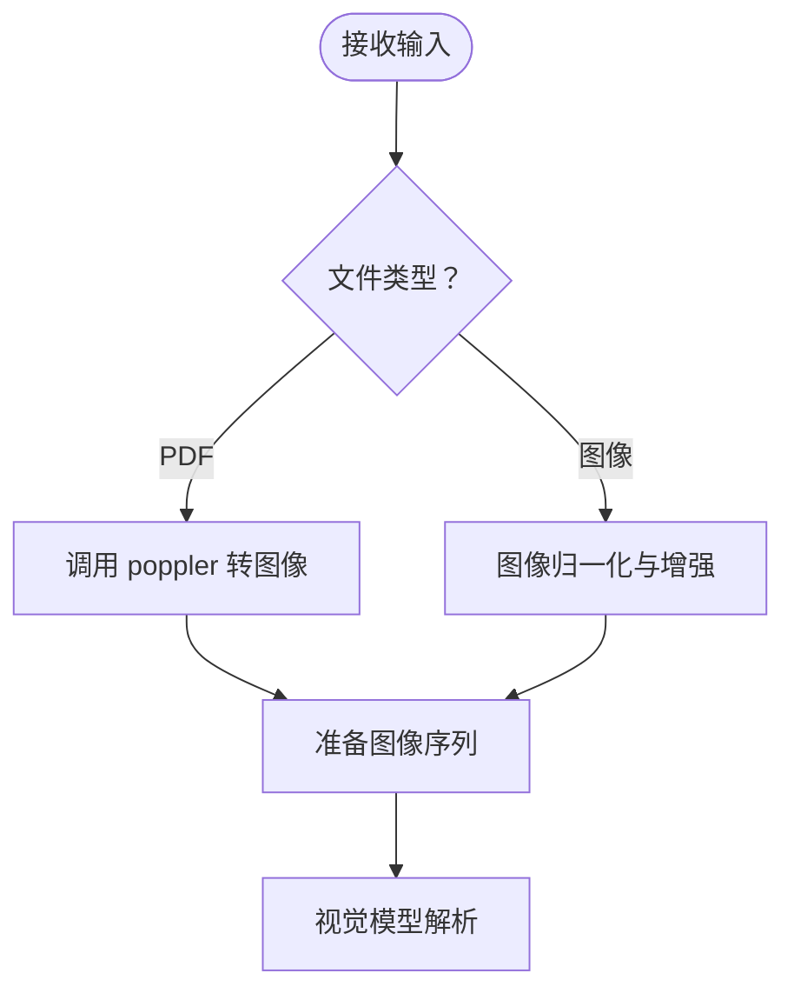
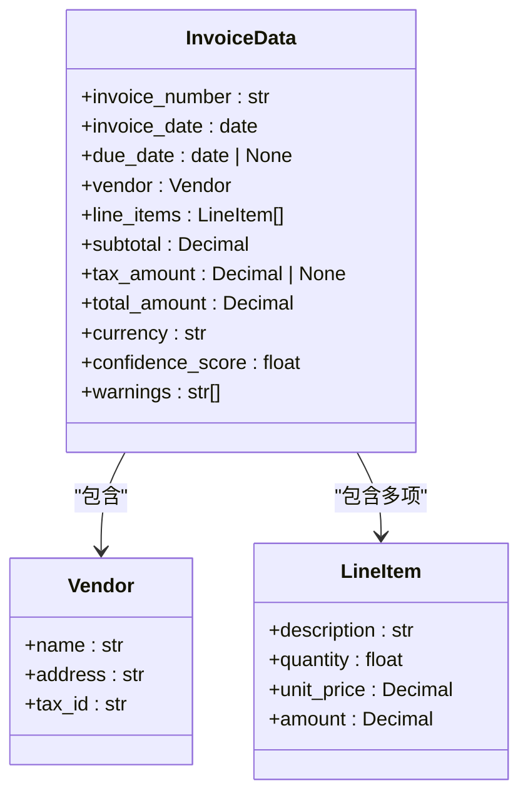
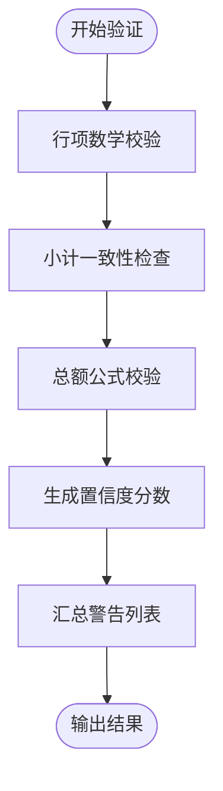
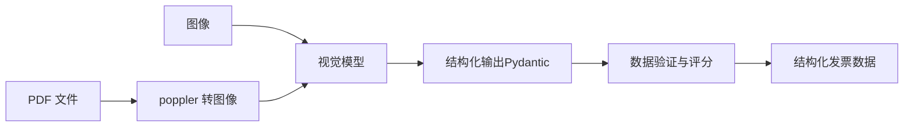
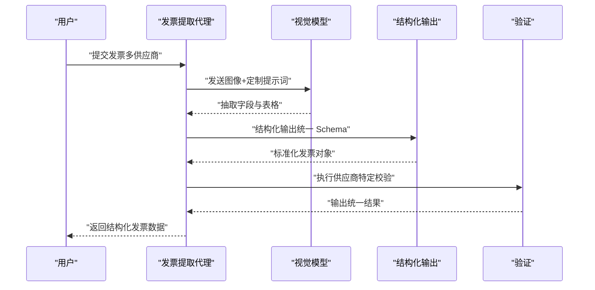

# 发票提取代理

<cite>
**本文引用的文件**
- [发票分析器（应用）.mdx](file://production/applications/invoice-analyst.mdx)
- [发票提取器（部署）.mdx](file://deploy/apps/agents/invoice-extractor.mdx)
- [OpenAI 聊天模型：PDF 本地输入示例.mdx](file://examples/models/openai/chat/pdf-input-local.mdx)
- [Anthropic 模型：PDF 本地输入示例.mdx](file://examples/models/anthropic/pdf-input-local.mdx)
- [多模态：图像到结构化输出示例.mdx](file://examples/agents/multimodal/image-to-structured-output.mdx)
- [结构化输出：代理用法.mdx](file://input-output/structured-output/agent.mdx)
- [FAQ：结构化输出.mdx](file://faq/structured-outputs.mdx)
</cite>

## 目录
1. [简介](#简介)
2. [项目结构](#项目结构)
3. [核心组件](#核心组件)
4. [架构总览](#架构总览)
5. [组件详解](#组件详解)
6. [依赖关系分析](#依赖关系分析)
7. [性能考量](#性能考量)
8. [故障排查指南](#故障排查指南)
9. [结论](#结论)
10. [附录](#附录)

## 简介
本技术文档面向“发票提取代理”，这是一个基于视觉理解的结构化数据抽取系统，能够从 PDF 与图像文件中提取发票关键字段，并进行数据验证与置信度评分。该代理以多模态大模型的原生视觉能力为核心，结合结构化输出模式与推理工具，完成从文档加载、布局理解、字段抽取、表格解析、计算校验到最终结构化结果输出的完整流程。

## 项目结构
围绕发票提取代理的关键内容主要分布在以下位置：
- 应用说明与使用指南：生产级应用页面
- 部署与集成：部署应用页面
- 多模态与结构化输出：示例与概念文档
- 模型与输入：PDF 与图像输入示例

**图表来源**
- [发票分析器（应用）.mdx:1-201](file://production/applications/invoice-analyst.mdx#L1-L201)
- [发票提取器（部署）.mdx:1-9](file://deploy/apps/agents/invoice-extractor.mdx#L1-L9)
- [多模态：图像到结构化输出示例.mdx:1-70](file://examples/agents/multimodal/image-to-structured-output.mdx#L1-L70)
- [OpenAI 聊天模型：PDF 本地输入示例.mdx:1-62](file://examples/models/openai/chat/pdf-input-local.mdx#L1-L62)
- [Anthropic 模型：PDF 本地输入示例.mdx:1-68](file://examples/models/anthropic/pdf-input-local.mdx#L1-L68)
- [结构化输出：代理用法.mdx:1-42](file://input-output/structured-output/agent.mdx#L1-L42)
- [FAQ：结构化输出.mdx:1-37](file://faq/structured-outputs.mdx#L1-L37)

**章节来源**
- [发票分析器（应用）.mdx:1-201](file://production/applications/invoice-analyst.mdx#L1-L201)
- [发票提取器（部署）.mdx:1-9](file://deploy/apps/agents/invoice-extractor.mdx#L1-L9)

## 核心组件
- 文档预处理模块
  - PDF 到图像转换：通过系统依赖将 PDF 页面转为图像，便于视觉模型处理。
  - 图像增强与归一化：提升扫描件清晰度与版面一致性。
- 视觉理解与布局解析
  - 使用具备视觉能力的大模型对图像进行布局理解与字段定位。
  - 基于视觉提示词与结构化输出模式，抽取关键字段与表格行项。
- 结构化数据建模
  - 定义发票数据的 Pydantic 模型，确保字段类型、可选性与默认值严格一致。
- 数据验证与置信度评分
  - 行项数学校验（数量×单价≈小计）、小计一致性检查、总额公式校验（含税/费/折扣/运费等）。
  - 输出包含置信度分数与警告列表，辅助人工复核。
- 推理工具与上下文增强
  - 启用推理工具进行分步规划与验证；开启历史与时间上下文，提升抽取稳定性。

**章节来源**
- [发票分析器（应用）.mdx:110-175](file://production/applications/invoice-analyst.mdx#L110-L175)

## 架构总览
下图展示了发票提取代理的端到端工作流，从输入到输出与验证的全链路：

**图表来源**
- [发票分析器（应用）.mdx:137-149](file://production/applications/invoice-analyst.mdx#L137-L149)
- [结构化输出：代理用法.mdx:35-42](file://input-output/structured-output/agent.mdx#L35-L42)

## 组件详解

### 组件一：文档预处理与多模态输入
- 支持输入类型
  - PDF：需系统安装 poppler，用于将 PDF 页面转换为图像。
  - 图像：JPG/PNG 等常见格式，直接进入视觉理解阶段。
- 多模态输入
  - 通过文件或图像对象传入模型，结合提示词引导视觉解析。

**图表来源**
- [发票分析器（应用）.mdx:18-23](file://production/applications/invoice-analyst.mdx#L18-L23)
- [OpenAI 聊天模型：PDF 本地输入示例.mdx:1-62](file://examples/models/openai/chat/pdf-input-local.mdx#L1-L62)
- [Anthropic 模型：PDF 本地输入示例.mdx:1-68](file://examples/models/anthropic/pdf-input-local.mdx#L1-L68)

**章节来源**
- [发票分析器（应用）.mdx:18-23](file://production/applications/invoice-analyst.mdx#L18-L23)
- [OpenAI 聊天模型：PDF 本地输入示例.mdx:1-62](file://examples/models/openai/chat/pdf-input-local.mdx#L1-L62)
- [Anthropic 模型：PDF 本地输入示例.mdx:1-68](file://examples/models/anthropic/pdf-input-local.mdx#L1-L68)

### 组件二：视觉理解与结构化输出
- 视觉模型
  - 使用具备视觉能力的多模态模型，无需额外 OCR 工具，直接从图像中抽取字段与表格。
- 结构化输出
  - 将发票数据定义为 Pydantic 模型，模型自动保证字段类型与结构合规。
  - 若模型不支持结构化输出，可回退至 JSON 模式并配合后处理校验。

**图表来源**
- [发票分析器（应用）.mdx:151-166](file://production/applications/invoice-analyst.mdx#L151-L166)
- [结构化输出：代理用法.mdx:11-33](file://input-output/structured-output/agent.mdx#L11-L33)
- [FAQ：结构化输出.mdx:6-20](file://faq/structured-outputs.mdx#L6-L20)

**章节来源**
- [发票分析器（应用）.mdx:151-166](file://production/applications/invoice-analyst.mdx#L151-L166)
- [结构化输出：代理用法.mdx:11-33](file://input-output/structured-output/agent.mdx#L11-L33)
- [FAQ：结构化输出.mdx:6-20](file://faq/structured-outputs.mdx#L6-L20)

### 组件三：数据验证与质量控制
- 数学校验规则
  - 行项金额：数量 × 单价 ≈ 小计（允许微小舍入差异）
  - 小计一致性：行项金额之和 ≈ 小计
  - 总额一致性：subtotal + 税 - 折扣 + 运费 ≈ total
- 质量控制
  - 输出置信度分数，辅助筛选低质量抽取结果。
  - 返回警告列表，标注可能的问题（如部分页合计、隐藏费用、舍入差异等）。

**图表来源**
- [发票分析器（应用）.mdx:168-175](file://production/applications/invoice-analyst.mdx#L168-L175)

**章节来源**
- [发票分析器（应用）.mdx:168-175](file://production/applications/invoice-analyst.mdx#L168-L175)

### 组件四：推理工具与上下文增强
- 推理工具
  - 通过推理工具对抽取策略进行规划与验证，提升跨页与复杂表格的准确性。
- 上下文增强
  - 开启历史上下文与当前日期，帮助模型在多轮抽取中保持一致性与时效性。

**章节来源**
- [发票分析器（应用）.mdx:110-135](file://production/applications/invoice-analyst.mdx#L110-L135)

## 依赖关系分析
- 外部系统依赖
  - poppler：用于 PDF 到图像的转换。
  - 多模态模型服务：如 OpenAI GPT、Anthropic Claude 等具备视觉能力的模型。
- 内部模块耦合
  - 文档预处理与视觉理解解耦，便于替换底层 OCR 或视觉模型。
  - 结构化输出与验证模块独立，可插拔地接入不同模型与校验规则。

**图表来源**
- [发票分析器（应用）.mdx:18-23](file://production/applications/invoice-analyst.mdx#L18-L23)
- [发票分析器（应用）.mdx:137-149](file://production/applications/invoice-analyst.mdx#L137-L149)

**章节来源**
- [发票分析器（应用）.mdx:18-23](file://production/applications/invoice-analyst.mdx#L18-L23)
- [发票分析器（应用）.mdx:137-149](file://production/applications/invoice-analyst.mdx#L137-L149)

## 性能考量
- 批量处理
  - 对多页 PDF 采用分页处理策略，避免单次请求过大导致内存压力。
- 视觉模型选择
  - 在保证精度的前提下，优先选择响应更快的视觉模型；对高分辨率扫描件可先做缩放降采样。
- 结果缓存
  - 对重复发票（如相同供应商同月发票）可引入缓存，减少重复计算。
- 并发与队列
  - 在批量场景下使用异步队列与并发控制，平衡吞吐与延迟。

## 故障排查指南
- PDF 转图像失败
  - 确认已正确安装 poppler（macOS 使用 Homebrew，Ubuntu/Debian 使用 apt）。
- 扫描件质量差导致置信度低
  - 提升扫描分辨率、纠正倾斜、去除背景噪声。
- 数学校验告警
  - 常见原因：舍入差异、隐藏费用、多页发票仅显示部分小计。建议人工复核并调整阈值或规则。
- 模型不支持结构化输出
  - 回退到 JSON 模式，并在后处理阶段进行严格校验与补全。

**章节来源**
- [发票分析器（应用）.mdx:176-195](file://production/applications/invoice-analyst.mdx#L176-L195)

## 结论
发票提取代理通过“视觉理解 + 结构化输出 + 数据验证”的组合，实现了对多格式发票的自动化抽取与质量控制。其模块化设计便于替换底层模型与优化流程，适合在企业财务与采购系统中规模化落地。建议在生产环境中结合缓存、并发与阈值调优，持续提升准确率与吞吐量。

## 附录

### A. 支持的发票格式与字段定义
- 支持格式
  - PDF（需 poppler）
  - 图像（JPG/PNG）
- 字段定义（示例）
  - 发票编号、发票日期、到期日（可空）
  - 供应商信息（名称、地址、税号）
  - 行项目（描述、数量、单价、金额）
  - 小计、税额（可空）、总计、币种
  - 置信度分数、警告列表

**章节来源**
- [发票分析器（应用）.mdx:151-166](file://production/applications/invoice-analyst.mdx#L151-L166)

### B. 配置选项与最佳实践
- 模型配置
  - 使用具备视觉能力的多模态模型；若模型不支持结构化输出，启用 JSON 模式并加强后处理。
- 输出模式
  - 优先使用结构化输出（Pydantic），确保字段强约束与类型安全。
- 上下文增强
  - 启用历史与时间上下文，提升跨页与跨会话的一致性。
- 质量控制
  - 设置合理的数学校验阈值；对异常发票输出警告并保留人工复核通道。

**章节来源**
- [发票分析器（应用）.mddx:110-135](file://production/applications/invoice-analyst.mdx#L110-L135)
- [结构化输出：代理用法.mdx:35-42](file://input-output/structured-output/agent.mdx#L35-L42)
- [FAQ：结构化输出.mdx:6-20](file://faq/structured-outputs.mdx#L6-L20)

### C. 实际处理示例（概念流程）
- 单张发票抽取
  - 加载发票 → PDF 转图像（如需要）→ 视觉解析 → 结构化输出 → 数学与逻辑校验 → 返回结构化数据。
- 批量处理
  - 遍历发票集合，按页拆分与并发处理，汇总结果并生成报表。
- 不同供应商格式适配
  - 通过提示词与 Schema 的灵活扩展，适配不同版式与字段顺序；对特殊供应商建立模板与规则库。

**图表来源**
- [发票分析器（应用）.mdx:137-149](file://production/applications/invoice-analyst.mdx#L137-L149)
- [多模态：图像到结构化输出示例.mdx:1-70](file://examples/agents/multimodal/image-to-structured-output.mdx#L1-L70)