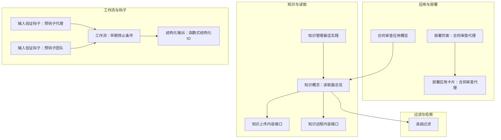
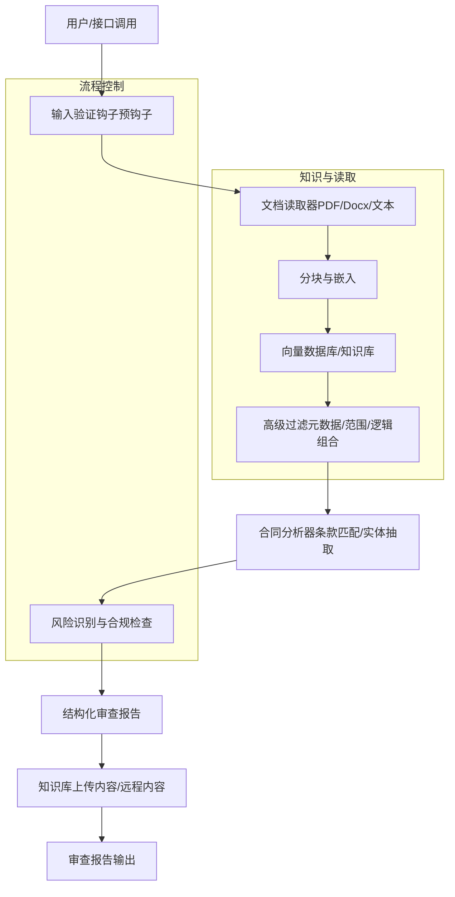
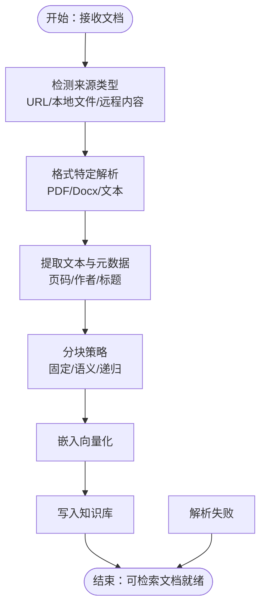
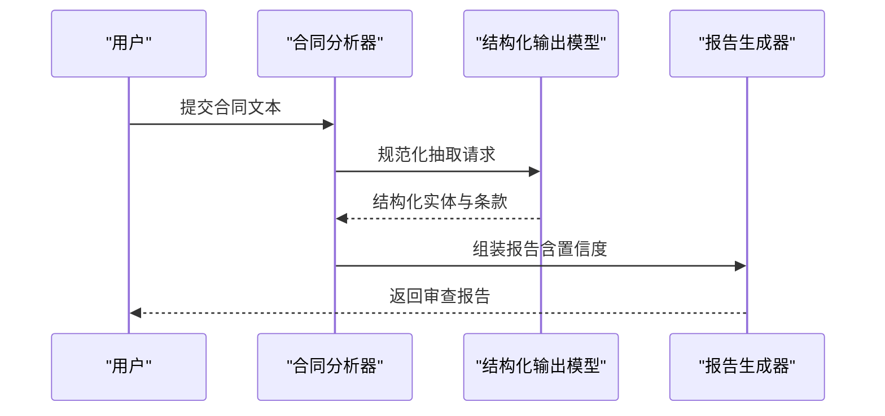
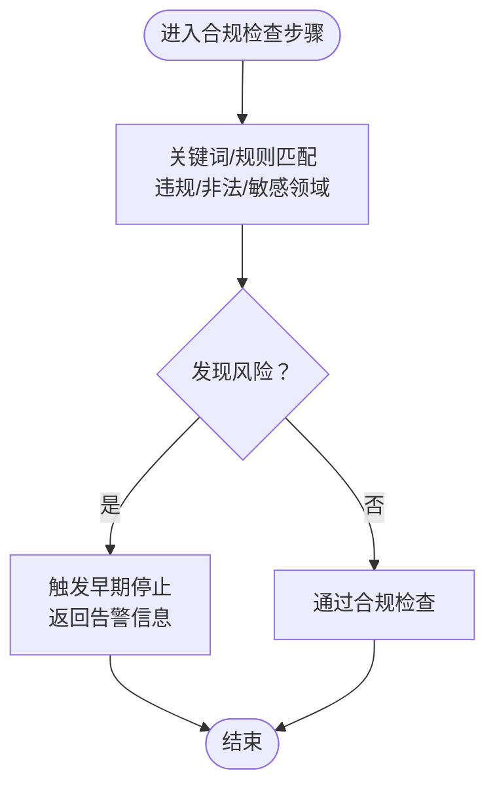
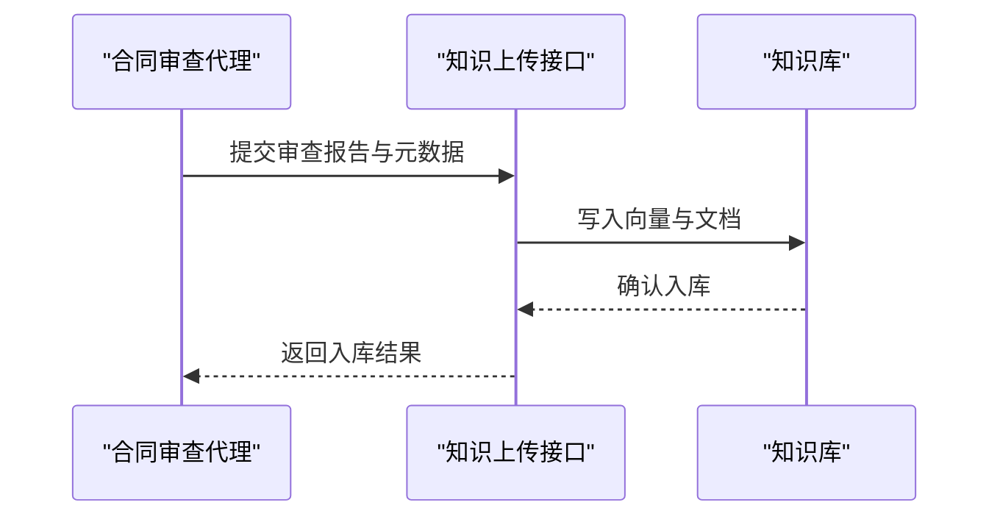
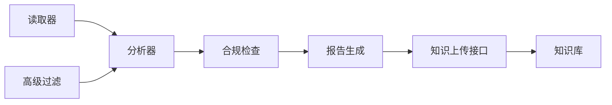

# 合同审查代理

<cite>
**本文引用的文件**
- [合同审查应用概览](file://production/applications/contract-review.mdx)
- [部署页面：合同审查代理](file://deploy/apps/agents/contract-review.mdx)
- [部署应用卡片：合同审查代理](file://deploy/apps.mdx)
- [知识管理最佳实践](file://agent-os/knowledge/manage-knowledge.mdx)
- [知识概念：读取器总览](file://knowledge/concepts/readers/overview.mdx)
- [知识概念：高级过滤](file://knowledge/concepts/filters/advanced-filtering.mdx)
- [结构化输出：函数式结构化IO](file://examples/workflows/advanced-concepts/structured-io/structured-io-function.mdx)
- [工作流：早期停止条件](file://examples/workflows/advanced-concepts/early-stopping/early-stop-condition.mdx)
- [输入验证钩子：预钩子（团队）](file://hooks/usage/team/input-validation-pre-hook.mdx)
- [输入验证钩子：预钩子（代理）](file://hooks/usage/agent/input-validation-pre-hook.mdx)
- [示例：媒体输入与工具](file://examples/agents/multimodal/media-input-for-tool.mdx)
- [参考：知识上传内容接口](file://reference-api/schema/knowledge/upload-content.mdx)
- [参考：知识远程内容接口](file://reference-api/schema/knowledge/upload-remote-content.mdx)
</cite>

## 目录
1. [简介](#简介)
2. [项目结构](#项目结构)
3. [核心组件](#核心组件)
4. [架构总览](#架构总览)
5. [详细组件分析](#详细组件分析)
6. [依赖关系分析](#依赖关系分析)
7. [性能考量](#性能考量)
8. [故障排查指南](#故障排查指南)
9. [结论](#结论)
10. [附录](#附录)

## 简介
本技术文档面向“合同审查代理”，系统性阐述该法律文档分析系统的整体设计、关键能力与实施路径。尽管当前仓库中“合同审查代理”的应用页面处于“即将上线”状态，但通过知识管理、读取器、过滤器、工作流与钩子等现有能力，可以清晰构建出从“文档解析—条款匹配—风险识别—合规检查—报告生成”的完整流水线。本文将重点说明：
- 合同解析算法与条款匹配技术
- 风险识别与合规检查机制
- 配置选项（风险类别、合规标准、审查报告）
- 实际审查示例与优化建议

## 项目结构
围绕合同审查代理的关键技术资产主要分布在以下区域：
- 应用与部署：合同审查代理的应用概览与部署卡片
- 知识与读取：文档读取、分块、嵌入与检索的基础能力
- 过滤与检索：基于元数据的过滤与检索策略
- 工作流与钩子：输入校验、合规检查、早期停止等流程控制
- 结构化输出：统一的结构化输出模型与序列化流程

图表来源
- [合同审查应用概览:1-34](file://production/applications/contract-review.mdx#L1-L34)
- [部署页面：合同审查代理:1-9](file://deploy/apps/agents/contract-review.mdx#L1-L9)
- [部署应用卡片：合同审查代理:52-83](file://deploy/apps.mdx#L52-L83)
- [知识管理最佳实践:104-128](file://agent-os/knowledge/manage-knowledge.mdx#L104-L128)
- [知识概念：读取器总览:1-180](file://knowledge/concepts/readers/overview.mdx#L1-L180)
- [知识概念：高级过滤:37-110](file://knowledge/concepts/filters/advanced-filtering.mdx#L37-L110)
- [工作流：早期停止条件:45-71](file://examples/workflows/advanced-concepts/early-stopping/early-stop-condition.mdx#L45-L71)
- [输入验证钩子：预钩子（代理）:33-65](file://hooks/usage/agent/input-validation-pre-hook.mdx#L33-L65)
- [输入验证钩子：预钩子（团队）:33-65](file://hooks/usage/team/input-validation-pre-hook.mdx#L33-L65)
- [结构化输出：函数式结构化IO:249-273](file://examples/workflows/advanced-concepts/structured-io/structured-io-function.mdx#L249-L273)
- [参考：知识上传内容接口:1-3](file://reference-api/schema/knowledge/upload-content.mdx#L1-L3)
- [参考：知识远程内容接口:1-3](file://reference-api/schema/knowledge/upload-remote-content.mdx#L1-L3)

章节来源
- [合同审查应用概览:1-34](file://production/applications/contract-review.mdx#L1-L34)
- [部署页面：合同审查代理:1-9](file://deploy/apps/agents/contract-review.mdx#L1-L9)
- [部署应用卡片：合同审查代理:52-83](file://deploy/apps.mdx#L52-L83)
- [知识管理最佳实践:104-128](file://agent-os/knowledge/manage-knowledge.mdx#L104-L128)
- [知识概念：读取器总览:1-180](file://knowledge/concepts/readers/overview.mdx#L1-L180)
- [知识概念：高级过滤:37-110](file://knowledge/concepts/filters/advanced-filtering.mdx#L37-L110)
- [工作流：早期停止条件:45-71](file://examples/workflows/advanced-concepts/early-stopping/early-stop-condition.mdx#L45-L71)
- [输入验证钩子：预钩子（代理）:33-65](file://hooks/usage/agent/input-validation-pre-hook.mdx#L33-L65)
- [输入验证钩子：预钩子（团队）:33-65](file://hooks/usage/team/input-validation-pre-hook.mdx#L33-L65)
- [结构化输出：函数式结构化IO:249-273](file://examples/workflows/advanced-concepts/structured-io/structured-io-function.mdx#L249-L273)
- [参考：知识上传内容接口:1-3](file://reference-api/schema/knowledge/upload-content.mdx#L1-L3)
- [参考：知识远程内容接口:1-3](file://reference-api/schema/knowledge/upload-remote-content.mdx#L1-L3)

## 核心组件
- 文档读取与解析
  - 基于知识读取器对 PDF、Word、文本等多格式进行解析，支持密码保护、图像 OCR、按页拆分等参数化配置。
- 条款匹配与实体抽取
  - 利用结构化输出模型与工作流，将合同中的日期、金额、当事人等关键术语抽取并标准化。
- 风险识别与合规检查
  - 通过敏感词检测、合规规则引擎与早期停止机制，识别异常条款并阻断高风险流程。
- 模板对比与红字建议
  - 将提取条款与标准模板比对，生成差异与修订建议。
- 报告生成与知识入库
  - 输出结构化审查报告，并将结果写入知识库以便后续检索与审计。

章节来源
- [知识概念：读取器总览:1-180](file://knowledge/concepts/readers/overview.mdx#L1-L180)
- [结构化输出：函数式结构化IO:249-273](file://examples/workflows/advanced-concepts/structured-io/structured-io-function.mdx#L249-L273)
- [工作流：早期停止条件:45-71](file://examples/workflows/advanced-concepts/early-stopping/early-stop-condition.mdx#L45-L71)
- [合同审查应用概览:11-34](file://production/applications/contract-review.mdx#L11-L34)

## 架构总览
下图展示了合同审查代理从“输入文档”到“结构化报告”的端到端流程，以及与知识库、过滤器、钩子等模块的交互。

图表来源
- [知识概念：读取器总览:1-180](file://knowledge/concepts/readers/overview.mdx#L1-L180)
- [知识概念：高级过滤:37-110](file://knowledge/concepts/filters/advanced-filtering.mdx#L37-L110)
- [输入验证钩子：预钩子（代理）:33-65](file://hooks/usage/agent/input-validation-pre-hook.mdx#L33-L65)
- [输入验证钩子：预钩子（团队）:33-65](file://hooks/usage/team/input-validation-pre-hook.mdx#L33-L65)
- [工作流：早期停止条件:45-71](file://examples/workflows/advanced-concepts/early-stopping/early-stop-condition.mdx#L45-L71)
- [参考：知识上传内容接口:1-3](file://reference-api/schema/knowledge/upload-content.mdx#L1-L3)
- [参考：知识远程内容接口:1-3](file://reference-api/schema/knowledge/upload-remote-content.mdx#L1-L3)

## 详细组件分析

### 组件A：合同解析与读取器
- 能力概述
  - 支持多种文档格式（PDF、Docx、文本），具备密码读取、图像 OCR、按页拆分等能力；可异步批量处理，提升吞吐。
- 关键参数
  - 分块开关、分块大小、加密密码、是否启用图像识别、按页拆分等。
- 复杂度与性能
  - 解析复杂度与文档页数、图像数量相关；异步批处理可显著降低端到端延迟。
- 错误处理
  - 解析失败返回空列表，便于上层统一兜底与重试。

图表来源
- [知识概念：读取器总览:1-180](file://knowledge/concepts/readers/overview.mdx#L1-L180)

章节来源
- [知识概念：读取器总览:1-180](file://knowledge/concepts/readers/overview.mdx#L1-L180)

### 组件B：条款匹配与实体抽取
- 能力概述
  - 使用结构化输出模型抽取关键术语（日期、金额、当事人等），并生成结构化报告。
- 数据流
  - 输入合同文本 → 结构化抽取 → 校验与标准化 → 输出报告对象。
- 性能与准确性
  - 通过分块与嵌入，结合检索增强，可提升抽取稳定性与召回率。

图表来源
- [结构化输出：函数式结构化IO:249-273](file://examples/workflows/advanced-concepts/structured-io/structured-io-function.mdx#L249-L273)

章节来源
- [结构化输出：函数式结构化IO:249-273](file://examples/workflows/advanced-concepts/structured-io/structured-io-function.mdx#L249-L273)

### 组件C：风险识别与合规检查
- 能力概述
  - 基于敏感词检测（如“违规/非法”）与合规规则，自动标记风险并可选择提前终止流程。
- 流程控制
  - 在工作流中插入合规检查步骤，若命中高风险关键词则立即停止，避免进一步处理。
- 可扩展性
  - 可替换为更复杂的规则引擎或外部合规服务。

图表来源
- [工作流：早期停止条件:45-71](file://examples/workflows/advanced-concepts/early-stopping/early-stop-condition.mdx#L45-L71)

章节来源
- [工作流：早期停止条件:45-71](file://examples/workflows/advanced-concepts/early-stopping/early-stop-condition.mdx#L45-L71)

### 组件D：模板对比与红字建议
- 能力概述
  - 将提取条款与标准模板字段进行对比，识别差异并生成修订建议。
- 实施要点
  - 定义标准模板字段清单与权重；对齐术语与格式；输出结构化差异报告。

章节来源
- [合同审查应用概览:11-34](file://production/applications/contract-review.mdx#L11-L34)

### 组件E：报告生成与知识入库
- 能力概述
  - 输出结构化审查报告（标题、类型、摘要、要点、实体、行动项、置信度等），并上传至知识库。
- 接口与参数
  - 内容上传与远程内容上传接口，支持批量与异步写入。

图表来源
- [参考：知识上传内容接口:1-3](file://reference-api/schema/knowledge/upload-content.mdx#L1-L3)
- [参考：知识远程内容接口:1-3](file://reference-api/schema/knowledge/upload-remote-content.mdx#L1-L3)

章节来源
- [参考：知识上传内容接口:1-3](file://reference-api/schema/knowledge/upload-content.mdx#L1-L3)
- [参考：知识远程内容接口:1-3](file://reference-api/schema/knowledge/upload-remote-content.mdx#L1-L3)

## 依赖关系分析
- 组件耦合
  - 读取器与分块器是上游基础能力，被分析器与过滤器共同依赖。
  - 合规检查与早期停止在工作流层面作为横切关注点，贯穿多个步骤。
- 外部依赖
  - 知识库（向量数据库）用于存储与检索；上传接口负责持久化。
- 循环依赖
  - 当前模块间为单向数据流，未见循环依赖迹象。

图表来源
- [知识概念：读取器总览:1-180](file://knowledge/concepts/readers/overview.mdx#L1-L180)
- [知识概念：高级过滤:37-110](file://knowledge/concepts/filters/advanced-filtering.mdx#L37-L110)
- [工作流：早期停止条件:45-71](file://examples/workflows/advanced-concepts/early-stopping/early-stop-condition.mdx#L45-L71)
- [参考：知识上传内容接口:1-3](file://reference-api/schema/knowledge/upload-content.mdx#L1-L3)
- [参考：知识远程内容接口:1-3](file://reference-api/schema/knowledge/upload-remote-content.mdx#L1-L3)

章节来源
- [知识概念：读取器总览:1-180](file://knowledge/concepts/readers/overview.mdx#L1-L180)
- [知识概念：高级过滤:37-110](file://knowledge/concepts/filters/advanced-filtering.mdx#L37-L110)
- [工作流：早期停止条件:45-71](file://examples/workflows/advanced-concepts/early-stopping/early-stop-condition.mdx#L45-L71)
- [参考：知识上传内容接口:1-3](file://reference-api/schema/knowledge/upload-content.mdx#L1-L3)
- [参考：知识远程内容接口:1-3](file://reference-api/schema/knowledge/upload-remote-content.mdx#L1-L3)

## 性能考量
- 并行与异步
  - 批量文档解析采用异步读取与并发任务，减少等待时间。
- 分块策略
  - 语义分块与递归分块可提升检索质量与上下文完整性，降低重复计算。
- 缓存与复用
  - 对高频查询与相似合同可缓存中间结果（如嵌入向量、抽取结果）。
- 网络与存储
  - 知识库与上传接口的网络抖动会影响端到端时延，建议引入重试与超时策略。

## 故障排查指南
- PDF解析为空
  - 若为扫描版 PDF，需启用图像识别或改用具备视觉能力的工具。
- 网页内容不完整
  - JS 渲染型网页可能无法完全提取，建议使用静态 HTML 提取方案或降级策略。
- 低置信度
  - 文档质量差、内容模糊或上下文缺失会导致置信度下降，建议人工复核并补充背景信息。
- 合规检查误报/漏报
  - 调整敏感词表与规则阈值；必要时接入外部合规服务或规则引擎。
- 知识库不可见/连接错误
  - 检查连接字符串、表名与权限；确认内容已成功嵌入并向量库写入。

章节来源
- [生产应用：文档摘要器（故障排查）:165-177](file://production/applications/document-summarizer.mdx#L165-L177)
- [知识管理最佳实践（故障排查）:113-128](file://agent-os/knowledge/manage-knowledge.mdx#L113-L128)

## 结论
合同审查代理以“读取器+分块+检索+规则引擎+结构化输出”为核心，形成从文档到报告的闭环。通过输入验证钩子与早期停止机制保障安全与效率，借助知识库实现可追溯与可复用。尽管当前应用页面尚未上线，但基于现有知识与工作流能力，可快速搭建并迭代完善。

## 附录

### 配置选项与参数清单
- 文档读取器
  - 分块开关、分块大小、密码、图像识别、按页拆分
- 高级过滤
  - 元数据过滤（EQ/GT/LT/IN）、逻辑组合（AND/OR/NOT）
- 合规检查
  - 敏感词表、触发阈值、早期停止开关
- 报告生成
  - 输出模式（JSON/Markdown）、字段清单、置信度阈值
- 知识上传
  - 内容上传接口、远程内容上传接口、批量与异步写入

章节来源
- [知识概念：读取器总览:83-153](file://knowledge/concepts/readers/overview.mdx#L83-L153)
- [知识概念：高级过滤:37-110](file://knowledge/concepts/filters/advanced-filtering.mdx#L37-L110)
- [工作流：早期停止条件:45-71](file://examples/workflows/advanced-concepts/early-stopping/early-stop-condition.mdx#L45-L71)
- [参考：知识上传内容接口:1-3](file://reference-api/schema/knowledge/upload-content.mdx#L1-L3)
- [参考：知识远程内容接口:1-3](file://reference-api/schema/knowledge/upload-remote-content.mdx#L1-L3)

### 实际审查示例（场景与流程）
- 场景一：供应商合同审查
  - 输入：供应商合同 PDF（含附件）
  - 步骤：读取器解析 → 分块嵌入 → 检索标准模板 → 条款匹配 → 风险识别（违约金、争议解决） → 生成报告 → 红字建议 → 知识入库
- 场景二：保密协议（NDA）分析
  - 输入：Word 版 NDA
  - 步骤：读取器解析 → 实体抽取（披露方/接受方/期限） → 合规检查（地域限制/披露范围） → 报告输出 → 存档
- 场景三：员工聘用协议
  - 输入：扫描版 PDF（需启用图像识别）
  - 步骤：OCR → 读取器 → 结构化抽取 → 模板对比（试用期/竞业限制） → 报告与建议

章节来源
- [合同审查应用概览:24-31](file://production/applications/contract-review.mdx#L24-L31)
- [知识概念：读取器总览:83-153](file://knowledge/concepts/readers/overview.mdx#L83-L153)
- [示例：媒体输入与工具:49-76](file://examples/agents/multimodal/media-input-for-tool.mdx#L49-L76)