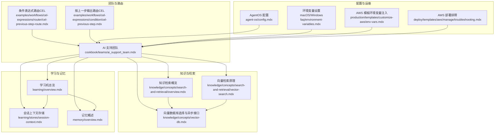
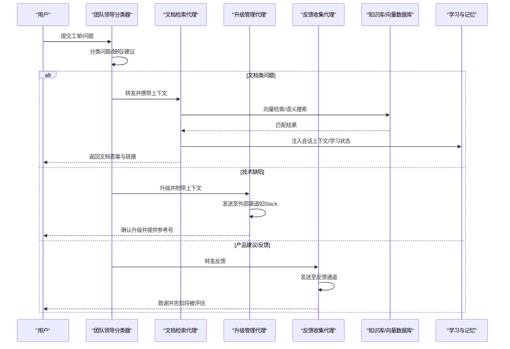
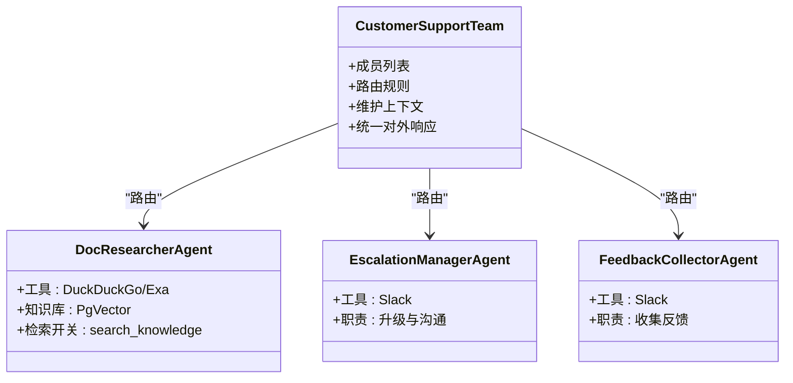
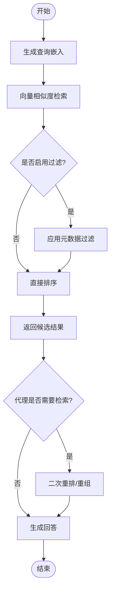
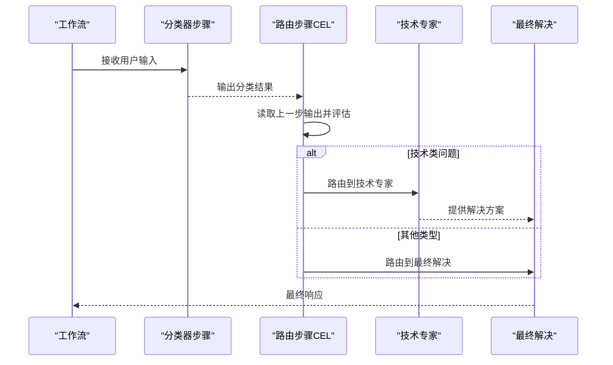
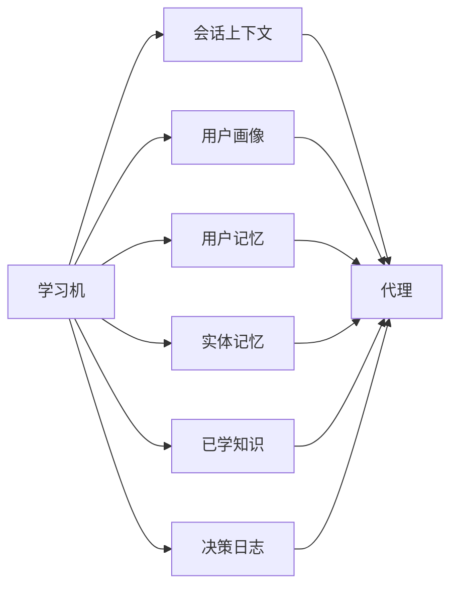
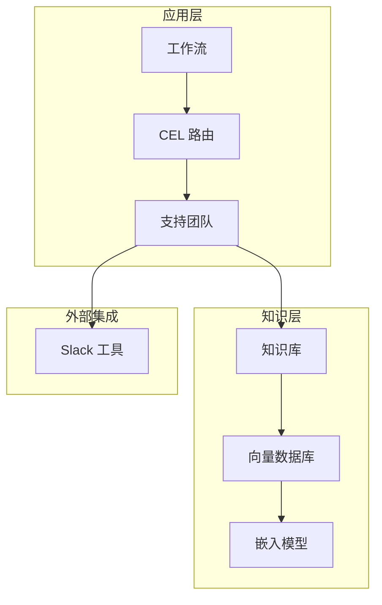

# 客户支持代理

<cite>
**本文引用的文件**
- [cookbook/teams/ai_support_team.mdx](file://cookbook/teams/ai_support_team.mdx)
- [history/workflow/multi-purpose-cli.mdx](file://history/workflow/multi-purpose-cli.mdx)
- [cookbook/learning/support-agent.mdx](file://cookbook/learning/support-agent.mdx)
- [knowledge/concepts/search-and-retrieval/overview.mdx](file://knowledge/concepts/search-and-retrieval/overview.mdx)
- [knowledge/concepts/search-and-retrieval/vector-search.mdx](file://knowledge/concepts/search-and-retrieval/vector-search.mdx)
- [knowledge/concepts/vector-db.mdx](file://knowledge/concepts/vector-db.mdx)
- [examples/workflows/cel-expressions/router/cel-previous-step-route.mdx](file://examples/workflows/cel-expressions/router/cel-previous-step-route.mdx)
- [examples/workflows/cel-expressions/condition/cel-previous-step.mdx](file://examples/workflows/cel-expressions/condition/cel-previous-step.mdx)
- [learning/overview.mdx](file://learning/overview.mdx)
- [learning/stores/session-context.mdx](file://learning/stores/session-context.mdx)
- [memory/overview.mdx](file://memory/overview.mdx)
- [agent-os/config.mdx](file://agent-os/config.mdx)
- [faq/environment-variables.mdx](file://faq/environment-variables.mdx)
- [production/templates/customize-aws/env-vars.mdx](file://production/templates/customize-aws/env-vars.mdx)
- [deploy/templates/aws/manage/troubleshooting.mdx](file://deploy/templates/aws/manage/troubleshooting.mdx)
</cite>

## 目录
1. [简介](#简介)
2. [项目结构](#项目结构)
3. [核心组件](#核心组件)
4. [架构总览](#架构总览)
5. [详细组件分析](#详细组件分析)
6. [依赖关系分析](#依赖关系分析)
7. [性能考量](#性能考量)
8. [故障排查指南](#故障排查指南)
9. [结论](#结论)
10. [附录](#附录)

## 简介
本技术文档面向客户支持代理，系统化阐述基于知识检索、智能路由与升级机制的工单解决系统。内容覆盖：
- 工单分类与升级决策流程
- 知识匹配与向量检索机制
- 多代理协作与会话上下文保持
- 配置指南（知识库、路由规则、响应时间优化）
- 实际场景示例与效率提升策略

## 项目结构
该仓库提供了完整的“智能客服”实现路径：从团队化多代理路由、到知识库向量检索、再到工作流式会话与学习增强。下图给出与本主题相关的核心文件与模块映射。

**图表来源**
- [cookbook/teams/ai_support_team.mdx:1-207](file://cookbook/teams/ai_support_team.mdx#L1-L207)
- [examples/workflows/cel-expressions/router/cel-previous-step-route.mdx:1-109](file://examples/workflows/cel-expressions/router/cel-previous-step-route.mdx#L1-L109)
- [examples/workflows/cel-expressions/condition/cel-previous-step.mdx:42-84](file://examples/workflows/cel-expressions/condition/cel-previous-step.mdx#L42-L84)
- [knowledge/concepts/search-and-retrieval/overview.mdx:99-152](file://knowledge/concepts/search-and-retrieval/overview.mdx#L99-L152)
- [knowledge/concepts/search-and-retrieval/vector-search.mdx:1-30](file://knowledge/concepts/search-and-retrieval/vector-search.mdx#L1-L30)
- [knowledge/concepts/vector-db.mdx:91-117](file://knowledge/concepts/vector-db.mdx#L91-L117)
- [learning/overview.mdx:1-112](file://learning/overview.mdx#L1-L112)
- [learning/stores/session-context.mdx:134-164](file://learning/stores/session-context.mdx#L134-L164)
- [memory/overview.mdx:1-27](file://memory/overview.mdx#L1-L27)
- [agent-os/config.mdx:18-213](file://agent-os/config.mdx#L18-L213)
- [faq/environment-variables.mdx:1-63](file://faq/environment-variables.mdx#L1-L63)
- [production/templates/customize-aws/env-vars.mdx:1-51](file://production/templates/customize-aws/env-vars.mdx#L1-L51)
- [deploy/templates/aws/manage/troubleshooting.mdx:1-50](file://deploy/templates/aws/manage/troubleshooting.mdx#L1-L50)

**章节来源**
- [cookbook/teams/ai_support_team.mdx:1-207](file://cookbook/teams/ai_support_team.mdx#L1-L207)
- [history/workflow/multi-purpose-cli.mdx:27-76](file://history/workflow/multi-purpose-cli.mdx#L27-L76)
- [knowledge/concepts/search-and-retrieval/overview.mdx:99-152](file://knowledge/concepts/search-and-retrieval/overview.mdx#L99-L152)
- [knowledge/concepts/search-and-retrieval/vector-search.mdx:1-30](file://knowledge/concepts/search-and-retrieval/vector-search.mdx#L1-L30)
- [knowledge/concepts/vector-db.mdx:91-117](file://knowledge/concepts/vector-db.mdx#L91-L117)
- [learning/overview.mdx:1-112](file://learning/overview.mdx#L1-L112)
- [learning/stores/session-context.mdx:134-164](file://learning/stores/session-context.mdx#L134-L164)
- [memory/overview.mdx:1-27](file://memory/overview.mdx#L1-L27)
- [agent-os/config.mdx:18-213](file://agent-os/config.mdx#L18-L213)
- [faq/environment-variables.mdx:1-63](file://faq/environment-variables.mdx#L1-L63)
- [production/templates/customize-aws/env-vars.mdx:1-51](file://production/templates/customize-aws/env-vars.mdx#L1-L51)
- [deploy/templates/aws/manage/troubleshooting.mdx:1-50](file://deploy/templates/aws/manage/troubleshooting.mdx#L1-L50)

## 核心组件
- 多代理支持团队：负责分类、文档检索、问题升级与反馈收集。
- 知识库与向量检索：基于嵌入模型与向量数据库，实现语义相似度检索与结果过滤。
- 工作流与会话上下文：通过步骤历史与学习存储，确保跨步骤的连续性与可审计性。
- 学习增强：用户画像、实体记忆、会话上下文与已学知识，持续优化响应质量。
- 路由与决策：基于输入或上一步输出的条件表达式进行动态路由与升级判断。

**章节来源**
- [cookbook/teams/ai_support_team.mdx:116-136](file://cookbook/teams/ai_support_team.mdx#L116-L136)
- [knowledge/concepts/search-and-retrieval/overview.mdx:99-152](file://knowledge/concepts/search-and-retrieval/overview.mdx#L99-L152)
- [history/workflow/multi-purpose-cli.mdx:66-76](file://history/workflow/multi-purpose-cli.mdx#L66-L76)
- [learning/overview.mdx:24-70](file://learning/overview.mdx#L24-L70)

## 架构总览
下图展示了“工单解决系统”的端到端交互：用户输入经由团队领导进行分类，随后路由至文档检索、问题升级或反馈收集；在每个环节中，系统结合知识库检索、会话上下文与学习存储，最终生成专业且可追溯的响应。

**图表来源**
- [cookbook/teams/ai_support_team.mdx:116-136](file://cookbook/teams/ai_support_team.mdx#L116-L136)
- [cookbook/teams/ai_support_team.mdx:62-96](file://cookbook/teams/ai_support_team.mdx#L62-L96)
- [knowledge/concepts/search-and-retrieval/overview.mdx:99-152](file://knowledge/concepts/search-and-retrieval/overview.mdx#L99-L152)

## 详细组件分析

### 组件一：多代理支持团队与路由
- 团队职责划分清晰：文档检索、问题升级、反馈收集。
- 团队领导负责三类问题的分类与路由，并维持上下文连贯。
- 可扩展为更多专业化代理，以应对不同工单类型。

**图表来源**
- [cookbook/teams/ai_support_team.mdx:116-136](file://cookbook/teams/ai_support_team.mdx#L116-L136)
- [cookbook/teams/ai_support_team.mdx:62-113](file://cookbook/teams/ai_support_team.mdx#L62-L113)

**章节来源**
- [cookbook/teams/ai_support_team.mdx:116-136](file://cookbook/teams/ai_support_team.mdx#L116-L136)
- [cookbook/teams/ai_support_team.mdx:62-113](file://cookbook/teams/ai_support_team.mdx#L62-L113)

### 组件二：知识检索与匹配机制
- 向量检索：查询嵌入与向量库相似度匹配，实现语义检索。
- 过滤与元数据：通过元数据过滤缩小范围，提升相关性。
- Agentic RAG：由代理自主决定是否检索、何时检索与如何组合结果。

**图表来源**
- [knowledge/concepts/search-and-retrieval/vector-search.mdx:1-30](file://knowledge/concepts/search-and-retrieval/vector-search.mdx#L1-L30)
- [knowledge/concepts/search-and-retrieval/overview.mdx:99-152](file://knowledge/concepts/search-and-retrieval/overview.mdx#L99-L152)

**章节来源**
- [knowledge/concepts/search-and-retrieval/vector-search.mdx:1-30](file://knowledge/concepts/search-and-retrieval/vector-search.mdx#L1-L30)
- [knowledge/concepts/search-and-retrieval/overview.mdx:99-152](file://knowledge/concepts/search-and-retrieval/overview.mdx#L99-L152)

### 组件三：升级决策与工作流
- 工作流步骤保留历史，确保跨步骤上下文连续。
- 条件表达式（CEL）可基于输入或上一步输出进行路由，实现自动化升级判断。
- 支持“紧急/非紧急”等维度的分支逻辑，保障关键问题优先处理。

**图表来源**
- [history/workflow/multi-purpose-cli.mdx:27-76](file://history/workflow/multi-purpose-cli.mdx#L27-L76)
- [examples/workflows/cel-expressions/router/cel-previous-step-route.mdx:65-84](file://examples/workflows/cel-expressions/router/cel-previous-step-route.mdx#L65-L84)
- [examples/workflows/cel-expressions/condition/cel-previous-step.mdx:59-74](file://examples/workflows/cel-expressions/condition/cel-previous-step.mdx#L59-L74)

**章节来源**
- [history/workflow/multi-purpose-cli.mdx:27-76](file://history/workflow/multi-purpose-cli.mdx#L27-L76)
- [examples/workflows/cel-expressions/router/cel-previous-step-route.mdx:65-84](file://examples/workflows/cel-expressions/router/cel-previous-step-route.mdx#L65-L84)
- [examples/workflows/cel-expressions/condition/cel-previous-step.mdx:59-74](file://examples/workflows/cel-expressions/condition/cel-previous-step.mdx#L59-L74)

### 组件四：学习与记忆增强
- 用户画像与实体记忆：记录用户特征与组织内实体信息，便于个性化与上下文理解。
- 会话上下文：跟踪目标、计划与进度，避免长对话丢失早期上下文。
- 决策日志：记录推理与决策过程，便于审计与复盘。

**图表来源**
- [learning/overview.mdx:24-70](file://learning/overview.mdx#L24-L70)
- [learning/stores/session-context.mdx:134-164](file://learning/stores/session-context.mdx#L134-L164)
- [memory/overview.mdx:1-27](file://memory/overview.mdx#L1-L27)

**章节来源**
- [learning/overview.mdx:24-70](file://learning/overview.mdx#L24-L70)
- [learning/stores/session-context.mdx:134-164](file://learning/stores/session-context.mdx#L134-L164)
- [memory/overview.mdx:1-27](file://memory/overview.mdx#L1-L27)

### 组件五：支持代理（学习型工单处理）
- 多租户命名空间隔离，组织间共享知识库。
- 针对同一工单，首次失败后成功解决会自动保存为“已学知识”，后续遇到类似问题可快速复用。
- 支持混合模式：用户画像与实体记忆常驻，会话上下文与已学知识按需学习。

**章节来源**
- [cookbook/learning/support-agent.mdx:42-88](file://cookbook/learning/support-agent.mdx#L42-L88)

## 依赖关系分析
- 知识库层：向量数据库（PgVector 等）提供检索能力；嵌入模型负责语义编码。
- 应用层：团队代理与工作流步骤依赖知识库检索与学习存储；外部工具（Slack）用于升级通知。
- 配置层：AgentOS 配置、环境变量与模板注入保证部署一致性与可观测性。

**图表来源**
- [cookbook/teams/ai_support_team.mdx:45-50](file://cookbook/teams/ai_support_team.mdx#L45-L50)
- [knowledge/concepts/vector-db.mdx:91-117](file://knowledge/concepts/vector-db.mdx#L91-L117)
- [examples/workflows/cel-expressions/router/cel-previous-step-route.mdx:65-84](file://examples/workflows/cel-expressions/router/cel-previous-step-route.mdx#L65-L84)

**章节来源**
- [cookbook/teams/ai_support_team.mdx:45-50](file://cookbook/teams/ai_support_team.mdx#L45-L50)
- [knowledge/concepts/vector-db.mdx:91-117](file://knowledge/concepts/vector-db.mdx#L91-L117)
- [examples/workflows/cel-expressions/router/cel-previous-step-route.mdx:65-84](file://examples/workflows/cel-expressions/router/cel-previous-step-route.mdx#L65-L84)

## 性能考量
- 向量检索异步化：使用异步插入与搜索方法，降低阻塞，提升吞吐。
- 过滤与分页：合理使用元数据过滤与分页参数，减少无关结果扫描。
- 学习存储开销：开启学习存储会带来额外写入成本，建议按需启用或采用批量写入。
- 数据库并发：生产环境避免多进程/多实例同时写入同一 SQLite 文件，推荐使用支持并发的数据库。

**章节来源**
- [knowledge/concepts/vector-db.mdx:108-117](file://knowledge/concepts/vector-db.mdx#L108-L117)
- [examples/evals/performance/overview.mdx:1-15](file://examples/evals/performance/overview.mdx#L1-L15)

## 故障排查指南
- 健康检查失败：确认应用健康端点可用，检查启动日志与环境变量。
- 数据库连接异常：核对主机、端口、用户名与密码，确保容器网络可达。
- 多实例并发写入冲突：避免多进程同时写入 DuckDB；必要时迁移至支持并发的数据库。
- 环境变量缺失：在 macOS/Windows 中正确导出所需密钥与配置。

**章节来源**
- [deploy/templates/aws/manage/troubleshooting.mdx:11-50](file://deploy/templates/aws/manage/troubleshooting.mdx#L11-L50)
- [faq/environment-variables.mdx:1-63](file://faq/environment-variables.mdx#L1-L63)
- [production/templates/customize-aws/env-vars.mdx:1-51](file://production/templates/customize-aws/env-vars.mdx#L1-L51)

## 结论
本系统通过“团队路由 + 知识检索 + 工作流上下文 + 学习增强”的组合，实现了高效率、可追踪、可扩展的工单解决闭环。配合 CEL 路由与多租户学习存储，可在复杂场景中稳定提升首次解决率与客户满意度。

## 附录

### 配置指南（知识库、升级规则、响应时间优化）
- 知识库设置
  - 选择向量数据库：本地开发可选 LanceDB/ChromaDB；生产推荐 PgVector 或托管服务。
  - 配置嵌入模型与检索类型（向量/混合），并为知识库添加元数据过滤字段。
- 升级规则配置
  - 使用 CEL 表达式根据输入或上一步输出进行分支路由，定义“紧急/技术/一般”等类别。
  - 在团队领导指令中明确升级流程与外部工具调用规范。
- 响应时间优化
  - 开启异步检索与插入，减少阻塞。
  - 合理使用过滤与分页，缩短检索链路。
  - 对学习存储采用批量写入与命名空间隔离，降低写放大。

**章节来源**
- [knowledge/concepts/vector-db.mdx:91-117](file://knowledge/concepts/vector-db.mdx#L91-L117)
- [examples/workflows/cel-expressions/router/cel-previous-step-route.mdx:65-84](file://examples/workflows/cel-expressions/router/cel-previous-step-route.mdx#L65-L84)
- [cookbook/teams/ai_support_team.mdx:116-136](file://cookbook/teams/ai_support_team.mdx#L116-L136)

### 实际场景示例
- 场景一：文档类问题
  - 输入：产品使用疑问
  - 流程：团队领导分类 → 文档检索代理检索知识库 → 返回答案与链接
- 场景二：技术缺陷
  - 输入：API 503 错误
  - 流程：团队领导分类 → 升级管理代理发送至 Slack → 确认升级并提供参考号
- 场景三：功能建议
  - 输入：新增 JSON Schema 支持请求
  - 流程：团队领导分类 → 反馈收集代理发送至反馈通道 → 致谢并告知评估

**章节来源**
- [cookbook/teams/ai_support_team.mdx:138-155](file://cookbook/teams/ai_support_team.mdx#L138-L155)
- [history/workflow/multi-purpose-cli.mdx:27-76](file://history/workflow/multi-purpose-cli.mdx#L27-L76)