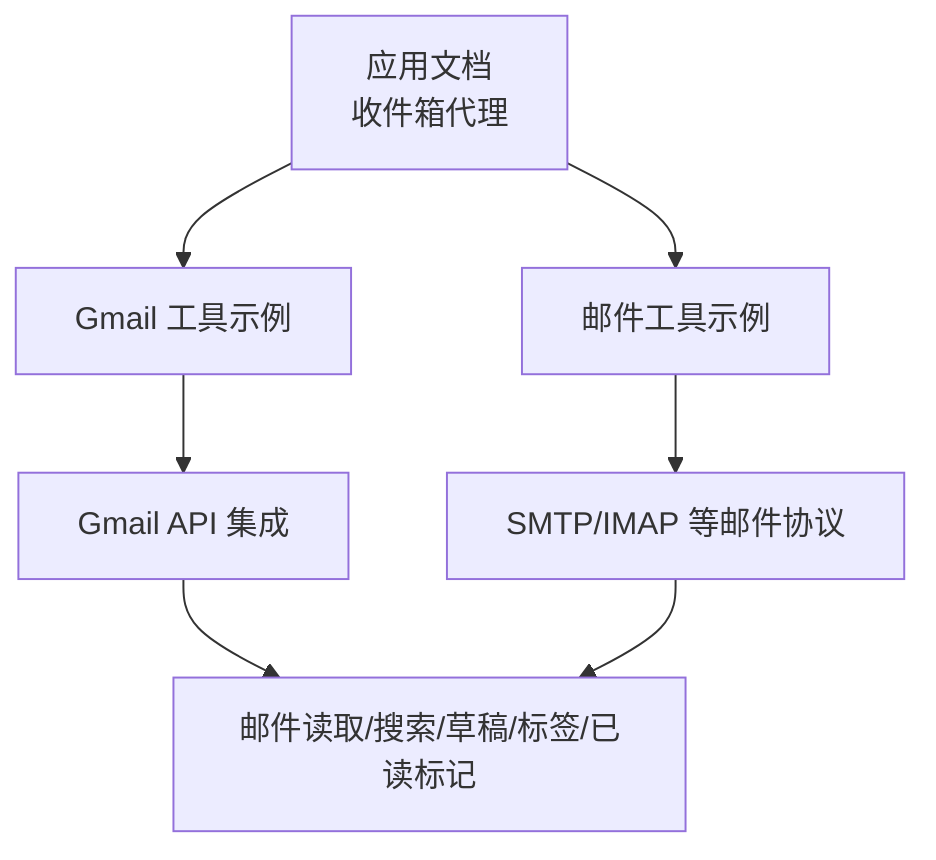
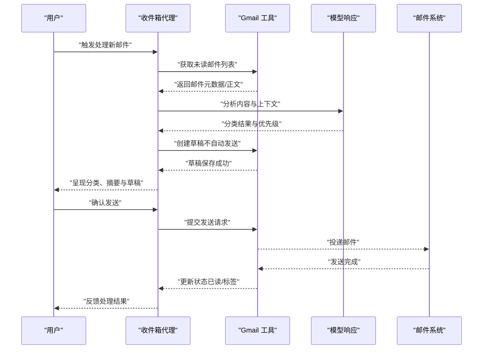
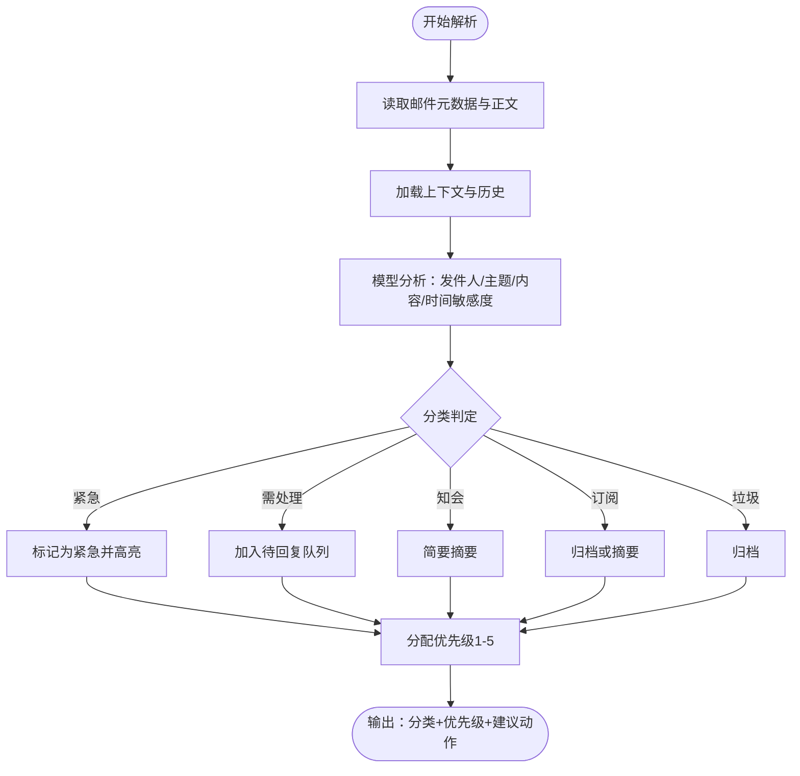
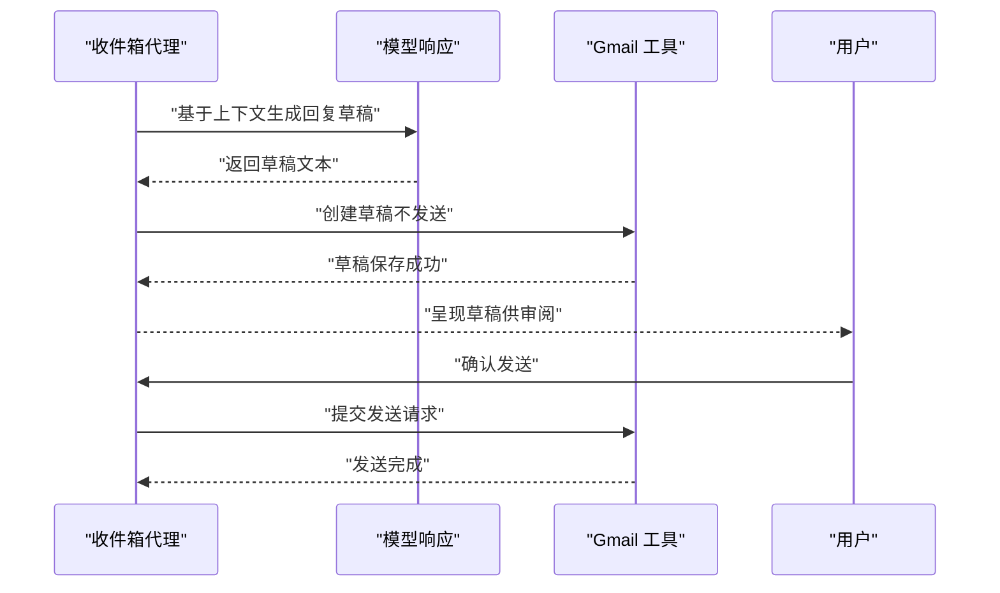
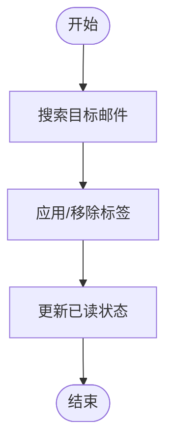
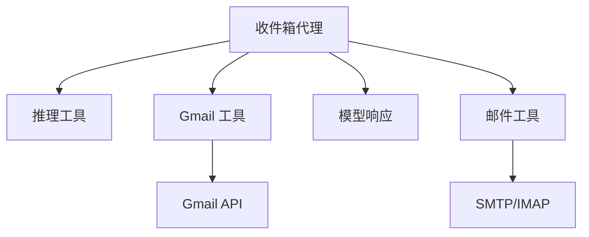

# 收件箱代理

<cite>
**本文引用的文件**
- [inbox-agent.mdx](file://production/applications/inbox-agent.mdx)
- [gmail-tools.mdx](file://examples/tools/gmail-tools.mdx)
- [email-tools.mdx](file://examples/tools/email-tools.mdx)
</cite>

## 目录
1. [简介](#简介)
2. [项目结构](#项目结构)
3. [核心组件](#核心组件)
4. [架构总览](#架构总览)
5. [详细组件分析](#详细组件分析)
6. [依赖关系分析](#依赖关系分析)
7. [性能考量](#性能考量)
8. [故障排查指南](#故障排查指南)
9. [结论](#结论)
10. [附录](#附录)

## 简介
本技术文档围绕“收件箱代理”展开，这是一个基于智能体（Agent）与 Gmail 工具链的邮件分流系统。其核心能力包括：
- 自动分类：根据发件人、主题、内容等特征将邮件分为紧急、需处理、知会、订阅、垃圾等类别，并赋予优先级等级（1-5）。
- 草拟回复：在理解上下文后生成草稿，确保语气与历史对话一致，且永不自动发送，必须经人工确认。
- 标记与归档：通过标签管理实现自动归档、提醒与后续追踪。
- 安全控制：无自动发送、只读默认、钓鱼检测提示等安全策略。

该系统以 Gmail API 为核心数据入口，结合推理工具与模型响应，形成从“读取—分析—决策—执行”的闭环。

## 项目结构
- 应用说明与使用指南位于生产应用文档中，涵盖关键概念、前置条件、安装步骤、示例命令与安全特性。
- 工具示例文档展示了 Gmail 工具的多种使用方式（只读、安全模式、标签管理、完整功能），并给出可运行示例。
- 邮件工具示例文档提供了通用 Email 工具的配置与调用方式，便于扩展到多协议场景。

图表来源
- [inbox-agent.mdx:1-195](file://production/applications/inbox-agent.mdx#L1-L195)
- [gmail-tools.mdx:1-183](file://examples/tools/gmail-tools.mdx#L1-L183)
- [email-tools.mdx:1-72](file://examples/tools/email-tools.mdx#L1-L72)

章节来源
- [inbox-agent.mdx:1-195](file://production/applications/inbox-agent.mdx#L1-L195)
- [gmail-tools.mdx:1-183](file://examples/tools/gmail-tools.mdx#L1-L183)
- [email-tools.mdx:1-72](file://examples/tools/email-tools.mdx#L1-L72)

## 核心组件
- 智能体（Agent）
  - 使用推理工具规划分流与回复策略。
  - 配置上下文（时间、历史、记忆）以提升理解与一致性。
  - 输出格式支持 Markdown，便于结构化呈现摘要与草稿。
- Gmail 工具（GmailTools）
  - 提供读取、搜索、草稿、回复、标签、已读标记等能力。
  - 支持按需包含/排除工具集，满足只读或安全模式。
- 邮件工具（EmailTools）
  - 支持 SMTP/IMAP 等协议的邮件发送与处理，便于多平台集成。
- 分类与优先级体系
  - 类别：紧急、需处理、知会、订阅、垃圾。
  - 优先级：1（立即）、2（24-48小时）、3（一周内）、4（信息性）、5（归档/跳过）。
- 安全控制
  - 草稿模式：永不自动发送；发送前需人工确认。
  - 只读默认：除非明确请求，否则不进行发送或修改操作。
  - 钓鱼检测：对可疑邮件发出警告提示。

章节来源
- [inbox-agent.mdx:127-195](file://production/applications/inbox-agent.mdx#L127-L195)
- [gmail-tools.mdx:27-110](file://examples/tools/gmail-tools.mdx#L27-L110)
- [email-tools.mdx:17-46](file://examples/tools/email-tools.mdx#L17-L46)

## 架构总览
下图展示了收件箱代理的整体工作流：从接收新邮件开始，经过读取、解析与分类，再到草拟回复与标签归档，最终以草稿形式交付给用户确认。

图表来源
- [inbox-agent.mdx:127-195](file://production/applications/inbox-agent.mdx#L127-L195)
- [gmail-tools.mdx:95-110](file://examples/tools/gmail-tools.mdx#L95-L110)

## 详细组件分析

### 组件一：邮件解析与分类决策机制
- 输入：未读邮件列表、线程上下文、历史交互记录。
- 处理：
  - 基于发件人信誉、主题关键词、时间敏感度、是否抄送等特征进行综合评分。
  - 结合历史对话与记忆，识别重复/延续话题，避免重复处理。
- 决策：
  - 分类映射：紧急、需处理、知会、订阅、垃圾。
  - 优先级映射：1-5 等级，决定处理时限与提醒策略。
- 输出：分类标签、优先级、建议动作（草稿、归档、忽略）。

图表来源
- [inbox-agent.mdx:156-175](file://production/applications/inbox-agent.mdx#L156-L175)

章节来源
- [inbox-agent.mdx:154-175](file://production/applications/inbox-agent.mdx#L154-L175)

### 组件二：自动化回复生成流程
- 触发：当分类为“需处理”时，进入回复草稿生成。
- 上下文：包含发件人、主题、历史对话、当前时间与截止日期（如适用）。
- 生成：模型根据语气风格、历史语调与礼貌程度生成初稿。
- 存储：以草稿形式保存至邮箱系统，不自动发送。
- 用户确认：用户审阅后选择发送或继续修改。

图表来源
- [inbox-agent.mdx:114-126](file://production/applications/inbox-agent.mdx#L114-L126)
- [gmail-tools.mdx:95-110](file://examples/tools/gmail-tools.mdx#L95-L110)

章节来源
- [inbox-agent.mdx:114-126](file://production/applications/inbox-agent.mdx#L114-L126)
- [gmail-tools.mdx:95-110](file://examples/tools/gmail-tools.mdx#L95-L110)

### 组件三：标签与归档策略
- 标签管理：支持列出、应用、移除、删除自定义标签。
- 归档策略：订阅类邮件可直接归档或生成摘要；垃圾邮件归档；紧急邮件附加“紧急”标签并高亮。
- 流程：先搜索目标邮件，再执行标签操作，最后更新已读状态。

图表来源
- [gmail-tools.mdx:68-93](file://examples/tools/gmail-tools.mdx#L68-L93)

章节来源
- [gmail-tools.mdx:68-93](file://examples/tools/gmail-tools.mdx#L68-L93)

### 组件四：安全与合规控制
- 草稿模式：所有回复均以草稿形式保存，禁止自动发送。
- 人工确认：发送前必须显式确认。
- 只读默认：除非明确授权，否则不执行发送或修改操作。
- 钓鱼检测：对可疑邮件发出警告，建议进一步验证。

章节来源
- [inbox-agent.mdx:188-194](file://production/applications/inbox-agent.mdx#L188-L194)

### 组件五：配置与参数详解
- 模型与工具
  - 模型：用于理解与生成的模型实例。
  - 工具：推理工具与 Gmail 工具组合。
- 上下文与记忆
  - 添加时间戳、历史记录、记忆启用、历史轮次数量。
- 输出与展示
  - Markdown 输出，便于结构化展示摘要与草稿。

章节来源
- [inbox-agent.mdx:127-145](file://production/applications/inbox-agent.mdx#L127-L145)

## 依赖关系分析
- 组件耦合
  - 收件箱代理依赖 Gmail 工具进行邮件读取、搜索、草稿与标签管理。
  - 推理工具与模型响应共同驱动分类与回复生成。
- 外部依赖
  - Gmail API：邮件读写与标签管理。
  - 邮件协议（SMTP/IMAP）：通过邮件工具实现多协议发送与处理。
- 安全边界
  - 工具集可按需包含/排除，确保最小权限原则。
  - 发送操作被严格限制在用户确认之后。

图表来源
- [inbox-agent.mdx:127-145](file://production/applications/inbox-agent.mdx#L127-L145)
- [gmail-tools.mdx:95-110](file://examples/tools/gmail-tools.mdx#L95-L110)
- [email-tools.mdx:22-46](file://examples/tools/email-tools.mdx#L22-L46)

章节来源
- [inbox-agent.mdx:127-145](file://production/applications/inbox-agent.mdx#L127-L145)
- [gmail-tools.mdx:95-110](file://examples/tools/gmail-tools.mdx#L95-L110)
- [email-tools.mdx:22-46](file://examples/tools/email-tools.mdx#L22-L46)

## 性能考量
- 批量处理：优先处理高优先级邮件，降低延迟；低优先级邮件可批量归档或摘要。
- 缓存与历史：利用历史与记忆减少重复解析成本，提升上下文一致性。
- 工具粒度：按需启用工具集，避免不必要的 API 调用。
- 并发与限流：合理安排轮询间隔与并发度，避免触发 Gmail API 速率限制。

## 故障排查指南
- 无法连接 Gmail
  - 检查 OAuth 凭据配置与网络连通性。
  - 确认工具集包含必要权限（读取、搜索、草稿、标签）。
- 草稿未发送
  - 系统默认草稿模式，需用户确认后发送。
  - 检查发送接口调用是否被阻断或权限不足。
- 标签未生效
  - 先搜索目标邮件，再应用标签；确认标签名称正确。
  - 检查是否误删或权限问题。
- 钓鱼警告频繁
  - 对可疑邮件进行二次验证，必要时手动标记或归档。

章节来源
- [inbox-agent.mdx:188-194](file://production/applications/inbox-agent.mdx#L188-L194)
- [gmail-tools.mdx:147-168](file://examples/tools/gmail-tools.mdx#L147-L168)

## 结论
收件箱代理通过“智能解析—分类决策—草稿生成—人工确认”的闭环，实现了高效、安全、可控的邮件分流与处理。借助 Gmail 工具与邮件工具，系统既满足日常办公需求，又具备扩展到多协议场景的能力。配合严格的安全部署策略与可配置的工具集，可在保障安全的前提下最大化提升邮件处理效率与准确性。

## 附录
- 实际处理示例
  - 获取邮件摘要：参考示例脚本路径，演示线程读取、要点提取与行动项识别。
  - 草拟回复：参考示例脚本路径，演示上下文感知的草稿生成与存储。
- 配置清单
  - 模型与工具：推理工具 + Gmail 工具。
  - 上下文：添加时间戳、历史记录、记忆启用、历史轮次。
  - 输出：Markdown 格式，便于结构化展示。

章节来源
- [inbox-agent.mdx:103-126](file://production/applications/inbox-agent.mdx#L103-L126)