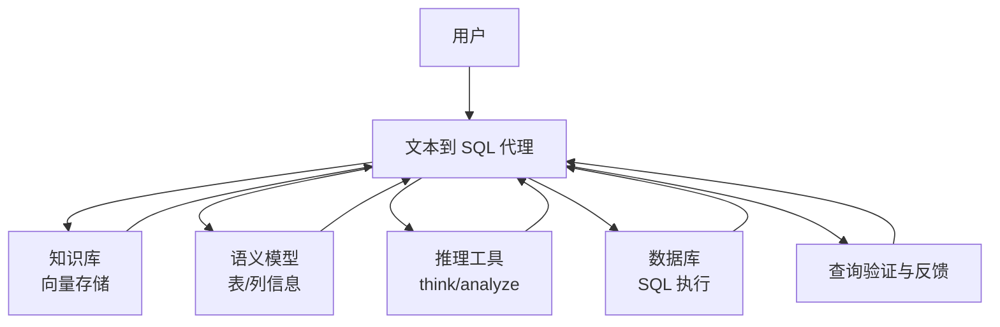
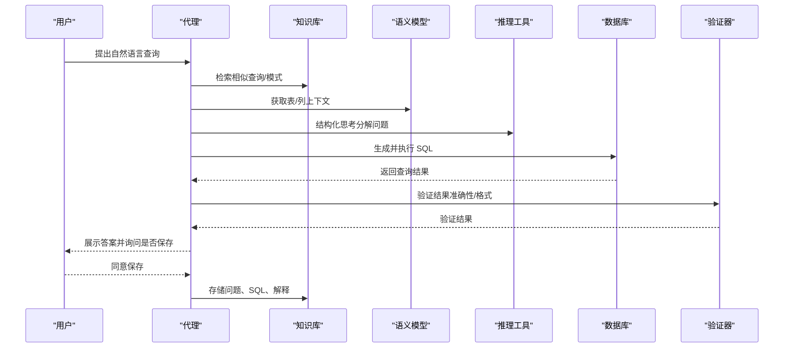
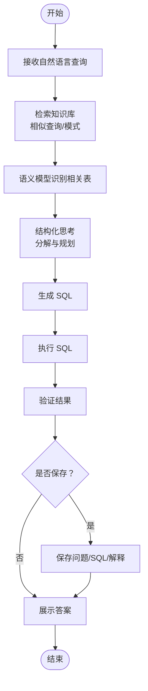
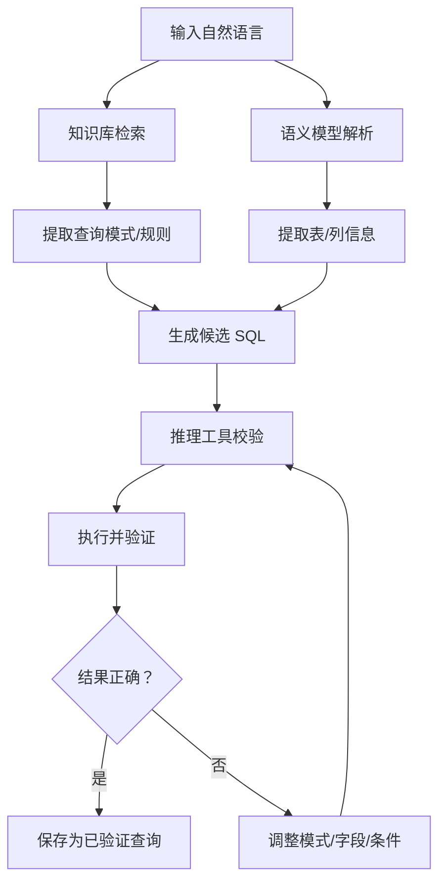
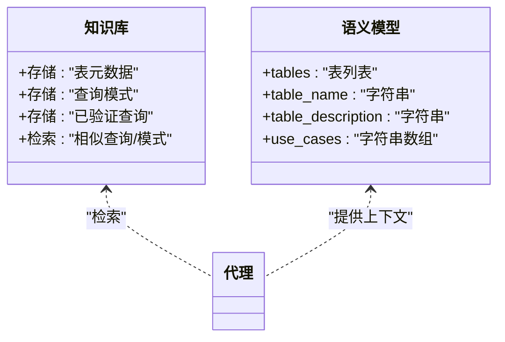
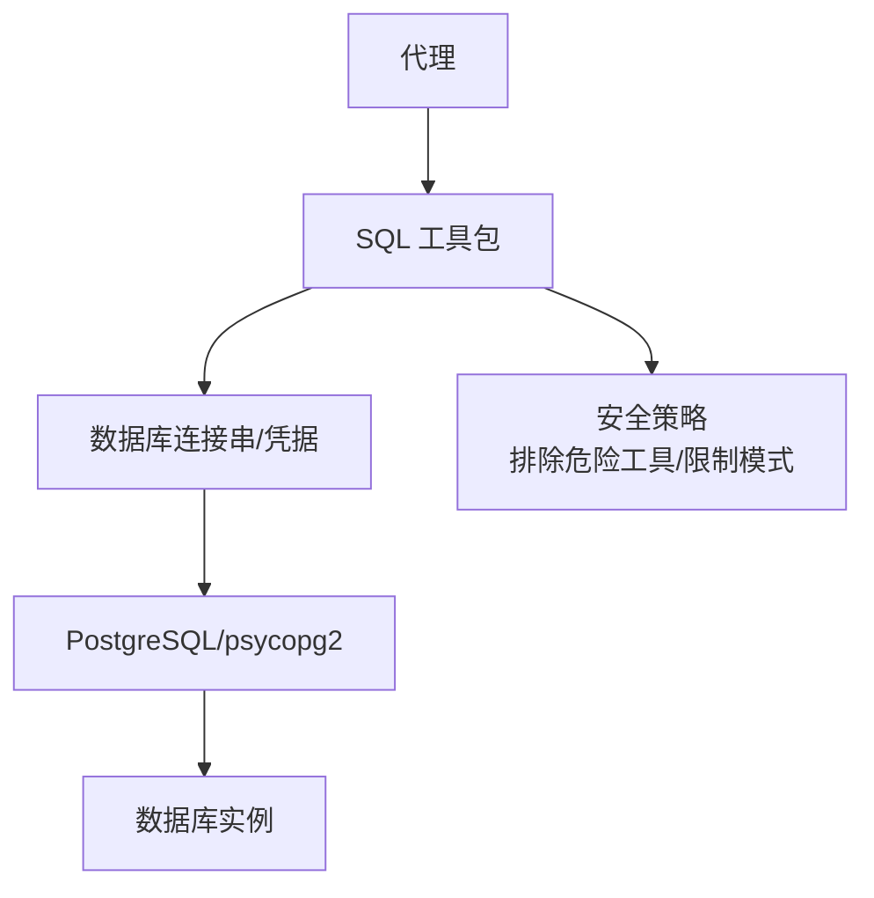
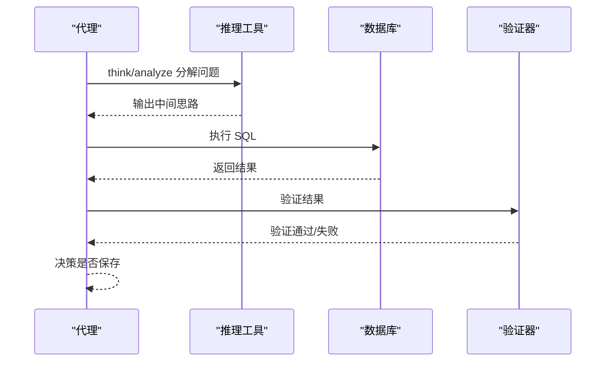
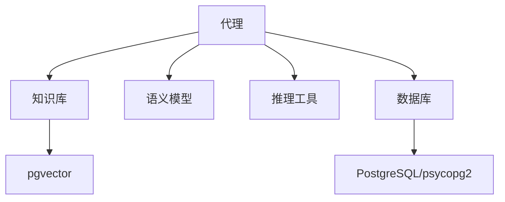

# 文本到 SQL 代理

<cite>
**本文引用的文件**
- [text-to-sql.mdx（生产应用）](file://production/applications/text-to-sql.mdx)
- [text-to-sql.mdx（Streamlit 示例）](file://cookbook/streamlit/text-to-sql.mdx)
- [SQL 工具包说明](file://tools/toolkits/database/sql.mdx)
- [Postgres 工具包示例](file://examples/tools/postgres-tools.mdx)
- [推理工具包说明](file://reference/reasoning/reasoning.mdx)
- [推理工具包用法](file://reasoning/reasoning-tools.mdx)
- [知识管理与最佳实践](file://agent-os/knowledge/manage-knowledge.mdx)
- [数据库连接与适配器](file://database/providers/postgres/overview.mdx)
- [数据库连接参数（内存型）](file://_snippets/db-in-memory-params.mdx)
</cite>

## 目录
1. [简介](#简介)
2. [项目结构](#项目结构)
3. [核心组件](#核心组件)
4. [架构总览](#架构总览)
5. [详细组件分析](#详细组件分析)
6. [依赖关系分析](#依赖关系分析)
7. [性能考虑](#性能考虑)
8. [故障排查指南](#故障排查指南)
9. [结论](#结论)
10. [附录](#附录)

## 简介
本技术文档面向“文本到 SQL 代理”的使用者与维护者，系统阐述该自学习 SQL 代理如何将自然语言查询转化为可执行 SQL，并通过“知识库检索 + 语义模型 + 自主学习循环”持续提升准确性。文档覆盖工作流、数据质量处理、学习机制、SQL 查询生成算法、复杂场景处理、配置指南、错误处理策略、部署与运维建议，以及最佳实践。

## 项目结构
该功能由以下关键部分组成：
- 代理主体：负责对话、思考、检索知识、调用工具、保存有效查询并进行结果验证
- 数据库层：通过 SQL 工具包连接数据库执行查询
- 知识库：向量数据库存储表元数据、查询模式与已验证查询
- 语义模型：定义可用表、列及用途，指导查询构造
- 推理工具：提供结构化思维工具，辅助逐步推理与校验
- 部署与运行：支持本地开发与容器化运行（如 PostgreSQL + pgvector）

图表来源
- [text-to-sql.mdx（生产应用）:179-227](file://production/applications/text-to-sql.mdx#L179-L227)
- [SQL 工具包说明:1-65](file://tools/toolkits/database/sql.mdx#L1-L65)
- [推理工具包说明:46-68](file://reference/reasoning/reasoning.mdx#L46-L68)

章节来源
- [text-to-sql.mdx（生产应用）:1-256](file://production/applications/text-to-sql.mdx#L1-L256)
- [text-to-sql.mdx（Streamlit 示例）:1-131](file://cookbook/streamlit/text-to-sql.mdx#L1-L131)

## 核心组件
- 代理（Agent）
  - 模型：用于自然语言理解与 SQL 生成
  - 工具链：SQL 执行工具、推理工具、保存有效查询的自定义工具
  - 上下文增强：时间戳、历史会话、工具调用历史
  - 记忆：跨会话记住用户偏好
- 知识库（Knowledge Base）
  - 存储三类信息：表元数据、查询模式、已验证查询
  - 支持检索相似问题与模式，减少重复思考
- 语义模型（Semantic Model）
  - 提供高阶上下文：表名、描述、典型用例
  - 帮助识别相关表与字段，避免误用
- 数据库（DB）
  - 通过 SQL 工具包连接目标数据库执行查询
  - 可按需排除危险操作或限制模式
- 推理工具（ReasoningTools）
  - 结构化思维：think/analyze，辅助逐步推理与校验
  - 可自动注入默认说明与少量示例

章节来源
- [text-to-sql.mdx（生产应用）:142-201](file://production/applications/text-to-sql.mdx#L142-L201)
- [推理工具包说明:46-68](file://reference/reasoning/reasoning.mdx#L46-L68)
- [推理工具包用法:317-345](file://reasoning/reasoning-tools.mdx#L317-L345)
- [SQL 工具包说明:1-65](file://tools/toolkits/database/sql.mdx#L1-L65)

## 架构总览
文本到 SQL 的端到端流程如下：

图表来源
- [text-to-sql.mdx（生产应用）:179-227](file://production/applications/text-to-sql.mdx#L179-L227)

## 详细组件分析

### 组件一：查询工作流与自学习循环
- 工作流步骤
  1) 用户提问
  2) 代理检索知识库获取相似查询/模式
  3) 代理基于语义模型识别相关表
  4) 代理构建并执行 SQL
  5) 代理验证结果并呈现答案
  6) 代理询问是否保存该查询以供未来复用
- 自学习循环
  - 成功执行后，用户确认保存，代理将问题、SQL 与解释存入知识库
  - 未来相似问题可直接检索到该模式，提高准确率与一致性

图表来源
- [text-to-sql.mdx（生产应用）:179-227](file://production/applications/text-to-sql.mdx#L179-L227)

章节来源
- [text-to-sql.mdx（生产应用）:179-227](file://production/applications/text-to-sql.mdx#L179-L227)

### 组件二：SQL 查询生成算法与数据质量处理
- 算法要点
  - 先检索再生成：优先从知识库获取模式与样例，降低偏差
  - 语义驱动：结合语义模型中的表/列信息，确保字段使用正确
  - 推理前置：通过推理工具进行多步思考，避免一次性复杂联接导致的错误
- 数据质量处理
  - 不清洗脏数据：代理学会处理混合类型、日期格式、命名不一致等
  - 类型安全：根据列类型选择合适的比较方式（如字符串 vs 整数）
  - 复杂联接：通过推理工具逐步拆解，先小步验证再合并

图表来源
- [text-to-sql.mdx（生产应用）:192-227](file://production/applications/text-to-sql.mdx#L192-L227)
- [SQL 工具包说明:1-65](file://tools/toolkits/database/sql.mdx#L1-L65)

章节来源
- [text-to-sql.mdx（生产应用）:192-227](file://production/applications/text-to-sql.mdx#L192-L227)
- [SQL 工具包说明:1-65](file://tools/toolkits/database/sql.mdx#L1-L65)

### 组件三：知识库与语义模型
- 知识库内容
  - 表元数据：列名、类型、描述
  - 查询模式：常见聚合、过滤、联接的模板
  - 已验证查询：经用户确认的成功案例
- 语义模型
  - 定义可用表、用途与典型场景，辅助代理快速定位相关表

图表来源
- [text-to-sql.mdx（生产应用）:192-219](file://production/applications/text-to-sql.mdx#L192-L219)

章节来源
- [text-to-sql.mdx（生产应用）:192-219](file://production/applications/text-to-sql.mdx#L192-L219)

### 组件四：数据库连接与工具
- 连接方式
  - 使用 SQL 工具包连接数据库，支持多种适配器（如 PostgreSQL 的 psycopg2）
  - 可通过环境变量或参数传入连接串
- 安全与限制
  - 可按需排除危险工具（如直接执行查询），或限定模式/表范围
- 运行环境
  - 可使用 Docker 快速启动 PostgreSQL + pgvector

图表来源
- [SQL 工具包说明:1-65](file://tools/toolkits/database/sql.mdx#L1-L65)
- [Postgres 工具包示例:52-92](file://examples/tools/postgres-tools.mdx#L52-L92)

章节来源
- [SQL 工具包说明:1-65](file://tools/toolkits/database/sql.mdx#L1-L65)
- [Postgres 工具包示例:52-92](file://examples/tools/postgres-tools.mdx#L52-L92)

### 组件五：推理与验证
- 推理工具
  - think/analyze 辅助逐步分解问题、迭代修正
  - 可自动注入默认说明与少量示例，加速上手
- 验证策略
  - 对返回结果进行格式与业务逻辑校验
  - 将成功案例加入知识库，形成正反馈闭环

图表来源
- [推理工具包说明:46-68](file://reference/reasoning/reasoning.mdx#L46-L68)
- [推理工具包用法:317-345](file://reasoning/reasoning-tools.mdx#L317-L345)

章节来源
- [推理工具包说明:46-68](file://reference/reasoning/reasoning.mdx#L46-L68)
- [推理工具包用法:317-345](file://reasoning/reasoning-tools.mdx#L317-L345)

## 依赖关系分析
- 组件耦合
  - 代理与知识库、语义模型强耦合，用于检索与上下文
  - 代理与数据库弱耦合，通过 SQL 工具包抽象访问
  - 代理与推理工具松耦合，按需启用
- 外部依赖
  - 数据库：PostgreSQL（推荐）、MySQL 等
  - 向量数据库：pgvector（示例中使用）
  - 大模型：OpenAI（示例中使用 gpt-5.2）

图表来源
- [text-to-sql.mdx（生产应用）:142-178](file://production/applications/text-to-sql.mdx#L142-L178)
- [SQL 工具包说明:1-65](file://tools/toolkits/database/sql.mdx#L1-L65)

章节来源
- [text-to-sql.mdx（生产应用）:142-178](file://production/applications/text-to-sql.mdx#L142-L178)
- [SQL 工具包说明:1-65](file://tools/toolkits/database/sql.mdx#L1-L65)

## 性能考虑
- 知识库检索
  - 合理设计嵌入维度与索引，控制检索延迟
  - 对高频查询建立查询模式缓存，减少重复检索
- 查询生成
  - 利用语义模型与检索到的模式，减少一次性复杂 SQL 的尝试次数
  - 通过推理工具分步执行，降低单次失败成本
- 数据库执行
  - 优先使用索引列作为过滤条件
  - 控制返回行数与列数，避免大结果集传输
- 并发与资源
  - 在容器化部署时，合理配置数据库连接池与并发度
  - 监控向量数据库与大模型调用的吞吐与延迟

## 故障排查指南
- 数据库连接失败
  - 确认 PostgreSQL 容器正在运行
  - 检查连接串、用户名、密码与端口
- 查询结果异常
  - 检查列类型（如 position 为 TEXT，需字符串比较）
  - 使用推理工具逐步验证中间步骤
- 知识库未生效
  - 确认已加载知识库
  - 检查向量表是否存在且已嵌入
- 安全与权限
  - 如需限制危险操作，使用工具包的排除/限制参数
- 代理记忆与上下文
  - 确认启用了 agentic memory 与历史上下文参数

章节来源
- [text-to-sql.mdx（生产应用）:228-254](file://production/applications/text-to-sql.mdx#L228-L254)
- [Postgres 工具包示例:52-92](file://examples/tools/postgres-tools.mdx#L52-L92)
- [知识管理与最佳实践:104-128](file://agent-os/knowledge/manage-knowledge.mdx#L104-L128)

## 结论
该文本到 SQL 代理通过“知识库检索 + 语义模型 + 推理工具 + 自主学习循环”，在不清洗脏数据的前提下，持续提升 SQL 生成的准确性与稳定性。其模块化设计便于扩展到不同数据库与知识库方案，适合在生产环境中进行定制化部署与维护。

## 附录

### 配置清单与参数说明
- 代理配置要点
  - 模型：用于理解与生成（示例中使用 gpt-5.2）
  - 数据库：PostgreSQL 连接（含主机、端口、库名、用户、密码）
  - 知识库：向量数据库（pgvector 示例）
  - 工具：SQL 执行工具、推理工具、保存有效查询的自定义工具
  - 上下文：开启时间戳、历史会话、工具调用历史
  - 记忆：启用跨会话记忆
- 数据库连接参数（示例）
  - 主机、端口、数据库名、用户、密码、模式等
- 知识库参数（示例）
  - 知识库表名、向量维度、索引类型等

章节来源
- [text-to-sql.mdx（生产应用）:142-178](file://production/applications/text-to-sql.mdx#L142-L178)
- [SQL 工具包说明:1-65](file://tools/toolkits/database/sql.mdx#L1-L65)
- [数据库连接与适配器](file://database/providers/postgres/overview.mdx)
- [数据库连接参数（内存型）:1-8](file://_snippets/db-in-memory-params.mdx#L1-L8)

### 使用示例与最佳实践
- 示例路径
  - 基础查询示例：见“生产应用”页面中的命令行示例
  - 自主学习循环示例：见“生产应用”页面中的命令行示例
  - 边界与复杂场景：见“生产应用”页面中的命令行示例
  - Streamlit 交互式示例：见“Streamlit 示例”页面
- 最佳实践
  - 将知识库按领域拆分，定期更新
  - 使用推理工具进行多步验证
  - 对危险操作进行限制或隔离
  - 在容器化环境中统一管理数据库与向量数据库

章节来源
- [text-to-sql.mdx（生产应用）:102-140](file://production/applications/text-to-sql.mdx#L102-L140)
- [text-to-sql.mdx（Streamlit 示例）:46-128](file://cookbook/streamlit/text-to-sql.mdx#L46-L128)