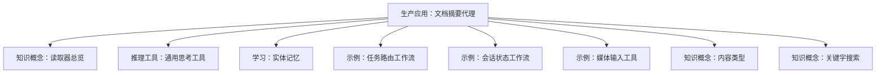
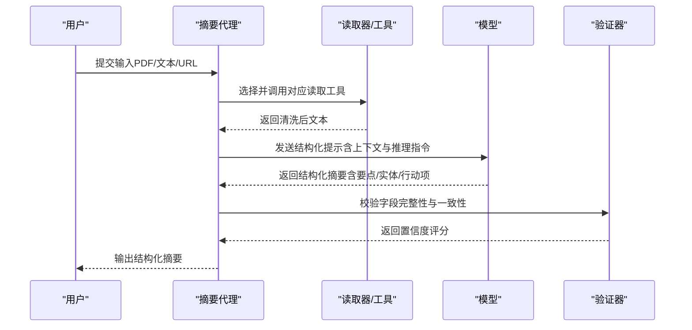
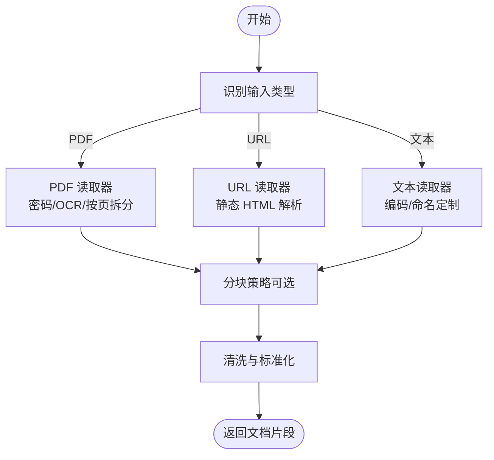
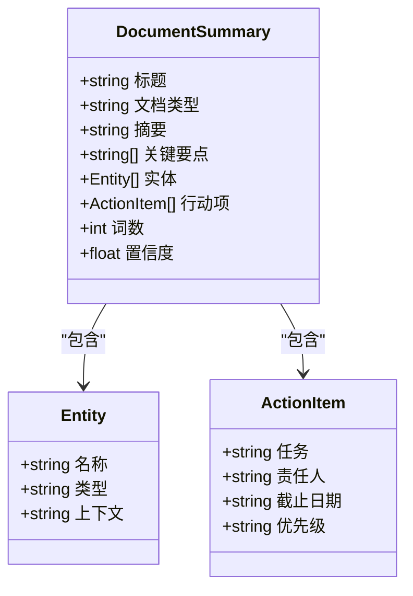
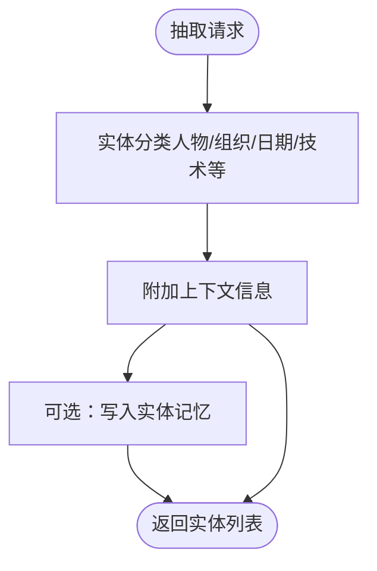
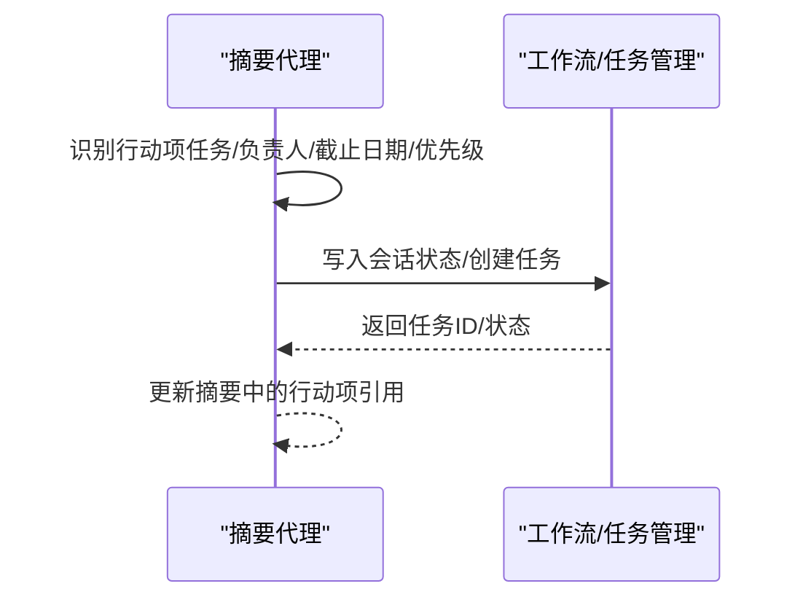
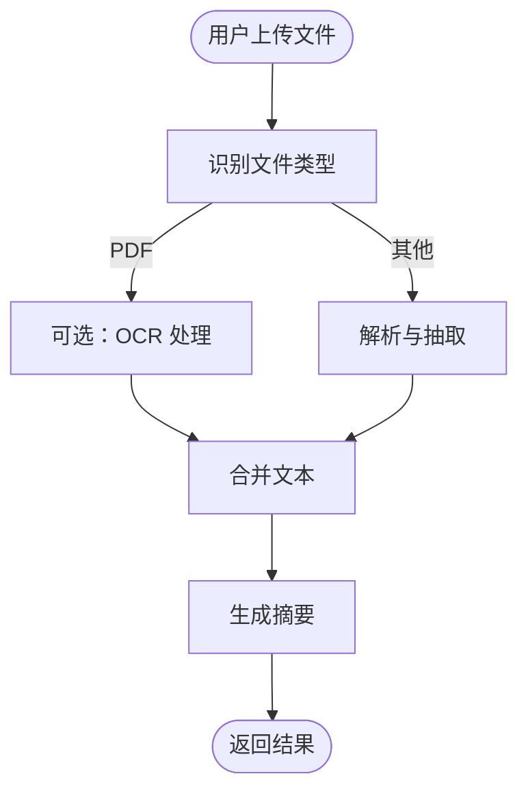
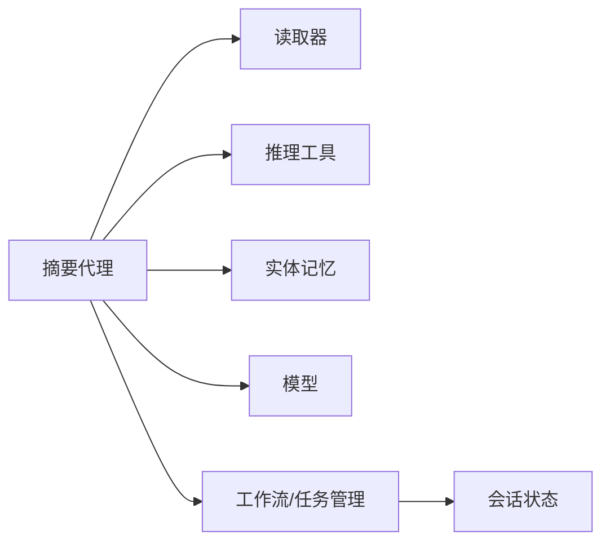

# 文档摘要代理

<cite>
**本文引用的文件**
- [生产应用：文档摘要代理](file://production/applications/document-summarizer.mdx)
- [部署应用：文档摘要代理](file://deploy/apps/agents/document-summarizer.mdx)
- [知识概念：读取器总览](file://knowledge/concepts/readers/overview.mdx)
- [知识概念：内容类型](file://knowledge/concepts/content-types.mdx)
- [推理工具：通用思考工具](file://reasoning/reasoning-tools.mdx)
- [学习：实体记忆](file://learning/stores/entity-memory.mdx)
- [示例：任务路由（工作流）](file://examples/workflows/advanced-concepts/session-state/state-in-router.mdx)
- [示例：会话状态（工作流）](file://examples/workflows/advanced-concepts/session-state/state-with-team.mdx)
- [示例：媒体输入（工具）](file://examples/agents/multimodal/media-input-for-tool.mdx)
- [知识概念：关键字搜索](file://knowledge/concepts/search-and-retrieval/keyword-search.mdx)
</cite>

## 目录
1. [简介](#简介)
2. [项目结构](#项目结构)
3. [核心组件](#核心组件)
4. [架构总览](#架构总览)
5. [详细组件分析](#详细组件分析)
6. [依赖关系分析](#依赖关系分析)
7. [性能考量](#性能考量)
8. [故障排查指南](#故障排查指南)
9. [结论](#结论)
10. [附录](#附录)

## 简介
本技术文档围绕“文档摘要代理”展开，系统性说明该结构化摘要生成器的功能与实现方式，包括关键要点抽取、实体识别与分类、行动项检测、摘要算法与内容分析技术、输出格式化流程，以及可配置参数（摘要长度、关键词策略、实体识别设置等）。文档还提供多种使用场景与示例，覆盖 PDF、文本、网页等多种输入源，并给出针对不同业务需求的参数调优建议。

## 项目结构
该仓库中与“文档摘要代理”直接相关的内容主要集中在以下位置：
- 生产应用文档：提供代理概述、运行步骤、配置说明与故障排查
- 部署应用文档：提供部署与上线相关信息
- 知识与读取器：提供内容读取、分块、向量化与检索的基础能力
- 推理工具：提供“先思考再行动”的规划能力，辅助摘要与抽取
- 实体记忆：提供长期实体知识存储与召回能力
- 示例：任务路由与会话状态管理，体现行动项与任务清单的落地实践
- 多模态示例：演示文件上传与文本抽取流程

**图表来源**
- [生产应用：文档摘要代理:1-184](file://production/applications/document-summarizer.mdx#L1-L184)
- [知识概念：读取器总览:1-180](file://knowledge/concepts/readers/overview.mdx#L1-L180)
- [推理工具：通用思考工具:22-253](file://reasoning/reasoning-tools.mdx#L22-L253)
- [学习：实体记忆:1-52](file://learning/stores/entity-memory.mdx#L1-L52)
- [示例：任务路由（工作流）:178-399](file://examples/workflows/advanced-concepts/session-state/state-in-router.mdx#L178-L399)
- [示例：会话状态（工作流）:178-256](file://examples/workflows/advanced-concepts/session-state/state-with-team.mdx#L178-L256)
- [示例：媒体输入（工具）:76-119](file://examples/agents/multimodal/media-input-for-tool.mdx#L76-L119)
- [知识概念：内容类型:1-61](file://knowledge/concepts/content-types.mdx#L1-L61)
- [知识概念：关键字搜索:1-37](file://knowledge/concepts/search-and-retrieval/keyword-search.mdx#L1-L37)

**章节来源**
- [生产应用：文档摘要代理:1-184](file://production/applications/document-summarizer.mdx#L1-L184)
- [部署应用：文档摘要代理:1-9](file://deploy/apps/agents/document-summarizer.mdx#L1-L9)

## 核心组件
- 摘要代理（Agent）
  - 使用结构化输出模式（Pydantic 模型），确保输出字段一致且可验证
  - 支持多源输入：PDF、文本、URL
  - 内置推理工具，用于在抽取前制定计划
  - 可选启用历史上下文与时间信息，增强上下文理解
- 输出模式（DocumentSummary）
  - 字段包含标题、文档类型、摘要、关键要点、实体列表、行动项列表、词数统计、置信度
- 工具链
  - PDF/文本/URL 读取工具
  - 推理工具（思考与分析）
  - 可选：实体记忆（学习模块）

**章节来源**
- [生产应用：文档摘要代理:99-153](file://production/applications/document-summarizer.mdx#L99-L153)
- [知识概念：读取器总览:33-80](file://knowledge/concepts/readers/overview.mdx#L33-L80)
- [推理工具：通用思考工具:22-69](file://reasoning/reasoning-tools.mdx#L22-L69)
- [学习：实体记忆:1-52](file://learning/stores/entity-memory.mdx#L1-L52)

## 架构总览
下图展示了从输入到结构化输出的整体流程，涵盖内容读取、结构分析、抽取与验证等阶段。

**图表来源**
- [生产应用：文档摘要代理:128-153](file://production/applications/document-summarizer.mdx#L128-L153)
- [知识概念：读取器总览:16-31](file://knowledge/concepts/readers/overview.mdx#L16-L31)
- [推理工具：通用思考工具:238-253](file://reasoning/reasoning-tools.mdx#L238-L253)

## 详细组件分析

### 组件一：内容读取与预处理
- 功能
  - 自动识别输入类型（PDF、URL、文本）
  - 调用对应读取器进行解析与清洗
  - 可配置分块策略以适配不同规模文档
- 关键点
  - PDF：支持密码、图像 OCR、按页拆分
  - URL：静态 HTML 抓取（如需 JS 渲染，建议使用专用抓取工具）
  - 文本：编码与命名可定制
- 性能与可靠性
  - 异步批量读取提升吞吐
  - 错误返回空列表，便于上层容错

**图表来源**
- [知识概念：读取器总览:83-153](file://knowledge/concepts/readers/overview.mdx#L83-L153)
- [知识概念：内容类型:21-41](file://knowledge/concepts/content-types.mdx#L21-L41)

**章节来源**
- [知识概念：读取器总览:1-180](file://knowledge/concepts/readers/overview.mdx#L1-L180)
- [知识概念：内容类型:1-61](file://knowledge/concepts/content-types.mdx#L1-L61)

### 组件二：结构化摘要生成与验证
- 功能
  - 基于模型生成结构化摘要（标题、类型、摘要、要点、实体、行动项、词数、置信度）
  - 使用推理工具进行“先思考再行动”，提升抽取质量
  - 可选启用历史上下文与时间信息，增强一致性
- 输出模式
  - DocumentSummary：Pydantic 模型定义字段与约束
- 验证
  - 字段完整性校验
  - 置信度评分用于质量评估

**图表来源**
- [生产应用：文档摘要代理:141-153](file://production/applications/document-summarizer.mdx#L141-L153)

**章节来源**
- [生产应用：文档摘要代理:99-153](file://production/applications/document-summarizer.mdx#L99-L153)
- [推理工具：通用思考工具:22-69](file://reasoning/reasoning-tools.mdx#L22-L69)

### 组件三：实体识别与分类
- 功能
  - 识别并分类实体（人物、组织、日期、技术等）
  - 可结合实体记忆进行长期存储与召回
- 应用
  - 在摘要中保留关键实体上下文
  - 作为后续检索与关联的基础

**图表来源**
- [学习：实体记忆:1-52](file://learning/stores/entity-memory.mdx#L1-L52)
- [生产应用：文档摘要代理:141-153](file://production/applications/document-summarizer.mdx#L141-L153)

**章节来源**
- [学习：实体记忆:1-52](file://learning/stores/entity-memory.mdx#L1-L52)

### 组件四：行动项检测与任务管理
- 功能
  - 从文档中识别任务、负责人、截止日期、优先级等
  - 将行动项映射到工作流或外部系统（如任务管理平台）
- 实践
  - 结合会话状态与路由逻辑，将行动项转化为可执行的任务清单

**图表来源**
- [示例：任务路由（工作流）:178-399](file://examples/workflows/advanced-concepts/session-state/state-in-router.mdx#L178-L399)
- [示例：会话状态（工作流）:178-256](file://examples/workflows/advanced-concepts/session-state/state-with-team.mdx#L178-L256)

**章节来源**
- [示例：任务路由（工作流）:178-399](file://examples/workflows/advanced-concepts/session-state/state-in-router.mdx#L178-L399)
- [示例：会话状态（工作流）:178-256](file://examples/workflows/advanced-concepts/session-state/state-with-team.mdx#L178-L256)

### 组件五：多模态输入与文件处理
- 功能
  - 支持上传文件（如 PDF），进行文本抽取与摘要
  - 可选开启媒体存储与调试模式
- 场景
  - 本地文件上传、远程资源抓取、OCR 辅助

**图表来源**
- [示例：媒体输入（工具）:76-119](file://examples/agents/multimodal/media-input-for-tool.mdx#L76-L119)

**章节来源**
- [示例：媒体输入（工具）:76-119](file://examples/agents/multimodal/media-input-for-tool.mdx#L76-L119)

## 依赖关系分析
- 摘要代理依赖
  - 读取器：负责内容解析与分块
  - 推理工具：用于规划与验证
  - 实体记忆：可选的长期知识存储
  - 模型：提供结构化生成能力
- 工作流与任务管理
  - 通过会话状态维护任务清单
  - 路由逻辑根据关键词选择不同处理分支

**图表来源**
- [生产应用：文档摘要代理:99-153](file://production/applications/document-summarizer.mdx#L99-L153)
- [知识概念：读取器总览:1-180](file://knowledge/concepts/readers/overview.mdx#L1-L180)
- [推理工具：通用思考工具:22-69](file://reasoning/reasoning-tools.mdx#L22-L69)
- [学习：实体记忆:1-52](file://learning/stores/entity-memory.mdx#L1-L52)
- [示例：任务路由（工作流）:178-399](file://examples/workflows/advanced-concepts/session-state/state-in-router.mdx#L178-L399)

**章节来源**
- [生产应用：文档摘要代理:99-153](file://production/applications/document-summarizer.mdx#L99-L153)
- [知识概念：读取器总览:1-180](file://knowledge/concepts/readers/overview.mdx#L1-L180)
- [推理工具：通用思考工具:22-69](file://reasoning/reasoning-tools.mdx#L22-L69)
- [学习：实体记忆:1-52](file://learning/stores/entity-memory.mdx#L1-L52)
- [示例：任务路由（工作流）:178-399](file://examples/workflows/advanced-concepts/session-state/state-in-router.mdx#L178-L399)

## 性能考量
- 并行与异步
  - 批量读取采用异步接口，提升 I/O 密集场景吞吐
- 分块策略
  - 合理设置分块大小与策略，平衡语义完整性与检索效率
- 模型与提示
  - 使用推理工具进行“先思考再行动”，减少无效工具调用
  - 控制上下文长度，避免超出上下文窗口
- 输出验证
  - 通过结构化模式与置信度评分，降低下游处理成本

[本节为通用指导，不直接分析具体文件]

## 故障排查指南
- PDF 提取为空
  - 原因：扫描版 PDF（无文字）
  - 建议：改用具备视觉能力的工具或先 OCR
- 网页内容不完整
  - 原因：JavaScript 渲染页面
  - 建议：使用更强大的抓取工具或预渲染
- 置信度低
  - 原因：文档质量差、内容模糊、缺少上下文
  - 建议：人工复核并补充背景信息

**章节来源**
- [生产应用：文档摘要代理:165-177](file://production/applications/document-summarizer.mdx#L165-L177)

## 结论
“文档摘要代理”通过结构化输出、多源读取、推理规划与实体记忆等能力，实现了对 PDF、文本与网页的高质量摘要生成，并能抽取关键要点、识别实体与行动项。结合工作流与会话状态，可进一步将行动项转化为可执行任务，满足企业知识管理与任务协作的实际需求。通过合理配置分块策略、上下文与模型参数，可在准确性与性能之间取得良好平衡。

[本节为总结性内容，不直接分析具体文件]

## 附录

### 配置选项与参数建议
- 摘要长度控制
  - 通过输出模式中的摘要字段长度与要点数量控制摘要密度
- 关键词提取策略
  - 可在提示工程中加入关键词提取指令，或结合知识库的关键字检索策略
- 实体识别设置
  - 通过实体记忆配置与分类规则，提升实体召回与稳定性
- 上下文增强
  - 启用历史上下文与时间信息，有助于跨轮次一致性与语境理解

**章节来源**
- [生产应用：文档摘要代理:99-153](file://production/applications/document-summarizer.mdx#L99-L153)
- [知识概念：关键字搜索:1-37](file://knowledge/concepts/search-and-retrieval/keyword-search.mdx#L1-L37)
- [学习：实体记忆:1-52](file://learning/stores/entity-memory.mdx#L1-L52)

### 使用场景与示例
- 场景一：会议纪要转任务
  - 输入：会议录音/文字稿
  - 步骤：转录 → 行动项抽取 → 映射责任人 → 创建任务
  - 参考：工作流与会话状态示例
- 场景二：研究报告结构化摘要
  - 输入：PDF/网页文章
  - 步骤：读取 → 分块 → 摘要生成 → 实体标注 → 行动项识别
  - 参考：摘要代理配置与输出模式
- 场景三：多模态文件处理
  - 输入：上传的 PDF/图片
  - 步骤：文件识别 → OCR/解析 → 摘要与实体抽取
  - 参考：多模态输入示例

**章节来源**
- [示例：任务路由（工作流）:178-399](file://examples/workflows/advanced-concepts/session-state/state-in-router.mdx#L178-L399)
- [示例：会话状态（工作流）:178-256](file://examples/workflows/advanced-concepts/session-state/state-with-team.mdx#L178-L256)
- [示例：媒体输入（工具）:76-119](file://examples/agents/multimodal/media-input-for-tool.mdx#L76-L119)
- [生产应用：文档摘要代理:99-153](file://production/applications/document-summarizer.mdx#L99-L153)