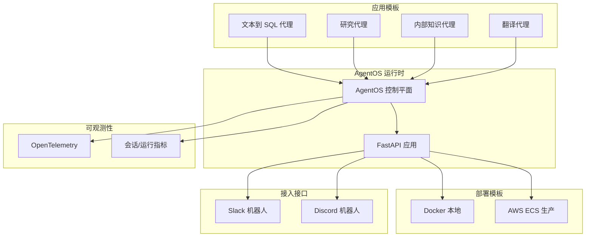
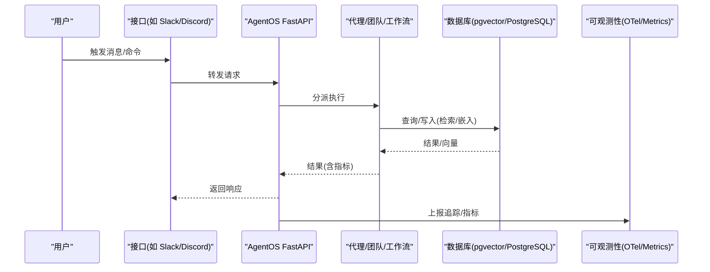
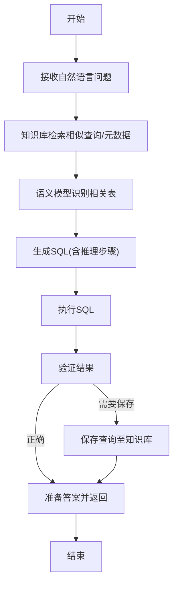
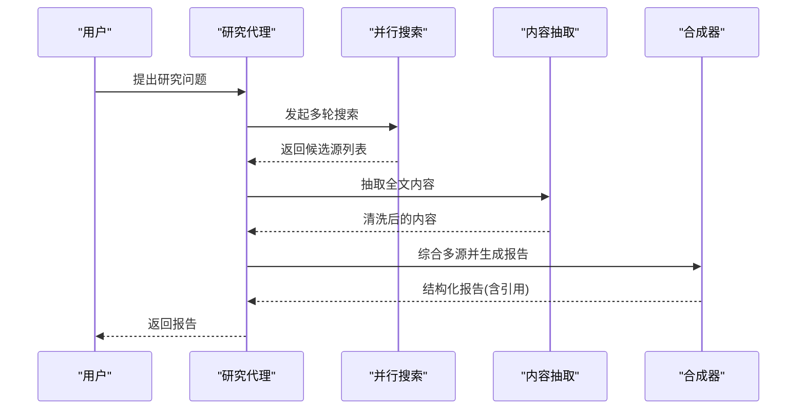
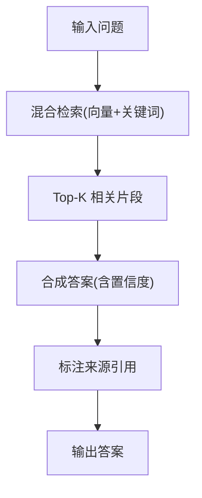
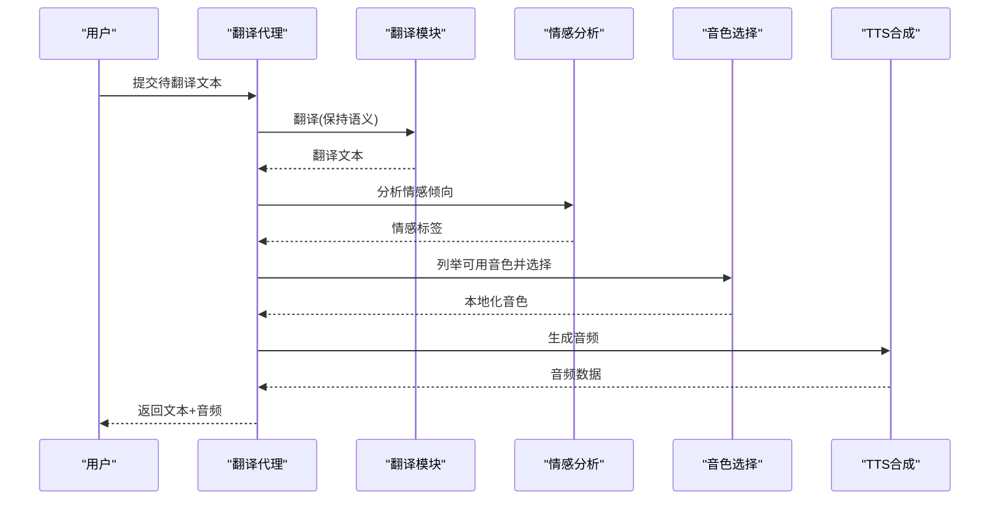
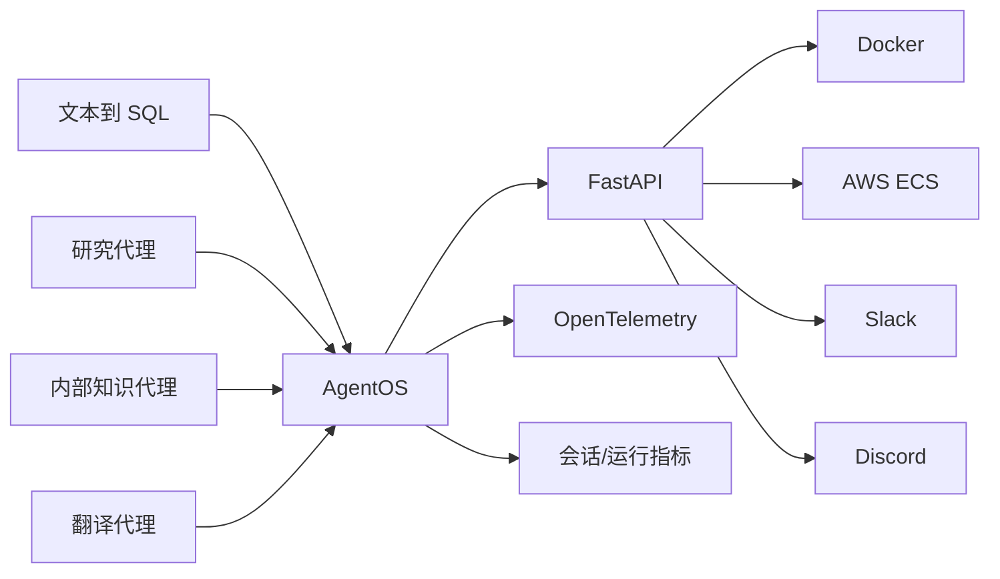

# 生产应用程序

<cite>
**本文引用的文件**
- [text-to-sql.mdx](file://production/applications/text-to-sql.mdx)
- [research-agent.mdx](file://production/applications/research-agent.mdx)
- [knowledge-agent.mdx](file://production/applications/knowledge-agent.mdx)
- [translation-agent.mdx](file://production/applications/translation-agent.mdx)
- [aws.mdx](file://production/templates/aws.mdx)
- [docker.mdx](file://production/templates/docker.mdx)
- [slack.mdx](file://production/interfaces/slack.mdx)
- [discord.mdx](file://production/interfaces/discord.mdx)
- [overview.mdx](file://agent-os/overview.mdx)
- [run-your-os.mdx](file://agent-os/run-your-os.mdx)
- [overview.mdx](file://observability/overview.mdx)
- [agent.mdx](file://sessions/metrics/agent.mdx)
</cite>

## 目录
1. [简介](#简介)
2. [项目结构](#项目结构)
3. [核心组件](#核心组件)
4. [架构总览](#架构总览)
5. [详细组件分析](#详细组件分析)
6. [依赖关系分析](#依赖关系分析)
7. [性能考虑](#性能考虑)
8. [故障排查指南](#故障排查指南)
9. [结论](#结论)
10. [附录](#附录)

## 简介
本文件面向生产环境，系统化梳理并说明基于 AgentOS 的各类“生产就绪”应用模板与场景，包括：
- 文本到 SQL 代理：具备知识驱动的查询生成、数据质量处理与自学习循环
- 研究代理：使用并行搜索与多源合成，输出带引用的研究报告
- 内部知识代理：RAG 驱动的企业内部知识问答，支持混合检索与不确定性处理
- 翻译代理：情感感知翻译与本地化语音合成
- 接入接口：Slack 与 Discord 机器人快速落地
- 部署模板：Docker 本地与 AWS ECS 生产级部署
- 运行时与可观测性：AgentOS 控制平面、指标采集与监控

目标是帮助读者从“功能特性—配置要求—部署流程—定制指南—运维监控”的全链路掌握如何在生产中稳定交付智能体应用。

## 项目结构
围绕“应用模板 + 运行时 + 部署模板 + 接入接口 + 可观测性”的组织方式，形成清晰的分层与职责边界：
- 应用模板：面向具体业务场景（文本到 SQL、研究、知识、翻译）
- 运行时：AgentOS 将代理、团队、工作流封装为可服务的 API
- 部署模板：Docker 本地与 AWS ECS 生产级基础设施
- 接入接口：Slack、Discord 等即时通讯平台的机器人集成
- 可观测性：OpenTelemetry 集成与会话/运行指标采集

图示来源
- [overview.mdx:1-86](file://agent-os/overview.mdx#L1-L86)
- [docker.mdx:1-164](file://production/templates/docker.mdx#L1-L164)
- [aws.mdx:1-210](file://production/templates/aws.mdx#L1-L210)
- [slack.mdx:1-143](file://production/interfaces/slack.mdx#L1-L143)
- [discord.mdx:1-116](file://production/interfaces/discord.mdx#L1-L116)
- [overview.mdx:1-25](file://observability/overview.mdx#L1-L25)

章节来源
- [overview.mdx:1-86](file://agent-os/overview.mdx#L1-L86)
- [docker.mdx:1-164](file://production/templates/docker.mdx#L1-L164)
- [aws.mdx:1-210](file://production/templates/aws.mdx#L1-L210)
- [slack.mdx:1-143](file://production/interfaces/slack.mdx#L1-L143)
- [discord.mdx:1-116](file://production/interfaces/discord.mdx#L1-L116)
- [overview.mdx:1-25](file://observability/overview.mdx#L1-L25)

## 核心组件
- 文本到 SQL 代理：以知识库驱动查询生成，结合语义模型与自学习存储，提升复杂查询与数据不一致场景下的鲁棒性
- 研究代理：通过并行搜索与内容抽取，实现多源合成与引用追踪
- 内部知识代理：混合检索（向量+关键词）增强召回，明确不确定性处理策略
- 翻译代理：情感分析 + 语音选择 + 本地化克隆 + TTS 输出
- AgentOS 运行时：统一注册与托管代理、团队、工作流，暴露 FastAPI 接口，支持追踪与安全控制
- 部署模板：Docker 本地开发验证；AWS ECS 生产级编排（ECS Fargate、RDS、ALB、Secrets Manager）
- 接入接口：Slack 事件订阅 + ngrok 开发；Discord 直连 Gateway + 持续运行
- 可观测性：OpenTelemetry 自动注入与导出，会话/运行指标用于资源与性能分析

章节来源
- [text-to-sql.mdx:1-261](file://production/applications/text-to-sql.mdx#L1-L261)
- [research-agent.mdx:1-187](file://production/applications/research-agent.mdx#L1-L187)
- [knowledge-agent.mdx:1-226](file://production/applications/knowledge-agent.mdx#L1-L226)
- [translation-agent.mdx:1-199](file://production/applications/translation-agent.mdx#L1-L199)
- [overview.mdx:1-86](file://agent-os/overview.mdx#L1-L86)
- [docker.mdx:1-164](file://production/templates/docker.mdx#L1-L164)
- [aws.mdx:1-210](file://production/templates/aws.mdx#L1-L210)
- [slack.mdx:1-143](file://production/interfaces/slack.mdx#L1-L143)
- [discord.mdx:1-116](file://production/interfaces/discord.mdx#L1-L116)
- [overview.mdx:1-25](file://observability/overview.mdx#L1-L25)

## 架构总览
下图展示典型生产路径：应用模板在 AgentOS 中注册，经由 FastAPI 对外提供 API，部署于 Docker 或 AWS ECS，并通过 Slack/Discord 等接口接入用户；同时借助 OpenTelemetry 与会话指标进行监控与优化。

图示来源
- [overview.mdx:1-86](file://agent-os/overview.mdx#L1-L86)
- [docker.mdx:1-164](file://production/templates/docker.mdx#L1-L164)
- [aws.mdx:1-210](file://production/templates/aws.mdx#L1-L210)
- [slack.mdx:1-143](file://production/interfaces/slack.mdx#L1-L143)
- [discord.mdx:1-116](file://production/interfaces/discord.mdx#L1-L116)
- [overview.mdx:1-25](file://observability/overview.mdx#L1-L25)

## 详细组件分析

### 文本到 SQL 代理
- 功能特性
  - 知识驱动的查询生成：检索相似查询与表元数据，确保一致性
  - 数据质量处理：容忍类型混用、日期格式差异、命名约定不一致
  - 自学习循环：保存经用户验证的查询，提升未来回答质量
  - 会话记忆：跨轮次保留偏好与上下文
- 配置要点
  - 使用 PostgreSQL + pgvector 存储知识库与向量
  - 通过工具集提供 SQL 执行、推理规划与查询持久化
  - 启用知识检索与历史上下文，提升准确性
- 部署流程
  - 安装依赖、设置 API 密钥、启动数据库容器、加载示例数据与知识
  - 提供基础查询、自学习循环与边缘用例的演示脚本
- 定制指南
  - 替换或扩展语义模型中的表元数据
  - 调整知识库最大结果数与检索类型
  - 增加自定义工具以适配业务数据库方言
- 故障排查
  - 数据库连接失败：确认容器运行状态与端口映射
  - 结果异常：检查列类型（如字符串比较 vs 数值比较）
  - 知识库缺失：重新加载知识库脚本

图示来源
- [text-to-sql.mdx:179-227](file://production/applications/text-to-sql.mdx#L179-L227)

章节来源
- [text-to-sql.mdx:1-261](file://production/applications/text-to-sql.mdx#L1-L261)

### 研究代理
- 功能特性
  - 并行 AI 优化搜索：高覆盖、高质量候选源
  - 内容抽取与可信度评估：筛选权威来源
  - 多源合成与引用追踪：生成结构化报告
- 配置要点
  - 工具：并行搜索与内容抽取
  - 输出模式：结构化报告（字段明确）
  - 历史上下文与推理工具：提升研究深度
- 部署流程
  - 设置并行 API 密钥与模型密钥
  - 快速/深度/对比式研究示例脚本
- 定制指南
  - 调整搜索结果上限与迭代深度
  - 扩展可信度评分维度与来源分类
- 故障排查
  - API 密钥未设置：检查环境变量
  - 结果稀少：查看“缺口”字段并调整搜索策略
  - 矛盾信息：记录置信度并双引证双方来源

图示来源
- [research-agent.mdx:134-146](file://production/applications/research-agent.mdx#L134-L146)

章节来源
- [research-agent.mdx:1-187](file://production/applications/research-agent.mdx#L1-L187)

### 内部知识代理
- 功能特性
  - RAG + 混合检索：向量相似 + 关键词 BM25
  - 不确定性处理：无法匹配时明确告知、引导澄清
  - 引用溯源：每条回答附带来源
- 配置要点
  - 知识库：PgVector + 混合检索 + 嵌入器
  - 工具：推理规划
  - 上下文：历史对话与时间信息
- 部署流程
  - 安装依赖、启动数据库、加载示例知识
  - 基础问答、多轮对话与边缘情况示例
- 定制指南
  - 扩展知识库文档类型与质量
  - 调整检索阈值与结果数量
- 故障排查
  - 数据库不可达：确认容器与网络
  - 无结果：检查知识库是否加载
  - 回答质量低：补充或优化知识内容

图示来源
- [knowledge-agent.mdx:144-154](file://production/applications/knowledge-agent.mdx#L144-L154)

章节来源
- [knowledge-agent.mdx:1-226](file://production/applications/knowledge-agent.mdx#L1-L226)

### 翻译代理
- 功能特性
  - 情感感知翻译：检测情绪并匹配合适音色
  - 本地化语音：按语言与情绪选择/克隆音色
  - 多语言支持：覆盖主流语言代码
- 部署流程
  - 获取并设置模型与 TTS 密钥
  - 基础翻译、情感内容与批量翻译示例
- 定制指南
  - 扩展情感-音色映射表
  - 调整音色可用性与本地化策略
- 故障排查
  - TTS 密钥错误：核对环境变量与用量限额
  - 语音不可用：回退到相近音色并本地化
  - 音频为空：检查响应对象中的音频内容字段

图示来源
- [translation-agent.mdx:132-146](file://production/applications/translation-agent.mdx#L132-L146)

章节来源
- [translation-agent.mdx:1-199](file://production/applications/translation-agent.mdx#L1-L199)

### 接入接口：Slack 机器人
- 快速集成：两行代码注册接口，即可在 Slack 中响应消息、加入频道、执行命令
- 开发流程：创建应用、配置权限与事件订阅、设置签名密钥、本地 ngrok 接入
- 生产建议：使用部署模板提供稳定域名与 HTTPS，避免 ngrok 仅限开发

章节来源
- [slack.mdx:1-143](file://production/interfaces/slack.mdx#L1-L143)

### 接入接口：Discord 机器人
- 快速集成：两行代码注册客户端，自动线程化对话并维持上下文
- 开发流程：创建应用与 Bot 用户、配置意图与权限、复制 Token、邀请 Bot 至服务器
- 生产建议：直接对接 Gateway，适合持续运行平台（Railway、Render、AWS EC2）

章节来源
- [discord.mdx:1-116](file://production/interfaces/discord.mdx#L1-L116)

### 部署模板：Docker 本地
- 一键本地运行：包含 AgentOS 与 PostgreSQL+pgvector，支持热重载
- 常用命令：启动/停止/重启容器、查看日志
- 云部署：可直接部署到任意支持 Docker 的云平台

章节来源
- [docker.mdx:1-164](file://production/templates/docker.mdx#L1-L164)

### 部署模板：AWS ECS 生产
- 基础设施：ECS Fargate、RDS PostgreSQL、ALB、ECR、Secrets Manager、安全组
- 部署流程：安装工具、创建代码库、设置密钥、本地验证、一键上线、连接控制面板
- 维护操作：更新部署、停止服务（注意数据备份）
- 成本估算：Fargate、RDS、LB 合计约 $65-100/月（以 US East 为例）

章节来源
- [aws.mdx:1-210](file://production/templates/aws.mdx#L1-L210)

### AgentOS 运行时与控制平面
- 核心能力：注册代理/团队/工作流，生成 FastAPI 应用，提供交互式 API 文档与配置查看
- 关键参数：数据库、追踪、知识库、接口、授权、MCP 服务器、CORS、生命周期钩子等
- 运行方法：获取应用实例并通过 serve 启动，支持主机、端口、工作进程与自动重载

章节来源
- [overview.mdx:1-86](file://agent-os/overview.mdx#L1-L86)
- [run-your-os.mdx:1-83](file://agent-os/run-your-os.mdx#L1-L83)

### 可观测性与指标
- OpenTelemetry 支持：自动注入、灵活导出、兼容主流平台
- 指标采集：消息级、运行级、会话级指标，便于资源与性能分析
- 实践建议：在生产中启用追踪与指标上报，结合告警策略

章节来源
- [overview.mdx:1-25](file://observability/overview.mdx#L1-L25)
- [agent.mdx:1-36](file://sessions/metrics/agent.mdx#L1-L36)

## 依赖关系分析
- 应用模板依赖 AgentOS 运行时，后者负责统一托管与对外服务
- 数据依赖：文本到 SQL 与内部知识代理依赖 PostgreSQL+pgvector
- 接口依赖：Slack 依赖事件订阅与签名校验；Discord 依赖 Gateway 与权限
- 可观测性依赖：OpenTelemetry 作为统一追踪与指标采集框架

图示来源
- [text-to-sql.mdx:1-261](file://production/applications/text-to-sql.mdx#L1-L261)
- [research-agent.mdx:1-187](file://production/applications/research-agent.mdx#L1-L187)
- [knowledge-agent.mdx:1-226](file://production/applications/knowledge-agent.mdx#L1-L226)
- [translation-agent.mdx:1-199](file://production/applications/translation-agent.mdx#L1-L199)
- [overview.mdx:1-86](file://agent-os/overview.mdx#L1-L86)
- [docker.mdx:1-164](file://production/templates/docker.mdx#L1-L164)
- [aws.mdx:1-210](file://production/templates/aws.mdx#L1-L210)
- [slack.mdx:1-143](file://production/interfaces/slack.mdx#L1-L143)
- [discord.mdx:1-116](file://production/interfaces/discord.mdx#L1-L116)
- [overview.mdx:1-25](file://observability/overview.mdx#L1-L25)

## 性能考虑
- 检索优化
  - 文本到 SQL：合理设置知识库最大结果数与检索类型，平衡召回与延迟
  - 内部知识代理：混合检索优于单一策略；调优嵌入器与向量维数
- 数据库优化
  - PostgreSQL + pgvector：索引与查询计划优化；连接池与超时配置
  - RDS：根据流量峰值选择合适规格；开启只读副本（如适用）
- 接口与并发
  - Slack/Discord：事件异步处理与队列化；限制单次响应长度与附件大小
- 模型与成本
  - 选择合适的模型与上下文窗口；对长对话启用压缩与摘要
- 指标与压测
  - 基于会话/运行指标进行容量规划；定期进行性能评估与回归测试

## 故障排查指南
- 文本到 SQL
  - 数据库连接失败：确认容器运行与端口映射
  - 结果异常：检查列类型与比较方式（字符串 vs 数值）
  - 知识库缺失：重新加载知识库脚本
- 研究代理
  - API 密钥未设置：检查环境变量
  - 结果稀少：查看“缺口”字段并调整搜索策略
  - 矛盾信息：记录置信度并双引证双方来源
- 内部知识代理
  - 数据库不可达：确认容器与网络
  - 无结果：检查知识库是否加载
  - 回答质量低：补充或优化知识内容
- 翻译代理
  - TTS 密钥错误：核对环境变量与用量限额
  - 语音不可用：回退到相近音色并本地化
  - 音频为空：检查响应对象中的音频内容字段
- Docker 本地
  - 端口冲突：修改 compose.yml 端口映射
  - 数据库未就绪：等待片刻后重试
- AWS ECS
  - RDS 未就绪：等待控制台状态变为可用
  - ECS 任务失败：查看 CloudWatch 日志（常见原因：环境变量缺失、数据库连接串错误）
  - ALB 503：等待健康检查通过（通常 2-3 分钟）

章节来源
- [text-to-sql.mdx:228-254](file://production/applications/text-to-sql.mdx#L228-L254)
- [research-agent.mdx:164-180](file://production/applications/research-agent.mdx#L164-L180)
- [knowledge-agent.mdx:201-220](file://production/applications/knowledge-agent.mdx#L201-L220)
- [translation-agent.mdx:173-193](file://production/applications/translation-agent.mdx#L173-L193)
- [docker.mdx:153-163](file://production/templates/docker.mdx#L153-L163)
- [aws.mdx:194-209](file://production/templates/aws.mdx#L194-L209)

## 结论
通过“应用模板 + AgentOS 运行时 + 部署模板 + 接入接口 + 可观测性”的完整体系，可以高效地将多种业务场景的智能体应用落地到生产环境。建议在设计阶段即明确数据与检索策略、接口与并发模型、安全与密钥管理、以及可观测性与性能基线，从而在保障稳定性的同时持续优化用户体验与业务价值。

## 附录
- 快速开始
  - 在本地运行 AgentOS：参考运行文档，20 行代码即可启动
  - Docker 本地验证：一键启动容器，访问交互式 API 文档
  - AWS 生产部署：一键创建基础设施，连接控制面板
- 参考链接
  - AgentOS 类与方法参考
  - OpenTelemetry 与指标采集文档
  - Slack/Discord 接口与部署模板

章节来源
- [run-your-os.mdx:1-83](file://agent-os/run-your-os.mdx#L1-L83)
- [docker.mdx:1-164](file://production/templates/docker.mdx#L1-L164)
- [aws.mdx:1-210](file://production/templates/aws.mdx#L1-L210)
- [overview.mdx:1-25](file://observability/overview.mdx#L1-L25)