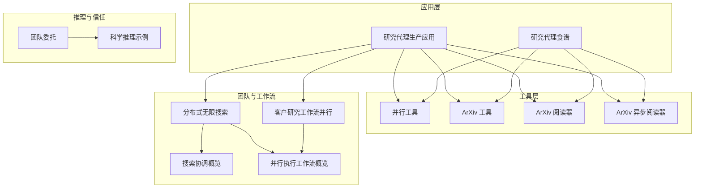
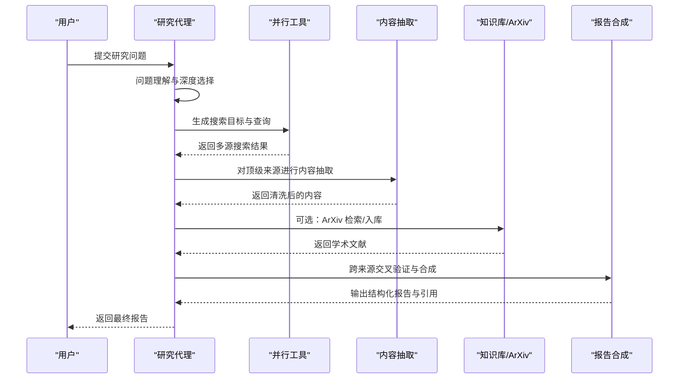
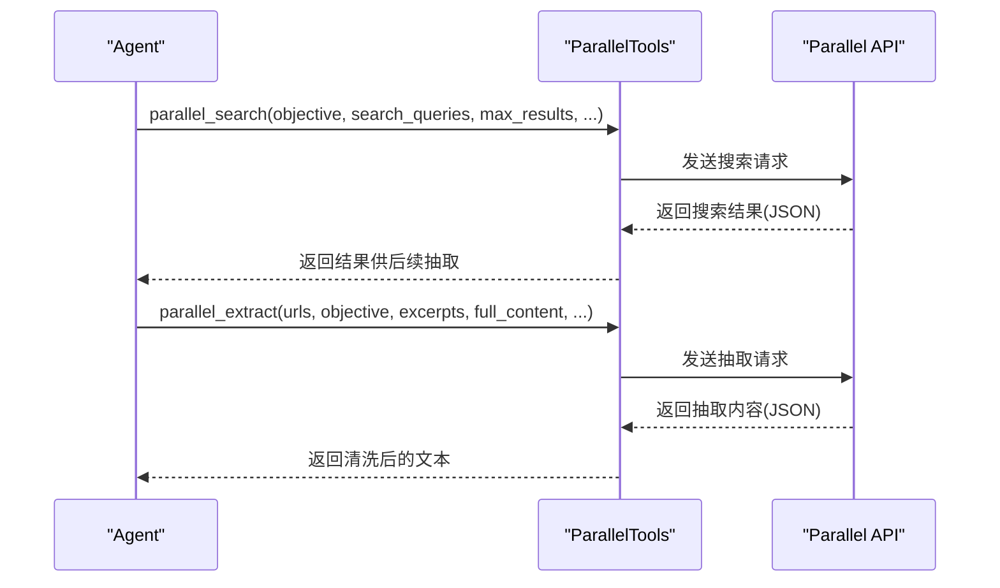
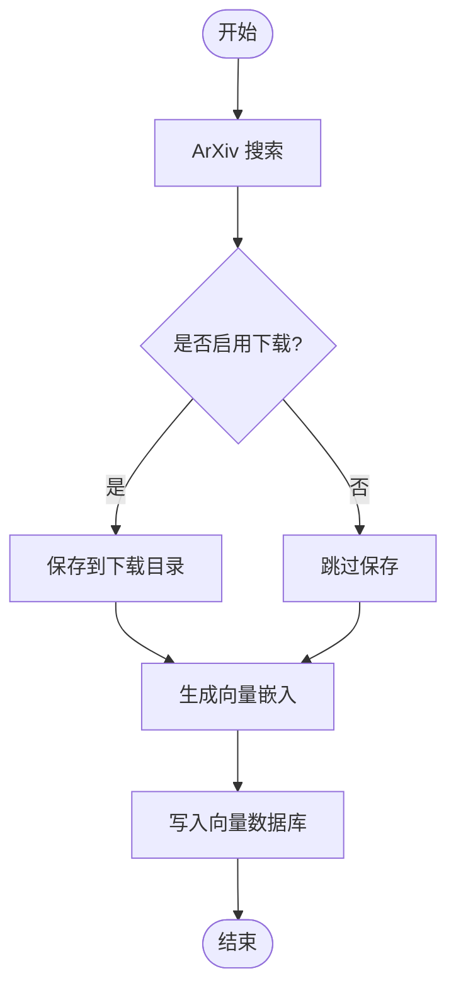
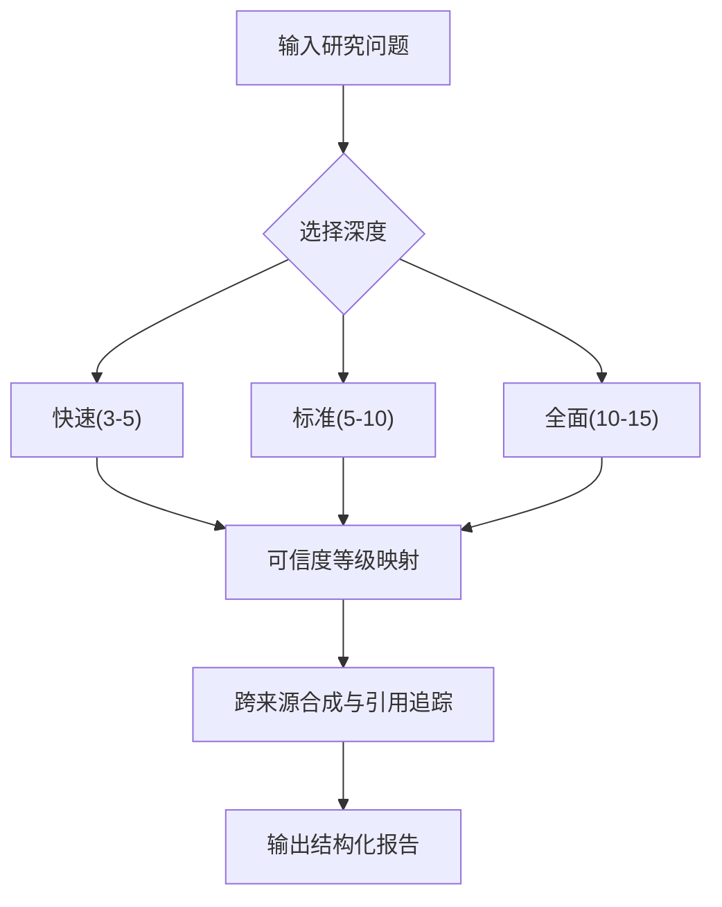
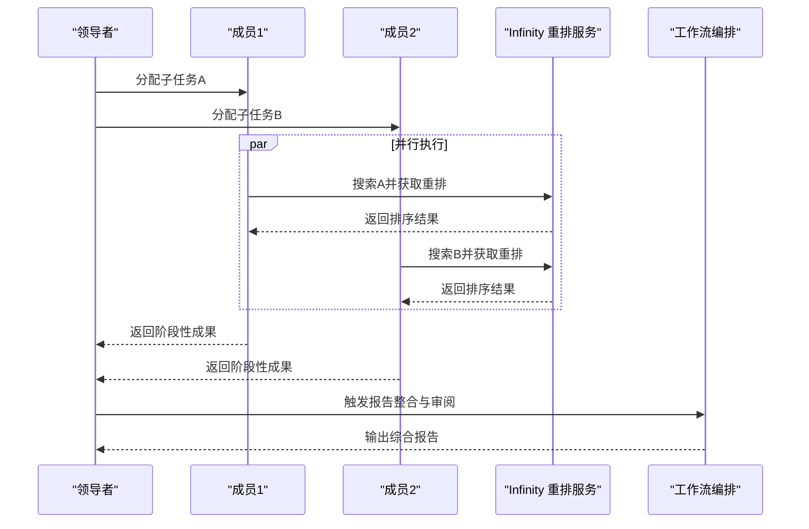
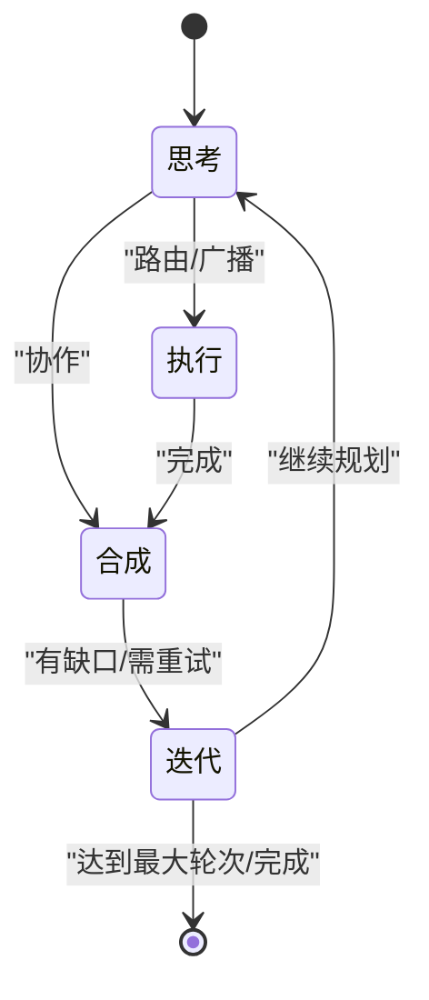
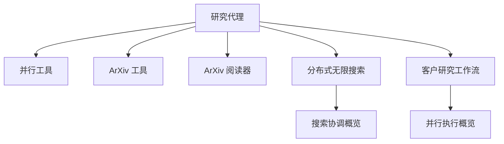

# 研究代理

<cite>
**本文档引用的文件**
- [研究代理（生产应用）](file://production/applications/research-agent.mdx)
- [研究代理（食谱）](file://cookbook/agents/research-agent.mdx)
- [并行工具](file://tools/toolkits/search/parallel.mdx)
- [ArXiv 工具](file://tools/toolkits/search/arxiv.mdx)
- [ArXiv 阅读器](file://knowledge/concepts/readers/arxiv-reader.mdx)
- [ArXiv 异步阅读器](file://knowledge/concepts/readers/arxiv-reader-async.mdx)
- [分布式无限搜索（团队示例）](file://knowledge/teams/distributed-infinity-search.mdx)
- [搜索协调（团队概览）](file://examples/teams/search-coordination/overview.mdx)
- [并行执行（工作流概览）](file://examples/workflows/parallel-execution/overview.mdx)
- [客户研究工作流（并行）](file://examples/agent-os/workflow/customer-research-workflow-parallel.mdx)
- [推理（科学）](file://examples/reasoning/agents/scientific-research.mdx)
- [团队委托](file://teams/delegation.mdx)
</cite>

## 目录
1. [简介](#简介)
2. [项目结构](#项目结构)
3. [核心组件](#核心组件)
4. [架构总览](#架构总览)
5. [详细组件分析](#详细组件分析)
6. [依赖关系分析](#依赖关系分析)
7. [性能考量](#性能考量)
8. [故障排查指南](#故障排查指南)
9. [结论](#结论)
10. [附录](#附录)

## 简介
本技术文档面向“研究代理”，系统性阐述其在多源网络研究中的能力边界与实现方式，重点覆盖以下方面：
- 并行 API 使用：通过并行搜索引擎与内容抽取能力，加速多源检索与提取。
- 引用管理与来源可信度评分：定义可信度等级、来源类型与报告中的引用追踪。
- 搜索算法与信息筛选：从问题理解到查询生成、迭代搜索、冲突识别与结果整合。
- 结果整合流程：跨来源合成、矛盾标注、置信度评估与最终报告输出。
- 配置指南：搜索策略、可信度权重、引用格式化等参数说明。
- 实际研究场景示例：学术论文、新闻报道与其他研究材料的处理方法，以及提升相关性与准确性的实践建议。

## 项目结构
研究代理相关的内容分布在多个模块中：
- 应用层：生产级研究代理应用文档，提供运行方式、参数配置与可信度评分。
- 食谱示例：基于 DuckDuckGo 与 Newspaper4k 的新闻调查式研究代理。
- 工具层：并行搜索与抽取工具、ArXiv 学术搜索工具与阅读器。
- 团队与工作流：搜索协调、分布式搜索、并行工作流与报告整合。
- 推理与信任：科学推理示例与团队委托模式下的容错与延迟特性。

**图表来源**
- [研究代理（生产应用）:1-187](file://production/applications/research-agent.mdx#L1-L187)
- [研究代理（食谱）:1-205](file://cookbook/agents/research-agent.mdx#L1-L205)
- [并行工具:1-80](file://tools/toolkits/search/parallel.mdx#L1-L80)
- [ArXiv 工具:1-44](file://tools/toolkits/search/arxiv.mdx#L1-L44)
- [ArXiv 阅读器:1-69](file://knowledge/concepts/readers/arxiv-reader.mdx#L1-L69)
- [ArXiv 异步阅读器:1-64](file://knowledge/concepts/readers/arxiv-reader-async.mdx#L1-L64)
- [分布式无限搜索（团队示例）:191-236](file://knowledge/teams/distributed-infinity-search.mdx#L191-L236)
- [搜索协调（团队概览）:1-10](file://examples/teams/search-coordination/overview.mdx#L1-L10)
- [并行执行（工作流概览）:1-9](file://examples/workflows/parallel-execution/overview.mdx#L1-L9)
- [客户研究工作流（并行）:128-565](file://examples/agent-os/workflow/customer-research-workflow-parallel.mdx#L128-L565)
- [推理（科学）](file://examples/reasoning/agents/scientific-research.mdx)
- [团队委托:280-299](file://teams/delegation.mdx#L280-L299)

**章节来源**
- [研究代理（生产应用）:1-187](file://production/applications/research-agent.mdx#L1-L187)
- [研究代理（食谱）:1-205](file://cookbook/agents/research-agent.mdx#L1-L205)

## 核心组件
- 并行搜索与抽取工具：提供自然语言目标搜索与指定 URL 内容抽取，支持最大结果数与字符限制控制。
- ArXiv 学术搜索与阅读：支持论文检索、阅读与向量化入库，便于后续知识库检索与 RAG。
- 可视化输出与引用追踪：通过结构化报告模板输出，包含来源列表与方法论说明。
- 搜索深度与可信度等级：定义快速、标准、全面三种深度，并给出高/中/低可信度来源类型映射。
- 分布式搜索与并行工作流：支持多阶段并行搜索与结果整合，提升大规模研究效率。
- 团队委托与容错：在成员失败时提供部分结果合成与重试/重分配策略。

**章节来源**
- [并行工具:1-80](file://tools/toolkits/search/parallel.mdx#L1-L80)
- [ArXiv 工具:1-44](file://tools/toolkits/search/arxiv.mdx#L1-L44)
- [ArXiv 阅读器:1-69](file://knowledge/concepts/readers/arxiv-reader.mdx#L1-L69)
- [ArXiv 异步阅读器:1-64](file://knowledge/concepts/readers/arxiv-reader-async.mdx#L1-L64)
- [研究代理（生产应用）:125-163](file://production/applications/research-agent.mdx#L125-L163)
- [分布式无限搜索（团队示例）:191-236](file://knowledge/teams/distributed-infinity-search.mdx#L191-L236)
- [并行执行（工作流概览）:1-9](file://examples/workflows/parallel-execution/overview.mdx#L1-L9)
- [团队委托:280-299](file://teams/delegation.mdx#L280-L299)

## 架构总览
研究代理的整体流程由“问题理解—查询生成—并行搜索—内容抽取—交叉验证—合成报告—引用追踪”构成。并行工具负责 AI 优化搜索与抽取；ArXiv 工具与阅读器用于学术文献检索与入库；团队与工作流模块支撑分布式搜索与结果整合；推理与信任模块保障容错与质量控制。

**图表来源**
- [研究代理（生产应用）:134-146](file://production/applications/research-agent.mdx#L134-L146)
- [并行工具:70-75](file://tools/toolkits/search/parallel.mdx#L70-L75)
- [ArXiv 工具:27-41](file://tools/toolkits/search/arxiv.mdx#L27-L41)
- [ArXiv 阅读器:17-38](file://knowledge/concepts/readers/arxiv-reader.mdx#L17-L38)

## 详细组件分析

### 组件一：并行搜索与抽取工具
- 功能要点
  - 搜索：支持自然语言目标与关键词混合查询，可限制最大结果数与每条结果字符数。
  - 抽取：对指定 URL 列表进行内容抽取，支持片段与全文抽取及字符上限控制。
- 参数与行为
  - 关键参数：启用搜索、启用抽取、最大结果数、每结果最大字符数、抽取目标与片段开关、全文抽取开关与字符上限。
  - 行为：返回 JSON 格式字符串，包含标题、发布日期、相关摘录与 URL 列表。
- 典型调用序列

**图表来源**
- [并行工具:20-49](file://tools/toolkits/search/parallel.mdx#L20-L49)
- [并行工具:70-75](file://tools/toolkits/search/parallel.mdx#L70-L75)

**章节来源**
- [并行工具:1-80](file://tools/toolkits/search/parallel.mdx#L1-L80)

### 组件二：ArXiv 学术搜索与阅读
- 功能要点
  - 检索：按主题或关键词搜索 ArXiv 论文集合。
  - 阅读：解析 PDF 文本，支持下载目录与保存路径配置。
  - 向量化：将论文转换为向量嵌入，写入向量数据库，支持后续检索。
- 参数与行为
  - 关键参数：启用搜索、启用阅读、下载目录。
  - 行为：返回论文摘要、作者、时间戳与向量存储状态。
- 流程图

**图表来源**
- [ArXiv 工具:27-41](file://tools/toolkits/search/arxiv.mdx#L27-L41)
- [ArXiv 阅读器:17-38](file://knowledge/concepts/readers/arxiv-reader.mdx#L17-L38)
- [ArXiv 异步阅读器:17-47](file://knowledge/concepts/readers/arxiv-reader-async.mdx#L17-L47)

**章节来源**
- [ArXiv 工具:1-44](file://tools/toolkits/search/arxiv.mdx#L1-L44)
- [ArXiv 阅读器:1-69](file://knowledge/concepts/readers/arxiv-reader.mdx#L1-L69)
- [ArXiv 异步阅读器:1-64](file://knowledge/concepts/readers/arxiv-reader-async.mdx#L1-L64)

### 组件三：搜索深度与可信度评分
- 搜索深度
  - 快速：3-5 条来源，适合简单问题与快速概览。
  - 标准：5-10 条来源，适用于大多数问题的平衡研究。
  - 全面：10-15 条来源，适合复杂主题的深入调查。
- 可信度等级
  - 高：官方文档、学术论文、权威出版物。
  - 中：知名博客、行业网站、已认证专家。
  - 低：个人博客、论坛、未验证来源。
- 报告字段
  - 包含主题、摘要、关键发现、建议、置信度分数与来源清单。

**图表来源**
- [研究代理（生产应用）:148-163](file://production/applications/research-agent.mdx#L148-L163)

**章节来源**
- [研究代理（生产应用）:125-163](file://production/applications/research-agent.mdx#L125-L163)

### 组件四：分布式搜索与并行工作流
- 分布式无限搜索
  - 通过 Infinity 重排服务与多源搜索协作，提升排序质量与覆盖率。
  - 示例包含环境变量设置、依赖安装与运行步骤。
- 并行工作流
  - 在工作流中并行执行独立研究步骤，随后串行写作与审阅步骤，以降低整体延迟。
- 客户研究工作流（并行）
  - 多阶段并行收集研究数据，再统一整合为综合报告，包含结构化数据汇总与置信度评分。

**图表来源**
- [分布式无限搜索（团队示例）:191-236](file://knowledge/teams/distributed-infinity-search.mdx#L191-L236)
- [搜索协调（团队概览）:6-10](file://examples/teams/search-coordination/overview.mdx#L6-L10)
- [并行执行（工作流概览）:6-9](file://examples/workflows/parallel-execution/overview.mdx#L6-L9)
- [客户研究工作流（并行）:526-565](file://examples/agent-os/workflow/customer-research-workflow-parallel.mdx#L526-L565)

**章节来源**
- [分布式无限搜索（团队示例）:191-236](file://knowledge/teams/distributed-infinity-search.mdx#L191-L236)
- [并行执行（工作流概览）:1-9](file://examples/workflows/parallel-execution/overview.mdx#L1-L9)
- [客户研究工作流（并行）:128-565](file://examples/agent-os/workflow/customer-research-workflow-parallel.mdx#L128-L565)

### 组件五：推理与团队委托
- 推理工具
  - 在搜索前规划研究路径，有助于生成更精准的查询与迭代策略。
- 团队委托模式
  - 协作（顺序思考→成员执行→领导合成）、路由（直接选择→成员执行）、广播（并行执行但合成有延迟）、任务（迭代直到完成或达到最大轮次）。
  - 错误处理：成员失败时，领导可使用其他成员的部分结果继续合成，或跟踪失败/阻塞任务并重试/重分配。

**图表来源**
- [团队委托:280-299](file://teams/delegation.mdx#L280-L299)

**章节来源**
- [团队委托:280-299](file://teams/delegation.mdx#L280-L299)

## 依赖关系分析
- 组件耦合
  - 研究代理依赖并行工具进行搜索与抽取；可选依赖 ArXiv 工具与阅读器进行学术文献检索与入库。
  - 分布式搜索与并行工作流模块通过团队与工作流框架协同，降低端到端延迟。
- 外部依赖
  - 并行 API、ArXiv API、Infinity 重排服务、向量数据库（如 PgVector）。
- 潜在循环依赖
  - 当前文档未显示循环依赖迹象；各模块职责清晰，接口通过工具与工作流解耦。

**图表来源**
- [研究代理（生产应用）:101-123](file://production/applications/research-agent.mdx#L101-L123)
- [分布式无限搜索（团队示例）:191-236](file://knowledge/teams/distributed-infinity-search.mdx#L191-L236)
- [客户研究工作流（并行）:128-565](file://examples/agent-os/workflow/customer-research-workflow-parallel.mdx#L128-L565)

**章节来源**
- [研究代理（生产应用）:101-123](file://production/applications/research-agent.mdx#L101-L123)

## 性能考量
- 并行搜索与抽取
  - 通过并行工具同时发起多路搜索与抽取，显著缩短端到端时间；合理设置最大结果数与字符上限，避免过度 IO。
- 分布式搜索
  - 使用 Infinity 重排服务提升排序质量，减少无效结果；在高并发场景下注意服务可用性与限流。
- 知识库检索
  - 将学术论文向量化并写入向量数据库，可显著提升后续检索速度；定期维护索引与元数据过滤。
- 工作流编排
  - 并行执行独立步骤后再串行整合，可在保证质量的同时降低总体延迟。

[本节为通用性能讨论，不直接分析具体文件]

## 故障排查指南
- 并行 API 密钥未设置
  - 确保导出并正确配置 PARALLEL_API_KEY；若密钥无效，搜索与抽取将失败。
- 特定领域结果有限
  - 对于小众主题，代理会在“缺口”字段中提示并建议替代搜索策略。
- 来源冲突与矛盾
  - 当不同来源存在分歧时，代理会标注矛盾、给出置信度，并分别列出双方来源。
- ScrapeGraph API 错误
  - 检查 SGAI_API_KEY 是否正确；关注仪表板上的用量限制。
- 网站数据不完整
  - 部分网站可能屏蔽爬虫，代理会记录可访问范围并在置信度中体现。
- X API 认证失败
  - 确认四个环境变量均已设置；对于高频分析，考虑调整请求间隔或升级至 X API 高级套餐。
- 速率限制错误
  - 代理已配置等待策略；高吞吐场景建议分批或使用高级套餐。

**章节来源**
- [研究代理（生产应用）:164-180](file://production/applications/research-agent.mdx#L164-L180)
- [研究代理（食谱）:164-168](file://cookbook/agents/research-agent.mdx#L164-L168)
- [分布式无限搜索（团队示例）:200-203](file://knowledge/teams/distributed-infinity-search.mdx#L200-L203)

## 结论
研究代理通过并行 API 与内容抽取、ArXiv 学术检索与向量化、分布式搜索与并行工作流，构建了从问题理解到报告输出的完整研究流水线。结合可信度等级与引用追踪，代理能够在复杂研究场景中提供高质量、可溯源的综合报告。通过合理的搜索深度与参数配置，用户可以平衡速度与准确性，并在出现冲突或资源不足时获得明确的改进建议。

[本节为总结性内容，不直接分析具体文件]

## 附录

### 配置指南（参数与策略）
- 搜索策略设置
  - 搜索深度：快速/标准/全面，分别对应不同来源数量与迭代次数。
  - 查询生成：在搜索前使用推理工具规划目标与查询，提升命中率。
  - 并行工具参数：启用搜索/抽取、最大结果数、每结果字符上限、抽取目标与片段/全文开关。
- 可信度权重分配
  - 高可信度来源优先纳入合成；中低可信度来源在报告中标注来源类型与置信度。
- 引用格式化选项
  - 报告模板包含来源清单与方法论说明，确保引用规范一致。
- 环境变量与依赖
  - 并行 API 密钥、ArXiv 依赖、Infinity 重排服务与向量数据库驱动。

**章节来源**
- [研究代理（生产应用）:125-163](file://production/applications/research-agent.mdx#L125-L163)
- [并行工具:27-41](file://tools/toolkits/search/parallel.mdx#L27-L41)
- [ArXiv 工具:27-41](file://tools/toolkits/search/arxiv.mdx#L27-L41)

### 实际研究场景示例
- 学术论文
  - 使用 ArXiv 工具与阅读器进行论文检索与解析，必要时下载到本地并写入向量数据库，以便后续检索与 RAG。
- 新闻报道
  - 使用并行工具进行多源搜索与抽取，结合推理工具生成更精准的查询，最后由报告合成模块输出结构化文章。
- 其他研究材料
  - 对于网页、白皮书、行业报告等，采用并行抽取与交叉验证，确保事实与引用准确。

**章节来源**
- [ArXiv 工具:1-44](file://tools/toolkits/search/arxiv.mdx#L1-L44)
- [ArXiv 阅读器:1-69](file://knowledge/concepts/readers/arxiv-reader.mdx#L1-L69)
- [ArXiv 异步阅读器:1-64](file://knowledge/concepts/readers/arxiv-reader-async.mdx#L1-L64)
- [研究代理（食谱）:20-31](file://cookbook/agents/research-agent.mdx#L20-L31)