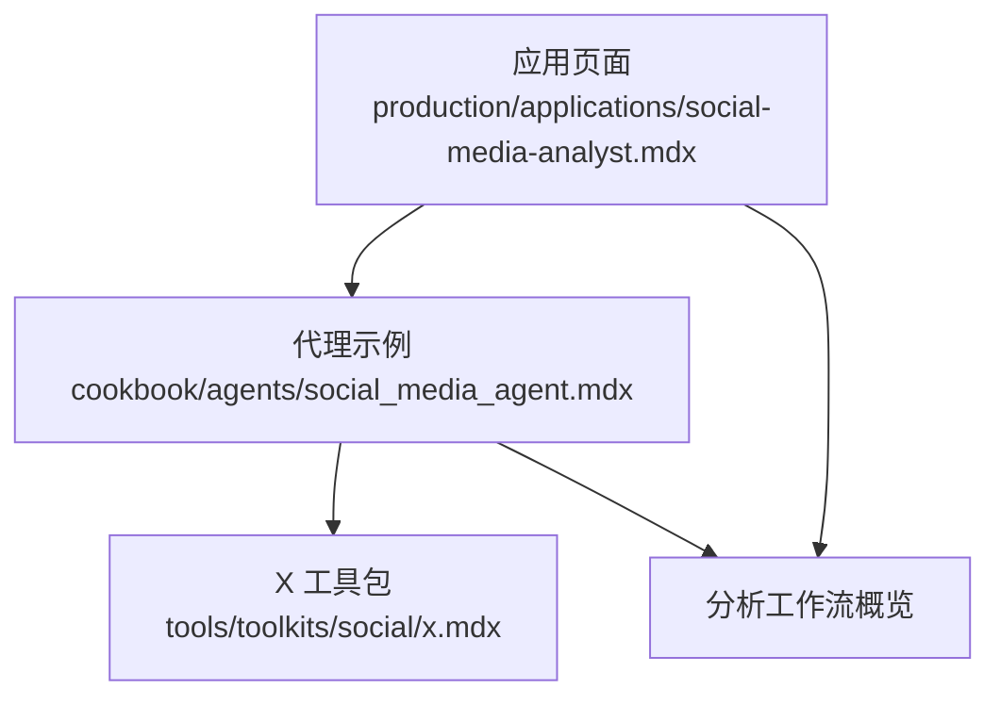
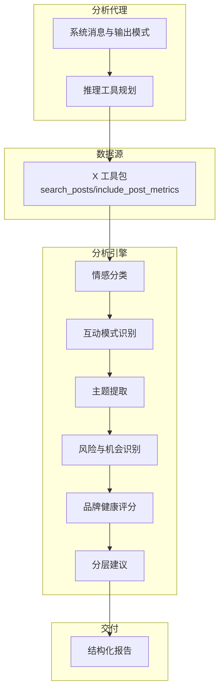
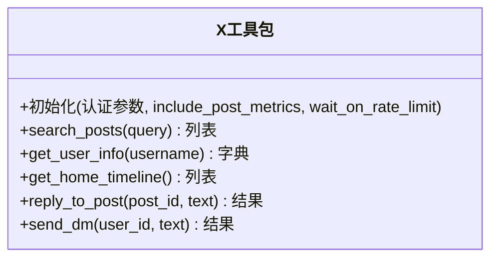
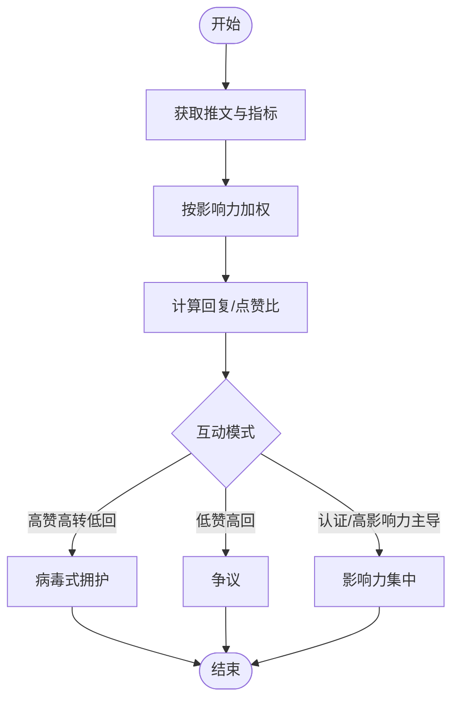
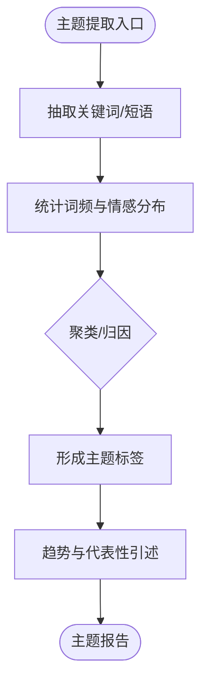
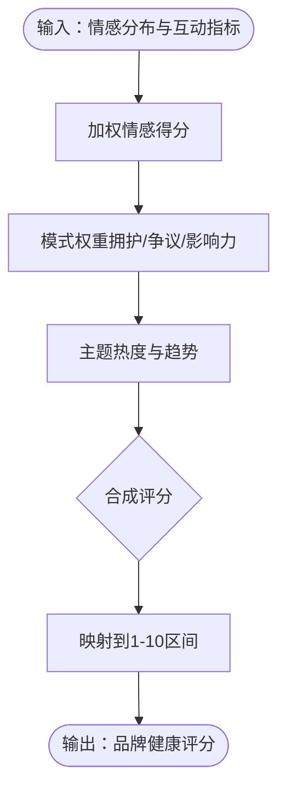
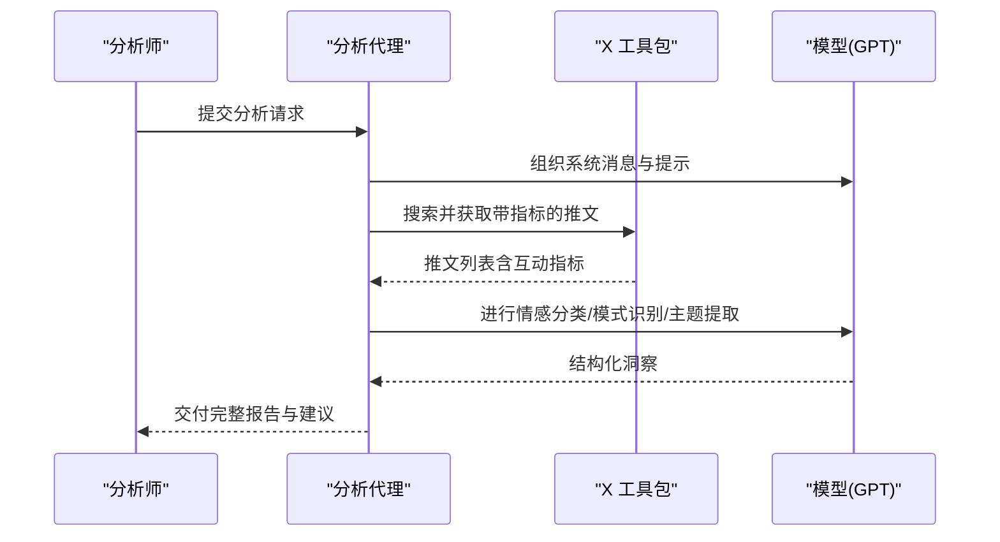
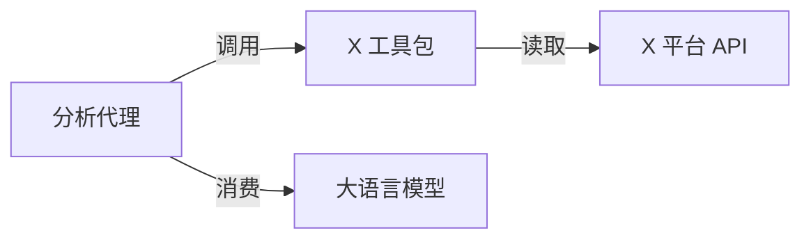

# 社交媒体分析师

<cite>
**本文引用的文件**
- [production/applications/social-media-analyst.mdx](file://production/applications/social-media-analyst.mdx)
- [cookbook/agents/social_media_agent.mdx](file://cookbook/agents/social_media_agent.mdx)
- [tools/toolkits/social/x.mdx](file://tools/toolkits/social/x.mdx)
</cite>

## 目录
1. [简介](#简介)
2. [项目结构](#项目结构)
3. [核心组件](#核心组件)
4. [架构总览](#架构总览)
5. [详细组件分析](#详细组件分析)
6. [依赖关系分析](#依赖关系分析)
7. [性能考量](#性能考量)
8. [故障排查指南](#故障排查指南)
9. [结论](#结论)
10. [附录](#附录)

## 简介
本技术文档面向社交媒体分析师，系统性阐述基于 X（原 Twitter）平台的品牌情感分析与健康度评分体系。该系统通过检索品牌相关推文，结合情感分类、互动模式识别、主题聚类与风险/机会洞察，输出可执行的分层建议与响应策略。文档覆盖算法思路、话题检测与趋势识别流程、配置项说明，并提供跨行业品牌分析示例与解读方法。

## 项目结构
- 应用页面：生产级应用介绍页，概述品牌健康评分、情感分类与工作流。
- 示例代理：提供完整的分析报告格式、评估准则与使用示例。
- 工具包：X（Twitter）工具集，封装认证、速率限制与指标采集能力。

**图表来源**
- [production/applications/social-media-analyst.mdx:147-159](file://production/applications/social-media-analyst.mdx#L147-L159)
- [cookbook/agents/social_media_agent.mdx:32-49](file://cookbook/agents/social_media_agent.mdx#L32-L49)
- [tools/toolkits/social/x.mdx:109-118](file://tools/toolkits/social/x.mdx#L109-L118)

**章节来源**
- [production/applications/social-media-analyst.mdx:1-204](file://production/applications/social-media-analyst.mdx#L1-L204)
- [cookbook/agents/social_media_agent.mdx:32-113](file://cookbook/agents/social_media_agent.mdx#L32-L113)
- [tools/toolkits/social/x.mdx:1-125](file://tools/toolkits/social/x.mdx#L1-L125)

## 核心组件
- 品牌健康评分（1-10）
  - 定义区间与含义：极高正向、偏正向、中性偏好、偏负面、危机级负面。
- 情感分类
  - 四分类：积极、消极、中性、混合；并给出典型指示词。
- 互动模式识别
  - 病毒式拥护、争议、影响力集中等模式。
- 主题提取
  - 功能好评/痛点、UX/性能、客服交互、定价与ROI、竞品对比、采用障碍与新用例。
- 报告结构
  - 执行摘要、量化仪表盘、关键主题与代表性引述、竞争与市场信号、风险分析、机会图景、战略建议、响应预案。
- 分析准则
  - 权重规则：按互动量与作者影响力加权；争议阈值：回复/点赞比 > 0.5；识别协同或机器人行为。

**章节来源**
- [production/applications/social-media-analyst.mdx:10-17](file://production/applications/social-media-analyst.mdx#L10-L17)
- [production/applications/social-media-analyst.mdx:161-179](file://production/applications/social-media-analyst.mdx#L161-L179)
- [cookbook/agents/social_media_agent.mdx:51-99](file://cookbook/agents/social_media_agent.mdx#L51-L99)

## 架构总览
系统以“代理 + 工具”的方式运行：代理负责组织分析流程与生成报告，工具负责从 X 平台拉取带指标的推文数据。整体流程围绕“检索—标注—模式—主题—洞察—建议”展开。

**图表来源**
- [production/applications/social-media-analyst.mdx:115-136](file://production/applications/social-media-analyst.mdx#L115-L136)
- [production/applications/social-media-analyst.mdx:147-159](file://production/applications/social-media-analyst.mdx#L147-L159)
- [tools/toolkits/social/x.mdx:109-118](file://tools/toolkits/social/x.mdx#L109-L118)

## 详细组件分析

### 组件一：X 工具包（数据采集）
- 能力边界
  - 支持搜索推文、获取用户信息、主页时间线、回复与私信等。
  - 可选返回互动指标（点赞、转发、回复）。
- 关键参数
  - 认证参数：Bearer Token、Consumer Key/Secret、Access Token/Secret。
  - 行为参数：是否包含指标、是否在限流时等待重试。
- 使用要点
  - 通过环境变量注入凭证。
  - 在高并发场景启用限流等待，避免被平台限流。

**图表来源**
- [tools/toolkits/social/x.mdx:97-118](file://tools/toolkits/social/x.mdx#L97-L118)

**章节来源**
- [tools/toolkits/social/x.mdx:1-125](file://tools/toolkits/social/x.mdx#L1-L125)

### 组件二：情感分类与互动模式识别
- 情感分类四类与典型指示
  - 积极：赞扬、推荐、满意
  - 消极：投诉、沮丧、批评
  - 中性：信息分享、提问、新闻
  - 混合：同时包含正负
- 互动模式识别
  - 病毒式拥护：高点赞+高转发、低回复
  - 争议：低点赞、高回复
  - 影响力集中：认证账号或高影响力账户主导情绪
- 权重与阈值
  - 对已认证用户或高影响力作者进行加权。
  - 回复/点赞比 > 0.5 作为争议预警。
  - 识别协同或疑似机器人行为。

**图表来源**
- [cookbook/agents/social_media_agent.mdx:94-96](file://cookbook/agents/social_media_agent.mdx#L94-L96)

**章节来源**
- [cookbook/agents/social_media_agent.mdx:32-49](file://cookbook/agents/social_media_agent.mdx#L32-L49)
- [cookbook/agents/social_media_agent.mdx:94-96](file://cookbook/agents/social_media_agent.mdx#L94-L96)

### 组件三：主题提取与趋势识别
- 主题覆盖维度
  - 功能好评/痛点、UX/性能、客服交互、定价与ROI感知、竞品对比、新兴用例与采用障碍。
- 趋势识别
  - 通过主题词频、情感趋势与代表性推文片段，识别兴趣增长、平台期或下降等宏观趋势。
- 输出形态
  - 每个主题附带描述、情感趋势、摘录推文与关键指标。

**图表来源**
- [cookbook/agents/social_media_agent.mdx:41-47](file://cookbook/agents/social_media_agent.mdx#L41-L47)

**章节来源**
- [cookbook/agents/social_media_agent.mdx:41-47](file://cookbook/agents/social_media_agent.mdx#L41-L47)

### 组件四：品牌健康评分机制
- 评分区间与含义
  - 9-10：极度正向，强烈拥护
  - 7-8：主要正向，小问题
  - 5-6：情感混杂，显著关注点
  - 3-4：明显负面，严重问题
  - 1-2：危机级负面
- 评分依据
  - 综合情感分布与互动强度，结合模式识别结果进行综合打分。

**图表来源**
- [production/applications/social-media-analyst.mdx:170-179](file://production/applications/social-media-analyst.mdx#L170-L179)

**章节来源**
- [production/applications/social-media-analyst.mdx:170-179](file://production/applications/social-media-analyst.mdx#L170-L179)

### 组件五：报告结构与建议分层
- 报告结构
  - 执行摘要、量化仪表盘、关键主题与代表性引述、竞争与市场信号、风险分析、机会图景、战略建议、响应预案。
- 建议分层
  - 立即（≤48小时）、短期（1-2周）、长期（1-3个月）。
- 响应预案
  - 高影响帖子清单、建议回复模板、推荐回应者与目标。

**图表来源**
- [production/applications/social-media-analyst.mdx:115-136](file://production/applications/social-media-analyst.mdx#L115-L136)
- [tools/toolkits/social/x.mdx:109-118](file://tools/toolkits/social/x.mdx#L109-L118)

**章节来源**
- [cookbook/agents/social_media_agent.mdx:51-99](file://cookbook/agents/social_media_agent.mdx#L51-L99)

## 依赖关系分析
- 外部依赖
  - X 平台 API：用于检索推文与用户信息。
  - 大语言模型：用于情感标注、主题聚类与报告合成。
- 内部耦合
  - 代理对工具包的调用是单向依赖；工具包不反向依赖代理。
  - 报告结构与评估准则由代理系统消息与提示驱动，确保一致性。

**图表来源**
- [production/applications/social-media-analyst.mdx:115-136](file://production/applications/social-media-analyst.mdx#L115-L136)
- [tools/toolkits/social/x.mdx:109-118](file://tools/toolkits/social/x.mdx#L109-L118)

**章节来源**
- [production/applications/social-media-analyst.mdx:115-136](file://production/applications/social-media-analyst.mdx#L115-L136)
- [tools/toolkits/social/x.mdx:109-118](file://tools/toolkits/social/x.mdx#L109-L118)

## 性能考量
- 速率限制与退避
  - 启用“遇到限流等待重试”，在高吞吐场景下建议错峰请求或升级至更高配额。
- 数据规模与代表性
  - 小众品牌可能样本有限，需在报告中明确局限性并建议扩大窗口或延长周期。
- 模型成本与批处理
  - 合理控制每次检索的推文数量，平衡质量与成本；对重复任务可考虑缓存中间结果。

## 故障排查指南
- X API 认证失败
  - 检查环境变量是否正确设置：消费者密钥、消费者密钥密文、访问令牌、访问令牌密文、Bearer Token。
- 限流错误
  - 系统默认启用等待重试；高负载时建议分散请求或使用更高阶的 API 层级。
- 小众品牌结果稀少
  - 系统会基于可用数据进行分析并在报告中标注局限性。

**章节来源**
- [production/applications/social-media-analyst.mdx:180-198](file://production/applications/social-media-analyst.mdx#L180-L198)

## 结论
该系统通过“工具采集 + 代理分析 + 模型合成”的架构，将 X 平台的公开讨论转化为可操作的品牌洞察。情感分类、互动模式识别、主题提取与健康评分共同构成闭环，辅以分层建议与响应预案，帮助产品、客户体验与品牌声誉管理团队快速决策与行动。

## 附录

### 配置选项与参数说明
- 代理配置要点
  - 模型：用于情感分析与合成。
  - 输出模式：结构化报告。
  - 工具：X 工具包（开启指标采集、启用限流等待）。
  - 上下文增强：附加时间与历史运行记录，启用代理记忆。
- X 工具包参数
  - 认证参数：Bearer Token、Consumer Key/Secret、Access Token/Secret。
  - 行为参数：include_post_metrics（是否返回互动指标）、wait_on_rate_limit（遇到限流是否等待重试）。

**章节来源**
- [production/applications/social-media-analyst.mdx:115-146](file://production/applications/social-media-analyst.mdx#L115-L146)
- [tools/toolkits/social/x.mdx:97-107](file://tools/toolkits/social/x.mdx#L97-L107)

### 实际品牌分析示例（行业视角）
- 科技产品
  - 关注点：功能更新、性能表现、API 稳定性、开发者社区反馈。
  - 健康评分：若出现大量“混合/负面”且回复/点赞比偏高，提示潜在争议与改进需求。
- 快消品牌
  - 关注点：定价与ROI感知、促销活动口碑、竞品对比。
  - 健康评分：若“积极”占比高但“争议”上升，提示营销传播需加强一致性。
- 新消费品牌
  - 关注点：采用障碍、使用体验、KOL/UGC 影响力。
  - 健康评分：若“影响力集中”于少数认证账号且情绪波动大，提示需主动引导与沟通。

（以上为通用分析框架下的示例说明，具体评分与建议需结合实际数据与系统输出。）