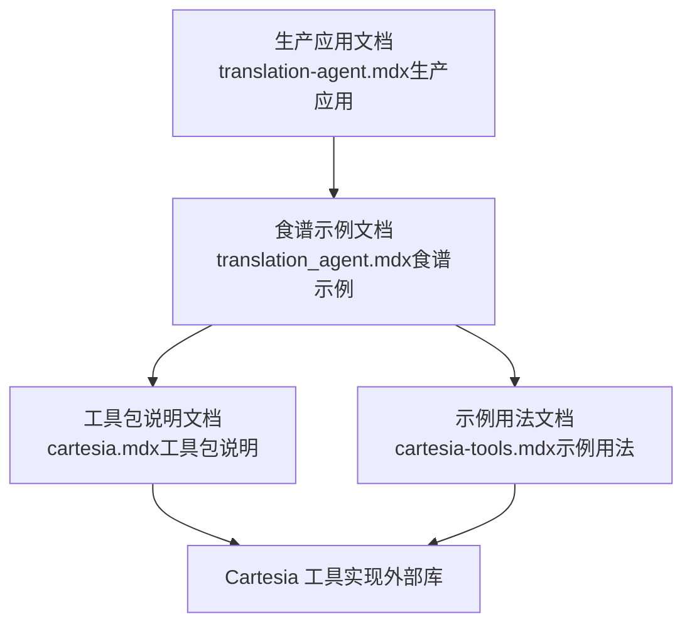
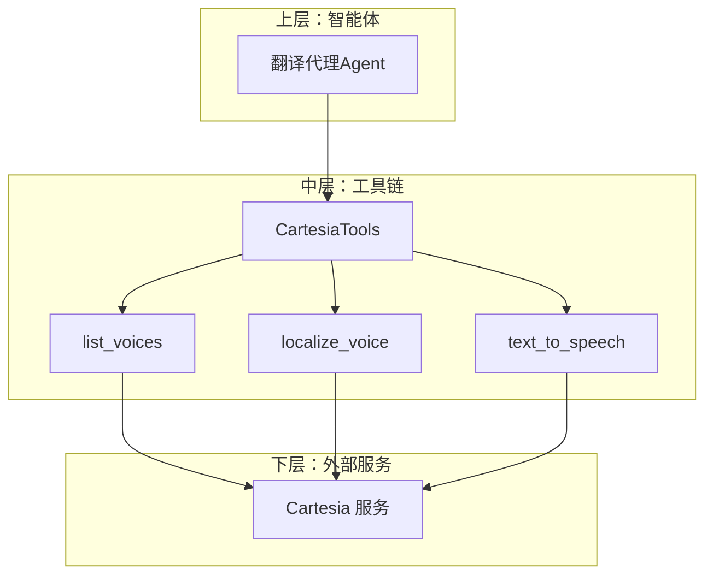
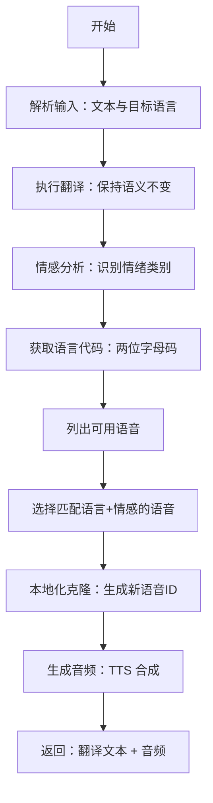
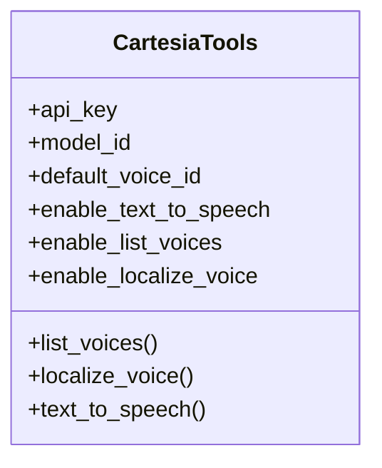
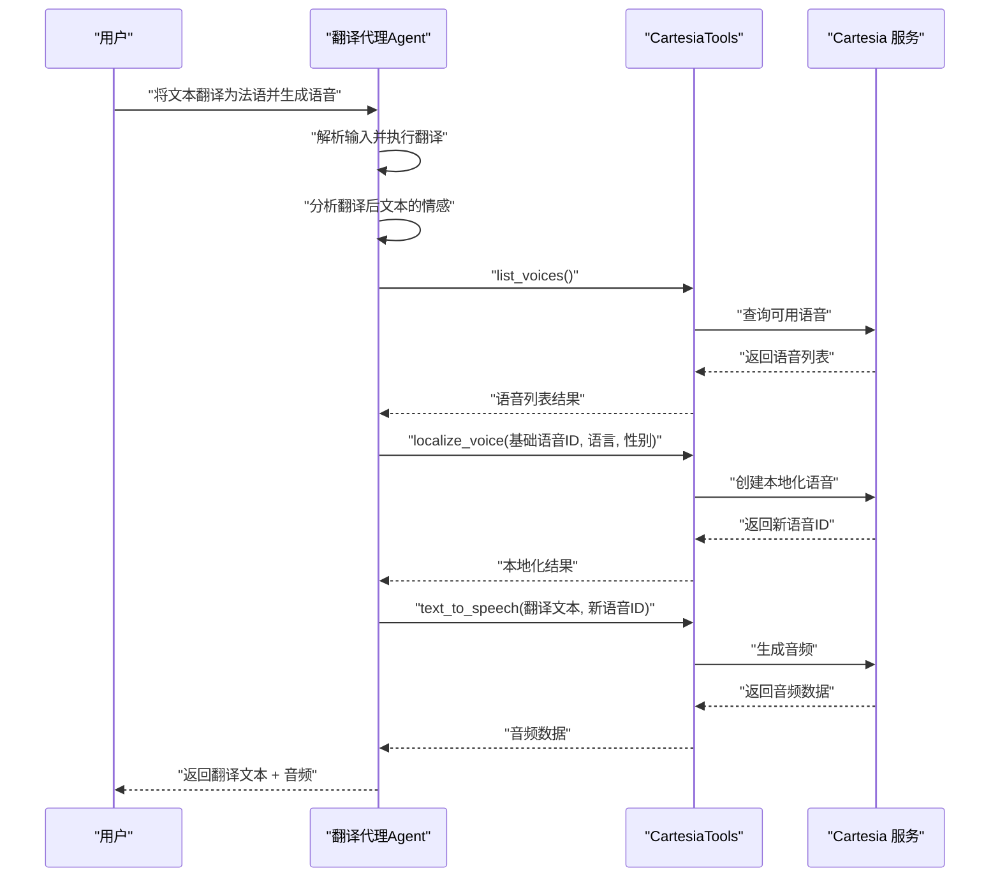
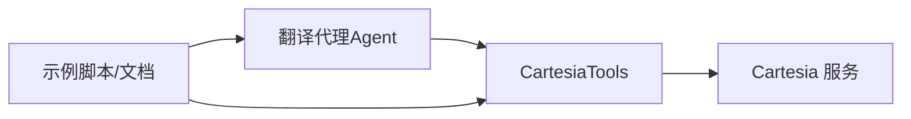

# 翻译代理

<cite>
**本文引用的文件**
- [translation-agent.mdx（生产应用）](file://production/applications/translation-agent.mdx)
- [translation_agent.mdx（食谱示例）](file://cookbook/agents/translation_agent.mdx)
- [cartesia.mdx（工具包说明）](file://tools/toolkits/others/cartesia.mdx)
- [cartesia-tools.mdx（示例用法）](file://examples/tools/cartesia-tools.mdx)
</cite>

## 目录
1. [简介](#简介)
2. [项目结构](#项目结构)
3. [核心组件](#核心组件)
4. [架构总览](#架构总览)
5. [详细组件分析](#详细组件分析)
6. [依赖关系分析](#依赖关系分析)
7. [性能考量](#性能考量)
8. [故障排查指南](#故障排查指南)
9. [结论](#结论)
10. [附录](#附录)

## 简介
本技术文档面向“翻译代理”，这是一个情感感知的多模态智能体，能够：
- 将文本从源语言翻译为目标语言；
- 分析翻译后文本的情感倾向；
- 基于语言与情感选择合适的语音；
- 使用 Cartesia 语音合成服务生成本地化音频输出。

该系统通过明确的多步工作流，结合语言模型进行翻译与情感分析，并借助 Cartesia 的语音列表、语音克隆与文本转语音能力，最终输出既准确又富有情感表达的音频内容。本文将从系统架构、数据流、处理逻辑、配置项、典型场景与优化建议等方面进行深入说明。

## 项目结构
围绕翻译代理的关键文档与示例分布在以下位置：
- 生产应用文档：提供端到端的使用流程、前置条件、运行示例与故障排查。
- 食谱示例文档：提供可直接运行的示例脚本路径与参数说明。
- 工具包说明文档：定义 Cartesia 工具集的参数、功能与默认行为。
- 示例用法文档：演示如何在智能体中集成并调用 Cartesia 工具。

图表来源
- [translation-agent.mdx（生产应用）:1-173](file://production/applications/translation-agent.mdx#L1-L173)
- [translation_agent.mdx（食谱示例）:1-99](file://cookbook/agents/translation_agent.mdx#L1-L99)
- [cartesia.mdx（工具包说明）:1-112](file://tools/toolkits/others/cartesia.mdx#L1-L112)
- [cartesia-tools.mdx（示例用法）:1-60](file://examples/tools/cartesia-tools.mdx#L1-L60)

章节来源
- [translation-agent.mdx（生产应用）:1-173](file://production/applications/translation-agent.mdx#L1-L173)
- [translation_agent.mdx（食谱示例）:1-99](file://cookbook/agents/translation_agent.mdx#L1-L99)
- [cartesia.mdx（工具包说明）:1-112](file://tools/toolkits/others/cartesia.mdx#L1-L112)
- [cartesia-tools.mdx（示例用法）:1-60](file://examples/tools/cartesia-tools.mdx#L1-L60)

## 核心组件
- 智能体（Agent）
  - 使用语言模型执行翻译与情感分析；
  - 通过工具链完成语音列表查询、语音克隆与文本转语音。
- 工具链（CartesiaTools）
  - 提供列出语音、本地化语音与文本转语音的能力；
  - 支持通过参数启用/禁用各功能模块。
- 外部服务（Cartesia）
  - 提供高质量语音合成与本地化能力；
  - 通过 API 密钥进行鉴权。

章节来源
- [translation_agent.mdx（食谱示例）:49-55](file://cookbook/agents/translation_agent.mdx#L49-L55)
- [cartesia.mdx（工具包说明）:90-107](file://tools/toolkits/others/cartesia.mdx#L90-L107)

## 架构总览
翻译代理采用“智能体 + 工具 + 外部服务”的分层架构：
- 上层：智能体负责编排流程，按步骤执行翻译、情感分析与语音选择；
- 中层：工具链封装 Cartesia 能力，屏蔽外部服务细节；
- 下层：Cartesia 服务提供语音资源与合成能力。

图表来源
- [translation_agent.mdx（食谱示例）:24-46](file://cookbook/agents/translation_agent.mdx#L24-L46)
- [cartesia.mdx（工具包说明）:101-107](file://tools/toolkits/others/cartesia.mdx#L101-L107)

## 详细组件分析

### 组件一：翻译与情感分析流程
- 输入：用户请求（包含待翻译文本与目标语言）；
- 步骤：
  1) 解析文本与目标语言；
  2) 执行翻译以保留原意；
  3) 分析翻译后文本的情感倾向；
  4) 获取目标语言的两位字母代码；
  5) 列出可用语音；
  6) 选择匹配语言与情感的语音；
  7) 对基础语音进行本地化克隆；
  8) 生成音频输出；
  9) 返回翻译文本与音频。
- 输出：翻译后的文本与对应情感化音频。

图表来源
- [translation-agent.mdx（生产应用）:134-146](file://production/applications/translation-agent.mdx#L134-L146)
- [translation_agent.mdx（食谱示例）:24-46](file://cookbook/agents/translation_agent.mdx#L24-L46)

章节来源
- [translation-agent.mdx（生产应用）:9-21](file://production/applications/translation-agent.mdx#L9-L21)
- [translation-agent.mdx（生产应用）:134-146](file://production/applications/translation-agent.mdx#L134-L146)
- [translation_agent.mdx（食谱示例）:24-46](file://cookbook/agents/translation_agent.mdx#L24-L46)

### 组件二：情感-语音映射策略
- 映射规则：根据翻译后文本的情感类别，选择具备相应语音特征的基音或本地化语音，确保语调、节奏与能量水平与情感一致。
- 参考映射（示例）：
  - 平静：清晰、专业、适中语速；
  - 快乐：轻快、有活力、略快；
  - 悲伤：缓慢、柔和、低能量；
  - 愤怒：强烈、更富表现力；
  - 兴奋：高能量、动态、更快；
  - 冷静：舒缓、稳定、放松；
  - 专业：正式、清晰、权威。

章节来源
- [translation-agent.mdx（生产应用）:148-158](file://production/applications/translation-agent.mdx#L148-L158)

### 组件三：语言支持矩阵
- 支持的语言与代码（示例）：
  - 法语：fr；西班牙语：es；德语：de；意大利语：it；葡萄牙语：pt；日语：ja；中文：zh；韩语：ko。

章节来源
- [translation-agent.mdx（生产应用）:160-171](file://production/applications/translation-agent.mdx#L160-L171)

### 组件四：Cartesia 工具链与参数
- 主要功能函数：
  - list_voices：获取可用语音列表；
  - localize_voice：基于基础语音创建本地化克隆；
  - text_to_speech：将文本转换为音频。
- 关键参数（示例）：
  - api_key：认证密钥（优先使用环境变量）；
  - model_id：TTS 模型标识；
  - default_voice_id：默认语音标识；
  - enable_text_to_speech：启用 TTS；
  - enable_list_voices：启用语音列表；
  - enable_localize_voice：启用语音本地化。

图表来源
- [cartesia.mdx（工具包说明）:92-107](file://tools/toolkits/others/cartesia.mdx#L92-L107)

章节来源
- [cartesia.mdx（工具包说明）:90-107](file://tools/toolkits/others/cartesia.mdx#L90-L107)

### 组件五：示例运行序列（智能体调用）
- 场景：翻译一段文本并生成带情感色彩的语音输出；
- 步骤：
  1) 初始化智能体并注入 CartesiaTools；
  2) 运行智能体，传入翻译与生成语音的指令；
  3) 若返回音频，保存为本地文件以便播放与验证。

图表来源
- [translation_agent.mdx（食谱示例）:58-81](file://cookbook/agents/translation_agent.mdx#L58-L81)
- [cartesia-tools.mdx（示例用法）:34-45](file://examples/tools/cartesia-tools.mdx#L34-L45)

章节来源
- [translation_agent.mdx（食谱示例）:58-81](file://cookbook/agents/translation_agent.mdx#L58-L81)
- [cartesia-tools.mdx（示例用法）:34-45](file://examples/tools/cartesia-tools.mdx#L34-L45)

## 依赖关系分析
- 智能体依赖语言模型与工具链；
- 工具链依赖外部 Cartesia 服务；
- 示例脚本与文档共同构成可运行的最小闭环。

图表来源
- [translation_agent.mdx（食谱示例）:49-55](file://cookbook/agents/translation_agent.mdx#L49-L55)
- [cartesia.mdx（工具包说明）:1-112](file://tools/toolkits/others/cartesia.mdx#L1-L112)

章节来源
- [translation_agent.mdx（食谱示例）:49-55](file://cookbook/agents/translation_agent.mdx#L49-L55)
- [cartesia.mdx（工具包说明）:1-112](file://tools/toolkits/others/cartesia.mdx#L1-L112)

## 性能考量
- 语音本地化成本：本地化会引入额外的网络往返与计算开销，建议在批量任务中复用已创建的本地化语音，避免重复克隆。
- 情感分析稳定性：情感分类的准确性直接影响语音选择质量，建议在关键业务场景中对情感标签进行人工校验与迭代。
- TTS 合成延迟：根据模型与音频长度估算合成耗时，必要时开启异步生成并在前端提供进度提示。
- 缓存策略：对常用语言-情感组合的语音进行缓存，减少重复查询与本地化操作。

## 故障排查指南
- API 密钥问题
  - 确认环境变量或显式参数已正确设置；
  - 检查密钥是否过期或权限不足。
- 语音不可用
  - 使用 list_voices 确认目标语言与情感对应的语音是否存在；
  - 尝试回退到默认语音或更换情感标签。
- 本地化失败
  - 检查基础语音 ID 是否有效；
  - 确认语言代码与性别参数符合要求。
- 音频质量异常
  - 调整模型 ID 或采样率等参数；
  - 检查输入文本长度与标点符号，避免过长或不规范文本导致断句异常。

章节来源
- [cartesia.mdx（工具包说明）:92-99](file://tools/toolkits/others/cartesia.mdx#L92-L99)
- [translation-agent.mdx（生产应用）:173-173](file://production/applications/translation-agent.mdx#L173-L173)

## 结论
翻译代理通过“翻译 + 情感分析 + 语音选择 + 本地化 + 合成”的完整链路，实现了高保真、富情感的多语言语音输出。借助 Cartesia 的强大能力与灵活的工具参数，系统可在多种场景中稳定运行。建议在实际部署中结合业务特点优化情感映射、缓存策略与错误处理，以获得更佳的用户体验与质量保障。

## 附录
- 快速开始
  - 安装依赖：参考示例文档中的安装命令；
  - 设置环境变量：包含 OpenAI 与 Cartesia 的 API 密钥；
  - 运行示例：参考示例脚本路径与运行方式。
- 常见问题
  - 如何切换语言对？在输入中指定目标语言代码即可；
  - 如何调节情感强度？通过调整情感标签与语音选择策略实现；
  - 如何自定义语音参数？通过工具参数与外部服务接口进行微调。

章节来源
- [translation-agent.mdx（生产应用）:22-71](file://production/applications/translation-agent.mdx#L22-L71)
- [translation_agent.mdx（食谱示例）:70-99](file://cookbook/agents/translation_agent.mdx#L70-L99)
- [cartesia-tools.mdx（示例用法）:48-59](file://examples/tools/cartesia-tools.mdx#L48-L59)