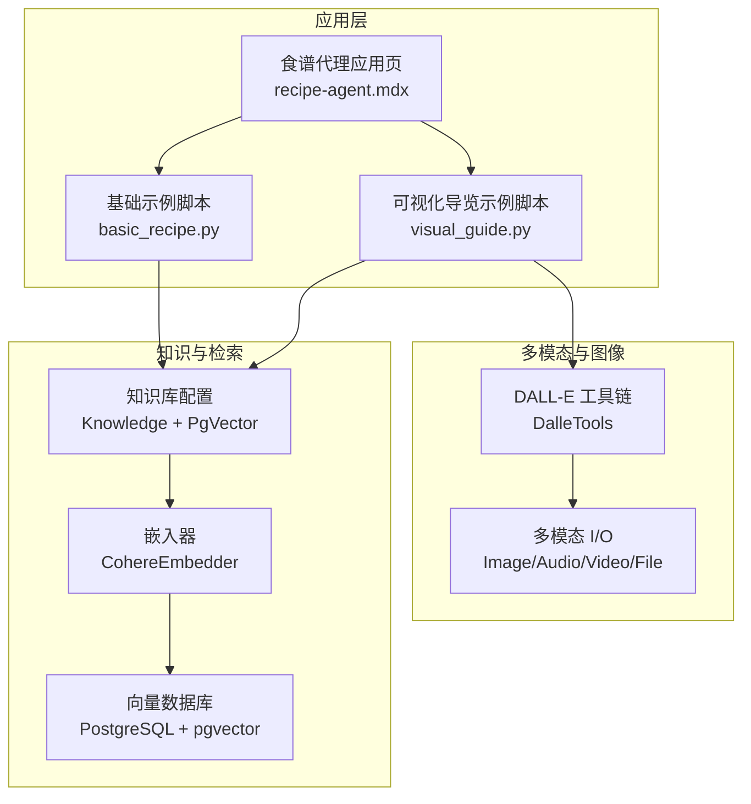
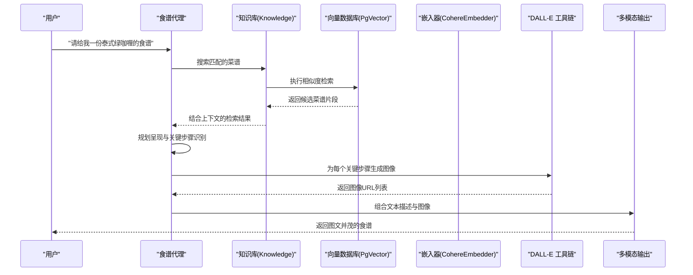
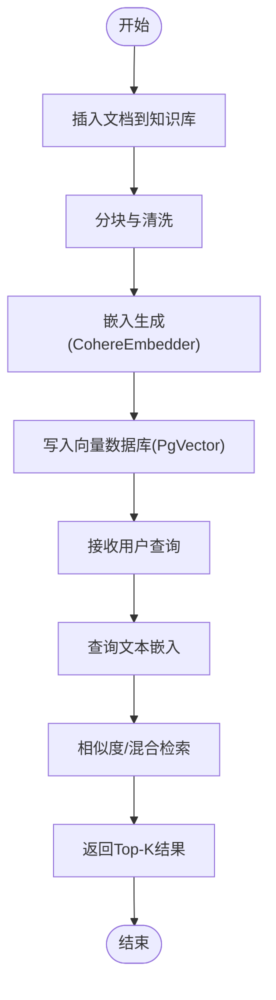
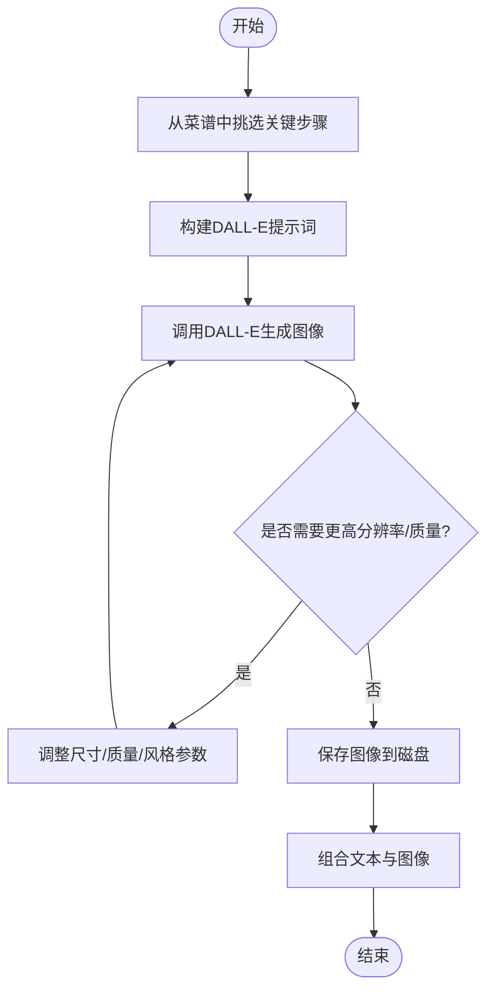
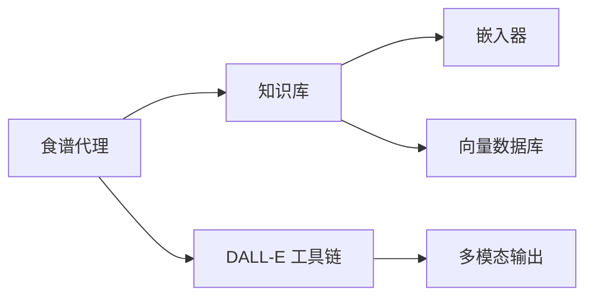

# 食谱代理

<cite>
**本文引用的文件**
- [食谱代理应用页](file://production/applications/recipe-agent.mdx)
- [DALL-E 工具使用示例](file://examples/tools/dalle-tools.mdx)
- [多模态输入输出概览](file://input-output/multimodal.mdx)
- [知识库快速入门](file://knowledge/quickstart.mdx)
- [PgVector 向量数据库示例（分布式 RAG）](file://knowledge/teams/distributed-rag-pgvector.mdx)
- [多模态工具响应示例（中间步骤流式输出）](file://multimodal/agent/usage/generate-image-with-intermediate-steps.mdx)
- [模型原生 OpenAI 图像生成示例](file://models/providers/native/openai/completion/usage/generate-images.mdx)
</cite>

## 目录
1. [简介](#简介)
2. [项目结构](#项目结构)
3. [核心组件](#核心组件)
4. [架构总览](#架构总览)
5. [详细组件分析](#详细组件分析)
6. [依赖关系分析](#依赖关系分析)
7. [性能考虑](#性能考虑)
8. [故障排查指南](#故障排查指南)
9. [结论](#结论)
10. [附录](#附录)

## 简介
本技术文档面向“食谱代理”这一多模态检索增强生成（RAG）系统，系统通过向量数据库检索菜谱，并结合 DALL-E 图像生成能力，为用户提供图文并茂的烹饪指导。文档将从系统架构、数据处理与理解、文本生成机制、配置与调优、实际示例与最佳实践等维度进行深入说明。

## 项目结构
食谱代理位于示例应用中，围绕以下关键模块组织：
- 应用页面：定义了代理目标、前置条件、安装与运行流程、配置要点与故障排查
- 示例脚本：演示基础查询与可视化导览两种典型工作流
- 多模态 I/O：支持图片输入/输出，便于在后续扩展中引入图像理解
- 知识管理与向量检索：基于 PostgreSQL + pgvector 的向量数据库，使用嵌入模型对菜谱进行向量化存储与检索
- 图像生成工具：通过 DALL-E 工具链生成烹饪步骤的可视化图示

图表来源
- [食谱代理应用页:106-162](file://production/applications/recipe-agent.mdx#L106-L162)
- [DALL-E 工具使用示例:12-49](file://examples/tools/dalle-tools.mdx#L12-L49)
- [多模态输入输出概览:11-214](file://input-output/multimodal.mdx#L11-L214)

章节来源
- [食谱代理应用页:1-199](file://production/applications/recipe-agent.mdx#L1-L199)

## 核心组件
- 代理主体：具备检索知识库的能力，可结合推理工具规划呈现方式，并启用历史上下文与记忆以提升连贯性
- 知识库与向量检索：使用 PostgreSQL + pgvector 存储菜谱向量表示，支持相似度检索与混合检索
- 图像生成：通过 DALL-E 工具链生成烹饪关键步骤的可视化图示，支持高分辨率与高质量参数
- 多模态 I/O：支持图片输入/输出，便于未来扩展图像理解与视觉问答

章节来源
- [食谱代理应用页:106-162](file://production/applications/recipe-agent.mdx#L106-L162)
- [DALL-E 工具使用示例:12-49](file://examples/tools/dalle-tools.mdx#L12-L49)
- [多模态输入输出概览:11-214](file://input-output/multimodal.mdx#L11-L214)

## 架构总览
下图展示了从用户请求到返回图文结果的整体流程，包括知识检索、提示工程、图像生成与结果整合：

图表来源
- [食谱代理应用页:135-172](file://production/applications/recipe-agent.mdx#L135-L172)
- [PgVector 向量数据库示例（分布式 RAG）:39-57](file://knowledge/teams/distributed-rag-pgvector.mdx#L39-L57)

## 详细组件分析

### 1) 知识库与向量检索
- 知识库配置：指定向量数据库类型、表名、连接信息与嵌入器；同时设定最大返回条数
- 嵌入器选择：示例采用 CohereEmbedder，用于将菜谱文本转换为稠密向量
- 数据库与索引：使用 PostgreSQL + pgvector，支持向量与关键词混合检索策略
- 加载与插入：通过知识库接口将 PDF 等文档插入数据库，自动分块与嵌入

图表来源
- [知识库快速入门:11-42](file://knowledge/quickstart.mdx#L11-L42)
- [PgVector 向量数据库示例（分布式 RAG）:39-57](file://knowledge/teams/distributed-rag-pgvector.mdx#L39-L57)

章节来源
- [食谱代理应用页:148-162](file://production/applications/recipe-agent.mdx#L148-L162)
- [知识库快速入门:11-42](file://knowledge/quickstart.mdx#L11-L42)

### 2) 多模态数据处理与图像理解
- 输入媒体类型：支持图片、音频、视频与文件；图片可通过 URL、本地路径或字节内容传入
- 输出媒体类型：支持生成图片与音频；图片可用于可视化导览
- 当前状态：示例侧重图像生成与输出；图像理解能力可在未来版本中通过模型与工具链扩展

章节来源
- [多模态输入输出概览:11-214](file://input-output/multimodal.mdx#L11-L214)

### 3) 文本生成与提示工程
- 代理配置：启用知识检索、历史上下文、推理工具与智能记忆，确保回答连贯且可追溯
- 提示设计：针对不同菜系与烹饪风格，提示应包含食材、技法、时间与难度等关键信息
- 结果格式：Markdown 输出便于排版与后续渲染

章节来源
- [食谱代理应用页:106-134](file://production/applications/recipe-agent.mdx#L106-L134)

### 4) 图像生成机制与质量控制
- 工具链：使用 DALL-E 工具链生成图像，支持模型、尺寸、质量与风格等参数
- 关键步骤识别：从菜谱中抽取 2–3 个最具代表性的步骤作为图像主题
- 质量与分辨率：通过参数调节图像尺寸与质量，平衡生成速度与视觉效果
- 流式输出：支持在生成过程中逐步输出中间结果，改善用户体验

图表来源
- [食谱代理应用页:164-172](file://production/applications/recipe-agent.mdx#L164-L172)
- [DALL-E 工具使用示例:25-49](file://examples/tools/dalle-tools.mdx#L25-L49)
- [多模态工具响应示例（中间步骤流式输出）:9-38](file://multimodal/agent/usage/generate-image-with-intermediate-steps.mdx#L9-L38)

章节来源
- [DALL-E 工具使用示例:12-49](file://examples/tools/dalle-tools.mdx#L12-L49)
- [模型原生 OpenAI 图像生成示例:7-27](file://models/providers/native/openai/completion/usage/generate-images.mdx#L7-L27)

### 5) 实际食谱生成示例
- 基础食谱：从知识库检索并格式化输出，包含食材与步骤提取
- 可视化导览：为关键步骤生成图像，保存至磁盘并形成完整导览手册
- 菜系与风格适配：针对不同菜系（如泰式绿咖喱）设计提示词，突出代表性食材与技法

章节来源
- [食谱代理应用页:78-104](file://production/applications/recipe-agent.mdx#L78-L104)

## 依赖关系分析
- 代理依赖知识库与向量检索：知识库封装了嵌入器与向量数据库的细节，代理仅需关注检索开关与结果消费
- 图像生成依赖 DALL-E 工具链：代理通过工具调用生成图像，再由多模态输出模块整合
- 多模态 I/O 为扩展留白：当前示例主要使用输出端生成图片，输入端可扩展图像理解

图表来源
- [食谱代理应用页:106-162](file://production/applications/recipe-agent.mdx#L106-L162)
- [DALL-E 工具使用示例:12-49](file://examples/tools/dalle-tools.mdx#L12-L49)

章节来源
- [食谱代理应用页:106-162](file://production/applications/recipe-agent.mdx#L106-L162)

## 性能考虑
- 向量检索性能：合理设置最大返回条数与检索策略（向量/混合），避免过多候选导致延迟上升
- 嵌入成本：批量插入与嵌入时注意并发与队列，避免阻塞主线程
- 图像生成成本：根据场景选择合适尺寸与质量，必要时开启流式输出以降低首帧等待
- 缓存与复用：对常用提示词与图像模板进行缓存，减少重复计算

## 故障排查指南
- 无菜谱命中：确认已将菜谱文档加载到知识库
- 图像生成失败：检查 OpenAI API 密钥是否具备 DALL-E 访问权限
- 数据库连接失败：确认 PostgreSQL + pgvector 容器正常运行并暴露端口

章节来源
- [食谱代理应用页:174-193](file://production/applications/recipe-agent.mdx#L174-L193)

## 结论
食谱代理通过“检索增强 + 图像生成”的双引擎模式，实现了从知识库到可视化导览的闭环。其核心在于：
- 稳健的知识入库与检索流程
- 可扩展的多模态 I/O 能力
- 可调参的图像生成质量与分辨率
- 清晰的提示工程与结果整合

建议在生产环境中进一步完善：
- 图像理解与视觉问答能力
- 更细粒度的内容过滤与安全策略
- 多语言与多菜系的提示词体系
- 服务化部署与可观测性

## 附录

### A. 配置与参数参考
- 代理配置要点
  - 模型：GPT-5.2（或其他支持多模态的模型）
  - 知识库：PgVector + CohereEmbedder
  - 工具：OpenAITools（DALL-E）、推理工具
  - 上下文：启用历史与时间信息
  - 搜索：开启知识库检索
- 图像生成参数
  - 模型：dall-e-3
  - 尺寸：1024x1024 或 1792x1024
  - 质量：standard 或 hd
  - 风格：自然风格
- 内容过滤与安全
  - 在提示词中加入“仅生成健康、合法、适合家庭烹饪的图像”
  - 对输出图像进行二次审核与水印

章节来源
- [食谱代理应用页:106-172](file://production/applications/recipe-agent.mdx#L106-L172)
- [DALL-E 工具使用示例:25-49](file://examples/tools/dalle-tools.mdx#L25-L49)

### B. 运行与示例
- 基础食谱示例：从知识库检索并格式化输出
- 可视化导览示例：生成关键步骤图像并保存至磁盘
- 多模态 I/O：支持图片输入/输出，便于后续扩展

章节来源
- [食谱代理应用页:78-104](file://production/applications/recipe-agent.mdx#L78-L104)
- [多模态输入输出概览:11-214](file://input-output/multimodal.mdx#L11-L214)