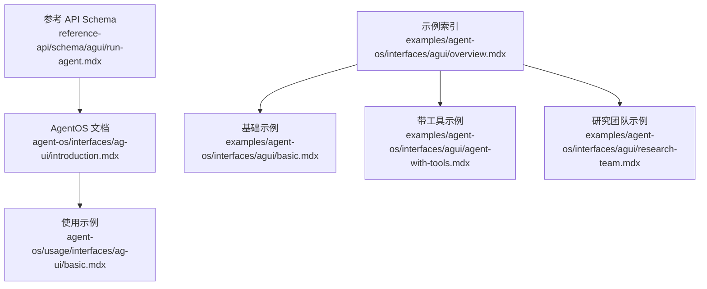
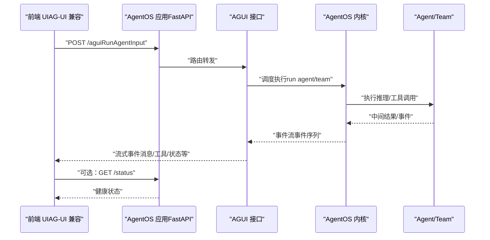
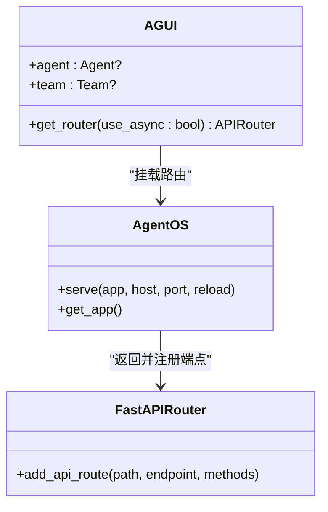
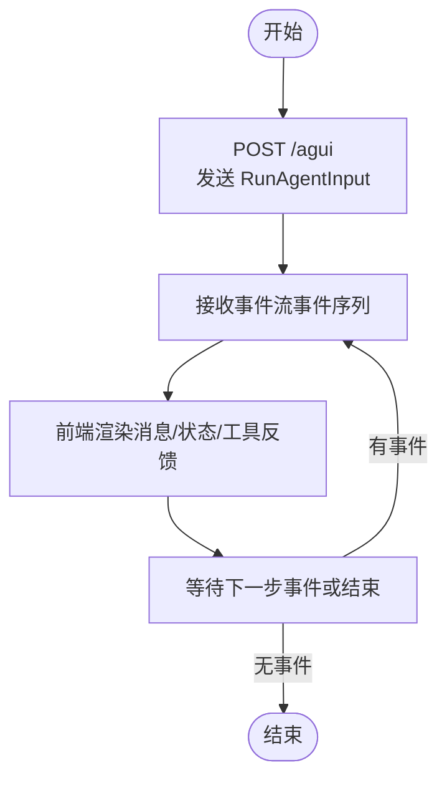
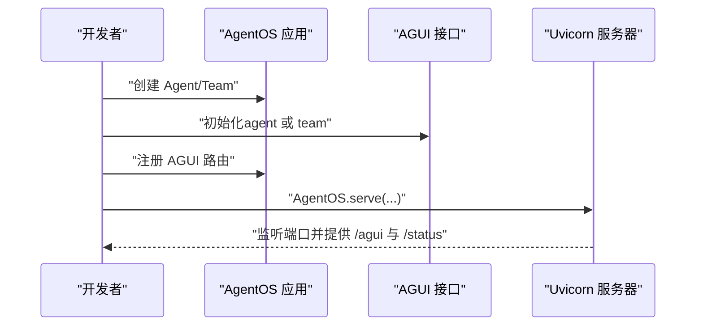
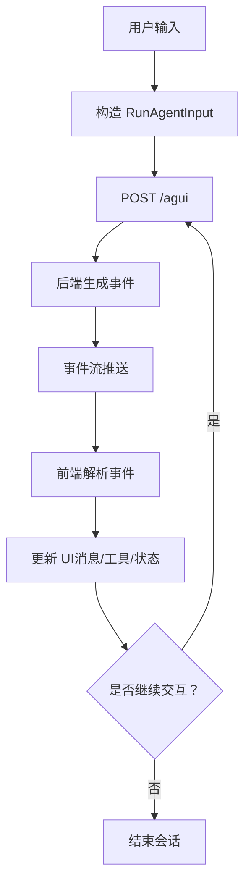
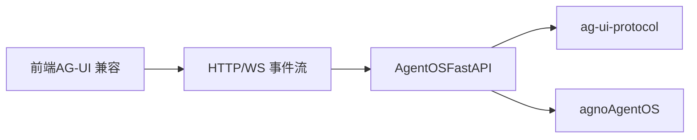

# AG-UI 接口

<cite>
**本文引用的文件**
- [agent-os/interfaces/ag-ui/introduction.mdx](file://agent-os/interfaces/ag-ui/introduction.mdx)
- [agent-os/usage/interfaces/ag-ui/basic.mdx](file://agent-os/usage/interfaces/ag-ui/basic.mdx)
- [examples/agent-os/interfaces/agui/overview.mdx](file://examples/agent-os/interfaces/agui/overview.mdx)
- [examples/agent-os/interfaces/agui/basic.mdx](file://examples/agent-os/interfaces/agui/basic.mdx)
- [examples/agent-os/interfaces/agui/agent-with-tools.mdx](file://examples/agent-os/interfaces/agui/agent-with-tools.mdx)
- [examples/agent-os/interfaces/agui/research-team.mdx](file://examples/agent-os/interfaces/agui/research-team.mdx)
- [reference-api/schema/agui/run-agent.mdx](file://reference-api/schema/agui/run-agent.mdx)
</cite>

## 目录
1. [简介](#简介)
2. [项目结构](#项目结构)
3. [核心组件](#核心组件)
4. [架构总览](#架构总览)
5. [详细组件分析](#详细组件分析)
6. [依赖关系分析](#依赖关系分析)
7. [性能考虑](#性能考虑)
8. [故障排查指南](#故障排查指南)
9. [结论](#结论)
10. [附录](#附录)

## 简介
本文件面向需要在前端应用中集成 AG-UI 协议并与 AgentOS 代理进行交互的开发者。AG-UI 是一个开放的“智能体-用户交互协议”，用于标准化前端与后端智能体（Agent/Team）之间的通信。通过 AG-UI，前端可以以统一的方式接收事件流、发送输入并管理会话状态，从而构建类似 ChatGPT 的对话界面与多智能体协作体验。

本指南涵盖：
- AG-UI 协议与通信机制概述
- 后端（AgentOS + AGUI 接口）的配置与部署要点
- 前端（AG-UI 协议兼容的 UI）接入流程与最佳实践
- 消息格式与事件处理机制
- 用户体验设计原则（实时消息、交互反馈）
- 性能优化建议（消息去重、延迟加载）
- 与现代前端框架（React/Vue/Angular）的集成思路

## 项目结构
围绕 AG-UI 的文档与示例主要分布在以下位置：
- AgentOS 接口说明：介绍 AGUI 接口的初始化参数、关键方法、端点与服务方式
- 使用示例：基础聊天、带工具的智能体、研究团队等
- 参考 API：定义 AG-UI 主入口端点的 OpenAPI 描述
- 示例索引：聚合 AG-UI 相关示例，便于快速定位

**图表来源**
- [agent-os/interfaces/ag-ui/introduction.mdx](file://agent-os/interfaces/ag-ui/introduction.mdx)
- [agent-os/usage/interfaces/ag-ui/basic.mdx](file://agent-os/usage/interfaces/ag-ui/basic.mdx)
- [examples/agent-os/interfaces/agui/overview.mdx](file://examples/agent-os/interfaces/agui/overview.mdx)
- [examples/agent-os/interfaces/agui/basic.mdx](file://examples/agent-os/interfaces/agui/basic.mdx)
- [examples/agent-os/interfaces/agui/agent-with-tools.mdx](file://examples/agent-os/interfaces/agui/agent-with-tools.mdx)
- [examples/agent-os/interfaces/agui/research-team.mdx](file://examples/agent-os/interfaces/agui/research-team.mdx)
- [reference-api/schema/agui/run-agent.mdx](file://reference-api/schema/agui/run-agent.mdx)

**章节来源**
- [agent-os/interfaces/ag-ui/introduction.mdx](file://agent-os/interfaces/ag-ui/introduction.mdx)
- [agent-os/usage/interfaces/ag-ui/basic.mdx](file://agent-os/usage/interfaces/ag-ui/basic.mdx)
- [examples/agent-os/interfaces/agui/overview.mdx](file://examples/agent-os/interfaces/agui/overview.mdx)
- [reference-api/schema/agui/run-agent.mdx](file://reference-api/schema/agui/run-agent.mdx)

## 核心组件
- AGUI 接口（后端）
  - 作用：将 AgentOS 应用暴露为符合 AG-UI 协议的服务端点，挂载路由并提供主入口与健康检查端点
  - 关键参数：agent 或 team（二选一），用于绑定具体智能体或团队
  - 关键方法：get_router 返回 FastAPI 路由器并附加端点
  - 端点：
    - POST /agui：主入口，接收 RunAgentInput 并流式返回 AG-UI 事件
    - GET /status：健康/状态检查
- AgentOS 服务化：通过 serve 方法以 Uvicorn 运行应用，支持 host/port/reload 等参数
- 前端（AG-UI 协议兼容 UI）：通过标准 HTTP/WS 流消费事件，渲染消息、处理用户输入与工具调用反馈

**章节来源**
- [agent-os/interfaces/ag-ui/introduction.mdx](file://agent-os/interfaces/ag-ui/introduction.mdx)

## 架构总览
下图展示了从浏览器到 AgentOS 的典型请求链路，以及事件流的传输方向：

**图表来源**
- [agent-os/interfaces/ag-ui/introduction.mdx](file://agent-os/interfaces/ag-ui/introduction.mdx)
- [reference-api/schema/agui/run-agent.mdx](file://reference-api/schema/agui/run-agent.mdx)

## 详细组件分析

### AGUI 接口与端点
- 初始化参数
  - agent：Agno Agent 实例
  - team：Agno Team 实例
  - 二者二选一
- 关键方法
  - get_router(use_async: bool = True) -> APIRouter：返回挂载了 AG-UI 路由的路由器
- 端点
  - POST /agui：接收 RunAgentInput，流式输出 AG-UI 事件
  - GET /status：健康/状态检查
- 服务化
  - AgentOS.serve(app, host, port, reload)：以 Uvicorn 启动应用

**图表来源**
- [agent-os/interfaces/ag-ui/introduction.mdx](file://agent-os/interfaces/ag-ui/introduction.mdx)

**章节来源**
- [agent-os/interfaces/ag-ui/introduction.mdx](file://agent-os/interfaces/ag-ui/introduction.mdx)

### RunAgentInput 与事件流（协议要点）
- 请求端点：POST /agui
- 输入类型：RunAgentInput（来自 ag-ui-protocol）
- 输出形式：事件流（事件序列），前端按序消费
- 健康检查：GET /status

**图表来源**
- [reference-api/schema/agui/run-agent.mdx](file://reference-api/schema/agui/run-agent.mdx)
- [agent-os/interfaces/ag-ui/introduction.mdx](file://agent-os/interfaces/ag-ui/introduction.mdx)

**章节来源**
- [reference-api/schema/agui/run-agent.mdx](file://reference-api/schema/agui/run-agent.mdx)
- [agent-os/interfaces/ag-ui/introduction.mdx](file://agent-os/interfaces/ag-ui/introduction.mdx)

### 后端示例与运行方式
- 基础示例：创建 Agent，注入 AGUI 接口，启动服务
- 工具示例：为 Agent 注入工具（含外部执行能力），演示前端可视化与交互
- 团队示例：以 Team 形式组织多成员协作，统一通过 AGUI 暴露

**图表来源**
- [examples/agent-os/interfaces/agui/basic.mdx](file://examples/agent-os/interfaces/agui/basic.mdx)
- [examples/agent-os/interfaces/agui/agent-with-tools.mdx](file://examples/agent-os/interfaces/agui/agent-with-tools.mdx)
- [examples/agent-os/interfaces/agui/research-team.mdx](file://examples/agent-os/interfaces/agui/research-team.mdx)
- [agent-os/interfaces/ag-ui/introduction.mdx](file://agent-os/interfaces/ag-ui/introduction.mdx)

**章节来源**
- [examples/agent-os/interfaces/agui/basic.mdx](file://examples/agent-os/interfaces/agui/basic.mdx)
- [examples/agent-os/interfaces/agui/agent-with-tools.mdx](file://examples/agent-os/interfaces/agui/agent-with-tools.mdx)
- [examples/agent-os/interfaces/agui/research-team.mdx](file://examples/agent-os/interfaces/agui/research-team.mdx)

### 前端集成指南（AG-UI 客户端）
- 前端 SDK 与 UI
  - 使用 AG-UI 协议兼容的前端 SDK 与 UI（例如 Dojo）
  - 步骤概览：克隆 AG-UI 仓库、安装依赖、构建 Agno 集成包、启动 Dojo、访问本地地址
- 事件消费
  - 订阅 /agui 事件流，按事件类型更新 UI（消息、工具调用、状态变更）
  - 提供输入提交、取消、确认等交互通道
- 会话与状态
  - 维护会话上下文，支持历史消息回放与增量更新
  - 健康检查 /status 用于诊断服务可用性

**章节来源**
- [agent-os/usage/interfaces/ag-ui/basic.mdx](file://agent-os/usage/interfaces/ag-ui/basic.mdx)
- [agent-os/interfaces/ag-ui/introduction.mdx](file://agent-os/interfaces/ag-ui/introduction.mdx)

### 消息格式与事件处理机制
- 输入格式：RunAgentInput（来自 ag-ui-protocol）
- 事件格式：事件序列（事件类型、索引、负载等）
- 处理流程：
  - 前端发送 RunAgentInput 到 /agui
  - 后端按顺序产生事件并推送
  - 前端根据事件类型渲染 UI，并允许用户继续交互

**图表来源**
- [agent-os/interfaces/ag-ui/introduction.mdx](file://agent-os/interfaces/ag-ui/introduction.mdx)
- [reference-api/schema/agui/run-agent.mdx](file://reference-api/schema/agui/run-agent.mdx)

**章节来源**
- [agent-os/interfaces/ag-ui/introduction.mdx](file://agent-os/interfaces/ag-ui/introduction.mdx)
- [reference-api/schema/agui/run-agent.mdx](file://reference-api/schema/agui/run-agent.mdx)

### 用户体验设计原则
- 实时消息显示
  - 采用事件流增量渲染，避免全量刷新
  - 支持 Markdown 渲染与富文本展示
- 交互反馈
  - 工具执行前后的提示与进度反馈
  - 用户确认与中断机制
- 上下文感知
  - 时间、位置、历史等上下文增强响应质量
- 响应式布局
  - 适配桌面与移动设备，保证输入与消息区域清晰

**章节来源**
- [agent-os/usage/interfaces/ag-ui/basic.mdx](file://agent-os/usage/interfaces/ag-ui/basic.mdx)
- [examples/agent-os/interfaces/agui/agent-with-tools.mdx](file://examples/agent-os/interfaces/agui/agent-with-tools.mdx)

### 性能优化技巧
- 消息去重
  - 基于事件索引或内容指纹去重，避免重复渲染
- 延迟加载
  - 对长消息与图片资源采用懒加载策略
- 事件批处理
  - 将连续的小事件合并，减少 UI 刷新频率
- 缓存与预取
  - 缓存常用工具结果与上下文片段，提升响应速度
- 服务端限流
  - 在后端对事件速率进行合理控制，防止前端过载

[本节为通用指导，无需特定文件引用]

## 依赖关系分析
- 后端依赖
  - agno（AgentOS 与智能体框架）
  - ag-ui-protocol（协议规范与 RunAgentInput 类型）
  - FastAPI（路由与服务）
- 前端依赖
  - AG-UI TypeScript SDK
  - 前端框架（React/Vue/Angular）与状态管理
- 部署依赖
  - Uvicorn（ASGI 服务器）
  - 可选：反向代理、WebSocket 支持（视前端实现而定）

**图表来源**
- [agent-os/interfaces/ag-ui/introduction.mdx](file://agent-os/interfaces/ag-ui/introduction.mdx)

**章节来源**
- [agent-os/interfaces/ag-ui/introduction.mdx](file://agent-os/interfaces/ag-ui/introduction.mdx)

## 性能考虑
- 事件流优化
  - 控制事件粒度与频率，避免过度细碎的事件导致 UI 抖动
- 前端渲染优化
  - 使用虚拟滚动、分页加载长历史
  - 图片与多媒体资源懒加载
- 网络与并发
  - 合理设置超时与重试策略
  - 并发工具调用时进行排队与去重
- 存储与缓存
  - 会话与历史缓存至本地存储或服务端缓存
  - 分页获取历史，避免一次性加载过多数据

[本节为通用指导，无需特定文件引用]

## 故障排查指南
- 端点不可达
  - 检查 /status 是否返回健康状态
  - 确认 AgentOS.serve 的 host/port 配置
- 事件流异常
  - 核对 /agui 的请求格式与事件索引连续性
  - 检查后端日志与错误码
- 工具执行失败
  - 确认工具权限与外部服务可用性
  - 查看工具调用事件中的错误信息
- 前端卡顿
  - 检查事件渲染逻辑，避免频繁重绘
  - 启用延迟加载与去重策略

**章节来源**
- [agent-os/interfaces/ag-ui/introduction.mdx](file://agent-os/interfaces/ag-ui/introduction.mdx)

## 结论
AG-UI 协议为前端与 AgentOS 智能体/团队提供了标准化的交互通道。通过 AGUI 接口，后端可快速暴露统一的 /agui 与 /status 端点；前端可基于事件流实现实时、可扩展的对话与协作界面。结合合理的事件处理、去重与延迟加载策略，可在复杂场景下保持良好的用户体验与系统性能。

[本节为总结性内容，无需特定文件引用]

## 附录

### 快速开始（后端）
- 安装依赖：agno、ag-ui-protocol
- 创建 Agent/Team，初始化 AGUI 接口，注册到 AgentOS
- 启动服务：AgentOS.serve(app, host, port, reload)

**章节来源**
- [agent-os/interfaces/ag-ui/introduction.mdx](file://agent-os/interfaces/ag-ui/introduction.mdx)

### 快速开始（前端）
- 克隆 AG-UI 仓库，安装依赖
- 构建 Agno 集成包
- 启动 Dojo，访问本地地址
- 订阅 /agui 事件流并渲染 UI

**章节来源**
- [agent-os/usage/interfaces/ag-ui/basic.mdx](file://agent-os/usage/interfaces/ag-ui/basic.mdx)

### 示例索引
- 基础示例：[examples/agent-os/interfaces/agui/basic.mdx](file://examples/agent-os/interfaces/agui/basic.mdx)
- 带工具示例：[examples/agent-os/interfaces/agui/agent-with-tools.mdx](file://examples/agent-os/interfaces/agui/agent-with-tools.mdx)
- 研究团队示例：[examples/agent-os/interfaces/agui/research-team.mdx](file://examples/agent-os/interfaces/agui/research-team.mdx)

**章节来源**
- [examples/agent-os/interfaces/agui/overview.mdx](file://examples/agent-os/interfaces/agui/overview.mdx)