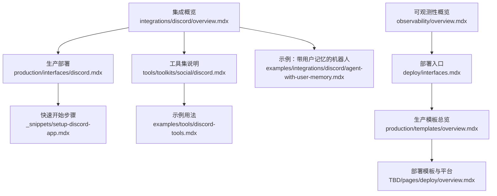
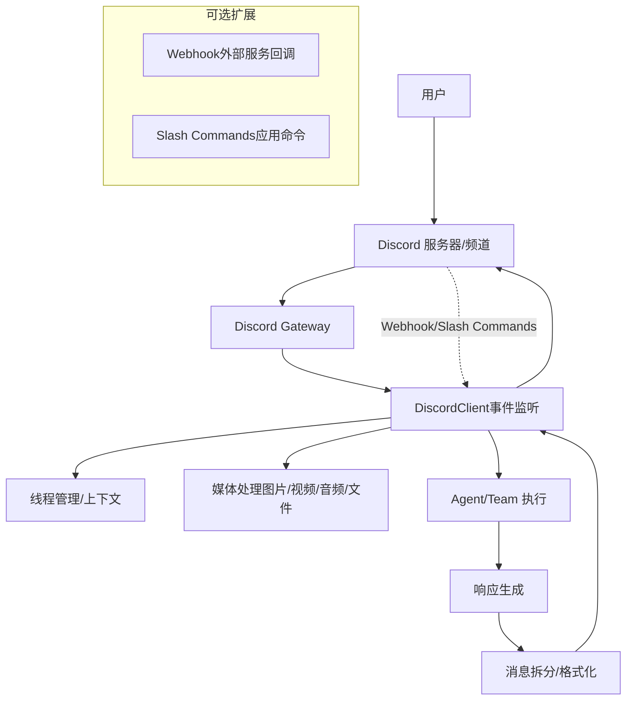
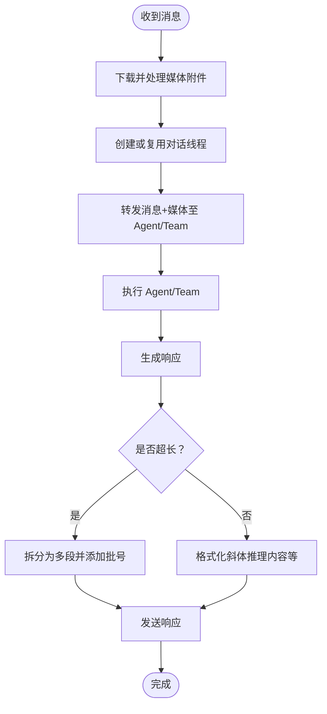
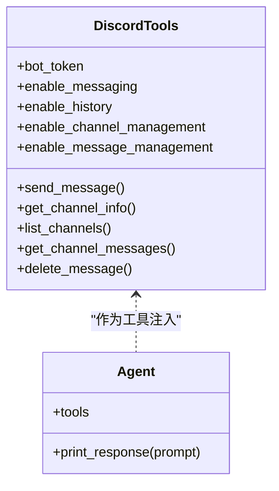
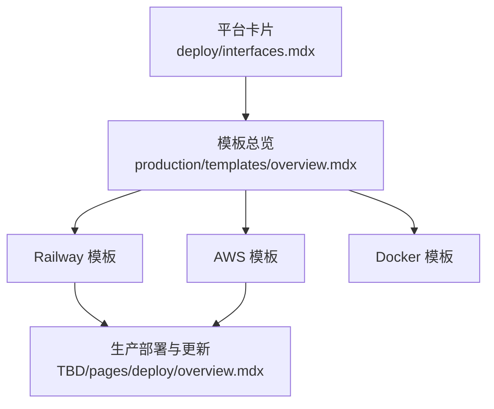

# Discord 接口

<cite>
**本文引用的文件**
- [integrations/discord/overview.mdx](file://integrations/discord/overview.mdx)
- [production/interfaces/discord.mdx](file://production/interfaces/discord.mdx)
- [_snippets/setup-discord-app.mdx](file://_snippets/setup-discord-app.mdx)
- [examples/tools/discord-tools.mdx](file://examples/tools/discord-tools.mdx)
- [tools/toolkits/social/discord.mdx](file://tools/toolkits/social/discord.mdx)
- [examples/integrations/discord/agent-with-user-memory.mdx](file://examples/integrations/discord/agent-with-user-memory.mdx)
- [observability/overview.mdx](file://observability/overview.mdx)
- [deploy/interfaces.mdx](file://deploy/interfaces.mdx)
- [production/overview.mdx](file://production/overview.mdx)
- [production/templates/overview.mdx](file://production/templates/overview.mdx)
- [TBD/pages/deploy/overview.mdx](file://TBD/pages/deploy/overview.mdx)
</cite>

## 目录
1. [简介](#简介)
2. [项目结构](#项目结构)
3. [核心组件](#核心组件)
4. [架构总览](#架构总览)
5. [详细组件分析](#详细组件分析)
6. [依赖关系分析](#依赖关系分析)
7. [性能考虑](#性能考虑)
8. [故障排查指南](#故障排查指南)
9. [结论](#结论)
10. [附录](#附录)

## 简介
本指南面向希望将 AgentOS 部署为 Discord 机器人的工程师与运营人员。内容覆盖从应用创建、Bot 令牌配置、服务器权限设置到事件处理机制（消息监听、命令解析、响应发送）；同时提供 Webhook 与 Slash Commands 的配置思路、性能优化策略（消息缓存与并发处理）、以及在大型服务器中的监控与错误处理最佳实践。

## 项目结构
围绕 Discord 接口的相关文档分布在以下位置：
- 集成概览：介绍 DiscordClient 的职责、事件处理、消息处理流程与特性
- 生产部署：提供从零到一的部署步骤、环境变量与邀请链接生成
- 快速开始：开发者配置步骤（应用创建、Bot 用户、意图与权限、环境变量、安装包、邀请与测试）
- 工具集：DiscordTools 的能力边界与参数说明
- 示例：以 Agent 为中心的 Discord 集成示例
- 可观测性：OpenTelemetry 支持与常见后端
- 部署入口：平台选择与模板总览

**图表来源**
- [integrations/discord/overview.mdx:1-119](file://integrations/discord/overview.mdx#L1-L119)
- [production/interfaces/discord.mdx:1-116](file://production/interfaces/discord.mdx#L1-L116)
- [_snippets/setup-discord-app.mdx:1-88](file://_snippets/setup-discord-app.mdx#L1-L88)
- [tools/toolkits/social/discord.mdx:1-51](file://tools/toolkits/social/discord.mdx#L1-L51)
- [examples/tools/discord-tools.mdx:1-148](file://examples/tools/discord-tools.mdx#L1-L148)
- [examples/integrations/discord/agent-with-user-memory.mdx:1-69](file://examples/integrations/discord/agent-with-user-memory.mdx#L1-L69)
- [observability/overview.mdx:1-25](file://observability/overview.mdx#L1-L25)
- [deploy/interfaces.mdx:1-38](file://deploy/interfaces.mdx#L1-L38)
- [production/templates/overview.mdx:1-28](file://production/templates/overview.mdx#L1-L28)
- [TBD/pages/deploy/overview.mdx:80-142](file://TBD/pages/deploy/overview.mdx#L80-L142)

**章节来源**
- [integrations/discord/overview.mdx:1-119](file://integrations/discord/overview.mdx#L1-L119)
- [production/interfaces/discord.mdx:1-116](file://production/interfaces/discord.mdx#L1-L116)
- [_snippets/setup-discord-app.mdx:1-88](file://_snippets/setup-discord-app.mdx#L1-L88)
- [tools/toolkits/social/discord.mdx:1-51](file://tools/toolkits/social/discord.mdx#L1-L51)
- [examples/tools/discord-tools.mdx:1-148](file://examples/tools/discord-tools.mdx#L1-L148)
- [examples/integrations/discord/agent-with-user-memory.mdx:1-69](file://examples/integrations/discord/agent-with-user-memory.mdx#L1-L69)
- [observability/overview.mdx:1-25](file://observability/overview.mdx#L1-L25)
- [deploy/interfaces.mdx:1-38](file://deploy/interfaces.mdx#L1-L38)
- [production/templates/overview.mdx:1-28](file://production/templates/overview.mdx#L1-L28)
- [TBD/pages/deploy/overview.mdx:80-142](file://TBD/pages/deploy/overview.mdx#L80-L142)

## 核心组件
- DiscordClient
  - 职责：封装 Agent 或 Team，通过 discord.py 连接 Discord Gateway，自动处理消息事件、媒体下载与转发、线程管理、长消息拆分与推理内容展示等
  - 启动方式：serve() 方法启动客户端
  - 关键参数：agent 或 team（二选一），用于承载业务逻辑
- DiscordTools
  - 能力：发送消息、读取消息历史、获取频道信息、列出频道、删除消息
  - 参数：bot_token、enable_messaging、enable_history、enable_channel_management、enable_message_management
  - 使用场景：将 Discord 操作作为工具注入到 Agent 中，实现“由 Agent 自主调用 Discord API”

**章节来源**
- [integrations/discord/overview.mdx:35-81](file://integrations/discord/overview.mdx#L35-L81)
- [tools/toolkits/social/discord.mdx:1-51](file://tools/toolkits/social/discord.mdx#L1-L51)
- [examples/tools/discord-tools.mdx:1-148](file://examples/tools/discord-tools.mdx#L1-L148)

## 架构总览
下图展示了从用户消息到 Agent 执行再到响应返回的端到端流程，以及可选的 Webhook 与 Slash Commands 的接入点。

**图表来源**
- [integrations/discord/overview.mdx:53-117](file://integrations/discord/overview.mdx#L53-L117)
- [production/interfaces/discord.mdx:34-105](file://production/interfaces/discord.mdx#L34-L105)

## 详细组件分析

### 组件一：DiscordClient 事件处理与消息处理流程
- 事件类型：消息事件（含媒体支持、自动线程创建）
- 处理步骤：接收消息 → 媒体下载与处理 → 线程管理 → 转发给 Agent/Team → 发送响应 → 长消息拆分与推理内容展示
- 特性：自动线程命名、媒体对象传递（图片/视频/音频/文件）、长文本拆分与批号标注、推理内容斜体显示

**图表来源**
- [integrations/discord/overview.mdx:82-117](file://integrations/discord/overview.mdx#L82-L117)

**章节来源**
- [integrations/discord/overview.mdx:53-117](file://integrations/discord/overview.mdx#L53-L117)

### 组件二：DiscordTools 工具集
- 能力矩阵：发送消息、读取消息历史、获取频道信息、列出频道、删除消息
- 参数控制：通过 enable_* 开关按需启用功能，降低权限暴露面
- 典型用法：将 DiscordTools 注入 Agent，使 Agent 能够自主调用 Discord API 完成社区管理、桥接外部工具与人机协作

**图表来源**
- [tools/toolkits/social/discord.mdx:28-51](file://tools/toolkits/social/discord.mdx#L28-L51)
- [examples/tools/discord-tools.mdx:1-148](file://examples/tools/discord-tools.mdx#L1-L148)

**章节来源**
- [tools/toolkits/social/discord.mdx:1-51](file://tools/toolkits/social/discord.mdx#L1-L51)
- [examples/tools/discord-tools.mdx:1-148](file://examples/tools/discord-tools.mdx#L1-L148)

### 组件三：Webhook 与 Slash Commands 配置思路
- Webhook：适用于外部服务向 Discord 回调或推送事件，可在应用侧接收并转换为内部事件，再交由 DiscordClient 处理
- Slash Commands：通过 OAuth2 URL 生成器勾选 applications.commands，授予 Bot 使用外部表情等权限；在应用中注册全局命令，由 Discord Gateway 分发到 Bot
- 注意：与 Slack/WhatsApp 不同，Discord Bot 无需额外 webhook 配置即可直连 Gateway，适合直接部署于持续运行的 Python 环境

**章节来源**
- [production/interfaces/discord.mdx:34-105](file://production/interfaces/discord.mdx#L34-L105)
- [_snippets/setup-discord-app.mdx:27-73](file://_snippets/setup-discord-app.mdx#L27-L73)

### 组件四：示例与最佳实践
- 示例：个人助理型机器人（带用户记忆）展示如何结合数据库与调试模式提升用户体验
- 最佳实践：按需启用工具功能、严格管理权限与意图、使用环境变量存储令牌、避免将令牌提交到版本控制

**章节来源**
- [examples/integrations/discord/agent-with-user-memory.mdx:27-69](file://examples/integrations/discord/agent-with-user-memory.mdx#L27-L69)
- [_snippets/setup-discord-app.mdx:85-88](file://_snippets/setup-discord-app.mdx#L85-L88)

## 依赖关系分析
- 平台与部署入口
  - 平台卡片：Slack、Discord、WhatsApp、Telegram、MCP、AG-UI
  - 模板总览：Docker、Railway、AWS 三种生产模板
- 部署平台：Railway、AWS ECS、Google Cloud Run、Azure Container Apps 等容器化平台均可承载 Discord Bot

**图表来源**
- [deploy/interfaces.mdx:8-34](file://deploy/interfaces.mdx#L8-L34)
- [production/templates/overview.mdx:1-28](file://production/templates/overview.mdx#L1-L28)
- [TBD/pages/deploy/overview.mdx:80-142](file://TBD/pages/deploy/overview.mdx#L80-L142)

**章节来源**
- [deploy/interfaces.mdx:1-38](file://deploy/interfaces.mdx#L1-L38)
- [production/templates/overview.mdx:1-28](file://production/templates/overview.mdx#L1-L28)
- [TBD/pages/deploy/overview.mdx:80-142](file://TBD/pages/deploy/overview.mdx#L80-L142)

## 性能考虑
- 消息缓存
  - 对频繁访问的频道信息与最近消息进行短期缓存，减少重复请求
  - 缓存键建议包含 guild_id/channel_id/timestamp，避免跨服务器污染
- 并发处理
  - 将消息处理与 Agent 执行解耦，使用队列或异步任务处理长耗时操作
  - 控制并发上限，避免在高负载时触发 Discord API 限流
- 响应优化
  - 长文本自动拆分并添加批号，避免单条消息超长
  - 斜体显示推理内容，提升可读性
- 媒体处理
  - 对大文件采用流式下载与处理，避免内存峰值过高
  - 对图片/视频/音频进行预校验与尺寸限制，降低下游压力

[本节为通用性能建议，不直接分析具体文件，故无“章节来源”]

## 故障排查指南
- 环境变量与安全
  - 确保 DISCORD_BOT_TOKEN 已正确导出或写入 .env/.envrc，并被 shell 正确加载
  - 严禁将令牌提交到版本控制，使用受控配置管理
- 权限与意图
  - 必须开启 Message Content Intent 以读取消息内容
  - 根据需求开启 Server Members Intent、Presence Intent（可选）
  - Bot 权限至少包含：发送消息、读取历史、创建公共线程、上传文件、嵌入链接
- 测试路径
  - 启动应用后，在有权限的频道发送消息，确认自动创建线程并得到回复
  - 如为媒体型机器人，尝试上传图片/文件验证媒体处理链路
- 可观测性
  - 使用 OpenTelemetry 自动埋点，追踪 Agent 执行链路与错误
  - 常见后端：Arize Phoenix、Langfuse、Langsmith、Langtrace、Logfire、Maxim、MLflow、OpenLIT、Traceloop、Weave

**章节来源**
- [_snippets/setup-discord-app.mdx:40-88](file://_snippets/setup-discord-app.mdx#L40-L88)
- [observability/overview.mdx:1-25](file://observability/overview.mdx#L1-L25)

## 结论
通过上述步骤与最佳实践，您可以将 AgentOS 高效、稳定地部署为 Discord 机器人。建议从最小可行配置入手，逐步启用所需权限与功能；在生产环境中配合 OpenTelemetry 实现可观测性，并利用缓存与并发控制保障大规模服务器下的稳定性。

[本节为总结性内容，不直接分析具体文件，故无“章节来源”]

## 附录

### A. 从零到一：生产部署清单
- 准备工作：Python 3.7+、Discord 账号与服务器管理权限、安装 discord.py 与 agno
- 创建应用与 Bot 用户，复制并保存 Bot Token
- 配置意图与权限：启用 Message Content Intent、Server Members Intent（可选）、赋予发送消息、读取历史、创建线程、上传文件、嵌入链接等权限
- 设置环境变量：在 .env/.envrc 中写入 DISCORD_BOT_TOKEN，并确保被 shell 加载
- 生成邀请链接：OAuth2 URL 生成器中勾选 bot 与 applications.commands（如需 Slash Commands），选择对应权限
- 部署与验证：在 Railway/AWS/Docker 等平台部署，运行应用并在频道测试

**章节来源**
- [production/interfaces/discord.mdx:34-105](file://production/interfaces/discord.mdx#L34-L105)
- [_snippets/setup-discord-app.mdx:1-88](file://_snippets/setup-discord-app.mdx#L1-L88)

### B. 模板与平台参考
- 模板总览：Docker、Railway、AWS 三类模板，分别面向本地开发、快速上线与企业级生产
- 平台选择：Railway 适合 MVP 快速上线；AWS 提供企业级可靠性与控制；其他平台如 Google Cloud Run、Azure Container Apps 等亦可承载

**章节来源**
- [production/templates/overview.mdx:1-28](file://production/templates/overview.mdx#L1-L28)
- [TBD/pages/deploy/overview.mdx:80-142](file://TBD/pages/deploy/overview.mdx#L80-L142)