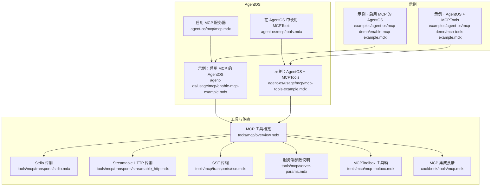
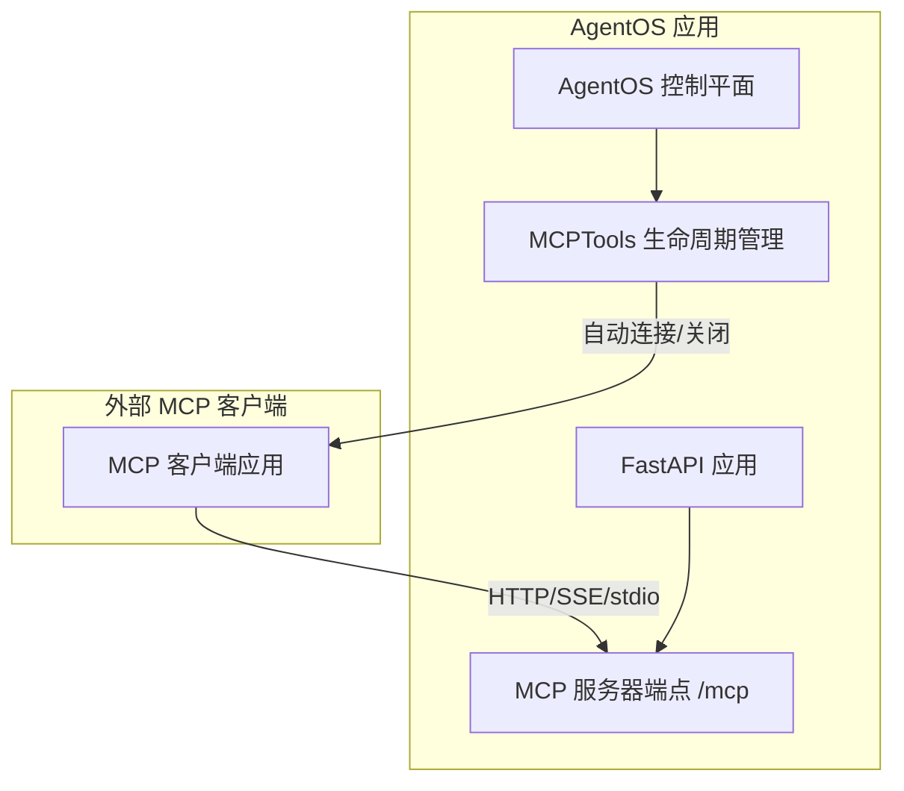
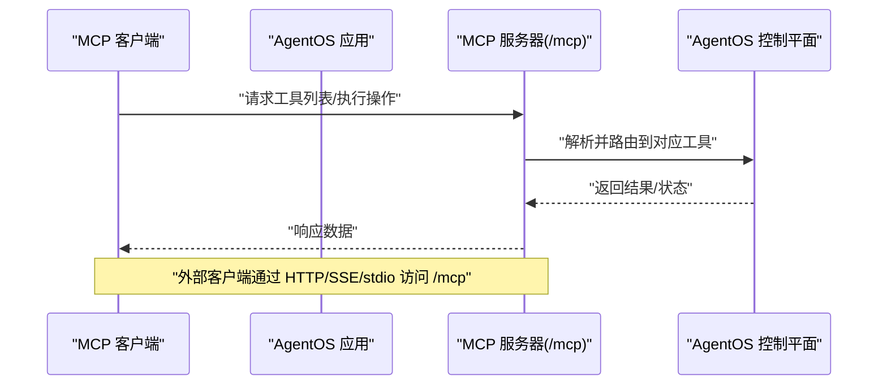
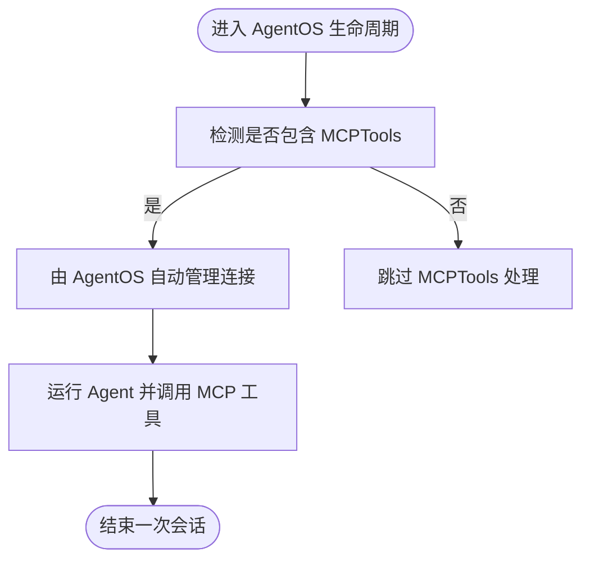
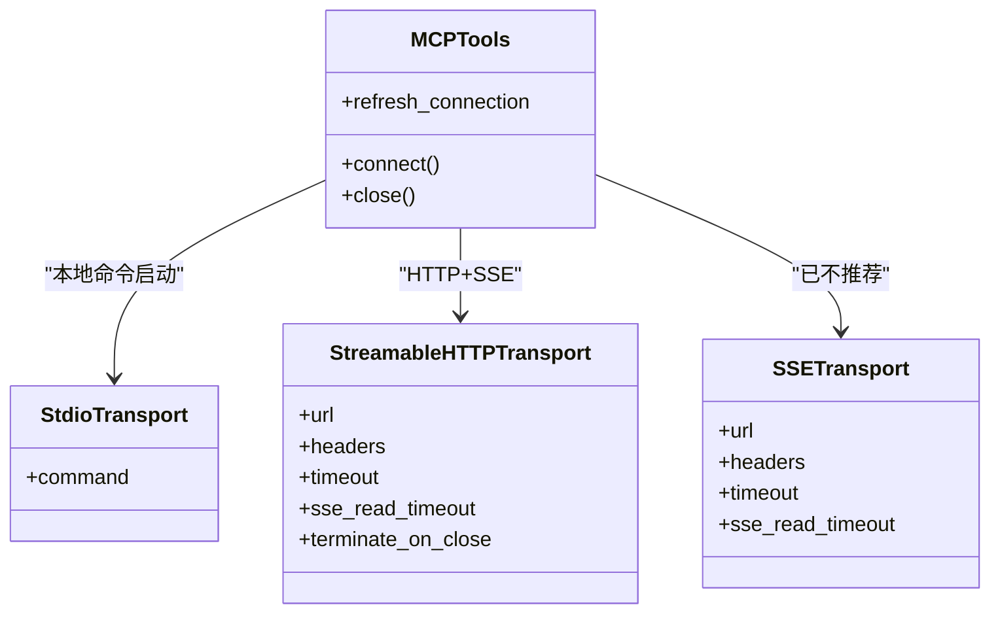
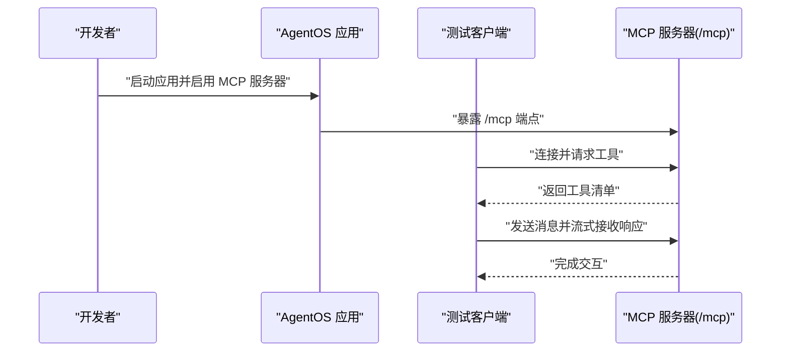
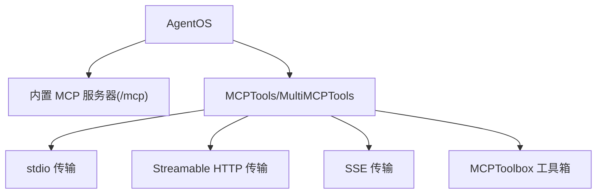

# MCP 接口

<cite>
**本文引用的文件**
- [agent-os/mcp/mcp.mdx](file://agent-os/mcp/mcp.mdx)
- [agent-os/mcp/tools.mdx](file://agent-os/mcp/tools.mdx)
- [agent-os/usage/mcp/enable-mcp-example.mdx](file://agent-os/usage/mcp/enable-mcp-example.mdx)
- [agent-os/usage/mcp/mcp-tools-example.mdx](file://agent-os/usage/mcp/mcp-tools-example.mdx)
- [tools/mcp/overview.mdx](file://tools/mcp/overview.mdx)
- [cookbook/tools/mcp.mdx](file://cookbook/tools/mcp.mdx)
- [tools/mcp/transports/stdio.mdx](file://tools/mcp/transports/stdio.mdx)
- [tools/mcp/transports/streamable_http.mdx](file://tools/mcp/transports/streamable_http.mdx)
- [tools/mcp/transports/sse.mdx](file://tools/mcp/transports/sse.mdx)
- [tools/mcp/server-params.mdx](file://tools/mcp/server-params.mdx)
- [tools/mcp/mcp-toolbox.mdx](file://tools/mcp/mcp-toolbox.mdx)
- [examples/agent-os/mcp-demo/enable-mcp-example.mdx](file://examples/agent-os/mcp-demo/enable-mcp-example.mdx)
- [examples/agent-os/mcp-demo/mcp-tools-example.mdx](file://examples/agent-os/mcp-demo/mcp-tools-example.mdx)
</cite>

## 目录
1. [简介](#简介)
2. [项目结构](#项目结构)
3. [核心组件](#核心组件)
4. [架构总览](#架构总览)
5. [详细组件分析](#详细组件分析)
6. [依赖关系分析](#依赖关系分析)
7. [性能考虑](#性能考虑)
8. [故障排查指南](#故障排查指南)
9. [结论](#结论)
10. [附录](#附录)

## 简介
本文件面向希望使用 MCP（Model Context Protocol）协议将 AgentOS 代理对外暴露为 MCP 服务器，或在不同环境中集成 MCP 客户端的工程师与技术文档读者。内容涵盖：
- 如何将 AgentOS 暴露为 MCP 服务器，以及可用的内置 MCP 工具集
- MCP 服务器配置要点：传输协议选择、认证与连接管理
- 在多种运行环境（本地、容器、云）中集成 MCP 客户端的方法
- 性能优化策略（连接复用、消息序列化、并发控制）
- 监控与调试建议，保障接口稳定性与可维护性

## 项目结构
围绕 MCP 的文档分布在以下区域：
- AgentOS 层面：启用 MCP 服务器、内置工具清单、在 AgentOS 中使用 MCPTools 的注意事项
- 工具层：MCPTools/MultiMCPTools 的通用用法、传输协议（stdio、Streamable HTTP、SSE）、服务端参数
- 示例与食谱：多服务器组合、工具过滤、本地自建 MCP 服务器、MCPToolbox 数据库工具箱
- 使用示例：完整可运行的 AgentOS + MCP 启用示例与客户端测试



**图表来源**
- [agent-os/mcp/mcp.mdx:1-146](file://agent-os/mcp/mcp.mdx#L1-L146)
- [agent-os/mcp/tools.mdx:1-57](file://agent-os/mcp/tools.mdx#L1-L57)
- [tools/mcp/overview.mdx:1-240](file://tools/mcp/overview.mdx#L1-L240)
- [tools/mcp/transports/stdio.mdx:1-82](file://tools/mcp/transports/stdio.mdx#L1-L82)
- [tools/mcp/transports/streamable_http.mdx:1-42](file://tools/mcp/transports/streamable_http.mdx#L1-L42)
- [tools/mcp/transports/sse.mdx:1-38](file://tools/mcp/transports/sse.mdx#L1-L38)
- [tools/mcp/server-params.mdx:26-37](file://tools/mcp/server-params.mdx#L26-L37)
- [tools/mcp/mcp-toolbox.mdx:1-252](file://tools/mcp/mcp-toolbox.mdx#L1-L252)
- [cookbook/tools/mcp.mdx:1-242](file://cookbook/tools/mcp.mdx#L1-L242)
- [examples/agent-os/mcp-demo/enable-mcp-example.mdx:1-75](file://examples/agent-os/mcp-demo/enable-mcp-example.mdx#L1-L75)
- [examples/agent-os/mcp-demo/mcp-tools-example.mdx:1-75](file://examples/agent-os/mcp-demo/mcp-tools-example.mdx#L1-L75)

**章节来源**
- [agent-os/mcp/mcp.mdx:1-146](file://agent-os/mcp/mcp.mdx#L1-L146)
- [agent-os/mcp/tools.mdx:1-57](file://agent-os/mcp/tools.mdx#L1-L57)
- [tools/mcp/overview.mdx:1-240](file://tools/mcp/overview.mdx#L1-L240)
- [cookbook/tools/mcp.mdx:1-242](file://cookbook/tools/mcp.mdx#L1-L242)

## 核心组件
- AgentOS MCP 服务器：通过在创建 AgentOS 实例时设置开关，即可在默认 API 之外暴露一个 LLM 友好的 MCP 服务器端点，便于外部 MCP 客户端直接连接。
- 内置 MCP 工具：AgentOS 作为 MCP 服务器时，提供一组标准化工具，覆盖配置查询、Agent/Team/Workflow 运行、会话与记忆管理等。
- MCPTools/MultiMCPTools：用于在 Agent 中接入外部 MCP 服务器，支持命令行启动、URL 直连、传输协议选择与连接生命周期管理。
- MCPToolbox：针对数据库 MCPToolbox 场景，提供按工具集或工具名筛选的能力，避免“工具过载”，提升 Agent 的聚焦度与安全性。

**章节来源**
- [agent-os/mcp/mcp.mdx:62-146](file://agent-os/mcp/mcp.mdx#L62-L146)
- [tools/mcp/overview.mdx:10-240](file://tools/mcp/overview.mdx#L10-L240)
- [tools/mcp/mcp-toolbox.mdx:13-252](file://tools/mcp/mcp-toolbox.mdx#L13-L252)

## 架构总览
下图展示了 AgentOS 作为 MCP 服务器与外部 MCP 客户端之间的交互路径，以及 AgentOS 内部对 MCPTools 生命周期的托管方式。



**图表来源**
- [agent-os/mcp/mcp.mdx:7-146](file://agent-os/mcp/mcp.mdx#L7-L146)
- [agent-os/mcp/tools.mdx:11-16](file://agent-os/mcp/tools.mdx#L11-L16)

**章节来源**
- [agent-os/mcp/mcp.mdx:7-146](file://agent-os/mcp/mcp.mdx#L7-L146)
- [agent-os/mcp/tools.mdx:11-16](file://agent-os/mcp/tools.mdx#L11-L16)

## 详细组件分析

### AgentOS 作为 MCP 服务器
- 启用方式：在创建 AgentOS 实例时开启 MCP 服务器开关，随后通过默认应用对象暴露 /mcp 端点。
- 内置工具清单：包括获取 AgentOS 配置、运行 Agent/Team/Workflow、查询与管理会话、用户记忆的创建/更新/删除等。
- 使用场景：当需要让外部 MCP 客户端直接调用 AgentOS 的控制能力时，该模式最为合适。



**图表来源**
- [agent-os/mcp/mcp.mdx:24-56](file://agent-os/mcp/mcp.mdx#L24-L56)

**章节来源**
- [agent-os/mcp/mcp.mdx:9-146](file://agent-os/mcp/mcp.mdx#L9-L146)

### 在 AgentOS 中使用 MCPTools
- 自动生命周期管理：在 AgentOS 中使用 MCPTools 时，其连接生命周期由 AgentOS 自动管理；无需手动 connect/close。
- 注意事项：若使用 MCPTools，请勿在 serve 时启用热重载，以避免 FastAPI 生命周期导致的连接中断。
- 手动刷新连接：可通过刷新连接参数在每次运行前检查并重建连接，适合托管型 MCP 服务器频繁重启或工具清单变化的场景。



**图表来源**
- [agent-os/mcp/tools.mdx:11-16](file://agent-os/mcp/tools.mdx#L11-L16)

**章节来源**
- [agent-os/mcp/tools.mdx:11-56](file://agent-os/mcp/tools.mdx#L11-L56)

### MCP 传输协议与配置
- Stdio 传输：默认传输，适合本地集成；通过命令行启动 MCP 服务器，Agent 直接与其通信。
- Streamable HTTP 传输：推荐用于生产环境，支持多客户端连接与 SSE 流式推送。
- SSE 传输：已被 MCP 协议新版本替代，仍可使用但不推荐。
- 服务端参数：根据所选传输协议，分别使用对应的客户端参数对象，可配置 URL、Headers、超时、SSE 读取超时、关闭时终止等。



**图表来源**
- [tools/mcp/transports/stdio.mdx:1-82](file://tools/mcp/transports/stdio.mdx#L1-L82)
- [tools/mcp/transports/streamable_http.mdx:1-42](file://tools/mcp/transports/streamable_http.mdx#L1-L42)
- [tools/mcp/transports/sse.mdx:1-38](file://tools/mcp/transports/sse.mdx#L1-L38)
- [tools/mcp/server-params.mdx:26-37](file://tools/mcp/server-params.mdx#L26-L37)

**章节来源**
- [tools/mcp/transports/stdio.mdx:6-30](file://tools/mcp/transports/stdio.mdx#L6-L30)
- [tools/mcp/transports/streamable_http.mdx:6-42](file://tools/mcp/transports/streamable_http.mdx#L6-L42)
- [tools/mcp/transports/sse.mdx:6-38](file://tools/mcp/transports/sse.mdx#L6-L38)
- [tools/mcp/server-params.mdx:26-37](file://tools/mcp/server-params.mdx#L26-L37)

### MCPToolbox 工具箱（数据库场景）
- 能力概述：基于 Google 的 MCPToolbox，支持按工具集或工具名筛选，减少工具数量，降低 Agent 的认知负担。
- 典型流程：连接 MCPToolbox 服务器 → 加载指定工具集 → 将筛选后的工具注入 Agent → 执行任务。
- 参数与函数：支持 URL、工具集/工具名、Headers、传输协议等参数；提供连接、加载工具/工具集、安全加载、获取底层客户端、关闭连接等方法。

```mermaid
sequenceDiagram
participant Agent as "Agent"
participant Box as "MCPToolbox"
participant Server as "MCPToolbox 服务器"
Agent->>Box : "初始化并连接"
Box->>Server : "请求工具清单"
Server-->>Box : "返回全部工具"
Box->>Box : "按工具集/工具名筛选"
Box-->>Agent : "返回筛选后的工具集合"
Agent->>Box : "调用具体工具"
Box-->>Agent : "返回执行结果"
```

**图表来源**
- [tools/mcp/mcp-toolbox.mdx:93-114](file://tools/mcp/mcp-toolbox.mdx#L93-L114)

**章节来源**
- [tools/mcp/mcp-toolbox.mdx:13-252](file://tools/mcp/mcp-toolbox.mdx#L13-L252)

### 完整示例与客户端集成
- AgentOS 启用 MCP：创建 AgentOS 实例并开启 MCP 服务器，随后启动应用并在本地访问 /mcp 端点。
- 客户端测试：使用 MCPTools 以 Streamable HTTP 传输连接本地 /mcp 端点，构建 Agent 并发起对话。
- 多服务器与工具过滤：可在单个 Agent 中组合多个 MCPTools，或通过 include/exclude 工具限制可用工具集。



**图表来源**
- [agent-os/usage/mcp/enable-mcp-example.mdx:54-78](file://agent-os/usage/mcp/enable-mcp-example.mdx#L54-L78)
- [examples/agent-os/mcp-demo/enable-mcp-example.mdx:40-61](file://examples/agent-os/mcp-demo/enable-mcp-example.mdx#L40-L61)

**章节来源**
- [agent-os/usage/mcp/enable-mcp-example.mdx:1-133](file://agent-os/usage/mcp/enable-mcp-example.mdx#L1-L133)
- [agent-os/usage/mcp/mcp-tools-example.mdx:1-95](file://agent-os/usage/mcp/mcp-tools-example.mdx#L1-L95)
- [cookbook/tools/mcp.mdx:133-151](file://cookbook/tools/mcp.mdx#L133-L151)

## 依赖关系分析
- AgentOS 与 MCP 工具链：AgentOS 通过内置 MCP 服务器与 MCPTools/MultiMCPTools 两类组件与外部系统解耦。
- 传输协议依赖：不同传输协议对应不同的客户端参数与行为，需按协议正确配置。
- 工具筛选依赖：MCPToolbox 依赖 MCPToolbox 服务器提供的工具清单，并在客户端侧进行筛选。



**图表来源**
- [agent-os/mcp/mcp.mdx:7-146](file://agent-os/mcp/mcp.mdx#L7-L146)
- [tools/mcp/overview.mdx:212-240](file://tools/mcp/overview.mdx#L212-L240)
- [tools/mcp/mcp-toolbox.mdx:13-252](file://tools/mcp/mcp-toolbox.mdx#L13-L252)

**章节来源**
- [agent-os/mcp/mcp.mdx:7-146](file://agent-os/mcp/mcp.mdx#L7-L146)
- [tools/mcp/overview.mdx:212-240](file://tools/mcp/overview.mdx#L212-L240)
- [tools/mcp/mcp-toolbox.mdx:13-252](file://tools/mcp/mcp-toolbox.mdx#L13-L252)

## 性能考虑
- 连接复用与生命周期
  - 在 AgentOS 中使用 MCPTools 时，交由 AgentOS 自动管理连接生命周期，避免手动 connect/close 带来的资源泄漏风险。
  - 对于托管型 MCP 服务器，若其存在重启或工具清单变更，可启用“刷新连接”参数，在每次运行前检查并重建连接，保证工具可用性。
- 传输协议选择
  - 生产环境优先采用 Streamable HTTP 传输，具备多客户端连接与 SSE 流式推送能力，适配更广泛的网络与部署形态。
  - SSE 传输已被新协议替代，不建议在新项目中使用。
- 工具筛选与负载
  - 使用 MCPToolbox 的工具集筛选功能，减少工具数量，降低 Agent 的工具理解与选择成本，提高推理效率。
- 并发与流式处理
  - 在客户端侧使用流式输出与异步处理，结合合适的超时与重试策略，提升用户体验与系统吞吐。

**章节来源**
- [agent-os/mcp/tools.mdx:11-56](file://agent-os/mcp/tools.mdx#L11-L56)
- [tools/mcp/overview.mdx:191-212](file://tools/mcp/overview.mdx#L191-L212)
- [tools/mcp/transports/streamable_http.mdx:6-42](file://tools/mcp/transports/streamable_http.mdx#L6-L42)
- [tools/mcp/mcp-toolbox.mdx:93-114](file://tools/mcp/mcp-toolbox.mdx#L93-L114)

## 故障排查指南
- 连接生命周期问题
  - 若在 AgentOS 中使用 MCPTools，请勿启用热重载，避免 FastAPI 重启导致的连接中断。
  - 对于托管型 MCP 服务器，若出现工具不可用或连接异常，尝试启用“刷新连接”参数以重建会话并刷新工具清单。
- 传输协议与参数
  - 确认所选传输协议与服务端一致；对于 Streamable HTTP，合理设置超时与 SSE 读取超时参数。
  - 若使用 SSE 传输，注意其已被替代，建议迁移至 Streamable HTTP。
- 工具筛选与权限
  - 使用 MCPToolbox 时，确保仅加载所需工具集，避免“工具过载”导致的误用或性能下降。
- 日志与可观测性
  - 在客户端与服务端均开启必要的日志记录，定位连接建立、工具发现、请求超时等问题。
  - 结合流式输出与分段响应，逐步缩小问题范围。

**章节来源**
- [agent-os/mcp/tools.mdx:11-56](file://agent-os/mcp/tools.mdx#L11-L56)
- [tools/mcp/overview.mdx:191-212](file://tools/mcp/overview.mdx#L191-L212)
- [tools/mcp/transports/sse.mdx:8-10](file://tools/mcp/transports/sse.mdx#L8-L10)
- [tools/mcp/mcp-toolbox.mdx:219-221](file://tools/mcp/mcp-toolbox.mdx#L219-L221)

## 结论
通过在 AgentOS 中启用 MCP 服务器与 MCPTools，可以将 AgentOS 无缝对接到任意 MCP 客户端生态。配合合理的传输协议选择、连接生命周期管理、工具筛选与性能优化策略，能够在多样的部署环境中稳定地提供 MCP 能力。同时，借助日志与流式输出等手段，可有效提升系统的可观测性与可维护性。

## 附录
- 快速开始
  - 在 AgentOS 中启用 MCP 服务器并启动应用，随后使用 MCPTools 连接本地 /mcp 端点进行测试。
- 参考示例
  - 完整示例与脚本位于示例目录，可直接运行验证 MCP 服务器与客户端的连通性与工具可用性。

**章节来源**
- [agent-os/usage/mcp/enable-mcp-example.mdx:1-133](file://agent-os/usage/mcp/enable-mcp-example.mdx#L1-L133)
- [examples/agent-os/mcp-demo/enable-mcp-example.mdx:1-75](file://examples/agent-os/mcp-demo/enable-mcp-example.mdx#L1-L75)
- [examples/agent-os/mcp-demo/mcp-tools-example.mdx:1-75](file://examples/agent-os/mcp-demo/mcp-tools-example.mdx#L1-L75)