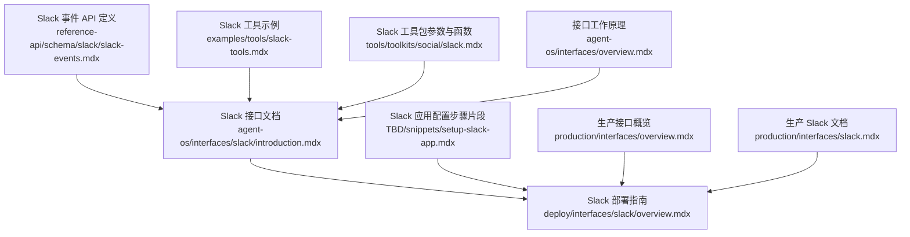
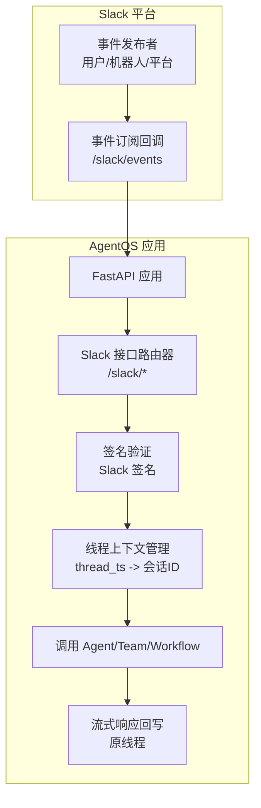
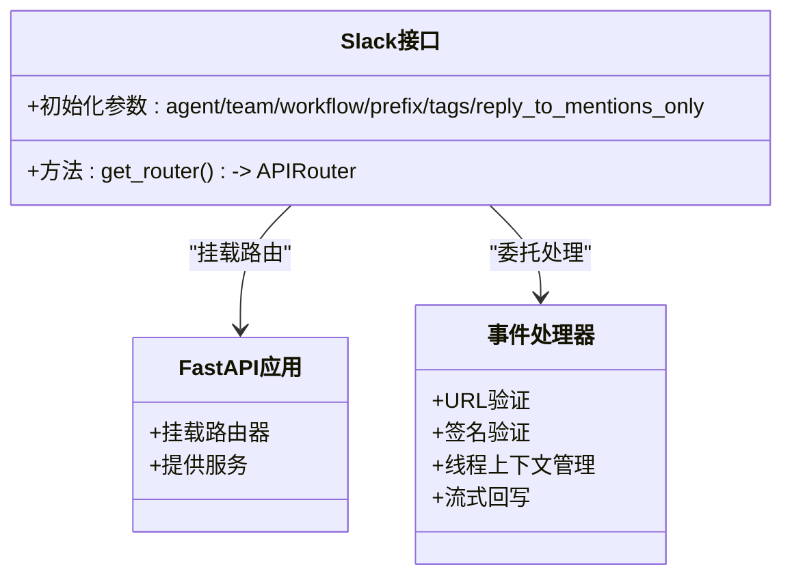
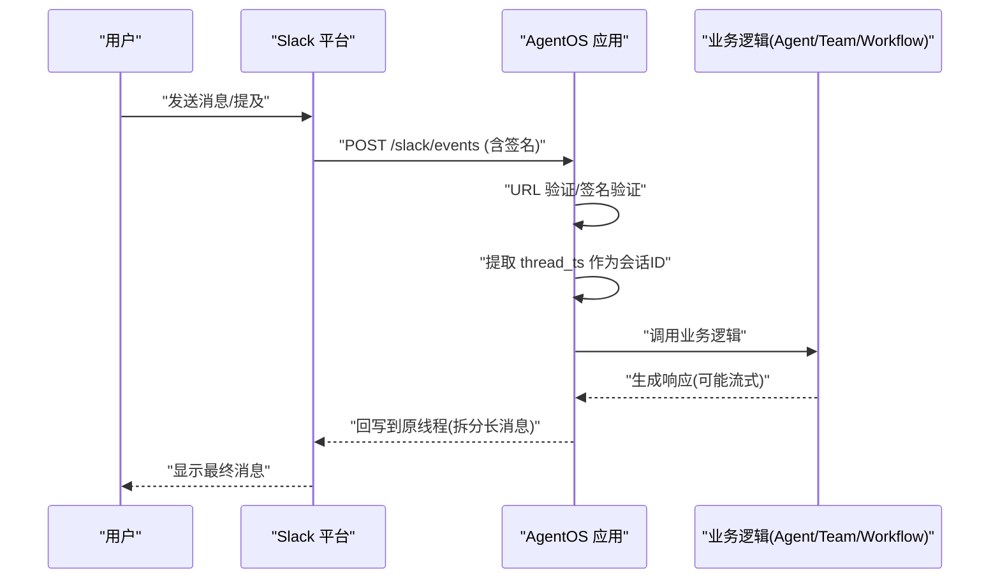
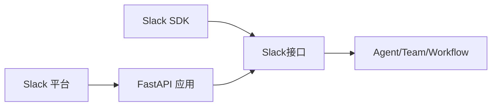

# Slack 接口

<cite>
**本文引用的文件**
- [agent-os/interfaces/slack/introduction.mdx](file://agent-os/interfaces/slack/introduction.mdx)
- [deploy/interfaces/slack/overview.mdx](file://deploy/interfaces/slack/overview.mdx)
- [TBD/snippets/setup-slack-app.mdx](file://TBD/snippets/setup-slack-app.mdx)
- [reference-api/schema/slack/slack-events.mdx](file://reference-api/schema/slack/slack-events.mdx)
- [examples/tools/slack-tools.mdx](file://examples/tools/slack-tools.mdx)
- [tools/toolkits/social/slack.mdx](file://tools/toolkits/social/slack.mdx)
- [production/interfaces/overview.mdx](file://production/interfaces/overview.mdx)
- [production/interfaces/slack.mdx](file://production/interfaces/slack.mdx)
- [agent-os/interfaces/overview.mdx](file://agent-os/interfaces/overview.mdx)
</cite>

## 目录
1. [简介](#简介)
2. [项目结构](#项目结构)
3. [核心组件](#核心组件)
4. [架构总览](#架构总览)
5. [详细组件分析](#详细组件分析)
6. [依赖关系分析](#依赖关系分析)
7. [性能考量](#性能考量)
8. [故障排除指南](#故障排除指南)
9. [结论](#结论)
10. [附录](#附录)

## 简介
本文件面向在生产环境中部署 AgentOS 为 Slack 应用的工程团队，系统化说明从 Slack 应用创建、OAuth 认证与权限配置，到 Slack Bot 集成（事件订阅、消息处理、命令响应）、Webhook 路由与验证、安全配置（令牌与权限控制），以及监控与故障排除的最佳实践。内容基于仓库中已有的 Slack 接口文档与示例，确保可操作性与一致性。

## 项目结构
围绕 Slack 接口的文档分布在以下位置：
- AgentOS 层面的 Slack 接口说明与端点定义
- 面向生产的 Slack 部署指南与步骤
- Slack 应用创建与配置的步骤片段
- Slack 工具与工具包的使用示例
- 生产环境接口概览与 Slack 页面

图表来源
- [agent-os/interfaces/slack/introduction.mdx:1-100](file://agent-os/interfaces/slack/introduction.mdx#L1-L100)
- [deploy/interfaces/slack/overview.mdx:1-143](file://deploy/interfaces/slack/overview.mdx#L1-L143)
- [TBD/snippets/setup-slack-app.mdx:1-92](file://TBD/snippets/setup-slack-app.mdx#L1-L92)
- [reference-api/schema/slack/slack-events.mdx:1-3](file://reference-api/schema/slack/slack-events.mdx#L1-L3)
- [examples/tools/slack-tools.mdx:1-91](file://examples/tools/slack-tools.mdx#L1-L91)
- [tools/toolkits/social/slack.mdx:1-66](file://tools/toolkits/social/slack.mdx#L1-L66)
- [production/interfaces/overview.mdx:1-35](file://production/interfaces/overview.mdx#L1-L35)
- [production/interfaces/slack.mdx:1-143](file://production/interfaces/slack.mdx#L1-L143)
- [agent-os/interfaces/overview.mdx:43-67](file://agent-os/interfaces/overview.mdx#L43-L67)

章节来源
- [agent-os/interfaces/slack/introduction.mdx:1-100](file://agent-os/interfaces/slack/introduction.mdx#L1-L100)
- [deploy/interfaces/slack/overview.mdx:1-143](file://deploy/interfaces/slack/overview.mdx#L1-L143)
- [TBD/snippets/setup-slack-app.mdx:1-92](file://TBD/snippets/setup-slack-app.mdx#L1-L92)
- [reference-api/schema/slack/slack-events.mdx:1-3](file://reference-api/schema/slack/slack-events.mdx#L1-L3)
- [examples/tools/slack-tools.mdx:1-91](file://examples/tools/slack-tools.mdx#L1-L91)
- [tools/toolkits/social/slack.mdx:1-66](file://tools/toolkits/social/slack.mdx#L1-L66)
- [production/interfaces/overview.mdx:1-35](file://production/interfaces/overview.mdx#L1-L35)
- [production/interfaces/slack.mdx:1-143](file://production/interfaces/slack.mdx#L1-L143)
- [agent-os/interfaces/overview.mdx:43-67](file://agent-os/interfaces/overview.mdx#L43-L67)

## 核心组件
- Slack 接口（FastAPI 路由器）：将 Agent/Team/Workflow 封装为 Slack 协议兼容的端点，负责认证、请求校验、会话追踪与流式响应。
- AgentOS.serve：通过 Uvicorn 提供服务，默认挂载 Slack 事件端点。
- 事件端点：POST /slack/events，负责 URL 验证、签名验证、线程上下文管理与长消息拆分回流。

章节来源
- [agent-os/interfaces/slack/introduction.mdx:48-99](file://agent-os/interfaces/slack/introduction.mdx#L48-L99)
- [agent-os/interfaces/overview.mdx:43-67](file://agent-os/interfaces/overview.mdx#L43-L67)

## 架构总览
下图展示 Slack 事件从 Slack 平台到 AgentOS 的流转路径，以及关键的安全与路由要点。

图表来源
- [agent-os/interfaces/slack/introduction.mdx:76-99](file://agent-os/interfaces/slack/introduction.mdx#L76-L99)
- [reference-api/schema/slack/slack-events.mdx:1-3](file://reference-api/schema/slack/slack-events.mdx#L1-L3)

## 详细组件分析

### 组件一：Slack 接口与端点
- 角色与职责
  - 将 Agent/Team/Workflow 包装为 FastAPI 路由器，并挂载到 /slack 前缀。
  - 处理 URL 验证、签名验证、线程时间戳作为会话 ID、长消息拆分回流。
- 关键参数
  - agent/team/workflow：三选一，承载业务逻辑。
  - prefix/tags：自定义前缀与标签，便于路由组织。
  - reply_to_mentions_only：是否仅对提及与私信响应。
- 端点
  - POST /slack/events：统一入口，处理 URL 验证、消息与提及事件。

图表来源
- [agent-os/interfaces/slack/introduction.mdx:53-99](file://agent-os/interfaces/slack/introduction.mdx#L53-L99)

章节来源
- [agent-os/interfaces/slack/introduction.mdx:53-99](file://agent-os/interfaces/slack/introduction.mdx#L53-L99)

### 组件二：事件订阅与消息处理流程
- 事件订阅
  - 在 Slack 应用设置中启用事件订阅，配置 Request URL 指向 /slack/events。
  - 订阅 bot 事件：app_mention、message.im、message.channels、message.groups。
- 消息处理
  - 使用线程时间戳作为会话 ID，保持每条线程内的上下文连续性。
  - 对长回复进行拆分并回写至原线程，保证用户体验。
- URL 验证与签名验证
  - 所有进入 /slack/events 的请求均需通过 Slack 签名验证，失败即拒绝。

图表来源
- [agent-os/interfaces/slack/introduction.mdx:76-99](file://agent-os/interfaces/slack/introduction.mdx#L76-L99)
- [reference-api/schema/slack/slack-events.mdx:1-3](file://reference-api/schema/slack/slack-events.mdx#L1-L3)

章节来源
- [agent-os/interfaces/slack/introduction.mdx:76-99](file://agent-os/interfaces/slack/introduction.mdx#L76-L99)
- [reference-api/schema/slack/slack-events.mdx:1-3](file://reference-api/schema/slack/slack-events.mdx#L1-L3)

### 组件三：Slack 应用创建与 OAuth 权限配置
- 创建应用
  - 从零开始创建应用，选择目标工作区。
- OAuth 与权限
  - 添加 Bot Token Scopes：app_mention、chat:write、chat:write.customize、chat:write.public、im:history、im:read、im:write。
  - 安装到工作区并授权。
- 环境变量
  - 设置 SLACK_TOKEN（Bot 用户 OAuth Token）与 SLACK_SIGNING_SECRET（应用签名密钥）。
- Webhook 与事件订阅
  - 开发阶段使用 ngrok 暴露本地端口，配置 Request URL 为 https://your-ngrok-url.ngrok.io/slack/events。
  - 启用事件订阅，添加 bot 事件，保存更改并重新安装应用以生效。
- App Home
  - 启用 Messages Tab，并允许用户通过该标签发送斜杠命令与消息。

章节来源
- [TBD/snippets/setup-slack-app.mdx:11-82](file://TBD/snippets/setup-slack-app.mdx#L11-L82)
- [deploy/interfaces/slack/overview.mdx:53-122](file://deploy/interfaces/slack/overview.mdx#L53-L122)
- [production/interfaces/slack.mdx:53-122](file://production/interfaces/slack.mdx#L53-L122)

### 组件四：Slack 工具与工具包
- Slack 工具（SlackTools）
  - 支持发送消息、列出频道、获取频道历史等能力。
  - 可按需启用或禁用功能，实现最小权限原则。
- Slack 工具包
  - 提供 token 参数与功能开关，封装常用 Slack API 调用。
  - 适用于需要在 Agent 内部直接调用 Slack API 的场景。

章节来源
- [examples/tools/slack-tools.mdx:1-91](file://examples/tools/slack-tools.mdx#L1-L91)
- [tools/toolkits/social/slack.mdx:44-66](file://tools/toolkits/social/slack.mdx#L44-L66)

## 依赖关系分析
- 组件耦合
  - Slack 接口依赖于 FastAPI 路由器与 AgentOS 服务层；事件处理依赖 Slack SDK 的签名验证与消息解析。
- 外部依赖
  - Slack 平台：事件订阅、签名密钥、Bot 权限范围。
  - ngrok（开发）：本地调试时暴露端点。
- 接口契约
  - /slack/events 的请求格式与响应格式遵循 Slack Events API 规范。

图表来源
- [agent-os/interfaces/slack/introduction.mdx:76-99](file://agent-os/interfaces/slack/introduction.mdx#L76-L99)
- [reference-api/schema/slack/slack-events.mdx:1-3](file://reference-api/schema/slack/slack-events.mdx#L1-L3)

章节来源
- [agent-os/interfaces/slack/introduction.mdx:76-99](file://agent-os/interfaces/slack/introduction.mdx#L76-L99)
- [reference-api/schema/slack/slack-events.mdx:1-3](file://reference-api/schema/slack/slack-events.mdx#L1-L3)

## 性能考量
- 流式响应与长消息拆分
  - 在线程内进行流式回写，避免一次性大响应导致超时或丢包。
- 上下文管理
  - 使用线程时间戳作为会话 ID，减少跨线程干扰，提升并发下的稳定性。
- 端点验证与过滤
  - 在入口处完成 URL 验证与签名验证，降低无效请求对后端的压力。
- 生产部署建议
  - 使用 HTTPS 与负载均衡，结合健康检查与自动扩缩容策略，确保高可用。

## 故障排除指南
- 常见问题定位
  - 确认 SLACK_TOKEN 与 SLACK_SIGNING_SECRET 是否正确设置且可访问。
  - 检查 ngrok URL 与事件订阅路径是否匹配（/slack/events）。
  - 查看应用日志，关注签名失败与权限错误信息。
- 验证步骤
  - 本地运行应用并保持 ngrok 运行。
  - 邀请机器人加入频道并进行 @ 提及与私信测试。
  - 确认事件订阅已保存并重新安装应用以应用新权限。

章节来源
- [agent-os/interfaces/slack/introduction.mdx:94-99](file://agent-os/interfaces/slack/introduction.mdx#L94-L99)
- [TBD/snippets/setup-slack-app.mdx:50-82](file://TBD/snippets/setup-slack-app.mdx#L50-L82)

## 结论
通过以上步骤与最佳实践，可在生产环境中稳定地将 AgentOS 部署为 Slack 应用。关键在于：
- 正确配置 Slack 应用与权限范围；
- 明确事件订阅与 Webhook 路由；
- 在入口层完成签名验证与 URL 验证；
- 利用线程上下文维持对话连贯性；
- 结合工具与工具包实现最小权限与可维护性。

## 附录

### A. Slack 事件端点定义
- 端点：POST /slack/events
- 用途：统一接收 Slack 事件（URL 验证、消息、提及等）

章节来源
- [reference-api/schema/slack/slack-events.mdx:1-3](file://reference-api/schema/slack/slack-events.mdx#L1-L3)

### B. 生产部署与接口概览
- 生产接口概览页面提供 Slack、Discord、WhatsApp 等平台的连接方式与入口。
- 生产 Slack 文档提供与部署指南一致的步骤与资源链接。

章节来源
- [production/interfaces/overview.mdx:8-20](file://production/interfaces/overview.mdx#L8-L20)
- [production/interfaces/slack.mdx:1-143](file://production/interfaces/slack.mdx#L1-L143)