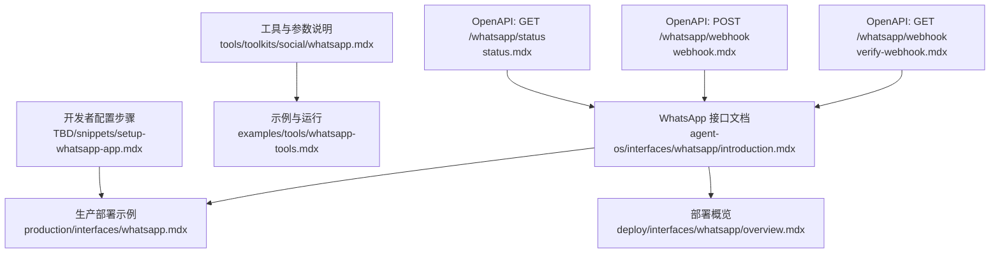
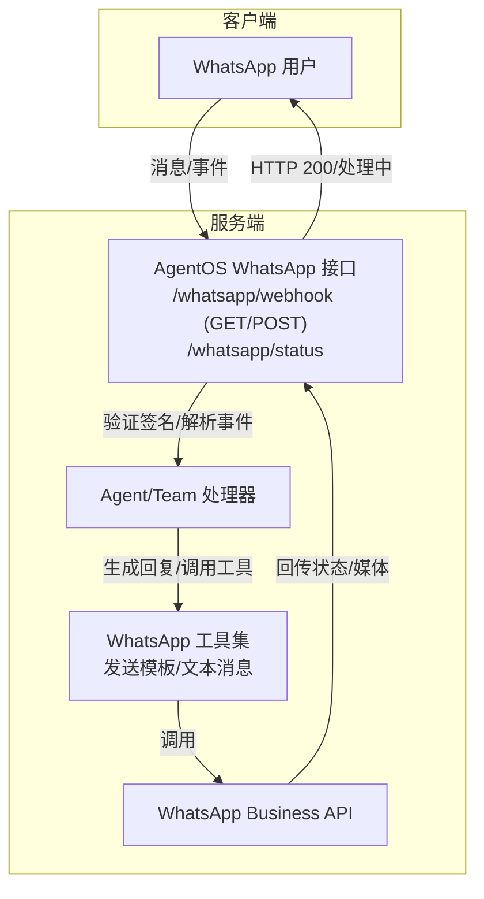
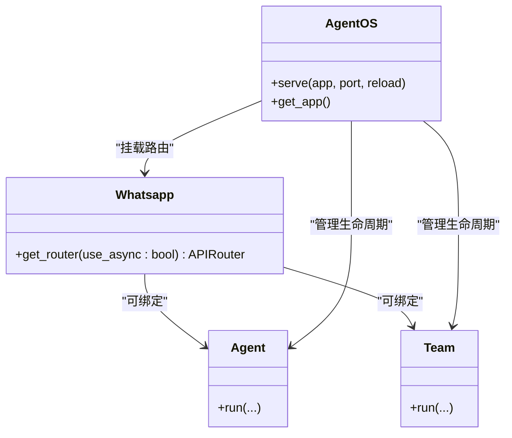
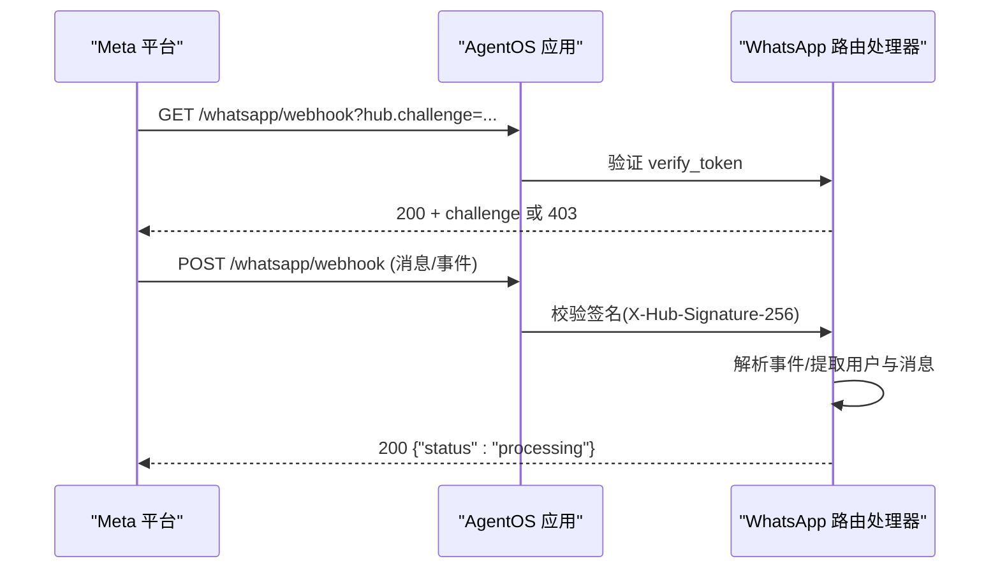
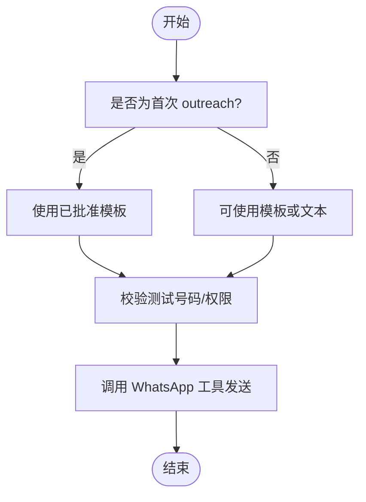
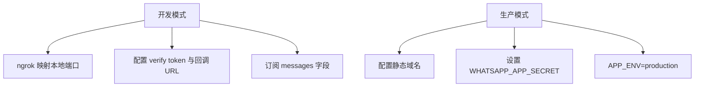
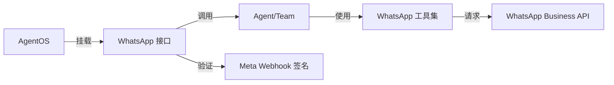

# WhatsApp 接口

<cite>
**本文引用的文件**
- [agent-os/interfaces/whatsapp/introduction.mdx](file://agent-os/interfaces/whatsapp/introduction.mdx)
- [production/interfaces/whatsapp.mdx](file://production/interfaces/whatsapp.mdx)
- [deploy/interfaces/whatsapp/overview.mdx](file://deploy/interfaces/whatsapp/overview.mdx)
- [tools/toolkits/social/whatsapp.mdx](file://tools/toolkits/social/whatsapp.mdx)
- [examples/tools/whatsapp-tools.mdx](file://examples/tools/whatsapp-tools.mdx)
- [TBD/snippets/setup-whatsapp-app.mdx](file://TBD/snippets/setup-whatsapp-app.mdx)
- [reference-api/schema/whatsapp/webhook.mdx](file://reference-api/schema/whatsapp/webhook.mdx)
- [reference-api/schema/whatsapp/verify-webhook.mdx](file://reference-api/schema/whatsapp/verify-webhook.mdx)
- [reference-api/schema/whatsapp/status.mdx](file://reference-api/schema/whatsapp/status.mdx)
</cite>

## 目录
1. [简介](#简介)
2. [项目结构](#项目结构)
3. [核心组件](#核心组件)
4. [架构总览](#架构总览)
5. [详细组件分析](#详细组件分析)
6. [依赖关系分析](#依赖关系分析)
7. [性能考量](#性能考量)
8. [故障排除指南](#故障排除指南)
9. [结论](#结论)
10. [附录](#附录)

## 简介
本文件面向企业级生产部署，系统化阐述如何将 AgentOS 集成至 WhatsApp Business Platform，覆盖认证、消息模板配置、合规要求、Webhook 设置与验证、消息接收与状态回调处理、消息格式与富媒体策略、用户隐私保护、多租户与高并发扩展、以及监控、错误处理与故障排除等关键主题。文档基于仓库内现有资料进行归纳与提炼，帮助在企业环境中稳定、安全地运行 WhatsApp 机器人。

## 项目结构
围绕 WhatsApp 接口与部署的相关文档分布在以下位置：
- 接口与使用说明：agent-os/interfaces/whatsapp/introduction.mdx
- 生产部署示例与步骤：production/interfaces/whatsapp.mdx、deploy/interfaces/whatsapp/overview.mdx
- 工具与参数说明：tools/toolkits/social/whatsapp.mdx、examples/tools/whatsapp-tools.mdx
- 开发者配置与步骤：TBD/snippets/setup-whatsapp-app.mdx
- API 参考（OpenAPI）：reference-api/schema/whatsapp/webhook.mdx、reference-api/schema/whatsapp/verify-webhook.mdx、reference-api/schema/whatsapp/status.mdx

图表来源
- [agent-os/interfaces/whatsapp/introduction.mdx:1-98](file://agent-os/interfaces/whatsapp/introduction.mdx#L1-L98)
- [production/interfaces/whatsapp.mdx:1-137](file://production/interfaces/whatsapp.mdx#L1-L137)
- [deploy/interfaces/whatsapp/overview.mdx:1-137](file://deploy/interfaces/whatsapp/overview.mdx#L1-L137)
- [tools/toolkits/social/whatsapp.mdx:1-83](file://tools/toolkits/social/whatsapp.mdx#L1-L83)
- [examples/tools/whatsapp-tools.mdx:1-81](file://examples/tools/whatsapp-tools.mdx#L1-L81)
- [TBD/snippets/setup-whatsapp-app.mdx:1-88](file://TBD/snippets/setup-whatsapp-app.mdx#L1-L88)
- [reference-api/schema/whatsapp/webhook.mdx:1-3](file://reference-api/schema/whatsapp/webhook.mdx#L1-L3)
- [reference-api/schema/whatsapp/verify-webhook.mdx:1-3](file://reference-api/schema/whatsapp/verify-webhook.mdx#L1-L3)
- [reference-api/schema/whatsapp/status.mdx:1-3](file://reference-api/schema/whatsapp/status.mdx#L1-L3)

章节来源
- [agent-os/interfaces/whatsapp/introduction.mdx:1-98](file://agent-os/interfaces/whatsapp/introduction.mdx#L1-L98)
- [production/interfaces/whatsapp.mdx:1-137](file://production/interfaces/whatsapp.mdx#L1-L137)
- [deploy/interfaces/whatsapp/overview.mdx:1-137](file://deploy/interfaces/whatsapp/overview.mdx#L1-L137)
- [tools/toolkits/social/whatsapp.mdx:1-83](file://tools/toolkits/social/whatsapp.mdx#L1-L83)
- [examples/tools/whatsapp-tools.mdx:1-81](file://examples/tools/whatsapp-tools.mdx#L1-L81)
- [TBD/snippets/setup-whatsapp-app.mdx:1-88](file://TBD/snippets/setup-whatsapp-app.mdx#L1-L88)
- [reference-api/schema/whatsapp/webhook.mdx:1-3](file://reference-api/schema/whatsapp/webhook.mdx#L1-L3)
- [reference-api/schema/whatsapp/verify-webhook.mdx:1-3](file://reference-api/schema/whatsapp/verify-webhook.mdx#L1-L3)
- [reference-api/schema/whatsapp/status.mdx:1-3](file://reference-api/schema/whatsapp/status.mdx#L1-L3)

## 核心组件
- WhatsApp 接口（FastAPI 路由器）
  - 作用：将 Agent 或 Team 暴露为 WhatsApp 服务端点，挂载 /whatsapp 前缀下的健康检查、Webhook 验证与事件接收端点。
  - 关键点：自动以用户电话号码作为 user_id 与 session_id，确保会话与记忆按用户隔离。
- AgentOS 服务化
  - 通过 AgentOS.serve 启动 FastAPI 应用，支持本地开发与生产部署。
- WhatsApp 工具集
  - 提供发送文本与模板消息的能力，支持同步/异步模式；可配置访问令牌、手机号 ID、版本号与默认收件人 WAID。

章节来源
- [agent-os/interfaces/whatsapp/introduction.mdx:54-98](file://agent-os/interfaces/whatsapp/introduction.mdx#L54-L98)
- [tools/toolkits/social/whatsapp.mdx:61-83](file://tools/toolkits/social/whatsapp.mdx#L61-L83)

## 架构总览
下图展示 WhatsApp 机器人在企业环境中的整体交互流程：客户端（WhatsApp 用户）通过 Webhook 将消息与事件推送到 AgentOS；AgentOS 进行签名验证与业务处理后，调用 WhatsApp 工具或 Agent/Team 执行回复逻辑，并通过 WhatsApp Business API 返回响应。

图表来源
- [agent-os/interfaces/whatsapp/introduction.mdx:78-98](file://agent-os/interfaces/whatsapp/introduction.mdx#L78-L98)
- [tools/toolkits/social/whatsapp.mdx:71-79](file://tools/toolkits/social/whatsapp.mdx#L71-L79)

## 详细组件分析

### 组件一：WhatsApp 接口与端点
- 端点与职责
  - GET /whatsapp/status：健康检查。
  - GET /whatsapp/webhook：Webhook 验证（hub.challenge），需匹配 verify token。
  - POST /whatsapp/webhook：接收消息与事件，进行签名验证（生产需 X-Hub-Signature-256，开发可放宽），分发给 Agent/Team 处理并返回标准响应。
- 初始化与路由
  - 支持注入 Agent 或 Team；get_router 返回 FastAPI 路由器并挂载端点。
- 环境变量
  - 必填：WHATSAPP_ACCESS_TOKEN、WHATSAPP_PHONE_NUMBER_ID、WHATSAPP_VERIFY_TOKEN。
  - 可选（生产）：WHATSAPP_APP_SECRET、APP_ENV=production。

图表来源
- [agent-os/interfaces/whatsapp/introduction.mdx:59-98](file://agent-os/interfaces/whatsapp/introduction.mdx#L59-L98)

章节来源
- [agent-os/interfaces/whatsapp/introduction.mdx:78-98](file://agent-os/interfaces/whatsapp/introduction.mdx#L78-L98)

### 组件二：Webhook 验证与接收流程
- 验证流程
  - 客户端（Meta）向回调 URL 发起 GET 请求携带 hub.mode/hub.challenge/hub.verify_token。
  - 服务端需校验 verify token，成功返回 challenge，失败返回 403。
- 接收与处理
  - 客户端（Meta）向回调 URL 发送 POST，携带消息/事件数据。
  - 服务端验证签名（生产模式），解析事件，调用 Agent/Team 处理，必要时调用 WhatsApp 工具发送模板/文本消息。
  - 返回 200 {"status": "processing"} 或 {"status": "ignored"}；签名无效返回 403；其他错误返回 500。

图表来源
- [agent-os/interfaces/whatsapp/introduction.mdx:86-97](file://agent-os/interfaces/whatsapp/introduction.mdx#L86-L97)

章节来源
- [agent-os/interfaces/whatsapp/introduction.mdx:86-97](file://agent-os/interfaces/whatsapp/introduction.mdx#L86-L97)

### 组件三：消息发送与模板配置
- 工具能力
  - 同步/异步发送文本消息与模板消息；支持预览链接、语言代码与组件参数。
- 模板与合规
  - 首次 outreach 必须使用已批准的消息模板。
  - 测试消息仅能发送给测试环境注册的号码。
- 环境变量
  - WHATSAPP_ACCESS_TOKEN、WHATSAPP_PHONE_NUMBER_ID、WHATSAPP_RECIPIENT_WAID、WHATSAPP_VERSION。

图表来源
- [tools/toolkits/social/whatsapp.mdx:29-36](file://tools/toolkits/social/whatsapp.mdx#L29-L36)
- [examples/tools/whatsapp-tools.mdx:30-33](file://examples/tools/whatsapp-tools.mdx#L30-L33)

章节来源
- [tools/toolkits/social/whatsapp.mdx:29-36](file://tools/toolkits/social/whatsapp.mdx#L29-L36)
- [examples/tools/whatsapp-tools.mdx:30-33](file://examples/tools/whatsapp-tools.mdx#L30-L33)

### 组件四：部署与环境配置
- 开发环境
  - 使用 ngrok 暴露本地端口，配置回调 URL 与 verify token；订阅 messages 字段。
- 生产环境
  - 设置 APP_ENV=production，配置 WHATSAPP_APP_SECRET 用于签名验证。
  - 使用静态域名替代 ngrok，遵循部署模板与 CI/CD 最佳实践。

图表来源
- [TBD/snippets/setup-whatsapp-app.mdx:52-88](file://TBD/snippets/setup-whatsapp-app.mdx#L52-L88)
- [production/interfaces/whatsapp.mdx:88-121](file://production/interfaces/whatsapp.mdx#L88-L121)
- [deploy/interfaces/whatsapp/overview.mdx:88-121](file://deploy/interfaces/whatsapp/overview.mdx#L88-L121)

章节来源
- [TBD/snippets/setup-whatsapp-app.mdx:52-88](file://TBD/snippets/setup-whatsapp-app.mdx#L52-L88)
- [production/interfaces/whatsapp.mdx:88-121](file://production/interfaces/whatsapp.mdx#L88-L121)
- [deploy/interfaces/whatsapp/overview.mdx:88-121](file://deploy/interfaces/whatsapp/overview.mdx#L88-L121)

## 依赖关系分析
- 组件耦合
  - AgentOS 依赖 WhatsApp 接口挂载路由；WhatsApp 接口依赖 Agent/Team 执行业务；Agent/Team 依赖 WhatsApp 工具集调用外部 API。
- 外部依赖
  - WhatsApp Business API（发送模板/文本消息）、Meta Webhook 验证与签名机制。
- 环境与配置
  - 环境变量驱动行为（令牌、ID、验证与签名密钥），不同环境（开发/生产）采用不同策略。

图表来源
- [agent-os/interfaces/whatsapp/introduction.mdx:59-98](file://agent-os/interfaces/whatsapp/introduction.mdx#L59-L98)
- [tools/toolkits/social/whatsapp.mdx:71-79](file://tools/toolkits/social/whatsapp.mdx#L71-L79)

章节来源
- [agent-os/interfaces/whatsapp/introduction.mdx:59-98](file://agent-os/interfaces/whatsapp/introduction.mdx#L59-L98)
- [tools/toolkits/social/whatsapp.mdx:71-79](file://tools/toolkits/social/whatsapp.mdx#L71-L79)

## 性能考量
- 并发与吞吐
  - 使用 ASGI 服务器（如 Uvicorn）承载 FastAPI 应用，合理设置 workers 与线程数以适配高并发消息流。
- 响应时间
  - Webhook 回调需快速返回 200，避免超时；长耗时任务建议异步化（工具支持异步模式）。
- 缓存与限流
  - 对频繁查询/生成的资源进行缓存；对第三方 API 实施限流与重试策略。
- 存储与会话
  - 利用会话与记忆按用户隔离，减少跨用户干扰；对历史记录进行分页与压缩。

## 故障排除指南
- Webhook 验证失败
  - 确认 verify token 一致；开发模式可放宽验证；生产模式务必配置 WHATSAPP_APP_SECRET。
- 签名验证失败（403）
  - 核查 X-Hub-Signature-256 生成方式与 APP_SECRET；确认回调 URL 未变更导致签名不匹配。
- 回调未触发
  - 检查订阅字段 messages 是否已启用；确认回调 URL 正确且可达；开发阶段使用 ngrok 时注意动态域名变化。
- 模板发送受限
  - 首次 outreach 必须使用已批准模板；测试消息仅限测试号码。
- 健康检查
  - 访问 /whatsapp/status 确认服务可用；若异常，查看应用日志与环境变量配置。

章节来源
- [agent-os/interfaces/whatsapp/introduction.mdx:86-97](file://agent-os/interfaces/whatsapp/introduction.mdx#L86-L97)
- [tools/toolkits/social/whatsapp.mdx:29-36](file://tools/toolkits/social/whatsapp.mdx#L29-L36)

## 结论
通过 AgentOS 的 WhatsApp 接口，企业可以快速将智能 Agent/Team 部署到 WhatsApp Business 平台。结合严格的 Webhook 验证与签名机制、合规的消息模板策略、完善的监控与错误处理，可在生产环境中实现高可用、可扩展的 WhatsApp 机器人服务。建议在生产中采用静态域名、完善的密钥管理与可观测性方案，并持续优化消息处理与媒体传输性能。

## 附录
- 开发者资源
  - WhatsApp 接口文档、Webhook API 参考、部署模板与 Agent 参考。
- 示例与运行
  - 参考示例脚本与环境变量配置，完成本地验证与生产部署。

章节来源
- [production/interfaces/whatsapp.mdx:129-137](file://production/interfaces/whatsapp.mdx#L129-L137)
- [deploy/interfaces/whatsapp/overview.mdx:129-137](file://deploy/interfaces/whatsapp/overview.mdx#L129-L137)
- [reference-api/schema/whatsapp/webhook.mdx:1-3](file://reference-api/schema/whatsapp/webhook.mdx#L1-L3)
- [reference-api/schema/whatsapp/verify-webhook.mdx:1-3](file://reference-api/schema/whatsapp/verify-webhook.mdx#L1-L3)
- [reference-api/schema/whatsapp/status.mdx:1-3](file://reference-api/schema/whatsapp/status.mdx#L1-L3)