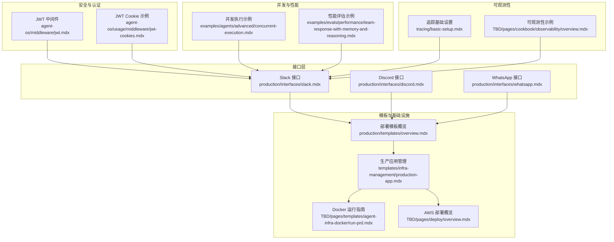
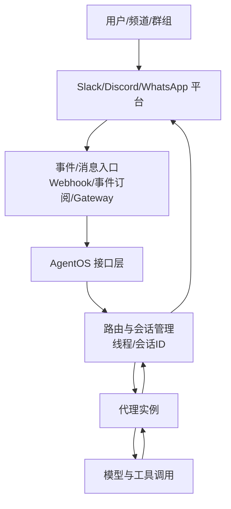
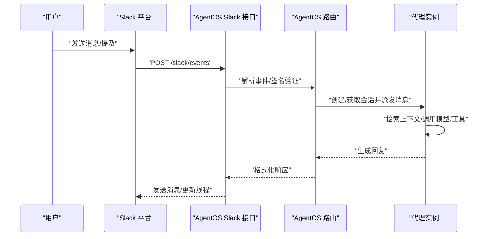
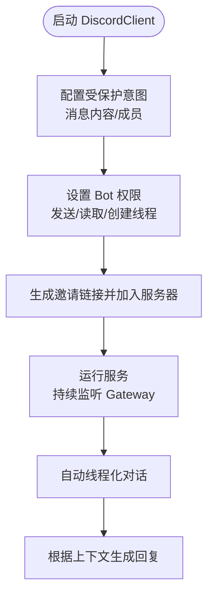
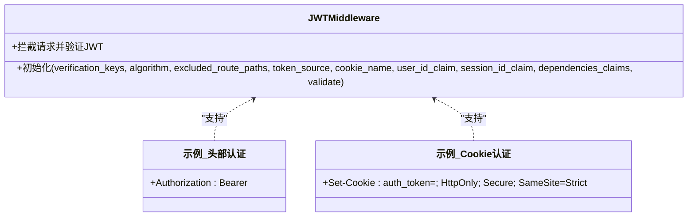
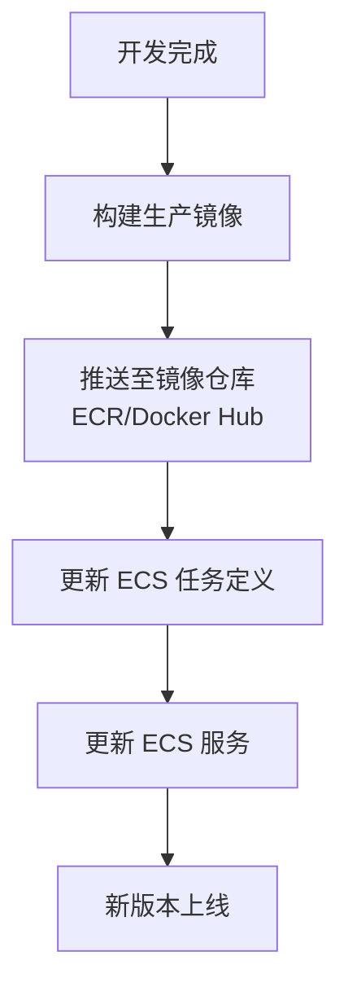
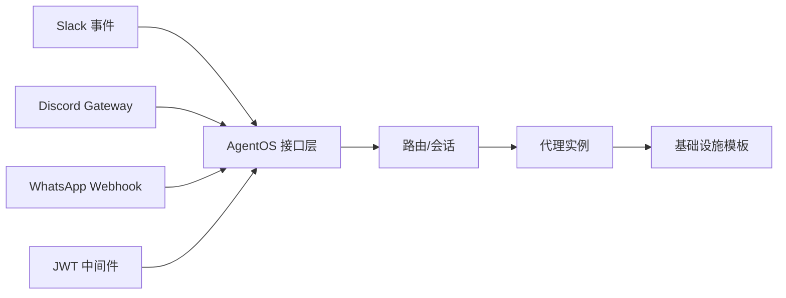

# 生产接口

<cite>
**本文引用的文件**
- [production/interfaces/slack.mdx](file://production/interfaces/slack.mdx)
- [production/interfaces/discord.mdx](file://production/interfaces/discord.mdx)
- [production/interfaces/whatsapp.mdx](file://production/interfaces/whatsapp.mdx)
- [TBD/snippets/setup-slack-app.mdx](file://TBD/snippets/setup-slack-app.mdx)
- [TBD/snippets/setup-whatsapp-app.mdx](file://TBD/snippets/setup-whatsapp-app.mdx)
- [reference-api/schema/slack/slack-events.mdx](file://reference-api/schema/slack/slack-events.mdx)
- [examples/tools/discord-tools.mdx](file://examples/tools/discord-tools.mdx)
- [production/interfaces/overview.mdx](file://production/interfaces/overview.mdx)
- [production/templates/overview.mdx](file://production/templates/overview.mdx)
- [production/overview.mdx](file://production/overview.mdx)
- [templates/infra-management/production-app.mdx](file://templates/infra-management/production-app.mdx)
- [deploy/templates/aws/manage/troubleshooting.mdx](file://deploy/templates/aws/manage/troubleshooting.mdx)
- [TBD/pages/deploy/overview.mdx](file://TBD/pages/deploy/overview.mdx)
- [TBD/pages/templates/agent-infra-docker/run-prd.mdx](file://TBD/pages/templates/agent-infra-docker/run-prd.mdx)
- [agent-os/middleware/jwt.mdx](file://agent-os/middleware/jwt.mdx)
- [agent-os/usage/middleware/jwt-cookies.mdx](file://agent-os/usage/middleware/jwt-cookies.mdx)
- [TBD/snippets/message-us-discord.mdx](file://TBD/snippets/message-us-discord.mdx)
- [TBD/snippets/agent-app-update-production.mdx](file://TBD/snippets/agent-app-update-production.mdx)
- [examples/agents/advanced/concurrent-execution.mdx](file://examples/agents/advanced/concurrent-execution.mdx)
- [examples/evals/performance/team-response-with-memory-and-reasoning.mdx](file://examples/evals/performance/team-response-with-memory-and-reasoning.mdx)
- [tracing/basic-setup.mdx](file://tracing/basic-setup.mdx)
- [TBD/pages/cookbook/observability/overview.mdx](file://TBD/pages/cookbook/observability/overview.mdx)
</cite>

## 目录
1. [简介](#简介)
2. [项目结构](#项目结构)
3. [核心组件](#核心组件)
4. [架构总览](#架构总览)
5. [详细组件分析](#详细组件分析)
6. [依赖关系分析](#依赖关系分析)
7. [性能考量](#性能考量)
8. [故障排除指南](#故障排除指南)
9. [结论](#结论)
10. [附录](#附录)

## 简介
本技术文档面向生产环境，系统化说明如何将应用程序通过 AgentOS 接口层连接到主流用户界面平台（Slack、Discord、WhatsApp），并提供完整的接口配置指南（认证、Webhook、消息路由）、扩展性设计（多用户并发）、监控与可观测性、以及安全与性能优化最佳实践。文档以仓库中已有的部署与接口示例为依据，帮助工程团队在生产环境中稳定、可扩展地交付智能代理服务。

## 项目结构
围绕“生产接口”的主题，相关知识分布在以下几类文档中：
- 接口部署与配置：Slack、Discord、WhatsApp 的生产级部署与平台配置
- 模板与基础设施：Docker、Railway、AWS 的生产模板与更新流程
- 安全中间件：JWT 认证（Header 与 Cookie）
- 并发与性能：多用户并发执行示例与性能评估
- 可观测性：OpenTelemetry 集成与平台示例
- 故障排除：AWS 部署常见问题定位

图表来源
- [production/interfaces/slack.mdx:1-143](file://production/interfaces/slack.mdx#L1-L143)
- [production/interfaces/discord.mdx:1-116](file://production/interfaces/discord.mdx#L1-L116)
- [production/interfaces/whatsapp.mdx:105-136](file://production/interfaces/whatsapp.mdx#L105-L136)
- [production/templates/overview.mdx:1-29](file://production/templates/overview.mdx#L1-L29)
- [templates/infra-management/production-app.mdx:1-166](file://templates/infra-management/production-app.mdx#L1-L166)
- [TBD/pages/templates/agent-infra-docker/run-prd.mdx:1-23](file://TBD/pages/templates/agent-infra-docker/run-prd.mdx#L1-L23)
- [TBD/pages/deploy/overview.mdx:80-142](file://TBD/pages/deploy/overview.mdx#L80-L142)
- [agent-os/middleware/jwt.mdx:290-340](file://agent-os/middleware/jwt.mdx#L290-L340)
- [agent-os/usage/middleware/jwt-cookies.mdx:89-234](file://agent-os/usage/middleware/jwt-cookies.mdx#L89-L234)
- [examples/agents/advanced/concurrent-execution.mdx:56-74](file://examples/agents/advanced/concurrent-execution.mdx#L56-L74)
- [examples/evals/performance/team-response-with-memory-and-reasoning.mdx:1087-1132](file://examples/evals/performance/team-response-with-memory-and-reasoning.mdx#L1087-L1132)
- [tracing/basic-setup.mdx:211-233](file://tracing/basic-setup.mdx#L211-L233)
- [TBD/pages/cookbook/observability/overview.mdx:1-40](file://TBD/pages/cookbook/observability/overview.mdx#L1-L40)

章节来源
- [production/interfaces/overview.mdx:1-36](file://production/interfaces/overview.mdx#L1-L36)
- [production/templates/overview.mdx:1-29](file://production/templates/overview.mdx#L1-L29)

## 核心组件
- 接口层（Interface Layer）
  - Slack：基于事件流与 Webhook 的消息接入，支持线程上下文会话
  - Discord：基于 Gateway 的长连接机器人，自动线程化对话
  - WhatsApp：基于 Meta Webhook 的消息接入，生产模式需签名验证
- 应用与平台认证
  - Slack：Bot 用户令牌与签名密钥；事件订阅与权限范围
  - Discord：Bot Token 与意图（Intents）；邀请链接与权限
  - WhatsApp：应用环境变量与应用密钥（App Secret）用于签名验证
- 安全中间件
  - JWT 中间件：支持 Header 与 Cookie 两种来源；可配置排除路径、声明提取与校验
- 基础设施与模板
  - Docker、Railway、AWS 多模板；生产镜像构建、ECS 任务定义与服务更新
- 并发与性能
  - 异步并发执行示例；多用户并发评估
- 可观测性
  - OpenTelemetry 追踪；Langfuse、Arize Phoenix、AgentOps 等平台集成

章节来源
- [production/interfaces/slack.mdx:42-131](file://production/interfaces/slack.mdx#L42-L131)
- [production/interfaces/discord.mdx:34-105](file://production/interfaces/discord.mdx#L34-L105)
- [production/interfaces/whatsapp.mdx:105-136](file://production/interfaces/whatsapp.mdx#L105-L136)
- [agent-os/middleware/jwt.mdx:290-340](file://agent-os/middleware/jwt.mdx#L290-L340)
- [agent-os/usage/middleware/jwt-cookies.mdx:89-234](file://agent-os/usage/middleware/jwt-cookies.mdx#L89-L234)
- [production/templates/overview.mdx:1-29](file://production/templates/overview.mdx#L1-L29)
- [examples/agents/advanced/concurrent-execution.mdx:56-74](file://examples/agents/advanced/concurrent-execution.mdx#L56-L74)
- [examples/evals/performance/team-response-with-memory-and-reasoning.mdx:1087-1132](file://examples/evals/performance/team-response-with-memory-and-reasoning.mdx#L1087-L1132)
- [TBD/pages/cookbook/observability/overview.mdx:1-40](file://TBD/pages/cookbook/observability/overview.mdx#L1-L40)

## 架构总览
下图展示生产接口从平台到应用的端到端交互：平台通过事件/Webhook/Gateway 接入，AgentOS 将消息路由至代理实例，代理调用模型与工具完成响应，最终回传至平台。基础设施层负责容器化、负载均衡与服务编排。

图表来源
- [production/interfaces/slack.mdx:10-40](file://production/interfaces/slack.mdx#L10-L40)
- [production/interfaces/discord.mdx:10-32](file://production/interfaces/discord.mdx#L10-L32)
- [production/interfaces/whatsapp.mdx:105-136](file://production/interfaces/whatsapp.mdx#L105-L136)

## 详细组件分析

### Slack 接口
- 配置要点
  - OAuth 与权限范围：Bot Token Scopes 包括消息发送、私信读写等
  - 环境变量：Bot 用户令牌与签名密钥
  - Webhook 与事件订阅：本地开发使用 ngrok，生产使用受管域名与负载均衡
  - App Home：启用消息标签页与命令/消息入口
- 会话与上下文
  - 使用线程时间戳作为会话 ID，保持每条线程独立上下文
- API 入口
  - 事件入口定义见参考 API Schema

图表来源
- [reference-api/schema/slack/slack-events.mdx:1-3](file://reference-api/schema/slack/slack-events.mdx#L1-L3)
- [production/interfaces/slack.mdx:90-129](file://production/interfaces/slack.mdx#L90-L129)

章节来源
- [production/interfaces/slack.mdx:42-131](file://production/interfaces/slack.mdx#L42-L131)
- [reference-api/schema/slack/slack-events.mdx:1-3](file://reference-api/schema/slack/slack-events.mdx#L1-L3)

### Discord 接口
- 配置要点
  - 创建应用与 Bot 用户，复制 Token
  - 开启“受保护的网关意图”（成员与内容意图）
  - 权限与邀请链接：发送消息、读取历史、创建公共线程等
- 运行方式
  - 直连 Gateway，无需 Webhook；适合持续运行的服务（Railway、Render、AWS EC2 等）
- 示例能力
  - 工具启用：仅允许特定功能（如发送消息、读取历史）

图表来源
- [production/interfaces/discord.mdx:34-105](file://production/interfaces/discord.mdx#L34-L105)
- [examples/tools/discord-tools.mdx:50-92](file://examples/tools/discord-tools.mdx#L50-L92)

章节来源
- [production/interfaces/discord.mdx:34-105](file://production/interfaces/discord.mdx#L34-L105)
- [examples/tools/discord-tools.mdx:50-92](file://examples/tools/discord-tools.mdx#L50-L92)

### WhatsApp 接口
- 配置要点
  - 环境变量：APP_ENV（development/production）与 WHATSAPP_APP_SECRET（生产签名验证）
  - 本地开发可用 ngrok；生产使用托管域名与负载均衡
- 安全建议
  - 生产模式必须启用签名验证，防止伪造回调

章节来源
- [production/interfaces/whatsapp.mdx:105-136](file://production/interfaces/whatsapp.mdx#L105-L136)
- [TBD/snippets/setup-whatsapp-app.mdx:70-88](file://TBD/snippets/setup-whatsapp-app.mdx#L70-L88)

### 安全与认证（JWT）
- 支持两种来源：Authorization 头部或 HTTP-Only Cookie
- 可配置排除路径、声明提取（如用户ID、会话ID、角色等）
- Cookie 模式具备更强的 XSS/CSRF 防护
- 提供头部与 Cookie 的对比与选型建议

图表来源
- [agent-os/middleware/jwt.mdx:290-340](file://agent-os/middleware/jwt.mdx#L290-L340)
- [agent-os/usage/middleware/jwt-cookies.mdx:89-234](file://agent-os/usage/middleware/jwt-cookies.mdx#L89-L234)

章节来源
- [agent-os/middleware/jwt.mdx:290-340](file://agent-os/middleware/jwt.mdx#L290-L340)
- [agent-os/usage/middleware/jwt-cookies.mdx:89-234](file://agent-os/usage/middleware/jwt-cookies.mdx#L89-L234)

### 基础设施与模板（生产部署）
- 模板选择
  - Docker：本地开发与自托管
  - Railway：快速上线
  - AWS：企业级可靠性与控制
- 生产应用更新
  - 构建镜像、更新 ECS 任务定义、更新 ECS 服务
- AWS 部署概览
  - ECS Fargate、ALB、RDS、ECR、Secrets Manager 等资源

图表来源
- [templates/infra-management/production-app.mdx:15-166](file://templates/infra-management/production-app.mdx#L15-L166)
- [TBD/pages/deploy/overview.mdx:80-142](file://TBD/pages/deploy/overview.mdx#L80-L142)
- [TBD/pages/templates/agent-infra-docker/run-prd.mdx:1-23](file://TBD/pages/templates/agent-infra-docker/run-prd.mdx#L1-L23)

章节来源
- [production/templates/overview.mdx:1-29](file://production/templates/overview.mdx#L1-L29)
- [production/overview.mdx:1-22](file://production/overview.mdx#L1-L22)
- [templates/infra-management/production-app.mdx:1-166](file://templates/infra-management/production-app.mdx#L1-L166)
- [TBD/pages/deploy/overview.mdx:80-142](file://TBD/pages/deploy/overview.mdx#L80-L142)
- [TBD/pages/templates/agent-infra-docker/run-prd.mdx:1-23](file://TBD/pages/templates/agent-infra-docker/run-prd.mdx#L1-L23)

### 并发与扩展性
- 多用户并发
  - 使用异步并发执行示例，支持高吞吐场景
  - 性能评估示例可观察内存增长与分配热点
- 扩展性设计
  - 通过容器化与服务编排（ECS/Railway/Docker）实现水平扩展
  - 事件驱动（Slack/Discord Webhook/Gateway）降低耦合

章节来源
- [examples/agents/advanced/concurrent-execution.mdx:56-74](file://examples/agents/advanced/concurrent-execution.mdx#L56-L74)
- [examples/evals/performance/team-response-with-memory-and-reasoning.mdx:1087-1132](file://examples/evals/performance/team-response-with-memory-and-reasoning.mdx#L1087-L1132)

### 可观测性与监控
- 追踪
  - 基于 OpenTelemetry 的追踪，支持批量与简单处理策略
- 平台集成
  - Langfuse、Arize Phoenix、AgentOps、LangSmith、Langtrace、Langwatch、Logfire、Weave、Opik 等
- 实践建议
  - 生产使用批量处理减少写入压力；开发调试使用简单处理提升可见性

章节来源
- [tracing/basic-setup.mdx:211-233](file://tracing/basic-setup.mdx#L211-L233)
- [TBD/pages/cookbook/observability/overview.mdx:1-40](file://TBD/pages/cookbook/observability/overview.mdx#L1-L40)

## 依赖关系分析
- 平台到接口层
  - Slack：事件订阅 + Webhook
  - Discord：Gateway
  - WhatsApp：Meta Webhook
- 接口层到应用
  - AgentOS 路由器负责解析事件、会话管理与消息分发
- 应用到基础设施
  - Docker/Railway/AWS 模板提供容器化与服务编排
- 安全中间件
  - JWT 中间件贯穿 API 层，统一认证与授权

图表来源
- [production/interfaces/slack.mdx:90-129](file://production/interfaces/slack.mdx#L90-L129)
- [production/interfaces/discord.mdx:10-32](file://production/interfaces/discord.mdx#L10-L32)
- [production/interfaces/whatsapp.mdx:105-136](file://production/interfaces/whatsapp.mdx#L105-L136)
- [agent-os/middleware/jwt.mdx:290-340](file://agent-os/middleware/jwt.mdx#L290-L340)

章节来源
- [production/interfaces/overview.mdx:1-36](file://production/interfaces/overview.mdx#L1-L36)

## 性能考量
- 异步非阻塞
  - 使用异步方法与并发执行，避免阻塞 IO
- 追踪策略
  - 生产使用批量处理，降低数据库写入压力
- 并发评估
  - 多用户并发测试可识别内存增长与热点分配，指导资源扩容

章节来源
- [examples/agents/advanced/concurrent-execution.mdx:56-74](file://examples/agents/advanced/concurrent-execution.mdx#L56-L74)
- [examples/evals/performance/team-response-with-memory-and-reasoning.mdx:1087-1132](file://examples/evals/performance/team-response-with-memory-and-reasoning.mdx#L1087-L1132)
- [tracing/basic-setup.mdx:211-233](file://tracing/basic-setup.mdx#L211-L233)

## 故障排除指南
- AWS 常见问题
  - 负载均衡显示目标不健康：检查 /health 端点与容器日志
  - 任务反复重启：排查数据库连接、环境变量缺失、启动后崩溃
  - “database is locked”：多工作进程与 DuckDB 冲突
- 更新生产应用
  - 构建镜像、更新 ECS 任务定义、更新 ECS 服务
- 平台接入
  - Slack：确认事件订阅 URL、签名密钥与权限范围
  - Discord：确认意图与权限、邀请链接有效性
  - WhatsApp：确认 APP_ENV 与 App Secret

章节来源
- [deploy/templates/aws/manage/troubleshooting.mdx:1-50](file://deploy/templates/aws/manage/troubleshooting.mdx#L1-L50)
- [templates/infra-management/production-app.mdx:1-166](file://templates/infra-management/production-app.mdx#L1-L166)
- [TBD/snippets/agent-app-update-production.mdx:1-6](file://TBD/snippets/agent-app-update-production.mdx#L1-L6)
- [TBD/snippets/setup-slack-app.mdx:47-91](file://TBD/snippets/setup-slack-app.mdx#L47-L91)
- [production/interfaces/discord.mdx:61-96](file://production/interfaces/discord.mdx#L61-L96)
- [production/interfaces/whatsapp.mdx:105-136](file://production/interfaces/whatsapp.mdx#L105-L136)

## 结论
通过 AgentOS 接口层与生产模板，可以将代理能力无缝扩展到 Slack、Discord、WhatsApp 等主流平台。结合 JWT 安全中间件、可观测性追踪与并发优化，能够在生产环境中实现高可用、可扩展与可维护的智能代理服务。建议在上线前完成平台权限与 Webhook/事件订阅配置、安全认证与签名验证、并发与性能评估，并建立完善的监控与故障排除流程。

## 附录
- 快速链接
  - Slack 接口与配置：[Slack 接口:42-131](file://production/interfaces/slack.mdx#L42-L131)
  - Discord 接口与配置：[Discord 接口:34-105](file://production/interfaces/discord.mdx#L34-L105)
  - WhatsApp 接口与配置：[WhatsApp 接口:105-136](file://production/interfaces/whatsapp.mdx#L105-L136)
  - 生产模板与更新：[模板概览:1-29](file://production/templates/overview.mdx#L1-L29)、[生产应用管理:1-166](file://templates/infra-management/production-app.mdx#L1-L166)
  - 安全中间件：[JWT 中间件:290-340](file://agent-os/middleware/jwt.mdx#L290-L340)、[JWT Cookie 示例:89-234](file://agent-os/usage/middleware/jwt-cookies.mdx#L89-L234)
  - 并发与性能：[并发执行示例:56-74](file://examples/agents/advanced/concurrent-execution.mdx#L56-L74)、[性能评估示例:1087-1132](file://examples/evals/performance/team-response-with-memory-and-reasoning.mdx#L1087-L1132)
  - 可观测性：[追踪基础设置:211-233](file://tracing/basic-setup.mdx#L211-L233)、[可观测性示例:1-40](file://TBD/pages/cookbook/observability/overview.mdx#L1-L40)
  - 平台联系：[Discord](file://TBD/snippets/message-us-discord.mdx)