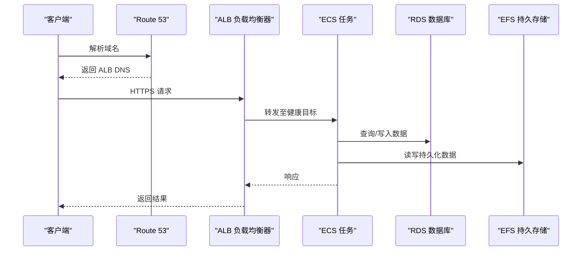
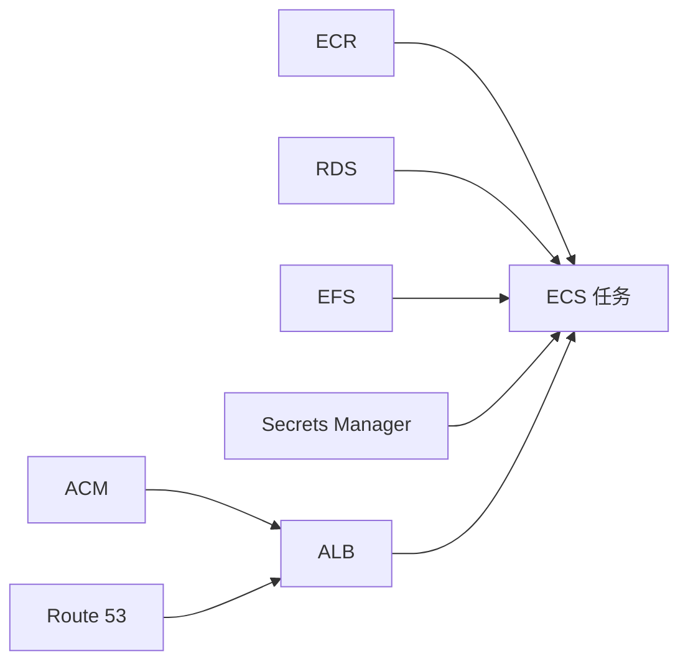
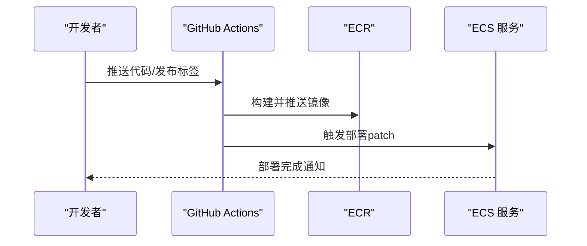

# AWS 模板

<cite>
**本文引用的文件**
- [deploy.mdx](file://deploy/templates/aws/deploy.mdx)
- [reference.mdx](file://deploy/templates/aws/reference.mdx)
- [aws.mdx](file://production/templates/aws.mdx)
- [aws-setup.mdx](file://TBD/snippets/aws-setup.mdx)
- [create-aws-resources.mdx](file://TBD/snippets/create-aws-resources.mdx)
- [ci-cd.mdx](file://deploy/templates/aws/configure/ci-cd.mdx)
- [https.mdx](file://deploy/templates/aws/go-live/https.mdx)
- [verify.mdx](file://deploy/templates/aws/go-live/verify.mdx)
- [troubleshooting.mdx](file://deploy/templates/aws/manage/troubleshooting.mdx)
- [monitoring.mdx](file://deploy/templates/aws/manage/monitoring.mdx)
- [efs.mdx](file://deploy/templates/aws/configure/efs.mdx)
- [domain-https.mdx](file://production/templates/customize-aws/domain-https.mdx)
- [domain-https.mdx](file://TBD/pages/templates/infra-management/domain-https.mdx)
- [introduction.mdx](file://TBD/pages/templates/resources/aws/introduction.mdx)
</cite>

## 目录
1. [简介](#简介)
2. [项目结构](#项目结构)
3. [核心组件](#核心组件)
4. [架构总览](#架构总览)
5. [详细组件分析](#详细组件分析)
6. [依赖关系分析](#依赖关系分析)
7. [性能与成本优化](#性能与成本优化)
8. [安全加固与合规](#安全加固与合规)
9. [高可用性与弹性设计](#高可用性与弹性设计)
10. [CI/CD 自动化与流水线](#cicd-自动化与流水线)
11. [从开发到生产的部署流程](#从开发到生产的部署流程)
12. [AWS 特有服务集成](#aws-特有服务集成)
13. [故障排除指南](#故障排除指南)
14. [结论](#结论)

## 简介
本指南面向在 AWS 上部署 AgentOS 的工程团队，覆盖从模板选择、基础设施编排、网络与安全配置、HTTPS 与域名接入、到 CI/CD 自动化与生产运维的全链路实践。模板基于 ECS Fargate + RDS PostgreSQL + Application Load Balancer 的生产级架构，强调可扩展、可观测、可审计与低成本。

## 项目结构
该仓库提供了多层级的 AWS 部署文档与模板片段，涵盖：
- 部署向导：从准备工具、创建代码基、配置 AWS 设置到最终验证与连接控制平面
- 参考与定制：环境变量、本地开发、自定义代理与工具、知识库加载等
- 运维与排障：日志、告警、常见问题与调试命令
- 网络与安全：HTTPS、Route 53、ACM、安全组与 IAM 最小权限
- 存储与持久化：EFS 持久卷与挂载策略
- CI/CD：GitHub Actions 与 ECR 集成

```mermaid
graph TB
subgraph "开发与本地"
Dev["本地开发<br/>uv + Docker Desktop"]
Local["本地容器运行<br/>uvicorn + pgvector"]
end
subgraph "AWS 生产"
ECR["ECR 镜像仓库"]
ECS["ECS Fargate 集群/服务/任务"]
LB["ALB 应用负载均衡器"]
RDS["RDS PostgreSQL + pgvector"]
SG["安全组隔离"]
SEC["AWS Secrets Manager"]
EFS["EFS 持久存储"]
end
subgraph "网络与证书"
Route53["Route 53 域名解析"]
ACM["ACM 证书管理"]
end
Dev --> ECR
Local --> ECR
ECR --> ECS
ECS --> LB
LB --> RDS
LB --> EFS
LB --> SEC
LB --> SG
Route53 <- --> LB
ACM <- --> LB
```

图表来源
- [deploy.mdx:20-31](file://deploy/templates/aws/deploy.mdx#L20-L31)
- [aws.mdx:170-180](file://production/templates/aws.mdx#L170-L180)

章节来源
- [deploy.mdx:1-100](file://deploy/templates/aws/deploy.mdx#L1-L100)
- [aws.mdx:1-127](file://production/templates/aws.mdx#L1-L127)

## 核心组件
- ECS Fargate：无服务器容器托管，自动扩缩容，按秒计费
- RDS PostgreSQL（含 pgvector 扩展）：托管数据库，支持向量检索与知识库
- Application Load Balancer：四层/七层负载均衡，健康检查与会话亲和
- AWS Secrets Manager：凭据集中管理，避免硬编码
- 安全组：最小暴露面，仅放通所需端口与来源
- ECR：容器镜像仓库，配合 OIDC 或凭据轮换
- EFS：可选持久卷，满足数据与模型缓存持久化需求

章节来源
- [deploy.mdx:18-44](file://deploy/templates/aws/deploy.mdx#L18-L44)
- [aws.mdx:170-180](file://production/templates/aws.mdx#L170-L180)

## 架构总览
下图展示典型生产部署的端到端路径：客户端请求经 Route 53 解析至 ALB，ALB 将流量转发至 ECS 任务，任务访问 RDS 与 EFS，并通过 Secrets Manager 获取密钥。



图表来源
- [https.mdx:1-55](file://deploy/templates/aws/go-live/https.mdx#L1-L55)
- [troubleshooting.mdx:14-27](file://deploy/templates/aws/manage/troubleshooting.mdx#L14-L27)

## 详细组件分析

### ECS Fargate 与任务编排
- 任务定义：容器镜像来自 ECR，启动命令需确保单工作进程以兼容 DuckDB/Pal 场景
- 服务与集群：自动健康检查与重启策略，结合 ALB 目标组进行流量分发
- 安全与网络：任务所在子网需具备公网 IP（或通过 NAT 网关），安全组仅放行必要端口

章节来源
- [deploy.mdx:238-256](file://deploy/templates/aws/deploy.mdx#L238-L256)
- [troubleshooting.mdx:49-58](file://deploy/templates/aws/manage/troubleshooting.mdx#L49-L58)

### RDS PostgreSQL 与 pgvector
- 初始化：首次部署时 RDS 需约 5-10 分钟准备完成
- 连接：确保 ECS 安全组允许出站访问 RDS 安全组的 5432 端口
- 密码：避免特殊字符导致连接失败；生产使用 Secrets Manager 注入

章节来源
- [aws.mdx:197-200](file://production/templates/aws.mdx#L197-L200)
- [troubleshooting.mdx:118-136](file://deploy/templates/aws/manage/troubleshooting.mdx#L118-L136)

### Application Load Balancer 与健康检查
- 监听器：HTTP 重定向至 HTTPS（可选）
- 健康检查：/health 端点返回状态码与实例时间戳
- 目标组：按健康状态路由流量，异常时自动摘除

章节来源
- [verify.mdx:58-71](file://deploy/templates/aws/go-live/verify.mdx#L58-L71)
- [https.mdx:72-100](file://deploy/templates/aws/go-live/https.mdx#L72-L100)

### ECR 与镜像推送
- 认证：ECR 登录令牌每 12 小时过期，需重新认证
- 推送：构建后推送到指定仓库，再由 ECS 拉取执行

章节来源
- [deploy.mdx:127-136](file://deploy/templates/aws/deploy.mdx#L127-L136)
- [ci-cd.mdx:178-182](file://deploy/templates/aws/configure/ci-cd.mdx#L178-L182)

### EFS 持久化（可选）
- 文件系统与访问点：UID/GID 61000 匹配容器用户，根目录权限需一致
- 挂载目标：每个子网一个，确保跨可用区冗余
- 验证：应用启动日志中无挂载错误，写入 /data 生效

章节来源
- [efs.mdx:96-183](file://deploy/templates/aws/configure/efs.mdx#L96-L183)

### Secrets Manager 与环境变量
- 本地：secrets/ 目录（Git 忽略）
- 生产：资源文件中声明，自动注入到 ECS 任务环境变量
- 敏感信息：API Key、数据库凭据、第三方密钥统一管理

章节来源
- [reference.mdx:153-166](file://deploy/templates/aws/reference.mdx#L153-L166)
- [aws.mdx:48-50](file://production/templates/aws.mdx#L48-L50)

## 依赖关系分析
- 组件耦合
  - ECS 依赖 ECR（镜像）、RDS（数据）、EFS（可选持久化）、Secrets（凭据）
  - ALB 依赖 ECS 健康目标，依赖 ACM（HTTPS 时）
  - Route 53 依赖 ALB DNS 名称
- 外部依赖
  - AWS CLI、Docker、uv、GitHub Actions（CI/CD）



图表来源
- [aws.mdx:170-180](file://production/templates/aws.mdx#L170-L180)
- [https.mdx:1-55](file://deploy/templates/aws/go-live/https.mdx#L1-L55)

## 性能与成本优化
- 成本估算（按 US East 区域）
  - ECS Fargate：$30-50/月
  - RDS db.t3.micro：$15-20/月
  - ALB：$20-25/月
  - 总计：约 $65-100/月
- 性能建议
  - 单工作进程运行 uvicorn，避免 DuckDB 写冲突
  - 合理设置 ECS 任务 CPU/内存规格，结合 CloudWatch 指标调优
  - 使用预热与连接池减少冷启动与数据库连接开销
  - 对静态资源使用 CDN（可选）降低 ALB 压力

章节来源
- [aws.mdx:182-191](file://production/templates/aws.mdx#L182-L191)
- [troubleshooting.mdx:49-58](file://deploy/templates/aws/manage/troubleshooting.mdx#L49-L58)

## 安全加固与合规
- 凭据管理
  - 生产环境使用 AWS Secrets Manager，禁用明文配置
- 网络隔离
  - 安全组最小放通：仅允许 ALB -> ECS -> RDS 的必要端口
  - 公网子网启用自动分配公有 IP，私网子网通过 NAT 网关访问互联网
- 加密与合规
  - 启用 ALB HTTPS 并强制 HTTP 重定向
  - ACM 证书与 Route 53 域名绑定，定期轮换证书
- 最小权限
  - IAM 角色与策略遵循最小权限原则，避免全局策略
  - 使用 OIDC 临时凭证替代长期密钥（推荐）

章节来源
- [https.mdx:1-55](file://deploy/templates/aws/go-live/https.mdx#L1-L55)
- [ci-cd.mdx:178-182](file://deploy/templates/aws/configure/ci-cd.mdx#L178-L182)
- [troubleshooting.mdx:127-136](file://deploy/templates/aws/manage/troubleshooting.mdx#L127-L136)

## 高可用性与弹性设计
- 可用区分布
  - 至少选择两个不同可用区的公共子网，实现跨 AZ 冗余
- 弹性伸缩
  - ECS 任务数与 ALB 目标组健康检查联动，异常自动恢复
- 数据持久
  - RDS 多可用区与备份策略；EFS 可选跨可用区挂载目标
- 监控与告警
  - CloudWatch 日志与指标，设置任务失败告警

章节来源
- [deploy.mdx:180-189](file://deploy/templates/aws/deploy.mdx#L180-L189)
- [monitoring.mdx:109-127](file://deploy/templates/aws/manage/monitoring.mdx#L109-L127)

## CI/CD 自动化与流水线
- PR 验证：格式、测试、类型检查
- 镜像构建与推送
  - DockerHub + GitHub：发布时构建并推送镜像
  - ECR + GitHub OIDC：更安全，无需长期凭据
- 部署更新
  - 新镜像推送后，使用 ag infra patch 触发 ECS 更新
- 最佳实践
  - 使用 OIDC 角色，避免保存访问密钥
  - 将触发条件从手动改为发布事件，保证可追溯



图表来源
- [ci-cd.mdx:1-199](file://deploy/templates/aws/configure/ci-cd.mdx#L1-L199)

章节来源
- [ci-cd.mdx:1-199](file://deploy/templates/aws/configure/ci-cd.mdx#L1-L199)

## 从开发到生产的部署流程
- 开发环境
  - uv 虚拟环境 + Docker Desktop
  - 本地运行 uvicorn + pgvector，验证代理与知识库
- 预生产验证
  - ag infra up 本地容器验证
- 生产部署
  - 配置 AWS 凭据与区域、子网、ECR 仓库
  - 创建密钥文件并注入 Secrets Manager
  - ag infra up prd:aws 自动创建 ECR、RDS、ECS、ALB、安全组
- 连接控制平面
  - 在 os.agno.com 中添加 HTTPS 端点并连接 Live 模式

章节来源
- [aws.mdx:15-127](file://production/templates/aws.mdx#L15-L127)
- [deploy.mdx:102-295](file://deploy/templates/aws/deploy.mdx#L102-L295)

## AWS 特有服务集成
- CloudFront（可选）：加速静态内容与边缘缓存
- Route 53：域名解析与别名记录指向 ALB
- ACM：申请与验证证书，绑定 ALB HTTPS 监听器
- Application Load Balancer：四层/七层负载均衡与健康检查
- IAM：角色与策略、OIDC 临时凭证
- CloudWatch：日志、指标与告警

章节来源
- [https.mdx:1-120](file://deploy/templates/aws/go-live/https.mdx#L1-L120)
- [monitoring.mdx:97-127](file://deploy/templates/aws/manage/monitoring.mdx#L97-L127)

## 故障排除指南
- 常见症状与处理
  - “无基本身份验证凭据”：重新认证 ECR 登录
  - RDS 启动慢：等待约 5-10 分钟，确认状态为 Available
  - 健康检查 502：容器仍在启动，稍后再试；查看 ECS 任务日志
  - 任务反复重启：检查密钥、数据库连接、启动顺序
  - 数据库连接失败：避免密码中的特殊字符
  - EFS 挂载失败：确认挂载目标与 UID/GID
- 调试命令
  - 查看 ECS 服务事件、最近日志、任务状态
  - 使用 execute-command 进入 ECS 容器交互式排查

章节来源
- [troubleshooting.mdx:1-209](file://deploy/templates/aws/manage/troubleshooting.mdx#L1-L209)
- [deploy.mdx:326-370](file://deploy/templates/aws/deploy.mdx#L326-L370)

## 结论
本指南提供了在 AWS 上落地 AgentOS 的完整方法论：以 ECS Fargate + RDS + ALB 为核心，结合 HTTPS、Route 53、ACM、Secrets Manager 与 EFS，形成可扩展、可观测、可审计且成本可控的生产级架构。通过 CI/CD 自动化与完善的排障流程，团队可快速从开发迭代到稳定交付，并持续优化性能与安全性。