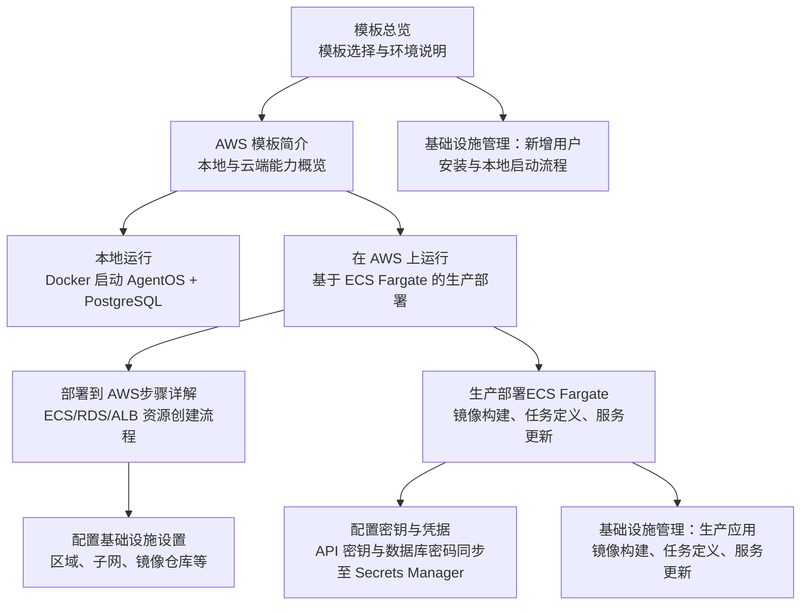
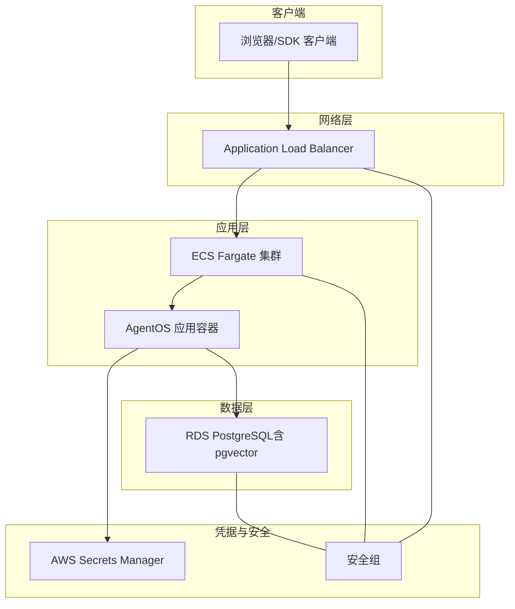
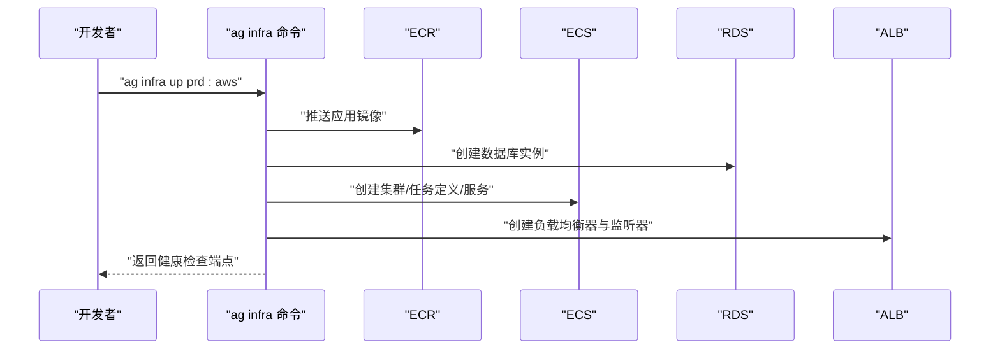
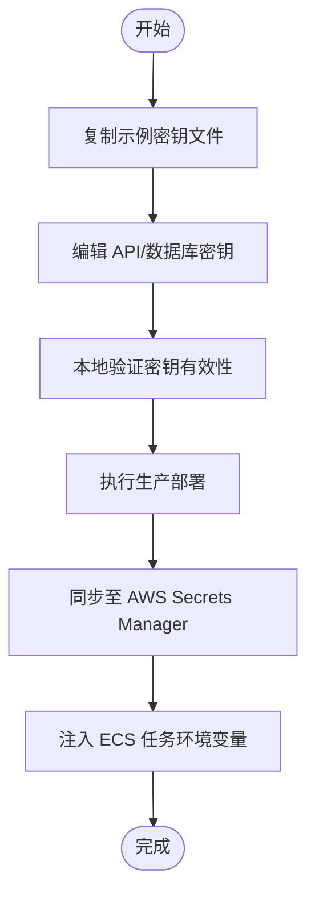
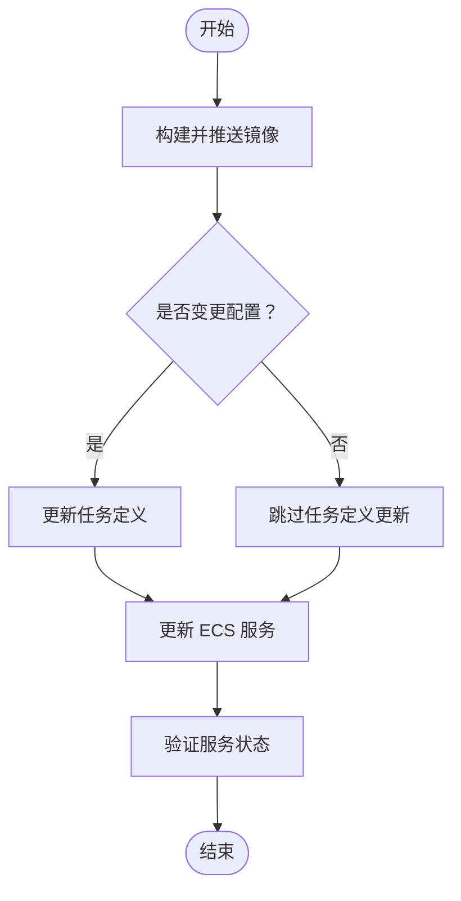
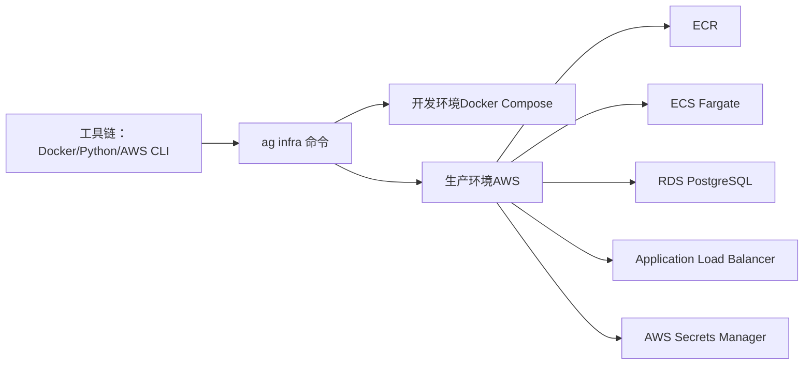

# AWS 模板概述

<cite>
**本文引用的文件**
- [AWS 模板简介](file://TBD/pages/templates/agent-infra-aws/introduction.mdx)
- [在 AWS 上运行](file://TBD/pages/templates/agent-infra-aws/run-aws.mdx)
- [本地运行](file://TBD/pages/templates/agent-infra-aws/run-local.mdx)
- [模板总览](file://TBD/pages/deploy/templates.mdx)
- [部署到 AWS（步骤详解）](file://deploy/templates/aws/deploy.mdx)
- [生产部署（ECS Fargate）](file://deploy/templates/aws/go-live/updates.mdx)
- [配置基础设施设置](file://deploy/templates/aws/configure/infra-settings.mdx)
- [配置密钥与凭据](file://deploy/templates/aws/configure/secrets.mdx)
- [基础设施管理：新增用户](file://templates/infra-management/new-users.mdx)
- [基础设施管理：生产应用](file://templates/infra-management/production-app.mdx)
- [AWS 快速开始指南](file://production/templates/aws.mdx)
</cite>

## 目录
1. [引言](#引言)
2. [项目结构](#项目结构)
3. [核心组件](#核心组件)
4. [架构总览](#架构总览)
5. [详细组件分析](#详细组件分析)
6. [依赖关系分析](#依赖关系分析)
7. [性能与成本特性](#性能与成本特性)
8. [适用场景与目标用户](#适用场景与目标用户)
9. [故障排查指南](#故障排查指南)
10. [结论](#结论)

## 引言
本文件面向希望使用 AWS 部署 AgentOS 的团队与个人，系统性介绍 AWS 模板的设计理念、核心价值与实施路径。该模板以标准化代码库为基础，结合 ECS Fargate、RDS PostgreSQL、Application Load Balancer 等 AWS 服务，提供从开发到生产的完整基础设施方案，显著降低基础设施管理复杂度，帮助用户快速上线并稳定运营。

## 项目结构
AWS 模板由“模板文档”“部署指南”“基础设施管理”三部分组成，覆盖从入门到生产的全流程。

图表来源
- [模板总览:1-95](file://TBD/pages/deploy/templates.mdx#L1-L95)
- [AWS 模板简介:1-43](file://TBD/pages/templates/agent-infra-aws/introduction.mdx#L1-L43)
- [在 AWS 上运行:1-21](file://TBD/pages/templates/agent-infra-aws/run-aws.mdx#L1-L21)
- [部署到 AWS（步骤详解）:1-298](file://deploy/templates/aws/deploy.mdx#L1-L298)
- [生产部署（ECS Fargate）:1-224](file://deploy/templates/aws/go-live/updates.mdx#L1-L224)
- [配置基础设施设置:1-80](file://deploy/templates/aws/configure/infra-settings.mdx#L1-L80)
- [配置密钥与凭据:1-180](file://deploy/templates/aws/configure/secrets.mdx#L1-L180)
- [基础设施管理：新增用户:1-125](file://templates/infra-management/new-users.mdx#L1-L125)
- [基础设施管理：生产应用:1-166](file://templates/infra-management/production-app.mdx#L1-L166)

章节来源
- [模板总览:1-95](file://TBD/pages/deploy/templates.mdx#L1-L95)
- [AWS 模板简介:1-43](file://TBD/pages/templates/agent-infra-aws/introduction.mdx#L1-L43)

## 核心组件
- 应用容器化与镜像管理
  - 使用 Dockerfile 构建应用镜像，并通过 ECR 或 Docker Hub 托管。
  - 支持本地与生产镜像构建策略，便于快速迭代与发布。
- ECS Fargate 无服务器容器托管
  - 自动扩缩容、按需计费，无需管理底层 EC2 实例。
  - 通过任务定义与服务管理应用生命周期。
- RDS PostgreSQL 受管数据库
  - 提供高可用、备份、监控与扩展能力；可选启用 pgvector。
- Application Load Balancer 公共入口
  - 提供 HTTPS 终端、健康检查与流量分发。
- 凭据与安全
  - 本地使用 YAML 文件；生产使用 AWS Secrets Manager 注入 ECS 任务。
- 网络与安全组
  - 通过安全组控制出入站流量，确保最小权限原则。

章节来源
- [部署到 AWS（步骤详解）:18-31](file://deploy/templates/aws/deploy.mdx#L18-L31)
- [生产部署（ECS Fargate）:45-51](file://deploy/templates/aws/go-live/updates.mdx#L45-L51)
- [配置密钥与凭据:8-128](file://deploy/templates/aws/configure/secrets.mdx#L8-L128)

## 架构总览
下图展示 AgentOS 在 AWS 上的典型生产架构：应用容器运行于 ECS Fargate，数据库为 RDS PostgreSQL，流量经 ALB 分发，凭据由 Secrets Manager 提供。

图表来源
- [部署到 AWS（步骤详解）:20-31](file://deploy/templates/aws/deploy.mdx#L20-L31)
- [生产部署（ECS Fargate）:45-51](file://deploy/templates/aws/go-live/updates.mdx#L45-L51)
- [配置密钥与凭据:108-124](file://deploy/templates/aws/configure/secrets.mdx#L108-L124)

## 详细组件分析

### 组件一：部署流程与资源编排
- 本地验证：使用 Docker Compose 运行 AgentOS 与 PostgreSQL，验证功能后再迁移至云端。
- 生产部署：通过命令一键创建 ECR、RDS、ECS 集群/服务/任务定义、ALB 与 Secrets Manager。
- 更新与回滚：支持仅更新镜像、更新任务定义或更新服务，满足不同变更场景。

图表来源
- [生产部署（ECS Fargate）:33-51](file://deploy/templates/aws/go-live/updates.mdx#L33-L51)
- [部署到 AWS（步骤详解）:238-258](file://deploy/templates/aws/deploy.mdx#L238-L258)

章节来源
- [AWS 模板简介:8-26](file://TBD/pages/templates/agent-infra-aws/introduction.mdx#L8-L26)
- [在 AWS 上运行:6-20](file://TBD/pages/templates/agent-infra-aws/run-aws.mdx#L6-L20)
- [生产部署（ECS Fargate）:29-51](file://deploy/templates/aws/go-live/updates.mdx#L29-L51)

### 组件二：密钥与凭据管理
- 本地：YAML 文件直接读取，便于开发调试。
- 生产：自动将 YAML 中的密钥同步至 AWS Secrets Manager，并注入 ECS 任务环境变量。
- 安全建议：分离 API 密钥与数据库凭据，支持独立轮换。

图表来源
- [配置密钥与凭据:10-68](file://deploy/templates/aws/configure/secrets.mdx#L10-L68)
- [配置密钥与凭据:108-124](file://deploy/templates/aws/configure/secrets.mdx#L108-L124)

章节来源
- [配置密钥与凭据:84-128](file://deploy/templates/aws/configure/secrets.mdx#L84-L128)

### 组件三：镜像构建与 ECS 任务更新
- 镜像构建：支持本地构建与推送到 ECR/Docker Hub。
- 任务定义更新：当变更镜像、CPU/内存或环境变量时，先更新任务定义再触发服务滚动更新。
- 快捷流程：仅更新镜像时可跳过任务定义，直接更新服务。

图表来源
- [基础设施管理：生产应用:127-157](file://templates/infra-management/production-app.mdx#L127-L157)
- [生产部署（ECS Fargate）:114-167](file://deploy/templates/aws/go-live/updates.mdx#L114-L167)

章节来源
- [基础设施管理：生产应用:15-166](file://templates/infra-management/production-app.mdx#L15-L166)
- [生产部署（ECS Fargate）:114-167](file://deploy/templates/aws/go-live/updates.mdx#L114-L167)

## 依赖关系分析
- 工具链依赖
  - 本地：Docker Desktop、Python 虚拟环境、agno 与 agno-infra。
  - 生产：AWS CLI、ECR 认证脚本、AWS 凭证配置。
- 模板与命令
  - 使用 ag infra 命令统一管理本地与云端资源，避免手写 Terraform/CloudFormation。
- 环境隔离
  - 开发与生产环境分别维护资源清单与密钥，避免交叉污染。

图表来源
- [模板总览:33-70](file://TBD/pages/deploy/templates.mdx#L33-L70)
- [部署到 AWS（步骤详解）:48-70](file://deploy/templates/aws/deploy.mdx#L48-L70)

章节来源
- [模板总览:33-70](file://TBD/pages/deploy/templates.mdx#L33-L70)
- [基础设施管理：新增用户:47-101](file://templates/infra-management/new-users.mdx#L47-L101)

## 性能与成本特性
- 性能
  - ECS Fargate 适合弹性伸缩场景，CPU/内存可按需调整；默认配置适用于中小规模应用。
  - RDS 提供稳定连接与备份能力，pgvector 适配向量检索需求。
  - ALB 提供高可用与健康检查，保障请求稳定性。
- 成本估算（按 US East 区域）
  - ECS Fargate：约 $30–50/月
  - RDS db.t3.micro：约 $15–20/月
  - Application Load Balancer：约 $20–25/月
  - 小计：约 $65–100/月（具体以实际用量与配置为准）

章节来源
- [部署到 AWS（步骤详解）:33-44](file://deploy/templates/aws/deploy.mdx#L33-L44)
- [AWS 快速开始指南:182-191](file://production/templates/aws.mdx#L182-L191)

## 适用场景与目标用户
- 适用场景
  - 需要生产级基础设施的 AgentOS 应用（如多模型代理、团队协作与工作流系统）。
  - 对运维负担敏感但又要求高可用与可扩展性的团队。
  - 希望以“模板即标准”的方式快速落地的组织。
- 目标用户
  - AI 应用工程师、平台工程团队、数据与算法工程师。
  - 希望将 AgentOS 从本地迁移到云端的团队。

章节来源
- [模板总览:16-30](file://TBD/pages/deploy/templates.mdx#L16-L30)
- [AWS 模板简介:6-26](file://TBD/pages/templates/agent-infra-aws/introduction.mdx#L6-L26)

## 故障排查指南
- RDS 不可访问
  - RDS 初始化需要约 5 分钟，请在 AWS 控制台查看状态。
- ECS 任务失败
  - 查看 CloudWatch 日志；常见原因：环境变量缺失、数据库连接串错误。
- 负载均衡器返回 503
  - ECS 服务可能仍在启动中，等待健康检查通过。
- 数据库连接异常（生产）
  - 检查数据库密码是否包含特殊字符（不建议使用 @、#、%、&、"、'），必要时重新部署服务。
- EFS 挂载问题（如使用）
  - 确认每个子网均存在挂载目标；检查访问点 UID/GID 是否为 61000。

章节来源
- [AWS 快速开始指南:194-209](file://production/templates/aws.mdx#L194-L209)
- [部署到 AWS（步骤详解）:135-145](file://deploy/templates/aws/deploy.mdx#L135-L145)
- [生产部署（ECS Fargate）:194-209](file://deploy/templates/aws/go-live/updates.mdx#L194-L209)

## 结论
AWS 模板以“标准化代码库 + agno-infra 命令行”为核心，将 ECS Fargate、RDS PostgreSQL、ALB 等关键组件整合为一套可复用的生产方案。它既降低了基础设施管理复杂度，又提供了清晰的部署与运维路径，适合希望快速、稳定地将 AgentOS 推向生产的团队与组织。配合完善的密钥管理与成本估算，用户可在可控预算内获得高可用的运行环境。