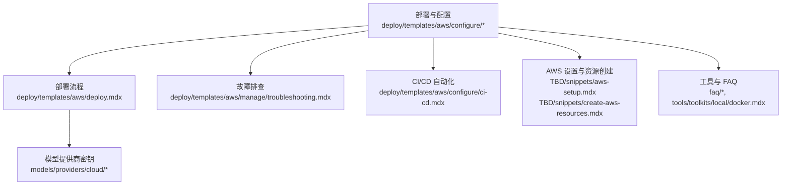
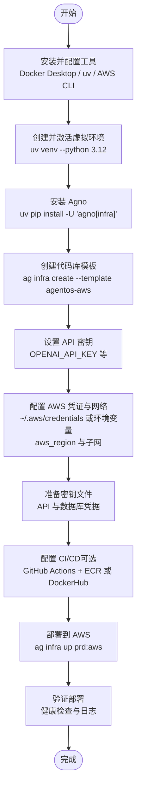
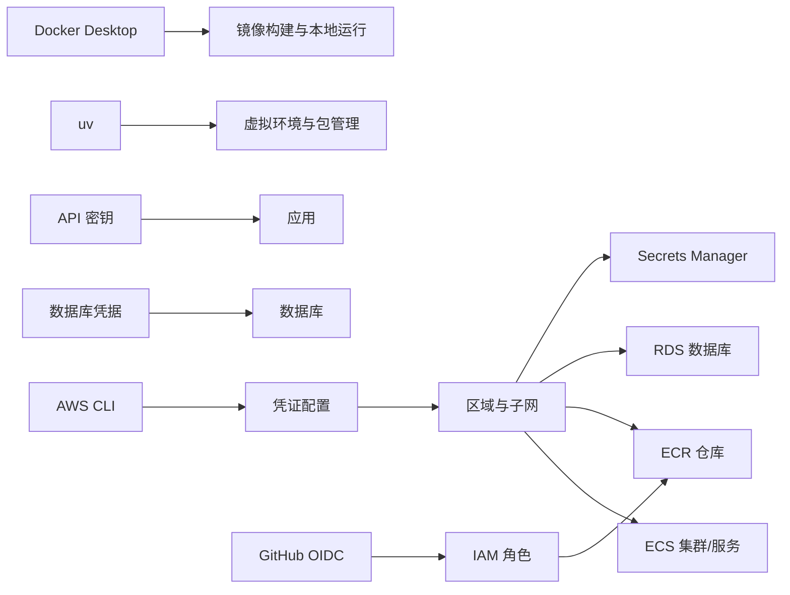

# 先决条件和环境准备

<cite>
**本文引用的文件**
- [deploy.mdx](file://deploy/templates/aws/deploy.mdx)
- [configure/secrets.mdx](file://deploy/templates/aws/configure/secrets.mdx)
- [configure/development-app.mdx](file://deploy/templates/aws/configure/development-app.mdx)
- [configure/ci-cd.mdx](file://deploy/templates/aws/configure/ci-cd.mdx)
- [ci-cd.mdx（TBD）](file://TBD/pages/templates/infra-management/ci-cd.mdx)
- [ci-cd.mdx（production）](file://production/templates/customize-aws/ci-cd.mdx)
- [aws-setup.mdx](file://TBD/snippets/aws-setup.mdx)
- [create-aws-resources.mdx](file://TBD/snippets/create-aws-resources.mdx)
- [could-not-connect-to-docker.mdx](file://faq/could-not-connect-to-docker.mdx)
- [environment-variables.mdx](file://faq/environment-variables.mdx)
- [manage/troubleshooting.mdx](file://deploy/templates/aws/manage/troubleshooting.mdx)
- [docker.mdx（tools）](file://tools/toolkits/local/docker.mdx)
- [aws-bedrock/overview.mdx](file://models/providers/cloud/aws-bedrock/overview.mdx)
- [aws-claude/overview.mdx](file://models/providers/cloud/aws-claude/overview.mdx)
- [set-openai-key.mdx](file://_snippets/set-openai-key.mdx)
- [rbac-auth-failed.mdx](file://faq/rbac-auth-failed.mdx)
</cite>

## 目录
1. [简介](#简介)
2. [项目结构](#项目结构)
3. [核心组件](#核心组件)
4. [架构总览](#架构总览)
5. [详细组件分析](#详细组件分析)
6. [依赖关系分析](#依赖关系分析)
7. [性能考虑](#性能考虑)
8. [故障排查指南](#故障排查指南)
9. [结论](#结论)
10. [附录](#附录)

## 简介
本指南面向在 AWS 上部署 AgentOS 的用户，系统性说明部署前的先决条件与环境准备，包括：
- 必备工具：Docker Desktop、uv Python 包管理器、AWS CLI
- AWS 账户与权限：凭证配置、区域与子网设置、IAM OIDC 与角色策略
- API 密钥与凭据：OpenAI、Exa、数据库密码等的获取与配置
- 不同操作系统的安装与验证步骤
- 常见环境问题的排查与修复

## 项目结构
围绕 AWS 模板的先决条件与环境准备，相关文档主要分布在以下路径：
- 部署与配置：deploy/templates/aws/configure/*
- 部署流程：deploy/templates/aws/deploy.mdx
- 故障排查：deploy/templates/aws/manage/troubleshooting.mdx
- 工具与 FAQ：faq/*、tools/toolkits/local/docker.mdx
- 模型提供商密钥：models/providers/cloud/*

**图表来源**
- [deploy.mdx](file://deploy/templates/aws/deploy.mdx)
- [configure/secrets.mdx](file://deploy/templates/aws/configure/secrets.mdx)
- [configure/ci-cd.mdx](file://deploy/templates/aws/configure/ci-cd.mdx)
- [aws-setup.mdx](file://TBD/snippets/aws-setup.mdx)
- [create-aws-resources.mdx](file://TBD/snippets/create-aws-resources.mdx)
- [manage/troubleshooting.mdx](file://deploy/templates/aws/manage/troubleshooting.mdx)
- [docker.mdx（tools）](file://tools/toolkits/local/docker.mdx)

**章节来源**
- [deploy.mdx](file://deploy/templates/aws/deploy.mdx)
- [configure/secrets.mdx](file://deploy/templates/aws/configure/secrets.mdx)
- [configure/ci-cd.mdx](file://deploy/templates/aws/configure/ci-cd.mdx)
- [aws-setup.mdx](file://TBD/snippets/aws-setup.mdx)
- [create-aws-resources.mdx](file://TBD/snippets/create-aws-resources.mdx)

## 核心组件
- 工具与环境
  - Docker Desktop：容器运行与镜像构建
  - uv：Python 虚拟环境与包管理
  - AWS CLI：账户认证与资源操作
- AWS 凭证与网络
  - 凭证来源：~/.aws/credentials 或 AWS_ACCESS_KEY_ID/AWS_SECRET_ACCESS_KEY 环境变量
  - 区域与子网：aws_region 与至少两个可用区的公共子网
- 应用与数据库密钥
  - API 密钥：OpenAI、可选 Exa
  - 数据库凭据：DB_USER、DB_PASS（避免特殊字符）
- CI/CD 自动化
  - GitHub Actions + ECR + OIDC：无需长期存储访问密钥
  - DockerHub 流水线（可选）

**章节来源**
- [deploy.mdx](file://deploy/templates/aws/deploy.mdx)
- [configure/secrets.mdx](file://deploy/templates/aws/configure/secrets.mdx)
- [configure/ci-cd.mdx](file://deploy/templates/aws/configure/ci-cd.mdx)
- [aws-setup.mdx](file://TBD/snippets/aws-setup.mdx)

## 架构总览
下图展示从本地开发到生产部署的关键前置步骤与交互。

**图表来源**
- [deploy.mdx](file://deploy/templates/aws/deploy.mdx)
- [configure/secrets.mdx](file://deploy/templates/aws/configure/secrets.mdx)
- [configure/ci-cd.mdx](file://deploy/templates/aws/configure/ci-cd.mdx)

## 详细组件分析

### 工具与环境准备
- Docker Desktop
  - 安装与启动后，需确保当前用户对 /var/run/docker.sock 有访问权限
  - 常见问题与修复：创建软链接、修改权限、加入 docker 组
- uv（Python 包管理器）
  - 创建并激活 Python 3.12 虚拟环境
  - 安装 Agno 基础设施支持包
- AWS CLI
  - 安装并配置凭证（推荐使用 aws configure）
  - 验证：aws sts get-caller-identity

验证步骤示例（路径参考）：
- Docker 连接失败排查：[could-not-connect-to-docker.mdx](file://faq/could-not-connect-to-docker.mdx)
- Docker 工具错误处理与平台差异：[docker.mdx（tools）](file://tools/toolkits/local/docker.mdx)
- 环境变量设置（macOS/Windows）：[environment-variables.mdx](file://faq/environment-variables.mdx)

**章节来源**
- [deploy.mdx](file://deploy/templates/aws/deploy.mdx)
- [could-not-connect-to-docker.mdx](file://faq/could-not-connect-to-docker.mdx)
- [docker.mdx（tools）](file://tools/toolkits/local/docker.mdx)
- [environment-variables.mdx](file://faq/environment-variables.mdx)

### AWS 账户与权限配置
- 凭证配置
  - 方法一：~/.aws/credentials 文件（推荐）
  - 方法二：AWS_ACCESS_KEY_ID + AWS_SECRET_ACCESS_KEY 环境变量
- 区域与子网
  - 在工作区设置中更新 aws_region，并添加至少两个可用区的公共子网 ID
- IAM 与 CI/CD（OIDC）
  - 添加 GitHub OIDC 身份提供商
  - 创建角色并附加 AmazonEC2ContainerRegistryPowerUser 权限
  - 在 GitHub Actions 中配置 ECR 角色与仓库

参考路径：
- 凭证与子网设置：[aws-setup.mdx](file://TBD/snippets/aws-setup.mdx)
- CI/CD OIDC 步骤与角色创建：[configure/ci-cd.mdx](file://deploy/templates/aws/configure/ci-cd.mdx)、[ci-cd.mdx（TBD）](file://TBD/pages/templates/infra-management/ci-cd.mdx)、[ci-cd.mdx（production）](file://production/templates/customize-aws/ci-cd.mdx)

**章节来源**
- [aws-setup.mdx](file://TBD/snippets/aws-setup.mdx)
- [configure/ci-cd.mdx](file://deploy/templates/aws/configure/ci-cd.mdx)
- [ci-cd.mdx（TBD）](file://TBD/pages/templates/infra-management/ci-cd.mdx)
- [ci-cd.mdx（production）](file://production/templates/customize-aws/ci-cd.mdx)

### API 密钥与数据库凭据
- API 密钥
  - OpenAI：从平台获取并设置 OPENAI_API_KEY
  - 可选：Exa（Pal 研究功能），从仪表板获取 EXA_API_KEY
  - 部署前可通过 curl 验证密钥有效性
- 数据库凭据
  - DB_USER、DB_PASS（避免 @、#、%、&、"、' 等特殊字符）
  - 使用 openssl 生成强口令
- 凭据注入流程
  - 本地：直接读取 YAML 文件
  - 生产：同步至 AWS Secrets Manager，注入到 ECS 任务环境

参考路径：
- 密钥与数据库配置：[configure/secrets.mdx](file://deploy/templates/aws/configure/secrets.mdx)
- OpenAI 密钥设置片段：[_snippets/set-openai-key.mdx](file://_snippets/set-openai-key.mdx)
- AWS Bedrock 认证（Access Key/SSO/boto3 Session）：[aws-bedrock/overview.mdx](file://models/providers/cloud/aws-bedrock/overview.mdx)
- AWS Claude 认证（API Key/Access Key/SSO）：[aws-claude/overview.mdx](file://models/providers/cloud/aws-claude/overview.mdx)

**章节来源**
- [configure/secrets.mdx](file://deploy/templates/aws/configure/secrets.mdx)
- [_snippets/set-openai-key.mdx](file://_snippets/set-openai-key.mdx)
- [aws-bedrock/overview.mdx](file://models/providers/cloud/aws-bedrock/overview.mdx)
- [aws-claude/overview.mdx](file://models/providers/cloud/aws-claude/overview.mdx)

### 开发与本地验证
- 开发应用
  - 使用 docker 后端运行本地服务
  - 可自定义镜像仓库与强制重建
- 本地验证
  - 启动本地资源：ag infra up
  - 打开 http://localhost:8000/docs 验证代理加载

参考路径：
- 开发应用指南：[configure/development-app.mdx](file://deploy/templates/aws/configure/development-app.mdx)

**章节来源**
- [configure/development-app.mdx](file://deploy/templates/aws/configure/development-app.mdx)

### CI/CD 自动化（可选）
- DockerHub + GitHub
  - 在 Docker Hub 生成访问令牌
  - 在 GitHub Actions Secrets 中配置 DOCKERHUB_* 变量
  - 发布版本触发镜像构建与推送
- ECR + GitHub OIDC（推荐）
  - 添加 GitHub OIDC 身份提供商
  - 创建角色并授予 AmazonEC2ContainerRegistryPowerUser 权限
  - 在工作流中配置 ECR 角色与仓库
  - 推荐使用 OIDC，无需长期存储访问密钥

参考路径：
- CI/CD 流程与步骤：[configure/ci-cd.mdx](file://deploy/templates/aws/configure/ci-cd.mdx)

**章节来源**
- [configure/ci-cd.mdx](file://deploy/templates/aws/configure/ci-cd.mdx)

### AWS 资源创建与验证
- 资源清单
  - ECS 集群、任务定义与服务
  - 负载均衡器与安全组
  - Secrets Manager（应用与数据库密钥）
  - RDS（PostgreSQL，含 pgvector）
- 验证
  - 等待 RDS 初始化（约 5 分钟）
  - 通过 ECS 控制台查看服务与日志
  - 通过 RDS 控制台查看数据库实例

参考路径：
- 资源创建步骤与清单：[create-aws-resources.mdx](file://TBD/snippets/create-aws-resources.mdx)

**章节来源**
- [create-aws-resources.mdx](file://TBD/snippets/create-aws-resources.mdx)

## 依赖关系分析
- 工具链依赖
  - Docker Desktop 与 uv 用于本地构建与运行
  - AWS CLI 用于凭证配置与资源操作
- AWS 依赖
  - 凭证与网络配置是 ECS、ECR、RDS、Secrets Manager 等资源的前提
- 密钥依赖
  - API 密钥与数据库凭据分别注入到应用与数据库
- CI/CD 依赖
  - OIDC 角色与 ECR 仓库为自动化流水线提供免密能力

**图表来源**
- [deploy.mdx](file://deploy/templates/aws/deploy.mdx)
- [configure/secrets.mdx](file://deploy/templates/aws/configure/secrets.mdx)
- [configure/ci-cd.mdx](file://deploy/templates/aws/configure/ci-cd.mdx)

**章节来源**
- [deploy.mdx](file://deploy/templates/aws/deploy.mdx)
- [configure/secrets.mdx](file://deploy/templates/aws/configure/secrets.mdx)
- [configure/ci-cd.mdx](file://deploy/templates/aws/configure/ci-cd.mdx)

## 性能考虑
- 镜像构建与推送
  - 使用 uv 与 Docker 提升本地开发效率
  - ECR OIDC 方案减少密钥轮换成本
- 数据库连接
  - 避免特殊字符导致的连接失败
  - 使用 Secrets Manager 降低明文泄露风险
- 负载均衡与健康检查
  - 确保 /health 端点可用，便于快速定位启动问题

## 故障排查指南
- Docker 连接失败
  - 检查 /var/run/docker.sock 是否存在与权限是否正确
  - 尝试创建软链接、修改属主或加入 docker 组
  - 平台差异：macOS 需确认 Docker Desktop 正在运行
- ECR 认证失败
  - ECR 令牌每 12 小时过期，重新执行登录命令
- ECS 任务异常
  - 健康检查失败：检查 /health 端点与容器日志
  - 任务反复重启：检查数据库连接、环境变量与密钥
- 数据库“被锁定”或 Pal 数据丢失
  - DuckDB 需单写入；Pal 数据持久化需配置 EFS
- 密钥问题
  - API 密钥无效：先在本地验证 curl 请求
  - 数据库密码特殊字符：移除 @、#、%、&、"、' 并重部署

参考路径：
- Docker 连接错误与修复：[could-not-connect-to-docker.mdx](file://faq/could-not-connect-to-docker.mdx)
- Docker 工具错误与平台提示：[docker.mdx（tools）](file://tools/toolkits/local/docker.mdx)
- ECS 与 Docker 常见问题：[manage/troubleshooting.mdx](file://deploy/templates/aws/manage/troubleshooting.mdx)
- RBAC 切换与授权冲突：[rbac-auth-failed.mdx](file://faq/rbac-auth-failed.mdx)

**章节来源**
- [could-not-connect-to-docker.mdx](file://faq/could-not-connect-to-docker.mdx)
- [docker.mdx（tools）](file://tools/toolkits/local/docker.mdx)
- [manage/troubleshooting.mdx](file://deploy/templates/aws/manage/troubleshooting.mdx)
- [rbac-auth-failed.mdx](file://faq/rbac-auth-failed.mdx)

## 结论
完成上述先决条件与环境准备后，即可顺利进行 AgentOS 的 AWS 部署。建议优先采用 OIDC + ECR 的 CI/CD 方案，配合 Secrets Manager 管理密钥，确保安全性与可维护性。如遇问题，按故障排查指南逐项验证与修复。

## 附录
- 快速检查清单
  - 已安装 Docker Desktop、uv、AWS CLI
  - 已配置 AWS 凭证与 aws_region、子网
  - 已设置 OPENAI_API_KEY（可选 Exa）
  - 已生成并验证 DB_USER/DB_PASS
  - 已创建 ECR 仓库并完成 ECR 登录（如使用 ECR）
  - 已通过 ag infra up 验证本地运行
  - 已通过 /health 端点验证服务状态