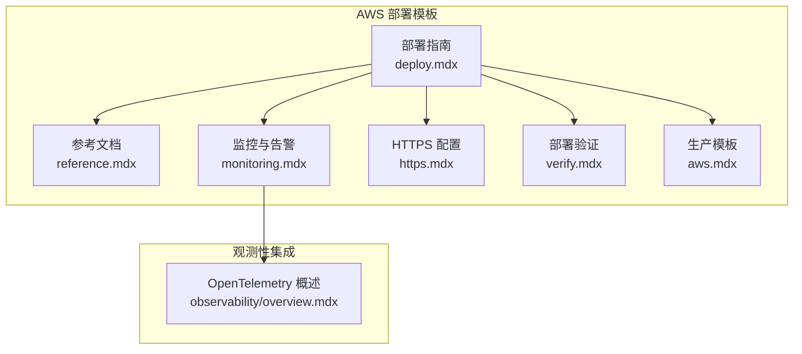
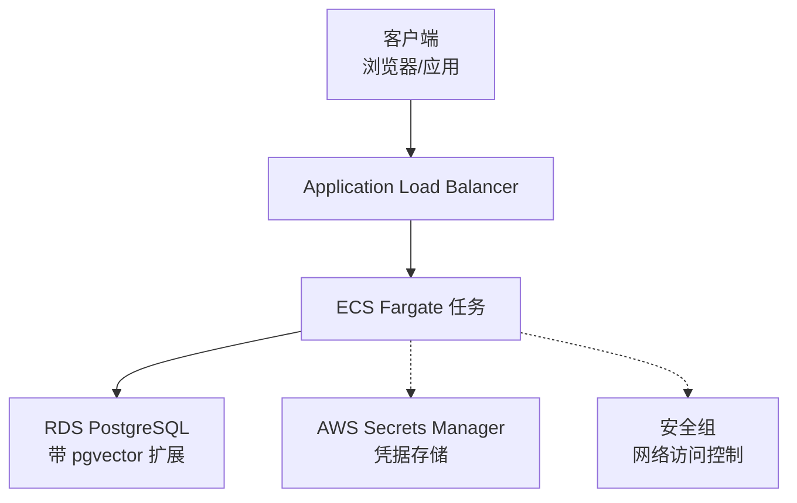
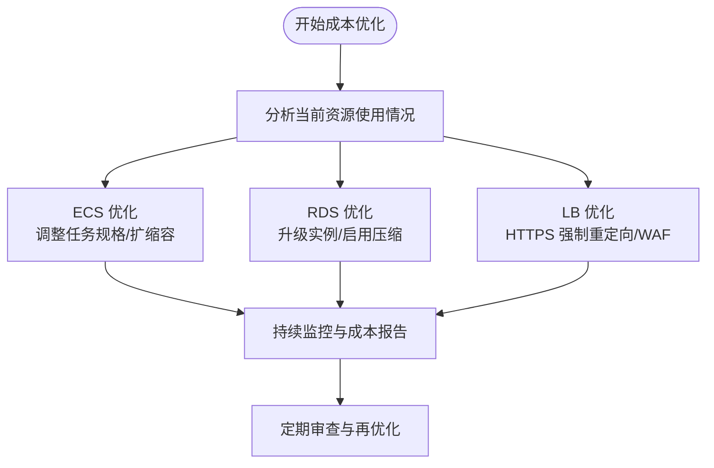
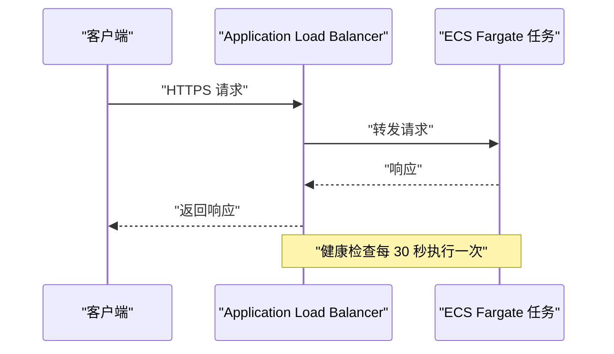
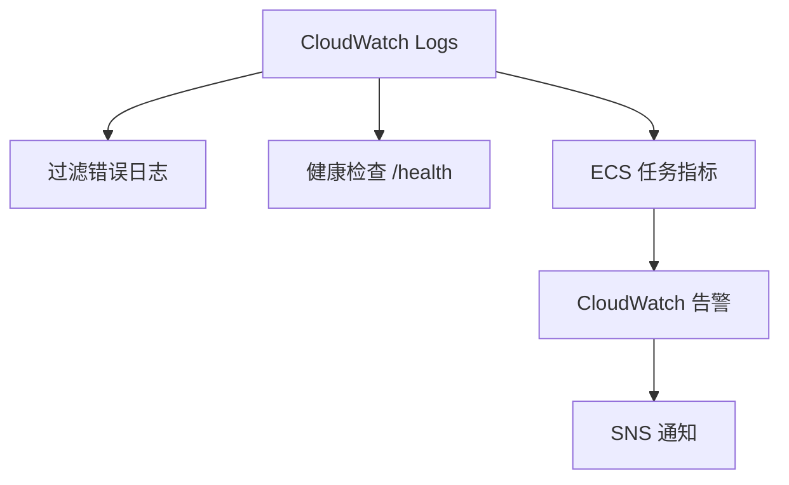
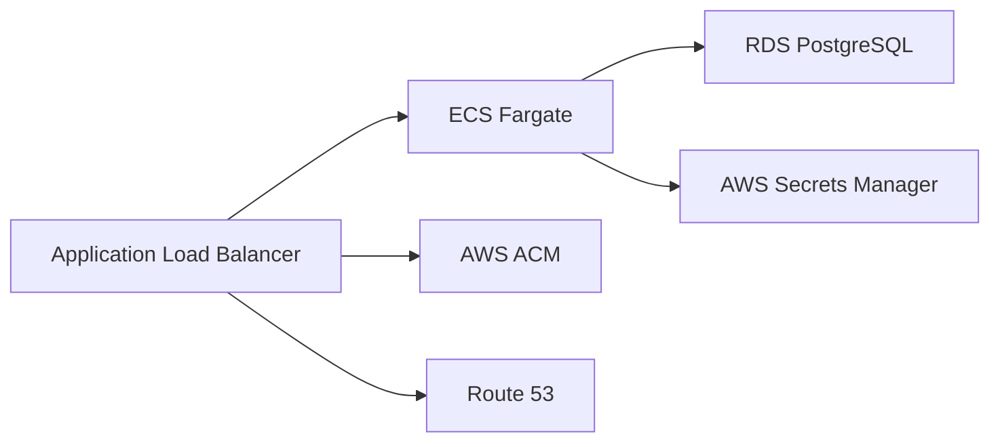

# 成本优化和最佳实践

<cite>
**本文档引用的文件**
- [deploy.mdx](file://deploy/templates/aws/deploy.mdx)
- [reference.mdx](file://deploy/templates/aws/reference.mdx)
- [monitoring.mdx](file://deploy/templates/aws/manage/monitoring.mdx)
- [https.mdx](file://deploy/templates/aws/go-live/https.mdx)
- [verify.mdx](file://deploy/templates/aws/go-live/verify.mdx)
- [aws.mdx](file://production/templates/aws.mdx)
- [overview.mdx](file://observability/overview.mdx)
</cite>

## 目录
1. [简介](#简介)
2. [项目结构](#项目结构)
3. [核心组件](#核心组件)
4. [架构概览](#架构概览)
5. [详细组件分析](#详细组件分析)
6. [依赖关系分析](#依赖关系分析)
7. [性能考虑](#性能考虑)
8. [故障排除指南](#故障排除指南)
9. [结论](#结论)
10. [附录](#附录)

## 简介
本指南专注于基于 AWS 的 AgentOS 部署模板的成本优化与最佳实践。文档覆盖以下关键主题：
- 详细的月度成本估算（含 ECS Fargate、RDS db.t3.micro、Application Load Balancer 等）
- 根据实际需求调整资源配置以实现成本优化（实例类型选择与资源规格调整）
- AWS 服务的最佳实践（负载均衡器配置、数据库性能调优、容器资源限制）
- 监控与告警设置，帮助及时发现并解决性能问题
- 故障排除与常见问题解决方案

## 项目结构
该仓库提供了完整的 AWS 部署模板与相关文档，涵盖从部署到运维的全生命周期管理。核心文件包括：
- 部署指南：定义了生产级架构、成本估算与部署步骤
- 参考文档：包含自定义、本地开发、环境变量与故障排除
- 监控与告警：提供日志查看、健康检查、告警配置等运维能力
- HTTPS 与验证：指导如何添加 HTTPS 支持并验证部署状态
- 观测性：支持通过 OpenTelemetry 集成主流追踪与监控平台

**图表来源**
- [deploy.mdx:1-370](file://deploy/templates/aws/deploy.mdx#L1-L370)
- [reference.mdx:1-183](file://deploy/templates/aws/reference.mdx#L1-L183)
- [monitoring.mdx:1-128](file://deploy/templates/aws/manage/monitoring.mdx#L1-L128)
- [https.mdx:1-122](file://deploy/templates/aws/go-live/https.mdx#L1-L122)
- [verify.mdx:1-80](file://deploy/templates/aws/go-live/verify.mdx#L1-L80)
- [aws.mdx:1-210](file://production/templates/aws.mdx#L1-L210)
- [overview.mdx:1-25](file://observability/overview.mdx#L1-L25)

**章节来源**
- [deploy.mdx:1-370](file://deploy/templates/aws/deploy.mdx#L1-L370)
- [reference.mdx:1-183](file://deploy/templates/aws/reference.mdx#L1-L183)
- [monitoring.mdx:1-128](file://deploy/templates/aws/manage/monitoring.mdx#L1-L128)
- [https.mdx:1-122](file://deploy/templates/aws/go-live/https.mdx#L1-L122)
- [verify.mdx:1-80](file://deploy/templates/aws/go-live/verify.mdx#L1-L80)
- [aws.mdx:1-210](file://production/templates/aws.mdx#L1-L210)
- [overview.mdx:1-25](file://observability/overview.mdx#L1-L25)

## 核心组件
本模板的核心组件包括：
- ECS Fargate：无服务器容器托管，适合弹性伸缩与按需计费
- RDS PostgreSQL（带 pgvector）：托管数据库，支持向量扩展
- Application Load Balancer：HTTP/HTTPS 终端节点，支持健康检查与重定向
- AWS Secrets Manager：安全存储凭据
- 安全组：网络访问控制

成本估算（按 US East 区域）：
- ECS Fargate：$30-50/月
- RDS db.t3.micro：$15-20/月
- Application Load Balancer：$20-25/月
- 总计：约 $65-100/月

**章节来源**
- [deploy.mdx:33-44](file://deploy/templates/aws/deploy.mdx#L33-L44)
- [aws.mdx:182-191](file://production/templates/aws.mdx#L182-L191)

## 架构概览
下图展示了基于 ECS Fargate、RDS 和 Application Load Balancer 的生产级架构：

**图表来源**
- [deploy.mdx:20-31](file://deploy/templates/aws/deploy.mdx#L20-L31)
- [aws.mdx:170-179](file://production/templates/aws.mdx#L170-L179)

## 详细组件分析

### 成本估算与优化策略
- ECS Fargate
  - 适用场景：高并发波动、无需管理底层 EC2 实例
  - 优化建议：根据峰值 CPU/内存使用率调整任务规格；启用自动扩缩容；结合预留容量减少突发成本
- RDS db.t3.micro
  - 适用场景：中低吞吐量、开发或小规模生产
  - 优化建议：监控存储 IOPS 与连接数；必要时升级到 db.t4g 或更高规格；启用自动备份与压缩
- Application Load Balancer
  - 适用场景：高可用 HTTP/HTTPS 终端节点
  - 优化建议：开启访问日志与 WAF；配置健康检查与超时参数；启用 HTTPS 并强制重定向

**图表来源**
- [deploy.mdx:33-44](file://deploy/templates/aws/deploy.mdx#L33-L44)
- [aws.mdx:182-191](file://production/templates/aws.mdx#L182-L191)

**章节来源**
- [deploy.mdx:33-44](file://deploy/templates/aws/deploy.mdx#L33-L44)
- [aws.mdx:182-191](file://production/templates/aws.mdx#L182-L191)

### 负载均衡器配置最佳实践
- 健康检查：每 30 秒检查 /health 端点，确保任务健康状态
- 监听器：创建 HTTPS 监听器并配置证书 ARN
- 重定向：将 HTTP 请求重定向至 HTTPS
- 访问日志：启用 ALB 访问日志以便审计与性能分析

**图表来源**
- [monitoring.mdx:77-86](file://deploy/templates/aws/manage/monitoring.mdx#L77-L86)
- [https.mdx:57-101](file://deploy/templates/aws/go-live/https.mdx#L57-L101)

**章节来源**
- [monitoring.mdx:77-86](file://deploy/templates/aws/manage/monitoring.mdx#L77-L86)
- [https.mdx:57-101](file://deploy/templates/aws/go-live/https.mdx#L57-L101)

### 数据库性能调优
- 连接池与并发：合理设置最大连接数，避免连接争用
- 存储与索引：为常用查询字段建立索引；定期维护统计信息
- 备份与恢复：启用自动备份与跨区域复制（如需要）
- 监控指标：关注慢查询日志、锁等待与表扫描

**章节来源**
- [monitoring.mdx:67-76](file://deploy/templates/aws/manage/monitoring.mdx#L67-L76)

### 容器资源限制与最佳实践
- 内存与 CPU：根据峰值使用设置任务内存上限，避免 OOMKilled
- 工作进程：在高并发场景下适当降低工作进程数量以减少竞争
- 镜像与构建：使用多阶段构建减小镜像体积，提升拉取速度

**章节来源**
- [monitoring.mdx:67-76](file://deploy/templates/aws/manage/monitoring.mdx#L67-L76)

### 监控与告警设置
- 日志查看：使用 CloudWatch Logs 实时跟踪容器输出
- 健康检查：确认 /health 返回 200 OK
- 告警规则：创建失败任务告警，阈值为 1，触发 SNS 通知
- 日志保留：根据成本预算设置保留期（7/30/90 天）

**图表来源**
- [monitoring.mdx:11-17](file://deploy/templates/aws/manage/monitoring.mdx#L11-L17)
- [monitoring.mdx:109-127](file://deploy/templates/aws/manage/monitoring.mdx#L109-L127)

**章节来源**
- [monitoring.mdx:11-17](file://deploy/templates/aws/manage/monitoring.mdx#L11-L17)
- [monitoring.mdx:109-127](file://deploy/templates/aws/manage/monitoring.mdx#L109-L127)

### HTTPS 与域名配置
- 域名注册：在 Route 53 中注册或使用现有域名
- 证书申请：通过 AWS ACM 申请证书并进行 DNS 验证
- 负载均衡器：更新监听器以启用 HTTPS 并配置证书 ARN
- 强制重定向：将 HTTP 请求重定向至 HTTPS

**章节来源**
- [https.mdx:10-101](file://deploy/templates/aws/go-live/https.mdx#L10-L101)

### 部署验证流程
- 健康检查：通过 curl 验证 /health 端点
- 日志验证：确认启动完成日志
- ECS 状态：检查运行实例数与期望实例数一致
- 负载均衡器：确认目标健康状态为 healthy

**章节来源**
- [verify.mdx:11-72](file://deploy/templates/aws/go-live/verify.mdx#L11-L72)

## 依赖关系分析
- 组件耦合
  - ECS 任务依赖 RDS 提供的数据存储
  - Application Load Balancer 作为流量入口，依赖 ECS 任务健康状态
  - AWS Secrets Manager 为 ECS 任务提供安全凭据
- 外部依赖
  - AWS CLI 与 IAM 权限用于资源创建与管理
  - ACM 与 Route 53 用于 HTTPS 证书与域名解析

**图表来源**
- [deploy.mdx:20-31](file://deploy/templates/aws/deploy.mdx#L20-L31)
- [https.mdx:16-55](file://deploy/templates/aws/go-live/https.mdx#L16-L55)

**章节来源**
- [deploy.mdx:20-31](file://deploy/templates/aws/deploy.mdx#L20-L31)
- [https.mdx:16-55](file://deploy/templates/aws/go-live/https.mdx#L16-L55)

## 性能考虑
- 资源规划：基于历史流量与峰值使用率设定 ECS 任务规格
- 数据库优化：合理索引、连接池与备份策略
- 网络优化：安全组放通与负载均衡器健康检查参数
- 观测性：结合 OpenTelemetry 与 CloudWatch 实现端到端可观测

**章节来源**
- [overview.mdx:14-23](file://observability/overview.mdx#L14-L23)

## 故障排除指南
- 常见症状与处理
  - 健康检查返回 502：容器仍在启动，等待 2-3 分钟后重试
  - 任务循环重启：检查 ECS 任务日志中的错误信息
  - RDS 连接超时：等待约 5 分钟直至可用
  - ECR 认证过期：重新执行认证命令
- 快速定位
  - 查看 CloudWatch 日志与 ECS 服务状态
  - 检查安全组是否允许 ALB 访问容器端口
  - 确认数据库连接参数正确

**章节来源**
- [monitoring.mdx:67-92](file://deploy/templates/aws/manage/monitoring.mdx#L67-L92)
- [deploy.mdx:326-370](file://deploy/templates/aws/deploy.mdx#L326-L370)
- [reference.mdx:167-182](file://deploy/templates/aws/reference.mdx#L167-L182)

## 结论
通过合理的资源配置与运维实践，可在保证稳定性的前提下显著降低 AWS 成本。建议优先从负载均衡器与数据库入手进行优化，并建立完善的监控与告警体系，以实现快速发现问题与持续改进。

## 附录
- 成本估算参考
  - ECS Fargate：$30-50/月
  - RDS db.t3.micro：$15-20/月
  - Application Load Balancer：$20-25/月
  - 总计：约 $65-100/月
- 相关文档路径
  - [部署指南:33-44](file://deploy/templates/aws/deploy.mdx#L33-L44)
  - [生产模板:182-191](file://production/templates/aws.mdx#L182-L191)
  - [监控与告警:109-127](file://deploy/templates/aws/manage/monitoring.mdx#L109-L127)
  - [HTTPS 配置:57-101](file://deploy/templates/aws/go-live/https.mdx#L57-L101)
  - [部署验证:11-72](file://deploy/templates/aws/go-live/verify.mdx#L11-L72)
  - [观测性概述:14-23](file://observability/overview.mdx#L14-L23)