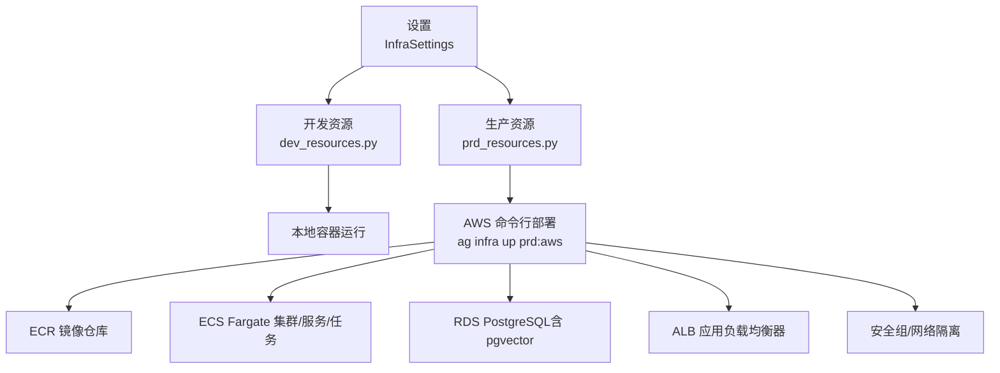
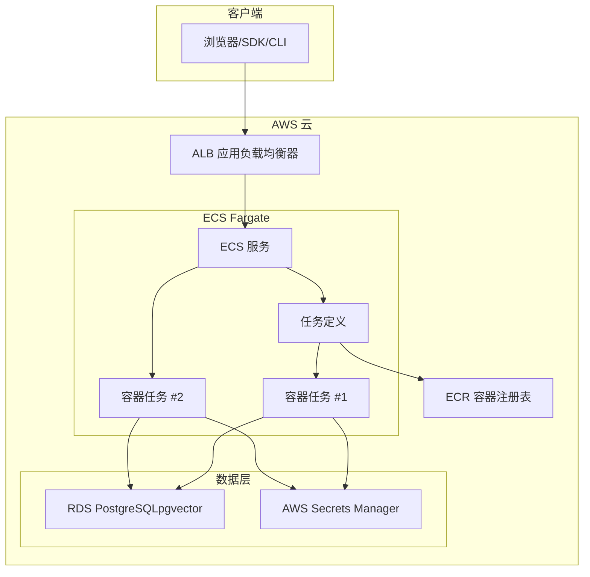
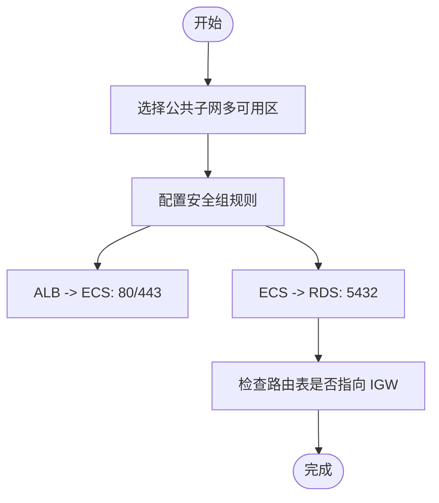
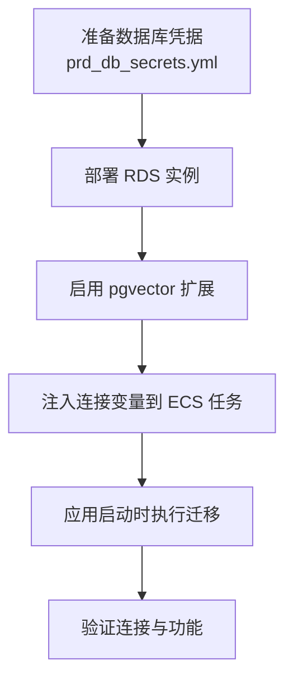
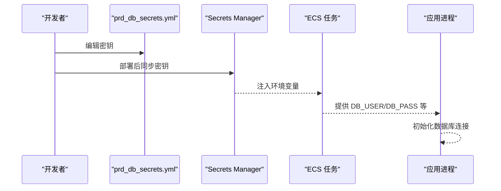
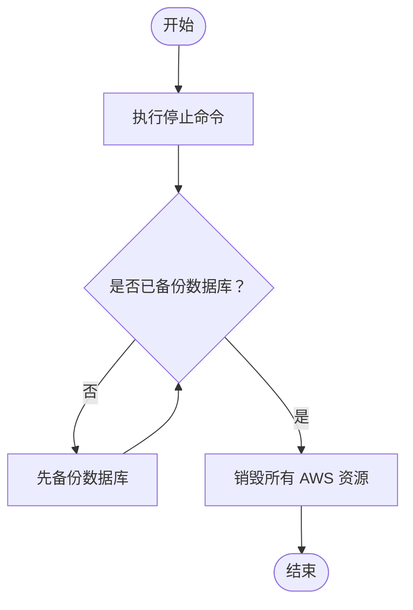
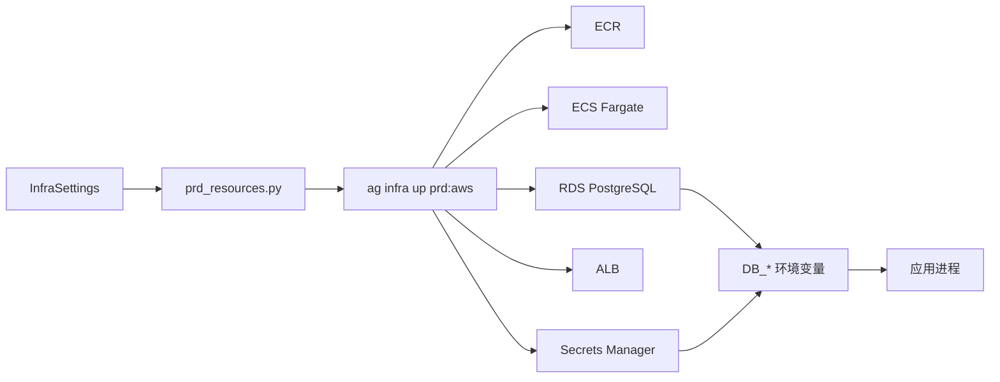

# 资源配置和架构

<cite>
**本文引用的文件**   
- [deploy.mdx](file://deploy/templates/aws/deploy.mdx)
- [reference.mdx](file://deploy/templates/aws/reference.mdx)
- [secrets.mdx](file://deploy/templates/aws/configure/secrets.mdx)
- [database.mdx](file://deploy/templates/aws/configure/database.mdx)
- [updates.mdx](file://deploy/templates/aws/go-live/updates.mdx)
- [aws.mdx](file://production/templates/aws.mdx)
- [create-aws-resources.mdx](file://TBD/snippets/create-aws-resources.mdx)
- [run-agent-infra-aws-prd.mdx](file://_snippets/run-agent-infra-aws-prd.mdx)
</cite>

## 目录
1. [简介](#简介)
2. [项目结构](#项目结构)
3. [核心组件](#核心组件)
4. [架构总览](#架构总览)
5. [组件详解](#组件详解)
6. [依赖关系分析](#依赖关系分析)
7. [性能与成本](#性能与成本)
8. [故障排查指南](#故障排查指南)
9. [结论](#结论)
10. [附录](#附录)

## 简介
本文件面向使用 AWS 模板进行 AgentOS 生产部署的用户，系统性说明模板自动创建的基础设施与网络架构，涵盖以下关键主题：
- 自动创建的 AWS 资源：ECR 容器注册表、ECS Fargate 集群、RDS PostgreSQL（含 pgvector 扩展）、Application Load Balancer、安全组等
- 网络架构设计：VPC、子网、安全组、路由表的配置原则与访问控制
- 数据库配置与 pgvector 扩展启用流程
- AWS Secrets Manager 使用与安全凭证管理最佳实践
- 资源清理与停止部署操作指南

## 项目结构
AWS 模板的基础设施由“设置 + 资源定义 + 部署命令”三部分组成：
- 设置（InfraSettings）：定义基础设施名称、区域、子网、镜像仓库等
- 资源定义（开发/生产）：分别在本地 Docker 与 AWS 上声明资源清单
- 部署命令：通过 Agno CLI 在 AWS 上创建并运行资源

图表来源
- [deploy.mdx:200-250](file://deploy/templates/aws/deploy.mdx#L200-L250)
- [reference.mdx:9-18](file://deploy/templates/aws/reference.mdx#L9-L18)

章节来源
- [deploy.mdx:102-258](file://deploy/templates/aws/deploy.mdx#L102-L258)
- [reference.mdx:9-18](file://deploy/templates/aws/reference.mdx#L9-L18)

## 核心组件
- ECR 容器注册表：用于存放应用镜像，支持推送与拉取
- ECS Fargate 集群/服务/任务：无服务器容器编排，按需弹性伸缩
- RDS PostgreSQL：托管数据库，内置 pgvector 扩展以支持向量检索
- Application Load Balancer：对外提供统一入口，支持健康检查与流量分发
- 安全组：控制入站/出站流量，实现最小权限访问
- AWS Secrets Manager：集中存储与注入密钥，避免硬编码

章节来源
- [deploy.mdx:244-250](file://deploy/templates/aws/deploy.mdx#L244-L250)
- [aws.mdx:170-179](file://production/templates/aws.mdx#L170-L179)

## 架构总览
下图展示从本地到云端的端到端架构，以及各组件之间的交互关系。

图表来源
- [deploy.mdx:244-250](file://deploy/templates/aws/deploy.mdx#L244-L250)
- [aws.mdx:170-179](file://production/templates/aws.mdx#L170-L179)

## 组件详解

### 网络架构设计（VPC、子网、安全组、路由表）
- 子网选择：优先选择具备“自动分配公网 IP”且位于不同可用区的公共子网，确保高可用
- 安全组策略：仅开放 ALB 至 ECS 的必要端口；ECS 到 RDS 仅允许 5432 端口；限制来源为 ECS 安全组或 ALB 安全组
- 路由表：公共子网路由表应指向互联网网关（IGW），保证容器可访问外网（如拉取镜像、调用外部 API）

图表来源
- [deploy.mdx:180-190](file://deploy/templates/aws/deploy.mdx#L180-L190)

章节来源
- [deploy.mdx:180-190](file://deploy/templates/aws/deploy.mdx#L180-L190)

### 数据库配置与 pgvector 扩展启用
- RDS 实例默认使用 PostgreSQL 17，实例规格与存储可按需调整
- 启用 pgvector：模板在部署时自动创建带 pgvector 的 RDS 实例
- 连接参数：DB_HOST、DB_PORT、DB_USER、DB_PASS、DB_DATABASE 由资源定义自动注入
- 迁移策略：可在启动容器时执行迁移，或通过 ECS Exec 手动执行

图表来源
- [database.mdx:105-126](file://deploy/templates/aws/configure/database.mdx#L105-L126)

章节来源
- [database.mdx:44-87](file://deploy/templates/aws/configure/database.mdx#L44-L87)
- [database.mdx:101-126](file://deploy/templates/aws/configure/database.mdx#L101-L126)

### AWS Secrets Manager 使用与安全凭证管理
- 本地：密钥直接从 YAML 文件读取，便于开发调试
- 生产：密钥同步至 AWS Secrets Manager，并注入到 ECS 任务环境变量
- 最佳实践：
  - 将密钥文件加入版本控制忽略列表
  - 分离 API 密钥与数据库凭据，便于独立轮换
  - 避免在密码中使用特殊字符导致连接失败
  - 使用只读权限的 IAM 角色与最小权限策略

图表来源
- [secrets.mdx:112-124](file://deploy/templates/aws/configure/secrets.mdx#L112-L124)

章节来源
- [secrets.mdx:84-94](file://deploy/templates/aws/configure/secrets.mdx#L84-L94)
- [secrets.mdx:108-128](file://deploy/templates/aws/configure/secrets.mdx#L108-L128)

### 资源清理与停止部署
- 停止部署：使用 Agno CLI 命令停止并销毁所有资源（包括数据库）
- 清理前建议备份数据库，避免数据丢失
- 更新部署：对代码或配置变更进行增量更新，避免全量重建

图表来源
- [reference.mdx:11-18](file://deploy/templates/aws/reference.mdx#L11-L18)

章节来源
- [reference.mdx:11-18](file://deploy/templates/aws/reference.mdx#L11-L18)
- [run-agent-infra-aws-prd.mdx:50-64](file://_snippets/run-agent-infra-aws-prd.mdx#L50-L64)

## 依赖关系分析
- 基础设施依赖链：InfraSettings → prd_resources.py → AWS CLI → ECR/ECS/RDS/ALB/Secrets
- 环境变量依赖：DB_HOST/DB_PORT/DB_USER/DB_PASS/DB_DATABASE 由 RDS 输出自动注入
- 密钥依赖：prd_db_secrets.yml → Secrets Manager → ECS 任务 → 应用

图表来源
- [deploy.mdx:200-250](file://deploy/templates/aws/deploy.mdx#L200-L250)
- [database.mdx:90-100](file://deploy/templates/aws/configure/database.mdx#L90-L100)
- [secrets.mdx:112-124](file://deploy/templates/aws/configure/secrets.mdx#L112-L124)

章节来源
- [deploy.mdx:200-250](file://deploy/templates/aws/deploy.mdx#L200-L250)
- [database.mdx:90-100](file://deploy/templates/aws/configure/database.mdx#L90-L100)
- [secrets.mdx:112-124](file://deploy/templates/aws/configure/secrets.mdx#L112-L124)

## 性能与成本
- 成本估算（按月）：ECS Fargate $30–50、RDS PostgreSQL（含 pgvector）$25、ALB $20–25、Secrets Manager 接近免费
- 性能要点：选择合适实例规格与存储容量；开启自动扩展与健康检查；合理设置安全组与子网分布

章节来源
- [deploy.mdx:33-44](file://deploy/templates/aws/deploy.mdx#L33-L44)

## 故障排查指南
- ECR 认证过期：重新执行认证命令或使用脚本
- RDS 创建耗时：等待约 5–10 分钟，检查控制台状态
- 公共子网缺失：检查路由表是否指向 IGW，并确认“自动分配公网 IP”
- 健康检查返回 502：容器尚未就绪，稍后再试；查看 ECS 任务日志
- 任务反复重启：检查密钥、数据库连接字符串、模型 API 密钥有效性
- 数据库连接失败：避免密码中使用特殊字符；确认安全组放行 5432

章节来源
- [deploy.mdx:326-370](file://deploy/templates/aws/deploy.mdx#L326-L370)
- [updates.mdx:53-124](file://deploy/templates/aws/go-live/updates.mdx#L53-L124)
- [database.mdx:160-168](file://deploy/templates/aws/configure/database.mdx#L160-L168)
- [secrets.mdx:162-178](file://deploy/templates/aws/configure/secrets.mdx#L162-L178)

## 结论
该 AWS 模板提供了从本地开发到生产部署的一体化方案，通过 ECS Fargate、RDS PostgreSQL（pgvector）、ALB 与 Secrets Manager 等组件，构建了高可用、可扩展且安全的基础设施。遵循本文的网络设计原则、数据库配置流程与密钥管理最佳实践，可显著降低部署与运维复杂度，并提升安全性与稳定性。

## 附录
- 快速命令参考
  - 部署生产：ag infra up prd:aws
  - 停止生产：ag infra down prd:aws
  - 更新单个资源：ag infra patch prd:aws::service
  - 获取负载均衡器 DNS：aws elbv2 describe-load-balancers
  - 查看 ECS 服务状态：aws ecs describe-services
  - 查看 CloudWatch 日志：aws logs tail {infra_name}-prd-api

章节来源
- [reference.mdx:9-18](file://deploy/templates/aws/reference.mdx#L9-L18)
- [updates.mdx:78-91](file://deploy/templates/aws/go-live/updates.mdx#L78-L91)
- [run-agent-infra-aws-prd.mdx:14-64](file://_snippets/run-agent-infra-aws-prd.mdx#L14-L64)