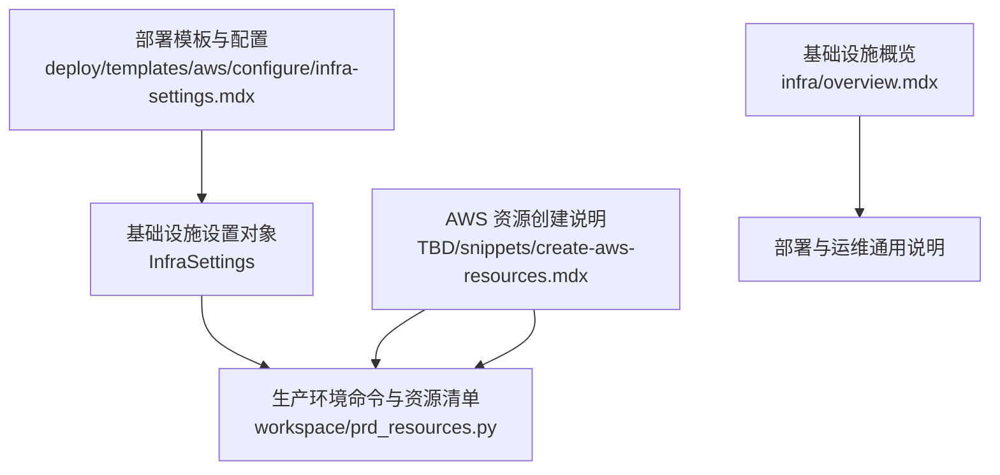
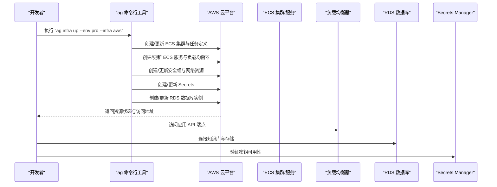
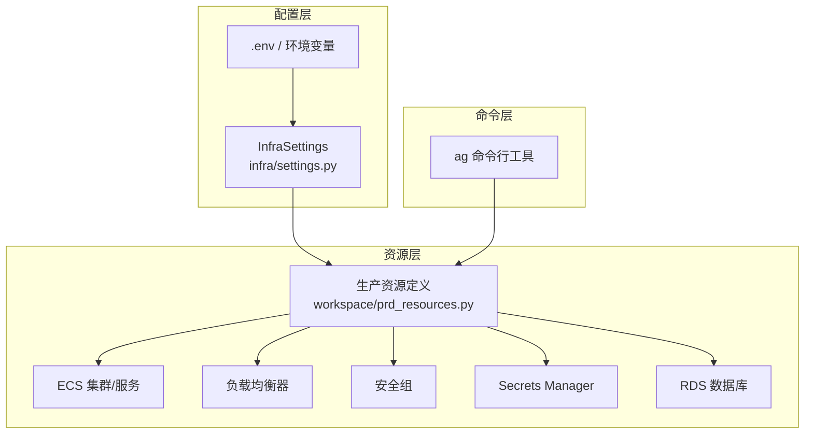

# 部署指南

<cite>
**本文引用的文件**
- [TBD/snippets/create-aws-resources.mdx](file://TBD/snippets/create-aws-resources.mdx)
- [deploy/templates/aws/configure/infra-settings.mdx](file://deploy/templates/aws/configure/infra-settings.mdx)
- [infra/overview.mdx](file://infra/overview.mdx)
</cite>

## 目录
1. [简介](#简介)
2. [项目结构](#项目结构)
3. [核心组件](#核心组件)
4. [架构总览](#架构总览)
5. [详细组件分析](#详细组件分析)
6. [依赖关系分析](#依赖关系分析)
7. [性能考虑](#性能考虑)
8. [故障排查指南](#故障排查指南)
9. [结论](#结论)
10. [附录](#附录)

## 简介
本指南面向使用 AWS 模板进行 AgentOS 应用部署的用户，覆盖从创建代码库、配置 AWS 资源、本地验证到生产部署与监控的完整流程。重点说明 ag infra create 命令（等价于 ag infra up）在 AWS 环境中的使用方式、InfraSettings 参数配置与最佳实践、本地测试与验证方法（含 Docker Compose 与 API 端点测试）、生产环境部署命令与资源创建过程，以及部署后与 AgentOS 控制平面的连接与验证步骤。

## 项目结构
AWS 模板部署相关的核心内容分布在以下位置：
- 部署模板与 AWS 配置：deploy/templates/aws/configure/infra-settings.mdx
- AWS 资源创建说明：TBD/snippets/create-aws-resources.mdx
- 基础设施概览：infra/overview.mdx

下图展示与 AWS 模板部署直接相关的文件与职责映射：

图表来源
- [deploy/templates/aws/configure/infra-settings.mdx:1-80](file://deploy/templates/aws/configure/infra-settings.mdx#L1-L80)
- [TBD/snippets/create-aws-resources.mdx:1-32](file://TBD/snippets/create-aws-resources.mdx#L1-L32)
- [infra/overview.mdx](file://infra/overview.mdx)

章节来源
- [deploy/templates/aws/configure/infra-settings.mdx:1-80](file://deploy/templates/aws/configure/infra-settings.mdx#L1-L80)
- [TBD/snippets/create-aws-resources.mdx:1-32](file://TBD/snippets/create-aws-resources.mdx#L1-L32)
- [infra/overview.mdx](file://infra/overview.mdx)

## 核心组件
- InfraSettings 对象：用于集中管理基础设施名称、镜像仓库、子网、构建与推送策略等，贯穿开发与生产环境。
- ag infra 命令族：通过 ag infra up（或等价的 shorthand）在指定环境与模板（如 AWS）上创建/更新资源。
- 生产资源定义：workspace/prd_resources.py 中定义了 ECS 集群、任务定义与服务、负载均衡器、安全组、密钥管理与数据库等资源。

章节来源
- [deploy/templates/aws/configure/infra-settings.mdx:5-80](file://deploy/templates/aws/configure/infra-settings.mdx#L5-L80)
- [TBD/snippets/create-aws-resources.mdx:17-31](file://TBD/snippets/create-aws-resources.mdx#L17-L31)

## 架构总览
下图展示了从命令触发到资源创建的端到端流程，以及与 AgentOS 控制平面的连接关系：

图表来源
- [TBD/snippets/create-aws-resources.mdx:7-31](file://TBD/snippets/create-aws-resources.mdx#L7-L31)

## 详细组件分析

### AWS 资源创建流程
- 命令形式
  - 完整形式：ag infra up --env prd --infra aws
  - 简写形式：ag infra up prd:aws
- 创建的资源
  - ECS 集群、任务定义与服务
  - 负载均衡器
  - 安全组
  - Secrets 管理
  - RDS 数据库（知识库与存储）
- 资源定义位置
  - 生产资源定义位于 workspace/prd_resources.py
- 验证入口
  - 使用 ECS 控制台查看服务与日志
  - 使用 RDS 控制台查看数据库实例

章节来源
- [TBD/snippets/create-aws-resources.mdx:7-31](file://TBD/snippets/create-aws-resources.mdx#L7-L31)

### InfraSettings 参数配置与最佳实践
- 关键参数
  - infra_name：用于命名应用与资源（如图像、应用、桶、密钥、负载均衡器等）
  - aws_subnet_ids：生产环境使用的子网 ID 列表
  - image_repo：镜像仓库地址（Docker Hub 或 ECR）
  - build_images：是否在本地构建镜像
  - push_images：构建完成后是否推送镜像
- 配置方式
  - 可通过 infra/settings.py 中的 InfraSettings 对象进行集中配置
  - 支持通过环境变量或 .env 文件进行覆盖
  - 参考 example.env 获取示例
- 使用场景
  - 开发镜像与生产镜像分别在 dev_resources.py 与 prd_resources.py 中引用
  - aws_region 与 aws_subnet_ids 在生产资源中被使用

章节来源
- [deploy/templates/aws/configure/infra-settings.mdx:5-80](file://deploy/templates/aws/configure/infra-settings.mdx#L5-L80)

### 本地测试与验证
- Docker Compose 使用
  - 通过本地容器编排运行应用与数据库，便于快速验证 API 端点与数据流
- API 端点测试
  - 在本地启动后，调用应用提供的 API 端点进行功能与集成测试
  - 验证响应时间、错误码与业务逻辑正确性
- 与 AgentOS 控制平面连接
  - 在本地环境中配置控制平面连接参数，确保 AgentOS 组件可正常注册与通信

（本节为通用指导，未直接分析具体文件）

### 生产环境部署命令与参数
- 命令
  - ag infra up --env prd --infra aws 或 ag infra up prd:aws
- 资源创建过程
  - 自动创建 ECS 集群、任务定义、服务、负载均衡器、安全组、Secrets 与 RDS 数据库
- 监控方法
  - 使用 ECS 控制台查看服务状态与日志
  - 使用 RDS 控制台查看数据库实例状态与性能指标

章节来源
- [TBD/snippets/create-aws-resources.mdx:7-31](file://TBD/snippets/create-aws-resources.mdx#L7-L31)

### 部署后的连接与验证
- 连接 AgentOS 控制平面
  - 在生产环境中配置控制平面连接参数，确保 AgentOS 组件可注册与通信
- 验证步骤
  - 通过负载均衡器访问应用 API
  - 连接 RDS 数据库验证知识库与存储可用性
  - 在 ECS 控制台确认服务健康状态与日志输出

章节来源
- [TBD/snippets/create-aws-resources.mdx:19-31](file://TBD/snippets/create-aws-resources.mdx#L19-L31)

## 依赖关系分析
下图展示 AWS 模板部署中各组件之间的依赖关系与交互：

图表来源
- [deploy/templates/aws/configure/infra-settings.mdx:5-80](file://deploy/templates/aws/configure/infra-settings.mdx#L5-L80)
- [TBD/snippets/create-aws-resources.mdx:29-31](file://TBD/snippets/create-aws-resources.mdx#L29-L31)

章节来源
- [deploy/templates/aws/configure/infra-settings.mdx:5-80](file://deploy/templates/aws/configure/infra-settings.mdx#L5-L80)
- [TBD/snippets/create-aws-resources.mdx:29-31](file://TBD/snippets/create-aws-resources.mdx#L29-L31)

## 性能考虑
- 镜像构建与推送
  - 合理设置 build_images 与 push_images，避免不必要的重复构建与推送
- 资源规格
  - 根据流量与数据规模选择合适的 ECS 实例类型与 RDS 规格
- 网络与安全
  - 正确配置安全组与子网，减少跨区域与跨可用区的网络延迟
- 监控与告警
  - 在 ECS 与 RDS 层面启用基础监控，结合日志聚合与告警策略

（本节为通用指导，未直接分析具体文件）

## 故障排查指南
- 资源创建失败
  - 检查 AWS 凭证与权限
  - 查看 ECS 控制台与 CloudFormation 日志
- 数据库不可用
  - 在 RDS 控制台确认实例状态与连接参数
- 端点无法访问
  - 检查负载均衡器健康检查与目标组配置
  - 核对安全组放行规则
- 密钥问题
  - 在 Secrets Manager 中确认密钥存在且值正确

章节来源
- [TBD/snippets/create-aws-resources.mdx:29-31](file://TBD/snippets/create-aws-resources.mdx#L29-L31)

## 结论
通过本指南，您可以在 AWS 上完成从基础设施配置、资源创建到生产部署与监控的全流程。建议优先完成 InfraSettings 的参数校验与 .env 配置，再执行 ag infra up 命令创建生产资源，并在部署后立即验证 API 端点、数据库连接与 AgentOS 控制平面的连通性。

## 附录
- 相关参考文件
  - [deploy/templates/aws/configure/infra-settings.mdx](file://deploy/templates/aws/configure/infra-settings.mdx)
  - [TBD/snippets/create-aws-resources.mdx](file://TBD/snippets/create-aws-resources.mdx)
  - [infra/overview.mdx](file://infra/overview.mdx)