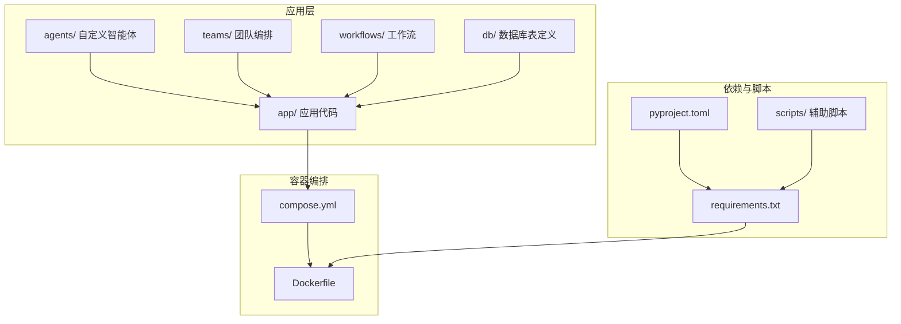
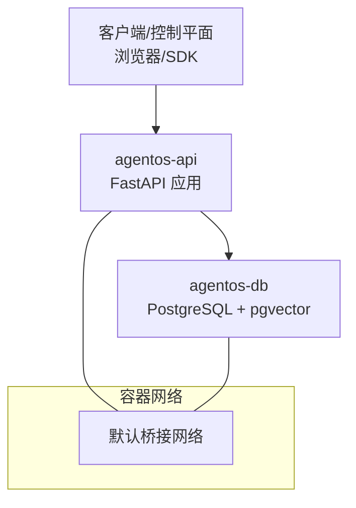
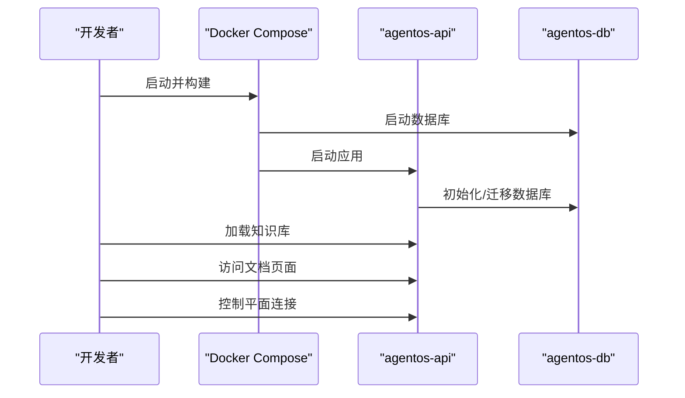
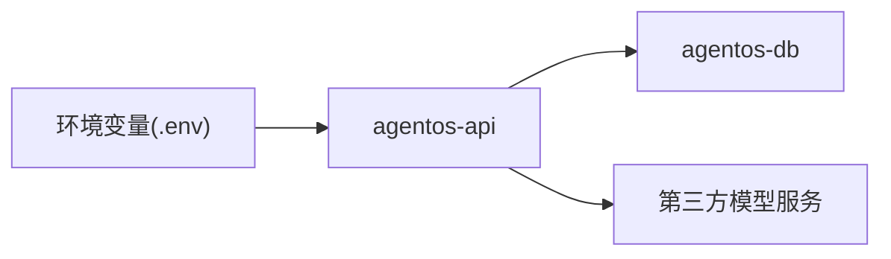

# Docker 模板

<cite>
**本文引用的文件**
- [deploy.mdx](file://deploy/templates/docker/deploy.mdx)
- [reference.mdx](file://deploy/templates/docker/reference.mdx)
- [simple-agent-api-dependency-management.mdx](file://TBD/snippets/simple-agent-api-dependency-management.mdx)
- [simple-agent-api-production.mdx](file://TBD/snippets/simple-agent-api-production.mdx)
- [create-agent-infra-docker-codebase.mdx](file://_snippets/create-agent-infra-docker-codebase.mdx)
- [docker.mdx](file://production/templates/docker.mdx)
</cite>

## 目录
1. [简介](#简介)
2. [项目结构](#项目结构)
3. [核心组件](#核心组件)
4. [架构总览](#架构总览)
5. [详细组件分析](#详细组件分析)
6. [依赖关系分析](#依赖关系分析)
7. [性能考虑](#性能考虑)
8. [故障排查指南](#故障排查指南)
9. [结论](#结论)
10. [附录](#附录)

## 简介
本指南面向使用 Docker 部署模板的用户，系统讲解模板的设计原理与适用场景（本地开发、测试与自托管），并提供完整的配置说明与最佳实践，涵盖镜像构建、Compose 编排、网络与存储、环境变量、日志与监控、以及多阶段优化策略。模板以 AgentOS 为核心，结合 PostgreSQL + pgvector 提供向量检索能力，并支持热重载与快速迭代。

## 项目结构
该模板采用“按功能分层”的组织方式：应用代码位于 app/，数据库模型在 db/，容器编排通过 compose.yml 完成，镜像构建由 Dockerfile 定义，依赖管理通过 pyproject.toml 与 requirements.txt 协同，辅助脚本位于 scripts/。参考结构如下：

图表来源
- [create-agent-infra-docker-codebase.mdx:17-31](file://_snippets/create-agent-infra-docker-codebase.mdx#L17-L31)
- [docker.mdx:135-151](file://production/templates/docker.mdx#L135-L151)

章节来源
- [create-agent-infra-docker-codebase.mdx:17-31](file://_snippets/create-agent-infra-docker-codebase.mdx#L17-L31)
- [docker.mdx:135-151](file://production/templates/docker.mdx#L135-L151)

## 核心组件
- 应用服务（AgentOS API）
  - 提供 REST 接口与控制平面连接点，默认监听 8000 端口。
  - 支持热重载，便于本地开发迭代。
- 数据库服务（PostgreSQL + pgvector）
  - 默认使用 Docker 卷持久化数据；生产建议迁移到云托管数据库。
- 向量检索（pgvector）
  - 用于知识库与 RAG 场景，模板已内置示例智能体。
- 依赖与构建
  - 使用 Poetry 管理 Python 依赖，生成 requirements.txt 用于镜像构建。
  - 提供一键重建镜像的脚本与命令。

章节来源
- [deploy.mdx:14-87](file://deploy/templates/docker/deploy.mdx#L14-L87)
- [reference.mdx:113-129](file://deploy/templates/docker/reference.mdx#L113-L129)
- [simple-agent-api-dependency-management.mdx:2-37](file://TBD/snippets/simple-agent-api-dependency-management.mdx#L2-L37)

## 架构总览
下图展示容器间的交互关系与数据流向：应用服务依赖数据库服务，容器通过默认桥接网络通信；应用通过环境变量读取数据库连接信息；日志输出到标准输出，便于外部收集。

图表来源
- [deploy.mdx:89-101](file://deploy/templates/docker/deploy.mdx#L89-L101)
- [reference.mdx:131-142](file://deploy/templates/docker/reference.mdx#L131-L142)

## 详细组件分析

### 1) 镜像构建与多阶段优化
- 依赖同步
  - 修改 pyproject.toml 后，使用脚本生成 requirements.txt，确保镜像构建包含最新依赖。
  - 重新构建镜像后，容器内运行时依赖保持一致。
- 多阶段构建建议
  - 使用多阶段构建分离“构建环境”和“运行时环境”，减少最终镜像体积。
  - 将 Poetry 的虚拟环境与依赖安装过程放在构建阶段，运行阶段仅保留最小可执行集。
- 最佳实践
  - 在构建阶段缓存依赖以提升重复构建速度。
  - 使用 .dockerignore 忽略不必要的文件，避免污染镜像层。

章节来源
- [simple-agent-api-dependency-management.mdx:2-37](file://TBD/snippets/simple-agent-api-dependency-management.mdx#L2-L37)
- [docker.mdx:119-163](file://production/templates/docker.mdx#L119-L163)

### 2) Docker Compose 编排与服务
- 服务组成
  - agentos-api：应用服务，暴露 8000 端口。
  - agentos-db：PostgreSQL + pgvector，使用命名卷持久化数据。
- 端口映射
  - 默认映射 8000:8000；若冲突，可在 compose 文件中调整宿主端口。
- 健康检查与重启策略
  - 建议为数据库添加健康检查，确保应用启动前数据库可用。
  - 对应用设置合理的重启策略，避免频繁崩溃导致不可用。

章节来源
- [deploy.mdx:89-101](file://deploy/templates/docker/deploy.mdx#L89-L101)
- [reference.mdx:146-155](file://deploy/templates/docker/reference.mdx#L146-L155)
- [docker.mdx:153-163](file://production/templates/docker.mdx#L153-L163)

### 3) 环境变量与密钥管理
- 关键变量
  - OPENAI_API_KEY：必填，用于调用模型服务。
  - DB_*：数据库连接参数（主机、端口、用户、密码、库名）。
  - RUNTIME_ENV：开发/生产环境标识。
- 管理方式
  - 开发使用 .env 文件；生产建议使用平台机密管理或环境注入。
  - 更新后需重启容器使变更生效。

章节来源
- [reference.mdx:131-142](file://deploy/templates/docker/reference.mdx#L131-L142)
- [simple-agent-api-production.mdx:53-62](file://TBD/snippets/simple-agent-api-production.mdx#L53-L62)

### 4) 本地开发流程（从启动到调试）
- 步骤概览
  - 克隆模板仓库，准备 .env 并填写 API 密钥。
  - 启动所有服务并构建镜像。
  - 加载示例知识库，验证向量检索。
  - 访问文档页面确认服务可用。
  - 连接控制平面进行可视化管理。
- 快速迭代
  - 如需更快迭代，可直接在本地运行应用，同时复用 Compose 中的数据库容器。

图表来源
- [deploy.mdx:14-87](file://deploy/templates/docker/deploy.mdx#L14-L87)
- [reference.mdx:113-129](file://deploy/templates/docker/reference.mdx#L113-L129)

章节来源
- [deploy.mdx:14-87](file://deploy/templates/docker/deploy.mdx#L14-L87)
- [reference.mdx:113-129](file://deploy/templates/docker/reference.mdx#L113-L129)

### 5) 网络配置、数据卷与端口映射
- 网络
  - 默认使用 Docker 桥接网络，容器间可通过服务名互访。
- 存储
  - 数据库使用命名卷持久化；停止并删除容器不会丢失数据。
- 端口
  - 应用默认 8000 端口映射；如被占用，修改 compose 文件中的宿主端口即可。

章节来源
- [reference.mdx:146-155](file://deploy/templates/docker/reference.mdx#L146-L155)
- [docker.mdx:153-163](file://production/templates/docker.mdx#L153-L163)

### 6) 日志与监控最佳实践
- 日志
  - 容器标准输出即应用日志；建议接入集中式日志系统（如 ELK、Loki）统一采集。
- 监控
  - 结合平台指标导出与告警，关注容器健康状态、CPU/内存使用与数据库连接数。
- 调试
  - 生产环境可通过 SSH 或平台提供的调试入口进入容器排查问题。

章节来源
- [deploy.mdx:89-101](file://deploy/templates/docker/deploy.mdx#L89-L101)
- [docker.mdx:119-163](file://production/templates/docker.mdx#L119-L163)

### 7) 扩展与定制
- 添加智能体/工具
  - 在 agents/ 下新增智能体并在应用注册中心加入，随后重启服务。
- 更换模型
  - 在环境变量中配置新模型密钥，并更新智能体配置；同步更新依赖与镜像。
- 加载知识库
  - 通过执行内置脚本加载示例文档，或扩展为批量导入。

章节来源
- [reference.mdx:20-111](file://deploy/templates/docker/reference.mdx#L20-L111)

## 依赖关系分析
- 组件耦合
  - 应用服务对数据库存在强依赖，需确保数据库先于应用启动并完成初始化。
  - 环境变量贯穿应用与数据库配置，集中管理更安全可靠。
- 外部依赖
  - 第三方模型服务（如 OpenAI）通过密钥驱动，需在环境变量中显式配置。
- 可能的循环依赖
  - 模板采用单向依赖（应用→数据库），无循环依赖风险。

图表来源
- [reference.mdx:131-142](file://deploy/templates/docker/reference.mdx#L131-L142)
- [simple-agent-api-production.mdx:53-62](file://TBD/snippets/simple-agent-api-production.mdx#L53-L62)

## 性能考虑
- 镜像体积与启动时间
  - 使用多阶段构建与精简基础镜像，减少层大小与拉取时间。
- 依赖缓存
  - 在构建阶段缓存依赖，避免重复下载；升级依赖时清理缓存以获取最新版本。
- 数据库性能
  - 生产环境使用托管数据库并开启连接池；合理设置索引与查询计划。
- 端口与并发
  - 根据负载调整副本数量与资源配额；避免端口冲突影响可用性。

## 故障排查指南
- 端口占用
  - 修改 compose 文件中的宿主端口映射，避免与本地服务冲突。
- 数据库连接失败
  - 检查数据库是否正常运行；等待数据库初始化完成后重试。
- 容器反复重启
  - 查看应用日志定位错误原因（如缺少密钥或数据库未就绪）。
- 依赖未生效
  - 确认 requirements.txt 已随 pyproject.toml 更新；重新构建镜像并重启容器。

章节来源
- [reference.mdx:143-155](file://deploy/templates/docker/reference.mdx#L143-L155)
- [simple-agent-api-dependency-management.mdx:2-37](file://TBD/snippets/simple-agent-api-dependency-management.mdx#L2-L37)

## 结论
该 Docker 模板为本地开发、测试与自托管提供了开箱即用的方案：以 PostgreSQL + pgvector 为基础，配合热重载与清晰的项目结构，既适合快速原型，也便于扩展为生产级部署。遵循本文的镜像优化、环境变量管理与监控策略，可显著提升稳定性与可维护性。

## 附录
- 快速命令清单
  - 启动并构建：docker compose up -d --build
  - 查看日志：docker compose logs -f
  - 重启服务：docker compose restart
  - 停止并移除数据：docker compose down -v
- 项目结构参考
  - 包含 agents/、teams/、workflows/、app/、db/、compose.yml、Dockerfile、pyproject.toml、requirements.txt、scripts/

章节来源
- [reference.mdx:7-17](file://deploy/templates/docker/reference.mdx#L7-L17)
- [docker.mdx:135-151](file://production/templates/docker.mdx#L135-L151)