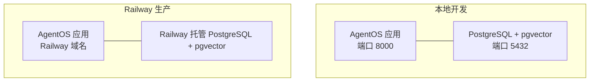
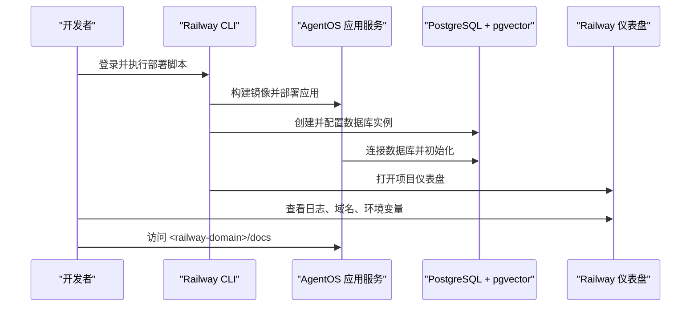
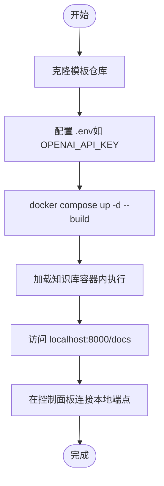
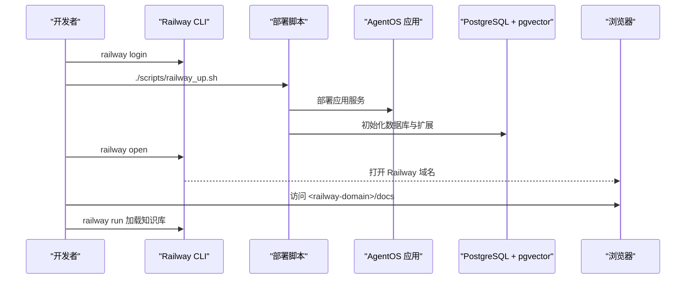
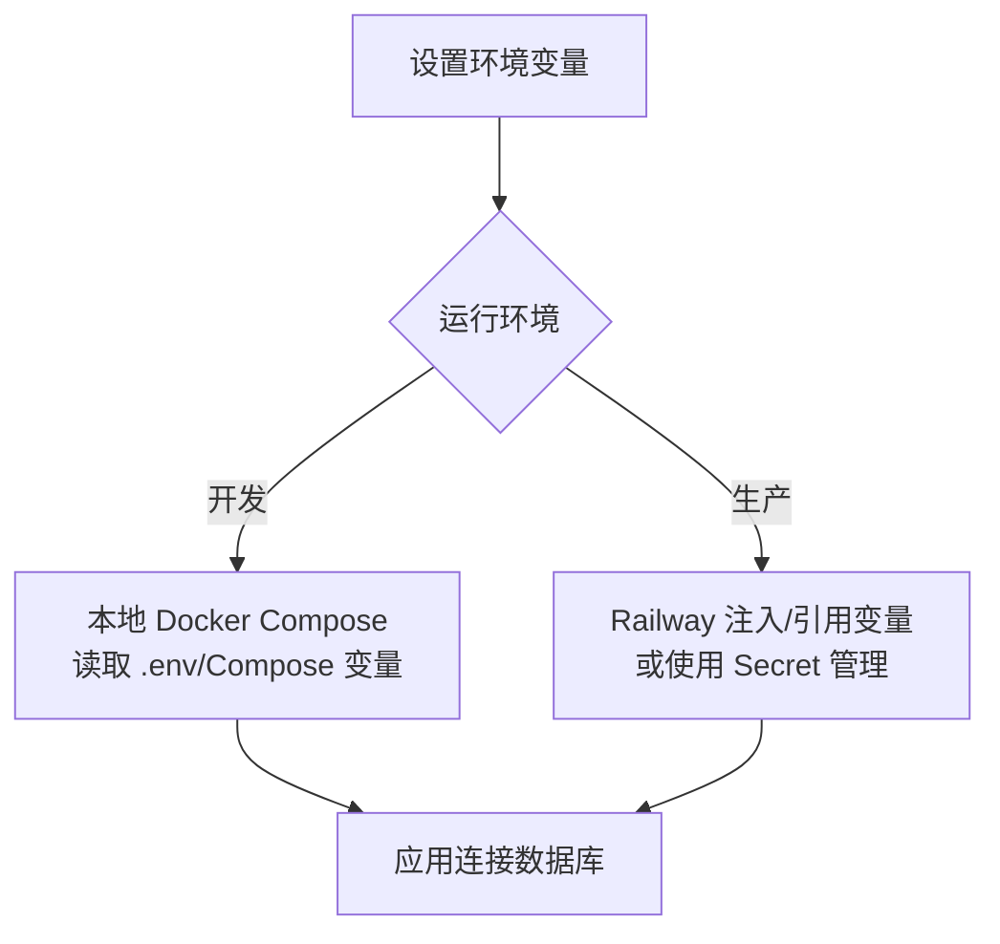
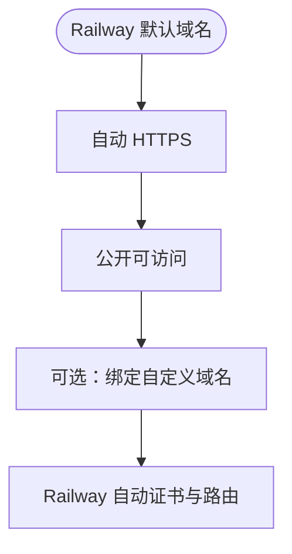
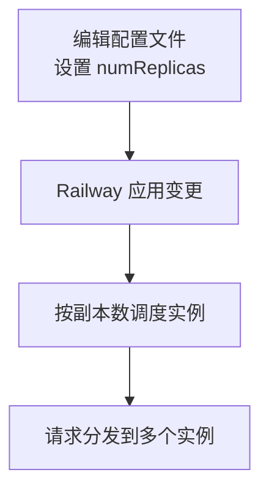
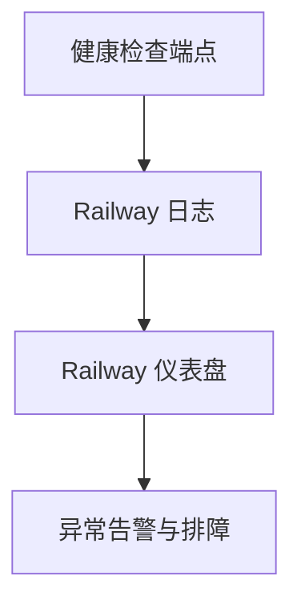
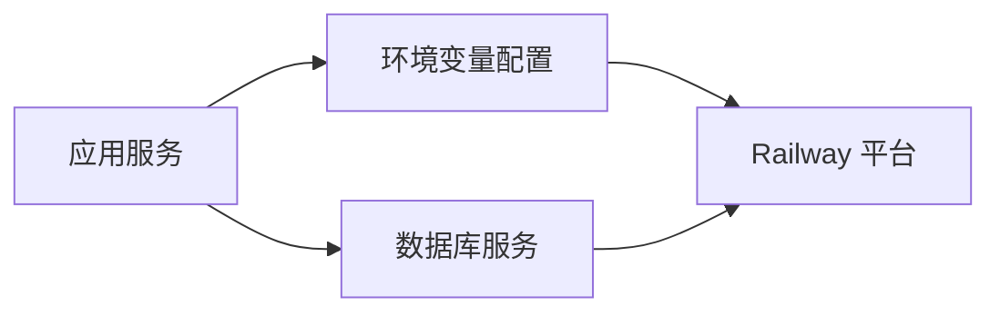

# Railway 模板

<cite>
**本文引用的文件**
- [deploy/templates/railway/deploy.mdx](file://deploy/templates/railway/deploy.mdx)
- [deploy/templates/railway/reference.mdx](file://deploy/templates/railway/reference.mdx)
- [production/templates/railway.mdx](file://production/templates/railway.mdx)
- [_snippets/create-agent-infra-railway-codebase.mdx](file://_snippets/create-agent-infra-railway-codebase.mdx)
- [_snippets/run-agent-infra-railway-local.mdx](file://_snippets/run-agent-infra-railway-local.mdx)
- [_snippets/run-agent-infra-railway-prd.mdx](file://_snippets/run-agent-infra-railway-prd.mdx)
- [TBD/pages/templates/agent-infra-railway/run-local.mdx](file://TBD/pages/templates/agent-infra-railway/run-local.mdx)
- [TBD/pages/templates/agent-infra-railway/run-prd.mdx](file://TBD/pages/templates/agent-infra-railway/run-prd.mdx)
- [TBD/pages/templates/infra-management/env-vars.mdx](file://TBD/pages/templates/infra-management/env-vars.mdx)
- [TBD/pages/templates/infra-management/domain-https.mdx](file://TBD/pages/templates/infra-management/domain-https.mdx)
</cite>

## 目录
1. [简介](#简介)
2. [项目结构](#项目结构)
3. [核心组件](#核心组件)
4. [架构总览](#架构总览)
5. [详细组件分析](#详细组件分析)
6. [依赖关系分析](#依赖关系分析)
7. [性能考虑](#性能考虑)
8. [故障排查指南](#故障排查指南)
9. [结论](#结论)
10. [附录](#附录)

## 简介
本指南面向使用 Railway 部署模板的用户，系统讲解如何基于模板完成从本地开发到生产部署的全流程，覆盖项目初始化、环境变量配置、数据库连接、自动化部署、扩缩容与健康检查、监控与日志、域名与 HTTPS、以及成本优化与性能调优等关键主题。Railway 模板以“开箱即用”为目标，提供 PostgreSQL + pgvector 的向量数据库支持、自动 HTTPS 与公开域名，并内置示例智能体，帮助用户快速完成 MVP 验证与生产上线。

## 项目结构
Railway 模板采用“应用 + 数据库”的双服务架构：应用服务负责运行 AgentOS API，数据库服务提供 PostgreSQL（含 pgvector 扩展）。模板同时提供本地开发与生产部署两条路径，便于在本地验证后一键上云。

图表来源
- [deploy/templates/railway/deploy.mdx:14-72](file://deploy/templates/railway/deploy.mdx#L14-L72)
- [production/templates/railway.mdx:24-97](file://production/templates/railway.mdx#L24-L97)

章节来源
- [deploy/templates/railway/deploy.mdx:14-72](file://deploy/templates/railway/deploy.mdx#L14-L72)
- [production/templates/railway.mdx:24-97](file://production/templates/railway.mdx#L24-L97)

## 核心组件
- 应用服务（AgentOS）
  - 提供 FastAPI 接口，内置示例智能体（知识检索、MCP 工具桥接等）。
  - 支持通过环境变量切换运行模式（开发/生产）、数据库连接参数、模型密钥等。
- 数据库服务（PostgreSQL + pgvector）
  - Railway 提供托管 PostgreSQL，并预置 pgvector 扩展，用于向量相似度检索。
  - 开发阶段可使用本地 Docker Compose 启动数据库；生产阶段由 Railway 自动提供。
- 部署与运维
  - 使用 Railway CLI 一键部署，支持查看日志、设置环境变量、停止服务、调整副本数等。
  - 支持通过命令行进行更新、停止应用与数据库服务。

章节来源
- [deploy/templates/railway/reference.mdx:136-148](file://deploy/templates/railway/reference.mdx#L136-L148)
- [production/templates/railway.mdx:150-160](file://production/templates/railway.mdx#L150-L160)

## 架构总览
下图展示了从本地到生产的典型数据流与控制流：本地开发验证后，通过 Railway CLI 将应用与数据库服务一并部署至 Railway，随后通过 Railway 提供的域名访问 API，并在控制面板中进行连接与管理。

图表来源
- [deploy/templates/railway/deploy.mdx:86-139](file://deploy/templates/railway/deploy.mdx#L86-L139)
- [production/templates/railway.mdx:78-118](file://production/templates/railway.mdx#L78-L118)

## 详细组件分析

### 本地开发流程
- 克隆模板、准备环境变量、启动容器、加载知识库、验证 API 文档、连接控制面板。
- 本地验证完成后，再进行生产部署。

图表来源
- [deploy/templates/railway/deploy.mdx:18-72](file://deploy/templates/railway/deploy.mdx#L18-L72)
- [_snippets/run-agent-infra-railway-local.mdx:1-34](file://_snippets/run-agent-infra-railway-local.mdx#L1-L34)

章节来源
- [deploy/templates/railway/deploy.mdx:18-72](file://deploy/templates/railway/deploy.mdx#L18-L72)
- [_snippets/run-agent-infra-railway-local.mdx:1-34](file://_snippets/run-agent-infra-railway-local.mdx#L1-L34)

### 生产部署流程
- 登录 Railway、执行部署脚本、加载知识库、打开域名、在控制面板连接 Live 端点。
- 支持后续通过 CLI 更新、查看日志、停止服务、设置环境变量、调整副本数等。

图表来源
- [deploy/templates/railway/deploy.mdx:86-139](file://deploy/templates/railway/deploy.mdx#L86-L139)
- [_snippets/run-agent-infra-railway-prd.mdx:1-87](file://_snippets/run-agent-infra-railway-prd.mdx#L1-L87)

章节来源
- [deploy/templates/railway/deploy.mdx:86-139](file://deploy/templates/railway/deploy.mdx#L86-L139)
- [_snippets/run-agent-infra-railway-prd.mdx:1-87](file://_snippets/run-agent-infra-railway-prd.mdx#L1-L87)

### 环境变量与数据库连接
- 关键环境变量包括模型 API 密钥、数据库主机/端口/用户/密码/库名、运行环境标识等。
- 开发与生产分别通过不同方式注入数据库凭据：本地使用 Docker 环境变量，生产通过 Railway 注入或引用。

图表来源
- [deploy/templates/railway/reference.mdx:136-148](file://deploy/templates/railway/reference.mdx#L136-L148)
- [TBD/pages/templates/infra-management/env-vars.mdx:1-51](file://TBD/pages/templates/infra-management/env-vars.mdx#L1-L51)

章节来源
- [deploy/templates/railway/reference.mdx:136-148](file://deploy/templates/railway/reference.mdx#L136-L148)
- [TBD/pages/templates/infra-management/env-vars.mdx:1-51](file://TBD/pages/templates/infra-management/env-vars.mdx#L1-L51)

### 域名与 HTTPS（Railway 特性）
- Railway 默认提供自动 HTTPS 与公开域名（例如 my-agentos.up.railway.app），无需额外配置即可启用。
- 若需自定义域名，可在 Railway 控制台绑定域名并启用 HTTPS（Railway 会自动处理证书与路由）。

图表来源
- [deploy/templates/railway/deploy.mdx:7-10](file://deploy/templates/railway/deploy.mdx#L7-L10)
- [production/templates/railway.mdx:9-10](file://production/templates/railway.mdx#L9-L10)

章节来源
- [deploy/templates/railway/deploy.mdx:7-10](file://deploy/templates/railway/deploy.mdx#L7-L10)
- [production/templates/railway.mdx:9-10](file://production/templates/railway.mdx#L9-L10)

### 自动扩缩容与副本数
- 可通过编辑项目配置文件中的副本数字段实现水平扩展，提升并发处理能力与可用性。
- Railway 会根据副本数调度多个实例，实现负载分摊与高可用。

图表来源
- [deploy/templates/railway/reference.mdx:17](file://deploy/templates/railway/reference.mdx#L17)
- [production/templates/railway.mdx:158](file://production/templates/railway.mdx#L158)

章节来源
- [deploy/templates/railway/reference.mdx:17](file://deploy/templates/railway/reference.mdx#L17)
- [production/templates/railway.mdx:158](file://production/templates/railway.mdx#L158)

### 健康检查与监控
- Railway 提供日志查看、服务状态管理与域名访问能力，便于快速定位问题。
- 建议在应用中增加健康检查端点，结合 Railway 日志与仪表盘进行监控。

图表来源
- [deploy/templates/railway/reference.mdx:11-16](file://deploy/templates/railway/reference.mdx#L11-L16)

章节来源
- [deploy/templates/railway/reference.mdx:11-16](file://deploy/templates/railway/reference.mdx#L11-L16)

## 依赖关系分析
- 组件耦合
  - 应用服务对数据库服务存在强依赖（启动顺序、连接参数、迁移策略）。
  - 环境变量在开发与生产之间存在差异，需通过不同注入方式管理。
- 外部依赖
  - Railway 提供托管数据库与网络基础设施，简化运维复杂度。
  - 模型 API 密钥等外部服务密钥通过环境变量注入，避免硬编码。

图表来源
- [deploy/templates/railway/reference.mdx:136-148](file://deploy/templates/railway/reference.mdx#L136-L148)
- [production/templates/railway.mdx:150-160](file://production/templates/railway.mdx#L150-L160)

章节来源
- [deploy/templates/railway/reference.mdx:136-148](file://deploy/templates/railway/reference.mdx#L136-L148)
- [production/templates/railway.mdx:150-160](file://production/templates/railway.mdx#L150-L160)

## 性能考虑
- 资源规划
  - 根据并发与响应时间目标选择合适的副本数与实例规格，结合 Railway 仪表盘观察资源占用。
- 数据库性能
  - 利用 pgvector 的向量索引与查询优化，合理设计检索策略与缓存命中率。
- 应用层优化
  - 在开发模式下开启自动重载以提升迭代效率；生产模式关闭自动重载，确保稳定性。
- 成本优化
  - 使用 Railway 免费层级起步，按需逐步扩容；避免不必要的长时运行服务与未使用的数据库实例。

## 故障排查指南
- 常见问题与处理
  - 命令未找到：安装 Railway CLI 后重试。
  - 部署失败：先执行初始化，再重新部署。
  - 数据库超时：等待数据库启动完成，查看数据库服务日志。
  - 502 错误：容器仍在启动中，稍后再试，查看应用服务日志。
- 快速定位
  - 使用 Railway CLI 查看日志与服务状态，确认域名与端口可达。
  - 对照环境变量清单，核对数据库连接参数与模型密钥是否正确。

章节来源
- [deploy/templates/railway/reference.mdx:151-164](file://deploy/templates/railway/reference.mdx#L151-L164)
- [production/templates/railway.mdx:165-182](file://production/templates/railway.mdx#L165-L182)

## 结论
Railway 模板以“低门槛、高可用、易运维”为核心设计理念，适合快速搭建 AgentOS 的生产级环境。通过模板提供的本地开发与一键生产部署能力，结合 Railway 的自动 HTTPS、公开域名、日志与监控工具，用户可以高效完成从 MVP 到生产的全过程。建议在生产环境中配合副本数扩展、健康检查与日志监控，持续优化性能与成本。

## 附录

### 快速开始（Railway）
- 安装 Railway CLI，登录后执行部署脚本，等待约 2 分钟完成应用与数据库初始化。
- 通过 Railway 打开域名访问 API 文档，随后在控制面板连接 Live 端点。

章节来源
- [production/templates/railway.mdx:78-118](file://production/templates/railway.mdx#L78-L118)

### 本地开发要点
- 使用 Docker Compose 启动应用与数据库，加载知识库后在本地验证 API。
- 如需更快迭代，可直接运行应用进程（跳过容器构建）。

章节来源
- [_snippets/run-agent-infra-railway-local.mdx:1-34](file://_snippets/run-agent-infra-railway-local.mdx#L1-L34)

### 环境变量清单
- 必填项：模型 API 密钥。
- 可选项：端口、数据库连接参数、运行环境标识等。

章节来源
- [deploy/templates/railway/reference.mdx:136-148](file://deploy/templates/railway/reference.mdx#L136-L148)

### 自定义域名与 HTTPS
- Railway 默认提供自动 HTTPS 与公开域名；若需自定义域名，可在平台控制台绑定并启用。

章节来源
- [deploy/templates/railway/deploy.mdx:7-10](file://deploy/templates/railway/deploy.mdx#L7-L10)
- [production/templates/railway.mdx:9-10](file://production/templates/railway.mdx#L9-L10)