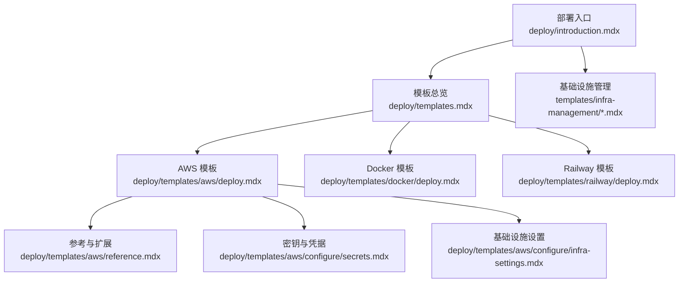
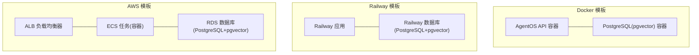
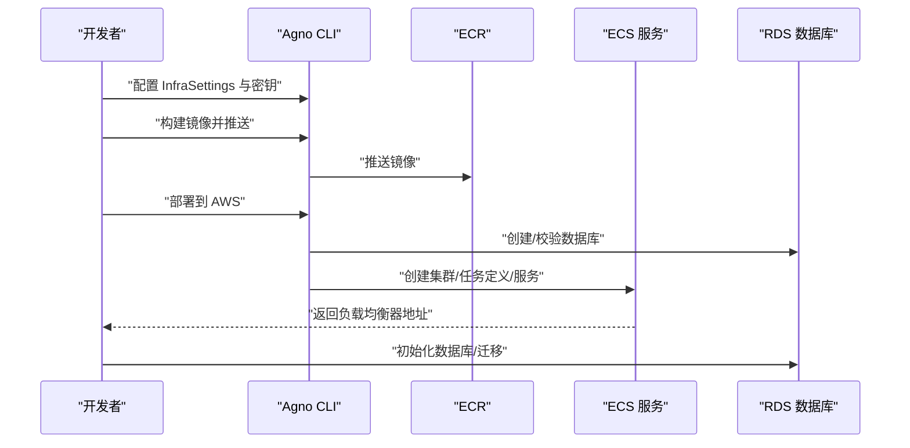
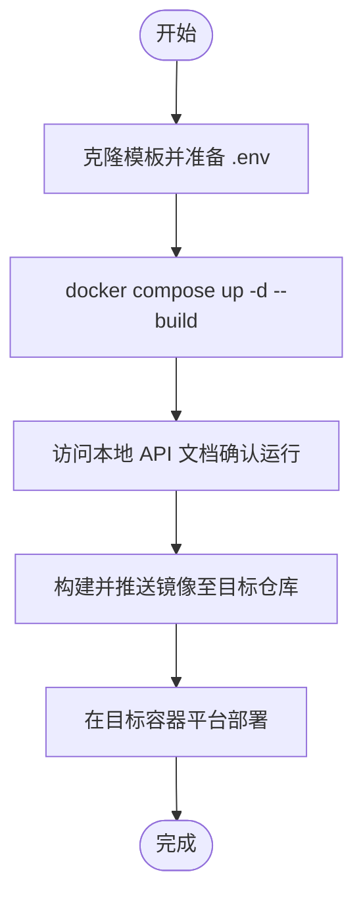
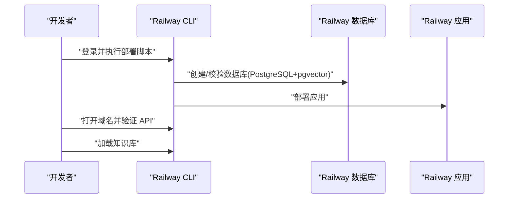
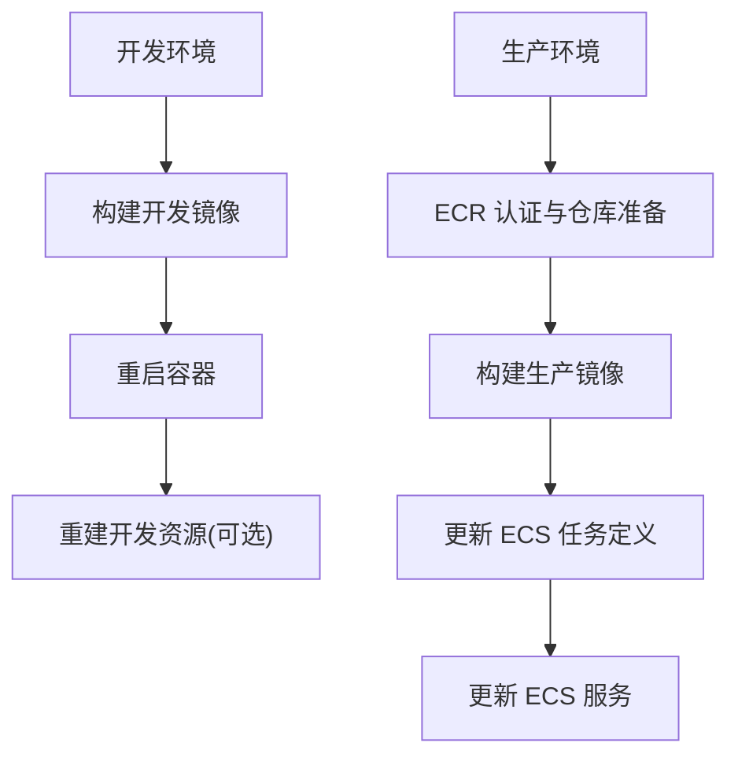
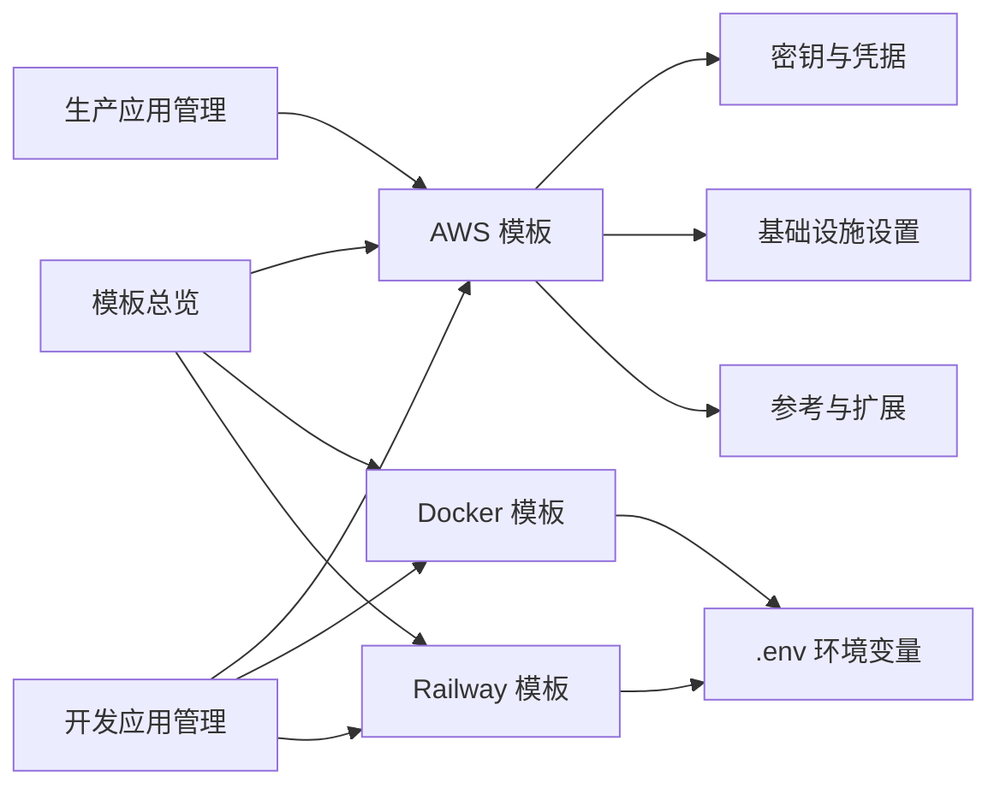

# 模板定制化

<cite>
**本文引用的文件**
- [deploy/templates.mdx](file://deploy/templates.mdx)
- [deploy/introduction.mdx](file://deploy/introduction.mdx)
- [deploy/templates/aws/deploy.mdx](file://deploy/templates/aws/deploy.mdx)
- [deploy/templates/aws/reference.mdx](file://deploy/templates/aws/reference.mdx)
- [deploy/templates/aws/configure/secrets.mdx](file://deploy/templates/aws/configure/secrets.mdx)
- [deploy/templates/aws/configure/infra-settings.mdx](file://deploy/templates/aws/configure/infra-settings.mdx)
- [deploy/templates/docker/deploy.mdx](file://deploy/templates/docker/deploy.mdx)
- [deploy/templates/railway/deploy.mdx](file://deploy/templates/railway/deploy.mdx)
- [templates/infra-management/development-app.mdx](file://templates/infra-management/development-app.mdx)
- [templates/infra-management/production-app.mdx](file://templates/infra-management/production-app.mdx)
</cite>

## 目录
1. [简介](#简介)
2. [项目结构](#项目结构)
3. [核心组件](#核心组件)
4. [架构总览](#架构总览)
5. [详细组件分析](#详细组件分析)
6. [依赖关系分析](#依赖关系分析)
7. [性能考量](#性能考量)
8. [故障排查指南](#故障排查指南)
9. [结论](#结论)
10. [附录](#附录)

## 简介
本指南面向需要在多平台上进行模板定制与运维的工程团队，系统讲解如何基于仓库中的模板（AWS、Docker、Railway）进行参数化配置、资源与网络设置调整、安全策略落地、版本与升级策略、扩展与插件开发以及测试与验证方法。目标是帮助读者在不改变模板骨架的前提下，实现对部署环境的深度定制与可持续演进。

## 项目结构
模板相关文档集中在 deploy/templates 下，按平台拆分；同时提供基础设施管理指南（开发与生产应用），以及 AWS 的参考与配置专题页。整体组织方式便于按“平台选择—快速开始—定制配置—运维管理—故障排查”的路径使用。

图表来源
- [deploy/introduction.mdx:1-102](file://deploy/introduction.mdx#L1-L102)
- [deploy/templates.mdx:1-48](file://deploy/templates.mdx#L1-L48)
- [deploy/templates/aws/deploy.mdx:1-370](file://deploy/templates/aws/deploy.mdx#L1-L370)
- [deploy/templates/aws/reference.mdx:1-183](file://deploy/templates/aws/reference.mdx#L1-L183)
- [deploy/templates/aws/configure/secrets.mdx:1-180](file://deploy/templates/aws/configure/secrets.mdx#L1-L180)
- [deploy/templates/aws/configure/infra-settings.mdx:1-80](file://deploy/templates/aws/configure/infra-settings.mdx#L1-L80)
- [deploy/templates/docker/deploy.mdx:1-112](file://deploy/templates/docker/deploy.mdx#L1-L112)
- [deploy/templates/railway/deploy.mdx:1-152](file://deploy/templates/railway/deploy.mdx#L1-L152)
- [templates/infra-management/development-app.mdx:1-107](file://templates/infra-management/development-app.mdx#L1-L107)
- [templates/infra-management/production-app.mdx:1-166](file://templates/infra-management/production-app.mdx#L1-L166)

章节来源
- [deploy/introduction.mdx:1-102](file://deploy/introduction.mdx#L1-L102)
- [deploy/templates.mdx:1-48](file://deploy/templates.mdx#L1-L48)

## 核心组件
- 平台模板
  - AWS：ECS Fargate + RDS PostgreSQL + ALB，适合企业级生产。
  - Docker：本地开发与自托管，可无缝迁移到任意容器平台。
  - Railway：一键部署，自动 HTTPS 与域名，适合快速上线与 MVP。
- 基础设施管理
  - 开发应用：本地 Docker 运行、镜像构建、容器重启、资源重建。
  - 生产应用：镜像构建与推送、ECS 任务定义与服务更新。
- 安全与密钥
  - 本地与生产密钥文件、AWS Secrets Manager 同步、数据库凭据隔离。
- 参考与扩展
  - 添加代理、工具、知识加载、模型切换、依赖管理与升级。

章节来源
- [deploy/templates/aws/deploy.mdx:1-370](file://deploy/templates/aws/deploy.mdx#L1-L370)
- [deploy/templates/docker/deploy.mdx:1-112](file://deploy/templates/docker/deploy.mdx#L1-L112)
- [deploy/templates/railway/deploy.mdx:1-152](file://deploy/templates/railway/deploy.mdx#L1-L152)
- [templates/infra-management/development-app.mdx:1-107](file://templates/infra-management/development-app.mdx#L1-L107)
- [templates/infra-management/production-app.mdx:1-166](file://templates/infra-management/production-app.mdx#L1-L166)
- [deploy/templates/aws/reference.mdx:1-183](file://deploy/templates/aws/reference.mdx#L1-L183)
- [deploy/templates/aws/configure/secrets.mdx:1-180](file://deploy/templates/aws/configure/secrets.mdx#L1-L180)
- [deploy/templates/aws/configure/infra-settings.mdx:1-80](file://deploy/templates/aws/configure/infra-settings.mdx#L1-L80)

## 架构总览
下图展示三类模板的典型运行架构与关键资源边界，帮助理解定制时的网络与安全边界设计。

图表来源
- [deploy/templates/docker/deploy.mdx:1-112](file://deploy/templates/docker/deploy.mdx#L1-L112)
- [deploy/templates/railway/deploy.mdx:1-152](file://deploy/templates/railway/deploy.mdx#L1-L152)
- [deploy/templates/aws/deploy.mdx:1-370](file://deploy/templates/aws/deploy.mdx#L1-L370)

## 详细组件分析

### AWS 模板定制化
- 部署流程与成本估算
  - 包含 ECS Fargate、RDS PostgreSQL、ALB、Secrets Manager、安全组等资源的部署步骤与月度成本估算。
- 基础设施设置
  - 通过 InfraSettings 统一配置项目名、区域、子网、镜像仓库、是否构建与推送镜像等。
- 密钥与凭据
  - 本地使用 YAML 文件，生产同步到 AWS Secrets Manager，并注入到 ECS 任务环境变量。
- 扩展与运维
  - 支持添加代理、工具、更换模型、增删依赖、加载知识库、停止与回滚等操作。
- 环境变量
  - 提供常用变量清单（如 API 密钥、数据库连接、端口、运行环境等）。

图表来源
- [deploy/templates/aws/deploy.mdx:194-258](file://deploy/templates/aws/deploy.mdx#L194-L258)
- [deploy/templates/aws/configure/infra-settings.mdx:1-80](file://deploy/templates/aws/configure/infra-settings.mdx#L1-L80)
- [deploy/templates/aws/configure/secrets.mdx:84-124](file://deploy/templates/aws/configure/secrets.mdx#L84-L124)

章节来源
- [deploy/templates/aws/deploy.mdx:1-370](file://deploy/templates/aws/deploy.mdx#L1-L370)
- [deploy/templates/aws/reference.mdx:1-183](file://deploy/templates/aws/reference.mdx#L1-L183)
- [deploy/templates/aws/configure/secrets.mdx:1-180](file://deploy/templates/aws/configure/secrets.mdx#L1-L180)
- [deploy/templates/aws/configure/infra-settings.mdx:1-80](file://deploy/templates/aws/configure/infra-settings.mdx#L1-L80)

### Docker 模板定制化
- 本地开发与热重载
  - 使用 docker compose 快速启动 API 与数据库，支持示例代理与知识加载。
- 云平台迁移
  - 将本地镜像推送到任一容器平台，保持环境变量一致，确保数据库启用 pgvector。
- 环境变量管理
  - 通过 .env 文件集中管理密钥与数据库连接参数，便于本地与云端统一。

图表来源
- [deploy/templates/docker/deploy.mdx:9-112](file://deploy/templates/docker/deploy.mdx#L9-L112)

章节来源
- [deploy/templates/docker/deploy.mdx:1-112](file://deploy/templates/docker/deploy.mdx#L1-L112)

### Railway 模板定制化
- 快速开发与一键上线
  - 本地开发、Railway 自动 HTTPS 与域名、一键部署脚本。
- 知识加载与控制面连接
  - 提供 Railway 运行命令加载知识库，并支持连接到控制平面。
- 环境变量与依赖
  - 通过 .env 设置密钥，使用 Railway 的环境变量与依赖管理能力。

图表来源
- [deploy/templates/railway/deploy.mdx:76-139](file://deploy/templates/railway/deploy.mdx#L76-L139)

章节来源
- [deploy/templates/railway/deploy.mdx:1-152](file://deploy/templates/railway/deploy.mdx#L1-L152)

### 基础设施管理（开发与生产）
- 开发应用
  - 本地 Docker 运行、镜像构建、容器重启、资源重建。
- 生产应用
  - 镜像构建与推送、ECS 任务定义与服务更新、ECR 认证与仓库准备。

图表来源
- [templates/infra-management/development-app.mdx:1-107](file://templates/infra-management/development-app.mdx#L1-L107)
- [templates/infra-management/production-app.mdx:1-166](file://templates/infra-management/production-app.mdx#L1-L166)

章节来源
- [templates/infra-management/development-app.mdx:1-107](file://templates/infra-management/development-app.mdx#L1-L107)
- [templates/infra-management/production-app.mdx:1-166](file://templates/infra-management/production-app.mdx#L1-L166)

## 依赖关系分析
- 模板与平台
  - 模板总览与平台入口文档串联起各平台模板，形成“先选择模板，再添加应用，最后暴露接口”的部署路径。
- 模板内部依赖
  - AWS 模板依赖 InfraSettings、密钥文件与 AWS Secrets Manager；Railway/Docker 模板依赖 .env 与数据库初始化。
- 命令与资源
  - CLI 命令驱动镜像构建、资源创建与更新，贯穿开发到生产的闭环。

图表来源
- [deploy/templates.mdx:1-48](file://deploy/templates.mdx#L1-L48)
- [deploy/introduction.mdx:1-102](file://deploy/introduction.mdx#L1-L102)
- [deploy/templates/aws/configure/secrets.mdx:1-180](file://deploy/templates/aws/configure/secrets.mdx#L1-L180)
- [deploy/templates/aws/configure/infra-settings.mdx:1-80](file://deploy/templates/aws/configure/infra-settings.mdx#L1-L80)
- [deploy/templates/aws/reference.mdx:1-183](file://deploy/templates/aws/reference.mdx#L1-L183)
- [deploy/templates/docker/deploy.mdx:1-112](file://deploy/templates/docker/deploy.mdx#L1-L112)
- [deploy/templates/railway/deploy.mdx:1-152](file://deploy/templates/railway/deploy.mdx#L1-L152)
- [templates/infra-management/development-app.mdx:1-107](file://templates/infra-management/development-app.mdx#L1-L107)
- [templates/infra-management/production-app.mdx:1-166](file://templates/infra-management/production-app.mdx#L1-L166)

章节来源
- [deploy/templates.mdx:1-48](file://deploy/templates.mdx#L1-L48)
- [deploy/introduction.mdx:1-102](file://deploy/introduction.mdx#L1-L102)

## 性能考量
- 容器与数据库
  - 优先使用官方数据库镜像并启用 pgvector，确保查询与索引性能稳定。
- 部署规模
  - AWS Fargate 实例规格与 RDS 类型应结合业务峰值 QPS 与并发会话数评估；Railway/Docker 在资源受限场景下建议限制并发或采用水平扩展。
- 网络与缓存
  - 对于高频查询与推理结果，可在应用层引入缓存（如 Redis）以降低数据库压力；注意缓存与数据库一致性策略。
- 镜像与构建
  - 控制镜像体积与层数，减少拉取时间；在 CI 中复用缓存层，缩短构建时间。

## 故障排查指南
- AWS
  - ECR 凭据过期：重新认证后重试。
  - RDS 初始化耗时：等待数据库变为可用状态。
  - 公共子网缺失：检查路由表与 IGW 关联。
  - 502/503：等待健康检查通过或查看 ECS 任务日志。
  - 任务反复重启：检查密钥、API Key、数据库连接。
- Docker
  - 本地无法访问 API：确认端口映射与防火墙。
  - 数据库未启用 pgvector：确保镜像版本与扩展已初始化。
- Railway
  - 域名不可用：确认项目已部署成功并获取公开域名。
  - 知识加载失败：检查数据库连接与迁移状态。

章节来源
- [deploy/templates/aws/deploy.mdx:326-370](file://deploy/templates/aws/deploy.mdx#L326-L370)
- [deploy/templates/docker/deploy.mdx:1-112](file://deploy/templates/docker/deploy.mdx#L1-L112)
- [deploy/templates/railway/deploy.mdx:1-152](file://deploy/templates/railway/deploy.mdx#L1-L152)

## 结论
通过统一的模板体系与基础设施管理指南，可以在 AWS、Docker 与 Railway 上实现一致的定制化体验。建议以 InfraSettings 与密钥管理为核心，配合 CLI 命令完成从开发到生产的闭环；在安全方面坚持凭据分离与最小权限原则，在性能方面关注数据库与缓存策略；在扩展方面遵循“新增代理/工具/依赖”的模块化思路，确保可持续演进。

## 附录
- 最佳实践清单
  - 参数化：统一通过 InfraSettings 与 .env 管理所有可变参数。
  - 安全：API 密钥与数据库凭据分离存储，生产环境使用 Secrets Manager 或平台等价能力。
  - 网络：明确内外网访问策略，限制入站规则，必要时启用 WAF/ALB 安全组。
  - 升级：建立镜像版本号与依赖清单，使用脚本生成与升级，避免手工散落变更。
  - 测试：在本地与预生产环境验证 API 健康检查、数据库连通性与关键工作流。
  - 回滚：保留上一个镜像版本与 ECS 任务定义快照，出现问题快速回滚。