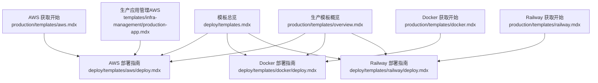
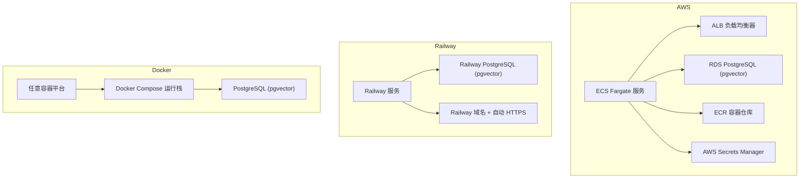
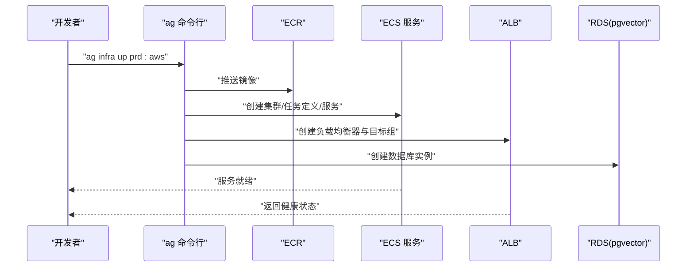
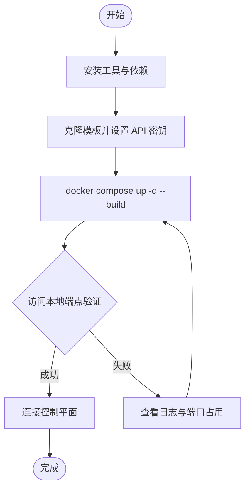
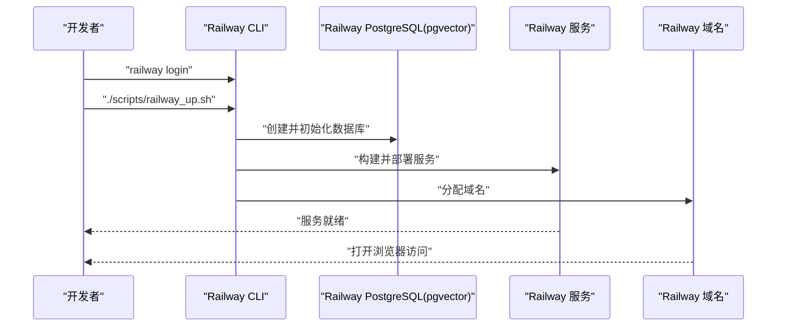
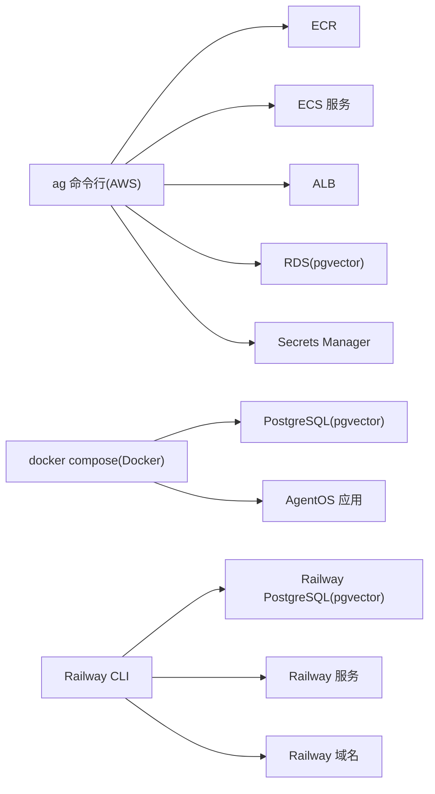

# 生产模板

<cite>
**本文引用的文件**
- [deploy/templates.mdx](file://deploy/templates.mdx)
- [production/templates/overview.mdx](file://production/templates/overview.mdx)
- [deploy/templates/aws/deploy.mdx](file://deploy/templates/aws/deploy.mdx)
- [deploy/templates/docker/deploy.mdx](file://deploy/templates/docker/deploy.mdx)
- [deploy/templates/railway/deploy.mdx](file://deploy/templates/railway/deploy.mdx)
- [production/templates/aws.mdx](file://production/templates/aws.mdx)
- [production/templates/docker.mdx](file://production/templates/docker.mdx)
- [production/templates/railway.mdx](file://production/templates/railway.mdx)
- [templates/infra-management/production-app.mdx](file://templates/infra-management/production-app.mdx)
</cite>

## 目录
1. [简介](#简介)
2. [项目结构](#项目结构)
3. [核心组件](#核心组件)
4. [架构总览](#架构总览)
5. [详细组件分析](#详细组件分析)
6. [依赖关系分析](#依赖关系分析)
7. [性能考虑](#性能考虑)
8. [故障排查指南](#故障排查指南)
9. [结论](#结论)
10. [附录](#附录)

## 简介
本指南面向在生产环境中部署 AgentOS 的工程团队，系统讲解三种生产模板的设计原理与适用场景：AWS（ECS+Fargate+RDS）、Docker（本地开发与任意容器平台）、Railway（零运维快速上线）。文档覆盖从初始化、配置、部署到生产上线的完整流程，并提供可扩展性、版本管理与更新策略、安全与性能优化建议，帮助团队按需选择并落地适合自身规模与复杂度的部署方案。

## 项目结构
- 模板入口与对比概览位于 deploy/templates.mdx 与 production/templates/overview.mdx，分别给出三类模板的定位、最佳使用场景与时间成本对比。
- 各模板的“部署”章节提供了完整的步骤、前置条件、常见问题与后续操作指引：
  - AWS 部署指南：deploy/templates/aws/deploy.mdx
  - Docker 部署指南：deploy/templates/docker/deploy.mdx
  - Railway 部署指南：deploy/templates/railway/deploy.mdx
- 生产模板的“获取开始”与“管理”章节：
  - AWS 获取开始：production/templates/aws.mdx
  - Docker 获取开始：production/templates/docker.mdx
  - Railway 获取开始：production/templates/railway.mdx
- 生产应用在 AWS 上的镜像构建、任务定义与服务更新流程：templates/infra-management/production-app.mdx

图表来源
- [deploy/templates.mdx:1-48](file://deploy/templates.mdx#L1-L48)
- [production/templates/overview.mdx:1-29](file://production/templates/overview.mdx#L1-L29)
- [deploy/templates/aws/deploy.mdx:1-370](file://deploy/templates/aws/deploy.mdx#L1-L370)
- [deploy/templates/docker/deploy.mdx:1-112](file://deploy/templates/docker/deploy.mdx#L1-L112)
- [deploy/templates/railway/deploy.mdx:1-152](file://deploy/templates/railway/deploy.mdx#L1-L152)
- [production/templates/aws.mdx:1-210](file://production/templates/aws.mdx#L1-L210)
- [production/templates/docker.mdx:1-164](file://production/templates/docker.mdx#L1-L164)
- [production/templates/railway.mdx:1-182](file://production/templates/railway.mdx#L1-L182)
- [templates/infra-management/production-app.mdx:1-166](file://templates/infra-management/production-app.mdx#L1-L166)

章节来源
- [deploy/templates.mdx:1-48](file://deploy/templates.mdx#L1-L48)
- [production/templates/overview.mdx:1-29](file://production/templates/overview.mdx#L1-L29)

## 核心组件
- 模板类型与定位
  - AWS：面向规模化与企业级可靠性，提供 ECS Fargate、RDS（含 pgvector）、ALB、密钥管理与安全组等生产级能力。
  - Docker：面向本地开发与自托管，可在任意支持 Docker 的平台部署；提供热重载与示例代理。
  - Railway：面向快速上线与零运维，自动提供 PostgreSQL（含 pgvector）、自动 HTTPS 与公共域名。
- 共同要素
  - 每个模板均包含 AgentOS、PostgreSQL（含 pgvector 扩展）与针对目标平台的部署脚本或命令。
  - 提供环境变量、密钥、数据库表结构、CI/CD、格式校验、SSH 访问等配置与管理文档。

章节来源
- [deploy/templates.mdx:6-48](file://deploy/templates.mdx#L6-L48)
- [production/templates/overview.mdx:6-29](file://production/templates/overview.mdx#L6-L29)

## 架构总览
下图展示三种模板在生产中的典型运行时拓扑与依赖关系：

图表来源
- [deploy/templates/aws/deploy.mdx:18-44](file://deploy/templates/aws/deploy.mdx#L18-L44)
- [production/templates/aws.mdx:170-180](file://production/templates/aws.mdx#L170-L180)
- [production/templates/railway.mdx:9-11](file://production/templates/railway.mdx#L9-L11)
- [production/templates/docker.mdx:7-8](file://production/templates/docker.mdx#L7-L8)

## 详细组件分析

### AWS 模板
- 设计原理与优势
  - 使用 ECS Fargate 实现无服务器容器托管，弹性伸缩与高可用。
  - RDS 提供托管数据库与 pgvector 扩展，简化向量检索与知识库能力。
  - ALB 提供统一入口与健康检查，配合安全组实现网络隔离。
  - AWS Secrets Manager 存储敏感配置，降低泄露风险。
- 适用场景
  - 大中型企业、需要合规与可观测性的生产环境。
  - 对网络隔离、区域冗余、审计日志有强需求。
- 关键流程
  - 初始化与工具安装、创建虚拟环境、安装依赖、克隆模板、设置 API 密钥。
  - AWS 资源准备：创建 ECR 仓库、认证、获取子网 ID。
  - 配置 infra/settings.py（区域、子网、镜像仓库、推送策略等）。
  - 可选本地验证后，执行 ag infra up prd:aws 创建资源。
  - 获取负载均衡器 DNS 并进行健康检查。
- 生产更新与镜像管理
  - 通过 ag infra up --env prd --infra docker --type image 构建镜像。
  - 如仅更新镜像，可通过 ag infra patch -e prd -i aws -n service 快速滚动更新服务。
  - 若涉及 CPU/内存/环境变量变更，先执行 ag infra patch -e prd -i aws -n td 更新任务定义，再更新服务。

图表来源
- [deploy/templates/aws/deploy.mdx:238-258](file://deploy/templates/aws/deploy.mdx#L238-L258)
- [templates/infra-management/production-app.mdx:127-157](file://templates/infra-management/production-app.mdx#L127-L157)

章节来源
- [deploy/templates/aws/deploy.mdx:18-370](file://deploy/templates/aws/deploy.mdx#L18-L370)
- [production/templates/aws.mdx:130-210](file://production/templates/aws.mdx#L130-L210)
- [templates/infra-management/production-app.mdx:15-166](file://templates/infra-management/production-app.mdx#L15-L166)

### Docker 模板
- 设计原理与优势
  - 使用 Docker Compose 在本地快速拉起 AgentOS 与 PostgreSQL（含 pgvector），便于开发与测试。
  - 支持热重载，修改 agents/teams/workflows 后可即时生效。
  - 可无缝迁移到任意支持 Docker 的云平台或自托管环境。
- 适用场景
  - 小型团队、原型验证、本地开发与测试、边缘或受限网络环境。
- 关键流程
  - 安装 Docker Desktop、uv，创建虚拟环境，安装依赖，克隆模板，设置 API 密钥。
  - docker compose up -d --build 启动服务，访问 http://localhost:8000/docs 验证。
  - 可连接 os.agno.com 进行控制面管理。
  - 生产部署时，构建并推送镜像至目标平台仓库，设置环境变量与启用 pgvector。

图表来源
- [deploy/templates/docker/deploy.mdx:14-87](file://deploy/templates/docker/deploy.mdx#L14-L87)
- [production/templates/docker.mdx:14-102](file://production/templates/docker.mdx#L14-L102)

章节来源
- [deploy/templates/docker/deploy.mdx:1-112](file://deploy/templates/docker/deploy.mdx#L1-L112)
- [production/templates/docker.mdx:1-164](file://production/templates/docker.mdx#L1-L164)

### Railway 模板
- 设计原理与优势
  - 一键部署 AgentOS 与 PostgreSQL（含 pgvector），自动分配域名并启用 HTTPS。
  - 适合 MVP、快速验证与小规模生产，无需管理底层基础设施。
- 适用场景
  - 初创团队、快速迭代、最小可行产品上线。
- 关键流程
  - 安装 Railway CLI，登录账户，克隆模板，设置 API 密钥。
  - ./scripts/railway_up.sh 执行部署，等待 PostgreSQL 与服务启动。
  - 使用 railway open 获取域名，访问 <your-domain>/docs 验证。
  - 连接 os.agno.com 进行控制面管理。

图表来源
- [deploy/templates/railway/deploy.mdx:86-139](file://deploy/templates/railway/deploy.mdx#L86-L139)
- [production/templates/railway.mdx:78-121](file://production/templates/railway.mdx#L78-L121)

章节来源
- [deploy/templates/railway/deploy.mdx:1-152](file://deploy/templates/railway/deploy.mdx#L1-L152)
- [production/templates/railway.mdx:1-182](file://production/templates/railway.mdx#L1-L182)

## 依赖关系分析
- 工具链与命令
  - AWS：ag infra up / ag infra patch / ag infra down；ECR 认证；AWS CLI。
  - Docker：docker compose up/down/restart/logs；端口映射与卷挂载。
  - Railway：railway login/up/open/logs；railway.json 中可配置副本数等参数。
- 组件耦合
  - 应用服务依赖数据库（PostgreSQL + pgvector）与外部模型提供商密钥。
  - AWS 模板中服务与负载均衡器、安全组、密钥管理存在直接依赖。
  - Docker/Railway 模板中服务与数据库在同一网络内通信。

图表来源
- [deploy/templates/aws/deploy.mdx:238-258](file://deploy/templates/aws/deploy.mdx#L238-L258)
- [production/templates/docker.mdx:68-102](file://production/templates/docker.mdx#L68-L102)
- [production/templates/railway.mdx:78-121](file://production/templates/railway.mdx#L78-L121)

章节来源
- [deploy/templates/aws/deploy.mdx:238-370](file://deploy/templates/aws/deploy.mdx#L238-L370)
- [production/templates/docker.mdx:125-151](file://production/templates/docker.mdx#L125-L151)
- [production/templates/railway.mdx:150-161](file://production/templates/railway.mdx#L150-L161)

## 性能考虑
- 容器与编排
  - AWS：合理设置 ECS Fargate 的 CPU/内存配额，结合 ALB 健康检查与自动扩缩容策略，避免冷启动抖动。
  - Docker：在本地开发阶段启用热重载减少重启频率；生产迁移时使用稳定镜像与只读根文件系统。
  - Railway：通过 railway.json 调整副本数以提升并发处理能力；关注数据库初始化耗时。
- 数据库与向量检索
  - 确保 pgvector 扩展已启用并正确初始化；对高频查询建立索引；限制单次检索条目数量。
- 网络与安全
  - AWS：仅开放必要端口与 CIDR；使用安全组与 NACL 控制入站流量；启用 WAF/ALB 访问日志。
  - Railway：利用其内置 HTTPS 与域名；避免在公开环境暴露调试接口。
  - Docker：在生产网络中隔离数据库与应用容器，避免主机网络模式。

## 故障排查指南
- AWS
  - ECR 认证过期：重新执行 aws ecr get-login-password 并 docker login。
  - RDS 初始化耗时：等待约 5-10 分钟，确认数据库状态变为 Available。
  - 502 错误：等待容器启动；查看 ECS 任务日志定位崩溃原因。
  - 任务反复重启：检查环境变量、API 密钥与数据库连接字符串。
- Docker
  - 端口冲突：修改 compose.yml 中的 hostPort 映射。
  - 数据库未就绪：等待 PostgreSQL 初始化完成后重试。
- Railway
  - 命令不可用：安装 Railway CLI 或使用 railway init 后重试。
  - 数据库超时：等待约 30 秒；查看 pgvector 服务日志。
  - 502 错误：等待容器启动；查看 agent_os 服务日志。

章节来源
- [deploy/templates/aws/deploy.mdx:326-370](file://deploy/templates/aws/deploy.mdx#L326-L370)
- [production/templates/docker.mdx:153-164](file://production/templates/docker.mdx#L153-L164)
- [production/templates/railway.mdx:163-182](file://production/templates/railway.mdx#L163-L182)

## 结论
- AWS 模板适合对可靠性、合规与企业控制有强需求的生产环境，具备完善的网络与密钥管理能力。
- Docker 模板适合本地开发与自托管场景，易于迁移至任意容器平台。
- Railway 模板适合快速上线与 MVP，零运维体验显著。
- 建议根据团队规模、预算与合规要求选择模板，并结合本文的配置、更新与安全建议，确保生产环境的稳定性与可演进性。

## 附录
- 版本管理与更新策略
  - 固定基础镜像版本，使用语义化版本标签；在 CI 中对镜像进行扫描与签名。
  - 采用蓝绿/滚动发布策略，结合 ALB 健康检查与 ECS 任务定义更新，降低停机风险。
  - 对数据库变更采用迁移脚本与只增不改原则，保留回滚路径。
- 安全配置建议
  - 使用 AWS Secrets Manager 或平台内置密钥管理，避免硬编码。
  - 严格限制安全组与网络 ACL；启用加密传输与访问审计。
  - 定期轮换 API 密钥与数据库凭证；最小权限原则授予容器角色。
- 可扩展性设计
  - 通过 ECS 任务定义与 Railway 配置文件实现水平扩展与资源配额调整。
  - 将日志与指标集中采集，结合告警策略保障 SLA。
  - 将知识库与向量存储与应用解耦，支持多实例共享与缓存层优化。