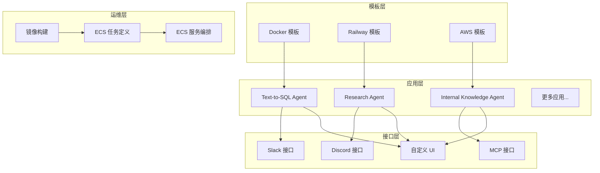
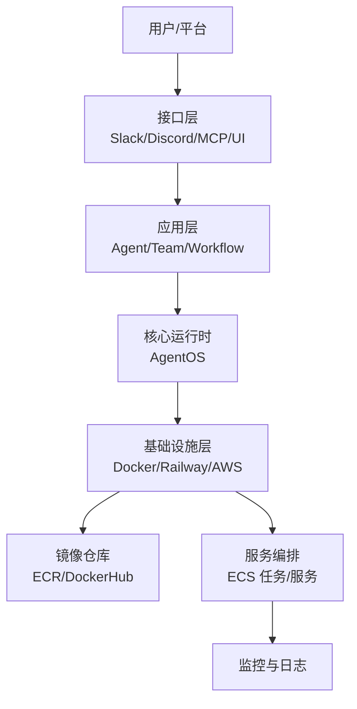
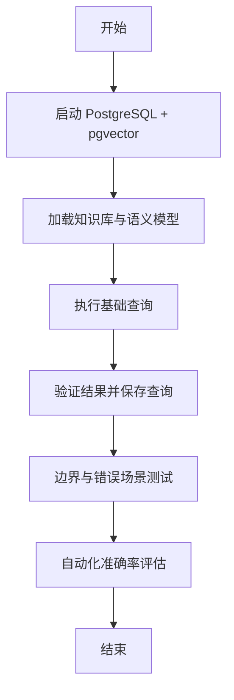
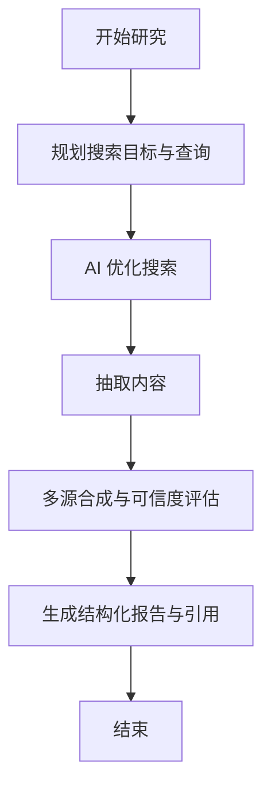
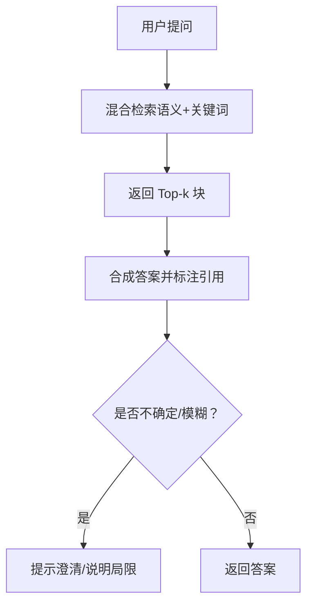
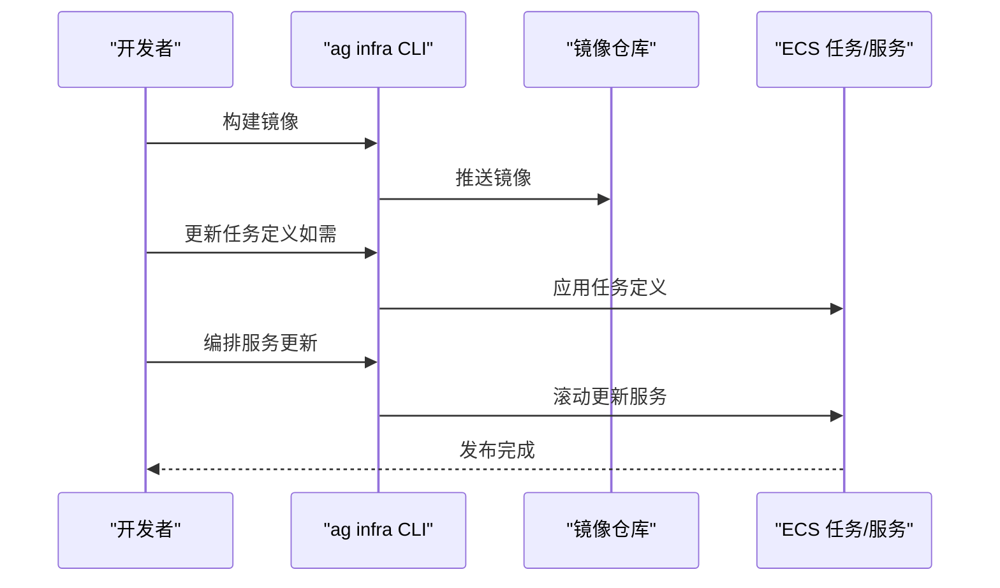
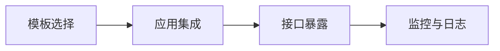
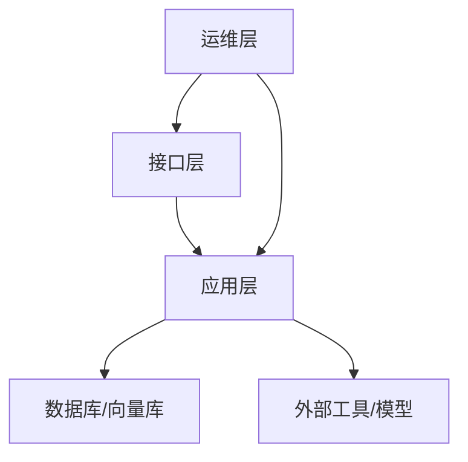

# 生产环境

<cite>
**本文引用的文件**
- [production/overview.mdx](file://production/overview.mdx)
- [templates/infra-management/production-app.mdx](file://templates/infra-management/production-app.mdx)
- [production/templates/overview.mdx](file://production/templates/overview.mdx)
- [production/applications/overview.mdx](file://production/applications/overview.mdx)
- [production/applications/text-to-sql.mdx](file://production/applications/text-to-sql.mdx)
- [production/applications/research-agent.mdx](file://production/applications/research-agent.mdx)
- [production/applications/knowledge-agent.mdx](file://production/applications/knowledge-agent.mdx)
- [deploy/introduction.mdx](file://deploy/introduction.mdx)
- [deploy/apps.mdx](file://deploy/apps.mdx)
</cite>

## 目录
1. [简介](#简介)
2. [项目结构](#项目结构)
3. [核心组件](#核心组件)
4. [架构总览](#架构总览)
5. [详细组件分析](#详细组件分析)
6. [依赖关系分析](#依赖关系分析)
7. [性能考量](#性能考量)
8. [故障排查指南](#故障排查指南)
9. [结论](#结论)
10. [附录](#附录)

## 简介
本文件面向生产环境的工程与运维团队，系统化阐述如何基于仓库中的模板与示例应用完成从零到一的生产部署，覆盖高可用、可扩展与安全的设计原则；详述应用在生产环境的部署流程（含代码审查、性能测试与监控）、接口配置（流量控制、错误处理与性能优化）、生产模板（AWS、Docker、Railway）的使用与定制，以及运维层面的日志监控、性能调优与故障处理。同时给出可复用的生产案例与最佳实践，帮助在不同规模与复杂度的项目中稳定落地。

## 项目结构
仓库围绕“模板—应用—接口—运维”四层组织生产相关内容：
- 模板层：提供可在 Docker、Railway、AWS 上一键部署的生产就绪代码基座
- 应用层：内置多种 Agent/Team/Workflow 的生产级实现，可直接复制、定制并接入
- 接口层：支持 Slack、Discord、MCP 等平台对接，或自定义 UI
- 运维层：提供镜像构建、任务定义更新、服务编排与发布流程说明

图表来源
- [production/templates/overview.mdx:1-29](file://production/templates/overview.mdx#L1-L29)
- [production/applications/overview.mdx:1-169](file://production/applications/overview.mdx#L1-L169)
- [production/overview.mdx:6-73](file://production/overview.mdx#L6-L73)
- [templates/infra-management/production-app.mdx:15-166](file://templates/infra-management/production-app.mdx#L15-L166)

章节来源
- [production/overview.mdx:6-73](file://production/overview.mdx#L6-L73)
- [production/templates/overview.mdx:6-29](file://production/templates/overview.mdx#L6-L29)
- [production/applications/overview.mdx:6-169](file://production/applications/overview.mdx#L6-L169)
- [deploy/introduction.mdx:7-102](file://deploy/introduction.mdx#L7-L102)

## 核心组件
- 部署模板与选择标准
  - Docker：本地开发/自托管，快速迭代
  - Railway：快速上线 MVP，无需基础设施管理
  - AWS：规模化与企业级可靠性
- 应用清单
  - Agent：Text-to-SQL、Research、Internal Knowledge、Invoice、Contract Review 等
  - Team：内容生产、软件开发、RFP 响应等
  - Workflow：会议转任务、线索增强、销售通话分析、竞品追踪等
- 接口暴露
  - Slack、Discord、MCP、自定义 UI
- 运维流程
  - 镜像构建、任务定义更新、服务编排与发布

章节来源
- [production/templates/overview.mdx:24-29](file://production/templates/overview.mdx#L24-L29)
- [production/applications/overview.mdx:10-169](file://production/applications/overview.mdx#L10-L169)
- [production/overview.mdx:8-72](file://production/overview.mdx#L8-L72)
- [deploy/introduction.mdx:11-102](file://deploy/introduction.mdx#L11-L102)

## 架构总览
下图展示了从模板到应用再到接口与运维的整体生产架构，强调可插拔的应用与多云部署能力：

图表来源
- [production/overview.mdx:6-73](file://production/overview.mdx#L6-L73)
- [production/applications/overview.mdx:6-169](file://production/applications/overview.mdx#L6-L169)
- [templates/infra-management/production-app.mdx:15-166](file://templates/infra-management/production-app.mdx#L15-L166)

## 详细组件分析

### 组件一：生产应用（以 Text-to-SQL 为例）
- 关键特性
  - 基于知识库的查询生成与自我学习循环
  - 数据质量处理与向量检索增强
  - 可扩展的工具链（SQL 执行、推理、记忆）
- 典型流程
  - 初始化数据库与知识库
  - 加载示例数据与模式
  - 执行基础查询、学习循环与边界场景验证
- 性能与稳定性建议
  - 使用向量索引与分页检索
  - 对历史会话与工具调用进行上下文裁剪
  - 将验证通过的查询持久化，减少重复计算

图表来源
- [production/applications/text-to-sql.mdx:33-96](file://production/applications/text-to-sql.mdx#L33-L96)
- [production/applications/text-to-sql.mdx:179-227](file://production/applications/text-to-sql.mdx#L179-L227)

章节来源
- [production/applications/text-to-sql.mdx:7-261](file://production/applications/text-to-sql.mdx#L7-L261)

### 组件二：生产应用（Research Agent）
- 关键特性
  - 基于 Parallel API 的 AI 优化搜索与内容抽取
  - 多源合成与可信度评估
  - 结构化报告输出与引用追踪
- 典型流程
  - 快速研究（3-5 条源）
  - 深度研究（10-15 条源）
  - 对比研究（多主题对比）
- 性能与稳定性建议
  - 控制最大结果数与迭代深度
  - 对矛盾信息标注置信度与来源
  - 合理缓存搜索结果与抽取内容

图表来源
- [production/applications/research-agent.mdx:65-101](file://production/applications/research-agent.mdx#L65-L101)
- [production/applications/research-agent.mdx:134-156](file://production/applications/research-agent.mdx#L134-L156)

章节来源
- [production/applications/research-agent.mdx:7-187](file://production/applications/research-agent.mdx#L7-L187)

### 组件三：生产应用（Internal Knowledge Agent）
- 关键特性
  - RAG + 混合检索（语义 + 关键词）
  - 不确定性处理与引用溯源
  - 多轮对话与上下文记忆
- 典型流程
  - 基础查询与引用溯源
  - 多轮对话与上下文增强
  - 边界与模糊场景处理
- 性能与稳定性建议
  - 合理设置 top-k 与混合检索权重
  - 对知识库内容进行清洗与结构化
  - 记忆与历史长度的动态裁剪

图表来源
- [production/applications/knowledge-agent.mdx:78-105](file://production/applications/knowledge-agent.mdx#L78-L105)
- [production/applications/knowledge-agent.mdx:144-189](file://production/applications/knowledge-agent.mdx#L144-L189)

章节来源
- [production/applications/knowledge-agent.mdx:7-226](file://production/applications/knowledge-agent.mdx#L7-L226)

### 组件四：生产模板与发布流程（AWS/ECS）
- 流程概览
  - 构建生产镜像（可选本地构建或使用现有镜像）
  - 更新 ECS 任务定义（CPU/内存/环境变量变更时）
  - 编排 ECS 服务以滚动更新
- 关键要点
  - 镜像仓库与认证（ECR/DockerHub）
  - 仅更新镜像时可跳过任务定义更新，直接编排服务
  - 强制重建镜像时使用相应标志

图表来源
- [templates/infra-management/production-app.mdx:15-166](file://templates/infra-management/production-app.mdx#L15-L166)

章节来源
- [templates/infra-management/production-app.mdx:5-166](file://templates/infra-management/production-app.mdx#L5-L166)

### 组件五：部署模板与应用集成
- 模板选择
  - Docker：本地开发/自托管
  - Railway：快速上线
  - AWS：规模化与企业级
- 应用集成
  - 在模板基础上添加所需 Agent/Team/Workflow
  - 通过接口层暴露至 Slack、Discord、MCP 或自定义 UI

图表来源
- [production/templates/overview.mdx:8-29](file://production/templates/overview.mdx#L8-L29)
- [deploy/introduction.mdx:11-102](file://deploy/introduction.mdx#L11-L102)
- [deploy/apps.mdx:9-138](file://deploy/apps.mdx#L9-L138)

章节来源
- [production/templates/overview.mdx:6-29](file://production/templates/overview.mdx#L6-L29)
- [deploy/introduction.mdx:7-102](file://deploy/introduction.mdx#L7-L102)
- [deploy/apps.mdx:6-138](file://deploy/apps.mdx#L6-L138)

## 依赖关系分析
- 模块耦合
  - 应用层对基础设施层的依赖主要体现在数据库与向量存储（如 PostgreSQL + pgvector）
  - 接口层与应用层松耦合，便于替换与扩展
- 外部依赖
  - 第三方模型与工具（如 OpenAI、Parallel API）
  - 容器镜像与云服务（ECR/DockerHub、ECS）

图表来源
- [production/applications/text-to-sql.mdx:167-178](file://production/applications/text-to-sql.mdx#L167-L178)
- [production/applications/research-agent.mdx:125-133](file://production/applications/research-agent.mdx#L125-L133)
- [production/applications/knowledge-agent.mdx:135-143](file://production/applications/knowledge-agent.mdx#L135-L143)

章节来源
- [production/applications/text-to-sql.mdx:142-178](file://production/applications/text-to-sql.mdx#L142-L178)
- [production/applications/research-agent.mdx:101-133](file://production/applications/research-agent.mdx#L101-L133)
- [production/applications/knowledge-agent.mdx:114-143](file://production/applications/knowledge-agent.mdx#L114-L143)

## 性能考量
- 查询与检索
  - 合理设置检索 top-k 与混合检索权重，避免过度打分开销
  - 对历史会话与工具调用进行上下文裁剪，降低延迟
- 计算与缓存
  - 对高频查询与抽取内容进行缓存
  - 使用向量化加速与索引优化
- 并发与弹性
  - 采用无状态服务与水平扩展
  - 利用云服务自动扩缩容能力

## 故障排查指南
- 常见问题定位
  - 数据库连接失败：确认容器运行状态与端口映射
  - 知识库未加载：确保已执行知识库初始化脚本
  - 外部 API 密钥缺失：检查环境变量与密钥来源
- 建议流程
  - 逐步回退到最小可运行配置
  - 分模块隔离（数据库、检索、推理、输出）
  - 记录关键指标（响应时间、错误率、重试次数）

章节来源
- [production/applications/text-to-sql.mdx:228-254](file://production/applications/text-to-sql.mdx#L228-L254)
- [production/applications/research-agent.mdx:164-180](file://production/applications/research-agent.mdx#L164-L180)
- [production/applications/knowledge-agent.mdx:201-220](file://production/applications/knowledge-agent.mdx#L201-L220)

## 结论
通过模板化的部署基座、可插拔的应用实现与标准化的运维流程，本仓库提供了从开发到生产的全链路支撑。结合高可用、可扩展与安全的设计原则，配合完善的监控与故障排查机制，能够在不同规模与复杂度的项目中稳定落地，并持续演进。

## 附录
- 实践建议
  - 在合并前进行代码审查与性能回归测试
  - 在预生产环境进行容量与压力测试
  - 建立灰度发布与回滚预案
- 安全与合规
  - 最小权限原则与密钥轮换
  - 日志脱敏与访问审计
  - 合规数据处理与跨境传输限制
- 灾难恢复
  - 多可用区部署与备份策略
  - 自动化快照与恢复演练
  - 服务降级与熔断机制