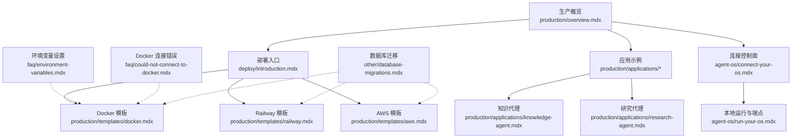
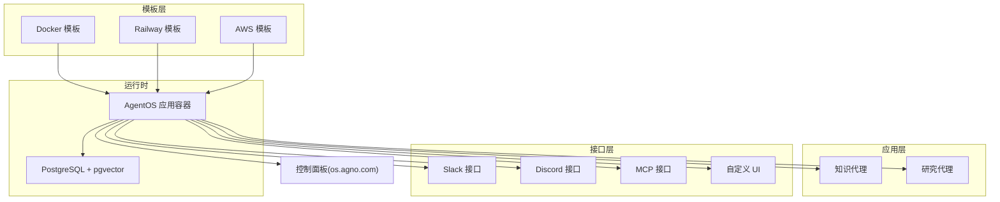
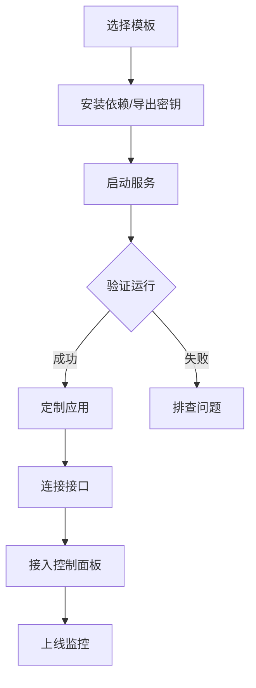
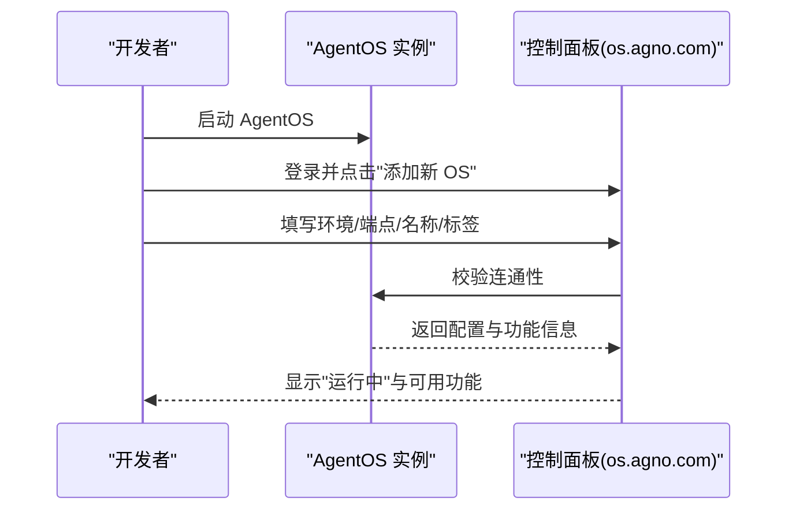
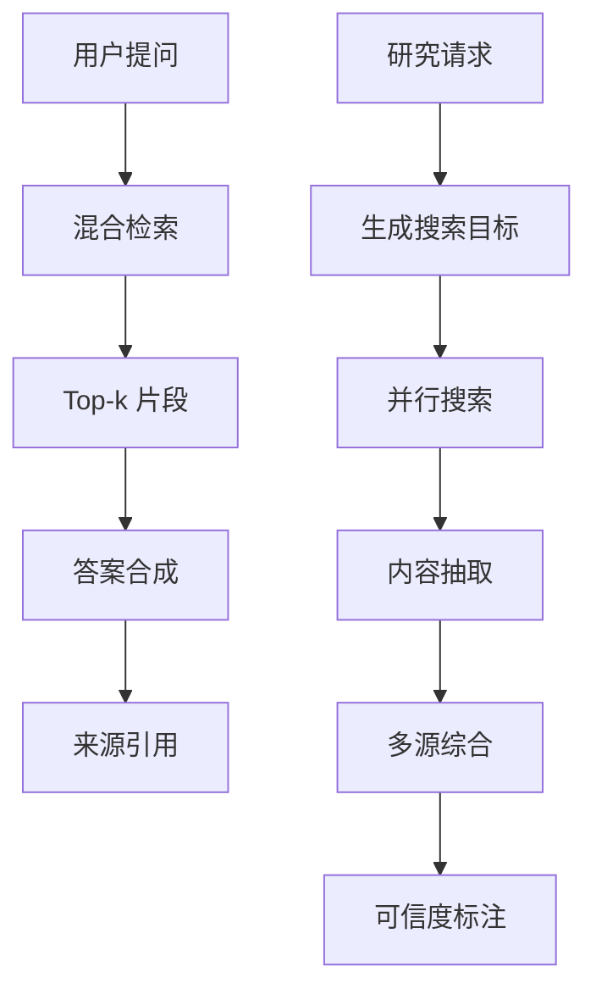
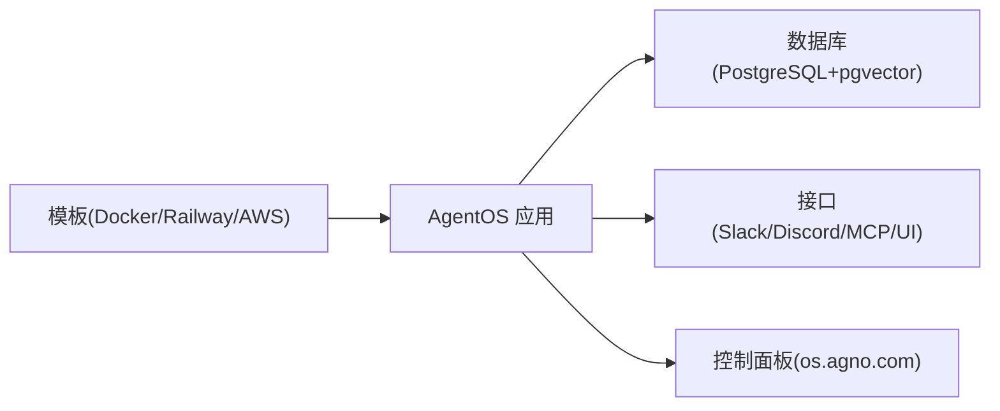

# 生产环境概述

<cite>
**本文引用的文件**
- [production/overview.mdx](file://production/overview.mdx)
- [deploy/introduction.mdx](file://deploy/introduction.mdx)
- [agent-os/connect-your-os.mdx](file://agent-os/connect-your-os.mdx)
- [agent-os/run-your-os.mdx](file://agent-os/run-your-os.mdx)
- [production/templates/docker.mdx](file://production/templates/docker.mdx)
- [production/templates/railway.mdx](file://production/templates/railway.mdx)
- [production/templates/aws.mdx](file://production/templates/aws.mdx)
- [production/applications/knowledge-agent.mdx](file://production/applications/knowledge-agent.mdx)
- [production/applications/research-agent.mdx](file://production/applications/research-agent.mdx)
- [faq/environment-variables.mdx](file://faq/environment-variables.mdx)
- [faq/could-not-connect-to-docker.mdx](file://faq/could-not-connect-to-docker.mdx)
- [other/database-migrations.mdx](file://other/database-migrations.mdx)
</cite>

## 目录
1. [简介](#简介)
2. [项目结构](#项目结构)
3. [核心组件](#核心组件)
4. [架构总览](#架构总览)
5. [详细组件分析](#详细组件分析)
6. [依赖关系分析](#依赖关系分析)
7. [性能考量](#性能考量)
8. [故障排除指南](#故障排除指南)
9. [结论](#结论)
10. [附录](#附录)

## 简介
本文件面向生产环境部署与运维，系统性阐述从开发到生产的完整流程，并以“三步部署法”为主线：部署（Deploy）、定制（Customize）、连接（Connect）。文档覆盖在不同基础设施环境中的部署策略，包括 Docker、Railway 与 AWS 的优势与适用场景；同时给出生产最佳实践与注意事项，帮助开发者理解生产部署的关键要素，并提供可操作的部署示例与常见问题解决方案。

## 项目结构
围绕生产部署，仓库中与之直接相关的知识主要分布在以下区域：
- production：生产模板与应用示例，涵盖 Docker、Railway、AWS 三种部署路径及典型应用（知识代理、研究代理等）
- deploy：部署入口与通用说明，强调从模板开始、添加应用、暴露接口的三步法
- agent-os：控制面连接与本地运行说明，便于在本地验证后接入控制平面
- faq：环境变量设置与 Docker 连接错误等常见问题
- other：数据库迁移指南，确保版本演进时数据一致性

图表来源
- [production/overview.mdx:1-73](file://production/overview.mdx#L1-L73)
- [deploy/introduction.mdx:1-102](file://deploy/introduction.mdx#L1-L102)
- [production/templates/docker.mdx:1-164](file://production/templates/docker.mdx#L1-L164)
- [production/templates/railway.mdx:1-182](file://production/templates/railway.mdx#L1-L182)
- [production/templates/aws.mdx:1-210](file://production/templates/aws.mdx#L1-L210)
- [production/applications/knowledge-agent.mdx:1-226](file://production/applications/knowledge-agent.mdx#L1-L226)
- [production/applications/research-agent.mdx:1-187](file://production/applications/research-agent.mdx#L1-L187)
- [agent-os/connect-your-os.mdx:1-41](file://agent-os/connect-your-os.mdx#L1-L41)
- [agent-os/run-your-os.mdx:1-83](file://agent-os/run-your-os.mdx#L1-L83)
- [faq/environment-variables.mdx:1-120](file://faq/environment-variables.mdx#L1-L120)
- [faq/could-not-connect-to-docker.mdx:1-60](file://faq/could-not-connect-to-docker.mdx#L1-L60)
- [other/database-migrations.mdx:1-155](file://other/database-migrations.mdx#L1-L155)

章节来源
- [production/overview.mdx:1-73](file://production/overview.mdx#L1-L73)
- [deploy/introduction.mdx:1-102](file://deploy/introduction.mdx#L1-L102)

## 核心组件
- 三步部署法
  - 部署：选择模板（Docker、Railway、AWS）完成基础运行环境搭建
  - 定制：根据业务场景添加应用（如知识代理、研究代理等），适配模型、工具与知识库
  - 连接：将应用通过 Slack、Discord、MCP 或自定义 UI 对外暴露，接入用户平台
- 控制面连接
  - 在本地或生产环境运行后，通过控制面板进行连接配置与状态校验，确保运行状态、功能可用与代理可见
- 应用示例
  - 知识代理：基于向量检索与混合搜索，提供带来源引用的答案合成
  - 研究代理：使用并行搜索与内容抽取，生成多来源综合报告并标注可信度

章节来源
- [production/overview.mdx:6-72](file://production/overview.mdx#L6-L72)
- [agent-os/connect-your-os.mdx:24-41](file://agent-os/connect-your-os.mdx#L24-L41)
- [production/applications/knowledge-agent.mdx:1-226](file://production/applications/knowledge-agent.mdx#L1-L226)
- [production/applications/research-agent.mdx:1-187](file://production/applications/research-agent.mdx#L1-L187)

## 架构总览
下图展示从模板到应用再到接口的整体生产架构，以及控制面连接与数据库迁移的关键节点：

图表来源
- [production/templates/docker.mdx:7-102](file://production/templates/docker.mdx#L7-L102)
- [production/templates/railway.mdx:9-121](file://production/templates/railway.mdx#L9-L121)
- [production/templates/aws.mdx:7-125](file://production/templates/aws.mdx#L7-L125)
- [production/applications/knowledge-agent.mdx:144-154](file://production/applications/knowledge-agent.mdx#L144-L154)
- [production/applications/research-agent.mdx:134-146](file://production/applications/research-agent.mdx#L134-L146)
- [agent-os/connect-your-os.mdx:8-33](file://agent-os/connect-your-os.mdx#L8-L33)

## 详细组件分析

### 三步部署法详解
- 部署（Deploy）
  - Docker：本地或云厂商 Docker 支持，一键启动 AgentOS 与数据库，支持热重载与常用命令
  - Railway：一键部署至 Railway 平台，自动提供 HTTPS 与域名，内置示例代理
  - AWS：在自有 AWS 基础设施上部署，使用 ECS Fargate、RDS、ALB 等生产级资源
- 定制（Customize）
  - 选择预置应用或自定义 Agent/Team/Workflow，按需扩展工具、知识库与输出格式
- 连接（Connect）
  - 将应用暴露到 Slack、Discord、MCP 或自定义 UI，实现与用户的无缝对接

图表来源
- [production/overview.mdx:6-72](file://production/overview.mdx#L6-L72)
- [production/templates/docker.mdx:14-102](file://production/templates/docker.mdx#L14-L102)
- [production/templates/railway.mdx:24-121](file://production/templates/railway.mdx#L24-L121)
- [production/templates/aws.mdx:15-125](file://production/templates/aws.mdx#L15-L125)

章节来源
- [production/overview.mdx:6-72](file://production/overview.mdx#L6-L72)
- [deploy/introduction.mdx:11-101](file://deploy/introduction.mdx#L11-L101)

### AgentOS 控制面连接流程
- 在本地或生产环境运行后，打开控制面板，选择本地或在线环境，填写端点 URL、名称与标签，点击连接
- 连接成功后，可在控制面板看到运行状态、功能可用性与已配置代理

图表来源
- [agent-os/connect-your-os.mdx:8-33](file://agent-os/connect-your-os.mdx#L8-L33)
- [agent-os/run-your-os.mdx:76-83](file://agent-os/run-your-os.mdx#L76-L83)

章节来源
- [agent-os/connect-your-os.mdx:24-41](file://agent-os/connect-your-os.mdx#L24-L41)
- [agent-os/run-your-os.mdx:36-83](file://agent-os/run-your-os.mdx#L36-L83)

### 应用示例：知识代理与研究代理
- 知识代理
  - 关键能力：RAG、混合检索（语义+关键词）、来源引用、不确定性处理
  - 工作流：用户提问 → 检索知识库 → 获取上下文 → 合成答案并引用来源
- 研究代理
  - 关键能力：并行搜索、内容抽取、可信度评估、多来源综合
  - 工作流：分析问题 → 生成搜索目标与查询 → 执行搜索 → 抽取内容 → 综合并标注来源

图表来源
- [production/applications/knowledge-agent.mdx:144-154](file://production/applications/knowledge-agent.mdx#L144-L154)
- [production/applications/research-agent.mdx:134-146](file://production/applications/research-agent.mdx#L134-L146)

章节来源
- [production/applications/knowledge-agent.mdx:10-226](file://production/applications/knowledge-agent.mdx#L10-L226)
- [production/applications/research-agent.mdx:9-187](file://production/applications/research-agent.mdx#L9-L187)

### 基础设施部署策略对比
- Docker
  - 优势：本地开发友好、热重载、跨云通用
  - 场景：本地验证、小规模生产、多云迁移过渡
- Railway
  - 优势：零配置部署、自动 HTTPS、公共域名、快速迭代
  - 场景：原型验证、中小规模生产、团队协作
- AWS
  - 优势：完全自控、生产级弹性与安全、可扩展性强
  - 场景：企业级生产、合规要求高、需要深度定制

章节来源
- [production/templates/docker.mdx:7-102](file://production/templates/docker.mdx#L7-L102)
- [production/templates/railway.mdx:9-121](file://production/templates/railway.mdx#L9-L121)
- [production/templates/aws.mdx:7-125](file://production/templates/aws.mdx#L7-L125)

## 依赖关系分析
- 模板与运行时
  - Docker/Railway/AWS 模板均指向同一 AgentOS 应用与数据库组合（PostgreSQL + pgvector）
- 应用与接口
  - 应用通过统一的 AgentOS 路由对外提供服务，再由接口层（Slack/Discord/MCP/UI）接入用户
- 控制面与运行时
  - 控制面板通过端点 URL 与 AgentOS 通信，用于状态检查与配置查看

图表来源
- [production/templates/docker.mdx:7-102](file://production/templates/docker.mdx#L7-L102)
- [production/templates/railway.mdx:9-121](file://production/templates/railway.mdx#L9-L121)
- [production/templates/aws.mdx:7-125](file://production/templates/aws.mdx#L7-L125)
- [agent-os/connect-your-os.mdx:8-33](file://agent-os/connect-your-os.mdx#L8-L33)

章节来源
- [production/templates/docker.mdx:104-164](file://production/templates/docker.mdx#L104-L164)
- [production/templates/railway.mdx:123-182](file://production/templates/railway.mdx#L123-L182)
- [production/templates/aws.mdx:129-210](file://production/templates/aws.mdx#L129-L210)

## 性能考量
- 数据库与检索
  - 使用 pgvector 提升向量检索效率，结合混合检索（语义+关键词）提升召回质量
  - 合理设置最大结果数与嵌入维度，平衡准确率与延迟
- 模型与并发
  - 根据业务负载选择合适模型与并发策略，避免超限与降级
- 部署弹性
  - Railway 可通过服务管理快速扩容；AWS 可利用 ECS Fargate 的弹性与 ALB 的高可用
- 运行时可观测性
  - 结合控制面板与日志系统，持续监控端点健康、响应时间与错误率

## 故障排除指南
- 环境变量
  - 在 macOS/Windows 上正确设置临时或永久环境变量，确保模型 API 密钥与数据库连接字符串生效
- Docker 连接失败
  - 检查 /var/run/docker.sock 是否存在且权限正确，必要时重建软链接或加入 docker 用户组
- 数据库迁移
  - 使用迁移端点或 MigrationManager 进行升级/降级，遇到列不匹配或插入错误时可强制迁移并重启实例
- 常见部署问题
  - Railway 首次部署需初始化项目；AWS 需等待 RDS 初始化完成；Docker 需确认端口未被占用

章节来源
- [faq/environment-variables.mdx:6-120](file://faq/environment-variables.mdx#L6-L120)
- [faq/could-not-connect-to-docker.mdx:6-60](file://faq/could-not-connect-to-docker.mdx#L6-L60)
- [other/database-migrations.mdx:15-155](file://other/database-migrations.mdx#L15-L155)
- [production/templates/railway.mdx:163-182](file://production/templates/railway.mdx#L163-L182)
- [production/templates/aws.mdx:194-210](file://production/templates/aws.mdx#L194-L210)
- [production/templates/docker.mdx:153-164](file://production/templates/docker.mdx#L153-L164)

## 结论
通过“三步部署法”，开发者可以快速从模板起步，完成生产部署、应用定制与接口连接。结合控制面板与数据库迁移机制，能够在版本演进中保持稳定与可控。针对不同基础设施，Docker、Railway 与 AWS 各具优势：前者适合本地与多云过渡，后者适合快速上线与团队协作，前者适合企业级生产与深度定制。配合环境变量管理、Docker 连接排查与数据库迁移策略，可显著降低生产风险并提升交付效率。

## 附录
- 快速参考
  - 端点与文档：本地运行后可通过端点访问交互式 API 文档与配置页面
  - 控制面板连接：按提示填写环境、端点 URL、名称与标签，验证运行状态与功能可用性
  - 模板选择：根据团队规模与基础设施偏好选择 Docker/Railway/AWS 模板

章节来源
- [agent-os/run-your-os.mdx:76-83](file://agent-os/run-your-os.mdx#L76-L83)
- [agent-os/connect-your-os.mdx:24-41](file://agent-os/connect-your-os.mdx#L24-L41)