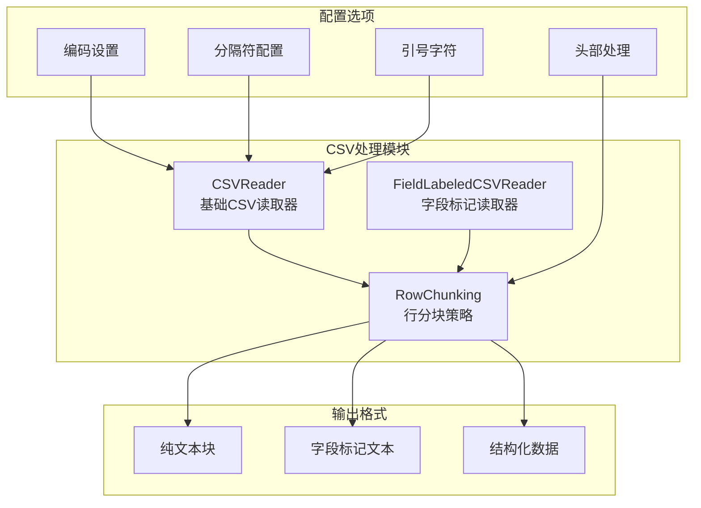
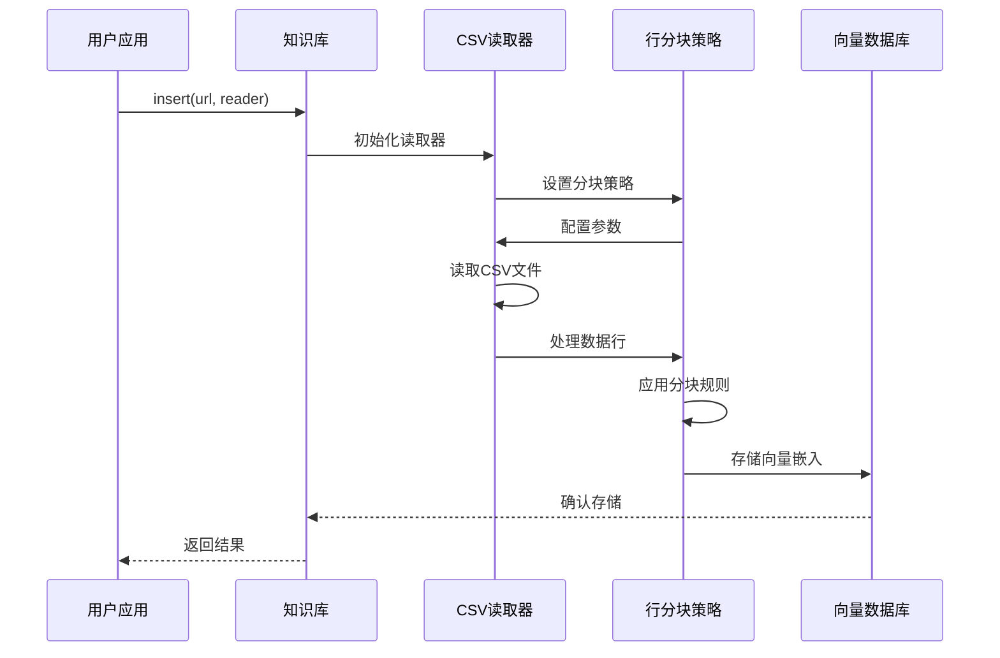
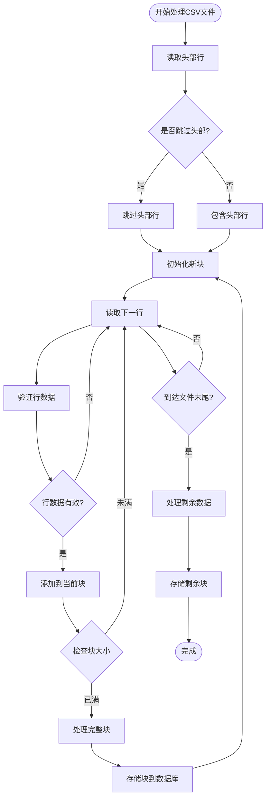
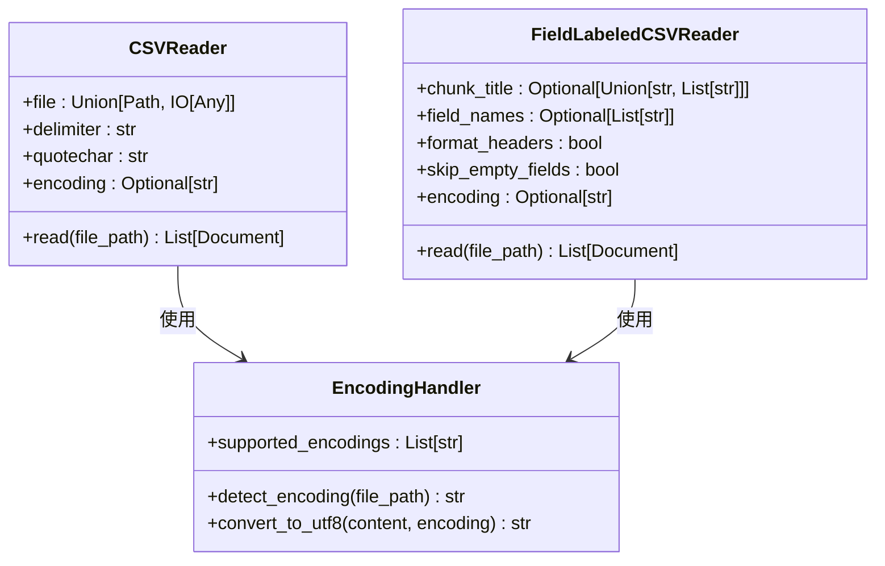
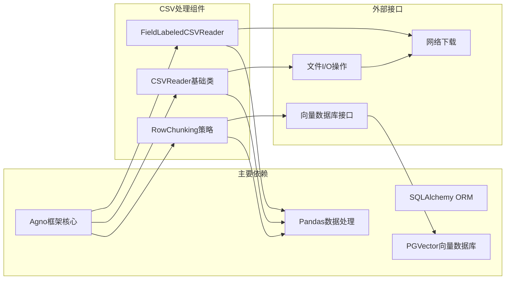

# CSV行分块

<cite>
**本文档引用的文件**
- [知识概念：CSV行分块](file://knowledge/concepts/chunking/csv-row-chunking.mdx)
- [参考：CSV行分块](file://reference/knowledge/chunking/csv-row.mdx)
- [示例：CSV行分块](file://examples/knowledge/chunking/csv-row-chunking.mdx)
- [_snippets：CSV行分块参数](file://_snippets/chunking-csv-row.mdx)
- [知识概念：CSV读取器](file://knowledge/concepts/readers/csv-reader.mdx)
- [参考：CSV读取器](file://reference/knowledge/reader/csv.mdx)
- [_snippets：CSV读取器参数](file://_snippets/csv-reader-reference.mdx)
- [示例：CSV读取器自定义编码](file://examples/knowledge/readers/csv-reader-custom-encodings.mdx)
- [知识概念：字段标记CSV读取器](file://knowledge/concepts/readers/field-labeled-csv-reader.mdx)
- [参考：字段标记CSV读取器](file://reference/knowledge/reader/field-labeled-csv.mdx)
- [_snippets：字段标记CSV读取器参数](file://_snippets/field-labeled-csv-reader-reference.mdx)
</cite>

## 目录
1. [简介](#简介)
2. [项目结构](#项目结构)
3. [核心组件](#核心组件)
4. [架构概览](#架构概览)
5. [详细组件分析](#详细组件分析)
6. [依赖关系分析](#依赖关系分析)
7. [性能考虑](#性能考虑)
8. [故障排除指南](#故障排除指南)
9. [结论](#结论)

## 简介

CSV行分块是一种基于行数而非字符数来分割CSV文件的策略。这种方法特别适用于结构化数据，能够在保持单个记录完整性的同时，以可管理的行块大小进行处理。

在Agno框架中，CSV行分块通过RowChunking策略实现，该策略将每一行数据作为独立的分块单元，适用于表格数据和结构化信息的处理。

## 项目结构

本项目围绕CSV处理提供了完整的解决方案，包括基础读取器、专门的行分块策略以及多种编码支持：



**图表来源**
- [知识概念：CSV行分块:1-63](file://knowledge/concepts/chunking/csv-row-chunking.mdx#L1-L63)
- [知识概念：CSV读取器:1-63](file://knowledge/concepts/readers/csv-reader.mdx#L1-L63)
- [知识概念：字段标记CSV读取器:1-100](file://knowledge/concepts/readers/field-labeled-csv-reader.mdx#L1-L100)

## 核心组件

### RowChunking策略

RowChunking是CSV行分块的核心实现，提供以下关键功能：

- **行数控制**：通过`rows_per_chunk`参数控制每块包含的行数
- **头部处理**：支持跳过头部或将其包含在每个块中
- **数据清理**：自动清理和标准化行数据
- **字符限制**：提供最大块大小的回退限制

### CSVReader基础类

CSVReader提供基础的CSV文件读取功能：

- **文件输入**：支持本地文件路径或文件对象
- **分隔符配置**：默认使用逗号分隔符，支持自定义
- **引号处理**：默认使用双引号，支持自定义引号字符
- **编码支持**：支持多种字符编码

### FieldLabeledCSVReader

专门用于生成人类可读的字段标记文档：

- **字段标签**：将CSV字段转换为清晰的标签文本
- **标题定制**：支持自定义块标题
- **空字段过滤**：可选择跳过空字段
- **头部格式化**：自动格式化列标题

**章节来源**
- [知识概念：CSV行分块:1-63](file://knowledge/concepts/chunking/csv-row-chunking.mdx#L1-L63)
- [参考：CSV行分块:1-10](file://reference/knowledge/chunking/csv-row.mdx#L1-L10)
- [_snippets：CSV行分块参数:1-8](file://_snippets/chunking-csv-row.mdx#L1-L8)

## 架构概览

CSV处理的整体架构采用分层设计，从底层的文件读取到上层的应用集成：



**图表来源**
- [知识概念：CSV行分块:10-39](file://knowledge/concepts/chunking/csv-row-chunking.mdx#L10-L39)
- [示例：CSV行分块:5-33](file://examples/knowledge/chunking/csv-row-chunking.mdx#L5-L33)

## 详细组件分析

### 行分块算法流程

CSV行分块的核心算法遵循以下流程：



**图表来源**
- [知识概念：CSV行分块:5-6](file://knowledge/concepts/chunking/csv-row-chunking.mdx#L5-L6)
- [_snippets：CSV行分块参数:3-8](file://_snippets/chunking-csv-row.mdx#L3-L8)

### 参数配置详解

#### RowChunking参数

| 参数名 | 类型 | 默认值 | 描述 |
|--------|------|--------|------|
| `rows_per_chunk` | int | 100 | 每个块包含的行数 |
| `skip_header` | bool | False | 分块时是否跳过头部行 |
| `clean_rows` | bool | True | 是否清理和标准化行数据 |
| `include_header_in_chunks` | bool | False | 是否在每个块中包含头部行 |
| `max_chunk_size` | int | 5000 | 每个块的最大字符大小（回退限制） |

#### CSVReader参数

| 参数名 | 类型 | 默认值 | 描述 |
|--------|------|--------|------|
| `file` | Union[Path, IO[Any]] | 必需 | CSV文件路径或文件对象 |
| `delimiter` | str | "," | 分隔字段的字符 |
| `quotechar` | str | '"' | 引用字段的字符 |

#### FieldLabeledCSVReader参数

| 参数名 | 类型 | 默认值 | 描述 |
|--------|------|--------|------|
| `chunk_title` | Optional[Union[str, List[str]]] | None | 每个条目前添加的标题 |
| `field_names` | Optional[List[str]] | [] | CSV字段的自定义标签 |
| `format_headers` | bool | True | 是否格式化列标题 |
| `skip_empty_fields` | bool | True | 是否跳过空值字段 |
| `encoding` | Optional[str] | "utf-8" | 文件字符编码 |

**章节来源**
- [_snippets：CSV行分块参数:1-8](file://_snippets/chunking-csv-row.mdx#L1-L8)
- [_snippets：CSV读取器参数:1-5](file://_snippets/csv-reader-reference.mdx#L1-L5)
- [_snippets：字段标记CSV读取器参数:1-10](file://_snippets/field-labeled-csv-reader-reference.mdx#L1-L10)

### 编码处理机制

系统支持多种字符编码，特别是针对非UTF-8编码的CSV文件：



**图表来源**
- [_snippets：CSV读取器参数:3-5](file://_snippets/csv-reader-reference.mdx#L3-L5)
- [_snippets：字段标记CSV读取器参数:9-10](file://_snippets/field-labeled-csv-reader-reference.mdx#L9-L10)

**章节来源**
- [示例：CSV读取器自定义编码:1-60](file://examples/knowledge/readers/csv-reader-custom-encodings.mdx#L1-L60)

## 依赖关系分析

CSV行分块策略与相关组件的依赖关系如下：



**图表来源**
- [知识概念：CSV行分块:10-16](file://knowledge/concepts/chunking/csv-row-chunking.mdx#L10-L16)
- [知识概念：CSV读取器:9-14](file://knowledge/concepts/readers/csv-reader.mdx#L9-L14)

**章节来源**
- [知识概念：CSV行分块:1-63](file://knowledge/concepts/chunking/csv-row-chunking.mdx#L1-L63)
- [知识概念：CSV读取器:1-63](file://knowledge/concepts/readers/csv-reader.mdx#L1-L63)

## 性能考虑

### 内存优化策略

1. **流式处理**：使用生成器模式逐行处理CSV文件，避免一次性加载整个文件到内存
2. **块大小调优**：根据可用内存和数据特征调整`rows_per_chunk`参数
3. **垃圾回收**：及时释放不再使用的数据块引用

### 批量处理技术

1. **向量化操作**：利用Pandas的向量化操作提高数据处理效率
2. **异步I/O**：在网络下载和数据库存储时使用异步操作
3. **批处理插入**：将多个文档批量插入向量数据库

### 大型文件处理建议

- 对于超大CSV文件，建议设置较小的`rows_per_chunk`值（如50-100行）
- 启用`clean_rows`选项以确保数据质量
- 考虑使用`include_header_in_chunks`选项提高检索准确性

## 故障排除指南

### 常见问题及解决方案

#### 编码错误
**问题**：读取中文或其他非ASCII字符时出现乱码
**解决方案**：指定正确的字符编码
```python
reader = CSVReader(encoding="gb2312")  # 中文GB2312编码
reader = CSVReader(encoding="latin-1")  # 欧洲语言
```

#### 分隔符识别问题
**问题**：制表符分隔的CSV文件被错误解析
**解决方案**：显式指定分隔符
```python
reader = CSVReader(delimiter="\t")  # 制表符分隔
reader = CSVReader(delimiter=";")   # 分号分隔
```

#### 内存不足错误
**问题**：处理大型CSV文件时内存溢出
**解决方案**：减小块大小或启用数据清理
```python
chunking = RowChunking(rows_per_chunk=50, clean_rows=True)
```

#### 头部处理冲突
**问题**：同时使用`skip_header`和`include_header_in_chunks`
**解决方案**：明确二选一的策略
```python
# 方案A：跳过头部
chunking = RowChunking(skip_header=True)

# 方案B：包含头部但不跳过
chunking = RowChunking(include_header_in_chunks=True)
```

**章节来源**
- [示例：CSV读取器自定义编码:32-43](file://examples/knowledge/readers/csv-reader-custom-encodings.mdx#L32-L43)

## 结论

CSV行分块策略为结构化数据处理提供了一个强大而灵活的解决方案。通过将每一行作为独立的分块单元，该策略能够：

1. **保持数据完整性**：每个记录作为一个完整的块，避免跨行分割
2. **优化内存使用**：支持大规模数据的流式处理
3. **增强检索效果**：通过字段标记和数据清理提高搜索准确性
4. **适应多种场景**：支持不同的分隔符、编码和数据格式

推荐在处理表格数据、日志文件和结构化报告时使用此策略，并根据具体的数据特征和性能要求调整相关参数。