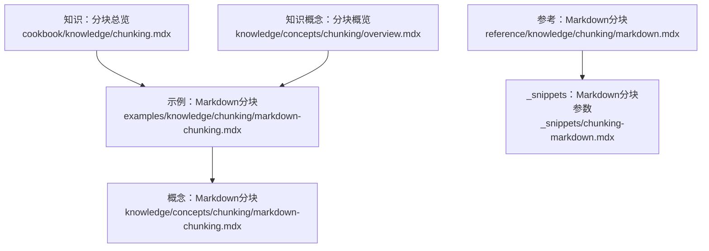
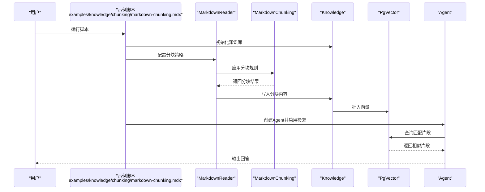
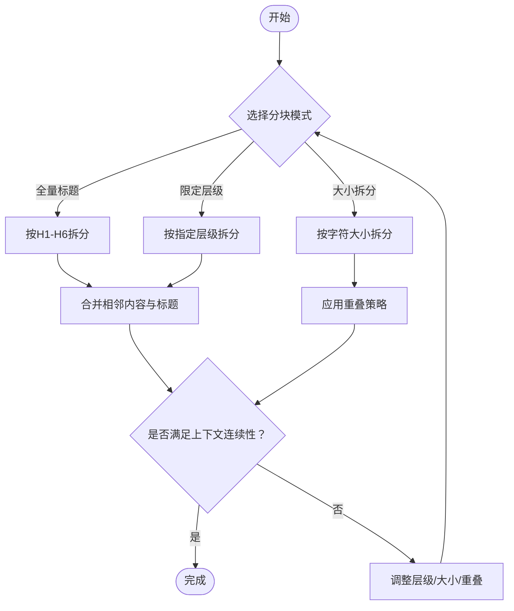
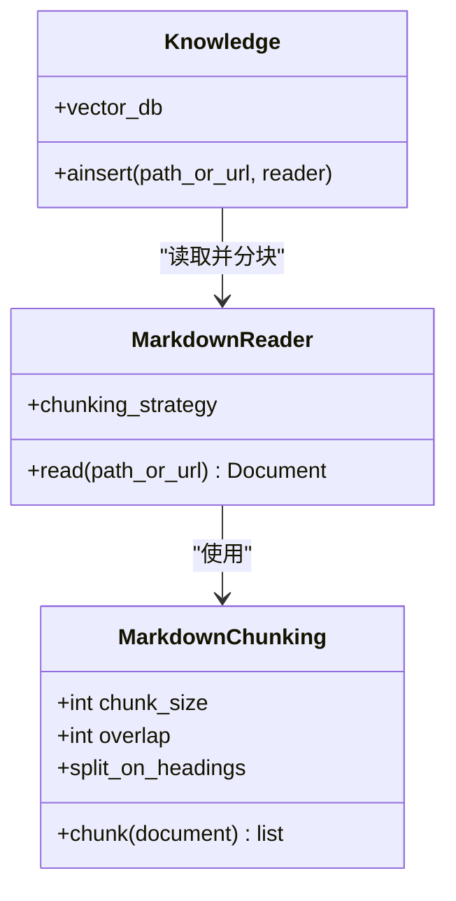
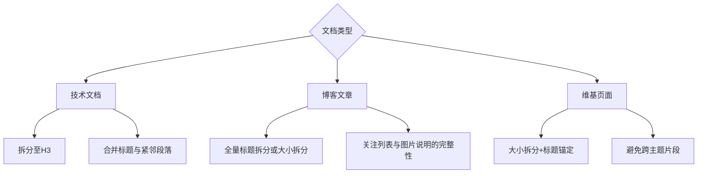
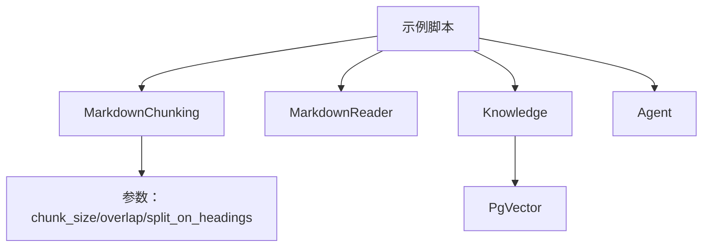

# Markdown分块

<cite>
**本文引用的文件**
- [示例：Markdown分块](file://examples/knowledge/chunking/markdown-chunking.mdx)
- [知识概念：Markdown分块](file://knowledge/concepts/chunking/markdown-chunking.mdx)
- [参考：Markdown分块](file://reference/knowledge/chunking/markdown.mdx)
- [_snippets：Markdown分块参数](file://_snippets/chunking-markdown.mdx)
- [知识概览：分块策略](file://knowledge/concepts/chunking/overview.mdx)
- [知识：分块总览](file://cookbook/knowledge/chunking.mdx)
</cite>

## 目录
1. [引言](#引言)
2. [项目结构](#项目结构)
3. [核心组件](#核心组件)
4. [架构总览](#架构总览)
5. [详细组件分析](#详细组件分析)
6. [依赖关系分析](#依赖关系分析)
7. [性能考量](#性能考量)
8. [故障排查指南](#故障排查指南)
9. [结论](#结论)
10. [附录](#附录)

## 引言
本技术文档聚焦于Markdown分块策略，系统阐述如何基于标题层级结构进行智能分块，确保每个分块包含完整的标题与相关内容，并在标题之间维持适当的上下文连续性。文档同时给出面向技术文档、博客文章与维基页面的分块优化策略，并对列表、代码块、表格等Markdown元素的处理提供实践建议。

## 项目结构
围绕Markdown分块，仓库中存在多处示例与参考材料，涵盖使用方式、参数说明与最佳实践路径：
- 示例与演示脚本：examples/knowledge/chunking/markdown-chunking.mdx 提供多种分块策略的运行示例与对比。
- 概念与入门：knowledge/concepts/chunking/markdown-chunking.mdx 提供最小可运行示例与步骤说明。
- 参考与参数表：reference/knowledge/chunking/markdown.mdx 与 _snippets/chunking-markdown.mdx 提供参数定义与简要说明。
- 分块策略总览：cookbook/knowledge/chunking.mdx 与 knowledge/concepts/chunking/overview.mdx 提供策略对比与入口索引。

**图示来源**
- [示例：Markdown分块:1-202](file://examples/knowledge/chunking/markdown-chunking.mdx#L1-L202)
- [知识概念：Markdown分块:1-61](file://knowledge/concepts/chunking/markdown-chunking.mdx#L1-L61)
- [参考：Markdown分块:1-10](file://reference/knowledge/chunking/markdown.mdx#L1-L10)
- [_snippets：Markdown分块参数:1-5](file://_snippets/chunking-markdown.mdx#L1-L5)
- [知识：分块总览:1-217](file://cookbook/knowledge/chunking.mdx#L1-L217)
- [知识概念：分块概览:28-62](file://knowledge/concepts/chunking/overview.mdx#L28-L62)

**章节来源**
- [示例：Markdown分块:1-202](file://examples/knowledge/chunking/markdown-chunking.mdx#L1-L202)
- [知识概念：Markdown分块:1-61](file://knowledge/concepts/chunking/markdown-chunking.mdx#L1-L61)
- [参考：Markdown分块:1-10](file://reference/knowledge/chunking/markdown.mdx#L1-L10)
- [_snippets：Markdown分块参数:1-5](file://_snippets/chunking-markdown.mdx#L1-L5)
- [知识：分块总览:1-217](file://cookbook/knowledge/chunking.mdx#L1-L217)
- [知识概念：分块概览:28-62](file://knowledge/concepts/chunking/overview.mdx#L28-L62)

## 核心组件
- MarkdownChunking 策略：用于按标题层级拆分Markdown内容，支持“仅按标题拆分”“按指定层级拆分”“传统字符大小拆分”等多种模式。
- MarkdownReader：负责读取Markdown文档并应用分块策略生成片段。
- Knowledge：封装向量数据库写入与检索流程，便于在示例中直接插入与查询。
- Agent：用于对知识库进行问答验证，评估不同分块策略的效果。

上述组件在示例脚本中被组合使用，形成从“数据读取→分块→入库→检索→输出”的完整链路。

**章节来源**
- [示例：Markdown分块:15-18](file://examples/knowledge/chunking/markdown-chunking.mdx#L15-L18)
- [知识概念：Markdown分块:10-37](file://knowledge/concepts/chunking/markdown-chunking.mdx#L10-L37)

## 架构总览
下图展示了以Markdown分块为核心的端到端流程：用户通过示例脚本选择不同的分块策略，将Markdown内容切分为若干片段并写入向量数据库；随后Agent基于检索结果进行回答。

**图示来源**
- [示例：Markdown分块:23-51](file://examples/knowledge/chunking/markdown-chunking.mdx#L23-L51)
- [示例：Markdown分块:68-84](file://examples/knowledge/chunking/markdown-chunking.mdx#L68-L84)
- [示例：Markdown分块:101-116](file://examples/knowledge/chunking/markdown-chunking.mdx#L101-L116)
- [示例：Markdown分块:133-152](file://examples/knowledge/chunking/markdown-chunking.mdx#L133-L152)
- [示例：Markdown分块:169-184](file://examples/knowledge/chunking/markdown-chunking.mdx#L169-L184)

## 详细组件分析

### 组件A：标题层级拆分策略
- 全量标题拆分（H1-H6）：将每个标题作为独立分块起点，适合需要极细粒度检索的场景。
- 限定层级拆分（如H1、H1+H2、H1+H2+H3）：在保证语义完整性的同时控制分块粒度，兼顾召回与精度。
- 传统大小拆分（禁用标题拆分）：按固定字符数与重叠进行切分，适用于无明显结构或需严格控制大小的场景。

**图示来源**
- [示例：Markdown分块:24-44](file://examples/knowledge/chunking/markdown-chunking.mdx#L24-L44)
- [示例：Markdown分块:54-85](file://examples/knowledge/chunking/markdown-chunking.mdx#L54-L85)
- [示例：Markdown分块:88-116](file://examples/knowledge/chunking/markdown-chunking.mdx#L88-L116)
- [示例：Markdown分块:119-152](file://examples/knowledge/chunking/markdown-chunking.mdx#L119-L152)
- [示例：Markdown分块:155-184](file://examples/knowledge/chunking/markdown-chunking.mdx#L155-L184)

**章节来源**
- [示例：Markdown分块:24-184](file://examples/knowledge/chunking/markdown-chunking.mdx#L24-L184)

### 组件B：参数与配置
- chunk_size：单个分块的最大字符数（传统大小拆分模式下生效）。
- overlap：分块之间的字符重叠长度，提升跨边界检索的连续性。
- split_on_headings：控制是否按标题层级拆分；可传入整数表示拆分至的标题层级上限（如1/2/3）。

**图示来源**
- [_snippets：Markdown分块参数:1-5](file://_snippets/chunking-markdown.mdx#L1-L5)
- [知识概念：Markdown分块:18-36](file://knowledge/concepts/chunking/markdown-chunking.mdx#L18-L36)
- [示例：Markdown分块:138-142](file://examples/knowledge/chunking/markdown-chunking.mdx#L138-L142)

**章节来源**
- [_snippets：Markdown分块参数:1-5](file://_snippets/chunking-markdown.mdx#L1-L5)
- [知识概念：Markdown分块:58-61](file://knowledge/concepts/chunking/markdown-chunking.mdx#L58-L61)
- [示例：Markdown分块:138-142](file://examples/knowledge/chunking/markdown-chunking.mdx#L138-L142)

### 组件C：不同文档类型的分块优化策略
- 技术文档
  - 建议：优先采用“限定层级拆分”，如拆分至H3，使每个分块覆盖一个功能模块或API段落，同时保留H4-H6细节。
  - 注意：避免将方法签名与说明拆开，必要时在策略中增加“标题+紧随段落”的合并逻辑。
- 博客文章
  - 建议：采用“全量标题拆分”或“大小拆分+适度重叠”，以捕捉章节级主题与过渡句。
  - 注意：博客常见嵌套列表与图片说明，应确保列表块与标题同属一个分块。
- 维基页面
  - 建议：采用“大小拆分+标题锚定”，即在达到阈值时强制停在最近的标题处，保证每个分块有明确主题。

[此图为概念性流程图，不对应具体源码文件，故不提供图示来源]

### 组件D：列表、代码块与表格的特殊考虑
- 列表
  - 建议：将列表与其前导标题置于同一分块，避免检索时出现“只看到条目而缺少上下文”的情况。
  - 实践：在策略中识别列表起始位置，并将其与最近的上层标题合并。
- 代码块
  - 建议：在大小拆分模式下，尽量避免将函数签名与实现拆开；若必须拆分，保留足够的上下文重叠。
  - 实践：可在策略中识别代码块边界，优先在函数/类级别停顿。
- 表格
  - 建议：将表格与其标题或前导说明置于同一分块，确保检索时能理解列含义与用途。
  - 实践：在大小拆分模式下，遇到表格开头时强制停顿。

[本节为通用实践建议，不直接分析具体源码文件，故不提供章节来源]

## 依赖关系分析
- 示例脚本依赖：MarkdownChunking、MarkdownReader、Knowledge、PgVector、Agent。
- 参数依赖：chunk_size、overlap、split_on_headings共同决定分块粒度与连续性。
- 策略依赖：不同策略在“标题层级拆分”与“大小拆分”之间切换，影响检索召回与精度。

**图示来源**
- [示例：Markdown分块:15-18](file://examples/knowledge/chunking/markdown-chunking.mdx#L15-L18)
- [示例：Markdown分块:138-142](file://examples/knowledge/chunking/markdown-chunking.mdx#L138-L142)
- [知识概念：Markdown分块:18-36](file://knowledge/concepts/chunking/markdown-chunking.mdx#L18-L36)

**章节来源**
- [示例：Markdown分块:15-18](file://examples/knowledge/chunking/markdown-chunking.mdx#L15-L18)
- [知识概念：Markdown分块:18-36](file://knowledge/concepts/chunking/markdown-chunking.mdx#L18-L36)

## 性能考量
- 分块粒度与召回/精度权衡
  - 更细粒度（全量标题拆分）提升召回但可能引入噪声；更大粒度（仅H1/H1+H2）提升精度但可能遗漏细节。
- 重叠策略
  - 合理设置overlap可显著提升跨边界问题的检索效果，但会增加向量库存储与计算成本。
- 向量数据库写入
  - 批量写入与索引构建策略对吞吐与延迟有直接影响，建议结合实际数据规模调优。

[本节提供一般性指导，不直接分析具体源码文件，故不提供章节来源]

## 故障排查指南
- 现象：检索结果碎片化或缺乏上下文
  - 排查：检查split_on_headings是否过小，或overlap是否为0；尝试增大overlap或提高拆分层级上限。
- 现象：检索命中率低
  - 排查：确认chunk_size是否过大导致语义稀释；适当减小chunk_size并增加重叠。
- 现象：列表/表格被截断
  - 排查：在策略中增加对列表与表格边界的识别与锚定逻辑，避免将标题与内容强行拆分。

[本节为通用排障建议，不直接分析具体源码文件，故不提供章节来源]

## 结论
基于标题层级的Markdown分块策略能够有效平衡检索召回与上下文完整性。通过合理选择拆分层级、设定重叠与大小阈值，并结合列表、代码块、表格等元素的特殊处理，可以在技术文档、博客与维基等不同场景下获得稳定且高质量的检索效果。示例脚本提供了可复用的实践模板，建议在生产环境中根据数据特征进一步迭代参数与策略。

## 附录
- 快速参考
  - 全量标题拆分：适合极细粒度检索。
  - 限定层级拆分（如H1/H1+H2/H1+H2+H3）：平衡召回与精度。
  - 大小拆分：严格控制片段大小，适合无明显结构或强约束场景。
- 相关入口
  - 示例脚本与对比：见示例：Markdown分块
  - 最小可运行示例：见知识概念：Markdown分块
  - 参数定义与说明：见参考：Markdown分块、_snippets：Markdown分块参数
  - 分块策略总览：见知识：分块总览、知识概念：分块概览

**章节来源**
- [示例：Markdown分块:1-202](file://examples/knowledge/chunking/markdown-chunking.mdx#L1-L202)
- [知识概念：Markdown分块:1-61](file://knowledge/concepts/chunking/markdown-chunking.mdx#L1-L61)
- [参考：Markdown分块:1-10](file://reference/knowledge/chunking/markdown.mdx#L1-L10)
- [_snippets：Markdown分块参数:1-5](file://_snippets/chunking-markdown.mdx#L1-L5)
- [知识：分块总览:1-217](file://cookbook/knowledge/chunking.mdx#L1-L217)
- [知识概念：分块概览:28-62](file://knowledge/concepts/chunking/overview.mdx#L28-L62)