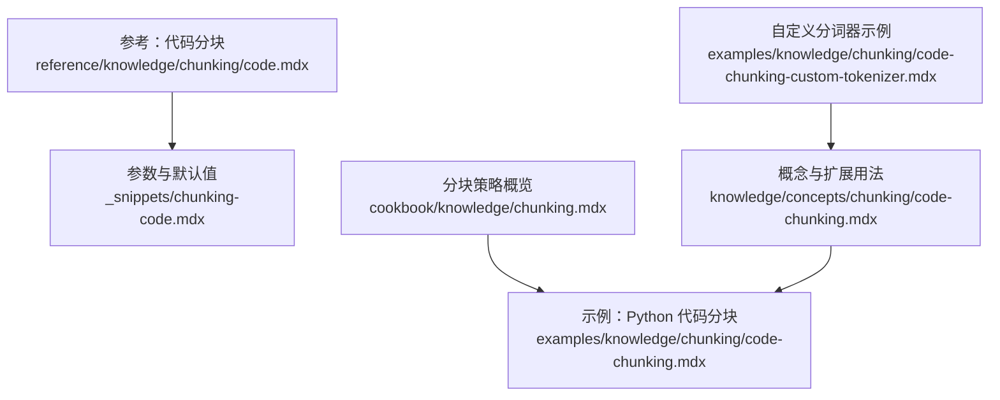
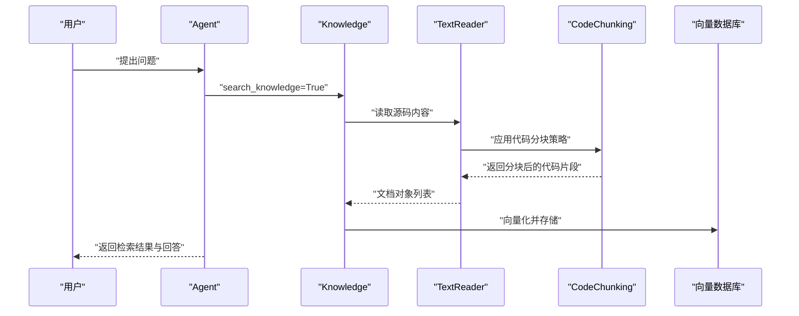
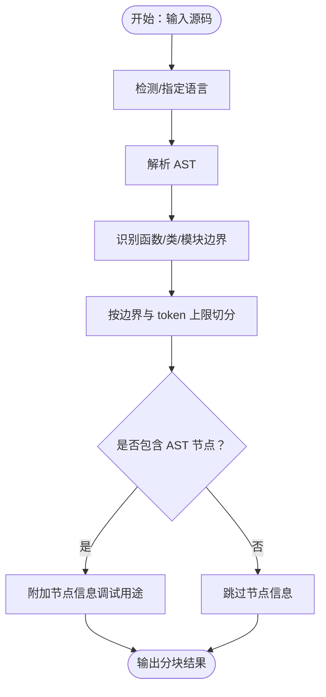
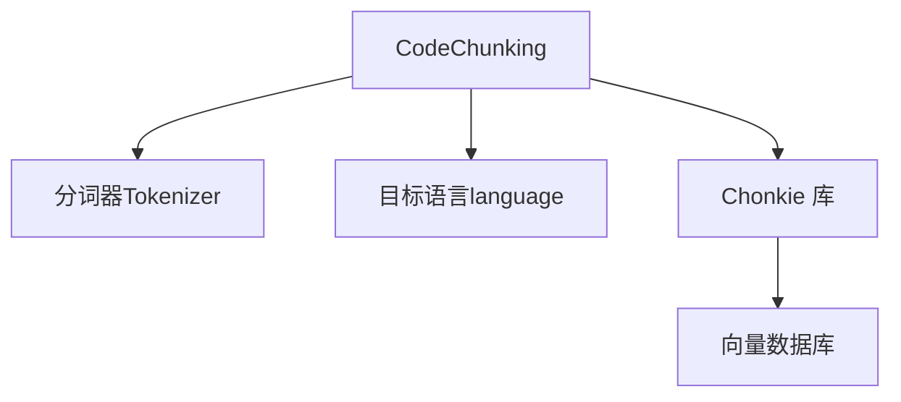

# 代码分块

<cite>
**本文引用的文件**
- [reference/knowledge/chunking/code.mdx](file://reference/knowledge/chunking/code.mdx)
- [_snippets/chunking-code.mdx](file://_snippets/chunking-code.mdx)
- [cookbook/knowledge/chunking.mdx](file://cookbook/knowledge/chunking.mdx)
- [examples/knowledge/chunking/code-chunking.mdx](file://examples/knowledge/chunking/code-chunking.mdx)
- [knowledge/concepts/chunking/code-chunking.mdx](file://knowledge/concepts/chunking/code-chunking.mdx)
- [examples/knowledge/chunking/code-chunking-custom-tokenizer.mdx](file://examples/knowledge/chunking/code-chunking-custom-tokenizer.mdx)
</cite>

## 目录
1. [引言](#引言)
2. [项目结构](#项目结构)
3. [核心组件](#核心组件)
4. [架构总览](#架构总览)
5. [详细组件分析](#详细组件分析)
6. [依赖关系分析](#依赖关系分析)
7. [性能考虑](#性能考虑)
8. [故障排查指南](#故障排查指南)
9. [结论](#结论)
10. [附录](#附录)

## 引言
本技术文档围绕“代码分块”展开，系统阐述如何基于抽象语法树（AST）对源代码进行智能分块，使相关语义单元保持完整，同时在函数、类、模块等结构边界处自然切分。文档重点覆盖以下方面：
- 基于 AST 的分块原理与优势
- 针对 Python、JavaScript、Java 等主流语言的分块策略与注意事项
- 注释、文档字符串与复杂结构的处理方式
- 在保持代码可执行性与可读性的前提下进行分块
- 结合仓库中已有的示例与参考文档，给出可操作的配置与实践建议

## 项目结构
本仓库中与“代码分块”直接相关的内容主要分布在以下位置：
- reference：官方参考页面，简述代码分块的概念与价值
- _snippets：参数表格与默认值说明
- cookbook：分块策略概览与示例入口
- examples：具体示例（如 Python 代码分块）
- knowledge/concepts：更深入的概念说明与扩展用法（含自定义分词器）

**图表来源**
- [reference/knowledge/chunking/code.mdx:1-12](file://reference/knowledge/chunking/code.mdx#L1-L12)
- [_snippets/chunking-code.mdx:1-8](file://_snippets/chunking-code.mdx#L1-L8)
- [cookbook/knowledge/chunking.mdx:117-131](file://cookbook/knowledge/chunking.mdx#L117-L131)
- [examples/knowledge/chunking/code-chunking.mdx:1-48](file://examples/knowledge/chunking/code-chunking.mdx#L1-L48)
- [knowledge/concepts/chunking/code-chunking.mdx:1-150](file://knowledge/concepts/chunking/code-chunking.mdx#L1-L150)
- [examples/knowledge/chunking/code-chunking-custom-tokenizer.mdx:1-80](file://examples/knowledge/chunking/code-chunking-custom-tokenizer.mdx#L1-L80)

**章节来源**
- [reference/knowledge/chunking/code.mdx:1-12](file://reference/knowledge/chunking/code.mdx#L1-L12)
- [_snippets/chunking-code.mdx:1-8](file://_snippets/chunking-code.mdx#L1-L8)
- [cookbook/knowledge/chunking.mdx:117-131](file://cookbook/knowledge/chunking.mdx#L117-L131)
- [examples/knowledge/chunking/code-chunking.mdx:1-48](file://examples/knowledge/chunking/code-chunking.mdx#L1-L48)
- [knowledge/concepts/chunking/code-chunking.mdx:1-150](file://knowledge/concepts/chunking/code-chunking.mdx#L1-L150)
- [examples/knowledge/chunking/code-chunking-custom-tokenizer.mdx:1-80](file://examples/knowledge/chunking/code-chunking-custom-tokenizer.mdx#L1-L80)

## 核心组件
- 分块策略选择
  - 代码分块策略用于尊重源码语法与结构，避免在语义不完整的中间切开，从而提升检索与理解效果。
  - 参考参数与默认值包括：分词器、最大分块大小、目标语言、是否包含 AST 节点、传递给底层实现的额外参数等。

- 底层实现与库
  - 文档明确指出使用 Chonkie 库进行 AST 解析与分块，识别函数、类、模块等自然边界。
  - 支持自动语言检测或显式指定 tree-sitter 语言名（如 python、javascript、go、rust 等）。

- 示例与集成
  - 提供了以 Python 代码为输入的示例，展示如何通过 TextReader 与 CodeChunking 进行插入与查询。
  - 概念文档还提供了自定义分词器的示例，便于适配特定模型或领域。

**章节来源**
- [_snippets/chunking-code.mdx:1-8](file://_snippets/chunking-code.mdx#L1-L8)
- [reference/knowledge/chunking/code.mdx:6-8](file://reference/knowledge/chunking/code.mdx#L6-L8)
- [cookbook/knowledge/chunking.mdx:117-131](file://cookbook/knowledge/chunking.mdx#L117-L131)
- [examples/knowledge/chunking/code-chunking.mdx:18-31](file://examples/knowledge/chunking/code-chunking.mdx#L18-L31)
- [knowledge/concepts/chunking/code-chunking.mdx:1-150](file://knowledge/concepts/chunking/code-chunking.mdx#L1-L150)

## 架构总览
下图展示了从“知识库插入到检索问答”的端到端流程，其中代码分块作为数据预处理的关键环节，负责将源码转换为语义连贯的片段。

**图表来源**
- [examples/knowledge/chunking/code-chunking.mdx:18-31](file://examples/knowledge/chunking/code-chunking.mdx#L18-L31)
- [cookbook/knowledge/chunking.mdx:117-131](file://cookbook/knowledge/chunking.mdx#L117-L131)

## 详细组件分析

### 组件一：代码分块策略（CodeChunking）
- 功能定位
  - 基于 AST 对源码进行结构化切分，优先在函数、类、模块等边界处断开，确保相关语义单元被完整保留。
  - 与固定大小分块相比，能更好地保持代码的可读性与可执行性。

- 关键参数与行为
  - 分词器（tokenizer）：支持内置分词器或自定义分词器实例，用于控制分块大小度量单位。
  - 最大分块大小（chunk_size）：以 token 数衡量的上限。
  - 目标语言（language）：支持自动检测或显式指定 tree-sitter 语言名；示例中使用 "python"。
  - 是否包含 AST 节点（include_nodes）：底层 Chunk 类型默认不保存节点信息，如需调试或可视化可开启。
  - 额外参数（chunker_params）：透传给底层 CodeChunker 的其他配置项。

- 与 Chonkie 的关系
  - 文档明确指出使用 Chonkie 库完成 AST 解析与分块，识别函数、类、模块等自然边界。

- 实践示例
  - 使用 TextReader 与 CodeChunking 将远程 Python 源码插入知识库，并通过 Agent 进行检索问答。

**图表来源**
- [reference/knowledge/chunking/code.mdx:6-8](file://reference/knowledge/chunking/code.mdx#L6-L8)
- [_snippets/chunking-code.mdx:3-7](file://_snippets/chunking-code.mdx#L3-L7)
- [cookbook/knowledge/chunking.mdx:117-131](file://cookbook/knowledge/chunking.mdx#L117-L131)

**章节来源**
- [_snippets/chunking-code.mdx:1-8](file://_snippets/chunking-code.mdx#L1-L8)
- [reference/knowledge/chunking/code.mdx:6-8](file://reference/knowledge/chunking/code.mdx#L6-L8)
- [cookbook/knowledge/chunking.mdx:117-131](file://cookbook/knowledge/chunking.mdx#L117-L131)
- [examples/knowledge/chunking/code-chunking.mdx:18-31](file://examples/knowledge/chunking/code-chunking.mdx#L18-L31)

### 组件二：多语言分块策略与语法差异处理
- 通用原则
  - 使用 tree-sitter 语言名显式指定目标语言，有助于准确解析语法结构。
  - 自动检测适合批量场景，但对混合语言或边界情况可能需要人工干预。

- Python
  - 典型结构：函数、类、方法、模块级语句。
  - 处理要点：保留缩进与嵌套关系；注意装饰器、异常处理块等复杂结构的边界识别。

- JavaScript
  - 典型结构：函数声明/表达式、类、模块导出、块级作用域等。
  - 处理要点：区分 var/let/const、箭头函数、对象字面量等；注意注释与模板字符串。

- Java
  - 典型结构：类、接口、方法、构造函数、内部类等。
  - 处理要点：泛型、注解、多层嵌套类的边界；保持 import 与 package 语句的完整性。

- Go/Rust
  - 典型结构：函数、方法、类型定义、模块/包等。
  - 处理要点：接口/trait、生命周期标注、宏/属性的边界识别。

- 通用建议
  - 对于混合语言文件，优先按语言边界切分，再进行二次合并。
  - 对于注释与文档字符串，建议保留并在分块元数据中标注其类型，以便后续过滤或可视化。

**章节来源**
- [_snippets/chunking-code.mdx:5](file://_snippets/chunking-code.mdx#L5)
- [reference/knowledge/chunking/code.mdx:6-8](file://reference/knowledge/chunking/code.mdx#L6-L8)

### 组件三：注释、文档字符串与复杂结构的处理
- 注释与文档字符串
  - 建议在分块时保留注释与文档字符串，以增强检索上下文的可读性与准确性。
  - 可通过元数据标记注释类型（如单行/多行、行内/块级），便于后续过滤或渲染。

- 复杂结构
  - 嵌套函数、匿名函数、高阶函数调用链等，应尽量保持“整块”语义完整。
  - 对于长表达式或链式调用，可在不影响可读性的前提下进行局部切分，但要避免截断关键字或操作符。

- 可执行性与可读性
  - 分块后的内容应保持语法正确性，避免在字符串或注释中误切导致语法错误。
  - 对于跨行字符串、正则表达式等，应谨慎处理换行与转义字符。

**章节来源**
- [reference/knowledge/chunking/code.mdx:6-8](file://reference/knowledge/chunking/code.mdx#L6-L8)
- [knowledge/concepts/chunking/code-chunking.mdx:1-150](file://knowledge/concepts/chunking/code-chunking.mdx#L1-L150)

### 组件四：自定义分词器与高级配置
- 自定义分词器
  - 当内置分词器无法满足需求时，可通过自定义 Tokenizer 控制 token 化规则，例如针对特定模型的特殊符号处理。
  - 示例文档展示了如何引入 chonkie.tokenizer 并在代码分块中使用。

- 额外参数透传
  - 通过 chunker_params 将底层实现所需的额外参数直接传递，以获得更精细的控制。

**章节来源**
- [examples/knowledge/chunking/code-chunking-custom-tokenizer.mdx:1-80](file://examples/knowledge/chunking/code-chunking-custom-tokenizer.mdx#L1-L80)
- [_snippets/chunking-code.mdx:7](file://_snippets/chunking-code.mdx#L7)

## 依赖关系分析
- 组件耦合
  - CodeChunking 依赖 Chonkie 的 AST 解析能力与分块算法。
  - 分词器（tokenizer）影响分块大小计算，进而影响最终片段数量与粒度。
  - 目标语言（language）决定 tree-sitter 语法树的构建与边界识别。

- 外部依赖
  - Chonkie 库：提供 AST 解析与分块实现。
  - 向量数据库：用于存储嵌入后的分块向量，支撑检索与问答。

**图表来源**
- [_snippets/chunking-code.mdx:3-7](file://_snippets/chunking-code.mdx#L3-L7)
- [reference/knowledge/chunking/code.mdx:6-8](file://reference/knowledge/chunking/code.mdx#L6-L8)

**章节来源**
- [_snippets/chunking-code.mdx:3-7](file://_snippets/chunking-code.mdx#L3-L7)
- [reference/knowledge/chunking/code.mdx:6-8](file://reference/knowledge/chunking/code.mdx#L6-L8)

## 性能考虑
- 分块粒度与召回率
  - 更细的分块可提升检索精度，但会增加向量化与存储成本；更粗的分块有利于整体理解，但可能降低精确匹配能力。
  - 建议结合业务场景调整 chunk_size，并通过实验评估召回率与响应时间。

- 语言与解析开销
  - 不同语言的 AST 解析复杂度不同，Go/Rust 等语言的解析通常较重；可考虑缓存常用文件的 AST 结果或采用增量解析策略。

- 分词器选择
  - 针对特定模型的分词器可减少 token 数量，提高吞吐；但需确保与下游嵌入模型兼容。

- 存储与检索
  - 合理设置分块重叠（overlap）可提升检索稳定性，但会增加存储与带宽消耗。
  - 对于大规模代码库，建议按模块或功能域进行分区存储与检索。

[本节为通用性能讨论，无需列出具体文件来源]

## 故障排查指南
- 语言识别不准确
  - 现象：分块边界不符合预期，或出现跨函数/类切分。
  - 排查：显式指定 language 参数为 tree-sitter 语言名；检查文件扩展名与内容一致性。

- 分块过大或过小
  - 现象：单个分块包含过多无关内容，或碎片化严重。
  - 排查：调整 chunk_size 与分词器；必要时通过 chunker_params 优化底层参数。

- 注释与文档字符串丢失
  - 现象：检索时缺少上下文信息。
  - 排查：确认分块逻辑是否保留注释与文档字符串；在元数据中标记注释类型以便过滤。

- 可执行性问题
  - 现象：分块后代码片段语法错误或不可运行。
  - 排查：避免在字符串与注释中误切；对跨行字符串与正则表达式进行特殊处理。

**章节来源**
- [_snippets/chunking-code.mdx:3-7](file://_snippets/chunking-code.mdx#L3-L7)
- [knowledge/concepts/chunking/code-chunking.mdx:1-150](file://knowledge/concepts/chunking/code-chunking.mdx#L1-L150)

## 结论
代码分块通过 AST 驱动的结构化切分，在保持代码语义完整性的同时，显著提升了检索与理解效果。结合多语言支持、注释与文档字符串处理、以及自定义分词器与参数透传机制，可以灵活适配不同场景的需求。建议在实践中以实验驱动的方式确定最优参数组合，并根据业务反馈持续迭代。

[本节为总结性内容，无需列出具体文件来源]

## 附录
- 快速上手
  - 使用 TextReader 与 CodeChunking 对 Python 源码进行分块与插入，并通过 Agent 进行问答。
  - 参考路径：[examples/knowledge/chunking/code-chunking.mdx:1-48](file://examples/knowledge/chunking/code-chunking.mdx#L1-L48)

- 参数速查
  - tokenizer、chunk_size、language、include_nodes、chunker_params
  - 参考路径：[_snippets/chunking-code.mdx:1-8](file://_snippets/chunking-code.mdx#L1-L8)

- 概念与扩展
  - 更深入的分块策略与自定义分词器示例
  - 参考路径：[knowledge/concepts/chunking/code-chunking.mdx:1-150](file://knowledge/concepts/chunking/code-chunking.mdx#L1-L150)

**章节来源**
- [examples/knowledge/chunking/code-chunking.mdx:1-48](file://examples/knowledge/chunking/code-chunking.mdx#L1-L48)
- [_snippets/chunking-code.mdx:1-8](file://_snippets/chunking-code.mdx#L1-L8)
- [knowledge/concepts/chunking/code-chunking.mdx:1-150](file://knowledge/concepts/chunking/code-chunking.mdx#L1-L150)