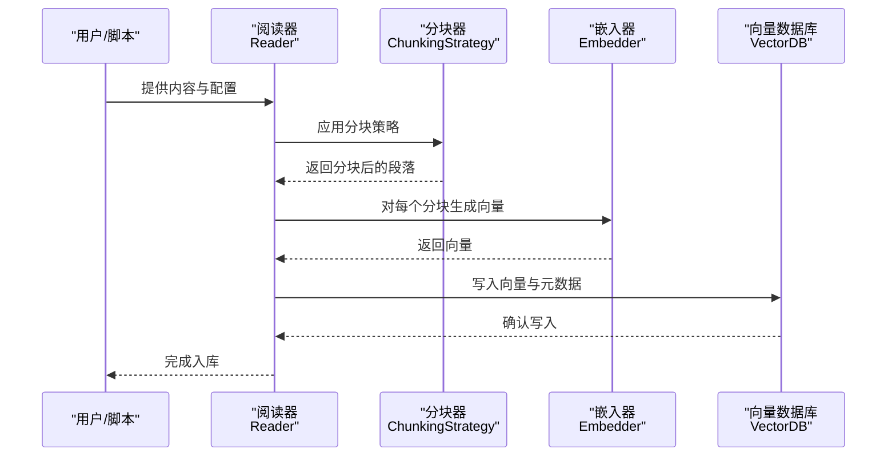
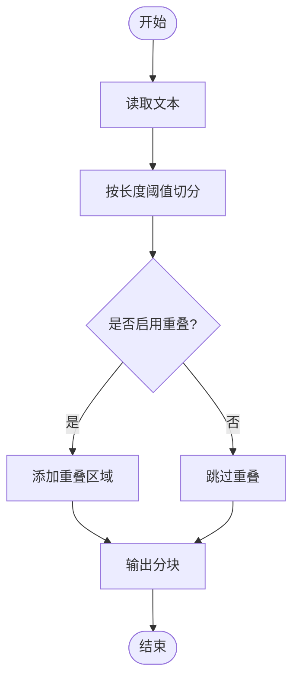
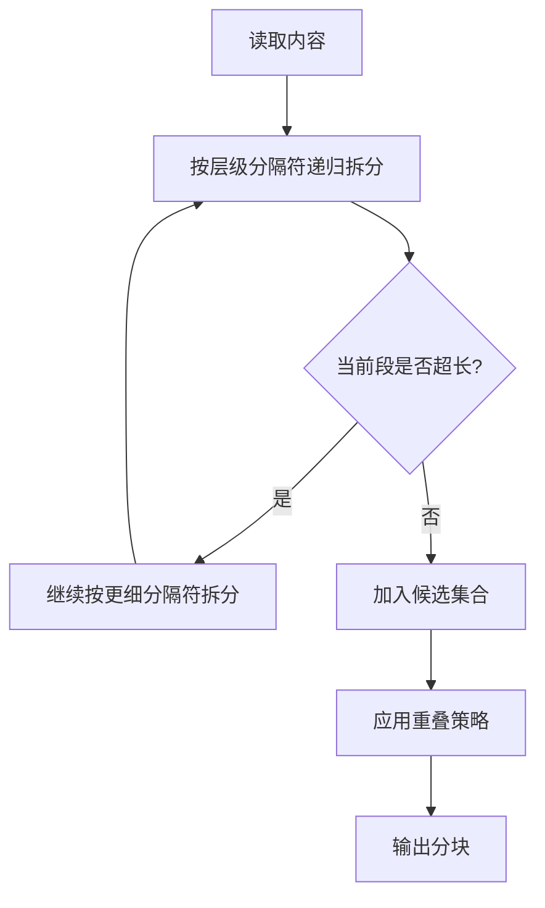
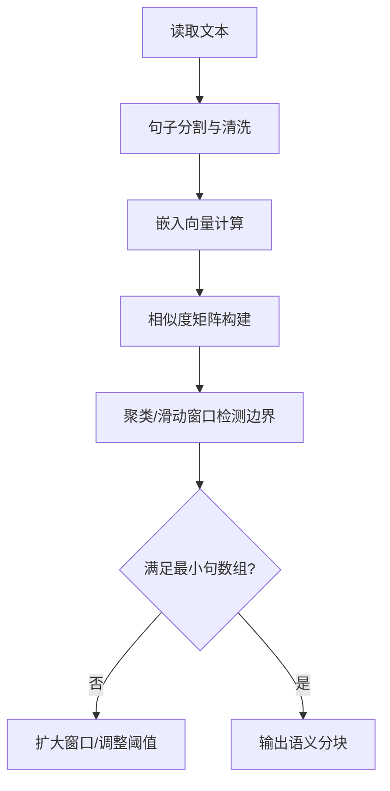
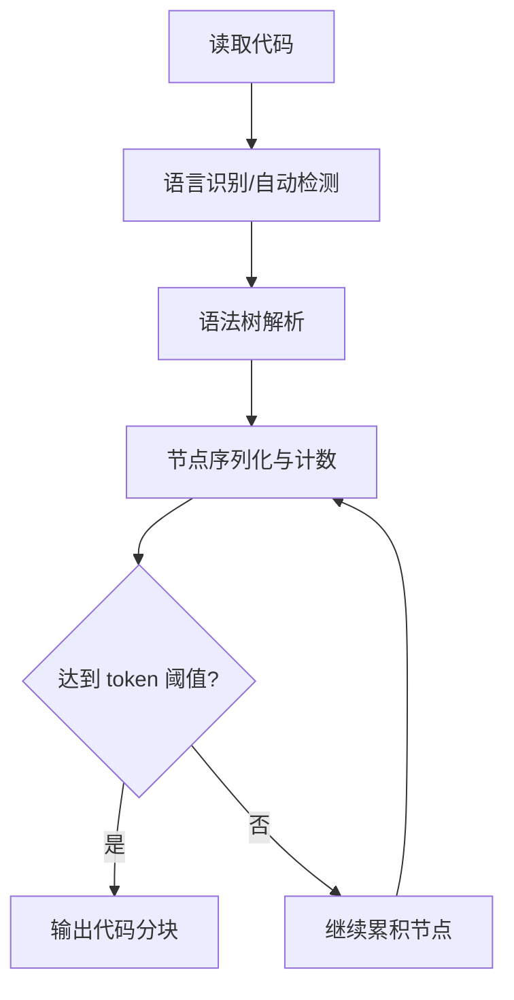
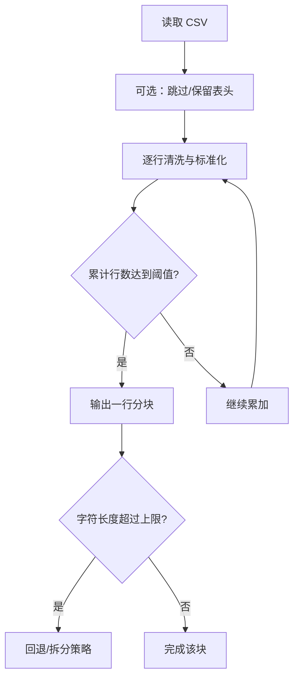

# 分块策略

<cite>
**本文引用的文件**
- [cookbook/knowledge/chunking.mdx](file://cookbook/knowledge/chunking.mdx)
- [examples/knowledge/chunking/fixed-size-chunking.mdx](file://examples/knowledge/chunking/fixed-size-chunking.mdx)
- [examples/knowledge/chunking/recursive-chunking.mdx](file://examples/knowledge/chunking/recursive-chunking.mdx)
- [examples/knowledge/chunking/document-chunking.mdx](file://examples/knowledge/chunking/document-chunking.mdx)
- [examples/knowledge/chunking/markdown-chunking.mdx](file://examples/knowledge/chunking/markdown-chunking.mdx)
- [examples/knowledge/chunking/code-chunking.mdx](file://examples/knowledge/chunking/code-chunking.mdx)
- [examples/knowledge/chunking/csv-row-chunking.mdx](file://examples/knowledge/chunking/csv-row-chunking.mdx)
- [examples/knowledge/chunking/agentic-chunking.mdx](file://examples/knowledge/chunking/agentic-chunking.mdx)
- [examples/knowledge/chunking/semantic-chunking-agno-embedder.mdx](file://examples/knowledge/chunking/semantic-chunking-agno-embedder.mdx)
- [examples/knowledge/chunking/semantic-chunking-chonkie-embedder.mdx](file://examples/knowledge/chunking/semantic-chunking-chonkie-embedder.mdx)
- [_snippets/chunking-fixed-size.mdx](file://_snippets/chunking-fixed-size.mdx)
- [_snippets/chunking-recursive.mdx](file://_snippets/chunking-recursive.mdx)
- [_snippets/chunking-document.mdx](file://_snippets/chunking-document.mdx)
- [_snippets/chunking-markdown.mdx](file://_snippets/chunking-markdown.mdx)
- [_snippets/chunking-code.mdx](file://_snippets/chunking-code.mdx)
- [_snippets/chunking-csv-row.mdx](file://_snippets/chunking-csv-row.mdx)
- [_snippets/chunking-semantic.mdx](file://_snippets/chunking-semantic.mdx)
- [_snippets/chunking-custom.mdx](file://_snippets/chunking-custom.mdx)
- [knowledge/concepts/chunking/csv-row-chunking.mdx](file://knowledge/concepts/chunking/csv-row-chunking.mdx)
- [reference/knowledge/chunking/csv-row.mdx](file://reference/knowledge/chunking/csv-row.mdx)
- [_snippets/base-reader-reference.mdx](file://_snippets/base-reader-reference.mdx)
</cite>

## 目录
1. [简介](#简介)
2. [项目结构](#项目结构)
3. [核心组件](#核心组件)
4. [架构总览](#架构总览)
5. [详细组件分析](#详细组件分析)
6. [依赖关系分析](#依赖关系分析)
7. [性能考量](#性能考量)
8. [故障排查指南](#故障排查指南)
9. [结论](#结论)
10. [附录](#附录)

## 简介
本文件系统化梳理知识库构建中的“分块策略”，覆盖固定大小分块、递归分块、语义分块、代码分块、Markdown 分块、CSV 行分块等常见方法；解释各策略的适用场景、优缺点与性能影响；提供参数调优建议（重叠率、最大长度、分块算法选择）；给出自定义分块策略的实现思路与最佳实践，并说明分块质量对检索效果的影响及优化技巧。

## 项目结构
围绕分块策略的相关文档分布在以下位置：
- 教程与示例：cookbook 与 examples 下的 chunking 子目录，涵盖多种分块策略的使用范式与参数说明
- 参考与片段：_snippets 中按策略整理的参数表格，便于快速查阅
- 概念与参考页：knowledge/concepts 与 reference 下的分块相关页面，补充背景与细节

```mermaid
graph TB
A["教程与示例<br/>cookbook/knowledge/chunking.mdx"] --> B["固定大小分块示例<br/>examples/knowledge/chunking/fixed-size-chunking.mdx"]
A --> C["递归分块示例<br/>examples/knowledge/chunking/recursive-chunking.mdx"]
A --> D["文档分块示例<br/>examples/knowledge/chunking/document-chunking.mdx"]
A --> E["Markdown 分块示例<br/>examples/knowledge/chunking/markdown-chunking.mdx"]
A --> F["代码分块示例<br/>examples/knowledge/chunking/code-chunking.mdx"]
A --> G["CSV 行分块示例<br/>examples/knowledge/chunking/csv-row-chunking.mdx"]
A --> H["语义分块示例<br/>examples/knowledge/chunking/semantic-chunking-*.mdx"]
A --> I["智能体驱动分块示例<br/>examples/knowledge/chunking/agentic-chunking.mdx"]
J["_snippets 参数表<br/>_snippets/chunking-*.mdx"] --> B
J --> C
J --> D
J --> E
J --> F
J --> G
J --> H
J --> I
K["概念与参考<br/>knowledge/concepts/chunking/*"] --> G
L["参考页<br/>reference/knowledge/chunking/csv-row.mdx"] --> G
```

**图表来源**
- [cookbook/knowledge/chunking.mdx](file://cookbook/knowledge/chunking.mdx)
- [examples/knowledge/chunking/fixed-size-chunking.mdx](file://examples/knowledge/chunking/fixed-size-chunking.mdx)
- [examples/knowledge/chunking/recursive-chunking.mdx](file://examples/knowledge/chunking/recursive-chunking.mdx)
- [examples/knowledge/chunking/document-chunking.mdx](file://examples/knowledge/chunking/document-chunking.mdx)
- [examples/knowledge/chunking/markdown-chunking.mdx](file://examples/knowledge/chunking/markdown-chunking.mdx)
- [examples/knowledge/chunking/code-chunking.mdx](file://examples/knowledge/chunking/code-chunking.mdx)
- [examples/knowledge/chunking/csv-row-chunking.mdx](file://examples/knowledge/chunking/csv-row-chunking.mdx)
- [examples/knowledge/chunking/semantic-chunking-agno-embedder.mdx](file://examples/knowledge/chunking/semantic-chunking-agno-embedder.mdx)
- [examples/knowledge/chunking/semantic-chunking-chonkie-embedder.mdx](file://examples/knowledge/chunking/semantic-chunking-chonkie-embedder.mdx)
- [examples/knowledge/chunking/agentic-chunking.mdx](file://examples/knowledge/chunking/agentic-chunking.mdx)
- [_snippets/chunking-*.mdx](file://_snippets/chunking-*.mdx)
- [knowledge/concepts/chunking/csv-row-chunking.mdx](file://knowledge/concepts/chunking/csv-row-chunking.mdx)
- [reference/knowledge/chunking/csv-row.mdx](file://reference/knowledge/chunking/csv-row.mdx)

**章节来源**
- [cookbook/knowledge/chunking.mdx](file://cookbook/knowledge/chunking.mdx)
- [examples/knowledge/chunking/fixed-size-chunking.mdx](file://examples/knowledge/chunking/fixed-size-chunking.mdx)
- [examples/knowledge/chunking/recursive-chunking.mdx](file://examples/knowledge/chunking/recursive-chunking.mdx)
- [examples/knowledge/chunking/document-chunking.mdx](file://examples/knowledge/chunking/document-chunking.mdx)
- [examples/knowledge/chunking/markdown-chunking.mdx](file://examples/knowledge/chunking/markdown-chunking.mdx)
- [examples/knowledge/chunking/code-chunking.mdx](file://examples/knowledge/chunking/code-chunking.mdx)
- [examples/knowledge/chunking/csv-row-chunking.mdx](file://examples/knowledge/chunking/csv-row-chunking.mdx)
- [examples/knowledge/chunking/semantic-chunking-agno-embedder.mdx](file://examples/knowledge/chunking/semantic-chunking-agno-embedder.mdx)
- [examples/knowledge/chunking/semantic-chunking-chonkie-embedder.mdx](file://examples/knowledge/chunking/semantic-chunking-chonkie-embedder.mdx)
- [examples/knowledge/chunking/agentic-chunking.mdx](file://examples/knowledge/chunking/agentic-chunking.mdx)
- [_snippets/chunking-*.mdx](file://_snippets/chunking-*.mdx)
- [knowledge/concepts/chunking/csv-row-chunking.mdx](file://knowledge/concepts/chunking/csv-row-chunking.mdx)
- [reference/knowledge/chunking/csv-row.mdx](file://reference/knowledge/chunking/csv-row.mdx)

## 核心组件
- 固定大小分块：以字符或 token 数量为上限进行等宽切分，适合统一长度需求与快速处理
- 递归分块：基于层级分隔符逐步拆分，兼顾结构与长度控制
- 文档分块：面向通用文本的分块策略，强调可读性与上下文完整性
- Markdown 分块：针对 Markdown 内容的结构化分块，保留标题、列表等结构
- 代码分块：面向源代码的 AST 或语法树感知分块，提升代码理解一致性
- CSV 行分块：按行数切分，保证记录完整性，适用于结构化数据
- 语义分块：基于嵌入相似度聚合并检测边界，提升语义连贯性
- 自定义分块：通过指定分隔符等方式实现灵活的规则分块

上述策略在示例与参数片段中均有对应实现与参数说明，便于直接复用与调优。

**章节来源**
- [_snippets/chunking-fixed-size.mdx](file://_snippets/chunking-fixed-size.mdx)
- [_snippets/chunking-recursive.mdx](file://_snippets/chunking-recursive.mdx)
- [_snippets/chunking-document.mdx](file://_snippets/chunking-document.mdx)
- [_snippets/chunking-markdown.mdx](file://_snippets/chunking-markdown.mdx)
- [_snippets/chunking-code.mdx](file://_snippets/chunking-code.mdx)
- [_snippets/chunking-csv-row.mdx](file://_snippets/chunking-csv-row.mdx)
- [_snippets/chunking-semantic.mdx](file://_snippets/chunking-semantic.mdx)
- [_snippets/chunking-custom.mdx](file://_snippets/chunking-custom.mdx)

## 架构总览
下图展示从“输入内容”到“向量化存储”的端到端流程，以及分块策略在其中的位置与交互：

**图表来源**
- [examples/knowledge/chunking/semantic-chunking-agno-embedder.mdx](file://examples/knowledge/chunking/semantic-chunking-agno-embedder.mdx)
- [examples/knowledge/chunking/semantic-chunking-chonkie-embedder.mdx](file://examples/knowledge/chunking/semantic-chunking-chonkie-embedder.mdx)
- [examples/knowledge/chunking/code-chunking.mdx](file://examples/knowledge/chunking/code-chunking.mdx)
- [examples/knowledge/chunking/markdown-chunking.mdx](file://examples/knowledge/chunking/markdown-chunking.mdx)
- [examples/knowledge/chunking/csv-row-chunking.mdx](file://examples/knowledge/chunking/csv-row-chunking.mdx)

## 详细组件分析

### 固定大小分块
- 适用场景：需要稳定长度、快速入库、对结构要求不高的纯文本
- 优点：实现简单、性能稳定、可控性强
- 缺点：可能破坏句子/段落完整性，导致语义断裂
- 关键参数：chunk_size、overlap
- 性能影响：chunk_size 越大，单段向量越长，召回更易聚合但可能丢失局部细节；overlap 增加会提高召回但增加向量数量与存储/计算开销

**图表来源**
- [_snippets/chunking-fixed-size.mdx](file://_snippets/chunking-fixed-size.mdx)
- [_snippets/chunking-document.mdx](file://_snippets/chunking-document.mdx)
- [_snippets/chunking-markdown.mdx](file://_snippets/chunking-markdown.mdx)

**章节来源**
- [_snippets/chunking-fixed-size.mdx](file://_snippets/chunking-fixed-size.mdx)
- [_snippets/chunking-document.mdx](file://_snippets/chunking-document.mdx)
- [_snippets/chunking-markdown.mdx](file://_snippets/chunking-markdown.mdx)
- [examples/knowledge/chunking/fixed-size-chunking.mdx](file://examples/knowledge/chunking/fixed-size-chunking.mdx)
- [examples/knowledge/chunking/document-chunking.mdx](file://examples/knowledge/chunking/document-chunking.mdx)
- [examples/knowledge/chunking/markdown-chunking.mdx](file://examples/knowledge/chunking/markdown-chunking.mdx)

### 递归分块
- 适用场景：富文本/结构化文本，需保留层级结构同时控制长度
- 优点：兼顾结构与长度，减少跨层级切分
- 缺点：分隔符设计与层级匹配影响效果
- 关键参数：chunk_size、overlap
- 性能影响：合理分隔符可降低碎片化，提升检索语义一致性

**图表来源**
- [_snippets/chunking-recursive.mdx](file://_snippets/chunking-recursive.mdx)

**章节来源**
- [_snippets/chunking-recursive.mdx](file://_snippets/chunking-recursive.mdx)
- [examples/knowledge/chunking/recursive-chunking.mdx](file://examples/knowledge/chunking/recursive-chunking.mdx)

### 语义分块
- 适用场景：追求语义连贯性的长文档、论文、报告
- 优点：基于相似度聚类，保持语义边界清晰
- 缺点：计算成本较高，参数敏感
- 关键参数：embedder、chunk_size、similarity_threshold、similarity_window、min_sentences_per_chunk、delimiters、include_delimiters、skip_window、filter_window、filter_polyorder、filter_tolerance、chunker_params
- 性能影响：相似度阈值与窗口参数直接影响分块数量与边界质量；过滤器参数影响边界检测稳定性

**图表来源**
- [_snippets/chunking-semantic.mdx](file://_snippets/chunking-semantic.mdx)

**章节来源**
- [_snippets/chunking-semantic.mdx](file://_snippets/chunking-semantic.mdx)
- [examples/knowledge/chunking/semantic-chunking-agno-embedder.mdx](file://examples/knowledge/chunking/semantic-chunking-agno-embedder.mdx)
- [examples/knowledge/chunking/semantic-chunking-chonkie-embedder.mdx](file://examples/knowledge/chunking/semantic-chunking-chonkie-embedder.mdx)

### 代码分块
- 适用场景：源代码、配置文件、技术文档
- 优点：利用语言解析结构，提升代码理解一致性
- 缺点：对解析器与语言支持有依赖
- 关键参数：tokenizer、chunk_size、language、include_nodes、chunker_params
- 性能影响：tokenizer 与 chunk_size 影响向量维度与召回粒度；include_nodes 会引入额外结构信息但需注意存储与处理成本

**图表来源**
- [_snippets/chunking-code.mdx](file://_snippets/chunking-code.mdx)

**章节来源**
- [_snippets/chunking-code.mdx](file://_snippets/chunking-code.mdx)
- [examples/knowledge/chunking/code-chunking.mdx](file://examples/knowledge/chunking/code-chunking.mdx)

### Markdown 分块
- 适用场景：Markdown 文档，需保留标题、列表、表格等结构
- 优点：结构感知强，适合知识库与文档检索
- 缺点：结构复杂时需精细分隔符设计
- 关键参数：chunk_size、overlap
- 性能影响：合理的结构分隔符可显著提升检索命中质量

**章节来源**
- [_snippets/chunking-markdown.mdx](file://_snippets/chunking-markdown.mdx)
- [examples/knowledge/chunking/markdown-chunking.mdx](file://examples/knowledge/chunking/markdown-chunking.mdx)

### CSV 行分块
- 适用场景：结构化数据，需按记录（行）切分，保证记录完整性
- 优点：天然保持记录边界，适合数据分析与检索
- 缺点：对长记录可能导致单块过大
- 关键参数：rows_per_chunk、skip_header、clean_rows、include_header_in_chunks、max_chunk_size
- 性能影响：rows_per_chunk 与 max_chunk_size 共同决定入库吞吐与查询效率

**图表来源**
- [_snippets/chunking-csv-row.mdx](file://_snippets/chunking-csv-row.mdx)
- [knowledge/concepts/chunking/csv-row-chunking.mdx](file://knowledge/concepts/chunking/csv-row-chunking.mdx)
- [reference/knowledge/chunking/csv-row.mdx](file://reference/knowledge/chunking/csv-row.mdx)

**章节来源**
- [_snippets/chunking-csv-row.mdx](file://_snippets/chunking-csv-row.mdx)
- [knowledge/concepts/chunking/csv-row-chunking.mdx](file://knowledge/concepts/chunking/csv-row-chunking.mdx)
- [reference/knowledge/chunking/csv-row.mdx](file://reference/knowledge/chunking/csv-row.mdx)
- [examples/knowledge/chunking/csv-row-chunking.mdx](file://examples/knowledge/chunking/csv-row-chunking.mdx)

### 自定义分块
- 适用场景：特殊格式、领域规范、业务规则
- 方法：通过指定分隔符将内容切分为规则块
- 关键参数：separator
- 性能影响：分隔符设计直接影响块内语义完整性与块间关联性

**章节来源**
- [_snippets/chunking-custom.mdx](file://_snippets/chunking-custom.mdx)

### 智能体驱动分块（可选）
- 适用场景：需要根据任务目标动态调整分块粒度与边界
- 方法：由智能体模型参与分块决策
- 关键参数：model、max_chunk_size 等
- 性能影响：推理成本上升，但可提升任务相关性

**章节来源**
- [examples/knowledge/chunking/agentic-chunking.mdx](file://examples/knowledge/chunking/agentic-chunking.mdx)

## 依赖关系分析
- 分块策略与阅读器 Reader 的耦合：Reader 通常内置默认分块策略与参数，可通过配置切换
- 嵌入器与分块策略的耦合：语义分块依赖嵌入器；代码/Markdown 等分块可独立于嵌入器
- 向量数据库与分块结果的耦合：分块数量与长度直接影响入库性能与查询开销

**图表来源**
- [_snippets/base-reader-reference.mdx](file://_snippets/base-reader-reference.mdx)
- [examples/knowledge/chunking/semantic-chunking-agno-embedder.mdx](file://examples/knowledge/chunking/semantic-chunking-agno-embedder.mdx)
- [examples/knowledge/chunking/code-chunking.mdx](file://examples/knowledge/chunking/code-chunking.mdx)

**章节来源**
- [_snippets/base-reader-reference.mdx](file://_snippets/base-reader-reference.mdx)

## 性能考量
- 单块长度与召回质量：较长块更易捕获上下文，但可能稀释相关性；较短块提升局部相关性但易丢失全局语境
- 重叠率权衡：适度重叠可提升召回，但会线性增加向量数量与存储/计算成本
- 语义分块的成本：相似度计算与边界检测带来额外开销，需结合硬件与数据规模评估
- 结构化数据：CSV 行分块优先保证记录完整性，必要时配合 fallback 长度限制
- 代码分块：合理选择 tokenizer 与 chunk_size，避免单块过大；include_nodes 仅在需要结构信息时开启

## 故障排查指南
- 常见问题
  - 分块后检索召回不足：检查 chunk_size 是否过小导致语义断裂，或 overlap 是否过低
  - 语义分块边界异常：调整 similarity_threshold、similarity_window、filter 系列参数
  - 代码分块语义不连贯：确认 language 设置与 tokenizer 选择是否匹配
  - CSV 行分块记录被截断：增大 rows_per_chunk 或启用 include_header_in_chunks 并设置 max_chunk_size
- 排查步骤
  - 逐步缩小范围：先用固定大小分块验证整体流程，再切换到语义/代码等策略
  - 对比不同策略：在同一数据集上对比不同分块策略的检索效果
  - 观察向量维度与数量：确保 chunk_size 与 overlap 的组合在硬件预算内

**章节来源**
- [_snippets/chunking-semantic.mdx](file://_snippets/chunking-semantic.mdx)
- [_snippets/chunking-code.mdx](file://_snippets/chunking-code.mdx)
- [_snippets/chunking-csv-row.mdx](file://_snippets/chunking-csv-row.mdx)
- [_snippets/chunking-fixed-size.mdx](file://_snippets/chunking-fixed-size.mdx)

## 结论
分块策略是知识检索系统的“地基”。正确选择与调优分块策略，能在保证检索质量的同时平衡性能与成本。建议以固定大小分块作为基线，结合业务场景逐步引入递归、语义、代码、Markdown、CSV 行等策略，并通过参数网格搜索与 A/B 实验持续优化。

## 附录
- 参数速查
  - 固定大小/递归/文档/Markdown：chunk_size、overlap
  - 语义分块：embedder、chunk_size、similarity_threshold、similarity_window、min_sentences_per_chunk、delimiters、include_delimiters、skip_window、filter_window、filter_polyorder、filter_tolerance、chunker_params
  - 代码分块：tokenizer、chunk_size、language、include_nodes、chunker_params
  - CSV 行分块：rows_per_chunk、skip_header、clean_rows、include_header_in_chunks、max_chunk_size
  - 自定义分块：separator

**章节来源**
- [_snippets/chunking-*.mdx](file://_snippets/chunking-*.mdx)