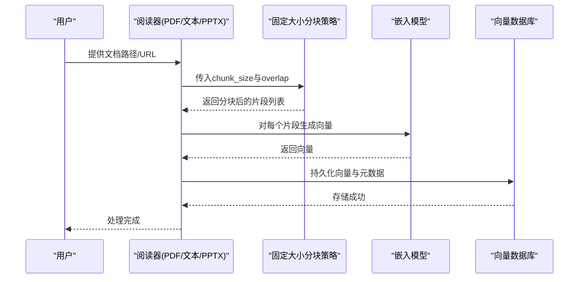
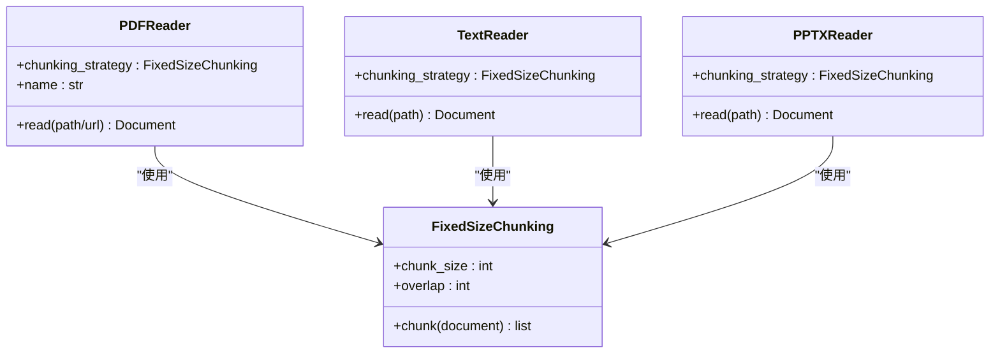
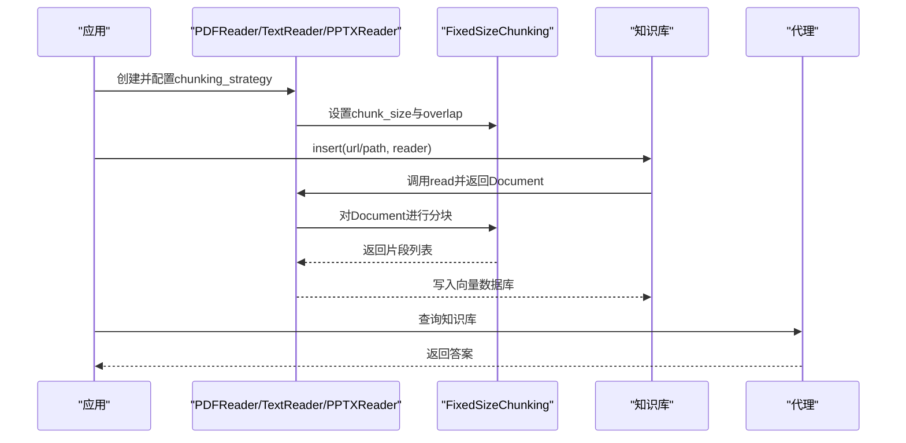
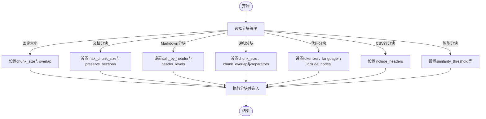
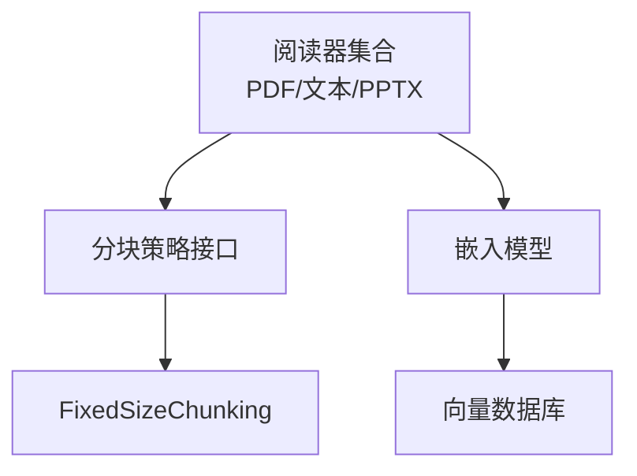

# 固定大小分块

<cite>
**本文引用的文件**
- [fixed-size.mdx](file://reference/knowledge/chunking/fixed-size.mdx)
- [chunking-fixed-size.mdx](file://_snippets/chunking-fixed-size.mdx)
- [chunking.mdx](file://cookbook/knowledge/chunking.mdx)
- [fixed-size-chunking.mdx](file://examples/knowledge/chunking/fixed-size-chunking.mdx)
- [fixed-size-chunking.mdx](file://knowledge/concepts/chunking/fixed-size-chunking.mdx)
- [pdf-reader.mdx](file://knowledge/concepts/readers/pdf-reader.mdx)
- [pdf-reader-reference.mdx](file://_snippets/pdf-reader-reference.mdx)
- [text-reader-reference.mdx](file://_snippets/text-reader-reference.mdx)
- [pptx-reader-reference.mdx](file://_snippets/pptx-reader-reference.mdx)
- [chunking-document.mdx](file://_snippets/chunking-document.mdx)
- [chunking-markdown.mdx](file://_snippets/chunking-markdown.mdx)
- [chunking-recursive.mdx](file://_snippets/chunking-recursive.mdx)
- [chunking-code.mdx](file://_snippets/chunking-code.mdx)
- [chunking-csv-row.mdx](file://_snippets/chunking-csv-row.mdx)
- [chunking-agentic.mdx](file://_snippets/chunking-agentic.mdx)
- [base-reader-reference.mdx](file://_snippets/base-reader-reference.mdx)
</cite>

## 目录
1. [简介](#简介)
2. [项目结构](#项目结构)
3. [核心组件](#核心组件)
4. [架构总览](#架构总览)
5. [详细组件分析](#详细组件分析)
6. [依赖关系分析](#依赖关系分析)
7. [性能考量](#性能考量)
8. [故障排查指南](#故障排查指南)
9. [结论](#结论)
10. [附录](#附录)

## 简介
固定大小分块是一种按固定字符数（或词数/标记数）将文档切分为等长片段的策略，并可选地在相邻片段之间设置重叠区域。该策略简单直接，适合大规模文档的快速处理与统一嵌入，便于控制向量数据库中的单条记录大小与内存占用。

## 项目结构
本仓库围绕“知识体系”与“分块策略”提供了多处关于固定大小分块的参考与示例，主要分布在以下位置：
- 参考文档：固定大小分块的概念与参数说明
- 示例文档：在 PDF 阅读器、文本阅读器、PPTX 阅读器等场景下的使用方式
- 烹饪书示例：分块策略的综合演示与运行说明
- 参数片段：各阅读器与分块策略的参数表

```mermaid
graph TB
A["固定大小分块参考<br/>reference/knowledge/chunking/fixed-size.mdx"] --> B["参数片段<br/>_snippets/chunking-fixed-size.mdx"]
C["烹饪书示例<br/>cookbook/knowledge/chunking.mdx"] --> D["固定大小分块示例<br/>examples/knowledge/chunking/fixed-size-chunking.mdx"]
E["概念示例<br/>knowledge/concepts/chunking/fixed-size-chunking.mdx"] --> D
F["PDF 阅读器概念<br/>knowledge/concepts/readers/pdf-reader.mdx"] --> D
G["阅读器参数片段<br/>_snippets/pdf-reader-reference.mdx"] --> D
H["其他阅读器参数片段<br/>_snippets/text-reader-reference.mdx"] --> D
I["其他阅读器参数片段<br/>_snippets/pptx-reader-reference.mdx"] --> D
J["通用分块参数片段<br/>_snippets/chunking-document.mdx"] --> B
K["通用分块参数片段<br/>_snippets/chunking-markdown.mdx"] --> B
L["通用分块参数片段<br/>_snippets/chunking-recursive.mdx"] --> B
M["通用分块参数片段<br/>_snippets/chunking-code.mdx"] --> B
N["通用分块参数片段<br/>_snippets/chunking-csv-row.mdx"] --> B
O["通用分块参数片段<br/>_snippets/chunking-agentic.mdx"] --> B
P["基础阅读器参数片段<br/>_snippets/base-reader-reference.mdx"] --> D
```

**图表来源**
- [fixed-size.mdx:1-11](file://reference/knowledge/chunking/fixed-size.mdx#L1-L11)
- [chunking-fixed-size.mdx:1-5](file://_snippets/chunking-fixed-size.mdx#L1-L5)
- [chunking.mdx:68-82](file://cookbook/knowledge/chunking.mdx#L68-L82)
- [fixed-size-chunking.mdx:1-48](file://examples/knowledge/chunking/fixed-size-chunking.mdx#L1-L48)
- [fixed-size-chunking.mdx:1-61](file://knowledge/concepts/chunking/fixed-size-chunking.mdx#L1-L61)
- [pdf-reader.mdx:1-78](file://knowledge/concepts/readers/pdf-reader.mdx#L1-L78)
- [pdf-reader-reference.mdx](file://_snippets/pdf-reader-reference.mdx)
- [text-reader-reference.mdx](file://_snippets/text-reader-reference.mdx)
- [pptx-reader-reference.mdx](file://_snippets/pptx-reader-reference.mdx)
- [chunking-document.mdx:1-5](file://_snippets/chunking-document.mdx#L1-L5)
- [chunking-markdown.mdx:1-5](file://_snippets/chunking-markdown.mdx#L1-L5)
- [chunking-recursive.mdx:1-5](file://_snippets/chunking-recursive.mdx#L1-L5)
- [chunking-code.mdx:1-5](file://_snippets/chunking-code.mdx#L1-L5)
- [chunking-csv-row.mdx:1-5](file://_snippets/chunking-csv-row.mdx#L1-L5)
- [chunking-agentic.mdx:1-5](file://_snippets/chunking-agentic.mdx#L1-L5)
- [base-reader-reference.mdx](file://_snippets/base-reader-reference.mdx)

**章节来源**
- [fixed-size.mdx:1-11](file://reference/knowledge/chunking/fixed-size.mdx#L1-L11)
- [chunking.mdx:68-82](file://cookbook/knowledge/chunking.mdx#L68-L82)

## 核心组件
- 分块策略类：FixedSizeChunking（固定大小分块）
- 阅读器：PDFReader、TextReader、PPTXReader 等，均支持通过 chunking_strategy 传入分块策略
- 向量数据库：PgVector 等，用于存储嵌入后的文档片段

关键参数
- chunk_size：每个片段的最大长度（字符/词/标记数，取决于具体实现）
- overlap：相邻片段之间的重叠字符数（可选）

这些参数在多个片段中均有定义，适用于不同内容类型的阅读器与分块策略。

**章节来源**
- [chunking-fixed-size.mdx:1-5](file://_snippets/chunking-fixed-size.mdx#L1-L5)
- [chunking-document.mdx:1-5](file://_snippets/chunking-document.mdx#L1-L5)
- [chunking-markdown.mdx:1-5](file://_snippets/chunking-markdown.mdx#L1-L5)
- [chunking-recursive.mdx:1-5](file://_snippets/chunking-recursive.mdx#L1-L5)
- [chunking-code.mdx:1-5](file://_snippets/chunking-code.mdx#L1-L5)
- [chunking-csv-row.mdx:1-5](file://_snippets/chunking-csv-row.mdx#L1-L5)
- [chunking-agentic.mdx:1-5](file://_snippets/chunking-agentic.mdx#L1-L5)
- [base-reader-reference.mdx](file://_snippets/base-reader-reference.mdx)

## 架构总览
固定大小分块在知识系统中的工作流如下：阅读器从源文档提取文本，应用固定大小分块策略生成片段，随后进行嵌入与持久化到向量数据库，最后由代理或检索模块查询使用。

**图表来源**
- [fixed-size-chunking.mdx:1-48](file://examples/knowledge/chunking/fixed-size-chunking.mdx#L1-L48)
- [chunking.mdx:68-82](file://cookbook/knowledge/chunking.mdx#L68-L82)
- [pdf-reader.mdx:1-78](file://knowledge/concepts/readers/pdf-reader.mdx#L1-L78)

## 详细组件分析

### 组件一：固定大小分块策略（FixedSizeChunking）
- 功能概述：按指定长度切分文档，支持相邻片段重叠，保证处理效率与可控的片段规模
- 关键参数
  - chunk_size：片段最大长度（字符/词/标记）
  - overlap：片段间重叠字符数
- 典型用法：在 PDFReader、TextReader、PPTXReader 等阅读器中通过 chunking_strategy 传入

**图表来源**
- [chunking.mdx:68-82](file://cookbook/knowledge/chunking.mdx#L68-L82)
- [fixed-size-chunking.mdx:1-61](file://knowledge/concepts/chunking/fixed-size-chunking.mdx#L1-L61)
- [pdf-reader-reference.mdx](file://_snippets/pdf-reader-reference.mdx)
- [text-reader-reference.mdx](file://_snippets/text-reader-reference.mdx)
- [pptx-reader-reference.mdx](file://_snippets/pptx-reader-reference.mdx)

**章节来源**
- [chunking-fixed-size.mdx:1-5](file://_snippets/chunking-fixed-size.mdx#L1-L5)
- [chunking.mdx:68-82](file://cookbook/knowledge/chunking.mdx#L68-L82)
- [fixed-size-chunking.mdx:1-61](file://knowledge/concepts/chunking/fixed-size-chunking.mdx#L1-L61)

### 组件二：阅读器与分块策略的集成
- PDFReader：支持固定大小分块，常用于长文档（如简历、报告、论文）的快速切分
- TextReader：适合纯文本文件的固定大小分块
- PPTXReader：适合演示文稿的固定大小分块

**图表来源**
- [fixed-size-chunking.mdx:1-48](file://examples/knowledge/chunking/fixed-size-chunking.mdx#L1-L48)
- [pdf-reader.mdx:1-78](file://knowledge/concepts/readers/pdf-reader.mdx#L1-L78)
- [chunking.mdx:68-82](file://cookbook/knowledge/chunking.mdx#L68-L82)

**章节来源**
- [fixed-size-chunking.mdx:1-48](file://examples/knowledge/chunking/fixed-size-chunking.mdx#L1-L48)
- [pdf-reader.mdx:1-78](file://knowledge/concepts/readers/pdf-reader.mdx#L1-L78)

### 组件三：参数配置与默认值
- 固定大小分块参数
  - chunk_size：默认值在不同片段中可能不同，需以具体实现为准
  - overlap：默认通常为 0，可根据上下文连续性需求调整
- 其他分块策略参数对比（用于理解相对差异）
  - 文档分块：max_chunk_size、preserve_sections
  - Markdown 分块：split_by_header、header_levels
  - 递归分块：chunk_size、chunk_overlap、separators
  - 代码分块：tokenizer、language、include_nodes
  - CSV 行分块：include_headers
  - 智能分块：similarity_threshold、similarity_window、min_sentences_per_chunk

**图表来源**
- [chunking-document.mdx:1-5](file://_snippets/chunking-document.mdx#L1-L5)
- [chunking-markdown.mdx:1-5](file://_snippets/chunking-markdown.mdx#L1-L5)
- [chunking-recursive.mdx:1-5](file://_snippets/chunking-recursive.mdx#L1-L5)
- [chunking-code.mdx:1-5](file://_snippets/chunking-code.mdx#L1-L5)
- [chunking-csv-row.mdx:1-5](file://_snippets/chunking-csv-row.mdx#L1-L5)
- [chunking-agentic.mdx:1-5](file://_snippets/chunking-agentic.mdx#L1-L5)
- [chunking-fixed-size.mdx:1-5](file://_snippets/chunking-fixed-size.mdx#L1-L5)

**章节来源**
- [chunking-document.mdx:1-5](file://_snippets/chunking-document.mdx#L1-L5)
- [chunking-markdown.mdx:1-5](file://_snippets/chunking-markdown.mdx#L1-L5)
- [chunking-recursive.mdx:1-5](file://_snippets/chunking-recursive.mdx#L1-L5)
- [chunking-code.mdx:1-5](file://_snippets/chunking-code.mdx#L1-L5)
- [chunking-csv-row.mdx:1-5](file://_snippets/chunking-csv-row.mdx#L1-L5)
- [chunking-agentic.mdx:1-5](file://_snippets/chunking-agentic.mdx#L1-L5)
- [chunking-fixed-size.mdx:1-5](file://_snippets/chunking-fixed-size.mdx#L1-L5)

## 依赖关系分析
- 阅读器依赖分块策略：通过 chunking_strategy 接口注入
- 分块策略独立于具体文档格式：同一策略可用于 PDF、文本、PPTX 等
- 嵌入与向量数据库：分块后统一进行嵌入与持久化

**图表来源**
- [chunking.mdx:68-82](file://cookbook/knowledge/chunking.mdx#L68-L82)
- [fixed-size-chunking.mdx:1-61](file://knowledge/concepts/chunking/fixed-size-chunking.mdx#L1-L61)

**章节来源**
- [chunking.mdx:68-82](file://cookbook/knowledge/chunking.mdx#L68-L82)
- [fixed-size-chunking.mdx:1-61](file://knowledge/concepts/chunking/fixed-size-chunking.mdx#L1-L61)

## 性能考量
- 时间复杂度：固定大小分块的时间复杂度近似线性于文档长度，空间复杂度与片段数量相关
- 内存占用：chunk_size 越大，单片段越大，嵌入向量维度越高；overlap 增加会提高片段数量与存储开销
- 向量数据库写入：大批量插入时建议批量提交与索引优化
- 检索效率：较小的 chunk_size 有助于更精确的匹配，但会增加向量数量；较大的 chunk_size 降低向量数量，但可能丢失细粒度信息

## 故障排查指南
- 片段过短或过长
  - 症状：检索结果不准确或上下文不足
  - 处理：调整 chunk_size，结合 overlap 提升上下文连续性
- 重叠设置不当
  - 症状：检索边界出现语义断裂
  - 处理：适当增大 overlap，确保跨片段语义连贯
- 不同内容类型的最佳实践
  - PDF/长文档：chunk_size 可设为较大值，overlap 设为 chunk_size 的 10%-20%
  - 文本文件：根据段落长度设定 chunk_size，避免截断句子
  - PPTX：按幻灯片或段落切分，避免将标题与正文强行切分
- 基础阅读器参数
  - 阅读器通常也支持 chunk_size 参数，用于统一控制分块行为

**章节来源**
- [base-reader-reference.mdx](file://_snippets/base-reader-reference.mdx)
- [chunking-fixed-size.mdx:1-5](file://_snippets/chunking-fixed-size.mdx#L1-L5)

## 结论
固定大小分块策略以简单、可控的方式将文档切分为等长片段，并可通过 overlap 保留必要的上下文连续性。它在大规模文档处理与统一嵌入方面具有优势，但在语义连续性与结构保持方面不如基于语义或结构的分块策略。合理配置 chunk_size 与 overlap 并结合内容类型选择合适的分块策略，是提升检索精度与系统性能的关键。

## 附录
- 实际示例路径
  - 固定大小分块示例脚本：[fixed-size-chunking.mdx:1-48](file://examples/knowledge/chunking/fixed-size-chunking.mdx#L1-L48)
  - 烹饪书示例（含多种分块策略）：[chunking.mdx:68-82](file://cookbook/knowledge/chunking.mdx#L68-L82)
- 参考文档
  - 固定大小分块参考：[fixed-size.mdx:1-11](file://reference/knowledge/chunking/fixed-size.mdx#L1-L11)
  - 概念示例：[fixed-size-chunking.mdx:1-61](file://knowledge/concepts/chunking/fixed-size-chunking.mdx#L1-L61)
- 阅读器参数参考
  - PDF 阅读器参数：[pdf-reader-reference.mdx](file://_snippets/pdf-reader-reference.mdx)
  - 文本阅读器参数：[text-reader-reference.mdx](file://_snippets/text-reader-reference.mdx)
  - PPTX 阅读器参数：[pptx-reader-reference.mdx](file://_snippets/pptx-reader-reference.mdx)