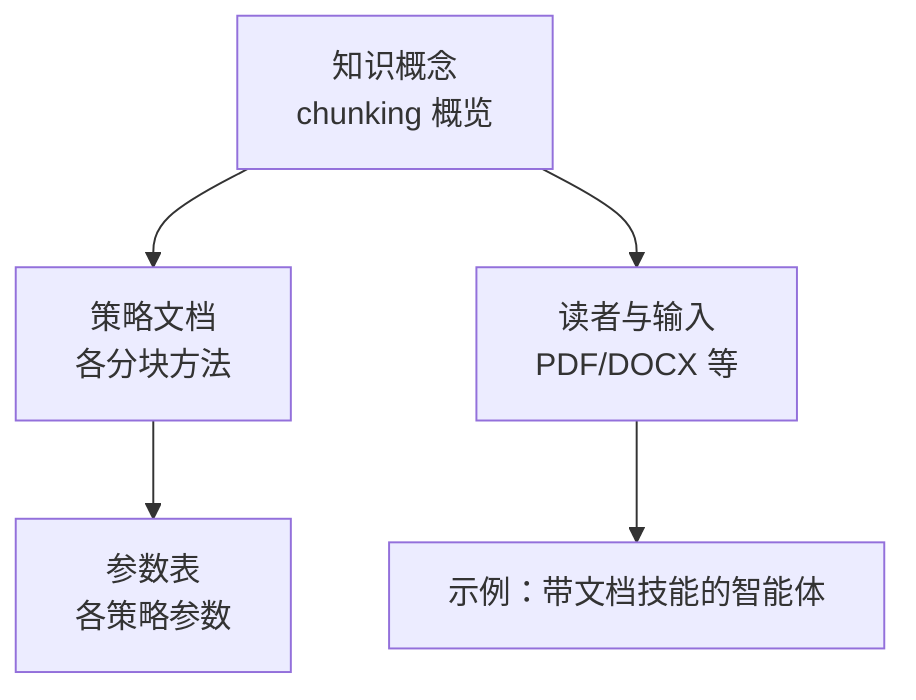
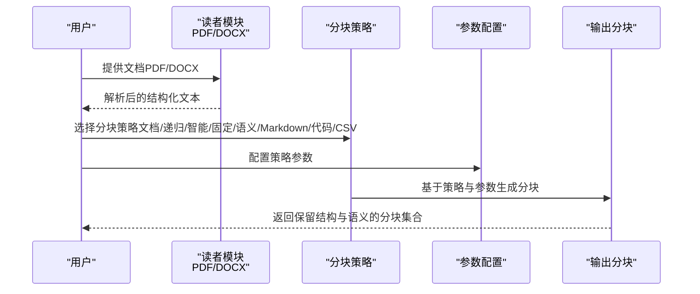
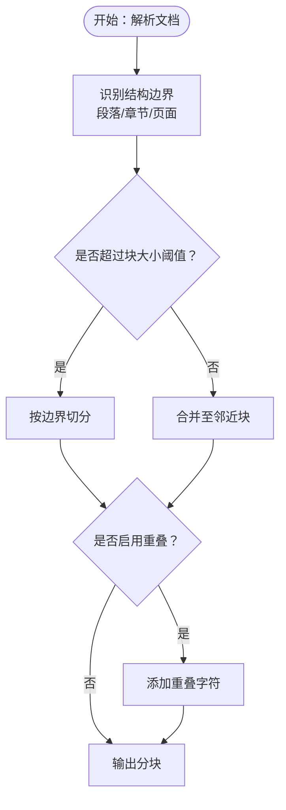
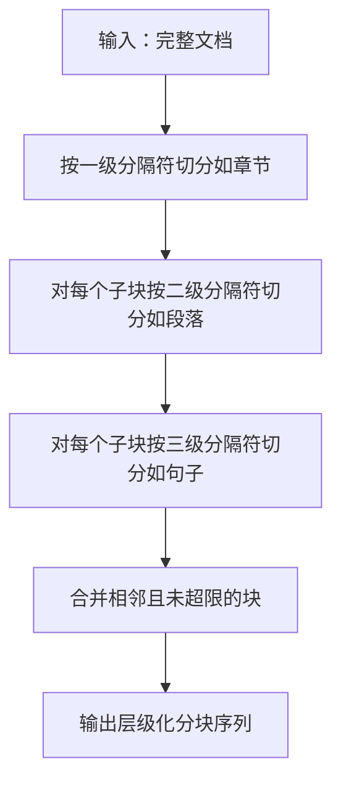
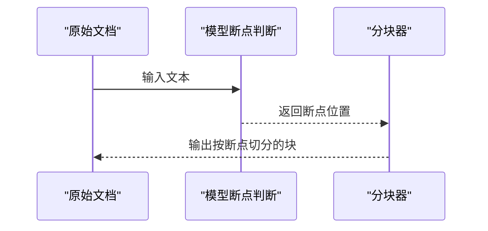
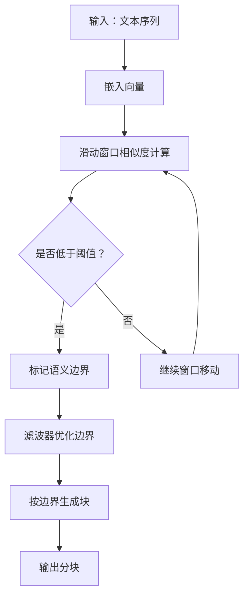
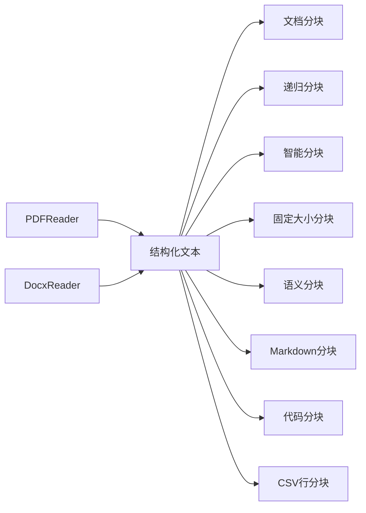

# 文档分块

<cite>
**本文引用的文件**
- [reference/knowledge/chunking/document.mdx](file://reference/knowledge/chunking/document.mdx)
- [_snippets/chunking-document.mdx](file://_snippets/chunking-document.mdx)
- [reference/knowledge/chunking/recursive.mdx](file://reference/knowledge/chunking/recursive.mdx)
- [_snippets/chunking-recursive.mdx](file://_snippets/chunking-recursive.mdx)
- [reference/knowledge/chunking/agentic.mdx](file://reference/knowledge/chunking/agentic.mdx)
- [_snippets/chunking-agentic.mdx](file://_snippets/chunking-agentic.mdx)
- [reference/knowledge/chunking/fixed-size.mdx](file://reference/knowledge/chunking/fixed-size.mdx)
- [_snippets/chunking-fixed-size.mdx](file://_snippets/chunking-fixed-size.mdx)
- [reference/knowledge/chunking/semantic.mdx](file://reference/knowledge/chunking/semantic.mdx)
- [_snippets/chunking-semantic.mdx](file://_snippets/chunking-semantic.mdx)
- [reference/knowledge/chunking/markdown.mdx](file://reference/knowledge/chunking/markdown.mdx)
- [_snippets/chunking-markdown.mdx](file://_snippets/chunking-markdown.mdx)
- [reference/knowledge/chunking/code.mdx](file://reference/knowledge/chunking/code.mdx)
- [reference/knowledge/chunking/csv-row.mdx](file://reference/knowledge/chunking/csv-row.mdx)
- [reference/knowledge/reader/docx.mdx](file://reference/knowledge/reader/docx.mdx)
- [reference/knowledge/reader/pdf.mdx](file://reference/knowledge/reader/pdf.mdx)
- [examples/models/anthropic/skills/agent-with-documents.mdx](file://examples/models/anthropic/skills/agent-with-documents.mdx)
- [knowledge/concepts/chunking/overview.mdx](file://knowledge/concepts/chunking/overview.mdx)
</cite>

## 目录
1. [引言](#引言)
2. [项目结构](#项目结构)
3. [核心组件](#核心组件)
4. [架构总览](#架构总览)
5. [详细组件分析](#详细组件分析)
6. [依赖关系分析](#依赖关系分析)
7. [性能考量](#性能考量)
8. [故障排查指南](#故障排查指南)
9. [结论](#结论)
10. [附录](#附录)

## 引言
本技术文档聚焦“文档分块”策略，系统阐述如何在不破坏原始文档结构与层级的前提下，对PDF、Word等格式化文档进行高效分块，以提升检索准确性与上下文完整性。我们将从策略原理、参数配置、典型场景到复杂布局处理等方面展开，并给出不同文档类型的分块策略建议。

## 项目结构
围绕“文档分块”的知识与示例分布在以下位置：
- 策略概览与参考：knowledge/concepts/chunking/overview.mdx
- 各分块策略文档与参数表：reference/knowledge/chunking/*.mdx 及其对应的 _snippets/chunking-*.mdx
- 读者与输入：reference/knowledge/reader/*.mdx
- 示例：examples/models/anthropic/skills/agent-with-documents.mdx

**图表来源**
- [knowledge/concepts/chunking/overview.mdx:28-62](file://knowledge/concepts/chunking/overview.mdx#L28-L62)
- [reference/knowledge/chunking/document.mdx:1-9](file://reference/knowledge/chunking/document.mdx#L1-L9)
- [reference/knowledge/chunking/semantic.mdx:1-12](file://reference/knowledge/chunking/semantic.mdx#L1-L12)
- [reference/knowledge/reader/pdf.mdx:1-8](file://reference/knowledge/reader/pdf.mdx#L1-L8)
- [reference/knowledge/reader/docx.mdx:1-8](file://reference/knowledge/reader/docx.mdx#L1-L8)
- [examples/models/anthropic/skills/agent-with-documents.mdx:54-94](file://examples/models/anthropic/skills/agent-with-documents.mdx#L54-L94)

**章节来源**
- [knowledge/concepts/chunking/overview.mdx:28-62](file://knowledge/concepts/chunking/overview.mdx#L28-L62)

## 核心组件
- 文档分块（Document Chunking）：基于文档结构（段落、章节）进行自然切分，避免固定字符数切分，适合保留语义与上下文。
- 递归分块（Recursive Chunking）：通过多级分隔符递归应用策略，适于长文档的层级化切分。
- 智能分块（Agentic Chunking）：利用模型自动识别文本中的自然断点（如段落与主题转换），优于固定长度切分。
- 固定大小分块（Fixed Size Chunking）：按指定字符数切分，可设置重叠，便于统一处理。
- 语义分块（Semantic Chunking）：基于嵌入相似度检测语义边界，结合窗口与过滤器参数，提升相关性与连贯性。
- Markdown 分块：依据标题、段落等结构进行切分，适合文档型内容。
- 代码分块（Code Chunking）：基于 AST 的函数、类、块边界进行切分，保留代码语义。
- CSV 行分块（CSV Row Chunking）：按行切分为块，保证记录完整性。

**章节来源**
- [reference/knowledge/chunking/document.mdx:1-9](file://reference/knowledge/chunking/document.mdx#L1-L9)
- [reference/knowledge/chunking/recursive.mdx:1-11](file://reference/knowledge/chunking/recursive.mdx#L1-L11)
- [reference/knowledge/chunking/agentic.mdx:1-10](file://reference/knowledge/chunking/agentic.mdx#L1-L10)
- [reference/knowledge/chunking/fixed-size.mdx:1-11](file://reference/knowledge/chunking/fixed-size.mdx#L1-L11)
- [reference/knowledge/chunking/semantic.mdx:1-12](file://reference/knowledge/chunking/semantic.mdx#L1-L12)
- [reference/knowledge/chunking/markdown.mdx:1-10](file://reference/knowledge/chunking/markdown.mdx#L1-L10)
- [reference/knowledge/chunking/code.mdx:1-12](file://reference/knowledge/chunking/code.mdx#L1-L12)
- [reference/knowledge/chunking/csv-row.mdx:1-10](file://reference/knowledge/chunking/csv-row.mdx#L1-L10)

## 架构总览
下图展示了“输入文档 → 选择分块策略 → 参数配置 → 输出分块”的整体流程，以及与读者模块的衔接。

**图表来源**
- [reference/knowledge/reader/pdf.mdx:1-8](file://reference/knowledge/reader/pdf.mdx#L1-L8)
- [reference/knowledge/reader/docx.mdx:1-8](file://reference/knowledge/reader/docx.mdx#L1-L8)
- [reference/knowledge/chunking/document.mdx:1-9](file://reference/knowledge/chunking/document.mdx#L1-L9)
- [reference/knowledge/chunking/semantic.mdx:1-12](file://reference/knowledge/chunking/semantic.mdx#L1-L12)
- [reference/knowledge/chunking/recursive.mdx:1-11](file://reference/knowledge/chunking/recursive.mdx#L1-L11)
- [reference/knowledge/chunking/agentic.mdx:1-10](file://reference/knowledge/chunking/agentic.mdx#L1-L10)
- [reference/knowledge/chunking/fixed-size.mdx:1-11](file://reference/knowledge/chunking/fixed-size.mdx#L1-L11)
- [reference/knowledge/chunking/markdown.mdx:1-10](file://reference/knowledge/chunking/markdown.mdx#L1-L10)
- [reference/knowledge/chunking/code.mdx:1-12](file://reference/knowledge/chunking/code.mdx#L1-L12)
- [reference/knowledge/chunking/csv-row.mdx:1-10](file://reference/knowledge/chunking/csv-row.mdx#L1-L10)

## 详细组件分析

### 文档分块（Document Chunking）
- 设计目标：在保留章节、页面、段落等结构信息的前提下进行切分，避免破坏原始文档的层级与语义。
- 适用场景：PDF、Word等格式化文档；需要保持标题、段落、列表等结构的检索与问答。
- 关键参数（示意）：
  - chunk_size：每块最大字符数
  - overlap：块间重叠字符数
- 处理要点：
  - 优先识别文档结构边界（如段落、小节、页面），再按阈值切分。
  - 对复杂表格、图片说明等非正文区域，应单独处理或排除在正文分块之外。
- 检索收益：结构化分块更贴近人类阅读顺序，提升检索召回与定位精度。

**图表来源**
- [reference/knowledge/chunking/document.mdx:1-9](file://reference/knowledge/chunking/document.mdx#L1-L9)
- [_snippets/chunking-document.mdx:1-5](file://_snippets/chunking-document.mdx#L1-L5)

**章节来源**
- [reference/knowledge/chunking/document.mdx:1-9](file://reference/knowledge/chunking/document.mdx#L1-L9)
- [_snippets/chunking-document.mdx:1-5](file://_snippets/chunking-document.mdx#L1-L5)

### 递归分块（Recursive Chunking）
- 设计目标：通过多级分隔符（如标题、段落、句子）逐层切分，形成层级化的块序列。
- 适用场景：长文档（手册、论文）、需要多粒度检索的文档。
- 关键参数（示意）：
  - chunk_size：每块最大字符数
  - overlap：块间重叠字符数
- 处理要点：
  - 先大后小：先按大结构（如章节）切分，再在小结构（如段落）内进一步切分。
  - 控制层级深度，避免过细导致碎片化。

**图表来源**
- [reference/knowledge/chunking/recursive.mdx:1-11](file://reference/knowledge/chunking/recursive.mdx#L1-L11)
- [_snippets/chunking-recursive.mdx:1-5](file://_snippets/chunking-recursive.mdx#L1-L5)

**章节来源**
- [reference/knowledge/chunking/recursive.mdx:1-11](file://reference/knowledge/chunking/recursive.mdx#L1-L11)
- [_snippets/chunking-recursive.mdx:1-5](file://_snippets/chunking-recursive.mdx#L1-L5)

### 智能分块（Agentic Chunking）
- 设计目标：使用模型自动判断文本中的自然断点（段落、主题转换），减少人工规则误差。
- 适用场景：内容复杂、主题频繁切换的文档。
- 关键参数（示意）：
  - model：用于断点判断的模型
  - max_chunk_size：最大块大小
- 处理要点：
  - 断点由模型语义理解决定，适合非线性结构文档。
  - 结合重叠策略，确保跨断点的上下文连续性。

**图表来源**
- [reference/knowledge/chunking/agentic.mdx:1-10](file://reference/knowledge/chunking/agentic.mdx#L1-L10)
- [_snippets/chunking-agentic.mdx:1-5](file://_snippets/chunking-agentic.mdx#L1-L5)

**章节来源**
- [reference/knowledge/chunking/agentic.mdx:1-10](file://reference/knowledge/chunking/agentic.mdx#L1-L10)
- [_snippets/chunking-agentic.mdx:1-5](file://_snippets/chunking-agentic.mdx#L1-L5)

### 固定大小分块（Fixed Size Chunking）
- 设计目标：按固定字符数切分，简单稳定，便于批处理。
- 适用场景：统一处理、快速原型、对结构要求不高的场景。
- 关键参数（示意）：
  - chunk_size：每块大小
  - overlap：块间重叠
- 处理要点：
  - 重叠有助于跨边界上下文拼接。
  - 与结构无关，需配合后处理（如去噪、重排）提升质量。

**章节来源**
- [reference/knowledge/chunking/fixed-size.mdx:1-11](file://reference/knowledge/chunking/fixed-size.mdx#L1-L11)
- [_snippets/chunking-fixed-size.mdx:1-5](file://_snippets/chunking-fixed-size.mdx#L1-L5)

### 语义分块（Semantic Chunking）
- 设计目标：基于嵌入相似度检测语义边界，使语义相关的内容尽量保持在同一块中。
- 适用场景：长文档、主题变化频繁但语义连贯的文本。
- 关键参数（示意）：
  - embedder：嵌入模型配置
  - chunk_size：最大令牌数
  - similarity_threshold：相似度阈值
  - similarity_window：相似度计算窗口
  - min_sentences_per_chunk：每块最少句数
  - min_characters_per_sentence：最小句长
  - delimiters：句末分隔符
  - include_delimiters：分隔符归属策略
  - skip_window：跳过窗口（允许合并非连续相似组）
  - filter_window/filter_polyorder/filter_tolerance：边界检测滤波器参数
  - chunker_params：传递给底层分块器的额外参数
- 处理要点：
  - 通过滤波器与窗口参数平衡“连贯性”和“分割粒度”。
  - 低阈值产生更大块，高阈值产生更多细粒度块。

**图表来源**
- [reference/knowledge/chunking/semantic.mdx:1-12](file://reference/knowledge/chunking/semantic.mdx#L1-L12)
- [_snippets/chunking-semantic.mdx:1-16](file://_snippets/chunking-semantic.mdx#L1-L16)

**章节来源**
- [reference/knowledge/chunking/semantic.mdx:1-12](file://reference/knowledge/chunking/semantic.mdx#L1-L12)
- [_snippets/chunking-semantic.mdx:1-16](file://_snippets/chunking-semantic.mdx#L1-L16)

### Markdown 分块（Markdown Chunking）
- 设计目标：依据标题、段落等结构进行切分，适合文档型内容。
- 适用场景：技术文档、手册、博客等 Markdown 内容。
- 关键参数（示意）：
  - chunk_size：每块最大字符数
  - overlap：块间重叠字符数
- 处理要点：
  - 优先尊重标题层级，避免跨层级切分造成语义断裂。

**章节来源**
- [reference/knowledge/chunking/markdown.mdx:1-10](file://reference/knowledge/chunking/markdown.mdx#L1-L10)
- [_snippets/chunking-markdown.mdx:1-5](file://_snippets/chunking-markdown.mdx#L1-L5)

### 代码分块（Code Chunking）
- 设计目标：基于 AST 的函数、类、块边界进行切分，保留代码语义。
- 适用场景：源码库、API 文档、技术规范。
- 处理要点：
  - 优先按函数/类边界切分，其次按块与注释切分。
  - 注意保留导入、注释与元数据的上下文。

**章节来源**
- [reference/knowledge/chunking/code.mdx:1-12](file://reference/knowledge/chunking/code.mdx#L1-L12)

### CSV 行分块（CSV Row Chunking）
- 设计目标：按行切分，保证单条记录的完整性。
- 适用场景：结构化数据检索、报表分析。
- 处理要点：
  - 首行通常为表头，需单独处理或作为元信息保留。

**章节来源**
- [reference/knowledge/chunking/csv-row.mdx:1-10](file://reference/knowledge/chunking/csv-row.mdx#L1-L10)

## 依赖关系分析
- 策略与参数：
  - 文档分块依赖于输入文档的结构解析能力（标题、段落、页面）。
  - 语义分块依赖嵌入模型与相似度计算参数。
  - 智能分块依赖模型断点判断能力。
- 与读者模块的关系：
  - PDF/DOCX 等输入经由对应 Reader 解析为结构化文本，再进入分块策略。
- 与检索系统的耦合：
  - 更贴近原文结构的分块策略能显著提升检索召回与定位精度。

**图表来源**
- [reference/knowledge/reader/pdf.mdx:1-8](file://reference/knowledge/reader/pdf.mdx#L1-L8)
- [reference/knowledge/reader/docx.mdx:1-8](file://reference/knowledge/reader/docx.mdx#L1-L8)
- [reference/knowledge/chunking/document.mdx:1-9](file://reference/knowledge/chunking/document.mdx#L1-L9)
- [reference/knowledge/chunking/recursive.mdx:1-11](file://reference/knowledge/chunking/recursive.mdx#L1-L11)
- [reference/knowledge/chunking/agentic.mdx:1-10](file://reference/knowledge/chunking/agentic.mdx#L1-L10)
- [reference/knowledge/chunking/fixed-size.mdx:1-11](file://reference/knowledge/chunking/fixed-size.mdx#L1-L11)
- [reference/knowledge/chunking/semantic.mdx:1-12](file://reference/knowledge/chunking/semantic.mdx#L1-L12)
- [reference/knowledge/chunking/markdown.mdx:1-10](file://reference/knowledge/chunking/markdown.mdx#L1-L10)
- [reference/knowledge/chunking/code.mdx:1-12](file://reference/knowledge/chunking/code.mdx#L1-L12)
- [reference/knowledge/chunking/csv-row.mdx:1-10](file://reference/knowledge/chunking/csv-row.mdx#L1-L10)

**章节来源**
- [reference/knowledge/reader/pdf.mdx:1-8](file://reference/knowledge/reader/pdf.mdx#L1-L8)
- [reference/knowledge/reader/docx.mdx:1-8](file://reference/knowledge/reader/docx.mdx#L1-L8)
- [reference/knowledge/chunking/document.mdx:1-9](file://reference/knowledge/chunking/document.mdx#L1-L9)
- [reference/knowledge/chunking/semantic.mdx:1-12](file://reference/knowledge/chunking/semantic.mdx#L1-L12)

## 性能考量
- 计算开销
  - 语义分块与智能分块的嵌入计算与模型推理成本较高，建议在批量预处理阶段执行。
  - 固定大小分块与递归分块的开销较低，适合实时流式处理。
- 存储与传输
  - 合理设置 chunk_size 与 overlap，在召回质量与存储/网络开销之间取得平衡。
- 并发与缓存
  - 对相同文档的重复分块结果可缓存，避免重复计算。
- 过滤与后处理
  - 去除空白、异常块与重复片段，提升检索质量。

## 故障排查指南
- 分块过多或过少
  - 检查 chunk_size 与 overlap 设置；对于语义分块，调整 similarity_threshold 与 window 参数。
- 上下文断裂
  - 在跨边界处启用重叠；对递归分块增加分隔符层级。
- 结构丢失
  - 使用文档分块或 Markdown 分块；确保标题与段落边界被正确识别。
- 语义漂移
  - 调整嵌入模型与相似度阈值；必要时引入滤波器参数优化边界检测。
- 复杂布局问题
  - 表格、图片说明等非正文区域应独立处理或排除；对混合内容文档采用多策略组合。

## 结论
文档分块的核心在于“结构优先、语义协同”。对 PDF、Word 等格式化文档，优先采用文档分块以保留章节、页面与段落结构；在需要更高语义连贯性的场景下，结合语义分块与智能分块；对长文档与多层次内容，递归分块提供稳健的层级化切分方案。通过合理配置参数与后处理，可在保证检索准确性的同时兼顾性能与可维护性。

## 附录

### 不同类型文档的分块策略配置建议
- 学术论文
  - 推荐：递归分块（按章节→段落→句子）+ 语义分块（增强跨段落连贯性）
  - 关键参数：相似度阈值适中，窗口较大；重叠适度
- 技术手册
  - 推荐：文档分块（保留章节/小节）+ Markdown 分块（标题层级）
  - 关键参数：chunk_size 适中，overlap 较小
- 报告/提案
  - 推荐：文档分块（保留段落与页面）+ 智能分块（断点由模型决定）
  - 关键参数：max_chunk_size 适中，启用重叠
- 源码/规范
  - 推荐：代码分块（AST 边界）+ 语义分块（函数/类级别）
  - 关键参数：保留注释与导入上下文
- 结构化数据（CSV）
  - 推荐：CSV 行分块（按记录切分）
  - 关键参数：首行表头单独处理

### 处理复杂文档布局与格式的技术细节
- 标题与段落
  - 优先识别层级标题与段落边界，避免跨层级切分。
- 表格与公式
  - 将表格/公式作为独立单元处理，必要时抽取为元信息或摘要。
- 图片与脚注
  - 图片说明与脚注可作为补充信息保留在邻近块中，避免孤立。
- 字体与样式
  - 忽略视觉样式差异，仅保留结构化文本；对强调、加粗等语义信息进行统一归一化。