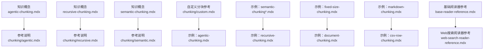
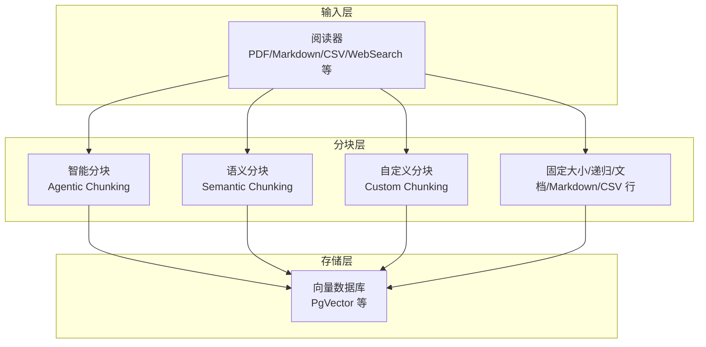
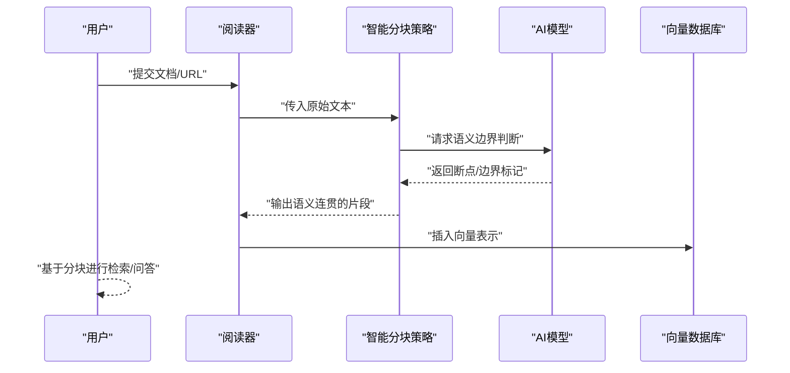
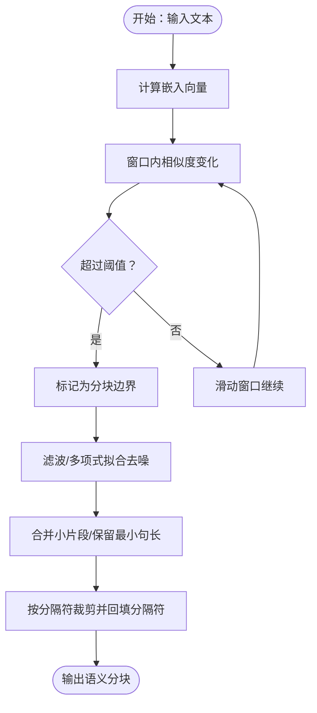
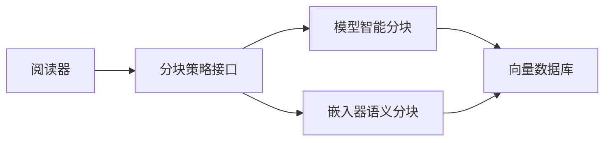

# 智能分块

<cite>
**本文引用的文件**
- [_snippets/chunking-agentic.mdx](file://_snippets/chunking-agentic.mdx)
- [_snippets/chunking-semantic.mdx](file://_snippets/chunking-semantic.mdx)
- [_snippets/chunking-custom.mdx](file://_snippets/chunking-custom.mdx)
- [cookbook/knowledge/chunking.mdx](file://cookbook/knowledge/chunking.mdx)
- [examples/knowledge/chunking/agentic-chunking.mdx](file://examples/knowledge/chunking/agentic-chunking.mdx)
- [examples/knowledge/chunking/semantic-chunking.mdx](file://examples/knowledge/chunking/semantic-chunking.mdx)
- [examples/knowledge/chunking/semantic-chunking-agno-embedder.mdx](file://examples/knowledge/chunking/semantic-chunking-agno-embedder.mdx)
- [examples/knowledge/chunking/semantic-chunking-chonkie-embedder.mdx](file://examples/knowledge/chunking/semantic-chunking-chonkie-embedder.mdx)
- [knowledge/concepts/chunking/agentic-chunking.mdx](file://knowledge/concepts/chunking/agentic-chunking.mdx)
- [knowledge/concepts/chunking/recursive-chunking.mdx](file://knowledge/concepts/chunking/recursive-chunking.mdx)
- [reference/knowledge/chunking/agentic.mdx](file://reference/knowledge/chunking/agentic.mdx)
- [reference/knowledge/chunking/recursive.mdx](file://reference/knowledge/chunking/recursive.mdx)
- [reference/knowledge/chunking/semantic.mdx](file://reference/knowledge/chunking/semantic.mdx)
- [reference/knowledge/chunking/custom.mdx](file://reference/knowledge/chunking/custom.mdx)
- [_snippets/base-reader-reference.mdx](file://_snippets/base-reader-reference.mdx)
- [_snippets/web-search-reader-reference.mdx](file://_snippets/web-search-reader-reference.mdx)
- [examples/knowledge/chunking/recursive-chunking.mdx](file://examples/knowledge/chunking/recursive-chunking.mdx)
- [examples/knowledge/chunking/fixed-size-chunking.mdx](file://examples/knowledge/chunking/fixed-size-chunking.mdx)
- [examples/knowledge/chunking/document-chunking.mdx](file://examples/knowledge/chunking/document-chunking.mdx)
- [examples/knowledge/chunking/markdown-chunking.mdx](file://examples/knowledge/chunking/markdown-chunking.mdx)
- [examples/knowledge/chunking/csv-row-chunking.mdx](file://examples/knowledge/chunking/csv-row-chunking.mdx)
</cite>

## 目录
1. [引言](#引言)
2. [项目结构](#项目结构)
3. [核心组件](#核心组件)
4. [架构总览](#架构总览)
5. [详细组件分析](#详细组件分析)
6. [依赖关系分析](#依赖关系分析)
7. [性能考量](#性能考量)
8. [故障排查指南](#故障排查指南)
9. [结论](#结论)
10. [附录](#附录)

## 引言
本技术文档聚焦“智能分块”策略，系统阐述如何借助AI模型自动识别最优分块边界，依据内容的语义、主题与结构特征进行决策。我们将对比智能分块与传统分块（固定大小、递归、语义）方法的差异，给出提示工程与参数调优建议，并提供多模型配置示例与成本-性能权衡分析。最后总结复杂文档处理场景下的应用实践与最佳实践。

## 项目结构
围绕智能分块，知识库与示例文档提供了多种分块策略的参考实现与用法说明，涵盖概念介绍、参考说明与可运行示例。下图展示与“智能分块”相关的核心文件与组织方式：

图表来源
- [knowledge/concepts/chunking/agentic-chunking.mdx](file://knowledge/concepts/chunking/agentic-chunking.mdx)
- [reference/knowledge/chunking/agentic.mdx](file://reference/knowledge/chunking/agentic.mdx)
- [knowledge/concepts/chunking/recursive-chunking.mdx](file://knowledge/concepts/chunking/recursive-chunking.mdx)
- [reference/knowledge/chunking/recursive.mdx](file://reference/knowledge/chunking/recursive.mdx)
- [reference/knowledge/chunking/semantic.mdx](file://reference/knowledge/chunking/semantic.mdx)
- [reference/knowledge/chunking/custom.mdx](file://reference/knowledge/chunking/custom.mdx)
- [examples/knowledge/chunking/agentic-chunking.mdx](file://examples/knowledge/chunking/agentic-chunking.mdx)
- [examples/knowledge/chunking/semantic-chunking.mdx](file://examples/knowledge/chunking/semantic-chunking.mdx)
- [examples/knowledge/chunking/semantic-chunking-agno-embedder.mdx](file://examples/knowledge/chunking/semantic-chunking-agno-embedder.mdx)
- [examples/knowledge/chunking/semantic-chunking-chonkie-embedder.mdx](file://examples/knowledge/chunking/semantic-chunking-chonkie-embedder.mdx)
- [examples/knowledge/chunking/recursive-chunking.mdx](file://examples/knowledge/chunking/recursive-chunking.mdx)
- [examples/knowledge/chunking/fixed-size-chunking.mdx](file://examples/knowledge/chunking/fixed-size-chunking.mdx)
- [examples/knowledge/chunking/document-chunking.mdx](file://examples/knowledge/chunking/document-chunking.mdx)
- [examples/knowledge/chunking/markdown-chunking.mdx](file://examples/knowledge/chunking/markdown-chunking.mdx)
- [examples/knowledge/chunking/csv-row-chunking.mdx](file://examples/knowledge/chunking/csv-row-chunking.mdx)
- [_snippets/base-reader-reference.mdx](file://_snippets/base-reader-reference.mdx)
- [_snippets/web-search-reader-reference.mdx](file://_snippets/web-search-reader-reference.mdx)

章节来源
- [cookbook/knowledge/chunking.mdx](file://cookbook/knowledge/chunking.mdx)
- [_snippets/base-reader-reference.mdx](file://_snippets/base-reader-reference.mdx)
- [_snippets/web-search-reader-reference.mdx](file://_snippets/web-search-reader-reference.mdx)

## 核心组件
- 智能分块（Agentic Chunking）
  - 基于模型自动判断自然断点，优先考虑段落、主题转换等语义边界，而非固定字符数或简单递归。
  - 参考参数与能力说明见：[chunking-agentic.mdx](file://_snippets/chunking-agentic.mdx)
  - 概念性说明见：[agentic-chunking.mdx](file://knowledge/concepts/chunking/agentic-chunking.mdx)、[reference/knowledge/chunking/agentic.mdx](file://reference/knowledge/chunking/agentic.mdx)
  - 示例用法见：[examples/knowledge/chunking/agentic-chunking.mdx](file://examples/knowledge/chunking/agentic-chunking.mdx)

- 语义分块（Semantic Chunking）
  - 以嵌入向量相似度变化为依据，结合窗口滑动与阈值过滤，识别语义跃迁点，形成连贯语义单元。
  - 参考参数与能力说明见：[chunking-semantic.mdx](file://_snippets/chunking-semantic.mdx)
  - 示例用法与嵌入器切换见：
    - [examples/knowledge/chunking/semantic-chunking.mdx](file://examples/knowledge/chunking/semantic-chunking.mdx)
    - [examples/knowledge/chunking/semantic-chunking-agno-embedder.mdx](file://examples/knowledge/chunking/semantic-chunking-agno-embedder.mdx)
    - [examples/knowledge/chunking/semantic-chunking-chonkie-embedder.mdx](file://examples/knowledge/chunking/semantic-chunking-chonkie-embedder.mdx)

- 自定义分块（Custom Chunking）
  - 提供扩展接口，允许按业务需求定制分隔符、最小句长、过滤窗口等策略。
  - 参考说明见：[chunking-custom.mdx](file://_snippets/chunking-custom.mdx)、[reference/knowledge/chunking/custom.mdx](file://reference/knowledge/chunking/custom.mdx)

- 固定大小/递归/文档/Markdown/CSV 行分块
  - 固定大小与递归作为传统基线策略；文档/Markdown/CSV行分块用于特定格式优化。
  - 示例参考：
    - [examples/knowledge/chunking/fixed-size-chunking.mdx](file://examples/knowledge/chunking/fixed-size-chunking.mdx)
    - [examples/knowledge/chunking/recursive-chunking.mdx](file://examples/knowledge/chunking/recursive-chunking.mdx)
    - [examples/knowledge/chunking/document-chunking.mdx](file://examples/knowledge/chunking/document-chunking.mdx)
    - [examples/knowledge/chunking/markdown-chunking.mdx](file://examples/knowledge/chunking/markdown-chunking.mdx)
    - [examples/knowledge/chunking/csv-row-chunking.mdx](file://examples/knowledge/chunking/csv-row-chunking.mdx)

章节来源
- [_snippets/chunking-agentic.mdx](file://_snippets/chunking-agentic.mdx)
- [_snippets/chunking-semantic.mdx](file://_snippets/chunking-semantic.mdx)
- [_snippets/chunking-custom.mdx](file://_snippets/chunking-custom.mdx)
- [reference/knowledge/chunking/agentic.mdx](file://reference/knowledge/chunking/agentic.mdx)
- [reference/knowledge/chunking/semantic.mdx](file://reference/knowledge/chunking/semantic.mdx)
- [reference/knowledge/chunking/custom.mdx](file://reference/knowledge/chunking/custom.mdx)
- [knowledge/concepts/chunking/agentic-chunking.mdx](file://knowledge/concepts/chunking/agentic-chunking.mdx)
- [examples/knowledge/chunking/agentic-chunking.mdx](file://examples/knowledge/chunking/agentic-chunking.mdx)
- [examples/knowledge/chunking/semantic-chunking.mdx](file://examples/knowledge/chunking/semantic-chunking.mdx)
- [examples/knowledge/chunking/semantic-chunking-agno-embedder.mdx](file://examples/knowledge/chunking/semantic-chunking-agno-embedder.mdx)
- [examples/knowledge/chunking/semantic-chunking-chonkie-embedder.mdx](file://examples/knowledge/chunking/semantic-chunking-chonkie-embedder.mdx)
- [examples/knowledge/chunking/recursive-chunking.mdx](file://examples/knowledge/chunking/recursive-chunking.mdx)
- [examples/knowledge/chunking/fixed-size-chunking.mdx](file://examples/knowledge/chunking/fixed-size-chunking.mdx)
- [examples/knowledge/chunking/document-chunking.mdx](file://examples/knowledge/chunking/document-chunking.mdx)
- [examples/knowledge/chunking/markdown-chunking.mdx](file://examples/knowledge/chunking/markdown-chunking.mdx)
- [examples/knowledge/chunking/csv-row-chunking.mdx](file://examples/knowledge/chunking/csv-row-chunking.mdx)

## 架构总览
下图展示了从“阅读器-分块策略-向量数据库”的典型数据流，体现智能分块在整体RAG流水线中的位置与职责：

图表来源
- [examples/knowledge/chunking/agentic-chunking.mdx](file://examples/knowledge/chunking/agentic-chunking.mdx)
- [examples/knowledge/chunking/semantic-chunking.mdx](file://examples/knowledge/chunking/semantic-chunking.mdx)
- [examples/knowledge/chunking/semantic-chunking-agno-embedder.mdx](file://examples/knowledge/chunking/semantic-chunking-agno-embedder.mdx)
- [examples/knowledge/chunking/semantic-chunking-chonkie-embedder.mdx](file://examples/knowledge/chunking/semantic-chunking-chonkie-embedder.mdx)
- [examples/knowledge/chunking/recursive-chunking.mdx](file://examples/knowledge/chunking/recursive-chunking.mdx)
- [examples/knowledge/chunking/fixed-size-chunking.mdx](file://examples/knowledge/chunking/fixed-size-chunking.mdx)
- [examples/knowledge/chunking/document-chunking.mdx](file://examples/knowledge/chunking/document-chunking.mdx)
- [examples/knowledge/chunking/markdown-chunking.mdx](file://examples/knowledge/chunking/markdown-chunking.mdx)
- [examples/knowledge/chunking/csv-row-chunking.mdx](file://examples/knowledge/chunking/csv-row-chunking.mdx)

## 详细组件分析

### 智能分块（Agentic Chunking）
- 设计理念
  - 通过模型对文本进行上下文理解，自动识别段落、主题转换等语义边界，避免机械切分导致的语义断裂。
  - 适合复杂文档（如论文、报告、合同），提升检索与问答的语义一致性。
- 关键参数与能力
  - 模型选择：支持指定具体模型以驱动分块决策。
  - 参考说明见：[chunking-agentic.mdx](file://_snippets/chunking-agentic.mdx)
- 使用示例
  - 参考示例：[examples/knowledge/chunking/agentic-chunking.mdx](file://examples/knowledge/chunking/agentic-chunking.mdx)
  - 概念说明：[knowledge/concepts/chunking/agentic-chunking.mdx](file://knowledge/concepts/chunking/agentic-chunking.mdx)
  - 参考条目：[reference/knowledge/chunking/agentic.mdx](file://reference/knowledge/chunking/agentic.mdx)

图表来源
- [examples/knowledge/chunking/agentic-chunking.mdx](file://examples/knowledge/chunking/agentic-chunking.mdx)
- [knowledge/concepts/chunking/agentic-chunking.mdx](file://knowledge/concepts/chunking/agentic-chunking.mdx)
- [reference/knowledge/chunking/agentic.mdx](file://reference/knowledge/chunking/agentic.mdx)

章节来源
- [_snippets/chunking-agentic.mdx](file://_snippets/chunking-agentic.mdx)
- [knowledge/concepts/chunking/agentic-chunking.mdx](file://knowledge/concepts/chunking/agentic-chunking.mdx)
- [reference/knowledge/chunking/agentic.mdx](file://reference/knowledge/chunking/agentic.mdx)
- [examples/knowledge/chunking/agentic-chunking.mdx](file://examples/knowledge/chunking/agentic-chunking.mdx)

### 语义分块（Semantic Chunking）
- 设计理念
  - 基于嵌入相似度变化检测语义跃迁，通过窗口滑动与阈值过滤形成稳定语义单元，兼顾连贯性与边界准确性。
- 关键参数与能力
  - 嵌入器：可替换为不同嵌入模型（如内置/Chonkie等）。
  - 参数示例：chunk_size、similarity_threshold、similarity_window、min_sentences_per_chunk、delimiters、include_delimiters、filter_window、filter_polyorder、filter_tolerance 等。
  - 参考说明见：[chunking-semantic.mdx](file://_snippets/chunking-semantic.mdx)
- 使用示例
  - 基础示例：[examples/knowledge/chunking/semantic-chunking.mdx](file://examples/knowledge/chunking/semantic-chunking.mdx)
  - 切换嵌入器示例（内置/Chonkie）：
    - [examples/knowledge/chunking/semantic-chunking-agno-embedder.mdx](file://examples/knowledge/chunking/semantic-chunking-agno-embedder.mdx)
    - [examples/knowledge/chunking/semantic-chunking-chonkie-embedder.mdx](file://examples/knowledge/chunking/semantic-chunking-chonkie-embedder.mdx)
  - 参考条目：[reference/knowledge/chunking/semantic.mdx](file://reference/knowledge/chunking/semantic.mdx)

图表来源
- [_snippets/chunking-semantic.mdx](file://_snippets/chunking-semantic.mdx)
- [examples/knowledge/chunking/semantic-chunking.mdx](file://examples/knowledge/chunking/semantic-chunking.mdx)
- [examples/knowledge/chunking/semantic-chunking-agno-embedder.mdx](file://examples/knowledge/chunking/semantic-chunking-agno-embedder.mdx)
- [examples/knowledge/chunking/semantic-chunking-chonkie-embedder.mdx](file://examples/knowledge/chunking/semantic-chunking-chonkie-embedder.mdx)

章节来源
- [_snippets/chunking-semantic.mdx](file://_snippets/chunking-semantic.mdx)
- [reference/knowledge/chunking/semantic.mdx](file://reference/knowledge/chunking/semantic.mdx)
- [examples/knowledge/chunking/semantic-chunking.mdx](file://examples/knowledge/chunking/semantic-chunking.mdx)
- [examples/knowledge/chunking/semantic-chunking-agno-embedder.mdx](file://examples/knowledge/chunking/semantic-chunking-agno-embedder.mdx)
- [examples/knowledge/chunking/semantic-chunking-chonkie-embedder.mdx](file://examples/knowledge/chunking/semantic-chunking-chonkie-embedder.mdx)

### 自定义分块（Custom Chunking）
- 设计理念
  - 提供灵活扩展点，允许开发者根据领域特性调整分隔符、最小句长、过滤窗口等，适配特殊格式或业务规则。
- 关键参数与能力
  - 参考说明见：[chunking-custom.mdx](file://_snippets/chunking-custom.mdx)、[reference/knowledge/chunking/custom.mdx](file://reference/knowledge/chunking/custom.mdx)

章节来源
- [_snippets/chunking-custom.mdx](file://_snippets/chunking-custom.mdx)
- [reference/knowledge/chunking/custom.mdx](file://reference/knowledge/chunking/custom.mdx)

### 传统分块对比
- 固定大小分块（Fixed Size）
  - 优点：实现简单、速度较快；缺点：易破坏语义边界。
  - 示例参考：[examples/knowledge/chunking/fixed-size-chunking.mdx](file://examples/knowledge/chunking/fixed-size-chunking.mdx)

- 递归分块（Recursive）
  - 优点：按层级分隔符递归切分，更贴合文档结构；缺点：对复杂语义边界敏感度较低。
  - 示例参考：[examples/knowledge/chunking/recursive-chunking.mdx](file://examples/knowledge/chunking/recursive-chunking.mdx)
  - 概念说明：[knowledge/concepts/chunking/recursive-chunking.mdx](file://knowledge/concepts/chunking/recursive-chunking.mdx)
  - 参考条目：[reference/knowledge/chunking/recursive.mdx](file://reference/knowledge/chunking/recursive.mdx)

- 文档/Markdown/CSV 行分块
  - 针对特定格式优化，提升结构化内容的保留度。
  - 示例参考：
    - [examples/knowledge/chunking/document-chunking.mdx](file://examples/knowledge/chunking/document-chunking.mdx)
    - [examples/knowledge/chunking/markdown-chunking.mdx](file://examples/knowledge/chunking/markdown-chunking.mdx)
    - [examples/knowledge/chunking/csv-row-chunking.mdx](file://examples/knowledge/chunking/csv-row-chunking.mdx)

章节来源
- [examples/knowledge/chunking/fixed-size-chunking.mdx](file://examples/knowledge/chunking/fixed-size-chunking.mdx)
- [examples/knowledge/chunking/recursive-chunking.mdx](file://examples/knowledge/chunking/recursive-chunking.mdx)
- [knowledge/concepts/chunking/recursive-chunking.mdx](file://knowledge/concepts/chunking/recursive-chunking.mdx)
- [reference/knowledge/chunking/recursive.mdx](file://reference/knowledge/chunking/recursive.mdx)
- [examples/knowledge/chunking/document-chunking.mdx](file://examples/knowledge/chunking/document-chunking.mdx)
- [examples/knowledge/chunking/markdown-chunking.mdx](file://examples/knowledge/chunking/markdown-chunking.mdx)
- [examples/knowledge/chunking/csv-row-chunking.mdx](file://examples/knowledge/chunking/csv-row-chunking.mdx)

## 依赖关系分析
- 组件耦合
  - 分块策略与阅读器解耦，通过统一的 chunking_strategy 接口注入。
  - 向量数据库仅依赖分块后的文本与嵌入结果，不关心具体分块算法。
- 外部依赖
  - 智能分块依赖所选模型的推理能力；语义分块依赖嵌入器的向量表示质量与相似度计算。
- 典型依赖链
  - 阅读器 → 分块策略 → 嵌入器（语义分块）/模型（智能分块） → 向量数据库

图表来源
- [examples/knowledge/chunking/agentic-chunking.mdx](file://examples/knowledge/chunking/agentic-chunking.mdx)
- [examples/knowledge/chunking/semantic-chunking.mdx](file://examples/knowledge/chunking/semantic-chunking.mdx)
- [examples/knowledge/chunking/semantic-chunking-agno-embedder.mdx](file://examples/knowledge/chunking/semantic-chunking-agno-embedder.mdx)
- [examples/knowledge/chunking/semantic-chunking-chonkie-embedder.mdx](file://examples/knowledge/chunking/semantic-chunking-chonkie-embedder.mdx)

章节来源
- [examples/knowledge/chunking/agentic-chunking.mdx](file://examples/knowledge/chunking/agentic-chunking.mdx)
- [examples/knowledge/chunking/semantic-chunking.mdx](file://examples/knowledge/chunking/semantic-chunking.mdx)
- [examples/knowledge/chunking/semantic-chunking-agno-embedder.mdx](file://examples/knowledge/chunking/semantic-chunking-agno-embedder.mdx)
- [examples/knowledge/chunking/semantic-chunking-chonkie-embedder.mdx](file://examples/knowledge/chunking/semantic-chunking-chonkie-embedder.mdx)

## 性能考量
- 计算开销
  - 智能分块：依赖模型推理，延迟与吞吐取决于模型与批处理策略。
  - 语义分块：嵌入计算与相似度扫描，受 chunk_size 与窗口参数影响。
- 存储与索引
  - 更细粒度的分块提升召回但增加向量数量；更粗粒度降低数量但可能损失精度。
- 成本-性能权衡
  - 低成本：固定大小/递归分块，延迟低、成本可控。
  - 中等成本：语义分块，平衡召回与成本，适合多数场景。
  - 高成本：智能分块，语义质量高但推理成本较高，适合对召回与连贯性要求极高的场景。
- 调优建议
  - 语义分块：先以较大窗口与适中阈值定位边界，再通过滤波与最小句长约束优化碎片质量。
  - 智能分块：优先选择轻量模型或本地部署模型以降低延迟；必要时采用分批/缓存策略。

## 故障排查指南
- 常见问题
  - 分块过碎/过长：调整 chunk_size 与最小句长；检查 delimiters 与 include_delimiters 设置。
  - 语义跳跃不明显：提高 similarity_threshold 或增大 similarity_window；启用滤波 polyorder 与 tolerance。
  - 边界误判：检查分隔符列表是否覆盖原文格式；必要时引入自定义分隔符。
  - 模型推理失败：确认模型可用性与鉴权；适当降低批大小或启用重试。
- 定位手段
  - 对比固定大小与语义分块的结果，观察召回与连贯性差异。
  - 在示例脚本中逐步注释/替换参数，快速定位问题来源。
- 参考示例
  - 语义分块参数对照与切换：[examples/knowledge/chunking/semantic-chunking.mdx](file://examples/knowledge/chunking/semantic-chunking.mdx)、[examples/knowledge/chunking/semantic-chunking-agno-embedder.mdx](file://examples/knowledge/chunking/semantic-chunking-agno-embedder.mdx)、[examples/knowledge/chunking/semantic-chunking-chonkie-embedder.mdx](file://examples/knowledge/chunking/semantic-chunking-chonkie-embedder.mdx)
  - 递归分块示例：[examples/knowledge/chunking/recursive-chunking.mdx](file://examples/knowledge/chunking/recursive-chunking.mdx)

章节来源
- [examples/knowledge/chunking/semantic-chunking.mdx](file://examples/knowledge/chunking/semantic-chunking.mdx)
- [examples/knowledge/chunking/semantic-chunking-agno-embedder.mdx](file://examples/knowledge/chunking/semantic-chunking-agno-embedder.mdx)
- [examples/knowledge/chunking/semantic-chunking-chonkie-embedder.mdx](file://examples/knowledge/chunking/semantic-chunking-chonkie-embedder.mdx)
- [examples/knowledge/chunking/recursive-chunking.mdx](file://examples/knowledge/chunking/recursive-chunking.mdx)

## 结论
智能分块通过模型对语义与结构的理解，显著优于传统分块在复杂文档上的表现。结合语义分块与自定义分块，可在召回、连贯性与成本之间取得良好平衡。建议在实际落地中先以语义分块为默认策略，针对特定领域再引入智能分块或自定义规则，持续迭代参数与提示工程以获得最佳效果。

## 附录
- 配置与参数速查
  - 智能分块（Agentic）：模型选择、断点判定等，参考 [chunking-agentic.mdx](file://_snippets/chunking-agentic.mdx)
  - 语义分块（Semantic）：嵌入器、阈值、窗口、滤波等，参考 [chunking-semantic.mdx](file://_snippets/chunking-semantic.mdx)
  - 自定义分块（Custom）：扩展接口与参数，参考 [chunking-custom.mdx](file://_snippets/chunking-custom.mdx)
- 用法示例索引
  - 智能分块：[examples/knowledge/chunking/agentic-chunking.mdx](file://examples/knowledge/chunking/agentic-chunking.mdx)
  - 语义分块：[examples/knowledge/chunking/semantic-chunking.mdx](file://examples/knowledge/chunking/semantic-chunking.mdx)、[examples/knowledge/chunking/semantic-chunking-agno-embedder.mdx](file://examples/knowledge/chunking/semantic-chunking-agno-embedder.mdx)、[examples/knowledge/chunking/semantic-chunking-chonkie-embedder.mdx](file://examples/knowledge/chunking/semantic-chunking-chonkie-embedder.mdx)
  - 递归/固定大小/文档/Markdown/CSV 行：参考对应示例文件路径
- 阅读器与分块策略关联
  - 基础阅读器参数（chunk_size、separators、chunking_strategy）参考：[_snippets/base-reader-reference.mdx](file://_snippets/base-reader-reference.mdx)
  - Web搜索阅读器默认分块策略参考：[_snippets/web-search-reader-reference.mdx](file://_snippets/web-search-reader-reference.mdx)